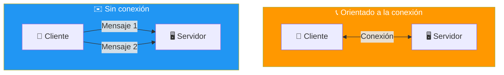
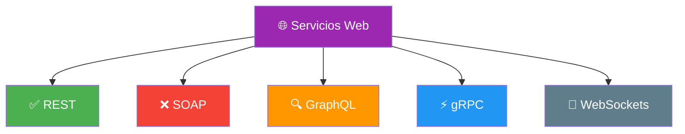
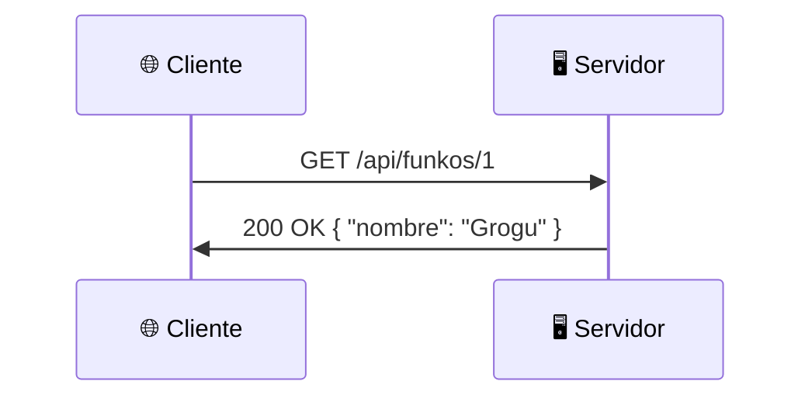
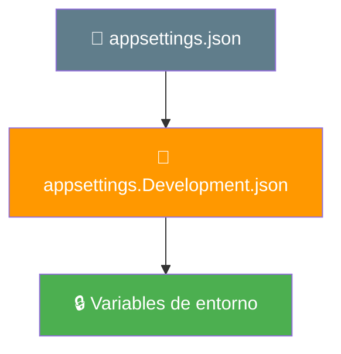
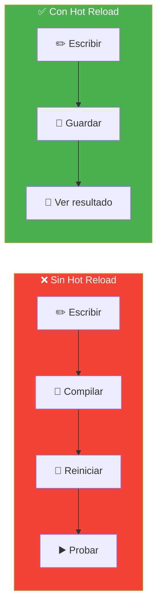

- [1. Conceptos de Servicios Web y Configuración de Proyectos .NET](#1-conceptos-de-servicios-web-y-configuración-de-proyectos-net)
  - [1.1. ¿Qué es un servicio web?](#11-qué-es-un-servicio-web)
    - [1.1.1. Servicios orientados a la conexión vs sin conexión](#111-servicios-orientados-a-la-conexión-vs-sin-conexión)
    - [1.1.2. Arquitecturas de servicios web](#112-arquitecturas-de-servicios-web)
  - [1.2. HTTP: El protocolo de la Web](#12-http-el-protocolo-de-la-web)
    - [1.2.1. Request (Solicitud)](#121-request-solicitud)
    - [1.2.2. Response (Respuesta)](#122-response-respuesta)
    - [1.2.3. Métodos HTTP](#123-métodos-http)
    - [1.2.4. Códigos de estado](#124-códigos-de-estado)
  - [1.3. Estructura de un proyecto .NET](#13-estructura-de-un-proyecto-net)
    - [1.3.1. Soluciones y proyectos](#131-soluciones-y-proyectos)
    - [1.3.2. Crear la estructura desde cero](#132-crear-la-estructura-desde-cero)
    - [1.3.3. Estructura de carpetas resultante](#133-estructura-de-carpetas-resultante)
  - [1.4. NuGet: Gestión de paquetes](#14-nuget-gestión-de-paquetes)
    - [1.4.1. ¿Qué son los paquetes NuGet?](#141-qué-son-los-paquetes-nuget)
    - [1.4.2. Comandos útiles](#142-comandos-útiles)
  - [1.5. Configuración en ASP.NET Core](#15-configuración-en-aspnet-core)
    - [1.5.1. appsettings.json](#151-appsettingsjson)
    - [1.5.2. Variables de entorno y User Secrets](#152-variables-de-entorno-y-user-secrets)
    - [1.5.3. Patrón de Opciones (IOptions)](#153-patrón-de-opciones-ioptions)
  - [1.6. Hot Reload y dotnet watch](#16-hot-reload-y-dotnet-watch)
  - [1.7. Buenas prácticas](#17-buenas-prácticas)
  - [1.8. Reto: Piensa en tu API de Funkos](#18-reto-piensa-en-tu-api-de-funkos)

---

# 1. Conceptos de Servicios Web y Configuración de Proyectos .NET

> 💡 **Punto de partida:** Cuando abres Netflix y le das a "Reproducir", tu navegador envía una petición a un servidor en algún lugar del mundo. Ese servidor busca la película, comprueba tu suscripción, y te devuelve el vídeo en milisegundos. Todo eso es un **servicio web**. En esta unidad aprenderás a construir exactamente eso.

En este punto aprenderás qué son los servicios web, cómo funciona HTTP y cómo se estructura un proyecto .NET.

**Objetivos de aprendizaje:**

- Comprender qué es un servicio web y las arquitecturas más comunes
- Entender el protocolo HTTP: peticiones, respuestas, métodos y códigos de estado
- Crear una solución .NET con la estructura de carpetas adecuada
- Conocer NuGet, appsettings.json y el patrón de opciones
- Usar Hot Reload para acelerar el desarrollo

## 1.1. ¿Qué es un servicio web?

Un **servicio web** es una funcionalidad que se ofrece a través de una API y que puede ser consumida por otros componentes de software: aplicaciones móviles, frontends web, outros servidores...

> 💡 **Analogía — El restaurante:** Un servicio web es como un restaurante. El cliente (tu aplicación) hace un pedido (solicitud HTTP), la cocina (servidor) prepara la comida (procesa la solicitud), y el mesero trae la respuesta. Todo sigue un protocolo establecido.


📌 **Ejemplo real:** Cuando compras en Amazon, tu navegador envía una petición al servicio web. El servidor busca productos, calcula precios y devuelve una respuesta JSON que se renderiza en tu pantalla.

### 1.1.1. Servicios orientados a la conexión vs sin conexión

**Orientados a la conexión:** Requieren que cliente y servidor establezcan una conexión antes de comunicarse.

> 💡 **Analogía:** Es como una llamada telefónica. Marcas, esperas que contesten, habláis, y colgáis. Durante toda la comunicación hay una línea abierta.

| Pros | Contras |
|------|---------|
| Fiabilidad: datos en orden correcto | Tiempo de configuración inicial |
| Control de flujo | Mayor sobrecarga |

**Sin conexión:** No requieren una conexión previa. Los mensajes se envían de forma independiente.

> 💡 **Analogía:** Es como enviar cartas por correo. Cada carta es independiente, no necesitas mantener una conexión abierta.

| Pros | Contras |
|------|---------|
| Rapidez: envío inmediato | Menos fiabilidad |
| Resiliencia a problemas de red | Sin control de flujo |



### 1.1.2. Arquitecturas de servicios web



| Arquitectura | Formato | Uso principal |
|-------------|---------|---------------|
| **REST** | JSON + HTTP | APIs públicas (la más usada) |
| **SOAP** | XML + WSDL | Sistemas empresariales |
| **GraphQL** | Lenguaje de consulta | APIs flexibles (Facebook) |
| **gRPC** | Protocol Buffers | Microservicios internos |
| **WebSockets** | TCP persistente | Tiempo real (chats, juegos) |

📌 **Ejemplo real:** La API de Twitter/X, GitHub y Stripe usan REST. Facebook usa GraphQL. Los microservicios internos de Google usan gRPC.

> 💡 **Consejo:** Para este curso nos centramos en **REST** con ASP.NET Core, que es el estándar más utilizado.

## 1.2. HTTP: El protocolo de la Web

**HTTP (Hypertext Transfer Protocol)** es la base de cualquier intercambio de datos en la Web. Es **sin estado** (stateless): cada petición es independiente.

> 💡 **Analogía:** HTTP es como el sistema postal. Cada carta contiene toda la información necesaria. No recuerda cartas anteriores.



### 1.2.1. Request (Solicitud)

Una petición HTTP tiene cuatro componentes:

**1. Método HTTP** — La acción a realizar (ver 1.2.3)

**2. URL** — El recurso solicitado:
```
https://api.tienda.com/api/funkos/1
\_____/ \____________/ \________/ \__/
  host      dominio       ruta    recurso
```

**3. Headers** — Información adicional:

| Header | Descripción |
|--------|-------------|
| `Content-Type` | Tipo del contenido (`application/json`) |
| `Authorization` | Token de autenticación |
| `Accept` | Tipo que el cliente acepta |

**4. Body** — Los datos enviados (POST, PUT, PATCH):

```http
POST /api/funkos HTTP/1.1
Host: api.tienda.com
Content-Type: application/json

{
  "nombre": "Grogu",
  "precio": 29.99
}
```

### 1.2.2. Response (Respuesta)

**1. Código de estado** — El resultado (ver 1.2.4)

**2. Headers** — Info adicional:

| Header | Descripción |
|--------|-------------|
| `Content-Type` | Tipo del contenido devuelto |
| `Location` | URL del recurso creado (201) |

**3. Body** — Los datos:

```http
HTTP/1.1 201 Created
Content-Type: application/json

{
  "id": 1,
  "nombre": "Grogu",
  "precio": 29.99
}
```

### 1.2.3. Métodos HTTP

| Método | Descripción | Idempotente | Ejemplo |
|--------|-------------|:-----------:|---------|
| `GET` | Obtener un recurso | Sí | Ver un Funko |
| `POST` | Crear un recurso | No | Crear un Funko |
| `PUT` | Actualizar completo | Sí | Modificar un Funko |
| `PATCH` | Actualizar parcial | No | Cambiar solo el precio |
| `DELETE` | Eliminar | Sí | Borrar un Funko |

> 💡 **Consejo:** **Idempotente** = hacer la misma petición varias veces produce el mismo resultado. GET, PUT y DELETE son idempotentes; POST y PATCH no.

### 1.2.4. Códigos de estado

| Rango | Significado | Ejemplo |
|-------|-------------|---------|
| **2xx** | Éxito | 200 OK, 201 Created, 204 No Content |
| **4xx** | Error del cliente | 400 Bad Request, 401 Unauthorized, 404 Not Found |
| **5xx** | Error del servidor | 500 Internal Server Error, 503 Service Unavailable |

> ⚠️ **Advertencia:** **401** = no estás autenticado. **403** = estás autenticado pero no tienes permisos. No confundas ambos.

📌 **Ejemplo real:** Si intentas acceder a tu perfil de Netflix sin iniciar sesión → 401. Si inicias sesión pero accedes al panel de admin → 403.

## 1.3. Estructura de un proyecto .NET

### 1.3.1. Soluciones y proyectos

Una **solución** (.slnx) es un contenedor que agrupa proyectos relacionados. Un **proyecto** (.csproj) es una unidad de compilación con una responsabilidad específica.

> 💡 **Analogía:** La solución es como un libro. Cada proyecto es un capítulo. Cada archivo es una página.

### 1.3.2. Crear la estructura desde cero

```bash
# Crear una solución vacía
dotnet new slnx -n MiApi

# Crear el proyecto de API
dotnet new webapi -n MiApi -o ./MiApi

# Crear el proyecto de Tests con NUnit
dotnet new nunit -n MiApi.Tests -o ./MiApi.Tests

# Añadir proyectos a la solución
dotnet slnx add MiApi/MiApi.csproj
dotnet slnx add MiApi.Tests/MiApi.Tests.csproj
```

### 1.3.3. Estructura de carpetas resultante

```
MiApi.slnx
│
├── MiApi/                          # Proyecto principal
│   ├── Controllers/                # Controladores REST
│   ├── Models/                     # Modelos de datos
│   ├── Services/                   # Lógica de negocio
│   ├── Program.cs                  # Punto de entrada
│   ├── appsettings.json           # Configuración
│   └── MiApi.csproj
│
└── MiApi.Tests/                    # Proyecto de tests
    ├── MiApi.Tests.csproj
    └── ...
```

> 📝 **Nota:** A medida que avancemos en el curso, iremos añadiendo más carpetas (Repositories, Dtos, Validators...) según las necesitemos.

**El proyecto real que veremos a lo largo del curso:**

```
TiendaApi.slnx
├── TiendaApi.Api/          ← Endpoints (controllers, configuración)
├── TiendaApi.Core/         ← Lógica (models, services, repositories)
└── TiendaApi.Tests/        ← Tests (unit + integration)
```

**Las librerías que usaremos:**

| Librería | Para qué la usaremos |
|----------|---------------------|
| Entity Framework Core | Acceder a bases de datos |
| FluentValidation | Validar datos de entrada |
| AutoMapper | Convertir entre modelos y DTOs |
| NUnit + Moq | Tests unitarios |
| Serilog | Logs estructurados |
| Swashbuckle | Documentación Swagger |
| CSharpFunctionalExtensions | Manejo de errores funcional |

> 💡 **Consejo:** No te preocupes por instalar ni configurar nada ahora. Solo necesitas saber qué existe. Los veremos uno a uno cuando los necesitemos.

**Cómo viaja una petición:**


## 1.4. NuGet: Gestión de paquetes

NuGet es el gestor de paquetes de .NET. Cuando necesitas una funcionalidad que no viene incluida, buscas el paquete y lo instalas.

> 💡 **Analogía:** NuGet es como una tienda de apps para tu código. Cada paquete resuelve un problema concreto.

### 1.4.1. ¿Qué son los paquetes NuGet?

Son librerías que otros desarrolladores han creado y compartido. En lugar de escribir todo desde cero, instalas un paquete con un comando.

📌 **Ejemplo real:** Entity Framework Core para acceder a bases de datos, Newtonsoft.Json para trabajar con JSON, xunit para hacer tests... todos son paquetes NuGet.

### 1.4.2. Comandos útiles

```bash
# Instalar un paquete
dotnet add package NombrePaquete

# Restaurar paquetes del proyecto
dotnet restore

# Listar paquetes instalados
dotnet list package
```

> 💡 **Consejo:** No te preocupes por los paquetes ahora. Los iremos viendo uno a uno a medida que los necesitemos.

## 1.5. Configuración en ASP.NET Core

### 1.5.1. appsettings.json

Es el archivo principal de configuración. Se carga en orden jerárquico, donde los valores más específicos sobrescriben los generales:



**Ejemplo básico:**

```json
{
  "Logging": {
    "LogLevel": {
      "Default": "Information"
    }
  },
  "ConnectionStrings": {
    "DefaultConnection": "Host=localhost;Database=MiBase"
  }
}
```

> ⚠️ **Advertencia:** Nunca almacenes contraseñas en appsettings.json si usas Git. Usa User Secrets en desarrollo.

### 1.5.2. Variables de entorno y User Secrets

Las **variables de entorno** permiten configurar la app sin modificar archivos. Son ideales para producción.

Los **User Secrets** son para desarrollo: almacenan secretos fuera del repositorio.

```bash
# Inicializar User Secrets
dotnet user-secrets init

# Guardar un secreto
dotnet user-secrets set "MiClave" "MiValorSecreto"

# Listar secretos
dotnet user-secrets list
```

### 1.5.3. Patrón de Opciones (IOptions)

Permite acceder a la configuración de forma **tipada**. En lugar de leer strings, defines clases:

```csharp
// Definir una clase de opciones
public class MiConfiguracion
{
    public string CadenaConexion { get; set; } = string.Empty;
    public int Puerto { get; set; } = 5000;
}

// Registrar en Program.cs
builder.Services.Configure<MiConfiguracion>(
    builder.Configuration.GetSection("MiConfiguracion"));
```

> 💡 **Consejo:** El patrón de opciones te da seguridad de tipos y validación automática. Lo veremos en detalle más adelante.

## 1.6. Hot Reload y dotnet watch

Hot Reload permite ver los cambios en el código reflejados **inmediatamente** sin reiniciar el servidor:

```bash
# Iniciar con hot reload
dotnet watch run
```



| Archivo | ¿Recarga? |
|---------|:---------:|
| `.cs` | Sí |
| `.json` | Sí |
| `.csproj` | No (requiere reinicio) |

> 💡 **Consejo:** Usa `dotnet watch run` siempre que estés desarrollando. Ahorra mucho tiempo.

## 1.7. Buenas prácticas

- **No memorices:** Comprende por qué se usa cada concepto, no los memorices
- **Empieza por lo simple:** Un proyecto con `dotnet new web` antes de complicate con arquitecturas
- **Configuración por entornos:** Usa `appsettings.json` y nunca valores hardcodeados en código
- **Hot Reload:** Usa `dotnet watch run` mientras desarrollas para ver cambios instantáneos
- **Un servicio = Una responsabilidad:** Cada clase de servicio debe hacer solo una cosa bien
- **NuGet siempre:** Antes de escribir código que ya existe, busca un paquete NuGet

## 1.8. Reto: Piensa en tu API de Funkos

> Antes de irte, reflexiona sobre el proyecto que construiremos a lo largo de la unidad.

**Contexto:** Vas a construir una API REST para gestionar una **colección de Funkos** (figuras de vinilo coleccionables).

### Ejercicio 1: Piensa en los datos

**¿Qué datos tiene un Funko?** Enumera las propiedades que necesitarías:

- Tiene un nombre (ej: "Grogu", "Batman", "Spider-Man")
- Tiene un precio
- Pertenece a una categoría o franquicia
- Tiene una imagen
- Se creó en una fecha...

**Tu trabajo:** ¿Cuáles son obligatorias? ¿Cuáles opcionales? ¿Qué tipos de datos usarías?

### Ejercicio 2: Piensa en el servicio

Si abres Netflix y buscas "Star Wars", ¿qué petición HTTP se envía? Si añades un Funko al carrito, ¿qué método HTTP usarías? Si eliminas un Funko, ¿qué devuelve el servidor?

> No necesitas diseñar rutas ni endpoints aún. Solo piensa en el concepto.

---

**Resumen del punto:**

| Concepto | Descripción |
|----------|-------------|
| **Servicio web** | Funcionalidad accesible vía HTTP |
| **HTTP** | Protocolo sin estado con métodos y códigos de estado |
| **REST** | Arquitectura basada en HTTP + JSON, la más usada |
| **Solución .NET** | Contenedor (.slnx) que agrupa proyectos (.csproj) |
| **NuGet** | Gestor de paquetes para instalar librerías |
| **appsettings.json** | Configuración jerárquica por entornos |
| **Hot Reload** | Recarga automática al modificar código |

**¿Qué viene después?**

En el siguiente punto veremos las **APIs REST**: cómo se diseñan los endpoints, qué métodos HTTP usar y cómo estructurar las respuestas.
