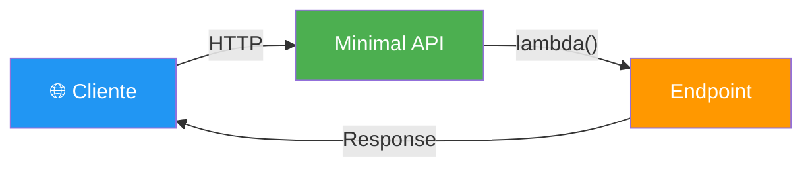
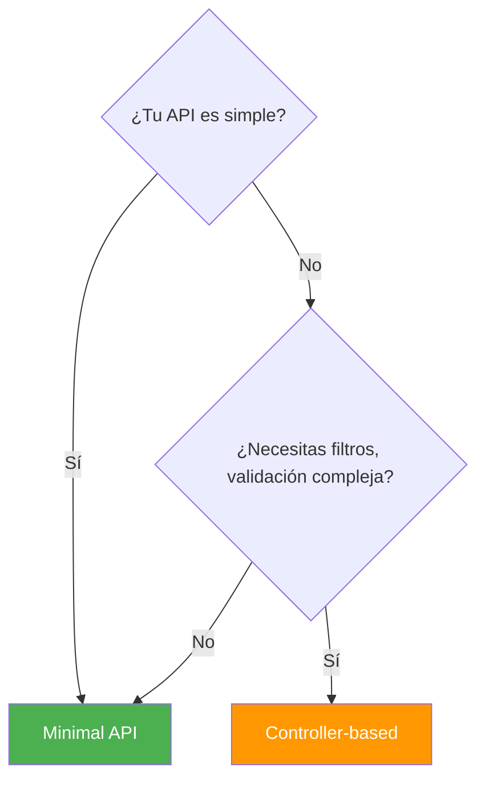
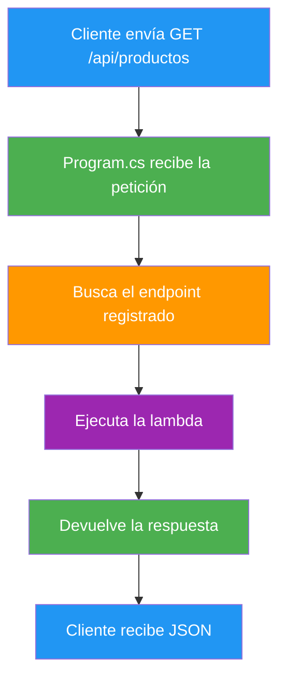
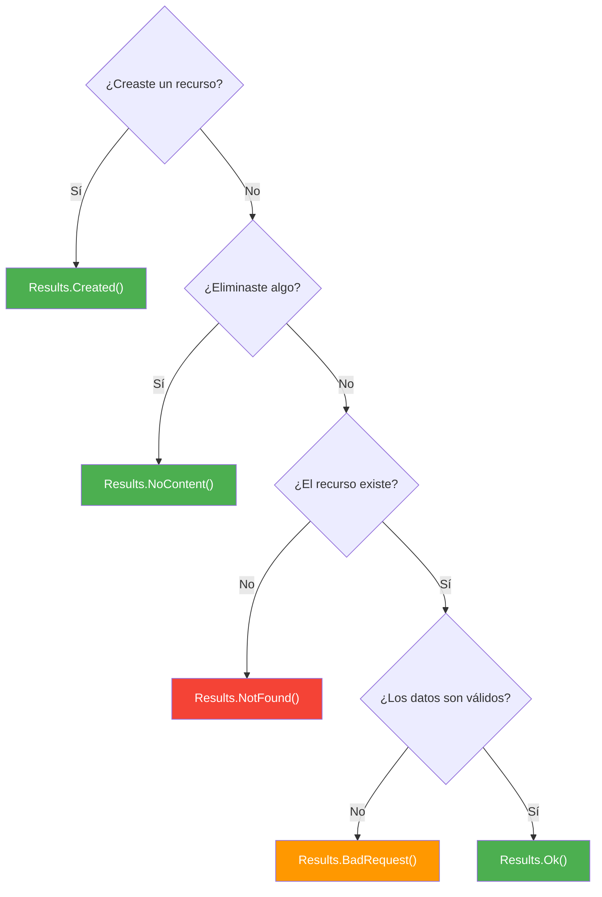

- [3. Minimal APIs](#3-minimal-apis)
  - [3.1. ¿Qué es una Minimal API?](#31-qué-es-una-minimal-api)
    - [3.1.1. Minimal API vs Controller-based](#311-minimal-api-vs-controller-based)
    - [3.1.2. ¿Cuándo usar cada una?](#312-cuándo-usar-cada-una)
  - [3.2. Estructura de una Minimal API](#32-estructura-de-una-minimal-api)
    - [3.2.1. El archivo Program.cs](#321-el-archivo-programcs)
    - [3.2.2. El ciclo de vida de una petición](#322-el-ciclo-de-vida-de-una-petición)
  - [3.3. Definir rutas y métodos HTTP](#33-definir-rutas-y-métodos-http)
    - [3.3.1. Rutas estáticas](#331-rutas-estáticas)
    - [3.3.2. Rutas con parámetros](#332-rutas-con-parámetros)
    - [3.3.3. Parámetros de consulta](#333-parámetros-de-consulta)
  - [3.4. Métodos de respuesta](#34-métodos-de-respuesta)
    - [3.4.1. Results: respuestas simples](#341-results-respuestas-simples)
    - [3.4.2. Results\<T\>: respuestas con datos](#342-resultst-respuestas-con-datos)
    - [3.4.3. ¿Cuándo usar cada método?](#343-cuándo-usar-cada-método)
  - [3.5. Reto: API de Funkos con CRUD en memoria](#35-reto-api-de-funkos-con-crud-en-memoria)

---

# 3. Minimal APIs

> 💡 **Punto de partida:** Cuando Instagram lanzó su API interna, necesitaban un sistema rápido para exponer cientos de endpoints simples: obtener perfil, subir foto, dar like... Usaron un enfoque minimalista: cada endpoint es una función, sin controladores, sin ceremonia. Eso es una Minimal API.

En este punto aprenderás a crear endpoints con Minimal APIs en ASP.NET Core: rutas, métodos HTTP, parámetros y tipos de respuesta.

**Objetivos de aprendizaje:**

- Comprender qué es una Minimal API y cuándo usarla
- Definir rutas con distintos métodos HTTP
- Manejar parámetros de ruta, consulta y body
- Devolver respuestas correctas con los métodos de Results
- Entender las diferencias con los controladores

## 3.1. ¿Qué es una Minimal API?

Una **Minimal API** es una forma simplificada de crear endpoints en ASP.NET Core. En lugar de crear clases Controlador con atributos, cada endpoint se define como una **función lambda** directamente en `Program.cs`.

> 💡 **Analogía:** Un controlador es como un restaurante con menú, camareroy carta estructurada. Una Minimal API es como un food truck: directo, sin ceremonia, haces tu pedido y te lo dan.



📌 **Ejemplo real:** La API de Twitter/X usa Minimal APIs para endpoints simples como obtener un tweet o dar like. No necesitan la ceremonia de un controlador para algo tan directo.

### 3.1.1. Minimal API vs Controller-based

| Característica | Minimal API | Controller-based |
|----------------|:-----------:|:----------------:|
| **Verbosidad** | Baja | Alta |
| **Archivos** | Uno solo (Program.cs) | Varios (clases Controlador) |
| **Atributos** | No necesita | Usa `[HttpGet]`, `[HttpPost]`... |
| **Filtros** | Limitados | Completos |
| **Swagger** | Soporte completo | Soporte completo |
| **Ideal para** | APIs simples, prototipos | APIs complejas, producción |

### 3.1.2. ¿Cuándo usar cada una?



> 💡 **Consejo:** Empieza siempre con Minimal APIs. Si la API crece y necesitas más estructura, migras a controladores. No complices lo que puedes hacer simple.

## 3.2. Estructura de una Minimal API

### 3.2.1. El archivo Program.cs

En una Minimal API, todo vive en `Program.cs`. No hay controladores, no hay archivos adicionales.

```csharp
var builder = WebApplication.CreateBuilder(args);
var app = builder.Build();

app.MapGet("/api/productos", () => "Hola productos");

app.Run();
```

Eso es una Minimal API completa. Tres líneas de lógica:

| Línea | Qué hace |
|-------|----------|
| `var builder = ...` | Configura los servicios |
| `app.MapGet(...)` | Define un endpoint GET |
| `app.Run()` | Arranca el servidor |

> ⚠️ **Advertencia:** `app.Run()` debe ser la **última línea** del archivo. Lo que pongas después no se ejecuta.

### 3.2.2. El ciclo de vida de una petición



## 3.3. Definir rutas y métodos HTTP

### 3.3.1. Rutas estáticas

Cada endpoint se define con un método que indica el verbo HTTP:

```csharp
app.MapGet("/api/productos", () => "Lista de productos");
app.MapPost("/api/productos", () => "Crear producto");
app.MapPut("/api/productos/1", () => "Actualizar producto");
app.MapDelete("/api/productos/1", () => "Eliminar producto");
```

📌 **Ejemplo real:** Cada llamada a `MapGet`, `MapPost`... es como poner una página en tu catálogo. El cliente sabe exactamente a qué URL llamar.

### 3.3.2. Rutas con parámetros

Usa `{nombre}` para capturar partes de la URL:

```csharp
app.MapGet("/api/productos/{id}", (int id) => $"Producto {id}");
app.MapPut("/api/productos/{id}", (int id) => $"Actualizar {id}");
app.MapDelete("/api/productos/{id}", (int id) => $"Eliminar {id}");
```

El parámetro `{id}` se convierte automáticamente en un argumento de la lambda. ASP.NET Core hace el **model binding** por ti.

> ⚠️ **Advertencia:** El nombre del parámetro en la lambda **debe coincidir** con el nombre entre llaves en la ruta. Si pones `{id}` en la ruta pero `productoId` en la lambda, fallará.

### 3.3.3. Parámetros de consulta

Los parámetros de consulta (`?clave=valor`) se capturan directamente como argumentos:

```csharp
app.MapGet("/api/productos", (string? nombre, int? pagina) =>
{
    // GET /api/productos?nombre=guitarra&pagina=1
    return $"Buscar: {nombre}, página: {pagina}";
});
```

📌 **Ejemplo real:** Netflix usa parámetros de consulta para filtros: `?genero=accion&anio=2024&pagina=2`.

## 3.4. Métodos de respuesta

### 3.4.1. Results: respuestas simples

Cuando solo necesitas devolver un código de estado sin datos:

```csharp
app.MapPost("/api/productos", () => Results.Created("/api/productos/1", new { id = 1 }));

app.MapDelete("/api/productos/{id}", (int id) => Results.NoContent());

app.MapGet("/api/productos/{id}", (int id) =>
    id > 0 ? Results.Ok(new { id }) : Results.NotFound());
```

| Método | Código | Uso |
|--------|:------:|-----|
| `Results.Ok()` | 200 | Éxito con datos |
| `Results.Created()` | 201 | Recurso creado |
| `Results.NoContent()` | 204 | Éxito sin datos |
| `Results.NotFound()` | 404 | Recurso no encontrado |
| `Results.BadRequest()` | 400 | Petición inválida |

### 3.4.2. Results\<T\>: respuestas con datos

Cuando devuelves datos, usa `Results<T>` para tipar la respuesta:

```csharp
app.MapGet("/api/productos/{id}", (int id) =>
{
    var producto = new { id, nombre = "Guitarra", precio = 299.99 };
    return Results.Ok(producto);
});
```

El tipo `T` es el tipo de dato que devuelves. ASP.NET Core lo serializa automáticamente a JSON.

> 💡 **Consejo:** Usa `Results.Ok(objeto)` en lugar de solo `Return objeto`. Así controlas explícitamente el código de respuesta.

### 3.4.3. ¿Cuándo usar cada método?



## 3.5. Reto: API de Funkos con CRUD en memoria

> Antes de irte, diseña y construye una Minimal API completa para gestionar Funkos.

### Contexto

Vas a crear una API REST que permita **crear, leer, actualizar y eliminar** Funkos. Los datos se guardarán en una **Lista\<Funko\>** en memoria (no hay base de datos todavía).

### Modelo de datos

| Propiedad | Tipo | Obligatorio |
|-----------|------|:-----------:|
| `id` | long | Sí (autogenerado) |
| `nombre` | string | Sí |
| `precio` | decimal | Sí |
| `categoria` | string | Sí |
| `imagen` | string | No |
| `creadoEn` | DateTime | Sí (autogenerado) |

### Almacenamiento

Los Funkos se guardan en una lista en memoria:

```csharp
var funkos = new List<Funko>();
```

> No hay base de datos. La lista se pierde al reiniciar el servidor. Es una primera aproximación.

### Retos

**Reto 1: Diseña la API**

Completa esta tabla con los endpoints que necesitas:

| Acción | Endpoint | Método | Datos que envías | Código | ¿Qué devuelve? |
|--------|----------|--------|------------------|--------|----------------|
| Listar todos los Funkos | | | | | |
| Consultar un Funko por ID | | | | | |
| Crear un Funko | | | | | |
| Actualizar un Funko | | | | | |
| Eliminar un Funko | | | | | |
| Buscar Funkos por nombre | | | | | |

**Reto 2: Implementa la API**

Crea un proyecto Minimal API y desarrolla cada endpoint. Recuerda:

- Usa `Results.Ok()`, `Results.Created()`, `Results.NoContent()`, `Results.NotFound()` según corresponda
- El `id` se autogenera (puedes usar un contador o `list.Max()`)
- Para `PATCH`, solo actualiza el precio

> 💡 **Consejo:** Empieza por `GET /api/funkos` (listar todos). Una vez que funciona, ve añadiendo los demás endpoints uno a uno.

---

**Resumen del punto:**

| Concepto | Descripción |
|----------|-------------|
| **Minimal API** | Endpoints como lambdas en Program.cs, sin controladores |
| **MapGet/MapPost/MapPut/MapDelete** | Definen rutas y métodos HTTP |
| **{parametro}** | Parámetro de ruta |
| **Query string** | Parámetros de consulta (?clave=valor) |
| **Results.Ok()** | Respuesta 200 con datos |
| **Results.Created()** | Respuesta 201 con ubicación |
| **Results.NoContent()** | Respuesta 204 sin datos |
| **Results.NotFound()** | Respuesta 404 |
| **Results.BadRequest()** | Respuesta 400 |

En el siguiente punto veremos los **Controladores y MVC**: una forma más estructurada de organizar endpoints con clases, atributos y separación de responsabilidades.
