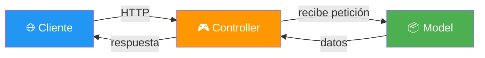
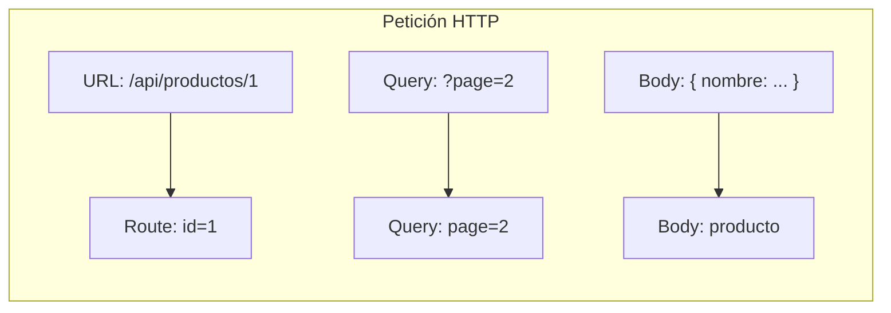
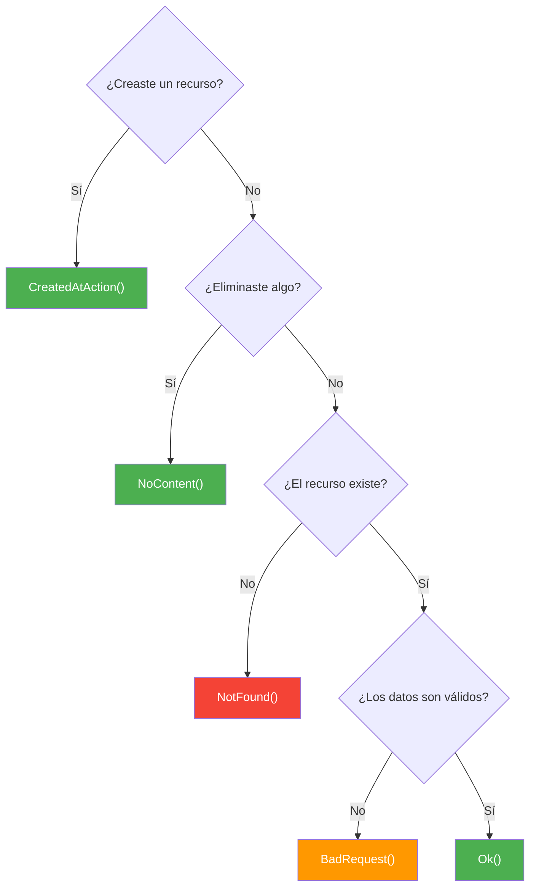

- [4. Controladores y MVC APIs](#4-controladores-y-mvc-apis)
  - [4.1. ¿Qué es MVC?](#41-qué-es-mvc)
    - [4.1.1. Model-View-Controller](#411-model-view-controller)
    - [4.1.2. MVC vs Minimal APIs](#412-mvc-vs-minimal-apis)
  - [4.2. Estructura de un Controlador](#42-estructura-de-un-controlador)
    - [4.2.1. El atributo \[ApiController\]](#421-el-atributo-apicontroller)
    - [4.2.2. El atributo \[Route\]](#422-el-atributo-route)
    - [4.2.3. Inyección de dependencias](#423-inyección-de-dependencias)
  - [4.3. Definir rutas y métodos HTTP](#43-definir-rutas-y-métodos-http)
    - [4.3.1. Atributos de verbos HTTP](#431-atributos-de-verbos-http)
    - [4.3.2. Rutas con parámetros](#432-rutas-con-parámetros)
    - [4.3.3. Parámetros de consulta](#433-parámetros-de-consulta)
    - [4.3.4. Binding de parámetros: FromBody, FromQuery, FromRoute](#434-binding-de-parámetros-frombody-fromquery-fromroute)
  - [4.4. Métodos de respuesta](#44-métodos-de-respuesta)
    - [4.4.1. IActionResult](#441-iactionresult)
    - [4.4.2. ActionResult\<T\>](#442-actionresultt)
    - [4.4.3. ¿Cuándo usar cada método?](#443-cuándo-usar-cada-método)
    - [4.4.4. CreatedAtAction() y el header Location](#444-createdataction-y-el-header-location)
    - [4.4.5. Buenas prácticas](#445-buenas-prácticas)
  - [4.5. Probando con Bruno](#45-probando-con-bruno)
  - [4.7. Reto: API de Funkos con CRUD en memoria (MVC)](#47-reto-api-de-funkos-con-crud-en-memoria-mvc)

---

# 4. Controladores y MVC APIs

> 💡 **Punto de partida:** Cuando entras en un restaurante, no cocinas tú. Un **camarero** (controlador) recibe tu petición, se la pasa a la **cocina** (modelo), y te trae el **plato** (vista). Eso es MVC: separar responsabilidades para que todo sea más claro y mantenible.

En este punto aprenderás a crear APIs usando controladores MVC: la alternativa más estructurada a las Minimal APIs.

**Objetivos de aprendizaje:**

- Comprender qué es el patrón MVC y por qué se usa
- Crear controladores con atributos de rutas y verbos HTTP
- Manejar parámetros de ruta, consulta y body
- Devolver respuestas tipadas con IActionResult y ActionResult\<T\>
- Comparar cuándo usar Minimal APIs vs Controladores

## 4.1. ¿Qué es MVC?

**MVC (Model-View-Controller)** es un patrón de diseño que separa una aplicación en tres capas:



📌 **Ejemplo real:** La API de Spotify usa controladores. Cuando buscas un artista, el controlador `SearchController` recibe la petición, consulta el modelo (base de datos de artistas), y devuelve la respuesta JSON.

### 4.1.1. Model-View-Controller

| Componente | Responsabilidad | Ejemplo |
|------------|-----------------|---------|
| **Model** | Datos y lógica de negocio | `Producto`, `Pedido` |
| **View** | Presentación (no usamos en APIs) | Razor, Blazor |
| **Controller** | Recibe peticiones, coordina respuestas | `ProductosController` |

> 💡 **Analogía:** El **Model** es la receta. El **View** es el plato emplatado. El **Controller** es el camarero que toma el pedido y trae la comida.

> ⚠️ **Advertencia:** En APIs REST **no usamos Views**. Solo Models y Controllers. El "V" de MVC se queda para aplicaciones web con Razor.

### 4.1.2. MVC vs Minimal APIs

| Característica | Minimal API | MVC Controller |
|----------------|:-----------:|:--------------:|
| **Verbosidad** | Baja | Media-Alta |
| **Archivos** | Uno solo (Program.cs) | Uno por controlador |
| **Atributos** | No necesita | Usa `[HttpGet]`, `[Route]`... |
| **Filtros** | Limitados | Completos |
| **Validación** | Manual | Automática ([ApiController]) |
| **Documentación** | Swagger básico | Swagger completo |
| **Ideal para** | APIs simples, prototipos | APIs complejas, producción |

> 💡 **Consejo:** Si tu API tiene más de 5-6 endpoints, considera usar controladores. La estructura te ayuda a mantener el código ordenado.

## 4.2. Estructura de un Controlador

Un controlador es una **clase** que hereda de `ControllerBase` y contiene los **endpoints** de la API.

```csharp
using Microsoft.AspNetCore.Mvc;

namespace MiApi.Controllers;

[ApiController]
[Route("api/[controller]")]
public class ProductosController : ControllerBase
{
    private static List<Producto> _productos = new();

    [HttpGet]
    public ActionResult<List<Producto>> GetAll()
    {
        return Ok(_productos);
    }
}
```

### 4.2.1. El atributo [ApiController]

El atributo `[ApiController]` activa comportamientos automáticos:

| Comportamiento | Qué hace |
|----------------|----------|
| **Model Binding automático** | Deserializa el body de la petición |
| **Validación automática** | Si el DTO tiene Data Annotations y falla, devuelve 400 |
| **Binding por fuente** | Sabe de dónde viene cada parámetro |

> ⚠️ **Advertencia:** Si olvidas `[ApiController]`, tendrás que validar manualmente el body de cada petición. Siempre úsalo.

> 💡 **Consejo:** La validación con Data Annotations y FluentValidation se cubre en detalle en el [Punto 8: DTOs, Mapeadores y Validaciones](08-dtos-mapeadores-validaciones.md).

### 4.2.2. El atributo [Route]

El atributo `[Route]` define la ruta base del controlador:

```csharp
[Route("api/[controller]")]
public class ProductosController : ControllerBase { }
```

`[controller]` se sustituye por el nombre del controlador **sin el sufijo "Controller"**:

| Nombre del controlador | Ruta resultante |
|------------------------|-----------------|
| `ProductosController` | `/api/productos` |
| `PedidosController` | `/api/pedidos` |
| `UsuariosController` | `/api/usuarios` |

### 4.2.3. Inyección de dependencias

Los controladores reciben servicios a través del **constructor**:

```csharp
[ApiController]
[Route("api/[controller]")]
public class ProductosController : ControllerBase
{
    private readonly IProductoService _service;

    public ProductosController(IProductoService service)
    {
        _service = service;
    }

    [HttpGet]
    public ActionResult<List<Producto>> GetAll()
    {
        return Ok(_service.GetAll());
    }
}
```

> 💡 **Consejo:** Nunca crees instancias dentro del controlador. Usa inyección de dependencias para que el código sea testeable y flexible.

## 4.3. Definir rutas y métodos HTTP

### 4.3.1. Atributos de verbos HTTP

Cada endpoint se define con un atributo que indica el verbo HTTP:

```csharp
[HttpGet]          // GET /api/productos
[HttpPost]         // POST /api/productos
[HttpPut("{id}")]  // PUT /api/productos/1
[HttpDelete("{id}")] // DELETE /api/productos/1
[HttpPatch("{id}")] // PATCH /api/productos/1
```

También puedes combinar `[HttpPut]` con la ruta:

```csharp
[HttpPut("{id:int}")]
public ActionResult Update(int id, ProductoDto dto) { ... }
```

📌 **Ejemplo real:** La API de GitHub usa este patrón: `GetRepository`, `CreateRepository`, `DeleteRepository`... cada uno con su atributo HTTP.

### 4.3.2. Rutas con parámetros

Los parámetros de ruta se definen entre llaves `{}`:

```csharp
[HttpGet("{id:int}")]
public ActionResult<Producto> GetById(int id)
{
    var producto = _productos.FirstOrDefault(p => p.Id == id);
    return producto is null ? NotFound() : Ok(producto);
}
```

| Sintaxis | Significado |
|----------|-------------|
| `{id}` | Parámetro entero |
| `{id:int}` | Restricción de tipo |
| `{nombre?}` | Parámetro opcional |

> ⚠️ **Advertencia:** Las restricciones de tipo (`:int`, `:guid`, `:string`) son opcionales pero recomendadas. Evitan rutas ambiguas.

### 4.3.3. Parámetros de consulta

Los parámetros de query string se capturan como argumentos del método:

```csharp
[HttpGet]
public ActionResult<List<Producto>> GetAll(
    [FromQuery] string? nombre,
    [FromQuery] int? pagina)
{
    var resultado = _productos.AsEnumerable();

    if (!string.IsNullOrEmpty(nombre))
        resultado = resultado.Where(p => p.Nombre.Contains(nombre));

    return Ok(resultado.ToList());
}
```

📌 **Ejemplo real:** Netflix usa `?genero=accion&anio=2024&pagina=2` para filtrar contenido.

### 4.3.4. Binding de parámetros: FromBody, FromQuery, FromRoute

ASP.NET Core necesita saber **de dónde viene cada dato**. Los atributos de binding le indican la fuente:



| Atributo | Fuente | Ejemplo |
|----------|--------|---------|
| **[FromBody]** | Cuerpo de la petición (JSON) | `{"nombre": "Laptop", "precio": 999}` |
| **[FromQuery]** | Query string de la URL | `?page=2&pageSize=10` |
| **[FromRoute]** | Parámetros de la URL | `/api/productos/{id}` |
| **[FromForm]** | Formulario HTML | `multipart/form-data` |

#### [FromBody] — El body de la petición

`[FromBody]` le dice a ASP.NET Core que **deserialice el JSON del body** en un objeto C#. Es lo que usas cuando el cliente envía datos para crear o actualizar:

```csharp
[HttpPost]
public ActionResult<Producto> Create([FromBody] ProductoDto dto)
{
    // dto viene del JSON: {"nombre": "Laptop", "precio": 999}
    var producto = new Producto { Nombre = dto.Nombre, Precio = dto.Precio };
    return CreatedAtAction(nameof(GetById), new { id = 1 }, producto);
}
```

📌 **Ejemplo real:** Cuando añades un producto en Amazon, el frontend envía un POST con `Content-Type: application/json` y el body contiene los datos del producto. `[FromBody]` lo deserializa automáticamente.

> 💡 **Consejo:** Con `[ApiController]`, si el content-type es `application/json`, ASP.NET Core aplica `[FromBody]` **automáticamente**. No necesitas escribirlo siempre, pero es buena práctica hacerlo explícito para claridad.

#### [FromQuery] — Los query parameters

```csharp
[HttpGet]
public ActionResult<List<Producto>> GetAll(
    [FromQuery] string? nombre,
    [FromQuery] int page = 1)
{
    // nombre y page vienen de: /api/productos?nombre=laptop&page=2
}
```

#### [FromRoute] — Los parámetros de URL

```csharp
[HttpGet("{id:int}")]
public ActionResult<Producto> GetById([FromRoute] int id)
{
    // id viene de: /api/productos/42
}
```

> ⚠️ **Advertencia:** Si el nombre del parámetro coincide con el de la ruta, `[FromRoute]` se aplica automáticamente. Solo necesitas escribirlo explícitamente si hay ambigüedad.

#### [FromForm] — Formularios HTML

```csharp
[HttpPost("upload")]
public IActionResult Upload([FromForm] IFormFile archivo, [FromQuery] string? carpeta)
{
    // archivo viene de un formulario multipart/form-data
}
```

## 4.4. Métodos de respuesta

### 4.4.1. IActionResult

`IActionResult` es la interfaz para respuestas **sin tipo**. Úsala cuando solo devuelves un código de estado:

```csharp
[HttpPost]
public IActionResult Create(ProductoDto dto)
{
    var producto = new Producto { Id = 1, Nombre = dto.Nombre };
    return CreatedAtAction(nameof(GetById), new { id = 1 }, producto);
}

[HttpDelete("{id}")]
public IActionResult Delete(int id)
{
    return NoContent();
}
```

### 4.4.2. ActionResult\<T\>

`ActionResult<T>` es la versión **tipada**. Devuelves datos con tipo y Swagger documenta automáticamente la respuesta:

```csharp
[HttpGet("{id:int}")]
public ActionResult<Producto> GetById(int id)
{
    var producto = _productos.FirstOrDefault(p => p.Id == id);
    return producto is null ? NotFound() : Ok(producto);
}
```

| Método | Código | Uso |
|--------|:------:|-----|
| `Ok(objeto)` | 200 | Éxito con datos |
| `CreatedAtAction(...)` | 201 | Recurso creado |
| `NoContent()` | 204 | Éxito sin datos |
| `NotFound()` | 404 | Recurso no encontrado |
| `BadRequest()` | 400 | Petición inválida |

### 4.4.3. ¿Cuándo usar cada método?



> 💡 **Consejo:** `CreatedAtAction` es mejor que `Created` porque genera automáticamente la URL del recurso creado con la ruta del método que lo consulta.

### 4.4.4. CreatedAtAction() y el header Location

En controladores, `CreatedAtAction()` hace tres cosas a la vez:

```csharp
[HttpPost]
public ActionResult<Producto> Create(Producto producto)
{
    // ... crear el producto ...
    return CreatedAtAction(nameof(GetById), new { id = producto.Id }, producto);
}
```

| Argumento | Qué hace |
|-----------|----------|
| `nameof(GetById)` | Genera la URL del método GET (sin strings hardcodeados) |
| `new { id = producto.Id }` | Los parámetros de ruta para la URL |
| `producto` | El recurso creado que se devuelve en el body |

Esto genera esta respuesta:

```http
HTTP/1.1 201 Created
Location: /api/productos/1
Content-Type: application/json

{ "id": 1, "nombre": "Guitarra", ... }
```

#### ¿Qué es un header?

Los **headers** son pares de clave-valor que acompañan a la respuesta HTTP. Aportan información sobre la respuesta:

| Header | Qué comunica |
|--------|-------------|
| `Content-Type` | Tipo del body (application/json) |
| `Location` | URL del recurso recién creado |
| `Authorization` | Token de autenticación |
| `Cache-Control` | Directivas de caché |

> 💡 **Consejo:** El header `Location` es fundamental. Sin él, el cliente no sabe dónde está el recurso que acaba de crear. Siempre inclúyelo en respuestas 201.

#### ¿Por qué se usa nameof(GetById)?

`nameof(GetById)` convierte el nombre del método en un string: `"GetById"`. Esto evita strings hardcodeados. Si renombras el método, el compilador detecta el error.

> ⚠️ **Advertencia:** Si usas `Created($"api/productos/{id}", ...)` en lugar de `CreatedAtAction`, pierdes la generación automática de URLs. `CreatedAtAction` es la forma correcta en controladores.

### 4.4.5. Buenas prácticas

- Usa `CreatedAtAction()` en lugar de `Created()` para generar URLs automáticamente
- `nameof(Method)` evita strings hardcodeados
- Siempre devuelve el recurso creado en el body de la respuesta 201
- El header `Location` debe apuntar al método GET del recurso
- El `id` lo genera el servidor, nunca el cliente

## 4.5. Probando con Bruno

**Bruno** es un cliente API open source para probar endpoints. Las mismas pruebas que hiciste en el punto 03 con Minimal APIs funcionan aquí con Controladores MVC.

> 💡 **Consejo:** Si las pruebas de Bruno funcionan igual, tu API está bien diseñada. El cliente no nota la diferencia entre Minimal APIs y Controladores.

### Pruebas GET

**Listar todos los productos:**

```http
GET {{baseUrl}}/api/productos
Accept: application/json
```

**Obtener un producto por ID:**

```http
GET {{baseUrl}}/api/productos/1
Accept: application/json
```

### Pruebas POST

**Crear un producto:**

```http
POST {{baseUrl}}/api/productos
Content-Type: application/json

{
  "nombre": "Guitarra",
  "precio": 299.99,
  "categoria": "Instrumentos"
}
```

Respuesta esperada: `201 Created` con el producto creado y header `Location`.

### Pruebas PUT

**Actualizar un producto:**

```http
PUT {{baseUrl}}/api/productos/1
Content-Type: application/json

{
  "nombre": "Guitarra eléctrica",
  "precio": 349.99,
  "categoria": "Instrumentos"
}
```

### Pruebas DELETE

**Eliminar un producto:**

```http
DELETE {{baseUrl}}/api/productos/1
```

Respuesta esperada: `204 No Content`.

### Pruebas de error

**Producto no encontrado:**

```http
GET {{baseUrl}}/api/productos/999
```

Respuesta esperada: `404 Not Found`.

**Datos inválidos:**

```http
POST {{baseUrl}}/api/productos
Content-Type: application/json

{
  "nombre": ""
}
```

Respuesta esperada: `400 Bad Request`.

> ⚠️ **Advertencia:** Si usas HTTPS, Bruno puede pedirte que aceptes el certificado autofirmado. Aceptalo en el primer request.

## 4.7. Reto: API de Funkos con CRUD en memoria (MVC)

> Ahora repite el reto del punto anterior pero usando controladores MVC.

### Contexto

Vas a crear una API REST con **controladores** que permita crear, leer, actualizar y eliminar Funkos. Los datos se guardarán en una **Lista\<Funko\>** en memoria.

### Modelo de datos

| Propiedad | Tipo | Obligatorio |
|-----------|------|:-----------:|
| `id` | long | Sí (autogenerado) |
| `nombre` | string | Sí |
| `precio` | decimal | Sí |
| `categoria` | string | Sí |
| `imagen` | string | No |
| `creadoEn` | DateTime | Sí (autogenerado) |

### Almacenamiento

Los Funkos se guardan en una lista en memoria dentro del controlador:

```csharp
private static List<Funko> _funkos = new();
private static long _nextId = 1;
```

### Retos

**Reto 1: Diseña el controlador**

Completa esta tabla con los endpoints del controlador `FunkosController`:

| Acción | Atributo HTTP | Método | Código | ¿Qué devuelve? |
|--------|:------------:|--------|--------|----------------|
| Listar todos los Funkos | | | | |
| Consultar un Funko por ID | | | | |
| Crear un Funko | | | | |
| Actualizar un Funko | | | | |
| Eliminar un Funko | | | | |
| Buscar Funkos por nombre | | | | |

**Reto 2: Implementa el controlador**

Crea un proyecto Web API y desarrolla `FunkosController`. Recuerda:

- Usa `[ApiController]` y `[Route("api/[controller]")]`
- Hereda de `ControllerBase`
- Usa `Ok()`, `CreatedAtAction()`, `NoContent()`, `NotFound()` según corresponda
- Para `PATCH`, solo actualiza el precio

> 💡 **Consejo:** Compara tu implementación con la del punto 03 (Minimal APIs). ¿Qué es más rápido de escribir? ¿Qué es más claro de leer?

---

**Resumen del punto:**

| Concepto | Descripción |
|----------|-------------|
| **MVC** | Patrón Model-View-Controller |
| **Controller** | Clase que recibe peticiones HTTP y coordina respuestas |
| **[ApiController]** | Activa validación automática y binding |
| **[Route]** | Define la ruta base del controlador |
| **[HttpGet], [HttpPost]...** | Atributos que indican el verbo HTTP |
| **{parametro}** | Parámetro de ruta |
| **[FromBody]** | Datos del body (JSON deserializado) |
| **[FromQuery]** | Parámetro de consulta |
| **[FromRoute]** | Parámetro de URL |
| **[FromForm]** | Formulario HTML |
| **IActionResult** | Respuesta sin tipo (solo código de estado) |
| **ActionResult\<T\>** | Respuesta tipada (código + datos) |
| **CreatedAtAction()** | Respuesta 201 con ubicación del recurso |

**¿Qué viene después?**

En el siguiente punto veremos la **Arquitectura y Pipeline HTTP**: cómo se procesa una petición desde que llega al servidor hasta que se devuelve la respuesta.
