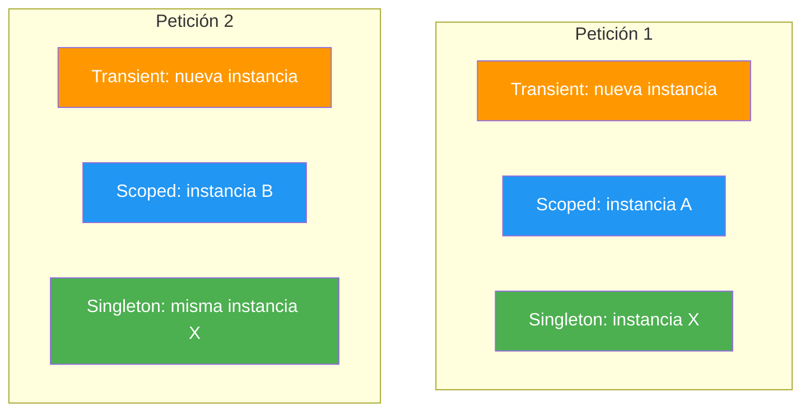
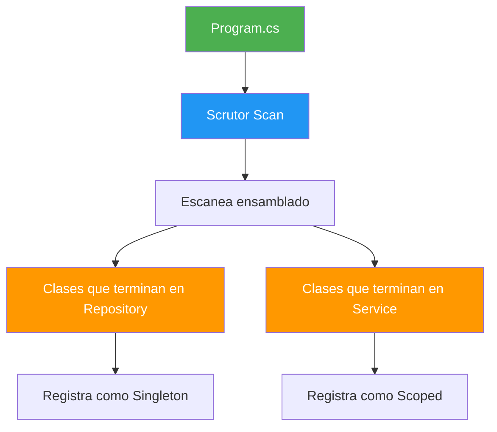
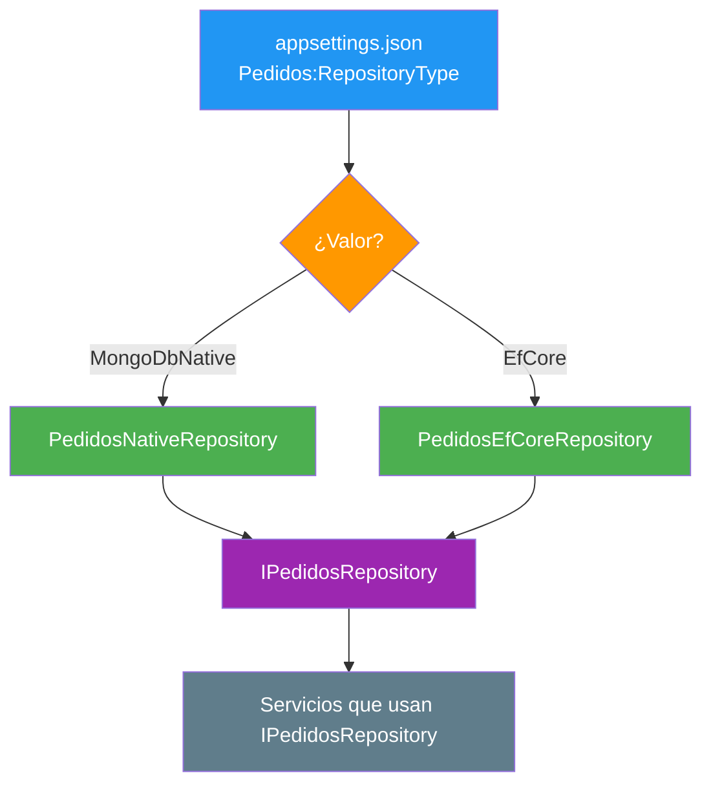
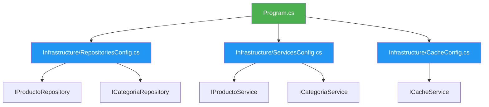

- [6. Inyección de Dependencias](#6-inyección-de-dependencias)
  - [6.1. ¿Qué es la Inyección de Dependencias?](#61-qué-es-la-inyección-de-dependencias)
    - [6.1.1. El problema sin DI](#611-el-problema-sin-di)
    - [6.1.2. La solución con DI](#612-la-solución-con-di)
    - [6.1.3. Beneficios](#613-beneficios)
  - [6.2. Tiempos de vida](#62-tiempos-de-vida)
    - [6.2.1. Transient](#621-transient)
    - [6.2.2. Scoped](#622-scoped)
    - [6.2.3. Singleton](#623-singleton)
    - [6.2.4. Tabla comparativa](#624-tabla-comparativa)
    - [6.2.5. Errores comunes](#625-errores-comunes)
  - [6.3. Constructores primarios (C# 14)](#63-constructores-primarios-c-14)
    - [6.3.1. Constructor tradicional vs primario](#631-constructor-tradicional-vs-primario)
    - [6.3.2. Constructores primarios en controladores](#632-constructores-primarios-en-controladores)
  - [6.4. Interfaces y abstracciones](#64-interfaces-y-abstracciones)
    - [6.4.1. Definición de interfaces](#641-definición-de-interfaces)
    - [6.4.2. Implementación](#642-implementación)
  - [6.5. Registro de servicios en Program.cs](#65-registro-de-servicios-en-programcs)
    - [6.5.1. Registro básico](#651-registro-básico)
    - [6.5.2. Métodos de extensión](#652-métodos-de-extensión)
    - [6.5.3. Registro condicional](#653-registro-condicional)
    - [6.5.4. Registro con fábricas](#654-registro-con-fábricas)
  - [6.6. Scrutor: registro automático](#66-scrutor-registro-automático)
    - [6.6.1. Instalación](#661-instalación)
    - [6.6.2. Requisito: las clases DEBEN tener interfaces](#662-requisito-las-clases-deben-tener-interfaces)
    - [6.6.3. Enfoque 1: Convention-based (por nombre de clase)](#663-enfoque-1-convention-based-por-nombre-de-clase)
    - [6.6.4. Enfoque 2: Marker interfaces (por ciclo de vida)](#664-enfoque-2-marker-interfaces-por-ciclo-de-vida)
    - [6.6.5. ¿Cuándo usar cada enfoque?](#665-cuándo-usar-cada-enfoque)
    - [6.6.6. Ejemplo completo con ambos enfoques](#666-ejemplo-completo-con-ambos-enfoques)
    - [6.6.7. DI condicional: elegir implementación según configuración](#667-di-condicional-elegir-implementación-según-configuración)
    - [6.6.1. Instalación](#661-instalación)
    - [6.6.2. Assembly scanning](#662-assembly-scanning)
    - [6.6.3. Convention-based registration](#663-convention-based-registration)
  - [6.7. DI en Minimal APIs](#67-di-en-minimal-apis)
    - [6.7.1. Inyectar servicios directamente](#671-inyectar-servicios-directamente)
    - [6.7.2. Ejemplo completo](#672-ejemplo-completo)
  - [6.8. DI en Controladores MVC](#68-di-en-controladores-mvc)
    - [6.8.1. Constructor primario en controllers](#681-constructor-primario-en-controllers)
    - [6.8.2. Ejemplo completo](#682-ejemplo-completo)
  - [6.9. Patrón Infrastructure](#69-patrón-infrastructure)
    - [6.9.1. ¿Cuándo usarlo?](#691-cuándo-usarlo)
    - [6.9.2. Config classes](#692-config-classes)
    - [6.9.3. Estructura de carpetas](#693-estructura-de-carpetas)
  - [6.10. Buenas prácticas](#610-buenas-prácticas)
  - [6.11. Reto: API de Funkos con DI completa](#611-reto-api-de-funkos-con-di-completa)


# 6. Inyección de Dependencias

> 💡 **Punto de partida:** Cuando llevas tu coche al mecánico, él no fabrica las herramientas. Se las dan. Eso es Inyección de Dependencias: quien usa algo, no lo crea.

En este punto aprenderás a desacoplar tu código usando Inyección de Dependencias (DI), el pilar fundamental de cualquier aplicación ASP.NET Core bien estructurada.

**Objetivos de aprendizaje:**

- Comprender qué es DI y por qué se usa
- Dominar los tres tiempos de vida de los servicios
- Usar constructores primarios de C# 14
- Registrar servicios con métodos de extensión y Scrutor
- Aplicar DI en Minimal APIs y Controladores MVC
- Entender el patrón Infrastructure para proyectos grandes

## 6.1. ¿Qué es la Inyección de Dependencias?

La **inyección de dependencias (DI)** es un patrón de diseño donde un objeto **no crea sus propias dependencias**, sino que las recibe desde el exterior. ASP.NET Core tiene un contenedor DI integrado que gestiona la creación y el ciclo de vida de todos los servicios.

### 6.1.1. El problema sin DI

Imagina un servicio de productos que necesita un repositorio, un logger y un servicio de email. Sin DI:

```csharp
// ❌ MALO: El servicio crea sus propias dependencias
public class ProductoService
{
    private readonly ProductoRepository _repository;
    private readonly Logger<ProductoService> _logger;
    private readonly EmailService _email;

    public ProductoService()
    {
        _repository = new ProductoRepository("connection string");
        _logger = new Logger<ProductoService>();
        _email = new EmailService("smtp.gmail.com");
    }
}
```

**Problemas:**

| Problema | Consecuencia |
|----------|-------------|
| Acoplamiento fuerte | El servicio conoce las implementaciones concretas |
| Difícil testing | No puedes pasar mocks |
| Código frágil | Cambiar Redis por MemoryCache requiere modificar el servicio |
| Duplicación | Cada servicio que necesita Repository crea uno nuevo |

### 6.1.2. La solución con DI

Con DI, el servicio **declara qué necesita** en el constructor, y el framework se encarga de proporcionar las instancias:

```csharp
// ✅ BUENO: Dependencias inyectadas
public class ProductoService(
    IProductoRepository repository,
    ILogger<ProductoService> logger,
    IEmailService email) : IProductoService
{
    public async Task<Producto?> GetByIdAsync(int id)
    {
        logger.LogInformation("Buscando producto {Id}", id);
        return await repository.GetByIdAsync(id);
    }
}
```

El servicio **no sabe ni le importa** cómo se crean sus dependencias. Solo sabe que las recibirá.

📌 **Ejemplo real:** Netflix usa DI para sus servicios de recomendación. El mismo `RecommendationService` puede usar distintos algoritmos según el país, sin cambiar una línea de código.

### 6.1.3. Beneficios

| Beneficio | Descripción |
|-----------|-------------|
| **Desacoplamiento** | Los servicios solo conocen interfaces |
| **Testabilidad** | Puedes pasar mocks en los tests |
| **Mantenibilidad** | Cambios localizados en un solo sitio |
| **Flexibilidad** | Implementaciones intercambiables por entorno |
| **Reutilización** | La misma implementación se comparte entre servicios |

## 6.2. Tiempos de vida

Cada servicio registrado en el contenedor DI tiene un **tiempo de vida** que determina cuándo se crea y cuándo se destruye la instancia.

### 6.2.1. Transient

Crea una **nueva instancia cada vez** que el servicio es solicitado. Ideal para servicios ligeros, sin estado.

```csharp
builder.Services.AddTransient<IEmailService, EmailService>();
builder.Services.AddTransient<IValidator<Producto>, ProductoValidator>();
```

### 6.2.2. Scoped

Crea una **nueva instancia una vez por petición HTTP**. Todos los servicios Scoped dentro de la misma petición comparten la misma instancia. Es el más usado.

```csharp
builder.Services.AddScoped<IProductoService, ProductoService>();
builder.Services.AddScoped<IProductoRepository, ProductoRepository>();
builder.Services.AddScoped<TiendaDbContext>();
```

### 6.2.3. Singleton

Crea una **única instancia** que se reutiliza durante toda la vida de la aplicación. Todos los usuarios comparten la misma instancia.

```csharp
builder.Services.AddSingleton<ICacheService, MemoryCacheService>();
builder.Services.AddSingleton<IConfiguration>(builder.Configuration);
```

### 6.2.4. Tabla comparativa

| Tiempo de vida | Instancias por... | Cuándo usarlo | Ejemplos |
|----------------|-------------------|---------------|----------|
| **Transient** | Cada solicitud | Servicios ligeros, sin estado | Validadores, transformadores |
| **Scoped** | Petición HTTP | Servicios de negocio, datos | DbContext, Repositorios, Services |
| **Singleton** | App completa | Servicios globales, caché | Cache, Config, Logger |



### 6.2.6. Flujo de una petición con DI


### 6.2.5. Errores comunes

**Error 1: DbContext como Singleton**

DbContext **no es thread-safe**. Si lo registras como Singleton, múltiples peticiones compartirán la misma instancia y obtendrás errores de concurrencia.

```csharp
// ❌ INCORRECTO
builder.Services.AddSingleton<TiendaDbContext>();

// ✅ CORRECTO
builder.Services.AddScoped<TiendaDbContext>();
```

**Error 2: Capturar Scope en Singleton**

Un servicio Singleton no debe inyectar servicios Scoped porque vivirían más tiempo que el scope que los creó:

```csharp
// ❌ INCORRECTO - Scoped dentro de Singleton
public class SingletonService(TiendaDbContext context)
{
    // context vivirá más que la petición que lo creó
}

// ✅ CORRECTO - Usar IServiceScopeFactory
public class SingletonService(IServiceScopeFactory scopeFactory)
{
    public void DoWork()
    {
        using var scope = scopeFactory.CreateScope();
        var context = scope.ServiceProvider.GetRequiredService<TiendaDbContext>();
        // Usar context...
    }
}
```

## 6.3. Constructores primarios (C# 14)

### 6.3.1. Constructor tradicional vs primario

Los **constructores primarios** eliminan el boilerplate de los constructores tradicionales:

```csharp
// ❌ Constructor tradicional (mucho código repetido)
public class ProductoService : IProductoService
{
    private readonly IProductoRepository _repository;
    private readonly ILogger<ProductoService> _logger;

    public ProductoService(
        IProductoRepository repository,
        ILogger<ProductoService> logger)
    {
        _repository = repository;
        _logger = logger;
    }
}

// ✅ Constructor primario (C# 14)
public class ProductoService(
    IProductoRepository repository,
    ILogger<ProductoService> logger) : IProductoService
{
    // Los parámetros son automáticamente campos readonly
    // No necesitas declararlos ni asignarlos
}
```

### 6.3.2. Constructores primarios en controladores

```csharp
// ❌ Tradicional
public class ProductosController : ControllerBase
{
    private readonly IProductoService _service;

    public ProductosController(IProductoService service)
    {
        _service = service;
    }
}

// ✅ Constructor primario
public class ProductosController(
    IProductoService service,
    ILogger<ProductosController> logger) : ControllerBase
{
    [HttpGet]
    public async Task<IActionResult> GetAll()
    {
        logger.LogInformation("Obteniendo productos");
        var productos = await service.GetAllAsync();
        return Ok(productos);
    }
}
```

## 6.4. Interfaces y abstracciones

### 6.4.1. Definición de interfaces

Las interfaces definen **contratos** que las implementaciones deben cumplir. Siempre usa interfaces para servicios y repositorios.

```csharp
public interface IProductoService
{
    Task<Producto?> GetByIdAsync(int id);
    Task<IEnumerable<Producto>> GetAllAsync();
    Task<Producto> CreateAsync(CreateProductoDto dto);
    Task<bool> DeleteAsync(int id);
}

public interface IProductoRepository
{
    Task<Producto?> GetByIdAsync(int id);
    Task<IEnumerable<Producto>> GetAllAsync();
    Task AddAsync(Producto producto);
    Task DeleteAsync(int id);
}
```

### 6.4.2. Implementación

```csharp
public class ProductoService(
    IProductoRepository repository,
    ILogger<ProductoService> logger) : IProductoService
{
    public async Task<Producto?> GetByIdAsync(int id)
    {
        logger.LogInformation("Buscando producto {Id}", id);
        return await repository.GetByIdAsync(id);
    }

    public async Task<Producto> CreateAsync(CreateProductoDto dto)
    {
        if (dto.Precio <= 0)
            throw new ValidationException("El precio debe ser mayor que cero");

        var producto = new Producto
        {
            Nombre = dto.Nombre,
            Precio = dto.Precio,
            Categoria = dto.Categoria
        };

        await repository.AddAsync(producto);
        return producto;
    }

    // Resto de métodos...
}
```

> 💡 **Consejo:** Si no usas interfaces, no puedes hacer testing unitario con mocks. Siempre I + nombre (IProductoService, IProductoRepository).

## 6.5. Registro de servicios en Program.cs

### 6.5.1. Registro básico

```csharp
var builder = WebApplication.CreateBuilder(args);

// Registrar servicios uno por uno
builder.Services.AddScoped<IProductoRepository, ProductoRepository>();
builder.Services.AddScoped<IProductoService, ProductoService>();
builder.Services.AddScoped<ICategoriaService, CategoriaService>();
```

### 6.5.2. Métodos de extensión

En lugar de acumular todo en Program.cs, agrupa el registro en métodos de extensión:

```csharp
// Infrastructure/ServicesConfig.cs
public static class ServicesConfig
{
    public static IServiceCollection AddApplicationServices(
        this IServiceCollection services)
    {
        // Repositorios
        services.AddScoped<IProductoRepository, ProductoRepository>();
        services.AddScoped<ICategoriaRepository, CategoriaRepository>();

        // Servicios de negocio
        services.AddScoped<IProductoService, ProductoService>();
        services.AddScoped<ICategoriaService, CategoriaService>();

        return services;
    }
}
```

```csharp
// Program.cs - limpio y ordenado
var builder = WebApplication.CreateBuilder(args);

builder.Services.AddApplicationServices();

var app = builder.Build();
```

### 6.5.3. Registro condicional

Registra diferentes implementaciones según el entorno:

```csharp
public static IServiceCollection AddCacheServices(
    this IServiceCollection services,
    IConfiguration configuration)
{
    if (configuration.GetValue<bool>("UseRedis"))
    {
        services.AddSingleton<ICacheService, RedisCacheService>();
    }
    else
    {
        services.AddSingleton<ICacheService, MemoryCacheService>();
    }

    return services;
}
```

### 6.5.4. Registro con fábricas

Cuando la creación del servicio es compleja:

```csharp
builder.Services.AddScoped<IMyService>(sp =>
{
    var logger = sp.GetRequiredService<ILogger<MyService>>();
    var repository = sp.GetRequiredService<IRepository>();
    var config = sp.GetRequiredService<IOptions<MyConfig>>();

    return new MyService(logger, repository, config.Value);
});
```

## 6.6. Scrutor: registro automático

**Scrutor** es un paquete NuGet que escanea ensamblados y registra servicios automáticamente, evitando escribir `AddScoped` para cada servicio.



### 6.6.1. Instalación

```bash
dotnet add package Scrutor
```

### 6.6.2. Requisito: las clases DEBEN tener interfaces

> ⚠️ **Importante:** `AsImplementedInterfaces()` solo registra clases que implementen al menos una interfaz. Si una clase no tiene interfaz, Scrutor la ignora silenciosamente.

Cada clase de servicio/repositorio debe implementar:
1. **Su interfaz de negocio** (`IProductoService`, `IProductoRepository`)
2. **O implementar interfaces que Scrutor pueda detectar** (para `AsImplementedInterfaces()`)

```csharp
// ✅ Scrutor detecta esta clase (implementa IProductoRepository)
public class ProductoRepository : IProductoRepository { ... }

// ✅ Scrutor detecta esta clase (implementa IProductoService)
public class ProductoService(IProductoRepository repo) : IProductoService { ... }

// ❌ Scrutor NO detecta esta clase (no tiene interfaz)
public class ProductoHelper { ... }
```

### 6.6.3. Enfoque 1: Convention-based (por nombre de clase)

Registra servicios según el **nombre** de la clase (termina en "Service", "Repository", etc.):

```csharp
using Scrutor;

var builder = WebApplication.CreateBuilder(args);

builder.Services.Scan(scan => scan
    .FromAssemblyOf<Program>()
    // Todas las clases que terminan en "Repository" → Singleton
    .AddClasses(classes => classes.Where(t => t.Name.EndsWith("Repository")))
        .AsImplementedInterfaces()
        .WithSingletonLifetime()
    // Todas las clases que terminan en "Service" → Scoped
    .AddClasses(classes => classes.Where(t => t.Name.EndsWith("Service")))
        .AsImplementedInterfaces()
        .WithScopedLifetime()
);
```

**Ventaja:** Simple, solo necesitas nombrar bien las clases.
**Riesgo:** Si renombras una clase, pierde el registro silenciosamente.

📌 Ejemplo real: **TiendaAPI** usa este enfoque. Sus clases se llaman `ProductoService`, `UserService`, `CategoriaService`, etc. Scrutor las detecta por el sufijo "Service".

### 6.6.4. Enfoque 2: Marker interfaces (por ciclo de vida)

Registra servicios según **qué interfaz de marcador implementen**:

```csharp
// Interfaces marcadoras (vacías, solo sirven para identificar)
public interface ITransientService { }
public interface IScopedService { }
public interface ISingletonService { }

// La clase implementa su interfaz de negocio + marcador de ciclo de vida
public class ProductoRepository : IProductoRepository, ISingletonService { }
public class ProductoService : IProductoService, IScopedService { }
```

```csharp
builder.Services.Scan(scan => scan
    .FromAssemblyOf<Program>()
        .AddClasses(classes => classes.AssignableTo<ITransientService>())
            .AsImplementedInterfaces()
            .WithTransientLifetime()
        .AddClasses(classes => classes.AssignableTo<IScopedService>())
            .AsImplementedInterfaces()
            .WithScopedLifetime()
        .AddClasses(classes => classes.AssignableTo<ISingletonService>())
            .AsImplementedInterfaces()
            .WithSingletonLifetime()
);
```

**Ventaja:** El ciclo de vida está en la clase, no en Program.cs. Más explícito.
**Riesgo:** Más interfaces que mantener.

> 💡 **Consejo:** En proyectos nuevos, usa el **Enfoque 1** (convention-based) si tienes pocos servicios. Usa el **Enfoque 2** (marker interfaces) si tienes muchos servicios y quieres que el ciclo de vida esté visible en la clase.

### 6.6.5. ¿Cuándo usar cada enfoque?

| Enfoque | Cuándo usarlo | Ejemplo |
|---------|---------------|---------|
| **Convention-based** | Proyectos pequeños/medianos, pocos servicios | `classes.Where(t => t.Name.EndsWith("Service"))` |
| **Marker interfaces** | Proyectos grandes, muchos servicios, ciclo de vida visible | `classes.AssignableTo<IScopedService>()` |

### 6.6.6. Ejemplo completo con ambos enfoques

```csharp
// Program.cs — Enfoque convention-based (como en TiendaAPI)
using Scrutor;

var builder = WebApplication.CreateBuilder(args);

builder.Services.AddControllers();

// Scrutor escanea y registra automáticamente
// REQUISITO: Las clases DEBEN implementar interfaces (IProductoRepository, IProductoService)
builder.Services.Scan(scan => scan
    .FromAssemblyOf<Program>()
    .AddClasses(classes => classes.Where(t => t.Name.EndsWith("Repository")))
        .AsImplementedInterfaces()
        .WithSingletonLifetime()
    .AddClasses(classes => classes.Where(t => t.Name.EndsWith("Service")))
        .AsImplementedInterfaces()
        .WithScopedLifetime()
);

var app = builder.Build();
app.MapControllers();
app.Run();
```

> 💡 **Consejo:** Scrutor es ideal para proyectos grandes con muchos servicios. En proyectos pequeños, el registro manual es más claro.

### 6.6.7. DI condicional: elegir implementación según configuración

A veces necesitas elegir qué implementación registrar **según un valor de configuración**. Scrutor escanea automáticamente lo que puede, pero lo condicional se registra **después del Scan** de forma manual:

```csharp
// Program.cs — Scrutor + registro condicional
using Scrutor;

var builder = WebApplication.CreateBuilder(args);

builder.Services.AddControllers();

// 1. Scrutor: escanea y registra automáticamente todos los Services y Repositories
builder.Services.Scan(scan => scan
    .FromAssemblyOf<Program>()
    .AddClasses(classes => classes.Where(t => t.Name.EndsWith("Repository")))
        .AsImplementedInterfaces()
        .WithSingletonLifetime()
    .AddClasses(classes => classes.Where(t => t.Name.EndsWith("Service")))
        .AsImplementedInterfaces()
        .WithScopedLifetime()
);

// 2. Después de Scrutor: lo condicional (no se puede escanear)
var pedidosRepoType = builder.Configuration["Pedidos:RepositoryType"] ?? "MongoDbNative";

if (pedidosRepoType == "MongoDbNative")
{
    builder.Services.AddScoped<IPedidosRepository, PedidosNativeRepository>();
}
else
{
    builder.Services.AddScoped<IPedidosRepository, PedidosEfCoreRepository>();
}

var app = builder.Build();
app.MapControllers();
app.Run();
```

📌 Ejemplo real: **TiendaAPI** usa este patrón en `RepositoriesConfig.cs`. La sección `Pedidos:RepositoryType` en `appsettings.json` determina si los pedidos se almacenan con MongoDB Driver nativo o con EF Core. Scrutor registra los repos normales automáticamente, y el condicional se registra manualmente después.

> 💡 **Analogía:** Scrutor es como un conserje que registra a todos los invitados automáticamente. Pero si hay un invitado especial que solo viene si llueve (configuración), lo registras tú a mano después del conserje.

> ⚠️ **Importante:** El `if/else` de registro condicional **debe ir después** del `Scan` de Scrutor. Si lo pones dentro del `Scan`, no funciona porque Scrutor gestiona su propio ciclo.



## 6.7. DI en Minimal APIs

### 6.7.1. Inyectar servicios directamente

En Minimal APIs, los servicios se inyectan directamente en el delegate del endpoint:

```csharp
var builder = WebApplication.CreateBuilder(args);

builder.Services.AddScoped<IProductoService, ProductoService>();
builder.Services.AddScoped<IProductoRepository, ProductoRepository>();

var app = builder.Build();

// El servicio se inyecta directamente como parámetro
app.MapGet("/api/productos/{id}", async (int id, IProductoService service) =>
{
    var producto = await service.GetByIdAsync(id);
    return producto is not null ? Results.Ok(producto) : Results.NotFound();
});

app.MapPost("/api/productos", async (ProductoDto dto, IProductoService service) =>
{
    var producto = await service.CreateAsync(dto);
    return Results.Created($"/api/productos/{producto.Id}", producto);
});

app.Run();
```

### 6.7.2. Ejemplo completo

```csharp
// Program.cs
using Scrutor;

var builder = WebApplication.CreateBuilder(args);

// Registro con Scrutor
builder.Services.Scan(scan => scan
    .FromAssemblyOf<Program>()
    .AddClasses(classes => classes.Where(t => t.Name.EndsWith("Service")))
        .AsImplementedInterfaces()
        .WithScopedLifetime()
    .AddClasses(classes => classes.Where(t => t.Name.EndsWith("Repository")))
        .AsImplementedInterfaces()
        .WithScopedLifetime()
);

var app = builder.Build();

// Endpoint con DI
app.MapGet("/api/productos", async (IProductoService service) =>
{
    var productos = await service.GetAllAsync();
    return Results.Ok(productos);
});

app.MapGet("/api/productos/{id:int}", async (int id, IProductoService service) =>
{
    var producto = await service.GetByIdAsync(id);
    return producto is not null ? Results.Ok(producto) : Results.NotFound();
});

app.MapPost("/api/productos", async (ProductoDto dto, IProductoService service) =>
{
    var producto = await service.CreateAsync(dto);
    return Results.Created($"/api/productos/{producto.Id}", producto);
});

app.MapDelete("/api/productos/{id:int}", async (int id, IProductoService service) =>
{
    var eliminado = await service.DeleteAsync(id);
    return eliminado ? Results.NoContent() : Results.NotFound();
});

app.Run();
```

> 💡 **Consejo:** En Minimal APIs, el orden de los parámetros del delegate no importa. ASP.NET Core resuelve las dependencias automáticamente por tipo.

## 6.8. DI en Controladores MVC

### 6.8.1. Constructor primario en controllers

En controladores MVC, la DI funciona igual pero con constructores primarios:

```csharp
[ApiController]
[Route("api/[controller]")]
public class ProductosController(
    IProductoService service,
    ILogger<ProductosController> logger) : ControllerBase
{
    [HttpGet]
    public async Task<ActionResult<List<Producto>>> GetAll()
    {
        logger.LogInformation("Obteniendo todos los productos");
        var productos = await service.GetAllAsync();
        return Ok(productos);
    }

    [HttpGet("{id:int}")]
    public async Task<ActionResult<Producto>> GetById(int id)
    {
        logger.LogInformation("Buscando producto {Id}", id);
        var producto = await service.GetByIdAsync(id);
        return producto is not null ? Ok(producto) : NotFound();
    }

    [HttpPost]
    public async Task<ActionResult<Producto>> Create(ProductoDto dto)
    {
        logger.LogInformation("Creando producto {Nombre}", dto.Nombre);
        var producto = await service.CreateAsync(dto);
        return CreatedAtAction(nameof(GetById), new { id = producto.Id }, producto);
    }

    [HttpDelete("{id:int}")]
    public async Task<IActionResult> Delete(int id)
    {
        logger.LogInformation("Eliminando producto {Id}", id);
        var eliminado = await service.DeleteAsync(id);
        return eliminado ? NoContent() : NotFound();
    }
}
```

### 6.8.2. Ejemplo completo

```csharp
// Program.cs
using Scrutor;

var builder = WebApplication.CreateBuilder(args);

builder.Services.AddControllers();

// Registro con Scrutor
builder.Services.Scan(scan => scan
    .FromAssemblyOf<Program>()
    .AddClasses(classes => classes.Where(t => t.Name.EndsWith("Service")))
        .AsImplementedInterfaces()
        .WithScopedLifetime()
    .AddClasses(classes => classes.Where(t => t.Name.EndsWith("Repository")))
        .AsImplementedInterfaces()
        .WithScopedLifetime()
);

var app = builder.Build();

app.MapControllers();

app.Run();
```

> 💡 **Consejo:** La diferencia principal es que en Minimal APIs inyectas en el delegate, y en MVC en el constructor del controlador. El resultado es el mismo: código desacoplado y testeable.

## 6.9. Patrón Infrastructure

Cuando el proyecto crece, el registro de servicios en Program.cs se vuelve un desastre. El **patrón Infrastructure** consiste en crear clases de configuración separadas que agrupan el registro por responsabilidad.



### 6.9.1. ¿Cuándo usarlo?

| Situación | Solución |
|-----------|----------|
| Tienes 5+ servicios | Usa métodos de extensión |
| Tienes 10+ servicios | Usa el patrón Infrastructure |
| Trabajas en equipo | Usa el patrón Infrastructure |
| Tienes múltiples proyectos | Usa el patrón Infrastructure |

### 6.9.2. Config classes

Cada concern de configuración tiene su propia clase:

```csharp
// Infrastructure/ServicesConfig.cs
public static class ServicesConfig
{
    public static IServiceCollection AddApplicationServices(
        this IServiceCollection services)
    {
        services.AddScoped<IProductoService, ProductoService>();
        services.AddScoped<ICategoriaService, CategoriaService>();
        services.AddScoped<IPedidoService, PedidoService>();
        return services;
    }
}
```

```csharp
// Infrastructure/DatabaseConfig.cs
public static class DatabaseConfig
{
    public static IServiceCollection AddDatabase(
        this IServiceCollection services,
        IConfiguration configuration)
    {
        var connectionString = configuration.GetConnectionString("Default");
        services.AddDbContext<TiendaDbContext>(options =>
            options.UseNpgsql(connectionString));
        return services;
    }
}
```

```csharp
// Infrastructure/CacheConfig.cs
public static class CacheConfig
{
    public static IServiceCollection AddCacheServices(
        this IServiceCollection services,
        IConfiguration configuration)
    {
        if (configuration.GetValue<bool>("UseRedis"))
        {
            services.AddSingleton<ICacheService, RedisCacheService>();
        }
        else
        {
            services.AddSingleton<ICacheService, MemoryCacheService>();
        }
        return services;
    }
}
```

```csharp
// Program.cs - limpio
var builder = WebApplication.CreateBuilder(args);

builder.Services
    .AddDatabase(builder.Configuration)
    .AddApplicationServices()
    .AddCacheServices(builder.Configuration);

var app = builder.Build();
```

### 6.9.3. Estructura de carpetas

```
MiApi/
├── Program.cs
├── Infrastructure/
│   ├── ServicesConfig.cs
│   ├── DatabaseConfig.cs
│   ├── CacheConfig.cs
│   └── CorsConfig.cs
├── Services/
│   ├── IProductoService.cs
│   └── ProductoService.cs
├── Repositories/
│   ├── IProductoRepository.cs
│   └── ProductoRepository.cs
└── Models/
    └── Producto.cs
```

> 💡 **Consejo:** Cada `Config` debe ser un método de extensión que devuelva `IServiceCollection`. Así puedes encadenar: `services.AddDatabase().AddServices().AddCache()`.

## 6.10. Buenas prácticas

- **Siempre interfaces:** I + nombre (IProductoService, IProductoRepository)
- **Constructores primarios:** Usa C# 14 para código más limpio
- **Scoped por defecto:** DbContext y servicios de negocio siempre Scoped
- **Singleton solo para caché/config:** Logger, Cache, Config son Singleton
- **Métodos de extensión:** Agrupa el registro en `Infrastructure/` para proyectos grandes
- **Scrutor:** Úsalo cuando tengas 10+ servicios para evitar boilerplate
- **Nunca crees dependencias con new:** Siempre inyecta por interfaz
- **Testing:** Si no puedes hacer mock, tu diseño tiene un problema

## 6.11. Reto: API de Funkos con DI completa

> Aplica todo lo aprendido en el reto del punto 03 o 04.

**Añade a tu API:**

1. **Interfaz** `IFunkoService` con los métodos CRUD
2. **Implementación** `FunkoService` con constructor primario
3. **Interfaz** `IFunkoRepository` y `FunkoRepository` (in-memory con `Dictionary<long, Funko>`)
4. **Registro** de servicios en Program.cs usando métodos de extensión
5. **Controlador** `FunkosController` o **endpoints** Minimal API que inyecten `IFunkoService`

**Puntos extra:**

- Usa Scrutor para el registro automático
- Crea una `Infrastructure/ServicesConfig.cs` para agrupar el registro

---

**Resumen del punto:**

| Concepto | Descripción |
|----------|-------------|
| **Inyección de Dependencias** | Patrón donde un objeto recibe sus dependencias desde el exterior |
| **Transient** | Nueva instancia cada vez |
| **Scoped** | Una instancia por petición HTTP |
| **Singleton** | Una instancia global |
| **Constructor primario** | Sintaxis C# 14 que elimina boilerplate |
| **Interface** | Contrato que define qué puede hacer un servicio |
| **Métodos de extensión** | Agrupan el registro de servicios |
| **Scrutor** | Registro automático por assembly scanning |
| **DI en Minimal APIs** | Servicios se inyectan en el delegate |
| **DI en MVC** | Servicios se inyectan en el constructor del controller |
| **Patrón Infrastructure** | Config classes separadas por responsabilidad |

**¿Qué viene después?**

En el siguiente punto veremos las **Excepciones y el Patrón Result**: cómo manejar errores de negocio de forma explícita sin depender de excepciones.
