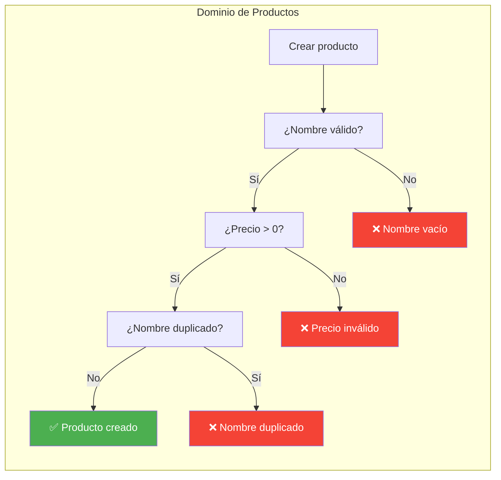
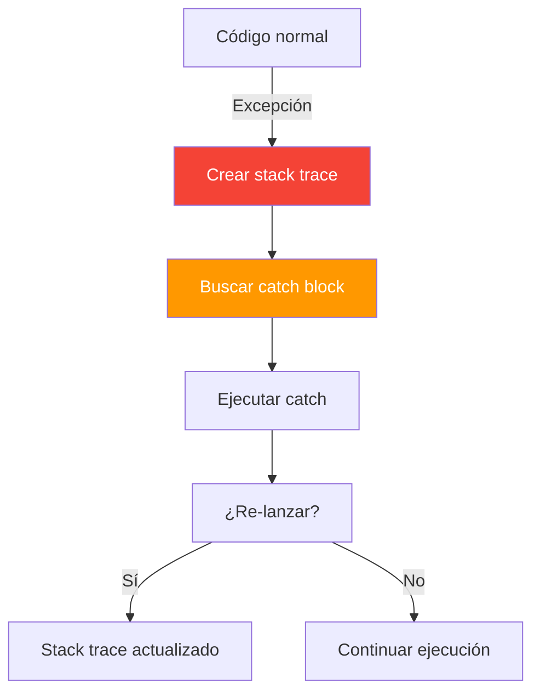
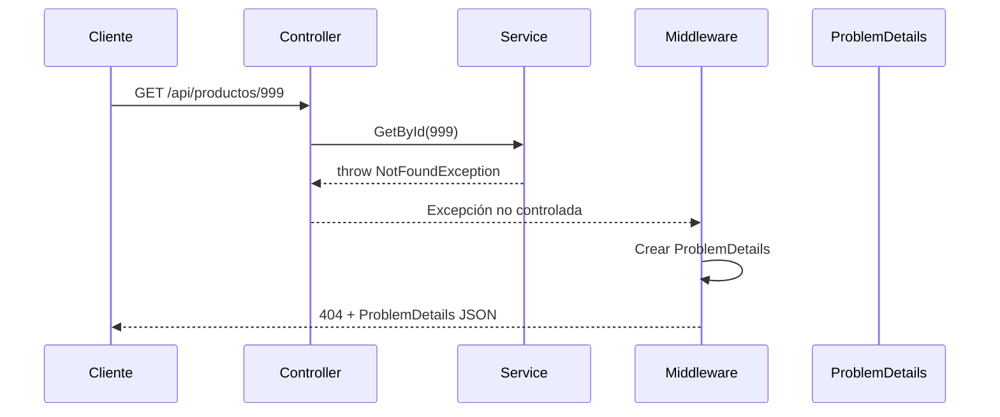
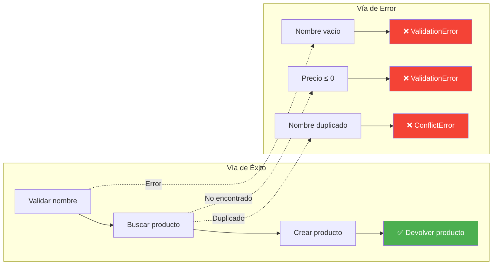

- [7. Excepciones y Patrón Result](#7-excepciones-y-patrón-result)
  - [7.1. Modelando el dominio: casos correctos e incorrectos](#71-modelando-el-dominio-casos-correctos-e-incorrectos)
    - [7.1.1. ¿Qué es el dominio?](#711-qué-es-el-dominio)
    - [7.1.2. Casos correctos vs casos incorrectos](#712-casos-correctos-vs-casos-incorrectos)
    - [7.1.3. Los errores de negocio son PARTE del dominio](#713-los-errores-de-negocio-son-parte-del-dominio)
    - [7.1.4. Ejemplo real](#714-ejemplo-real)
    - [7.1.5. Si solo modelas lo positivo, tu código miente](#715-si-solo-modelas-lo-positivo-tu-código-mente)
  - [7.2. Excepciones: qué son y cuándo usarlas](#72-excepciones-qué-son-y-cuándo-usarlas)
    - [7.2.1. Excepciones excepcionales vs errores de negocio](#721-excepciones-excepcionales-vs-errores-de-negocio)
    - [7.2.2. El problema: rompen el flujo de control](#722-el-problema-rompen-el-flujo-de-control)
    - [7.2.3. Ejemplo: servicio con excepciones (mal)](#723-ejemplo-servicio-con-excepciones-mal)
  - [7.3. Excepciones en ASP.NET Core](#73-excepciones-en-aspnet-core)
    - [7.3.1. Middleware UseExceptionHandler](#731-middleware-useexceptionhandler)
    - [7.3.2. ProblemDetails (RFC 7807)](#732-problemdetails-rfc-7807)
    - [7.3.3. Flujo completo](#733-flujo-completo)
  - [7.4. El Patrón Result](#74-el-patrón-result)
    - [7.4.1. Railway Oriented Programming](#741-railway-oriented-programming)
    - [7.4.2. Result vs Excepciones](#742-result-vs-excepciones)
    - [7.4.3. Los errores de dominio SON parte de nuestro problema](#743-los-errores-de-dominio-son-parte-de-nuestro-problema)
  - [7.5. Opción 1: Union Types (C# 15 / .NET 11)](#75-opción-1-union-types-c-15--net-11)
    - [7.5.1. Sintaxis](#751-sintaxis)
    - [7.5.2. Pattern matching exhaustivo](#752-pattern-matching-exhaustivo)
    - [7.5.3. Ventajas](#753-ventajas)
    - [7.5.4. Limitaciones](#754-limitaciones)
  - [7.6. Opción 2: CSharpFunctionalExtensions](#76-opción-2-csharpfunctionalextensions)
    - [7.6.1. Result\<T, TError\> y UnitResult\<TError\>](#761-resultt-terrory-unitresultterror)
    - [7.6.2. Métodos principales](#762-métodos-principales)
    - [7.6.3. DomainError con sealed records](#763-domainerror-con-sealed-records)
  - [7.7. Errores de Dominio tipados](#77-errores-de-dominio-tipados)
    - [7.7.1. DomainError base](#771-domainerror-base)
    - [7.7.2. Tipos concretos de error](#772-tipos-concretos-de-error)
    - [7.7.3. Errores por dominio](#773-errores-por-dominio)
  - [7.8. Integración con Controladores](#78-integración-con-controladores)
    - [7.8.1. Opción A: Match + switch inline](#781-opción-a-match--switch-inline)
    - [7.8.2. Opción B: Función privada GetHttpResult()](#782-opción-b-función-privada-gethttpresult)
    - [7.8.3. Opción C: Método de extensión ToHttpResult()](#783-opción-c-método-de-extensión-tohttpresult)
    - [7.8.4. Comparación](#784-comparación)
  - [7.9. Buenas prácticas](#79-buenas-prácticas)
  - [7.10. Reto](#710-reto)


# 7. Excepciones y Patrón Result

> 💡 **Punto de partida:** Si diseñas una tienda y solo piensas en que la gente compra... ¿qué pasa cuando no hay stock? ¿Cuando el cliente no paga? ¿Cuando el producto está defectuoso? Si no lo has pensado, tu tienda está a medio hacer. Lo mismo pasa con tu código: si solo modelas el caso correcto, tu aplicación está incompleta.

En este punto aprenderás a manejar errores de negocio de forma explícita, sin depender de excepciones, usando el patrón Result y errores de dominio tipados.

**Objetivos de aprendizaje:**

- Entender qué es el dominio y por qué hay que modelar los casos incorrectos
- Distinguir entre excepciones excepcionales y errores de negocio
- Conocer el patrón Result y Railway Oriented Programming
- Usar Union Types (C# 15) o CSharpFunctionalExtensions
- Crear errores de dominio tipados con `DomainError`
- Integrar Result con controladores ASP.NET Core

## 7.1. Modelando el dominio: casos correctos e incorrectos

### 7.1.1. ¿Qué es el dominio?

El **dominio** es el problema que resuelve tu aplicación. Si haces una API de productos, tu dominio es "gestionar productos": crearlos, buscarlos, actualizarlos, eliminarlos. No es el código, no es la base de datos — es el **problema real** del negocio.

> 💡 **Analogía:** El dominio es como un restaurante. No es la cocina (el código), ni los meseros (los controladores), ni la caja registradora (la BD). El dominio es **servir comida**: que el cliente pida, que el chef cocine, que llegue el plato correcto... y que si no hay quelín, se lo digas, no que salte una excepción.

📌 **Ejemplo real:** Netflix no solo gestiona "reproducir contenido". Su dominio incluye: recomendaciones, suscripciones, pagos fallidos, contenido no disponible en tu región, límites de dispositivos... Todos son casos del dominio, no excepciones.

### 7.1.2. Casos correctos vs casos incorrectos

Cada operación de negocio tiene un **caso correcto** (éxito) y varios **casos incorrectos** (errores esperados que DEBES modelar):

| Operación | Caso correcto | Casos incorrectos |
|-----------|---------------|-------------------|
| Crear producto | Producto creado | Nombre vacío, precio negativo, nombre duplicado |
| Buscar producto | Producto encontrado | No existe, ID inválido |
| Eliminar producto | Producto eliminado | Tiene pedidos pendientes, no existe |
| Actualizar precio | Precio actualizado | Precio ≤ 0, producto inactivo |
| Login | Sesión iniciada | Email no existe, contraseña incorrecta, cuenta bloqueada |

Los casos incorrectos **no son excepciones**. Son parte del flujo normal del negocio. Un cliente que intenta comprar un producto sin stock no está haciendo algo "excepcional" — es una situación que tu sistema debe saber manejar.

### 7.1.3. Los errores de negocio son PARTE del dominio

Cuando un producto no existe, eso no es un error del sistema — es un **estado válido del dominio**. Tu aplicación debe poder responder "este producto no existe" de forma controlada, no lanzando una excepción que alguien tiene que capturar.



### 7.1.4. Ejemplo real

📌 **Netflix:** Si buscas una serie que no existe, no lanza una excepción. Te devuelve "No encontrado". Es un resultado esperado.

📌 **Glovo:** Si un restaurante está cerrado, no lanza una excepción. Te devuelve "Restaurante no disponible". Es un estado del dominio.

📌 **Amazon:** Si un producto no tiene stock, no lanza una excepción. Te muestra "Agotado" y te ofrece alternativas. Es parte del flujo de compra.

En todos estos casos, el "error" es una respuesta **normal** del sistema. No es excepcional. Es algo que el negocio debe modelar.

### 7.1.5. Si solo modelas lo positivo, tu código miente

Imagina este método:

```csharp
// ❌ La firma MIENTE: dice que siempre devuelve un Producto
public Producto GetById(int id)
{
    var producto = _repository.Find(id);
    if (producto == null)
        throw new NotFoundException("Producto no encontrado");
    return producto;
}
```

El método dice `Producto`, pero en realidad puede lanzar una excepción. El llamador **no sabe** que puede fallar sin leer el cuerpo del método. Si olvida el `try-catch`, el error llega al cliente en un formato inesperado.

```csharp
// ✅ La firma dice la verdad: devuelve un Producto O un error
public Result<Producto, DomainError> GetById(int id)
{
    var producto = _repository.Find(id);
    return producto is not null
        ? Result.Success<Producto, DomainError>(producto)
        : Result.Failure<Producto, DomainError>(ProductoError.NotFound(id));
}
```

Ahora el método dice: "devuelvo un Producto **o** un error". El llamador **sabe** que debe manejar ambos casos. No hay sorpresas.

## 7.2. Excepciones: qué son y cuándo usarlas

### 7.2.1. Excepciones excepcionales vs errores de negocio

Las **excepciones** están diseñadas para situaciones **excepcionales e inesperadas**: un archivo que no existe, una conexión a BD que falla, un error de programación (división por cero, NullReferenceException).

| Tipo | Ejemplos | ¿Se puede modelar? |
|------|----------|:-------------------:|
| **Excepción excepcional** | BD caída, fichero no encontrado, bug en código | No — son impredecibles |
| **Error de negocio** | Producto no existe, nombre duplicado, precio inválido | Sí — son esperados |

> ⚠️ **Advertencia:** Si un error de negocio se modela como excepción, estás usando un mecanismo diseñado para lo inesperado para algo que **sabes que puede pasar**. Es como usar una alarma de incendio para avisar de que se acabó el papel higiénico.

### 7.2.2. El problema: rompen el flujo de control

Las excepciones tienen overhead significativo:

- **Crean stack trace** → costly operation
- **Buscan catch blocks** → el flujo de control es implícito
- **Presión en GC** → el recolector de basura trabaja más
- **Fácil olvidar catch** → el error llega al cliente en formato inesperado



### 7.2.3. Ejemplo: servicio con excepciones (mal)

```csharp
// ❌ INCORRECTO: Excepciones para errores de negocio
public class ProductoService
{
    public Producto GetById(int id)
    {
        if (id <= 0)
            throw new ValidationException("El ID debe ser mayor que cero");

        var producto = _repository.Find(id);
        if (producto == null)
            throw new NotFoundException($"Producto {id} no encontrado");

        return producto;
    }

    public Producto Create(ProductoDto dto)
    {
        if (string.IsNullOrEmpty(dto.Nombre))
            throw new ValidationException("El nombre es obligatorio");

        if (dto.Precio <= 0)
            throw new ValidationException("El precio debe ser mayor que cero");

        if (_repository.ExistsByNombre(dto.Nombre))
            throw new ConflictException("Ya existe un producto con ese nombre");

        // ...
    }
}

// El controlador tiene que capturar múltiples excepciones
try
{
    var producto = service.GetById(id);
    return Ok(producto);
}
catch (ValidationException ex) { return BadRequest(ex.Message); }
catch (NotFoundException ex) { return NotFound(ex.Message); }
catch (ConflictException ex) { return Conflict(ex.Message); }
```

**Problemas:**

| Problema | Consecuencia |
|----------|-------------|
| Flujo de control oculto | No sabes qué puede fallar sin leer el código |
| Repetición de catch | Cada controlador repite los mismos catches |
| Overhead | Crear stack trace para algo "normal" |
| Fácil olvidar catch | Si olvidas uno, el error llega al cliente como 500 |

## 7.3. Excepciones en ASP.NET Core

### 7.3.1. Middleware UseExceptionHandler

ASP.NET Core tiene un middleware que captura excepciones no controladas y las convierte en respuestas HTTP estandarizadas:

```csharp
// Program.cs
var app = builder.Build();

// Captura excepciones no controladas y las convierte en ProblemDetails
app.UseExceptionHandler("/error");

app.MapControllers();
app.Run();
```

### 7.3.2. ProblemDetails (RFC 7807)

El estándar **RFC 7807** define un formato JSON consistente para errores. ASP.NET Core lo usa por defecto:

```json
{
  "type": "https://tools.ietf.org/html/rfc9110#section-15.5.1",
  "title": "Not Found",
  "status": 404,
  "detail": "Producto con ID 42 no encontrado",
  "instance": "/api/productos/42"
}
```

### 7.3.3. Flujo completo



> 💡 **Consejo:** El middleware de excepciones es un **backup de seguridad**. No debes usarlo como mecanismo principal de manejo de errores. Para errores de negocio, usa el patrón Result.

## 7.4. El Patrón Result

### 7.4.1. Railway Oriented Programming

El patrón Result se basa en **Railway Oriented Programming** (ROP): imagina un tren que puede ir por dos vías — una de éxito y otra de error. En cada estación, el tren puede cambiar de vía.



### 7.4.2. Result vs Excepciones

| Aspecto | Excepciones | Result Pattern |
|---------|-------------|----------------|
| **Rendimiento** | Bajo (~100x más lento) | Alto (sin overhead) |
| **Flujo de control** | Implícito (try-catch) | Explícito (Match) |
| **Legibilidad** | Media (¿qué puede fallar?) | Alta (todo visible en la firma) |
| **Completitud** | Fácil olvidar catch | Match fuerza manejar todos |
| **Testing** | Requiere Assert.Throws | Tests directos |
| **Stack trace** | Siempre presente | Opcional |

### 7.4.3. Los errores de dominio SON parte de nuestro problema

Con Result, los errores de negocio **son parte de la firma del método**. No están ocultos en el cuerpo del código:

```csharp
// La firma dice la verdad: devuelve un Producto O un error
Result<Producto, DomainError> GetById(int id);
Result<Producto, DomainError> Create(ProductoDto dto);
UnitResult<DomainError> Delete(int id);
```

El llamador **sabe** que puede haber errores y **debe** manejarlos. No hay sorpresas.

## 7.5. Opción 1: Union Types (C# 15 / .NET 11)

Los **Union Types** son una nueva característica de C# 15 (con .NET 11) que permite declarar tipos que pueden ser uno de varios casos. Es la forma **nativa** de modelar Result sin dependencias de terceros.

### 7.5.1. Sintaxis

```csharp
// Definir los casos
public record Success<T>(T Value);
public record Failure(string Message);

// Declarar la unión
public union Result<T>(Success<T>, Failure);
```

Esto crea un tipo `Result<T>` que puede ser **o** un `Success<T>` **o** un `Failure`, pero nunca ambos.

**Uso:**

```csharp
// Crear un resultado exitoso
Result<Producto> resultado = new Success<Producto>(new Producto { Id = 1, Nombre = "Laptop" });

// Crear un resultado fallido
Result<Producto> error = new Failure("Producto no encontrado");

// Pattern matching
string mensaje = resultado switch
{
    Success<Producto> s => $"Producto: {s.Value.Nombre}",
    Failure f => $"Error: {f.Message}"
};
```

### 7.5.2. Pattern matching exhaustivo

La gran ventaja de los Union Types es que el compilador **te obliga** a cubrir todos los casos:

```csharp
string Describir(Result<Producto> resultado) => resultado switch
{
    Success<Producto> s => $"Éxito: {s.Value.Nombre}",
    Failure f => $"Error: {f.Message}"
    // ✅ No necesitas default/_ — el compilador sabe que cubriste todos los casos
};
```

Si añades un nuevo caso a la unión y olvidas cubrirlo en un switch, el compilador te avisa:

```
warning CS8509: The switch expression does not handle all possible values
of its input type (it is not exhaustive).
```

### 7.5.3. Ventajas

| Ventaja | Descripción |
|---------|-------------|
| **Nativo** | Sin dependencias de terceros |
| **Exhaustivo** | El compilador verifica que cubres todos los casos |
| **Sin boxing** | Si todos los casos son reference types |
| **Simple** | Sintaxis mínima |

### 7.5.4. Limitaciones

| Limitación | Descripción |
|------------|-------------|
| **Preview** | Es una feature experimental, puede cambiar |
| **Requiere .NET 11** | No funciona con .NET 10 ni versiones anteriores |
| **Boxing** | Si mezclas value types con reference types, hay boxing |

> 📝 **Nota del profesor:** Los Union Types son el futuro de C# para modelar Result. Pero como todavía es preview, en proyectos actuales usaremos CSharpFunctionalExtensions. Cuando .NET 11 sea estable, podréis migrar.

## 7.6. Opción 2: CSharpFunctionalExtensions

**CSharpFunctionalExtensions** es una librería madura y probada que proporciona `Result<T, TError>`, `Maybe<T>` y otras utilidades funcionales. Es la opción recomendada para .NET 10 y versiones anteriores.

### 7.6.1. Result\<T, TError\> y UnitResult\<TError\>

```csharp
using CSharpFunctionalExtensions;

// Result<T, TError> — para operaciones que devuelven un valor o un error
Result<Producto, DomainError> resultado = service.GetById(id);
Result<Producto, DomainError> creado = service.Create(dto);

// UnitResult<TError> — para operaciones sin valor de retorno (como void)
UnitResult<DomainError> eliminado = service.Delete(id);
```

**Instalación:**

```bash
dotnet add package CSharpFunctionalExtensions
```

### 7.6.2. Métodos principales

```csharp
// Verificar estado
if (resultado.IsSuccess)
{
    var producto = resultado.Value;
    // usar producto
}
else
{
    var error = resultado.Error;
    // manejar error
}

// Match: definir qué hacer en cada caso
return resultado.Match(
    onSuccess: producto => Ok(producto),
    onFailure: error => GetHttpResult(error));

// Map: transformar el valor si es éxito
Result<string, DomainError> nombre = resultado
    .Map(p => p.Nombre);

// Bind: encadenar operaciones que pueden fallar
Result<Producto, DomainError> resultado2 = resultado
    .Bind(p => ActualizarPrecio(p, nuevoPrecio))
    .Bind(p => GuardarStock(p, cantidad));

// Tap: ejecutar acción sin transformar
resultado
    .Tap(p => logger.LogInformation($"Producto creado: {p.Nombre}"))
    .TapError(e => logger.LogWarning($"Error: {e.Message}"));
```

### 7.6.3. DomainError con sealed records

Usaremos `DomainError` como base y tipos concretos para cada tipo de error:

```csharp
// Errores base
public abstract record DomainError(string Message);
public sealed record NotFoundError(string Message) : DomainError(Message);
public sealed record ValidationError(string Message) : DomainError(Message);
public sealed record ConflictError(string Message) : DomainError(Message);

// Uso con Result
Result<Producto, DomainError> resultado = service.GetById(id);

// Si es NotFoundError, devolver 404
// Si es ValidationError, devolver 400
// Si es ConflictError, devolver 409
```

## 7.7. Errores de Dominio tipados

### 7.7.1. DomainError base

`DomainError` es la clase abstracta que representa todos los errores posibles del dominio:

```csharp
public abstract record DomainError(string Message)
{
    public override string ToString() => $"{GetType().Name}: {Message}";
}
```

### 7.7.2. Tipos concretos de error

Cada tipo de error HTTP tiene su propio record:

```csharp
// 404 Not Found
public sealed record NotFoundError(string Message) : DomainError(Message)
{
    public static NotFoundError FromId(long id, string resourceType = "Recurso") =>
        new($"{resourceType} con ID {id} no encontrado");
}

// 400 Bad Request - Validación
public sealed record ValidationError(string Message, Dictionary<string, string[]>? Errors = null)
    : DomainError(Message)
{
    public static ValidationError Create(string message) =>
        new(message);

    public static ValidationError WithFieldErrors(Dictionary<string, string[]> errors) =>
        new("Errores de validación", errors);
}

// 409 Conflict
public sealed record ConflictError(string Message) : DomainError(Message)
{
    public static ConflictError Duplicate(string resourceType, string value) =>
        new($"Ya existe un {resourceType} con el valor '{value}'");
}

// 401 Unauthorized
public sealed record UnauthorizedError(string Message) : DomainError(Message)
{
    public static UnauthorizedError InvalidCredentials() =>
        new("Credenciales inválidas");
}

// 403 Forbidden
public sealed record ForbiddenError(string Message) : DomainError(Message);

// 422 Unprocessable Entity
public sealed record BusinessRuleError(string Message) : DomainError(Message);

// 500 Internal Server Error
public sealed record InternalError(string Message) : DomainError(Message);
```

### 7.7.3. Errores por dominio

Para cada dominio, creamos una clase estática con métodos factory que generan los errores específicos:

```csharp
public static class ProductoError
{
    public static NotFoundError NotFound(long id) =>
        NotFoundError.FromId(id, "Producto");

    public static ConflictError NombreDuplicado(string nombre) =>
        ConflictError.Duplicate("producto", nombre);

    public static ValidationError NombreVacio() =>
        ValidationError.Create("El nombre del producto es obligatorio");

    public static ValidationError PrecioInvalido(decimal precio) =>
        ValidationError.Create($"El precio {precio} debe ser mayor que cero");

    public static BusinessRuleError StockInsuficiente(string nombre, int disponible, int solicitado) =>
        new($"Stock insuficiente para '{nombre}'. Disponible: {disponible}, Solicitado: {solicitado}");
}
```

**Uso en el servicio:**

```csharp
public Result<Producto, DomainError> Create(ProductoDto dto)
{
    if (string.IsNullOrEmpty(dto.Nombre))
        return Result.Failure<Producto, DomainError>(ProductoError.NombreVacio());

    if (dto.Precio <= 0)
        return Result.Failure<Producto, DomainError>(ProductoError.PrecioInvalido(dto.Precio));

    if (_repository.ExistsByNombre(dto.Nombre))
        return Result.Failure<Producto, DomainError>(ProductoError.NombreDuplicado(dto.Nombre));

    var producto = new Producto(dto);
    _repository.Save(producto);

    return Result.Success<Producto, DomainError>(producto);
}
```

## 7.8. Integración con Controladores

### 7.8.1. Opción A: Match + switch inline

Cada endpoint tiene su propio switch. Simple pero repetitivo:

```csharp
[HttpGet("{id:long}")]
public IActionResult GetById(long id)
{
    var resultado = service.GetById(id);

    return resultado.Match(
        onSuccess: producto => Ok(producto),
        onFailure: error => error switch
        {
            NotFoundError => NotFound(new { message = error.Message }),
            _ => StatusCode(500, new { message = error.Message })
        });
}

[HttpPost]
public IActionResult Create([FromBody] ProductoDto dto)
{
    var resultado = service.Create(dto);

    return resultado.Match(
        onSuccess: producto => CreatedAtAction(nameof(GetById), new { id = producto.Id }, producto),
        onFailure: error => error switch
        {
            ValidationError ve => BadRequest(new { message = ve.Message, errors = ve.Errors }),
            ConflictError => Conflict(new { message = error.Message }),
            _ => StatusCode(500, new { message = error.Message })
        });
}
```

**Ventaja:** Flexible — cada endpoint puede manejar errores de forma diferente.
**Desventaja:** Repetición — si muchos endpoints manejan los mismos errores, el switch se duplica.

### 7.8.2. Opción B: Función privada GetHttpResult()

Un solo switch en una función privada del controlador. Cada endpoint llama a esa función:

```csharp
[ApiController]
[Route("api/[controller]")]
public class ProductosController(IProductoService service) : ControllerBase
{
    [HttpGet("{id:long}")]
    public IActionResult GetById(long id)
    {
        var resultado = service.GetById(id);
        return resultado.Match(
            producto => Ok(producto),
            error => GetHttpResult(error));
    }

    [HttpPost]
    public IActionResult Create([FromBody] ProductoDto dto)
    {
        var resultado = service.Create(dto);
        return resultado.Match(
            producto => CreatedAtAction(nameof(GetById), new { id = producto.Id }, producto),
            error => GetHttpResult(error));
    }

    [HttpDelete("{id:long}")]
    public IActionResult Delete(long id)
    {
        var resultado = service.Delete(id);
        return resultado.IsSuccess
            ? NoContent()
            : GetHttpResult(resultado.Error);
    }

    // ✅ Un solo sitio para el mapeo de errores
    private IActionResult GetHttpResult(DomainError error) => error switch
    {
        NotFoundError => NotFound(new { message = error.Message }),
        ValidationError ve => BadRequest(new { message = ve.Message, errors = ve.Errors }),
        ConflictError => Conflict(new { message = error.Message }),
        UnauthorizedError => Unauthorized(new { message = error.Message }),
        ForbiddenError => StatusCode(403, new { message = error.Message }),
        BusinessRuleError => UnprocessableEntity(new { message = error.Message }),
        _ => StatusCode(500, new { message = "Error interno del servidor" })
    };
}
```

**Ventaja:** Un solo sitio para mantener. Si añades un nuevo tipo de error, solo tocas `GetHttpResult`.
**Desventaja:** Todos los endpoints manejan errores de la misma forma (menos flexible).

### 7.8.3. Opción C: Método de extensión ToHttpResult()

Un método de extensión sobre `DomainError` que se puede usar en cualquier controlador:

```csharp
public static class DomainErrorExtensions
{
    public static IActionResult ToHttpResult(this DomainError error) => error switch
    {
        NotFoundError => new NotFoundObjectResult(new { message = error.Message }),
        ValidationError ve => new BadRequestObjectResult(new { message = ve.Message, errors = ve.Errors }),
        ConflictError => new ConflictObjectResult(new { message = error.Message }),
        UnauthorizedError => new UnauthorizedObjectResult(new { message = error.Message }),
        ForbiddenError => new ObjectResult(new { message = error.Message }) { StatusCode = 403 },
        BusinessRuleError => new UnprocessableEntityObjectResult(new { message = error.Message }),
        _ => new ObjectResult(new { message = "Error interno del servidor" }) { StatusCode = 500 }
    };
}
```

**Uso en el controlador:**

```csharp
[HttpGet("{id:long}")]
public IActionResult GetById(long id)
{
    var resultado = service.GetById(id);
    return resultado.Match(
        producto => Ok(producto),
        error => error.ToHttpResult());
}

[HttpPost]
public IActionResult Create([FromBody] ProductoDto dto)
{
    var resultado = service.Create(dto);
    return resultado.Match(
        producto => CreatedAtAction(nameof(GetById), new { id = producto.Id }, producto),
        error => error.ToHttpResult());
}
```

**¿Sigue siendo recomendado?** Sí, pero con matices:

| Situación | Recomendación |
|-----------|---------------|
| Pocos controladores (2-3) | Opción B — suficiente |
| Muchos controladores (5+) | Opción C — evita duplicación |
| Cada endpoint necesita errores diferentes | Opción A o B — más flexibilidad |
| Errores siempre iguales (REST estándar) | Opción C — consistencia |

### 7.8.4. Comparación

| | Opción A (inline) | Opción B (privada) | Opción C (extensión) |
|--|-------------------|--------------------|--------------------|
| **Repetición** | Alta | Media | Ninguna |
| **Flexibilidad** | Máxima | Media | Baja |
| **Mantenimiento** | Difícil | Fácil | Muy fácil |
| **Complejidad** | Baja | Baja | Media |
| **Recomendado para** | Pocos endpoints | Proyectos medianos | Proyectos grandes |

> 💡 **Consejo:** Empezar con la **Opción B**. Es la más equilibrada: un solo switch por controlador, flexible por endpoint, sin dependencias extra. Cuando el proyecto crezca, migrar a Opción C.

## 7.9. Buenas prácticas

- **Los errores de negocio son parte del dominio:** No son excepciones, son estados válidos que debes modelar
- **La firma del método debe decir la verdad:** Si puede fallar, usa `Result<T, DomainError>` en lugar de `T`
- **Errores tipados:** Usa tipos concretos (`NotFoundError`, `ValidationError`), no strings genéricos
- **Un error por dominio:** Crea clases estáticas como `ProductoError`, `AuthError` con métodos factory
- **Excepciones para lo excepcional:** BD caída, bug, fichero no encontrado → sí excepciones
- **No olvides UnitResult:** Para operaciones sin retorno (Delete, Update) usa `UnitResult<DomainError>`
- **Match siempre:** No uses `IsSuccess`/`IsFailure` directamente — usa `Match` para forzar el manejo de ambos casos

> 💡 **Consejo:** Aunque uses Result Pattern, **siempre** debes tener un middleware de excepciones global como safety net. Si se te escapa un bug, una excepción de BD, o un error inesperado, el middleware lo captura y devuelve una respuesta 500 coherente en lugar de un HTML crudo. Es como el airbag de tu coche: confías en que no lo necesitarás, pero ahí está por si acaso.

## 7.10. Reto

> Aplica el patrón Result a FunkoApp.

**Añade a tu API:**

1. **Errores de dominio:** Crea `DomainError` base y tipos concretos (`NotFoundError`, `ValidationError`, `ConflictError`)
2. **Errores por dominio:** Crea `ProductoError` con métodos factory
3. **Servicio con Result:** Modifica `IProductoService` para que devuelva `Result<Producto, DomainError>`
4. **Controlador:** Implementa la Opción B (función privada `GetHttpResult`) o la Opción C (extensión)

**Casos a modelar:**

| Operación | Caso correcto | Casos incorrectos |
|-----------|---------------|-------------------|
| Crear producto | 201 Created | 400 (nombre vacío), 400 (precio ≤ 0), 409 (nombre duplicado) |
| Buscar por ID | 200 OK | 404 (no existe) |
| Actualizar | 200 OK | 404 (no existe), 400 (precio ≤ 0) |
| Eliminar | 204 No Content | 404 (no existe) |
| Listar | 200 OK | Nunca falla (devuelve lista vacía) |

**Puntos extra:**

- Usa CSharpFunctionalExtensions con `Result<T, DomainError>`
- Añade `ProblemDetails` en las respuestas de error
- Documenta los códigos de error con `[ProducesResponseType]`

---

**Resumen del punto:**

| Concepto | Descripción |
|----------|-------------|
| **Dominio** | El problema que resuelve tu aplicación |
| **Errores de negocio** | Casos incorrectos que son parte del dominio (no excepciones) |
| **Excepciones** | Para situaciones excepcionales (BD caída, bugs) |
| **Patrón Result** | Devuelve éxito o error de forma explícita |
| **Railway Oriented Programming** | El código puede ir por la vía de éxito o error |
| **Union Types** | Forma nativa de modelar Result (C# 15, preview) |
| **CSharpFunctionalExtensions** | Librería con `Result<T, TError>` (recomendado para .NET 10) |
| **DomainError** | Clase abstracta base para errores de dominio |
| **Sealed records** | Tipos concretos: NotFoundError, ValidationError, etc. |
| **Errores por dominio** | Clases estáticas con métodos factory por dominio |
| **Match** | Fuerza manejar ambos casos (éxito y error) |
| **UnitResult** | Para operaciones sin retorno de valor |

**¿Qué viene después?**

En el siguiente punto veremos los **DTOs, Mapeadores, Validaciones y Consultas Avanzadas**: cómo transferir datos entre capas, mapear modelos, validar entradas y diseñar endpoints flexibles con query parameters y HATEOAS.
