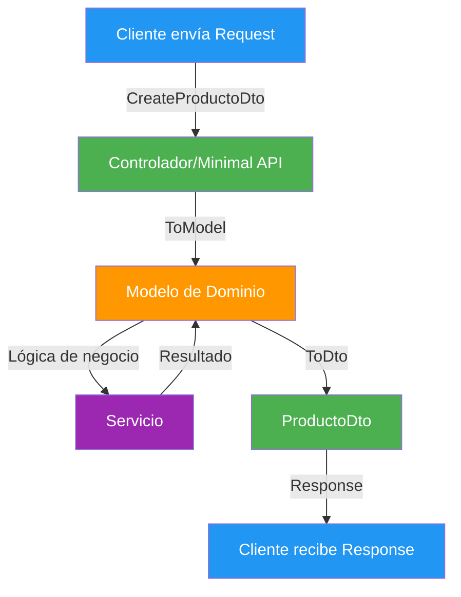
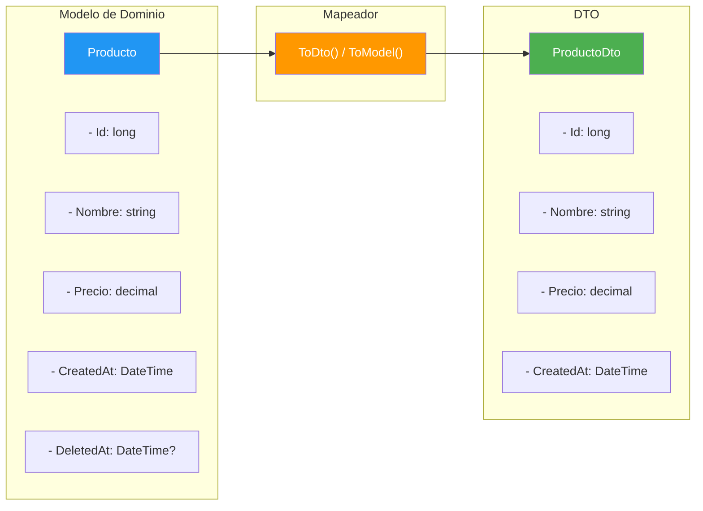
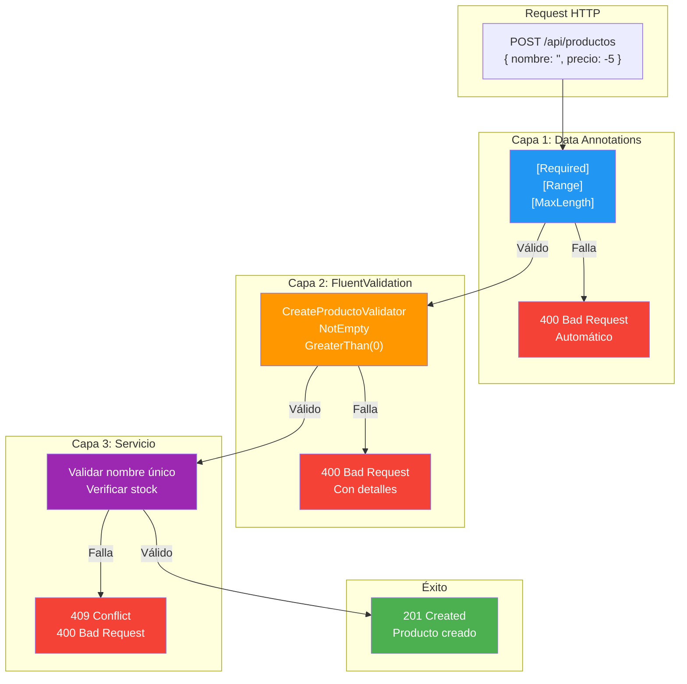
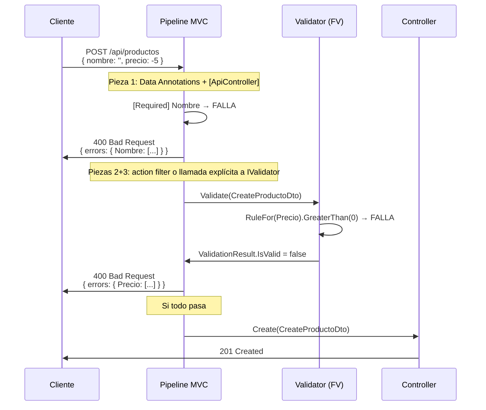
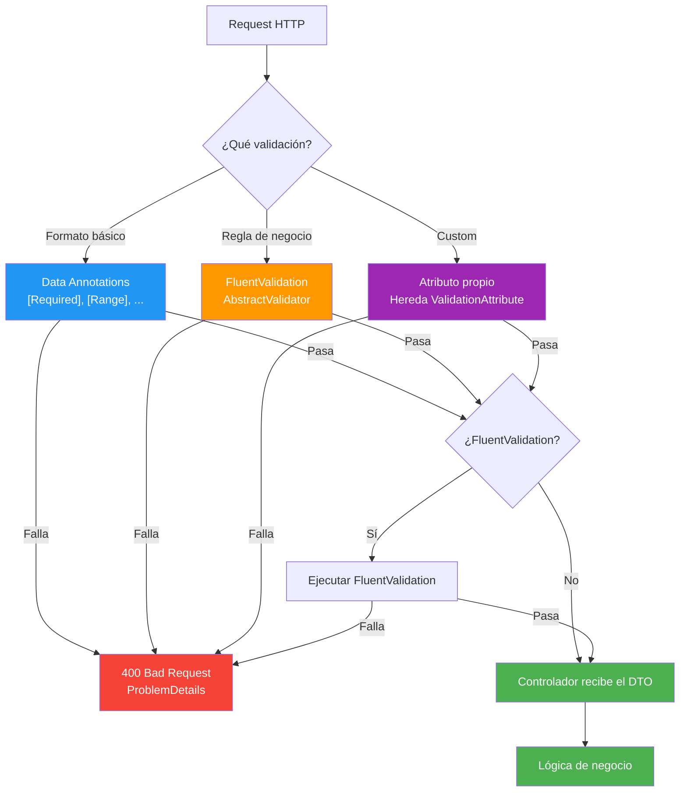
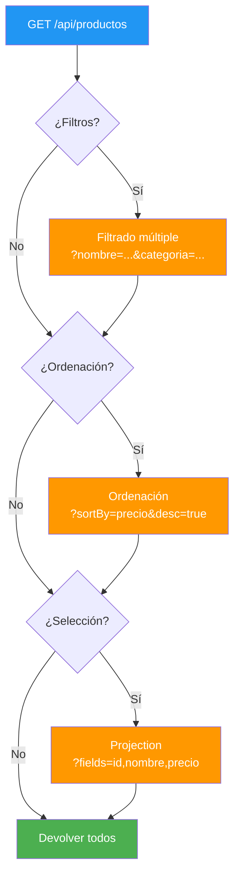
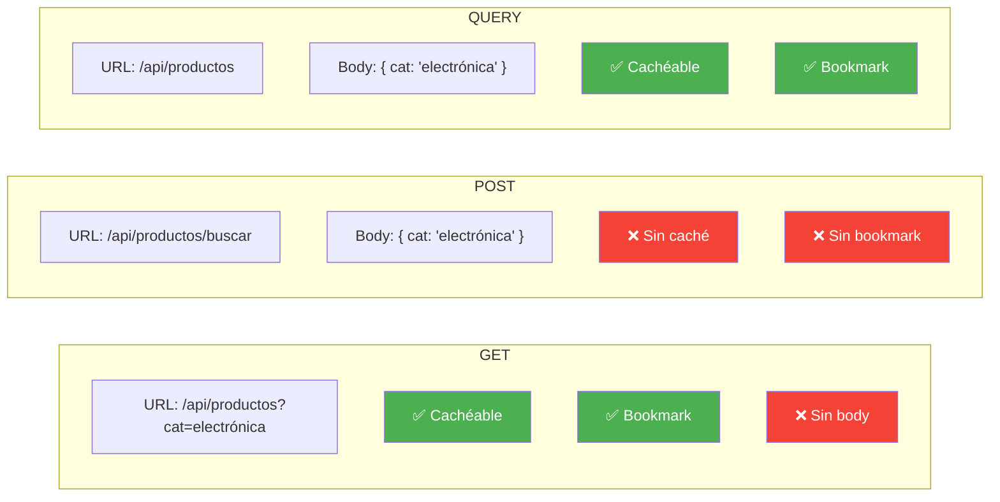
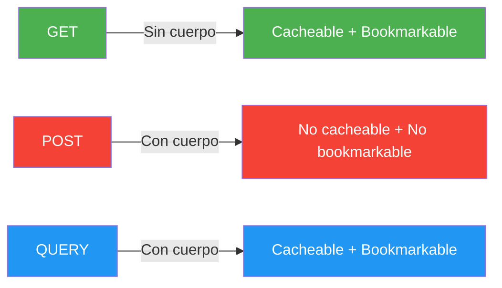
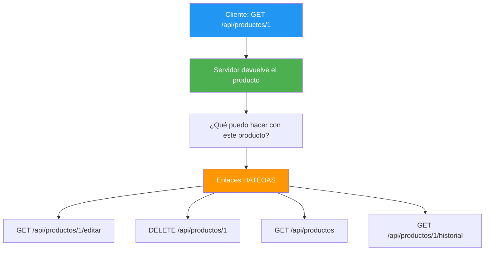
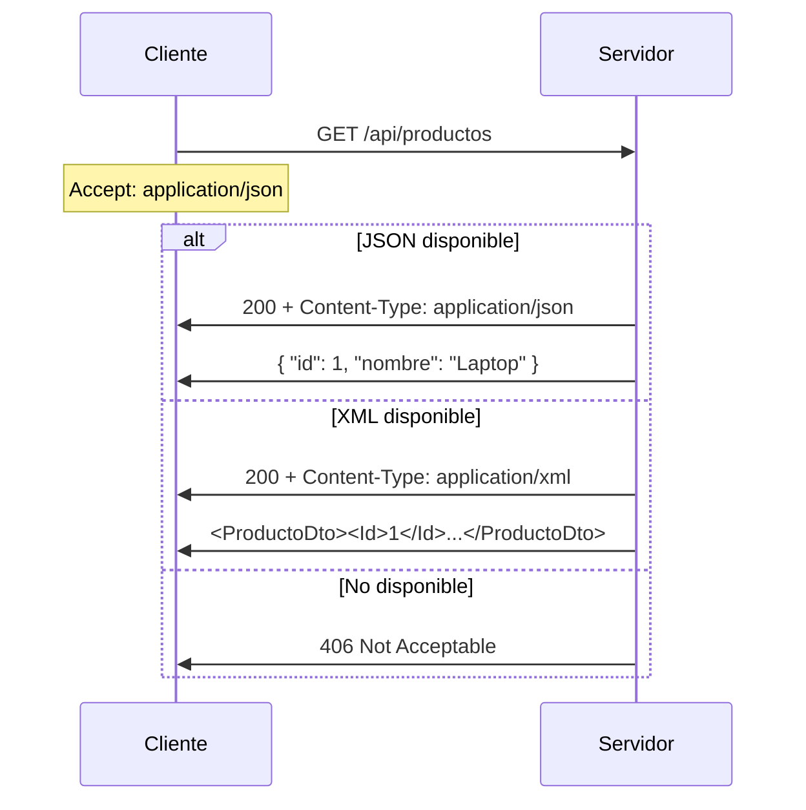

- [8. DTOs, Mapeadores, Validaciones y Consultas Avanzadas](#8-dtos-mapeadores-validaciones-y-consultas-avanzadas)
  - [8.1. DTOs para Request y Responses](#81-dtos-para-request-y-responses)
    - [8.1.1. ¿Qué es un DTO?](#811-qué-es-un-dto)
    - [8.1.2. Request DTOs vs Response DTOs](#812-request-dtos-vs-response-dtos)
    - [8.1.3. DTOs en minimal APIs vs controladores](#813-dtos-en-minimal-apis-vs-controladores)
    - [8.1.4. ¿Cuándo crear un DTO y cuándo usar el modelo directamente?](#814-cuándo-crear-un-dto-y-cuándo-usar-el-modelo-directamente)
  - [8.2. Mapeadores](#82-mapeadores)
    - [8.2.1. ¿Por qué mapear?](#821-por-qué-mapear)
    - [8.2.2. Funciones de extensión (recomendado)](#822-funciones-de-extensión-recomendado)
    - [8.2.3. AutoMapper (cuándo usarlo)](#823-automapper-cuándo-usarlo)
    - [8.2.4. Comparación: extensiones vs AutoMapper](#824-comparación-extensiones-vs-automapper)
  - [8.3. Validaciones](#83-validaciones)
    - [8.3.1. Data Annotations: formato básico](#831-data-annotations-formato-básico)
      - [8.3.1.1. Ejemplo completo con múltiples atributos](#8311-ejemplo-completo-con-múltiples-atributos)
    - [8.3.2. Crear tu propia etiqueta de validación](#832-crear-tu-propia-etiqueta-de-validación)
      - [8.3.2.1. Otro ejemplo: validación de contraseña fuerte](#8321-otro-ejemplo-validación-de-contraseña-fuerte)
    - [8.3.3. FluentValidation: reglas de negocio](#833-fluentvalidation-reglas-de-negocio)
      - [8.3.3.1. Reglas avanzadas de FluentValidation](#8331-reglas-avanzadas-de-fluentvalidation)
    - [8.3.4. Cuándo usar cada una](#834-cuándo-usar-cada-una)
    - [8.3.5. Integración con ASP.NET Core](#835-integración-con-aspnet-core)
    - [8.3.6. ¿Qué pasa cuando la validación falla? (Middleware)](#836-qué-pasa-cuando-la-validación-falla-middleware)
    - [8.3.7. Validación en ASP.NET Core](#837-validación-en-aspnet-core)
  - [8.4. Consultas avanzadas en endpoints](#84-consultas-avanzadas-en-endpoints)
    - [8.4.1. Filtrado múltiple](#841-filtrado-múltiple)
    - [8.4.2. Ordenación](#842-ordenación)
    - [8.4.3. Selección de campos (projection)](#843-selección-de-campos-projection)
    - [8.4.4. Búsqueda con patrones](#844-búsqueda-con-patrones)
  - [8.5. Parámetros de consulta (Query Parameters)](#85-parámetros-de-consulta-query-parameters)
    - [8.5.1. ¿Qué son los query parameters?](#851-qué-son-los-query-parameters)
    - [8.5.2. \[FromQuery\] en controladores](#852-fromquery-en-controladores)
    - [8.5.3. Query strings en minimal APIs](#853-query-strings-en-minimal-apis)
    - [8.5.4. Buenas prácticas](#854-buenas-prácticas)
  - [8.6. El nuevo método HTTP QUERY (RFC 10008)](#86-el-nuevo-método-http-query-rfc-10008)
    - [8.6.1. ¿Qué es QUERY?](#861-qué-es-query)
    - [8.6.2. QUERY vs GET vs POST](#862-query-vs-get-vs-post)
    - [8.6.3. Ejemplo práctico](#863-ejemplo-práctico)
    - [8.6.4. Estado actual y compatibilidad](#864-estado-actual-y-compatibilidad)
  - [8.7. HATEOAS](#87-hateoas)
    - [8.7.1. ¿Qué es HATEOAS?](#871-qué-es-hateoas)
    - [8.7.2. Enlaces de paginación en headers](#872-enlaces-de-paginación-en-headers)
    - [8.7.3. Enlaces en el body de la respuesta](#873-enlaces-en-el-body-de-la-respuesta)
    - [8.7.4. Implementación en ASP.NET Core](#874-implementación-en-aspnet-core)
  - [8.8. Negociación de Contenido](#88-negociación-de-contenido)
    - [8.8.1. ¿Qué es la negociación de contenido?](#881-qué-es-la-negociación-de-contenido)
    - [8.8.2. Configuración de JSON y XML](#882-configuración-de-json-y-xml)
    - [8.8.3. XmlSerializer vs DataContractSerializer](#883-xmlserializer-vs-datacontractserializer)
    - [8.8.4. Uso desde el cliente](#884-uso-desde-el-cliente)
    - [8.8.5. Respuesta JSON vs XML](#885-respuesta-json-vs-xml)
    - [8.8.6. Errores comunes al configurar XML](#886-errores-comunes-al-configurar-xml)
  - [8.9. Buenas prácticas](#89-buenas-prácticas)
  - [8.10. Reto](#810-reto)


# 8. DTOs, Mapeadores, Validaciones y Consultas Avanzadas

> 💡 **Punto de partida:** Cuando Netflix te muestra una serie, no te muestra el modelo interno con IDs de bases de datos, fechas de creación del registro, y campos internos. Te muestra un título, una imagen, una descripción... Eso es un DTO: lo que el cliente necesita ver, no lo que el servidor tiene guardado.

En este punto aprenderás a transferir datos entre capas con DTOs, a mapear modelos, a validar entradas y a diseñar endpoints flexibles con query parameters y HATEOAS.

**Objetivos de aprendizaje:**

- Crear DTOs para Request y Response
- Mapear con funciones de extensión (recomendado) y AutoMapper
- Validar con Data Annotations y FluentValidation
- Diseñar consultas avanzadas con query parameters
- Conocer el nuevo método HTTP QUERY
- Implementar HATEOAS para APIs navegables

## 8.1. DTOs para Request y Responses

### 8.1.1. ¿Qué es un DTO?

Un **DTO** (Data Transfer Object) es un objeto que transporta datos entre capas de la aplicación. No es un modelo de dominio — es una "cáscara" optimizada para la transferencia de datos.

> 💡 **Analogía:** Un DTO es como una tarjeta de presentación. Tu modelo de dominio tiene toda tu información (dirección, teléfono, email, historial completo), pero la tarjeta de presentación solo muestra lo que necesitas para el primer contacto: nombre y cargo.

📌 Ejemplo real: **Netflix** cuando muestra la información de una serie, no envía el modelo interno con IDs de MongoDB, fechas de indexación, campos de recomendación del algoritmo... Envía un DTO con título, imagen, sinopsis, valoración. Eso es exactamente lo que hacemos aquí.

### 8.1.2. Request DTOs vs Response DTOs

| Tipo | Propósito | Ejemplo |
|------|-----------|---------|
| **Request DTO** | Lo que el cliente envía al servidor | `CreateProductoDto { Nombre, Precio, Categoria }` |
| **Response DTO** | Lo que el servidor devuelve al cliente | `ProductoDto { Id, Nombre, Precio, Categoria, CreatedAt }` |

```csharp
// Request DTO: lo que el cliente envía para crear
public record CreateProductoDto(
    string Nombre,
    decimal Precio,
    string Categoria);

// Response DTO: lo que el servidor devuelve
public record ProductoDto(
    long Id,
    string Nombre,
    decimal Precio,
    string Categoria,
    DateTime CreatedAt);

// Request DTO: lo que el cliente envía para actualizar (parcial)
public record UpdateProductoDto(
    string? Nombre,
    decimal? Precio,
    string? Categoria);
```

📌 Ejemplo real: **Amazon** cuando creas un pedido, envías un `CreatePedidoDto` con productos y dirección de envío. El servidor devuelve un `PedidoDto` con ID, fecha de creación, estado y total calculado. Mismo patrón, distintos DTOs para distintas operaciones.

### 8.1.3. DTOs en minimal APIs vs controladores

```csharp
// Minimal API: el DTO se usa directamente en el delegate
app.MapPost("/api/productos", (CreateProductoDto dto, IProductoService service) =>
{
    var producto = service.Create(dto);
    return Results.Created($"/api/productos/{producto.Id}", producto);
});

// Controlador: el DTO se usa como parámetro del método
[HttpPost]
public IActionResult Create([FromBody] CreateProductoDto dto)
{
    var producto = service.Create(dto);
    return CreatedAtAction(nameof(GetById), new { id = producto.Id }, producto);
}
```

📌 Ejemplo real: **Spotify** usa un patrón similar. Cuando das "like" a una canción, envías un `LikeRequestDto` con el ID de la canción. El servidor devuelve un `LikeResponseDto` con el estado de la operación. Minimal API o controlador, el patrón es el mismo.

### 8.1.4. ¿Cuándo crear un DTO y cuándo usar el modelo directamente?

| Situación | Usar DTO | Usar modelo directamente |
|-----------|:--------:|:------------------------:|
| El modelo tiene campos internos que no deben exponerse | ✅ | |
| El modelo y el request son muy diferentes | ✅ | |
| El modelo es simple y se usa igual en todas partes | | ✅ |
| Estás en un prototipo o ejemplo pequeño | | ✅ |

> 💡 **Consejo:** En proyectos pequeños o ejemplos didácticos, no hace falta crear DTOs. En producción SIEMPRE se usan DTOs para separar el dominio de la API.



## 8.2. Mapeadores

### 8.2.1. ¿Por qué mapear?

Si tu modelo de dominio es `Producto` y tu DTO es `ProductoDto`, necesitas convertir entre ambos. Hacerlo manualmente en cada endpoint es tedioso y propenso a errores.



📌 Ejemplo real: **Airbnb** tiene modelos internos con cientos de campos (disponibilidad, geolocalización, historial de reservas, puntuaciones...), pero el cliente solo ve una selección de esos campos. El mapeador se encarga de esa transformación de forma consistente.

### 8.2.2. Funciones de extensión (recomendado)

El enfoque más simple y recomendado: funciones estáticas que convierten entre tipos.

```csharp
public static class ProductoMapper
{
    // Modelo → DTO
    public static ProductoDto ToDto(this Producto producto) => new()
    {
        Id = producto.Id,
        Nombre = producto.Nombre,
        Precio = producto.Precio,
        Categoria = producto.Categoria,
        CreatedAt = producto.CreatedAt
    };

    // DTO → Modelo
    public static Producto ToModel(this CreateProductoDto dto) => new()
    {
        Nombre = dto.Nombre,
        Precio = dto.Precio,
        Categoria = dto.Categoria
    };
}
```

**Uso:**

```csharp
// En el servicio
var dto = producto.ToDto();       // Producto → ProductoDto (salida al cliente)
var nuevo = createDto.ToModel();  // CreateProductoDto → Producto (entrada del cliente)
```

**Ventajas:**
- Sin dependencias de terceros
- Rendimiento óptimo (sin reflection)
- Fácil de debuggear
- Tipado fuerte en tiempo de compilación

### 8.2.3. AutoMapper (cuándo usarlo)

**AutoMapper** es una librería que mapea automáticamente entre tipos usando reflection. Úsala cuando tienes muchos modelos y DTOs similares.

```bash
dotnet add package AutoMapper
```

```csharp
// Profile de mapeo
public class ProductoProfile : Profile
{
    public ProductoProfile()
    {
        CreateMap<CreateProductoDto, Producto>();
        CreateMap<Producto, ProductoDto>();
    }
}

// Uso
var dto = mapper.Map<ProductoDto>(producto);
var modelo = mapper.Map<CreateProductoDto>(dto);
```

📌 Ejemplo real: **Mercado Libre** maneja miles de entidades (productos, usuarios, pedidos, pagos, envíos...). Con tantos modelos, AutoMapper simplifica enormemente el mapeo. Pero para una API pequeña, es demasiada artillería.

### 8.2.4. Comparación: extensiones vs AutoMapper

| | Funciones de extensión | AutoMapper |
|--|------------------------|------------|
| **Dependencias** | Ninguna | NuGet |
| **Rendimiento** | Máximo | Menor (reflection) |
| **Configuración** | Manual | Automática |
| **Mantenimiento** | Manual por cada tipo | Automático |
| **Debug** | Fácil | Difícil |
| **Recomendado para** | Proyectos pequeños/medianos | Proyectos grandes con muchos modelos |

> 💡 **Consejo:** Empieza con funciones de extensión. Cuando tengas 10+ modelos y sientas que es tedioso, migra a AutoMapper.

## 8.3. Validaciones

> 💡 **Punto de partida:** ¿Qué pasaría si alguien pudiera crear un producto con precio negativo, nombre vacío y categoría inexistente? Tu API aceptaría basura. Las validaciones son la puerta que filtra las peticiones malformadas antes de que lleguen a la lógica de negocio.

La validación es una de las partes más importantes de cualquier API. Sin ella, tu aplicación puede comportarse de forma inesperada, guardar datos corruptos o incluso fallar con excepciones no controladas.

En ASP.NET Core tenemos **dos niveles de validación** que se ejecutan **antes** de que el controlador reciba la petición:

1. **Data Annotations** — formato básico (campos obligatorios, rangos, longitudes)
2. **FluentValidation** — reglas de negocio complejas (condicionales, validación cruzada, lógica)

Además, cuando la validación falla, el propio pipeline de MVC (el `ModelStateInvalidFilter`) devuelve un `400 Bad Request` con `ProblemDetails` **antes** de que se ejecute el action. El **middleware de excepciones** que configuramos en el punto 07 solo interviene cuando se lanza una excepción no controlada: la convierte en `ProblemDetails`, pero eso ya sería un `500`, no un `400` de validación.



📌 Ejemplo real: **Netflix** cuando creas una cuenta valida que el email tenga formato correcto (Data Annotations), que la contraseña tenga al menos 8 caracteres con una mayúscula y un número (FluentValidation), y que el email no esté ya registrado en la base de datos (validación en servicio). Los tres niveles trabajando en conjunto.

### 8.3.1. Data Annotations: formato básico

**Data Annotations** son atributos que se ponen en los modelos/DTOs para validar formato básico. ASP.NET Core los valida automáticamente antes de que el controlador reciba la petición. Si algún atributo falla, el framework devuelve un `400 Bad Request` con los errores sin que escribas una sola línea de validación.

```csharp
public record CreateProductoDto
{
    [Required(ErrorMessage = "El nombre es obligatorio")]
    [MaxLength(100, ErrorMessage = "El nombre no puede tener más de 100 caracteres")]
    public string Nombre { get; init; } = string.Empty;

    [Range(0.01, 999999.99, ErrorMessage = "El precio debe estar entre 0.01 y 999999.99")]
    public decimal Precio { get; init; }

    [Required(ErrorMessage = "La categoría es obligatoria")]
    public string Categoria { get; init; } = string.Empty;

    public string? Imagen { get; init; }
}
```

**Atributos comunes de `System.ComponentModel.DataAnnotations`:**

| Atributo | Qué valida | Ejemplo |
|----------|-----------|---------|
| `[Required]` | Campo obligatorio (no puede ser null, vacío o whitespace) | `[Required(ErrorMessage = "Nombre requerido")]` |
| `[MaxLength(n)]` | Longitud máxima de string | `[MaxLength(100)]` |
| `[MinLength(n)]` | Longitud mínima de string | `[MinLength(2)]` |
| `[Range(min, max)]` | Rango numérico (int, decimal, double) | `[Range(0, 150)]` para edad |
| `[StringLength(max)]` | Longitud máxima de string (igual que MaxLength) | `[StringLength(200)]` |
| `[EmailAddress]` | Formato de email válido | `[EmailAddress]` |
| `[Phone]` | Formato de teléfono válido | `[Phone]` |
| `[Url]` | Formato de URL válido | `[Url]` |
| `[RegularExpression]` | Patrón personalizado con regex | `[RegularExpression("^[A-Z]{2}\\d{6}$")]` |
| `[Compare("Campo")]` | Dos campos deben ser iguales (útil para confirmar contraseña) | `[Compare("Password")]` |
| `[CreditCard]` | Formato de tarjeta de crédito válido | `[CreditCard]` |
| `[DataType(DataType.Date)]` | Tipo de dato (fecha, email, etc.) | `[DataType(DataType.Date)]` |

> 📝 **Nota:** `[DataType]` **no valida nada**: solo le indica al cliente cómo mostrar el campo (fecha, email, etc.). La validación real la hacen atributos como `[Required]`, `[EmailAddress]` o `[Range]`.

📌 Ejemplo real: **Twitter/X** valida que un tweet no supere los 280 caracteres. Eso es un `[MaxLength(280)]`. Un campo de email lleva `[EmailAddress]`. Un campo de edad tiene `[Range(0, 150)]`. Un formulario de registro usa `[Required]` en todos los campos obligatorios y `[Compare("Password")]` para confirmar la contraseña. Data Annotations en estado puro.

#### 8.3.1.1. Ejemplo completo con múltiples atributos

```csharp
public record RegistroUsuarioDto
{
    [Required(ErrorMessage = "El nombre de usuario es obligatorio")]
    [MinLength(3, ErrorMessage = "Mínimo 3 caracteres")]
    [MaxLength(20, ErrorMessage = "Máximo 20 caracteres")]
    [RegularExpression("^[a-zA-Z0-9_]+$", ErrorMessage = "Solo letras, números y guión bajo")]
    public string Username { get; init; } = string.Empty;

    [Required(ErrorMessage = "El email es obligatorio")]
    [EmailAddress(ErrorMessage = "El email no tiene un formato válido")]
    public string Email { get; init; } = string.Empty;

    [Required(ErrorMessage = "La contraseña es obligatoria")]
    [MinLength(8, ErrorMessage = "Mínimo 8 caracteres")]
    [RegularExpression("^(?=.*[a-z])(?=.*[A-Z])(?=.*\\d).+$",
        ErrorMessage = "Debe tener al menos una mayúscula, una minúscula y un número")]
    public string Password { get; init; } = string.Empty;

    [Required(ErrorMessage = "Debes confirmar la contraseña")]
    [Compare("Password", ErrorMessage = "Las contraseñas no coinciden")]
    public string ConfirmPassword { get; init; } = string.Empty;

    [Range(0, 150, ErrorMessage = "La edad debe estar entre 0 y 150")]
    public int? Edad { get; init; }

    [Url(ErrorMessage = "La imagen debe ser una URL válida")]
    public string? AvatarUrl { get; init; }

    [Phone(ErrorMessage = "El teléfono no tiene un formato válido")]
    public string? Telefono { get; init; }
}
```

📌 Ejemplo real: **Amazon** usa exactamente este patrón en su formulario de registro: username con regex, email con formato, contraseña con requisitos de complejidad, y confirmación de contraseña. Todo con Data Annotations.

### 8.3.2. Crear tu propia etiqueta de validación

A veces los atributos de Microsoft no son suficientes. Por ejemplo, ¿qué pasa si necesitas validar que un nombre de usuario no sea "admin", "root" o "sistema"? No hay un atributo para eso. La solución: **crear tu propio atributo de validación**.

Para crear un atributo personalizado, heredas de `ValidationAttribute` y sobrescribes el método `IsValid`:

```csharp
using System.ComponentModel.DataAnnotations;

public class NoAdminAttribute : ValidationAttribute
{
    private static readonly string[] Prohibidos = ["admin", "root", "sistema"];

    protected override ValidationResult? IsValid(
        object? value, ValidationContext validationContext)
    {
        // Si el valor es null o no es string, es válido (otro atributo se encarga del Required)
        if (value is not string texto)
            return ValidationResult.Success;

        // Si el texto está en la lista de prohibidos, falla
        if (Prohibidos.Contains(texto.ToLowerInvariant()))
            return new ValidationResult(
                "El nombre no puede ser 'admin', 'root' o 'sistema'.");

        // Si todo está bien, éxito
        return ValidationResult.Success;
    }
}
```

**Uso en el DTO:**

```csharp
public record CreateProductoDto
{
    [Required(ErrorMessage = "El nombre es obligatorio")]
    [MaxLength(100, ErrorMessage = "El nombre no puede tener más de 100 caracteres")]
    [NoAdmin]  // ← Nuestra validación personalizada
    public string Nombre { get; init; } = string.Empty;

    // ...
}
```

**Qué pasa cuando falla:** El mismo pipeline de validación de ASP.NET Core detecta que `NoAdmin` ha devuelto un `ValidationResult` con error, y lo incluye en la respuesta 400 automáticamente:

```json
{
  "type": "https://tools.ietf.org/html/rfc9110#section-15.5.1",
  "title": "One or more validation errors occurred.",
  "status": 400,
  "errors": {
    "Nombre": ["El nombre no puede ser 'admin', 'root' o 'sistema'."]
  }
}
```

> 💡 **Analogía:** Un atributo personalizado es como un detective privado. Los atributos de Microsoft son la policía normal (saben lo básico: si el campo está vacío, si el email es válido...). Pero si necesitas algo más específico — como comprobar que un nombre no esté en una lista negra — contratas a tu propio detective: `NoAdminAttribute`.

📌 Ejemplo real: **Slack** valida que el nombre de un workspace no contenga palabras ofensivas ni nombres de marcas registradas. Eso se hace con un atributo personalizado que compara contra una lista negra, exactamente como nuestro `NoAdmin`.

#### 8.3.2.1. Otro ejemplo: validación de contraseña fuerte

```csharp
public class StrongPasswordAttribute : ValidationAttribute
{
    protected override ValidationResult? IsValid(
        object? value, ValidationContext validationContext)
    {
        if (value is not string password)
            return ValidationResult.Success;

        if (password.Length < 8)
            return new ValidationResult("Mínimo 8 caracteres");

        if (!password.Any(char.IsUpper))
            return new ValidationResult("Debe contener al menos una mayúscula");

        if (!password.Any(char.IsLower))
            return new ValidationResult("Debe contener al menos una minúscula");

        if (!password.Any(char.IsDigit))
            return new ValidationResult("Debe contener al menos un número");

        return ValidationResult.Success;
    }
}

// Uso:
[StrongPassword]
public string Password { get; init; } = string.Empty;
```

### 8.3.3. FluentValidation: reglas de negocio

**FluentValidation** es una librería para validar con reglas más complejas que dependen de lógica de negocio. Se usa una clase separada (un "validator") en lugar de atributos en el modelo.

```bash
dotnet add package FluentValidation.AspNetCore
```

```csharp
public class CreateProductoValidator : AbstractValidator<CreateProductoDto>
{
    private static readonly string[] CategoriasValidas =
        ["Electrónica", "Mobiliario", "Instrumentos", "Deportes", "Libros"];

    public CreateProductoValidator()
    {
        RuleFor(x => x.Nombre)
            .NotEmpty().WithMessage("El nombre es obligatorio")
            .MaximumLength(100).WithMessage("El nombre no puede tener más de 100 caracteres")
            .MinimumLength(2).WithMessage("El nombre debe tener al menos 2 caracteres");

        RuleFor(x => x.Precio)
            .GreaterThan(0).WithMessage("El precio debe ser mayor que 0")
            .LessThan(1_000_000).WithMessage("El precio no puede superar 1.000.000");

        RuleFor(x => x.Categoria)
            .NotEmpty().WithMessage("La categoría es obligatoria")
            .Must(c => CategoriasValidas.Contains(c))
            .WithMessage($"Categorías válidas: {string.Join(", ", CategoriasValidas)}");

        RuleFor(x => x.Imagen)
            .Must(url => string.IsNullOrEmpty(url) ||
                         Uri.TryCreate(url, UriKind.Absolute, out _))
            .When(x => !string.IsNullOrEmpty(x.Imagen))
            .WithMessage("La imagen debe ser una URL válida");
    }
}
```

📌 Ejemplo real: **Wallapop** valida que al publicar un anuncio: el título no esté vacío, el precio sea positivo, la categoría exista en la lista de categorías permitidas, y la ubicación sea una ciudad válida de España. Eso no puedes hacerlo solo con Data Annotations — necesitas FluentValidation.

#### 8.3.3.1. Reglas avanzadas de FluentValidation

```csharp
public class RegistroValidator : AbstractValidator<RegistroUsuarioDto>
{
    public RegistroValidator()
    {
        // Validación condicional: solo validar si el campo tiene valor
        RuleFor(x => x.Edad)
            .InclusiveBetween(18, 120)
            .When(x => x.Edad.HasValue);

        // Validación entre dos campos (cross-field)
        RuleFor(x => x.ConfirmPassword)
            .Equal(x => x.Password)
            .WithMessage("Las contraseñas no coinciden");

        // Validación con Must (lógica personalizada)
        RuleFor(x => x.Username)
            .Must(username => !username.Contains(' '))
            .WithMessage("El nombre de usuario no puede contener espacios");

        // Mensajes por defecto (sin .WithMessage)
        RuleFor(x => x.Email)
            .NotEmpty()
            .EmailAddress();
    }
}
```

### 8.3.4. Cuándo usar cada una

| | Data Annotations | FluentValidation |
|--|------------------|------------------|
| **Complejidad** | Baja | Media/Alta |
| **Reglas de negocio** | No | Sí |
| **Validación con BD** | No | Sí (con servicios) |
| **Configuración** | En el modelo | En una clase separada |
| **Recomendado para** | Formato básico | Reglas de negocio |
| **Personalización** | Atributos heredados de `ValidationAttribute` | Clases con lógica arbitraria |
| **Legibilidad** | En el modelo (puede ser verboso) | Separada (más limpio) |

> 💡 **Consejo:** Usa **Data Annotations** para formato básico (`[Required]`, `[Range]`). Usa **FluentValidation** cuando necesites reglas complejas (verificar que un nombre no exista en BD, que un email sea único, etc.). No mezcles ambos para la misma validación — elige uno u otro según la complejidad.

📌 Ejemplo real: **GitHub** usa Data Annotations para validaciones simples en sus endpoints (required, max length). Pero para validaciones complejas como "el nombre del repositorio no puede conflicto con uno existente del mismo usuario", usa lógica en el servicio, equivalente al enfoque de FluentValidation.

### 8.3.5. Integración con ASP.NET Core

La validación en ASP.NET Core se compone de **tres piezas distintas** que no debes confundir:

| # | Pieza | Qué hace | ¿Viene de serie? |
|---|-------|----------|:----------------:|
| **1** | **Data Annotations + `[ApiController]`** | Valida los atributos del DTO y devuelve `400 Bad Request` sin que escribas código | ✅ |
| **2** | **`AddValidatorsFromAssemblyContaining<T>()`** | **Solo registra** tus `IValidator<T>` en el contenedor de DI. **No ejecuta ninguna validación** | ❌ |
| **3** | **Ejecución** | Alguien debe invocar al validador: un action filter (`AddFluentValidationAutoValidation()`) o una llamada explícita a `IValidator<T>` | ❌ |

```csharp
// Program.cs — pieza 2: registrar los validators en DI
// (esto NO ejecuta la validación por sí solo)
builder.Services.AddValidatorsFromAssemblyContaining<Program>();

// Pieza 3 (opción A): ejecución automática vía action filter.
// Requiere el paquete FluentValidation.AspNetCore y llamarse DESPUÉS de AddControllers().
// Solo funciona en MVC/controllers; el paquete ya no se mantiene (proyectos legacy).
builder.Services.AddFluentValidationAutoValidation();
```

> 📝 **Nota:** `AddValidatorsFromAssemblyContaining` usa reflection para encontrar todos tus `AbstractValidator<T>` y registrarlos como `IValidator<T>` en DI. Si te olvidas de la pieza 3, esos validadores quedan registrados pero **nunca se ejecutan**.

**Pieza 3, opción B: invocar el validador explícitamente** (enfoque manual recomendado en la documentación oficial; funciona igual en controllers y Minimal APIs):

```csharp
// Minimal API — llamar a IValidator<T> a mano
app.MapPost("/api/productos", async (
    CreateProductoDto dto,
    IValidator<CreateProductoDto> validator,
    IProductoService service) =>
{
    // Pieza 3: ejecutar el validador registrado en DI
    var resultado = await validator.ValidateAsync(dto);
    if (!resultado.IsValid)
        return Results.ValidationProblem(resultado.ToDictionary());

    var producto = await service.Create(dto);
    return Results.Created($"/api/productos/{producto.Id}", producto);
});
```

Con las tres piezas conectadas, cuando un endpoint recibe un DTO con `[FromBody]`:

1. Se ejecutan los **Data Annotations** del DTO (pieza 1; con `[ApiController]`, un fallo devuelve `400` automáticamente)
2. Si la pieza 3 está configurada, se ejecuta el `AbstractValidator<T>` registrado en DI (piezas 2 + 3)
3. Si ambos pasan, el action recibe el DTO validado
4. Si alguno falla, se devuelve `400 Bad Request` automáticamente **sin llegar al action**



> ⚠️ **Advertencia:** `AddValidatorsFromAssemblyContaining<Program>()` **solo registra** los validadores en DI: por sí solo **no ejecuta la validación**. Sin la pieza 3 (action filter con `AddFluentValidationAutoValidation()` o una llamada explícita a `IValidator<T>`), tus reglas FluentValidation **nunca se ejecutarán**. Los Data Annotations sí funcionan siempre: los valida el propio framework con `[ApiController]`.

### 8.3.6. ¿Qué pasa cuando la validación falla? (Middleware)

Cuando la validación falla — ya sea por Data Annotations o FluentValidation — ASP.NET Core devuelve automáticamente un `400 Bad Request` con un formato estándar. **No necesitas escribir código de validación en el controlador.**

```csharp
// ❌ MALO: Validación manual en el controller (no hagas esto)
[HttpPost]
public IActionResult Create([FromBody] CreateProductoDto dto)
{
    if (string.IsNullOrEmpty(dto.Nombre))
        return BadRequest("El nombre es obligatorio");
    if (dto.Precio <= 0)
        return BadRequest("El precio debe ser positivo");
    // ... 20 líneas más de validación
    return CreatedAtAction(...);
}

// ✅ BUENO: La validación se ejecuta automáticamente antes del controller
[HttpPost]
public IActionResult Create([FromBody] CreateProductoDto dto)
{
    // Aquí el DTO ya está validado — si llegamos aquí, todo está bien
    var result = service.Create(dto);
    return result.Match(
        producto => CreatedAtAction(nameof(GetById), new { id = producto.Id }, producto.ToDto()),
        error => error.ToHttpResult());
}
```

**Formato de la respuesta de error:**

```json
{
  "type": "https://tools.ietf.org/html/rfc9110#section-15.5.1",
  "title": "One or more validation errors occurred.",
  "status": 400,
  "errors": {
    "Nombre": ["El nombre es obligatorio"],
    "Precio": ["El precio debe estar entre 0.01 y 999999.99"],
    "Categoria": ["La categoría es obligatoria"]
  },
  "traceId": "00-abc123-def456-789"
}
```

📌 Ejemplo real: **Stripe** (pasarela de pagos) devuelve errores de validación muy estructurados: un código de error, un mensaje descriptivo y un campo que indica qué parámetro falló. Es el mismo patrón que aplicamos aquí con `ProblemDetails`.

> 💡 **Consejo:** En el punto 07 configuramos el middleware `UseExceptionHandler` (con un `IExceptionHandler` registrado en DI) que captura las excepciones no controladas y las convierte en `ProblemDetails`. Ese middleware funciona como "red de seguridad" — si la validación falla de alguna forma inesperada, el middleware se encarga de que el cliente reciba una respuesta coherente en lugar de un 500 genérico.

📌 Ejemplo real: **Mercado Libre** tiene un middleware similar que captura errores de validación, errores de base de datos y excepciones no controladas, y los convierte en respuestas consistentes con código, mensaje y campo afectado. Sin ese middleware, cada endpoint tendría que manejar sus propios errores, lo cual es propenso a olvidos y inconsistencias.

### 8.3.7. Validación en ASP.NET Core



## 8.4. Consultas avanzadas en endpoints



### 8.4.1. Filtrado múltiple

Permitir al cliente filtrar por varios campos a la vez:

```csharp
[HttpGet]
public IActionResult GetAll(
    [FromQuery] string? nombre,
    [FromQuery] string? categoria,
    [FromQuery] decimal? precioMin,
    [FromQuery] decimal? precioMax)
{
    IEnumerable<Producto> productos = service.GetAll();

    if (!string.IsNullOrEmpty(nombre))
        productos = productos.Where(p => p.Nombre.Contains(nombre));
    if (!string.IsNullOrEmpty(categoria))
        productos = productos.Where(p => p.Categoria == categoria);
    if (precioMin.HasValue)
        productos = productos.Where(p => p.Precio >= precioMin);
    if (precioMax.HasValue)
        productos = productos.Where(p => p.Precio <= precioMax);

    return Ok(productos);
}
```

📌 Ejemplo real: **Amazon** cuando buscas un producto puedes filtrar por categoría, rango de precio, valoración, marca, disponibilidad... Todos esos filtros son query parameters que el backend procesa para devolver solo lo relevante.

### 8.4.2. Ordenación

```csharp
[HttpGet]
public IActionResult GetAll(
    [FromQuery] string sortBy = "Nombre",
    [FromQuery] bool desc = false)
{
    IEnumerable<Producto> productos = service.GetAll();

    productos = sortBy.ToLower() switch
    {
        "precio" => desc ? productos.OrderByDescending(p => p.Precio) : productos.OrderBy(p => p.Precio),
        "fecha" => desc ? productos.OrderByDescending(p => p.CreatedAt) : productos.OrderBy(p => p.CreatedAt),
        _ => desc ? productos.OrderByDescending(p => p.Nombre) : productos.OrderBy(p => p.Nombre)
    };

    return Ok(productos);
}
```

### 8.4.3. Selección de campos (projection)

Devolver solo los campos que el cliente necesita:

```csharp
[HttpGet]
public IActionResult GetAll()
{
    var productos = service.GetAll()
        .Select(p => new { p.Id, p.Nombre, p.Precio })
        .ToList();

    return Ok(productos);
}
```

📌 Ejemplo real: **Netflix** cuando muestra el catálogo no carga todos los campos de cada serie (sinopsis completa, actores, fechas de estreno...). Solo carga título, imagen y valoración. Eso es projection — devolver solo lo necesario para la vista actual.

### 8.4.4. Búsqueda con patrones

```csharp
[HttpGet("search")]
public IActionResult Search([FromQuery] string q)
{
    var resultados = service.GetAll()
        .Where(p => p.Nombre.Contains(q, StringComparison.OrdinalIgnoreCase))
        .ToList();

    return Ok(resultados);
}
```

📌 Ejemplo real: **Mercado Libre** tiene un endpoint de búsqueda que acepta `?q=laptop+gamer` y devuelve productos que contengan esa frase en el título o descripción. El parámetro `q` es el estándar para búsquedas.

## 8.5. Parámetros de consulta (Query Parameters)

### 8.5.1. ¿Qué son los query parameters?

Los **query parameters** son valores que se añaden a la URL después de un `?`. Permiten pasar filtros, paginación y ordenación de forma sencilla.

```
GET /api/productos?nombre=laptop&precioMin=500&precioMax=2000&page=2&pageSize=10
```


📌 Ejemplo real: **Booking.com** cuando buscas hoteles, la URL tiene query parameters: `?destino=Madrid&fechaEntrada=2026-10-01&fechaSalida=2026-10-05&habitaciones=1&adultos=2`. Cada filtro es un query parameter.

### 8.5.2. [FromQuery] en controladores

```csharp
[HttpGet]
public IActionResult GetAll(
    [FromQuery] string? nombre,
    [FromQuery] string? categoria,
    [FromQuery] int page = 1,
    [FromQuery] int pageSize = 10)
{
    // ...
}
```

### 8.5.3. Query strings en minimal APIs

```csharp
app.MapGet("/api/productos", (
    string? nombre,
    string? categoria,
    int page = 1,
    int pageSize = 10) =>
{
    // ...
});
```

### 8.5.4. Buenas prácticas

| Práctica | Ejemplo |
|----------|---------|
| Valores por defecto | `page = 1`, `pageSize = 10` |
| Límites | `pageSize` máximo 100 |
| Nombres consistentes | `page`, `pageSize`, `sortBy`, `q` |
| Opcionales | `string?`, `decimal?`, `int?` |

## 8.6. El nuevo método HTTP QUERY (RFC 10008)

### 8.6.1. ¿Qué es QUERY?

**QUERY** es un nuevo método HTTP (RFC 10008) que combina la seguridad de GET (se puede cachear, es bookmarkable) con la capacidad de enviar un cuerpo con datos complejos en JSON (como POST).

### 8.6.2. QUERY vs GET vs POST

| Método | Cuerpo JSON | Caché | Bookmark | Seguro |
|--------|:-----------:|:-----:|:--------:|:------:|
| **GET** | ❌ | ✅ | ✅ | ✅ |
| **POST** | ✅ | ❌ | ❌ | ❌ |
| **QUERY** | ✅ | ✅ | ✅ | ✅ |





### 8.6.3. Ejemplo práctico

```http
QUERY /api/productos HTTP/1.1
Content-Type: application/json

{
  "categoria": "Electrónica",
  "precioMin": 100,
  "precioMax": 2000,
  "sortBy": "precio",
  "page": 1,
  "pageSize": 10
}
```

> ⚠️ **Advertencia:** QUERY todavía no está soportado por todos los clientes y servidores. Verifica la compatibilidad antes de usarlo en producción. Puedes ver un ejemplo práctico en [query-http-demo](https://github.com/midudev/query-http-demo).

### 8.6.4. Estado actual y compatibilidad

QUERY es un RFC reciente. ASP.NET Core no lo soporta nativamente todavía. Para usarlo, necesitarías un middleware personalizado o esperar a que se implemente en el framework.

📌 Ejemplo real: **GitHub** usa un patrón similar con sus API de búsqueda. Cuando haces una búsqueda compleja con muchos filtros, en lugar de colgar la URL con 20 query parameters, envía un cuerpo JSON. QUERY formaliza ese patrón.

## 8.7. HATEOAS

### 8.7.1. ¿Qué es HATEOAS?

**HATEOAS** (Hypertext As The Engine Of Application State) es un principio REST que indica que la respuesta debe incluir **enlaces** para navegar por los estados de la aplicación. El cliente no necesita conocer las URLs de antemano — las descubre a través de los enlaces.

> 💡 **Analogía:** HATEOAS es como un mapa interactivo. En lugar de decirte "ve a la calle X, gira a la derecha...", te da un mapa con botones que puedes pulsar para navegar.



📌 Ejemplo real: **GitHub API** es el ejemplo más famoso de HATEOAS. Cuando obtienes un repositorio, la respuesta incluye enlaces para obtener los issues, los pull requests, los contributors... El cliente no necesita ensamblar las URLs — solo seguir los enlaces.

### 8.7.2. Enlaces de paginación en headers

El estándar **RFC 8288** define cómo incluir enlaces en headers HTTP:

```http
HTTP/1.1 200 OK
Link: </api/productos?page=1>; rel="first",
      </api/productos?page=2>; rel="prev",
      </api/productos?page=4>; rel="next",
      </api/productos?page=10>; rel="last"
Content-Type: application/json

[{ "id": 21, "nombre": "Laptop" }, ...]
```

### 8.7.3. Enlaces en el body de la respuesta

Otra forma es incluir los enlaces directamente en el body:

```json
{
  "data": [{ "id": 21, "nombre": "Laptop" }],
  "links": {
    "self": "/api/productos?page=3",
    "first": "/api/productos?page=1",
    "prev": "/api/productos?page=2",
    "next": "/api/productos?page=4",
    "last": "/api/productos?page=10"
  }
}
```

### 8.7.4. Implementación en ASP.NET Core

```csharp
public static class PaginationLinksHelper
{
    public static string CreateLinkHeader(int page, int totalPages, int pageSize, string baseUrl)
    {
        var links = new List<string>();

        // first y last SIEMPRE se incluyen (son los extremos de la paginación)
        links.Add($"<{baseUrl}?page=1&pageSize={pageSize}>; rel=\"first\"");
        if (page > 1)
            links.Add($"<{baseUrl}?page={page - 1}&pageSize={pageSize}>; rel=\"prev\"");
        if (page < totalPages)
            links.Add($"<{baseUrl}?page={page + 1}&pageSize={pageSize}>; rel=\"next\"");
        links.Add($"<{baseUrl}?page={totalPages}&pageSize={pageSize}>; rel=\"last\"");

        return string.Join(", ", links);
    }
}
```

**Uso en el controlador:**

```csharp
[HttpGet]
public IActionResult GetAll([FromQuery] int page = 1, [FromQuery] int pageSize = 10)
{
    var productos = service.GetAllPaged(page, pageSize, out int totalPages);

    var linkHeader = PaginationLinksHelper.CreateLinkHeader(
        page, totalPages, pageSize, "/api/productos");
    Response.Headers.Append("Link", linkHeader);

    return Ok(productos);
}
```

> 💡 **Consejo:** Los enlaces en headers son más profesionales (separan datos de metadatos). Los enlaces en el body son más fáciles de consumir para clientes web. Usa el que mejor se adapte a tu caso.

## 8.8. Negociación de Contenido

### 8.8.1. ¿Qué es la negociación de contenido?

La **negociación de contenido** es el mecanismo que permite al cliente especificar el formato de los datos que desea recibir (JSON, XML, etc.) y el servidor responder en ese formato.

> 💡 **Analogía:** Es como ir a un restaurante y pedir el plato "para llevar" o "para comer aquí". El plato es el mismo, pero la presentación cambia según lo que pides.



📌 Ejemplo real: **GitHub** solo devuelve JSON. Si pides XML, devuelve `406 Not Acceptable`. Muchas APIs modernas solo usan JSON porque es más ligero y rápido.

### 8.8.2. Configuración de JSON y XML

La configuración se hace en `Program.cs`:

```csharp
builder.Services.AddControllers(options =>
{
    options.RespectBrowserAcceptHeader = true;   // Respetar header Accept del cliente
    options.ReturnHttpNotAcceptable = true;       // Devolver 406 si formato no soportado
})
.AddXmlDataContractSerializerFormatters();        // XML con DataContractSerializer
```

> ⚠️ **Advertencia:** Se usa `AddXmlDataContractSerializerFormatters()` en lugar de `AddXmlSerializerFormatters()` porque `XmlSerializer` requiere un constructor vacío obligatorio, y los records posicionales de C# no lo generan automáticamente. `DataContractSerializer` es más flexible y funciona con records.

📌 Ejemplo real: **TiendaAPI** usa esta misma configuración. En su `ControllersConfig.cs` tiene `RespectBrowserAcceptHeader = true` y `ReturnHttpNotAcceptable = true`, con el XML comentado para activarlo cuando se necesite.

### 8.8.3. XmlSerializer vs DataContractSerializer

| | `XmlSerializer` | `DataContractSerializer` |
|--|------------------|--------------------------|
| **Constructor vacío** | **Obligatorio** | No necesario |
| **Records posicionales** | ❌ No funciona | ✅ Funciona |
| **Control total** | Completo sobre nombres XML | Basado en atributos `[DataContract]` |
| **Rendimiento** | Más lento | Más rápido |
| **Recomendado para** | Proyectos legacy | Proyectos modernos con records |

### 8.8.4. Uso desde el cliente

El cliente indica el formato que desea con el header `Accept`:

```http
GET /api/productos HTTP/1.1
Accept: application/json
```

```http
GET /api/productos HTTP/1.1
Accept: application/xml
```

Si el formato no es soportado por el servidor, devuelve `406 Not Acceptable`:

```http
GET /api/productos HTTP/1.1
Accept: text/csv

→ 406 Not Acceptable
```

### 8.8.5. Respuesta JSON vs XML

**JSON:**
```json
[
  {
    "id": 1,
    "nombre": "Guitarra",
    "precio": 299.99,
    "categoria": "Instrumentos",
    "imagen": "",
    "createdAt": "2026-09-16T15:44:32.5071719Z",
    "updatedAt": null,
    "isActivo": true
  }
]
```

**XML:**
```xml
<ArrayOfProductoDto xmlns="http://schemas.datacontract.org/2004/07/ProductosAvanzados.Dtos">
  <ProductoDto>
    <Categoria>Instrumentos</Categoria>
    <CreatedAt>2026-09-16T15:44:32.5071719Z</CreatedAt>
    <Id>1</Id>
    <Imagen></Imagen>
    <IsActivo>true</IsActivo>
    <Nombre>Guitarra</Nombre>
    <Precio>299.99</Precio>
    <UpdatedAt />
  </ProductoDto>
</ArrayOfProductoDto>
```

### 8.8.6. Errores comunes al configurar XML

**Error 1: `406 Not Acceptable`**

Causa: El formateador XML no se ha registrado correctamente.

Solución: Asegúrate de tener `.AddXmlDataContractSerializerFormatters()` encadenado después de `AddControllers()`.

**Error 2: `500 Internal Server Error`**

Causa: `DataContractSerializer` no puede serializar `IEnumerable` lazy de LINQ.

Solución: Materializar la colección con `.ToList()` antes de devolverla:

```csharp
// ❌ MALO: IEnumerable lazy (falla con XML)
return Ok(result.Value.Select(p => p.ToDto()));

// ✅ BUENO: Colección materializada (funciona con XML)
return Ok(result.Value.Select(p => p.ToDto()).ToList());
```

**Error 3: `InvalidDataContractException` en el record**

Causa: El record posicional no tiene constructor vacío.

Solución: Añadir un constructor vacío al record:

```csharp
public record ProductoDto(
    long Id,
    string Nombre,
    decimal Precio,
    string Categoria,
    string Imagen,
    DateTime CreatedAt,
    DateTime? UpdatedAt,
    bool IsActivo)
{
    public ProductoDto() : this(0, string.Empty, 0, string.Empty,
        string.Empty, DateTime.MinValue, null, false) { }
}
```

> 💡 **Consejo:** Para APIs modernas, JSON es el estándar. Usa XML solo si necesitas compatibilidad con sistemas legacy. La negociación de contenido es útil cuando tu API consume clientes heterogéneos (app móvil, web, sistemas empresariales).

## 8.9. Buenas prácticas

- **DTOs siempre en producción:** Separa el dominio de la API
- **Funciones de extensión > AutoMapper** para proyectos pequeños/medianos
- **Data Annotations para formato, FluentValidation para negocio:** No mezcles
- **Query parameters opcionales:** Usa `string?`, `int?` para que sean opcionales
- **Límites en paginación:** Nunca permitas `pageSize` infinito
- **HATEOAS:** Incluye enlaces de paginación en headers o body
- **Consistencia:** Usa los mismos nombres de query parameters en todos los endpoints
- **JSON por defecto:** Usa JSON como formato estándar, XML solo para compatibilidad

## 8.10. Reto

> Aplica DTOs, mapeadores, validaciones y negociación de contenido a FunkoApp.

**Añade a tu API:**

1. **DTOs:** Crea `CreateProductoDto`, `ProductoDto`, `UpdateProductoDto`
2. **Mapper:** Crea `ProductoMapper` con funciones de extensión `ToDto()` y `ToModel()`
3. **Validación:** Añade Data Annotations en los DTOs
4. **Consultas:** Implementa filtrado por nombre, categoría y rango de precios
5. **Paginación:** Añade `page` y `pageSize` con límites
6. **Negociación de contenido:** Configura JSON + XML en Program.cs

**Puntos extra:**

- Añade HATEOAS con enlaces en headers
- Implementa FluentValidation para reglas complejas
- Crea un endpoint de búsqueda con query parameter `q`
- Configura `ReturnHttpNotAcceptable = true`

---

**Resumen del punto:**

| Concepto | Descripción |
|----------|-------------|
| **DTO** | Data Transfer Object: transporta datos entre capas |
| **Request DTO** | Lo que el cliente envía |
| **Response DTO** | Lo que el servidor devuelve |
| **Mapeador** | Convierte entre modelo y DTO |
| **Funciones de extensión** | Mapeo simple sin dependencias (recomendado) |
| **AutoMapper** | Mapeo automático con reflection |
| **Data Annotations** | Validación de formato con atributos |
| **FluentValidation** | Validación de negocio con reglas complejas |
| **Query Parameters** | Filtros y paginación en la URL |
| **HTTP QUERY** | Nuevo método con cuerpo JSON + caché |
| **HATEOAS** | Enlaces de navegación en respuestas REST |

**¿Qué viene después?**

En el siguiente punto veremos la **Configuración de la Aplicación, uso de Perfiles y Logging**: cómo organizar la configuración, crear perfiles de entorno y registrar logs de manera eficiente.
