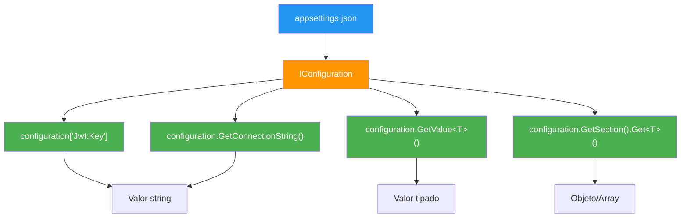
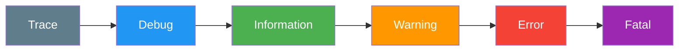

- [9. Configuración y Logging](#9-configuración-y-logging)
  - [9.1. Configuración en ASP.NET Core](#91-configuración-en-aspnet-core)
    - [9.1.1. appsettings.json](#911-appsettingsjson)
    - [9.1.2. Perfiles de entorno (Development vs Production)](#912-perfiles-de-entorno-development-vs-production)
    - [9.1.3. Variables de entorno](#913-variables-de-entorno)
    - [9.1.4. Leyendo configuración en código](#914-leyendo-configuración-en-código)
    - [9.1.5. Patrones de acceso a configuración](#915-patrones-de-acceso-a-configuración)
  - [9.2. Logging en ASP.NET Core](#92-logging-en-aspnet-core)
    - [9.2.1. ILogger: el sistema de logging del framework](#921-ilogger-el-sistema-de-logging-del-framework)
    - [9.2.2. Niveles de log](#922-niveles-de-log)
    - [9.2.3. Configuración de niveles por categoría](#923-configuración-de-niveles-por-categoría)
    - [9.2.4. Serilog: logging estructurado](#924-serilog-logging-estructurado)
    - [9.2.5. Serilog en consola](#925-serilog-en-consola)
    - [9.2.6. Serilog en fichero con rolling](#926-serilog-en-fichero-con-rolling)
    - [9.2.7. Serilog con configuración desde appsettings.json](#927-serilog-con-configuración-desde-appsettingsjson)
  - [9.3. Buenas prácticas](#93-buenas-prácticas)
  - [9.4. Reto](#94-reto)


# 9. Configuración y Logging

> 💡 **Punto de partida:** ¿Qué pasaría si cada vez que cambias la contraseña de la base de datos tuvieras que recompilar toda la aplicación? ¿Y si pudieras ver en tiempo real qué está haciendo tu servidor? La configuración y el logging son los dos pilares que hacen que una aplicación sea flexible y observable.

En este punto aprenderás a configurar tu aplicación para distintos entornos (desarrollo, producción) y a registrar eventos con Serilog para diagnosticar problemas.

**Objetivos de aprendizaje:**
- Organizar la configuración en `appsettings.json` por entornos
- Leer valores de configuración en código con `IConfiguration`
- Configurar Serilog para consola y fichero con rotación
- Entender los niveles de log y cuándo usar cada uno

## 9.1. Configuración en ASP.NET Core

### 9.1.1. appsettings.json

ASP.NET Core usa ficheros JSON para la configuración. El fichero principal es `appsettings.json`:

```json
{
  "Application": {
    "Name": "ProductosApi",
    "Version": "1.0.0"
  },
  "ConnectionStrings": {
    "DefaultConnection": "Host=localhost;Database=productos;Username=admin;Password=admin123"
  },
  "Cache": {
    "DefaultExpirationMinutes": 5
  }
}
```

📌 Ejemplo real: **Netflix** tiene configuraciones diferentes según el país (catálogo, precios, idioma). Todo eso vive en ficheros de configuración, no en código.

### 9.1.2. Perfiles de entorno (Development vs Production)

ASP.NET Core carga automáticamente `appsettings.{Environment}.json` según el entorno activo. Los valores de estos ficheros **sobreescriben** los de `appsettings.json` base.

```
appsettings.json                 ← Valores por defecto (base)
appsettings.Development.json     ← Valores para desarrollo
appsettings.Production.json      ← Valores para producción
```

| Sección | Development | Production |
|---------|-------------|------------|
| `Logging:LogLevel:Default` | `Debug` | `Warning` |
| `ConnectionStrings` | `localhost` | Hostnames Docker |
| `Cache:TTLMinutes` | 5 | 60 |

📌 Ejemplo real: **Amazon** usa servidores de prueba (sandbox) para desarrollo y servidores reales para producción. La diferencia está en la configuración, no en el código.

**appsettings.json (base):**

```json
{
  "Application": {
    "Name": "ProductosApi",
    "Version": "1.0.0"
  },
  "ConnectionStrings": {
    "DefaultConnection": "Host=localhost;Database=productos;Username=admin;Password=admin123"
  },
  "Cache": {
    "TTLMinutes": 5
  },
  "Serilog": {
    "MinimumLevel": "Information"
  }
}
```

**appsettings.Development.json:**

```json
{
  "Logging": {
    "LogLevel": {
      "Default": "Debug",
      "Microsoft.AspNetCore": "Information"
    }
  },
  "ConnectionStrings": {
    "DefaultConnection": "Host=localhost;Database=productos_dev;Username=admin;Password=admin123"
  },
  "Cache": {
    "TTLMinutes": 2
  }
}
```

**appsettings.Production.json:**

```json
{
  "Logging": {
    "LogLevel": {
      "Default": "Warning",
      "Microsoft.AspNetCore": "Warning"
    }
  },
  "ConnectionStrings": {
    "DefaultConnection": "Host=postgres;Database=productos;Username=prod_user;Password=${DB_PASSWORD}"
  },
  "Cache": {
    "TTLMinutes": 60
  }
}
```

### 9.1.3. Variables de entorno

Para secrets (contraseñas, tokens) **nunca** se usan ficheros JSON. Se usan **variables de entorno**:

```bash
# Windows PowerShell
$env:ConnectionStrings__DefaultConnection = "Host=produccion;Database=tienda"

# Linux/Mac
export ConnectionStrings__DefaultConnection = "Host=produccion;Database=tienda"
```

La convención de nombres usa `__` (doble guion bajo) para separar niveles:
- `ConnectionStrings__DefaultConnection` → `ConnectionStrings:DefaultConnection`

> ⚠️ **Advertencia:** Nunca guardes secrets en `appsettings.json` si el fichero se sube a git. Usa variables de entorno o el `dotnet user-secrets` para desarrollo.

📌 Ejemplo real: **Stripe** nunca incluye las claves API en el código fuente. Las lee de variables de entorno o de un gestor de secrets como Azure Key Vault o AWS Secrets Manager.

### 9.1.4. Leyendo configuración en código

ASP.NET Core inyecta `IConfiguration` en cualquier servicio que lo necesite. Se usa el patrón de **primary constructor** (C# 14):

```csharp
public class ProductoService(IConfiguration configuration) : IProductoService
{
    // Patrón 1: indexer con null-coalescing
    private readonly string _connectionString =
        configuration.GetConnectionString("DefaultConnection")
        ?? "Host=localhost;Database=productos";

    // Patrón 2: valor tipado con GetValue<T>
    private readonly int _cacheTTL =
        configuration.GetValue<int>("Cache:TTLMinutes", 5);

    // Patrón 3: sección compleja con Get<T>()
    private readonly string[] _allowedExtensions =
        configuration.GetSection("Storage:AllowedExtensions").Get<string[]>()
        ?? [".jpg", ".png"];
}
```

📌 Ejemplo real: **TiendaAPI** usa exactamente estos tres patrones. Un `ProductoService` lee el TTL de caché de configuración, un `JwtService` lee la clave JWT, y un `StorageService` lee las extensiones permitidas. Todo desde `IConfiguration`.

### 9.1.5. Patrones de acceso a configuración

| Patrón | Cuándo usarlo | Ejemplo |
|--------|---------------|---------|
| `configuration["Seccion:Clave"]` | Valor simple string | `configuration["Jwt:Key"]` |
| `configuration.GetConnectionString("Nombre")` | Connection strings | `configuration.GetConnectionString("DefaultConnection")` |
| `configuration.GetValue<T>("Ruta", default)` | Valor tipado | `configuration.GetValue<int>("Cache:TTL", 5)` |
| `configuration.GetSection("Ruta").Get<T>()` | Arrays/objetos complejos | `configuration.GetSection("Smtp").Get<SmtpConfig>()` |



## 9.2. Logging en ASP.NET Core

### 9.2.1. ILogger: el sistema de logging del framework

ASP.NET Core tiene un sistema de logging integrado que se inyecta con `ILogger<T>`:

```csharp
public class ProductoService(
    IProductoRepository repository,
    ILogger<ProductoService> logger) : IProductoService
{
    public Producto? GetById(long id)
    {
        logger.LogInformation("Buscando producto con ID {Id}", id);

        var producto = repository.GetById(id);

        if (producto is null)
            logger.LogWarning("Producto con ID {Id} no encontrado", id);
        else
            logger.LogInformation("Producto {Nombre} encontrado", producto.Nombre);

        return producto;
    }
}
```

📌 Ejemplo real: **Amazon** registra cada petición, cada error y cada operación de base de datos. Cuando algo falla, los ingenieros buscan en los logs para encontrar la causa. Eso es exactamente lo que hace `ILogger`.

### 9.2.2. Niveles de log

| Nivel | Uso | Ejemplo |
|-------|-----|---------|
| `Trace` | Información muy detallada (solo debugging) | "Entrando en método GetById, parámetro id=5" |
| `Debug` | Información de debugging general | "Repositorio tiene 15 productos en memoria" |
| `Information** | Flujo normal de la aplicación | "Producto creado con ID 42" |
| `Warning` | Algo inesperado pero no es error | "Cache miss, consultando base de datos" |
| `Error** | Error que la aplicación puede recuperarse | "Error al conectar con Redis, usando caché en memoria" |
| `Fatal` | Error catastrófico, la aplicación se detiene | "Base de datos no disponible, deteniendo aplicación" |



### 9.2.3. Configuración de niveles por categoría

En `appsettings.json` puedes configurar qué niveles se muestran por cada categoría:

```json
{
  "Logging": {
    "LogLevel": {
      "Default": "Information",
      "Microsoft.AspNetCore": "Warning",
      "Microsoft.EntityFrameworkCore": "Error",
      "ProductosAvanzados": "Debug"
    }
  }
}
```

> 💡 **Consejo:** En producción, silencia los logs de ASP.NET Core (`Warning`) y de Entity Framework (`Error`). Solo muestra lo importante. En desarrollo, muestra todo (`Debug`).

### 9.2.4. Serilog: logging estructurado

**Serilog** es la librería de logging más usada en .NET. Aporta:
- **Logging estructurado**: los logs tienen propiedades tipadas, no solo strings
- **Múltiples sinks**: consola, fichero, SQLite, Elasticsearch, Seq...
- **Rotación automática de ficheros**: los logs se dividen por tamaño o fecha

```bash
dotnet add package Serilog
dotnet add package Serilog.AspNetCore
dotnet add package Serilog.Sinks.Console
dotnet add package Serilog.Sinks.File
```

📌 Ejemplo real: **Stack Overflow** usa Serilog para registrar cada petición HTTP, cada error de base de datos y cada operación de cache. Con millones de peticiones diarias, el logging estructurado permite buscar y filtrar eficientemente.

### 9.2.5. Serilog en consola

Configuración básica en `Program.cs`:

```csharp
using Serilog;

Log.Logger = new LoggerConfiguration()
    .MinimumLevel.Information()
    .MinimumLevel.Override("Microsoft", LogEventLevel.Warning)
    .WriteTo.Console(
        outputTemplate: "[{Timestamp:HH:mm:ss} {Level:u3}] {Message:lj}{NewLine}{Exception}")
    .CreateLogger();

var builder = WebApplication.CreateBuilder(args);
builder.Host.UseSerilog();
```

**Resultado en consola:**

```
[14:32:05 INF] Inicializando ProductosApi...
[14:32:05 INF] Aplicación construida
[14:32:06 INF] Request finished HTTP/1.1 GET http://localhost:5000/api/productos - 200
[14:32:07 WRN] Producto con ID 999 no encontrado
[14:32:08 ERR] Error al conectar con base de datos
```

### 9.2.6. Serilog en fichero con rolling

**Rotación automática**: los ficheros de log se dividen por tamaño o fecha.

```csharp
Log.Logger = new LoggerConfiguration()
    .MinimumLevel.Information()
    .MinimumLevel.Override("Microsoft", LogEventLevel.Warning)
    .WriteTo.Console()
    .WriteTo.File(
        path: "logs/productos-.log",           // Patrón de nombre
        rollingInterval: RollingInterval.Day,   // Un fichero por día
        retainedFileCountLimit: 7,              // Mantener 7 ficheros
        outputTemplate: "[{Timestamp:yyyy-MM-dd HH:mm:ss.fff zzz}] [{Level:u3}] {Message:lj}{NewLine}{Exception}")
    .CreateLogger();
```

**Resultado en disco:**

```
logs/
├── productos-20260914.log
├── productos-20260915.log
└── productos-20260916.log   ← Fichero actual
```

> 💡 **Consejo:** En producción, usa rolling por día con retención de 7-30 días. Nunca guardes logs indefinidamente — ocuparán todo el disco.

📌 Ejemplo real: **Netflix** genera terabytes de logs diarios. Usa rotación automática y retención limitada para no llenar los discos. Los logs antiguos se envían a un sistema de análisis (Elasticsearch) antes de borrarse.

### 9.2.7. Serilog con configuración desde appsettings.json

Serilog puede configurarse desde `appsettings.json` en lugar de código:

```json
{
  "Serilog": {
    "MinimumLevel": {
      "Default": "Information",
      "Override": {
        "Microsoft": "Warning",
        "Microsoft.EntityFrameworkCore": "Error"
      }
    },
    "WriteTo": [
      { "Name": "Console" },
      {
        "Name": "File",
        "Args": {
          "path": "logs/productos-.log",
          "rollingInterval": "Day",
          "retainedFileCountLimit": 7
        }
      }
    ],
    "Enrich": ["FromLogContext", "WithMachineName", "WithThreadId"]
  }
}
```

```csharp
Log.Logger = new LoggerConfiguration()
    .ReadFrom.Configuration(builder.Configuration)
    .CreateLogger();
```

> 💡 **Consejo:** Para proyectos pequeños, configura Serilog en código (más simple). Para proyectos grandes con muchos entornos, usa `appsettings.json` (más flexible, no requiere recompilar).

## 9.3. Buenas prácticas

9.1. **Nunca guardes secrets en appsettings.json:** Usa variables de entorno o `dotnet user-secrets`

9.2. **Un fichero por entorno:** `appsettings.json` (base), `appsettings.Development.json`, `appsettings.Production.json`

9.3. **Serilog antes del builder:** Crea `Log.Logger` antes de `WebApplication.CreateBuilder()` para capturar errores de bootstrap

9.4. **Niveles de log por entorno:** `Debug` en desarrollo, `Warning` en producción

9.5. **Rolling de ficheros:** Siempre configura `retainedFileCountLimit` para no llenar el disco

9.6. **Logging estructurado:** Usa interpolación de strings de Serilog (`{Variable}`) en lugar de concatenación (`"Valor: " + variable`)

9.7. **`Log.CloseAndFlush()` en el finally:** Asegúrate de que todos los logs se escriben antes de que la aplicación termine

## 9.4. Reto

> Configura FunkoApp con perfiles de entorno y Serilog.

**Añade a tu API:**

1. **appsettings.json** con configuración base (Application, ConnectionStrings, Cache)
2. **appsettings.Development.json** con valores para desarrollo
3. **appsettings.Production.json** con valores para producción
4. **Serilog** con consola y fichero con rolling diario
5. **Lectura de configuración** en un servicio usando `IConfiguration`

**Puntos extra:**

- Añade una sección `Serilog` en `appsettings.json` y configura desde ahí
- Usa variables de entorno para la contraseña de la base de datos
- Configura niveles de log distintos por categoría

---

**Resumen del punto:**

| Concepto | Descripción |
|----------|-------------|
| **appsettings.json** | Fichero principal de configuración |
| **appsettings.{Environment}.json** | Configuración por entorno (sobreescribe la base) |
| **IConfiguration** | Interfaz para leer configuración en código |
| **Variables de entorno** | Para secrets (nunca en JSON) |
| **ILogger\<T\>** | Sistema de logging del framework |
| **Niveles de log** | Trace, Debug, Information, Warning, Error, Fatal |
| **Serilog** | Librería de logging estructurado |
| **Sinks** | Destinos de logs (consola, fichero, Elasticsearch...) |
| **Rolling** | Rotación automática de ficheros de log |
| **Log.CloseAndFlush()** | Asegura que todos los logs se escriben al salir |

**¿Qué viene después?**

En el siguiente punto veremos **Pruebas y Despliegue Básicos**: cómo testear nuestro código con NUnit y Moq, y cómo empaquetarlo con Docker.
