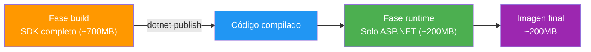
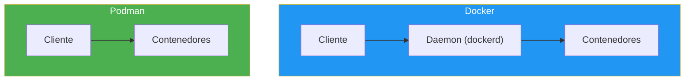

- [10. Pruebas y Despliegue Básicos](#10-pruebas-y-despliegue-básicos)
  - [10.1. Test unitarios con NUnit](#101-test-unitarios-con-nunit)
    - [10.1.1. Estructura de un test: Arrange, Act, Assert](#1011-estructura-de-un-test-arrange-act-assert)
    - [10.1.2. Aserciones con FluentAssertions](#1012-aserciones-con-fluentassertions)
    - [10.1.3. Tests parametrizados con TestCase](#1013-tests-parametrizados-con-testcase)
  - [10.2. Mocks con Moq: aislando dependencias](#102-mocks-con-moq-aislando-dependencias)
    - [10.2.1. ¿Qué es un Mock?](#1021-qué-es-un-mock)
    - [10.2.2. Configuración con Setup](#1022-configuración-con-setup)
    - [10.2.3. Verificación con Verify](#1023-verificación-con-verify)
  - [10.3. Informes de cobertura](#103-informes-de-cobertura)
  - [10.4. Despliegue con Docker](#104-despliegue-con-docker)
    - [10.4.1. Dockerfile](#1041-dockerfile)
    - [10.4.2. Multi-stage build](#1042-multi-stage-build)
    - [10.4.3. Docker Compose](#1043-docker-compose)
  - [10.5. Podman: la alternativa a Docker](#105-podman-la-alternativa-a-docker)
  - [10.6. Buenas prácticas](#106-buenas-prácticas)
  - [10.7. Reto](#107-reto)
  - [Resumen](#resumen)


# 10. Pruebas y Despliegue Básicos

> 💡 **Punto de partida:** ¿Cómo sabes que tu código funciona? ¿Y cómo lo pasas a producción? En este punto aprendemos a **probar** y **desplegar**.

Hasta ahora hemos creado APIs que funcionan. Pero "funcionar" no es suficiente. Necesitamos:
- **Probar** que cada pieza funciona por separado (test unitarios)
- **Simular** dependencias externas para aislar la lógica (mocks)
- **Medir** cuánto código estamos probando (cobertura)
- **Empaquetar** la aplicación para que funcione en cualquier máquina (Docker)

📌 Ejemplo real: **Netflix** ejecuta miles de tests automáticos antes de cada despliegue. Si un test falla, el código no se publica. Esto evita que actualizaciones rompan funcionalidades que ya funcionaban.


## 10.1. Test unitarios con NUnit

Un **test unitario** verifica que una pieza de código (un método, una clase) funciona correctamente **de forma aislada**.

Usamos **NUnit** como framework de tests, **FluentAssertions** para aserciones legibles y **Moq** para mocks.

### 10.1.1. Estructura de un test: Arrange, Act, Assert

Todo test sigue el patrón **AAA**:

```csharp
[TestFixture]
public class ProductoServiceTests
{
    [Test]
    public void GetById_ProductoExiste_RetornaProducto()
    {
        // ── ARRANGE: preparar datos y dependencias ──
        var repository = new Mock<IProductoRepository>();
        var producto = new Producto { Id = 1, Nombre = "Teclado", Precio = 45 };
        repository.Setup(r => r.GetById(1)).Returns(producto);

        var service = new ProductoService(repository.Object);

        // ── ACT: ejecutar la acción que queremos probar ──
        var resultado = service.GetById(1);

        // ── ASSERT: comprobar el resultado ──
        resultado.IsSuccess.Should().BeTrue();
        resultado.Value.Nombre.Should().Be("Teclado");
    }
}
```

📌 Ejemplo real: **Amazon** testea cada microservicio por separado. El servicio de carrito se testea sin tocar el de pagos. Si el de pagos falla, el de carrito sigue funcionando.

### 10.1.2. Aserciones con FluentAssertions

FluentAssertions hace que los tests sean legibles en inglés:

```csharp
// Valores simples
resultado.Should().Be(42);
resultado.Should().NotBeNull();
resultado.Should().BeNull();

// Strings
nombre.Should().Be("Teclado");
nombre.Should().Contain("Tecl");
nombre.Should().StartWith("Te");

// Colecciones
lista.Should().HaveCount(3);
lista.Should().NotBeEmpty();
lista.Should().Contain(p => p.Nombre == "Teclado");

// Excepciones
accion.Should().Throw<ArgumentException>()
    .WithMessage("*nombre*");

// Objetos
resultado.Value.Precio.Should().BeGreaterThan(0);
```

### 10.1.3. Tests parametrizados con TestCase

Para probar múltiples valores sin duplicar código:

```csharp
[TestCase(5.5, "Aprobado")]
[TestCase(7.3, "Notable")]
[TestCase(8.9, "Sobresaliente")]
[TestCase(3.0, "Suspenso")]
public void CalificacionTexto_DiferentesValores_RetornaCorrecto(double calificacion, string esperado)
{
    // Arrange
    var persona = new Persona("Juan", calificacion);

    // Act
    var resultado = persona.CalificacionTexto;

    // Assert
    resultado.Should().Be(esperado);
}
```

> 💡 **Consejo:** Usa `TestCase` cuando el mismo test se ejecuta con diferentes entradas. Evita copiar y pegar el mismo test cambiando solo los valores.


## 10.2. Mocks con Moq: aislando dependencias

### 10.2.1. ¿Qué es un Mock?

Un **mock** es un objeto falso que simula el comportamiento de una dependencia real. En vez de conectar a una base de datos real, usamos un mock que devuelve datos de prueba.

```csharp
// Sin mock: depende de la base de datos real
var repository = new ProductoRepository(); // ❌ Necesita BD real

// Con mock: simula el repositorio
var repository = new Mock<IProductoRepository>(); // ✅ No necesita nada externo
repository.Setup(r => r.GetById(1))
    .Returns(new Producto { Id = 1, Nombre = "Teclado" });
```

📌 Ejemplo real: Cuando testea el **carrito de compra**, Amazon no usa la base de datos real. Usa un mock que devuelve productos de prueba. Así los tests son rápidos y no dependen de servicios externos.

### 10.2.2. Configuración con Setup

`Setup` define qué devuelve el mock cuando se le pide algo:

```csharp
var repository = new Mock<IProductoRepository>();

// Cuando llamen a GetById(1), devuelve este producto
repository.Setup(r => r.GetById(1))
    .Returns(new Producto { Id = 1, Nombre = "Teclado", Precio = 45 });

// Cuando llamen a GetAll, devuelve esta lista
repository.Setup(r => r.GetAll())
    .Returns(new List<Producto>
    {
        new() { Id = 1, Nombre = "Teclado" },
        new() { Id = 2, Nombre = "Ratón" }
    });

// Cuando llamen a Add, devuelve el mismo producto con ID asignado
repository.Setup(r => r.Add(It.IsAny<Producto>()))
    .Returns((Producto p) => { p.Id = 1; return p; });
```

### 10.2.3. Verificación con Verify

`Verify` comprueba que se llamó a un método del mock. Esto es útil para saber si se ejecutó la lógica que debería:

```csharp
[Test]
public void Delete_ProductoExiste_EliminaRepositorio()
{
    // Arrange
    var repository = new Mock<IProductoRepository>();
    repository.Setup(r => r.Delete(1)).Returns(true);

    var service = new ProductoService(repository.Object);

    // Act
    var resultado = service.Delete(1);

    // Assert
    resultado.IsSuccess.Should().BeTrue();

    // VERIFY: se llamó a Delete exactamente una vez con ID 1
    repository.Verify(r => r.Delete(1), Times.Once);

    // VERIFY: NO se llamó a GetById (no hace falta para delete)
    repository.Verify(r => r.GetById(It.IsAny<long>()), Times.Never);
}
```

**Tipos de Verify más usados:**

| Verify | Significado |
|--------|-------------|
| `Times.Once` | Se llamó exactamente una vez |
| `Times.Never` | No se llamó nunca |
| `Times.Exactly(n)` | Se llamó exactamente n veces |
| `Times.AtLeastOnce` | Se llamó al menos una vez |

```csharp
// Verify con argumentos específicos
repository.Verify(r => r.Update(1, It.IsAny<Producto>()), Times.Once);

// Verify que NUNCA se llamó a un método peligroso
repository.Verify(r => r.Delete(It.IsAny<long>()), Times.Never);
```

> ⚠️ **Importante:** `Verify` es lo que diferencia un mock de un simple objeto falso. Sin Verify, solo compruebas el resultado. Con Verify, compruebas que se ejecutaron las acciones correctas en las dependencias.


## 10.3. Informes de cobertura

La **cobertura de código** mide qué porcentaje de tu código se ejecuta durante los tests. No es un fin en sí mismo, pero ayuda a detectar código no probado.

```bash
# Ejecutar tests con informe de cobertura
dotnet test --collect:"XPlat Code Coverage"

# Generar informe HTML (necesita dotnet-reportgenerator-globaltool)
dotnet tool install -g dotnet-reportgenerator-globaltool
reportgenerator -reports:"TestResults/**/coverage.cobertura.xml" -targetdir:"CoverageReport"
```

| Cobertura | Significado |
|-----------|-------------|
| 0-40% | Baja — Mucha lógica sin testear |
| 40-70% | Media — Cubre lo básico |
| 70-80% | Buena — Cubre la mayoría de casos |
| 80%+ | Muy buena — Cubre casos normales y edge cases |

> 💡 **Consejo:** No busques 100% de cobertura. Prioriza testear la **lógica de negocio**, no los getters/setters. Un 80% bien enfocado es mejor que un 100% de tests inútiles.


## 10.4. Despliegue con Docker

**Docker** empaqueta tu aplicación en un **contenedor** que funciona igual en cualquier máquina: tu PC, el servidor de la empresa o la nube.

### 10.4.1. Dockerfile

Un `Dockerfile` es la receta para construir el contenedor:

```dockerfile
# Fase 1: compilar la aplicación
FROM mcr.microsoft.com/dotnet/sdk:10.0 AS build
WORKDIR /src

# Copiar proyecto y restaurar dependencias
COPY *.csproj ./
RUN dotnet restore

# Copiar código fuente y compilar
COPY . .
RUN dotnet publish -c Release -o /app

# Fase 2: crear la imagen de runtime
FROM mcr.microsoft.com/dotnet/aspnet:10.0 AS runtime
WORKDIR /app
COPY --from=build /app .

EXPOSE 8080
ENTRYPOINT ["dotnet", "ProductosTest.dll"]
```

### 10.4.2. Multi-stage build

El Dockerfile anterior usa **multi-stage build**: una fase para compilar (con el SDK completo) y otra para ejecutar (solo el runtime). Esto reduce el tamaño de la imagen de ~700MB a ~200MB.



📌 Ejemplo real: **Spotify** usa multi-stage builds. La fase de build instala dependencias de compilación que no necesitan estar en producción. La imagen final solo contiene lo necesario para ejecutar.

### 10.4.3. Docker Compose

`docker-compose.yml` define cómo ejecutar tu aplicación con sus dependencias:

```yaml
services:
  api:
    build: .
    ports:
      - "5000:8080"
    environment:
      - ASPNETCORE_ENVIRONMENT=Development
    depends_on:
      - redis
    restart: unless-stopped

  redis:
    image: redis:7-alpine
    ports:
      - "6379:6379"
    volumes:
      - redis-data:/data

volumes:
  redis-data:
```

**Comandos habituales:**

```bash
# Construir y ejecutar
docker compose up --build

# Ejecutar en segundo plano
docker compose up -d

# Ver logs
docker compose logs -f api

# Parar
docker compose down
```

📌 Ejemplo real: **Glovo** usa Docker Compose en desarrollo. Cada microservicio (restaurantes, repartidores, pagos) tiene su servicio en el compose. En producción usan Kubernetes, pero el compose local es idéntico.


## 10.5. Podman: la alternativa a Docker

**Podman** es un reemplazo compatible con Docker que no necesita daemon (más seguro). Los comandos son casi idénticos:

| Docker | Podman | Diferencia |
|--------|--------|------------|
| `docker build -t mi-api .` | `podman build -t mi-api .` | Ninguna |
| `docker run -p 5000:8080 mi-api` | `podman run -p 5000:8080 mi-api` | Ninguna |
| `docker compose up` | `podman compose up` | Requiere `podman-compose` |
| `docker ps` | `podman ps` | Ninguna |
| `docker images` | `podman images` | Ninguna |

```bash
# Instalar podman (Windows)
winget install RedHat.Podman

# Usar exactamente igual que Docker
podman build -t mi-api .
podman run -p 5000:8080 mi-api
```

> 💡 **Consejo:** Si usas Linux, Podman es preferible a Docker porque no necesita un daemon con privilegios root. En desarrollo, da igual cuál uses.




## 10.6. Buenas prácticas

| Práctica | Por qué |
|----------|---------|
| **Un test = un concepto** | Cada test verifica UNA cosa. Si falla, sabes exactamente qué está roto |
| **Nombres descriptivos** | `GetById_ProductoNoExiste_RetornaFailure` es mejor que `Test1` |
| **Arrange-Act-Assert** | Separar preparación, ejecución y comprobación |
| **No tests dependientes** | Un test no debe depender del resultado de otro |
| **Mockear dependencias externas** | BD, APIs externas, ficheros → siempre con mock |
| **Verify siempre** | Comprobar que se llamó a los métodos correctos del mock |
| **Dockerfile multi-stage** | Imagenes pequeñas y seguras |
| **No subir secrets al Dockerfile** | Usar variables de entorno o docker-compose |

---

## 10.7. Reto

> Testea el servicio de productos y despliega la API con Docker.

**Añade a tu API:**

1. **Proyecto de tests:** Crea `ProductosTest.Test` con NUnit, Moq y FluentAssertions
2. **Tests del servicio:** Testea `GetAll`, `GetById`, `Create`, `Update`, `PatchPrice`, `Delete`
3. **Mocks:** Mockea `IProductoRepository` y verifica que se llama a `Add`, `Delete`, etc.
4. **Dockerfile:** Multi-stage build con `dotnet/sdk:10.0` y `dotnet/aspnet:10.0`
5. **docker-compose.yml:** Servicio `api` con puerto 5000:8080 y variables de entorno

**Puntos extra:**

- Añade tests parametrizados con `[TestCase]` para `PatchPrice` con diferentes precios
- Añade un test que verifique que `PatchPrice` con precio negativo NO llama a `PatchPrice` del repositorio
- Configura cobertura de código con `dotnet test --collect:"XPlat Code Coverage"`
- Añade un servicio `redis` en `docker-compose.yml` (solo definición, sin usar)


## Resumen

| Concepto | Descripción |
|----------|-------------|
| **Test unitario** | Verifica una pieza de código de forma aislada |
| **NUnit** | Framework de tests para .NET |
| **Arrange-Act-Assert** | Estructura de todo test |
| **Mock** | Objeto falso que simula una dependencia |
| **Moq** | Librería para crear mocks en .NET |
| **Setup** | Define qué devuelve el mock |
| **Verify** | Comprueba que se llamó a un método del mock |
| **Cobertura** | Porcentaje de código ejecutado por tests |
| **Dockerfile** | Receta para construir un contenedor |
| **Multi-stage build** | Fase de build + fase de runtime = imagen pequeña |
| **Docker Compose** | Define servicios y dependencias |
| **Podman** | Alternativa a Docker sin daemon |

En el siguiente punto veremos **Arquitecturas en Capas y Clean Architecture**: cómo organizar el código en capas para aplicaciones grandes y mantenibles.
