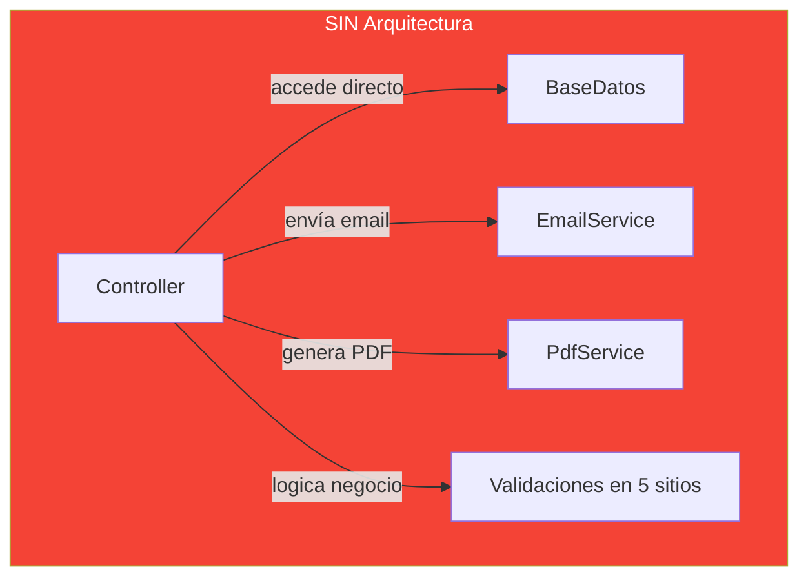
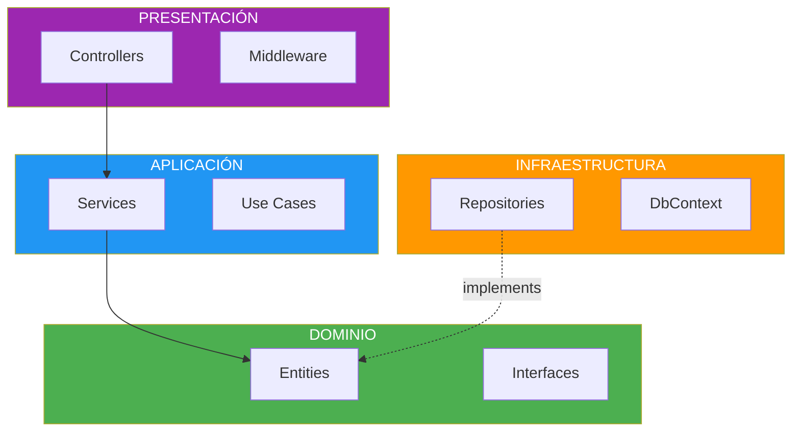
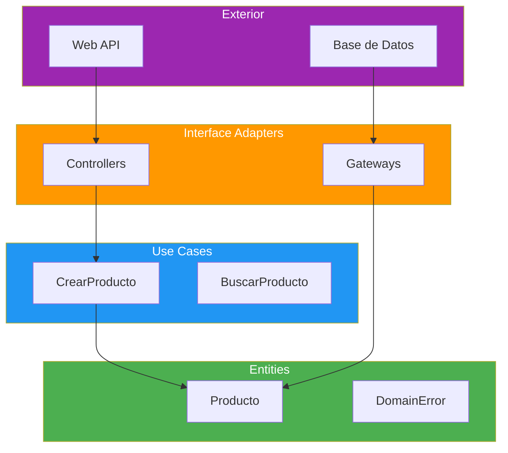
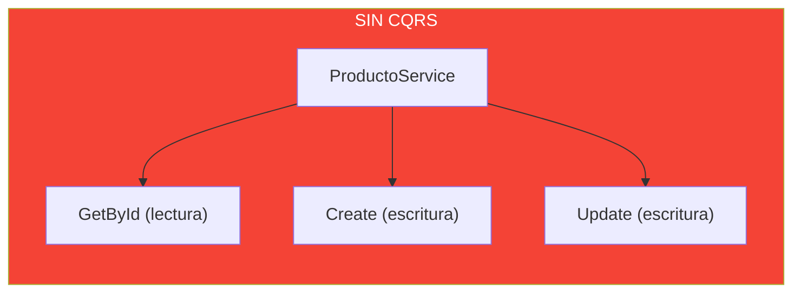
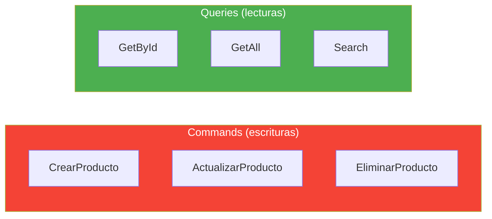
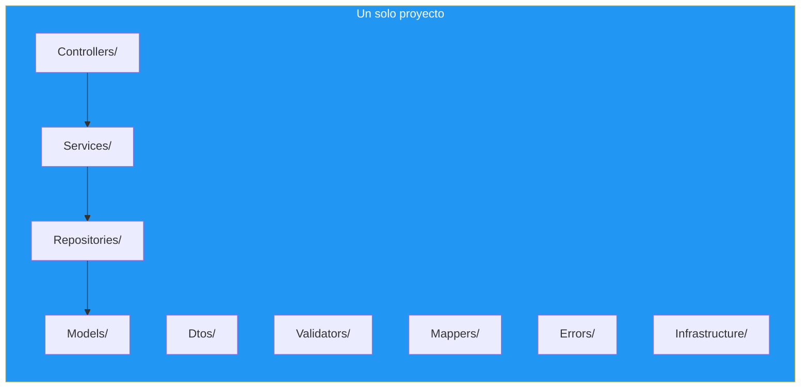

- [11. Arquitecturas en Capas y Clean Architecture](#11-arquitecturas-en-capas-y-clean-architecture)
  - [11.1. ¿Por qué necesitamos una arquitectura?](#111-por-qué-necesitamos-una-arquitectura)
    - [11.1.1. El problema del "spaghetti code"](#1111-el-problema-del-spaghetti-code)
    - [11.1.2. Separación de responsabilidades](#1112-separación-de-responsabilidades)
  - [11.2. Arquitectura en Capas](#112-arquitectura-en-capas)
    - [11.2.1. Conceptos fundamentales](#1121-conceptos-fundamentales)
    - [11.2.2. Capas típicas y responsabilidades](#1122-capas-típicas-y-responsabilidades)
    - [11.2.3. Diagrama de capas](#1123-diagrama-de-capas)
    - [11.2.4. Flujo de dependencias](#1124-flujo-de-dependencias)
    - [11.2.5. Ventajas y desventajas](#1125-ventajas-y-desventajas)
  - [11.3. Arquitectura Onion](#113-arquitectura-onion)
    - [11.3.1. Principios: dependencias hacia el centro](#1131-principios-dependencias-hacia-el-centro)
    - [11.3.2. Estructura concéntrica](#1132-estructura-concéntrica)
    - [11.3.3. Comparación Capas vs Onion](#1133-comparación-capas-vs-onion)
  - [11.4. Clean Architecture](#114-clean-architecture)
    - [11.4.1. Los 4 anillos](#1141-los-4-anillos)
    - [11.4.2. La Regla de Dependencia](#1142-la-regla-de-dependencia)
    - [11.4.3. Diagrama Clean Architecture](#1143-diagrama-clean-architecture)
    - [11.4.4. Ejemplo práctico en .NET](#1144-ejemplo-práctico-en-net)
  - [11.5. CQRS: Command Query Responsibility Segregation](#115-cqrs-command-query-responsibility-segregation)
    - [11.5.1. El problema: lecturas y escrituras son distintas](#1151-el-problema-lecturas-y-escrituras-son-distintas)
    - [11.5.2. Separar Commands de Queries](#1152-separar-commands-de-queries)
    - [11.5.3. CQRS con MediatR (introducción)](#1153-cqrs-con-mediatr-introducción)
    - [11.5.4. ¿Cuándo usar CQRS?](#1154-cuándo-usar-cqrs)
    - [11.5.5. Nuestra arquitectura: Config Classes](#1155-nuestra-arquitectura-config-classes)
  - [11.6. Estructura del Proyecto](#116-estructura-del-proyecto)
    - [11.6.1. Organización de carpetas](#1161-organización-de-carpetas)
    - [11.6.2. Capas y sus contenidos](#1162-capas-y-sus-contenidos)
  - [11.7. Buenas prácticas](#117-buenas-prácticas)
  - [11.8. Reto](#118-reto)


# 11. Arquitecturas en Capas y Clean Architecture

> 💡 **Punto de partida:** Si construyes una casa, no empiezas a poner ladrillos sin un plano. Lo mismo ocurre con el software: necesitas una **arquitectura**, un plan que determine cómo se organizan las piezas, cómo se comunican y cómo escalará en el futuro.

En este punto aprenderás por qué necesitamos una arquitectura, las más utilizadas (Capas, Onion, Clean) y una introducción a CQRS.

**Objetivos de aprendizaje:**
- Entender por qué el código sin arquitectura se convierte en "spaghetti code"
- Conocer la arquitectura en Capas y su flujo de dependencias
- Comprender Onion Architecture y la inversión de dependencias
- Entender Clean Architecture y sus 4 anillos
- Introducir CQRS como patrón de separación de lecturas y escrituras


## 11.1. ¿Por qué necesitamos una arquitectura?

### 11.1.1. El problema del "spaghetti code"

Sin una arquitectura clara, los proyectos crecen de forma desorganizada. El código se convierte en **spaghetti code**: un lío de dependencias donde nadie sabe qué depende de qué.



| Síntoma | Consecuencia |
|---------|-------------|
| **Una clase hace todo** | Imposible de testear |
| **Cambios que rompen otras cosas** | Miedo a tocar código |
| **No se puede reutilizar** | El mismo código copiado en 3 sitios |
| **Nuevo equipo no entiende nada** | Semanas para hacer un cambio pequeño |

📌 Ejemplo real: **Netflix** empezó con un monolito sin arquitectura. Cuando creció, fue imposible mantenerlo y tuvieron que reescribirlo con microservicios. La arquitectura habría evitado ese coste.

### 11.1.2. Separación de responsabilidades

La **separación de responsabilidades** es el principio más básico: cada pieza del sistema debe tener **una sola razón para cambiar**.

> 💡 **Analogía:** Un hospital tiene especialistas (cardiólogo, traumatólogo, pediatra). No quieres que el cardiólogo también opere la rodilla. Cada uno tiene su responsabilidad.

📌 Ejemplo real: **Toyota** usa arquitectura en su proceso de fabricación. Cada estación de la línea de montaje tiene una responsabilidad clara. Si una estación falla, la línea se para, pero no afecta a la estación anterior ni a la siguiente.


## 11.2. Arquitectura en Capas

### 11.2.1. Conceptos fundamentales

La **arquitectura en capas** organiza el código en capas horizontales, donde cada capa tiene una responsabilidad específica y solo se comunica con las capas adyacentes.

La regla fundamental: **las capas superiores pueden utilizar las inferiores, pero nunca al revés**.

### 11.2.2. Capas típicas y responsabilidades

| Capa | Responsabilidad | Tecnologías típicas | Ejemplos |
|------|-----------------|---------------------|----------|
| **Presentación** | Interfaz de usuario, HTTP | ASP.NET Core MVC, Web API | Controllers, Endpoints |
| **Aplicación** | Casos de uso, coordinación | .NET Class Library | Services, Use Cases, DTOs |
| **Dominio** | Entidades, reglas de negocio | .NET Class Library | Entities, Interfaces |
| **Infraestructura** | Acceso a datos, externos | EF Core, Dapper | Repositories, DbContext |

📌 Ejemplo real: **Amazon** usa arquitectura en capas. La capa de presentación (web/app) envía peticiones a la capa de aplicación (gestión de pedidos), que usa la capa de dominio (reglas de negocio), que a su vez usa la capa de infraestructura (bases de datos).

### 11.2.3. Diagrama de capas



### 11.2.4. Flujo de dependencias

Las dependencias fluyen **hacia los contratos del dominio**: Presentación → Aplicación → contratos de Dominio. La Infraestructura **depende del Dominio** (nunca al revés): implementa las interfaces que el dominio define. Esto es la **Inversión de Dependencias**.

```csharp
// Presentación: el controller depende del servicio
public class ProductosController(IProductoService service) : ControllerBase
{
    [HttpGet("{id}")]
    public IActionResult GetById(int id) => Ok(service.GetById(id));
}

// Aplicación: el servicio depende del repositorio (interfaz)
public class ProductoService(IProductoRepository repo) : IProductoService
{
    public Producto GetById(int id) => repo.GetById(id);
}

// Dominio: solo define la interfaz
public interface IProductoRepository
{
    Producto GetById(int id);
}

// Infraestructura: implementa la interfaz
public class ProductoRepository(AppDbContext db) : IProductoRepository
{
    public Producto GetById(int id) => db.Productos.Find(id);
}
```

### 11.2.5. Ventajas y desventajas

| Ventajas | Desventajas |
|----------|-------------|
| Separación clara de responsabilidades | Puede ser excesiva para apps pequeñas |
| Fácil testabilidad | Riesgo de "anémica" en capa de dominio |
| Mantenibilidad mejorada | Dificultad inicial en diseño |
| Reutilización de código | Acoplamiento accidental entre capas |
| Patrón bien conocido | Puede degenerar en "big ball of mud" |


## 11.3. Arquitectura Onion

### 11.3.1. Principios: dependencias hacia el centro

**Onion Architecture** (Jeffrey Palermo) es una evolución de Capas. Su principio: **las dependencias siempre apuntan hacia el centro**, donde está el dominio.

En Capas, el dominio depende de la infraestructura. En Onion, el dominio **define las interfaces que necesita** y la infraestructura las implementa. Esto se llama **Inversión de Dependencias**.

> 💡 **Analogía:** Onion es como una cebolla. El centro es pequeño y contiene lo más importante (entidades, reglas de negocio). Las capas externas protegen el centro. Puedes quitar capas externas (cambiar de BD, de framework) sin afectar el centro.

📌 Ejemplo real: **Netflix** protege su lógica de recomendaciones (núcleo) de cambios en la infraestructura. El núcleo no sabe nada de la infraestructura.

### 11.3.2. Estructura concéntrica

| Capa | Contenido | Depende de |
|------|-----------|------------|
| **Domain Core** | Entities, Value Objects, Enums | Nada |
| **Domain Services** | Interfaces (IRepository, IService) | Domain Core |
| **Application** | Services, Use Cases, DTOs | Domain Core, Domain Services |
| **Infrastructure** | Repositories, DbContext | Domain Services |
| **Presentation** | Controllers, Middleware | Application |

### 11.3.3. Comparación Capas vs Onion

| Aspecto | Capas Tradicional | Onion Architecture |
|---------|-------------------|-------------------|
| **Dependencias** | Superiores → inferiores | Externas → internas |
| **Núcleo** | Entidades + Servicios | Solo entidades (puro) |
| **Interfaces** | En capa de datos | En capa de abstracciones |
| **Inversión de Dependencias** | No implementada | Sí (principio fundamental) |
| **Testabilidad del núcleo** | Buena | Excelente |
| **Flexibilidad** | Media | Alta |


## 11.4. Clean Architecture

### 11.4.1. Los 4 anillos

**Clean Architecture** (Robert C. Martin / Uncle Bob) organiza el código en 4 anillos concéntricos:

| Anillo | Contenido | Dependencias |
|--------|-----------|-------------|
| **Entities** | Entidades de dominio, reglas de negocio | Nada (puro) |
| **Use Cases** | Casos de uso, orquestación | Entities |
| **Interface Adapters** | Controllers, gateways | Use Cases, Entities |
| **Frameworks & Drivers** | Web framework, DB, UI | Todos los anteriores |

📌 Ejemplo real: **Spotify** usa Clean Architecture. Su algoritmo de recomendaciones (Entities + Use Cases) no depende de si la interfaz es web, móvil o smart TV. Los adapters traducen las peticiones de cada plataforma.

### 11.4.2. La Regla de Dependencia

> **"Las dependencias de código solo pueden apuntar hacia adentro."**

- **Entities** no conoce nada (es el centro puro)
- **Use Cases** solo conoce Entities
- **Interface Adapters** conoce Use Cases y Entities
- **Frameworks & Drivers** conoce todo, pero nadie lo conoce a él

### 11.4.3. Diagrama Clean Architecture



### 11.4.4. Ejemplo práctico en .NET

```csharp
// ── ENTITIES (Anillo 1) ─────────────────────────────────────
namespace Producto.Domain;

public record Producto(int Id, string Nombre, decimal Precio);
public abstract record DomainError(string Message);

// ── USE CASES (Anillo 2) ────────────────────────────────────
namespace Producto.Application;

public interface IProductoRepository
{
    Producto? GetById(int id);
    void Add(Producto producto);
}

public class CrearProductoUseCase(IProductoRepository repo)
{
    public Result<Producto> Ejecutar(string nombre, decimal precio)
    {
        if (string.IsNullOrWhiteSpace(nombre))
            return Result.Failure<Producto>("Nombre requerido");
        if (precio < 0)
            return Result.Failure<Producto>("Precio no puede ser negativo");

        var producto = new Producto(0, nombre, precio);
        repo.Add(producto);
        return Result.Success(producto);
    }
}

// ── INTERFACE ADAPTERS (Anillo 3) ───────────────────────────
namespace Producto.Api.Controllers;

[ApiController]
[Route("api/productos")]
public class ProductosController(CrearProductoUseCase useCase) : ControllerBase
{
    [HttpPost]
    public IActionResult Crear([FromBody] CrearProductoRequest request)
    {
        var resultado = useCase.Ejecutar(request.Nombre, request.Precio);
        return resultado.IsSuccess
            ? CreatedAtAction(nameof(Crear), new { id = resultado.Value.Id }, resultado.Value)
            : BadRequest(new { error = resultado.Error });
    }
}

// ── FRAMEWORKS (Anillo 4) ───────────────────────────────────
namespace Producto.Infrastructure;

public class ProductoRepository(AppDbContext db) : IProductoRepository
{
    public Producto? GetById(int id) => db.Productos.Find(id);
    public void Add(Producto producto) => db.Productos.Add(producto);
}
```


## 11.5. CQRS: Command Query Responsibility Segregation

> 💡 **Punto de partida:** ¿Por qué una misma función hace `GET /productos` (lectura) y `POST /productos` (escritura) de la misma forma? Leer y escribir son operaciones fundamentalmente distintas. CQRS las separa.

### 11.5.1. El problema: lecturas y escrituras son distintas

En una API típica, el mismo servicio maneja lecturas y escrituras. Esto mezcla lógica de validación, persistencia y mapeo en un solo sitio.



**Problemas:**
- La lectura y escritura tienen **rendimientos diferentes** (lectura puede cachear, escritura no)
- La **escalabilidad** es distinta (más lecturas que escrituras en la mayoría de apps)
- La **complejidad** se mezcla (validaciones de escritura contaminan la lectura)

### 11.5.2. Separar Commands de Queries

**CQRS** separa explícitamente:
- **Commands** (escrituras): CrearProducto, ActualizarProducto, EliminarProducto
- **Queries** (lecturas): GetProductoById, GetAllProductos, SearchProductos



```csharp
// Commands (escrituras)
public record CrearProductoCommand(string Nombre, decimal Precio);
public record ActualizarProductoCommand(int Id, string Nombre, decimal Precio);
public record EliminarProductoCommand(int Id);

// Queries (lecturas)
public record GetProductoByIdQuery(int Id);
public record GetAllProductosQuery();
public record SearchProductosQuery(string Termino);

// Handlers separados
public class CrearProductoHandler(IProductoRepository repo)
{
    public Producto Handle(CrearProductoCommand cmd)
    {
        var producto = new Producto(0, cmd.Nombre, cmd.Precio);
        repo.Add(producto);
        return producto;
    }
}

public class GetProductoByIdHandler(IProductoRepository repo)
{
    public Producto? Handle(GetProductoByIdQuery query) =>
        repo.GetById(query.Id);
}
```

### 11.5.3. CQRS con MediatR (introducción)

**MediatR** implementa el patrón **Mediator**: los controladores envían commands/queries a un mediador que los despacha al handler correcto.

```csharp
// Instalación
// dotnet add package MediatR

// Command + Handler
public record CrearProductoCommand(string Nombre, decimal Precio) : IRequest<Producto>;

public class CrearProductoHandler(IProductoRepository repo) : IRequestHandler<CrearProductoCommand, Producto>
{
    public async Task<Producto> Handle(CrearProductoCommand cmd, CancellationToken ct)
    {
        var producto = new Producto(0, cmd.Nombre, cmd.Precio);
        repo.Add(producto);
        return producto;
    }
}

// Controller usa MediatR
[ApiController]
[Route("api/productos")]
public class ProductosController(IMediator mediator) : ControllerBase
{
    [HttpPost]
    public async Task<IActionResult> Crear([FromBody] CrearProductoCommand cmd)
    {
        var resultado = await mediator.Send(cmd);
        return CreatedAtAction(nameof(Crear), new { id = resultado.Id }, resultado);
    }
}
```

📌 Ejemplo real: **MediatR** se usa en arquitecturas limpias y Vertical Slice Architecture. Cada endpoint es un "slice" independiente con su propio command/query y handler.

### 11.5.4. ¿Cuándo usar CQRS?

| Escenario | ¿Usar CQRS? | Motivo |
|-----------|-------------|--------|
| API CRUD simple | No | Complejidad innecesaria |
| App con muchas lecturas | Sí | Escalar lecturas independientemente |
| Dominio complejo | Sí | Separar complejidad |
| Microservicios | Sí | Cada servicio con su implementación |
| Cache agresivo | Sí | Las queries pueden cachear, los commands no |

> 📝 **Nota:** CQRS es un patrón, no una arquitectura. Se puede usar solo o combinado con Clean Architecture. Lo veremos en profundidad en UD03/UD04 con bases de datos.

### 11.5.5. Nuestra arquitectura: Config Classes

En el curso y en **TiendaAPI** usamos una variante práctica de Clean Architecture adaptada a educación. No separamos en proyectos distintos (Domain, Application, Infrastructure), sino que **organizamos por carpetas dentro de un solo proyecto** con **Config classes** en `Infrastructure/` para el registro de DI.



**Estructura de TiendaAPI:**

```
TiendaApi.Api/
├── Program.cs                    # Punto de entrada
├── Controllers/                  # Endpoints HTTP
├── Services/                     # Lógica de negocio
│   ├── Productos/
│   ├── Categorias/
│   └── Auth/
├── Repositories/                 # Acceso a datos
│   ├── Productos/
│   ├── Categorias/
│   └── Pedidos/
├── Models/                       # Entidades de dominio
├── Dtos/                         # Data Transfer Objects
├── Validators/                   # FluentValidation
├── Mappers/                      # Model <-> DTO
├── Errors/                       # DomainError y tipos
├── Middleware/                   # ExceptionHandler, etc.
├── Infrastructure/              # Config classes (DI)
│   ├── RepositoriesConfig.cs
│   ├── ServicesConfig.cs
│   ├── DatabaseConfig.cs
│   ├── CorsConfig.cs
│   └── SerilogConfig.cs
└── Data/                         # DbContext, Seed
```

**Las Config classes** son clases estáticas con métodos de extensión que registran servicios en el contenedor DI:

```csharp
// Infrastructure/RepositoriesConfig.cs
public static class RepositoriesConfig
{
    public static IServiceCollection AddRepositories(this IServiceCollection services, IConfiguration config)
    {
        services.AddScoped<IProductoRepository, ProductoRepository>();
        services.AddScoped<ICategoriaRepository, CategoriaRepository>();

        // DI condicional según configuración
        var pedidosRepoType = config["Pedidos:RepositoryType"] ?? "MongoDbNative";
        if (pedidosRepoType == "MongoDbNative")
            services.AddScoped<IPedidosRepository, PedidosNativeRepository>();
        else
            services.AddScoped<IPedidosRepository, PedidosEfCoreRepository>();

        return services;
    }
}

// Infrastructure/ServicesConfig.cs
public static class ServicesConfig
{
    public static IServiceCollection AddServices(this IServiceCollection services)
    {
        return services
            .AddScoped<IProductoService, ProductoService>()
            .AddScoped<ICategoriaService, CategoriaService>()
            .AddScoped<IAuthService, AuthService>();
    }
}
```

**Program.cs queda limpio y legible:**

```csharp
// Program.cs
var services = builder.Services;

services.AddMvcControllers();
services.AddDatabases(configuration);
services.AddAuthentication(configuration);

// Config classes: cada una registra su responsabilidad
services.AddRepositories(configuration);
services.AddServices();
services.AddCache(environment);
services.AddEmail(environment);
services.AddStorage();
```

📌 Ejemplo real: **TiendaAPI** usa este patrón. Cada concern (repositorios, servicios, cache, email, auth) tiene su propia Config class. Cuando añades un nuevo servicio, solo creas una nueva Config class y la llamas en Program.cs. No necesitas tocar el resto.

> 💡 **Consejo:** Para educación, esta arquitectura es ideal porque:
> - **Un solo proyecto** = más fácil de entender para alumnos nuevos
> - **Config classes** = el registro de DI está organizado y limpio
> - **Carpetas por responsabilidad** = separación clara sin la complejidad de múltiples proyectos
> - **Evoluciona a Clean Architecture** cuando el proyecto crece

> ⚠️ **Advertencia:** Cuando el proyecto tenga más de 3 desarrolladores o más de 20 endpoints, considera migrar a Clean Architecture con proyectos separados. La arquitectura plana funciona bien en educación y proyectos pequeños, pero escala limitada en equipos grandes.


## 11.6. Estructura del Proyecto

### 11.6.1. Organización de carpetas

```
MiApi/
├── MiApi.slnx
├── MiApi.Domain/              # Anillo 1: Entities
│   ├── Entities/
│   ├── ValueObjects/
│   ├── Enums/
│   └── Interfaces/
├── MiApi.Application/         # Anillo 2: Use Cases
│   ├── Services/
│   ├── UseCases/
│   ├── DTOs/
│   └── Validators/
├── MiApi.Infrastructure/      # Anillo 4: Frameworks
│   ├── Repositories/
│   ├── DbContext/
│   └── ExternalServices/
└── MiApi.Api/                 # Anillo 3: Adapters
    ├── Controllers/
    ├── Middleware/
    └── Program.cs
```

### 11.6.2. Capas y sus contenidos

| Capa | Contenido | Regla |
|------|-----------|-------|
| **Domain** | Entities, Value Objects, Enums, Interfaces | NO depende de nadie |
| **Application** | Services, Use Cases, DTOs, Validators | Solo depende de Domain |
| **Infrastructure** | Repositories, DbContext, External Services | Implementa interfaces de Domain |
| **Api** | Controllers, Middleware, Program.cs | Conecta todo |


## 11.7. Buenas prácticas

- **Dominio puro:** La capa de dominio NO debe tener dependencias de NuGet (ni EF Core, ni ASP.NET Core)
- **Interfaces en dominio:** El dominio define los contratos, la infraestructura los implementa
- **Una dirección:** Las dependencias NUNCA van hacia afuera (del dominio a la infraestructura)
- **CQRS cuando crezca:** No lo uses en CRUD simple, solo cuando el dominio sea complejo
- **Onion antes que Capas:** Si el proyecto va a crecer, empieza con Onion desde el principio
- **Clean Architecture para equipos:** En proyectos con varios desarrolladores, Clean Architecture da claridad


## 11.8. Reto

> Diseña la arquitectura de FunkoApp.

**Estructura a implementar:**

1. **Domain:** Entidades `Libro`, `Autor`, `Usuario`, `Prestamo` + interfaces `ILibroRepository`, `IPrestamoRepository`
2. **Application:** Use cases `CrearPrestamoUseCase`, `DevolverPrestamoUseCase` + DTOs
3. **Infrastructure:** Repositorios con EF Core + DbContext
4. **Api:** Controllers con Clean Architecture

**Reglas de negocio:**
- Un libro puede tener varios autores
- Un usuario puede tener varios préstamos activos
- No se puede prestar un libro si no hay stock
- Un préstamo tiene fecha de devolución esperada

**Puntos extra:**

- Añade CQRS con MediatR para los use cases
- Implementa errores de dominio con `Result<T, DomainError>`
- Añade validación con FluentValidation en los DTOs
- Diagrama Mermaid de la arquitectura

---

**Resumen del punto:**

| Concepto | Descripción |
|----------|-------------|
| **Arquitectura** | Plan que organiza el código en piezas con responsabilidades claras |
| **Spaghetti code** | Código sin arquitectura, dependencias caóticas |
| **Separación de responsabilidades** | Cada módulo hace una cosa |
| **Capas** | Organización horizontal: Presentación → Aplicación → Dominio → Infraestructura |
| **Onion** | Capas concéntricas con dependencias hacia el centro |
| **Clean Architecture** | 4 anillos: Entities → Use Cases → Interface Adapters → Frameworks |
| **Regla de Dependencia** | Las dependencias solo apuntan hacia adentro |
| **CQRS** | Separa Commands (escrituras) de Queries (lecturas) |
| **MediatR** | Librería que implementa el patrón Mediator |

**¿Qué viene después?**

En el siguiente punto veremos **Entity Framework Core**: migraciones, el repositorio CRUD con DbContext y testing con Testcontainers.
