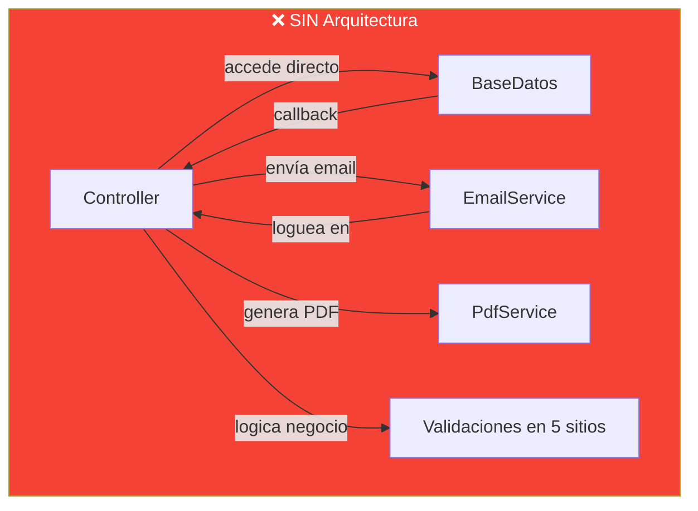
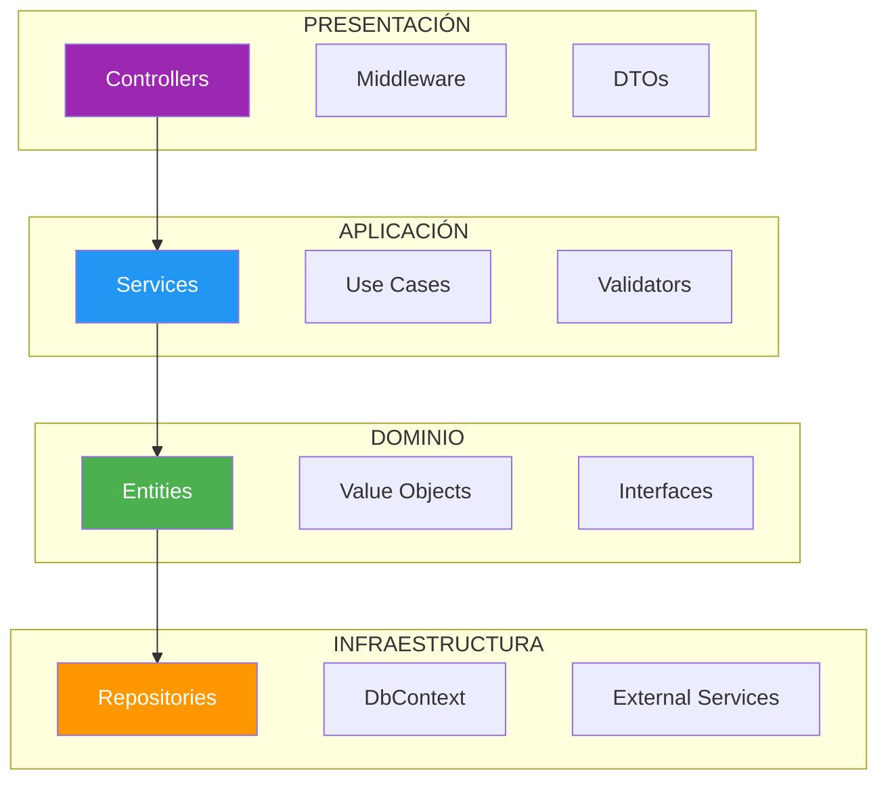
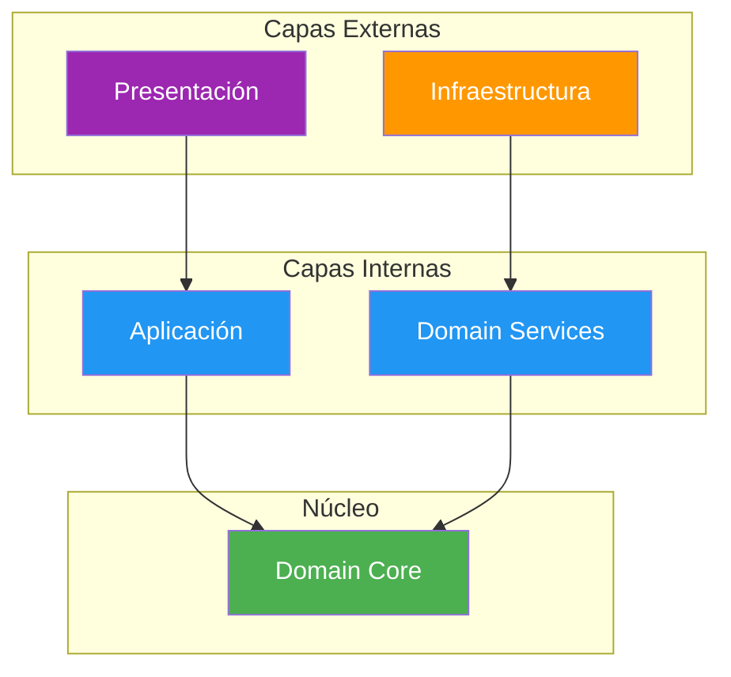
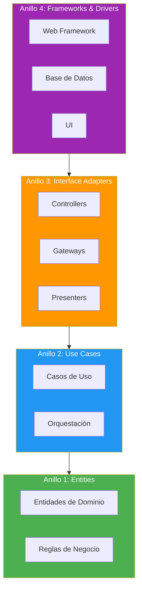
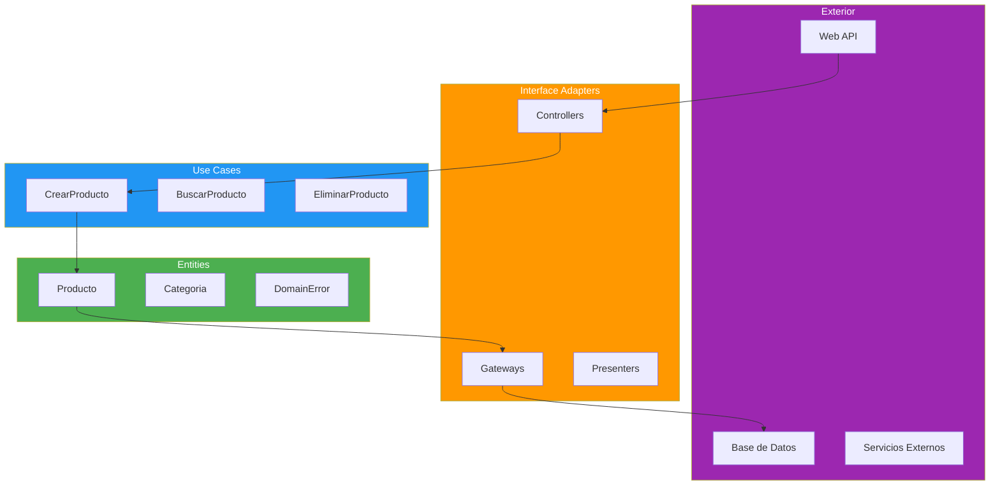

- [11. Arquitecturas en Capas y Clean Architecture](#11-arquitecturas-en-capas-y-clean-architecture)
  - [11.1. ¿Por qué necesitamos una arquitectura?](#111-por-qué-necesitamos-una-arquitectura)
    - [11.1.1. El problema del "spaghetti code"](#1111-el-problema-del-spaghetti-code)
    - [11.1.2. Separación de responsabilidades](#1112-separación-de-responsabilidades)
    - [11.1.3. Analogía: construir una casa sin plano](#1113-analogía-construir-una-casa-sin-plano)
  - [11.2. Arquitectura en Capas](#112-arquitectura-en-capas)
    - [11.2.1. Conceptos fundamentales](#1121-conceptos-fundamentales)
    - [11.2.2. Capas típicas y responsabilidades](#1122-capas-típicas-y-responsabilidades)
    - [11.2.3. Diagrama de capas](#1123-diagrama-de-capas)
    - [11.2.4. Flujo de dependencias](#1124-flujo-de-dependencias)
    - [11.2.5. Ventajas y desventajas](#1125-ventajas-y-desventajas)
  - [11.3. Arquitectura Onion](#113-arquitectura-onion)
    - [11.3.1. Principios: dependencias hacia el centro](#1131-principios-dependencias-hacia-el-centro)
    - [11.3.2. Estructura concéntrica](#1132-estructura-concéntrica)
    - [11.3.3. Comparación Capas vs Onion](#1133-comparación-capas-vs-onion)
  - [11.4. Clean Architecture](#114-clean-architecture)
    - [11.4.1. Los 4 anillos](#1141-los-4-anillos)
    - [11.4.2. La Regla de Dependencia](#1142-la-regla-de-dependencia)
    - [11.4.3. Diagrama Clean Architecture](#1143-diagrama-clean-architecture)
    - [11.4.4. Ejemplo práctico en .NET](#1144-ejemplo-práctico-en-net)
  - [11.5. CQRS: Command Query Responsibility Segregation](#115-cqrs-command-query-responsibility-segregation)
    - [11.5.1. El problema: lecturas y escrituras son distintas](#1151-el-problema-lecturas-y-escrituras-son-distintas)
    - [11.5.2. Separar Commands de Queries](#1152-separar-commands-de-queries)
    - [11.5.3. CQRS con MediatR (introducción)](#1153-cqrs-con-mediatr-introducción)
    - [11.5.4. ¿Cuándo usar CQRS?](#1154-cuándo-usar-cqrs)
  - [11.6. Estructura del Proyecto](#116-estructura-del-proyecto)
    - [11.6.1. Organización de carpetas](#1161-organización-de-carpetas)
    - [11.6.2. Capas y sus contenidos](#1162-capas-y-sus-contenidos)
  - [11.7. Resumen](#117-resumen)
  - [11.8. Ejercicio Propuesto](#118-ejercicio-propuesto)


# 11. Arquitecturas en Capas y Clean Architecture

> 💡 **Punto de partida:** Si construyes una casa, no empiezas a poner ladrillos sin un plano. Lo mismo ocurre con el software: necesitas una **arquitectura**, un plan que determine cómo se organizan las piezas, cómo se comunican y cómo escalará en el futuro.

En este punto aprenderás por qué necesitamos una arquitectura, las arquitecturas más utilizadas (Capas, Onion, Clean) y una introducción a CQRS.

**Objetivos de aprendizaje:**
- Entender por qué el código sin arquitectura se convierte en "spaghetti code"
- Conocer la arquitectura en Capas y su flujo de dependencias
- Comprender Onion Architecture y la inversión de dependencias
- Entender Clean Architecture y sus 4 anillos
- Introducir CQRS como patrón de separación de lecturas y escrituras


## 11.1. ¿Por qué necesitamos una arquitectura?

### 11.1.1. El problema del "spaghetti code"

Sin una arquitectura clara, los proyectos crecen de forma desorganizada. El código se convierte en **spaghetti code**: un lío de dependencias donde nadie sabe qué depende de qué, cómo cambiar una cosa sin romper otra, y por qué un cambio en un módulo rompe tres módulos que no tenían nada que ver.



| Síntoma | Consecuencia |
|---------|-------------|
| **Una clase hace todo** | Impossible de testear |
| **Cambios que rompen otras cosas** | Miedo a tocar código |
| **No se puede reutilizar** | El mismo código copiado en 3 sitios |
| **Nuevo equipo no entiende nada** | Semanas para hacer un cambio pequeño |

📌 Ejemplo real: Muchas startups empiezan con monolitos sin arquitectura. Etsy (tienda online de artesanías) sigue usando un monolito PHP bien estructurado. La diferencia entre un monolito "bueno" y "spaghetti" es la arquitectura.

### 11.1.2. Separación de responsabilidades

La **separación de responsabilidades** es el principio más básico de la arquitectura: cada pieza del sistema debe tener **una sola razón para cambiar**.

| Concepto | Descripción | Ejemplo |
|----------|-------------|---------|
| **Responsabilidad** | Cada módulo hace una cosa | `ProductoService` solo gestiona productos |
| **Acoplamiento** | Cuánto depende un módulo de otro | Bajo = bueno, alto = malo |
| **Cohesión** | Cuánto están relacionados los elementos dentro de un módulo | Alta = bueno, baja = malo |

> 💡 **Analogía:** Un hospital tiene especialistas (cardiólogo, traumatólogo, pediatra). No quieres que el cardiólogo también opere la rodilla. Cada uno tiene su responsabilidad. Si el cardiólogo hiciera todo, el hospital sería un desastre.

### 11.1.3. Analogía: construir una casa sin plano

Imagina que construyes una casa **sin plano**:

1. Pones ladrillos donde te parece
2. Cuando quieres poner una ventana, descubres que hay una tubería
3. Cuando quieres poner la tubería, descubres que hay un cable eléctrico
4. Cuando quieres poner el cable, descubres que hay una viga que no debería estar ahí
5. **Resultado:** La casa se cae, o peor, no puedes ampliarla cuando necesitas una habitación más

Con un plano (arquitectura):
1. Sabes exactamente dónde van las tuberías, cables y ventanas
2. Puedes ampliar la casa sin que se caiga
3. Cualquier albañil puede seguir el plano y saber qué hacer

📌 Ejemplo real: **Toyota** usa arquitectura en su proceso de fabricación. Cada estación de la línea de montaje tiene una responsabilidad clara. Si una estación falla, la línea se para, pero no afecta a la estación anterior ni a la siguiente.


## 11.2. Arquitectura en Capas

### 11.2.1. Conceptos fundamentales

La **arquitectura en capas** (Layered Architecture) organiza el código en **capas horizontales**, donde cada capa tiene una responsabilidad específica y solo se comunica con las capas adyacentes en una dirección definida.

La regla fundamental: **las capas superiores pueden utilizar las inferiores, pero nunca al revés**. Esto crea un flujo de dependencias unidireccional que facilita el intercambio de implementaciones.

### 11.2.2. Capas típicas y responsabilidades

| Capa | Responsabilidad | Tecnologías típicas | Ejemplos |
|------|-----------------|---------------------|----------|
| **Presentación** | Interfaz de usuario, entrada/salida HTTP | ASP.NET Core MVC, Web API | Controllers, Endpoints, DTOs |
| **Aplicación** | Casos de uso, coordinación de servicios | .NET Class Library | Services, Use Cases, DTOs |
| **Dominio** | Entidades, reglas de negocio, interfaces | .NET Class Library | Entities, Value Objects, Interfaces |
| **Infraestructura** | Acceso a datos, servicios externos | EF Core, Dapper, HTTP Client | Repositories, DbContext, External Services |

📌 Ejemplo real: **Amazon** usa arquitectura en capas. La capa de presentación (web/app) envía peticiones a la capa de aplicación (gestión de pedidos), que usa la capa de dominio (reglas de negocio: stock, pagos), que a su vez usa la capa de infraestructura (bases de datos, colas de mensajes).

### 11.2.3. Diagrama de capas



### 11.2.4. Flujo de dependencias

Las dependencias fluyen **hacia abajo**: Presentación → Aplicación → Dominio → Infraestructura.

```csharp
// Presentación: el controller depende del servicio
public class ProductosController(IProductoService service) : ControllerBase
{
    [HttpGet("{id}")]
    public IActionResult GetById(int id) => Ok(service.GetById(id));
}

// Aplicación: el servicio depende del repositorio (interfaz)
public class ProductoService(IProductoRepository repo) : IProductoService
{
    public Producto GetById(int id) => repo.GetById(id);
}

// Dominio: solo define la interfaz
public interface IProductoRepository
{
    Producto GetById(int id);
}

// Infraestructura: implementa la interfaz
public class ProductoRepository(AppDbContext db) : IProductoRepository
{
    public Producto GetById(int id) => db.Productos.Find(id);
}
```

### 11.2.5. Ventajas y desventajas

| Ventajas | Desventajas |
|----------|-------------|
| Separación clara de responsabilidades | Puede ser excesiva para apps pequeñas |
| Fácil testabilidad (capas independientes) | Riesgo de "anémica" en capa de dominio |
| Mantenibilidad mejorada | Dificultad inicial en diseño |
| Reutilización de código | Acoplamiento accidental entre capas |
| Patrón bien conocido | Puede degenerar en "big ball of mud" |


## 11.3. Arquitectura Onion

### 11.3.1. Principios: dependencias hacia el centro

**Onion Architecture** (Jeffrey Palermo) es una evolución de Capas. Su principio fundamental: **las dependencias siempre apuntan hacia el centro**, donde está el dominio.

En Capas, el dominio depende de la infraestructura (o de abstracciones definidas en la infraestructura). En Onion, el dominio **define las interfaces que necesita** y la infraestructura las implementa. Esto se llama **Inversión de Dependencias**.

📌 Ejemplo real: **Netflix** protege su lógica de recomendaciones (núcleo) de cambios en la infraestructura (cambiar de un proveedor de ML a otro). El núcleo no sabe nada de la infraestructura.

### 11.3.2. Estructura concéntrica



| Capa | Contenido | Depende de |
|------|-----------|------------|
| **Domain Core** | Entities, Value Objects, Enums | Nada |
| **Domain Services** | Interfaces (IRepository, IService) | Domain Core |
| **Application** | Services, Use Cases, DTOs | Domain Core, Domain Services |
| **Infrastructure** | Repositories, DbContext, External Services | Domain Services |
| **Presentation** | Controllers, Middleware | Application |

### 11.3.3. Comparación Capas vs Onion

| Aspecto | Capas Tradicional | Onion Architecture |
|---------|-------------------|-------------------|
| **Dependencias** | Superiores → inferiores | Externas → internas |
| **Núcleo** | Entidades + Servicios | Solo entidades (puro) |
| **Interfaces** | En capa de datos | En capa de abstracciones |
| **Inversión de Dependencias** | No implementada | Sí (principio fundamental) |
| **Testabilidad del núcleo** | Buena | Excelente |
| **Flexibilidad** | Media | Alta |


## 11.4. Clean Architecture

### 11.4.1. Los 4 anillos

**Clean Architecture** (Robert C. Martin / Uncle Bob) establece que las reglas de negocio deben ser independientes de cualquier framework, base de datos o interfaz de usuario. Se organiza en 4 anillos concéntricos:



| Anillo | Contenido | Dependencias |
|--------|-----------|-------------|
| **Entities** | Entidades de dominio, reglas de negocio | Nada (puro) |
| **Use Cases** | Casos de uso, orquestación | Entities |
| **Interface Adapters** | Controllers, gateways, presenters | Use Cases, Entities |
| **Frameworks & Drivers** | Web framework, DB, UI | Todos los anteriores |

📌 Ejemplo real: **Spotify** usa Clean Architecture. Su algoritmo de recomendaciones (Entities + Use Cases) no depende de si la interfaz es web, móvil o smart TV. Los adapters traducen las peticiones de cada plataforma.

### 11.4.2. La Regla de Dependencia

> **"Las dependencias de código solo pueden apuntar hacia adentro."**

Esto significa:
- **Entities** no conoce nada (es el centro puro)
- **Use Cases** solo conoce Entities
- **Interface Adapters** conoce Use Cases y Entities
- **Frameworks & Drivers** conoce todo, pero nadie lo conoce a él

```csharp
// ✅ CORRECTO: La dependencia apunta hacia adentro
namespace Producto.Application;  // Use Cases
{
    public interface IProductoRepository  // Interfaz definida en Application
    {
        Producto GetById(int id);
    }
}

namespace Producto.Infrastructure;  // Frameworks
{
    public class ProductoRepository : IProductoRepository  // Implementa la interfaz
    {
        public Producto GetById(int id) => /* implementación */;
    }
}
```

### 11.4.3. Diagrama Clean Architecture



### 11.4.4. Ejemplo práctico en .NET

```csharp
// ── ENTITIES (Anillo 1) ─────────────────────────────────────
namespace Producto.Domain;

public record Producto(int Id, string Nombre, decimal Precio);
public abstract record DomainError(string Message);

// ── USE CASES (Anillo 2) ────────────────────────────────────
namespace Producto.Application;

public interface IProductoRepository
{
    Producto? GetById(int id);
    void Add(Producto producto);
}

public class CrearProductoUseCase(IProductoRepository repo)
{
    public Result<Producto> Ejecutar(string nombre, decimal precio)
    {
        if (string.IsNullOrWhiteSpace(nombre))
            return Result.Failure<Producto>("Nombre requerido");
        if (precio < 0)
            return Result.Failure<Producto>("Precio no puede ser negativo");

        var producto = new Producto(0, nombre, precio);
        repo.Add(producto);
        return Result.Success(producto);
    }
}

// ── INTERFACE ADAPTERS (Anillo 3) ───────────────────────────
namespace Producto.Api.Controllers;

[ApiController]
[Route("api/productos")]
public class ProductosController(CrearProductoUseCase useCase) : ControllerBase
{
    [HttpPost]
    public IActionResult Crear([FromBody] CrearProductoRequest request)
    {
        var resultado = useCase.Ejecutar(request.Nombre, request.Precio);
        return resultado.IsSuccess
            ? CreatedAtAction(nameof(Crear), new { id = resultado.Value.Id }, resultado.Value)
            : BadRequest(new { error = resultado.Error });
    }
}

// ── FRAMEWORKS (Anillo 4) ───────────────────────────────────
namespace Producto.Infrastructure;

public class ProductoRepository(AppDbContext db) : IProductoRepository
{
    public Producto? GetById(int id) => db.Productos.Find(id);
    public void Add(Producto producto) => db.Productos.Add(producto);
}
```


## 11.5. CQRS: Command Query Responsibility Segregation

> 💡 **Punto de partida:** ¿Por qué una misma función hace `GET /productos` (lectura) y `POST /productos` (escritura) de la misma forma? Leer y escribir son operaciones fundamentalmente distintas. CQRS las separa.

### 11.5.1. El problema: lecturas y escrituras son distintas

En una API típica, el mismo servicio maneja lecturas y escrituras:

```csharp
// ❌ TODO JUNTO: lectura y escritura mezcladas
public class ProductoService
{
    // LECTURA: busca en la BD, mapea, devuelve DTO
    public ProductoDto GetById(int id)
    {
        var entity = _db.Productos.Find(id);          // EF Core
        return entity.ToDto();                         // Mapeo
    }

    // ESCRITURA: valida, crea entidad, guarda, loguea
    public ProductoDto Create(CreateProductoDto dto)
    {
        var entity = dto.ToEntity();                   // Mapeo
        _db.Productos.Add(entity);                     // EF Core
        _db.SaveChanges();                             // Persistencia
        _logger.LogInformation("Creado: {Id}", entity.Id);
        return entity.ToDto();                         // Mapeo
    }
}
```

**Problemas:**
- La lectura y escritura tienen **rendimientos diferentes** (lectura puede cachear, escritura no)
- La **escalabilidad** es distinta (más lecturas que escrituras en la mayoría de apps)
- La **complejidad** se mezcla (validaciones de escritura contaminan la lectura)

### 11.5.2. Separar Commands de Queries

**CQRS** separa explícitamente:
- **Commands** (escrituras): CrearProducto, ActualizarProducto, EliminarProducto
- **Queries** (lecturas): GetProductoById, GetAllProductos, SearchProductos

```csharp
// ── COMMANDS (escrituras) ───────────────────────────────────
public record CrearProductoCommand(string Nombre, decimal Precio);
public record ActualizarProductoCommand(int Id, string Nombre, decimal Precio);
public record EliminarProductoCommand(int Id);

// ── QUERIES (lecturas) ──────────────────────────────────────
public record GetProductoByIdQuery(int Id);
public record GetAllProductosQuery();
public record SearchProductosQuery(string Termino);

// ── HANDLERS separados ──────────────────────────────────────
public class CrearProductoHandler(IProductoRepository repo)
{
    public Producto Handle(CrearProductoCommand cmd)
    {
        var producto = new Producto(0, cmd.Nombre, cmd.Precio);
        repo.Add(producto);
        return producto;
    }
}

public class GetProductoByIdHandler(IProductoRepository repo)
{
    public Producto? Handle(GetProductoByIdQuery query) =>
        repo.GetById(query.Id);
}
```

### 11.5.3. CQRS con MediatR (introducción)

**MediatR** es una librería que implementa el patrón **Mediator**: en vez de que los controladores dependan de servicios directamente, envían **commands/queries** a un mediador que los despacha al handler correcto.

```csharp
// Instalación
// dotnet add package MediatR

// Command + Handler
public record CrearProductoCommand(string Nombre, decimal Precio) : IRequest<Producto>;

public class CrearProductoHandler(IProductoRepository repo) : IRequestHandler<CrearProductoCommand, Producto>
{
    public async Task<Producto> Handle(CrearProductoCommand cmd, CancellationToken ct)
    {
        var producto = new Producto(0, cmd.Nombre, cmd.Precio);
        repo.Add(producto);
        return producto;
    }
}

// Controller usa MediatR
[ApiController]
[Route("api/productos")]
public class ProductosController(IMediator mediator) : ControllerBase
{
    [HttpPost]
    public async Task<IActionResult> Crear([FromBody] CrearProductoCommand cmd)
    {
        var resultado = await mediator.Send(cmd);
        return CreatedAtAction(nameof(Crear), new { id = resultado.Id }, resultado);
    }
}
```

📌 Ejemplo real: **MediatR** se usa en arquitecturas limpias y Vertical Slice Architecture. Cada endpoint es un "slice" independiente con su propio command/query y handler.

### 11.5.4. ¿Cuándo usar CQRS?

| Escenario | ¿Usar CQRS? | Motivo |
|-----------|-------------|--------|
| API CRUD simple | ❌ No | Complejidad innecesaria |
| App con muchas lecturas y pocas escrituras | ✅ Sí | Escalar lecturas independientemente |
| Dominio complejo con reglas de negocio | ✅ Sí | Separar complejidad |
| Microservicios | ✅ Sí | Cada servicio puede tener su propia implementación |
| Apps con cache agresivo | ✅ Sí | Las queries pueden cachear, los commands no |

> 📝 **Nota:** CQRS es un patrón, no una arquitectura. Se puede usar solo o combinado con Clean Architecture. Lo veremos en profundidad en UD03/UD04 con bases de datos.


## 11.6. Estructura del Proyecto

### 11.6.1. Organización de carpetas

En un proyecto real con Clean Architecture, las carpetas se organizan por capas:

```
MiApi/
├── MiApi.slnx
├── MiApi.Domain/              # Anillo 1: Entities
│   ├── Entities/
│   ├── ValueObjects/
│   ├── Enums/
│   └── Interfaces/
├── MiApi.Application/         # Anillo 2: Use Cases
│   ├── Services/
│   ├── UseCases/
│   ├── DTOs/
│   └── Validators/
├── MiApi.Infrastructure/      # Anillo 4: Frameworks
│   ├── Repositories/
│   ├── DbContext/
│   └── ExternalServices/
└── MiApi.Api/                 # Anillo 3: Adapters
    ├── Controllers/
    ├── Middleware/
    └── Program.cs
```

### 11.6.2. Capas y sus contenidos

| Capa | Contenido | Regla |
|------|-----------|-------|
| **Domain** | Entities, Value Objects, Enums, Interfaces | NO depende de nadie |
| **Application** | Services, Use Cases, DTOs, Validators | Solo depende de Domain |
| **Infrastructure** | Repositories, DbContext, External Services | Implementa interfaces de Domain |
| **Api** | Controllers, Middleware, Program.cs | Conecta todo |


## 11.7. Resumen

| Concepto | Descripción |
|----------|-------------|
| **Arquitectura** | Plan que organiza el código en piezas con responsabilidades claras |
| **Spaghetti code** | Código sin arquitectura, dependencias caóticas |
| **Separación de responsabilidades** | Cada módulo hace una cosa |
| **Capas** | Organización horizontal: Presentación → Aplicación → Dominio → Infraestructura |
| **Onion** | Capas concéntricas con dependencias hacia el centro |
| **Clean Architecture** | 4 anillos: Entities → Use Cases → Interface Adapters → Frameworks |
| **Regla de Dependencia** | Las dependencias solo apuntan hacia adentro |
| **CQRS** | Separa Commands (escrituras) de Queries (lecturas) |
| **MediatR** | Librería que implementa el patrón Mediator para despachar commands/queries |


## 11.8. Ejercicio Propuesto

**Objetivo:** Diseñar la estructura de una API para gestión de una biblioteca usando Clean Architecture.

**Requisitos:**
1. **Entidades:** Libro, Autor, Usuario, Préstamo
2. **Reglas de negocio:**
   - Un libro puede tener varios autores
   - Un usuario puede tener varios préstamos activos
   - No se puede prestar un libro si no hay stock
   - Un préstamo tiene fecha de devolución esperada

**Estructura a implementar:**

```
BibliotecaApi/
├── Api/                      # Controllers, Middleware
├── Application/              # Use Cases, DTOs, Validators
├── Domain/                   # Entities, Interfaces, Errors
└── Infrastructure/           # Repositories, Services
```

**Criterios de evaluación:**

| Criterio | Puntos |
|----------|--------|
| Separación correcta de capas (Onion) | 3.0 |
| Interfaces en dominio | 2.0 |
| Implementaciones en infraestructura | 2.0 |
| Uso de Result para errores | 2.0 |
| Entidades con lógica de dominio | 1.0 |

**Total: 10 puntos**

**Entregable:** Diagrama Mermaid de la arquitectura y estructura de carpetas propuesta.
