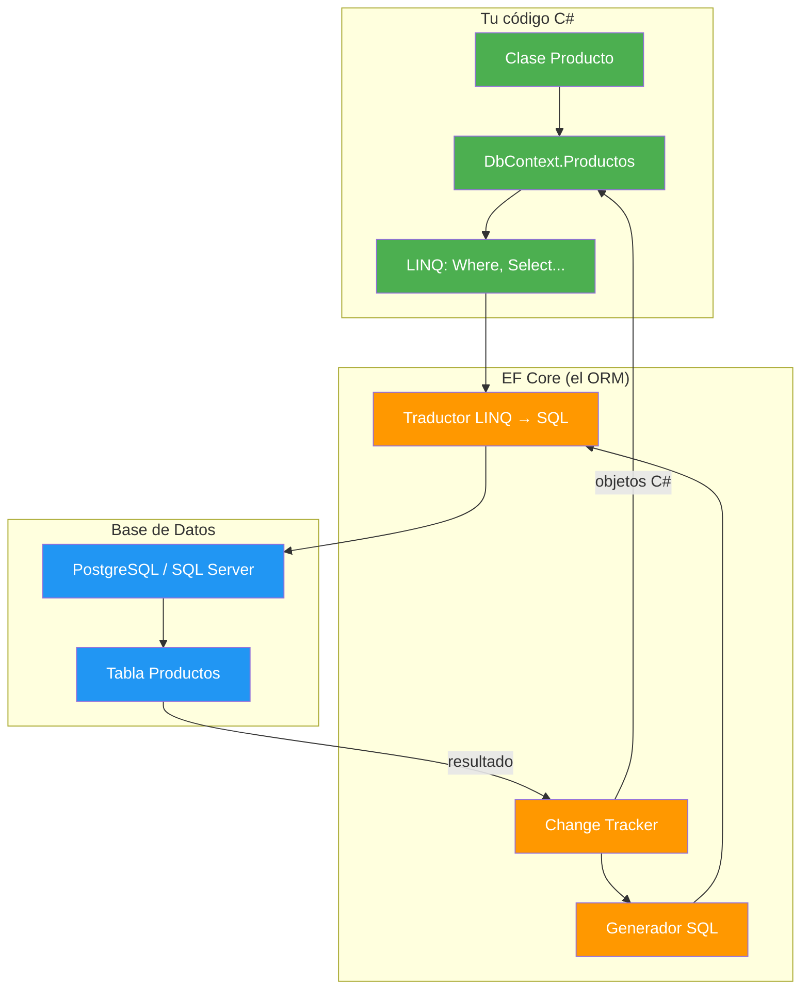
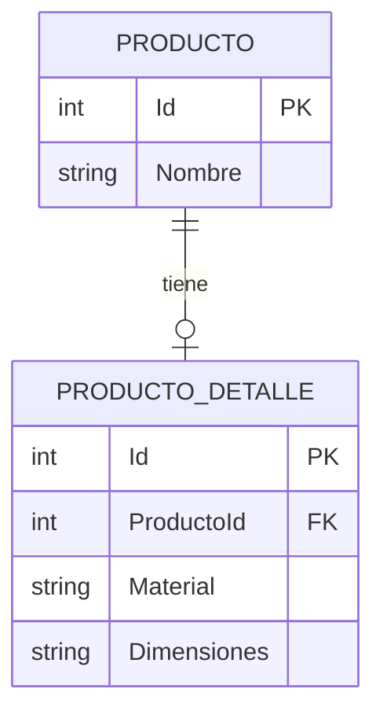
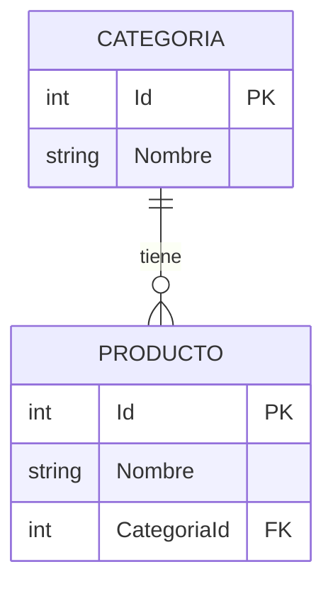
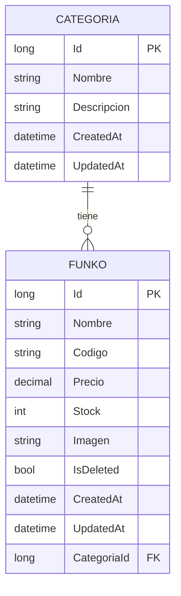

# 12. Entity Framework Core

- [12. Entity Framework Core](#12-entity-framework-core)
  - [12.1. Fundamentos](#121-fundamentos)
    - [12.1.1. ¿Qué es un ORM?](#1211-qué-es-un-orm)
    - [12.1.2. DbContext](#1212-dbcontext)
    - [12.1.3. Componentes del DbContext](#1213-componentes-del-dbcontext)
    - [12.1.4. Ventajas de EF Core](#1214-ventajas-de-ef-core)
    - [12.1.5. Change Tracker](#1215-change-tracker)
  - [12.2. Configuración Inicial](#122-configuración-inicial)
    - [12.2.1. Paquetes NuGet](#1221-paquetes-nuget)
    - [12.2.2. Conexión](#1222-conexión)
    - [12.2.3. Registro del DbContext](#1223-registro-del-dbcontext)
    - [12.2.4. EnsureCreated vs Migrate](#1224-ensurecreated-vs-migrate)
  - [12.3. Data Annotations](#123-data-annotations)
    - [12.3.1. Atributos de columna](#1231-atributos-de-columna)
    - [12.3.2. Atributos de clave](#1232-atributos-de-clave)
    - [12.3.3. Atributos de tabla](#1233-atributos-de-tabla)
    - [12.3.4. Atributos de concurrencia](#1234-atributos-de-concurrencia)
    - [12.3.5. Atributos de generación](#1235-atributos-de-generación)
  - [12.4. Fluent API](#124-fluent-api)
    - [12.4.1. Propiedades](#1241-propiedades)
    - [12.4.2. Claves](#1242-claves)
    - [12.4.3. Tablas y vistas](#1243-tablas-y-vistas)
    - [12.4.4. Relaciones](#1244-relaciones)
    - [12.4.5. IEntityTypeConfiguration y ApplyConfigurationsFromAssembly](#1245-ienitytypeconfiguration-y-applyconfigurationsfromassembly)
  - [12.5. Relaciones](#125-relaciones)
    - [12.5.1. Uno a Uno](#1251-uno-a-uno)
    - [12.5.2. Uno a Muchos](#1252-uno-a-muchos)
    - [12.5.3. Muchos a Muchos](#1253-muchos-a-muchos)
    - [12.5.4. Navegabilidad](#1254-navegabilidad)
    - [12.5.5. Cascada (DeleteBehavior)](#1255-cascada-deletebehavior)
  - [12.6. Owned Types](#126-owned-types)
  - [12.7. Value Converters](#127-value-converters)
  - [12.8. Shadow Properties](#128-shadow-properties)
  - [12.9. [NotMapped] y propiedades calculadas](#129-notmapped-y-propiedades-calculadas)
  - [12.10. Carga de Datos](#1210-carga-de-datos)
    - [12.10.1. Eager Loading (Include, ThenInclude)](#12101-eager-loading-include-theninclude)
    - [12.10.2. Lazy Loading](#12102-lazy-loading)
    - [12.10.3. Explicit Loading](#12103-explicit-loading)
    - [12.10.4. AsSplitQuery](#12104-assplitquery)
  - [12.11. Consultas con LINQ](#1211-consultas-con-linq)
    - [12.11.1. Básicas](#12111-básicas)
    - [12.11.2. Elemento único](#12112-elemento-único)
    - [12.11.3. Condicionales](#12113-condicionales)
    - [12.11.4. Joins explícitos](#12114-joins-explícitos)
    - [12.11.5. GroupBy y agregación](#12115-groupby-y-agregación)
    - [12.11.6. Subconsultas](#12116-subconsultas)
    - [12.11.7. ToQueryString](#12117-toquerystring)
    - [12.11.8. AsNoTracking](#12118-asnotracking)
    - [12.11.9. SQL nativo](#12119-sql-nativo)
  - [12.12. ExecuteUpdate y ExecuteDelete](#1212-executeupdate-y-executedelete)
  - [12.13. Repositorio CRUD con Borrado Físico y Lógico](#1213-repositorio-crud-con-borrado-físico-y-lógico)
    - [12.13.1. Entidad y configuración del modelo](#12131-entidad-y-configuración-del-modelo)
    - [12.13.2. Interfaz del repositorio](#12132-interfaz-del-repositorio)
    - [12.13.3. Implementación: Create, GetById, GetAll, Update](#12133-implementación-create-getbyid-getall-update)
    - [12.13.4. Borrado físico (Delete)](#12134-borrado-físico-delete)
    - [12.13.5. Borrado lógico (SoftDelete + Query Filters)](#12135-borrado-lógico-softdelete--query-filters)
    - [12.13.6. Consultas típicas del repositorio](#12136-consultas-típicas-del-repositorio)
  - [12.14. Migraciones](#1214-migraciones)
    - [12.14.1. Crear migración](#12141-crear-migración)
    - [12.14.2. Aplicar migraciones](#12142-aplicar-migraciones)
    - [12.14.3. Rollback](#12143-rollback)
    - [12.14.4. Eliminar migración](#12144-eliminar-migración)
    - [12.14.5. Listar y generar script](#12145-listar-y-generar-script)
    - [12.14.6. Deployment (Migrate vs EnsureCreated)](#12146-deployment-migrate-vs-ensurecreated)
  - [12.15. Seed Data](#1215-seed-data)
    - [12.15.1. HasData](#12151-hasdata)
    - [12.15.2. Servicio DataSeeder](#12152-servicio-dataloader)
    - [12.15.3. Ficheros SQL](#12153-ficheros-sql)
  - [12.16. Logging](#1216-logging)
    - [12.16.1. LogTo y ILoggerFactory](#12161-logto-y-iloggerfactory)
    - [12.16.2. Filtrar por categoría](#12162-filtrar-por-categoría)
    - [12.16.3. SensitiveDataLogging](#12163-sensitivedatalogging)
    - [12.16.4. Suprimir logs de consultas](#12164-suprimir-logs-de-consultas)
  - [12.17. Control de Concurrencia](#1217-control-de-concurrencia)
    - [12.17.1. Optimista (RowVersion)](#12171-optimista-rowversion)
    - [12.17.2. Pessimista](#12172-pessimista)
  - [12.18. Testing con EF Core](#1218-testing-con-ef-core)
    - [12.18.1. InMemory Database](#12181-inmemory-database)
    - [12.18.2. TestContainers (PostgreSQL)](#12182-testcontainers-postgresql)
    - [12.18.3. Patrón AAA](#12183-patrón-aaa)
  - [12.19. Buenas prácticas](#1219-buenas-prácticas)
  - [12.20. Reto](#1220-reto)
  - [12.21. Resumen](#1221-resumen)

---

> 💡 **Punto de partida:** ¿Alguna vez has tenido que copiar y pegar el mismo código SQL una y otra vez? ¿O cambiar 50 líneas de código cuando la base de datos cambia una columna? Entity Framework Core resuelve eso: hablas en C# y él traduce a SQL por ti.

**Objetivos de aprendizaje:**
- Comprender qué es un ORM y por qué se usa
- Configurar EF Core con Data Annotations y Fluent API
- Definir relaciones entre entidades
- Realizar consultas CRUD con LINQ
- Gestionar migraciones de la base de datos
- Configurar logging para inspeccionar las consultas
- Implementar un repositorio con borrado físico y lógico
- Testear con InMemory y TestContainers

---

## 12.1. Fundamentos

### 12.1.1. ¿Qué es un ORM?

Un **ORM** (Object-Relational Mapping) es una técnica que mapea objetos C# a tablas de base de datos. En vez de escribir SQL a mano, trabajas con clases y el ORM traduce automáticamente. Piensa en él como un **traductor automático** entre tu código y la BD.

**Sin ORM** (SQL puro):

```csharp
// Sin ORM: debes escribir SQL, mapear resultados manualmente
var command = new SqlCommand("SELECT Id, Nombre, Precio FROM Productos WHERE Precio > @precio", connection);
command.Parameters.AddWithValue("@precio", 30);
var reader = command.ExecuteReader();
while (reader.Read())
{
    var producto = new Producto
    {
        Id = reader.GetInt32(0),
        Nombre = reader.GetString(1),
        Precio = reader.GetDecimal(2)
    };
    productos.Add(producto);
}
```

**Con ORM** (EF Core):

```csharp
// Con ORM: hablas en C#, el ORM traduce a SQL
var productos = await context.Productos
    .Where(p => p.Precio > 30)
    .ToListAsync();
```

📌 **Ejemplo real:** **Netflix** usa ORMs internamente para consultar catálogos de películas sin escribir SQL manualmente. Cada vez que buscas "series de terror", el ORM construye la consulta. **Instagram** usa Django ORM para gestionar usuarios, posts y comentarios. **Amazon** usa Entity Framework para su catálogo de productos.



| ORM | Lenguaje | BD soportadas |
|-----|----------|---------------|
| **Entity Framework Core** | C# | SQL Server, PostgreSQL, SQLite, MySQL, Oracle |
| **Django ORM** | Python | PostgreSQL, MySQL, SQLite, Oracle |
| **Hibernate** | Java | Cualquier BD con JDBC |
| **Sequelize** | JavaScript | PostgreSQL, MySQL, SQLite, MSSQL |

### 12.1.2. DbContext

El `DbContext` es la **sesión** con la base de datos. Es tu punto de entrada para todo: leer, insertar, actualizar y borrar datos. Cada `DbContext` representa una **conversación** con la BD.

```csharp
public class AppDbContext : DbContext
{
    public DbSet<Producto> Productos => Set<Producto>();
    public DbSet<Categoria> Categorias => Set<Categoria>();

    public AppDbContext(DbContextOptions<AppDbContext> options) : base(options) { }
}
```

> 💡 **Analogía:** El `DbContext` es como un **cajero de banco**. Tú le dices qué quieres hacer (sacar dinero, hacer una transferencia) y él ejecuta las operaciones. Si le dices "guarda" (`SaveChanges`), él persiste todo. Si cierras la sesión (`Dispose`), se libera la conexión.

### 12.1.3. Componentes del DbContext

| Componente | Función |
|------------|---------|
| `DbSet<T>` | Representa una tabla de la base de datos |
| `OnModelCreating` | Configura el modelo (relaciones, restricciones) |
| `SaveChanges` | Persiste todos los cambios pendientes |
| `Change Tracker` | Detecta qué entidades han cambiado |
| `Database` | Acceso directo a la base de datos |

### 12.1.4. Ventajas de EF Core

| Ventaja | Descripción |
|---------|-------------|
| **Productividad** | Menos código, más legible |
| **Multi-DB** | SQL Server, PostgreSQL, SQLite, MySQL con el mismo código |
| **Migraciones** | Versionado automático del esquema |
| **LINQ** | Consultas tipadas en C# |
| **Change Tracker** | Solo persiste lo que cambia |
| **Lazy/Eager Loading** | Carga de relaciones controlada |

### 12.1.5. Change Tracker

El Change Tracker es el **corazón** de EF Core. Es el sistema que **rastrea todos los cambios** en las entidades que cargas desde la BD. Sin él, EF Core no sabría qué INSERTar, qué UPDATEar o qué DELETEar. Es lo que diferencia a un ORM de un generador de SQL.

Cuando cargas una entidad con `FindAsync()` o `Include()`, EF Core guarda una **copia del original**. Cuando modificas una propiedad, el Change Tracker lo detecta. Cuando llamas a `SaveChanges`, compara el estado actual con el original y genera las sentencias SQL correspondientes.

```mermaid
flowchart LR
    subgraph "Carga de BD"
        A["SELECT * FROM Productos WHERE Id=1"] --> B["Entidad: Producto {Stock=10}"]
        B --> C["Change Tracker guarda original"]
    end

    subgraph "Modificación"
        D["producto.Stock = 5"] --> E["Change Tracker detecta cambio"]
        E --> F["Estado: Modified"]
    end

    subgraph "SaveChanges"
        G["Compara original vs actual"] --> H["UPDATE Productos SET Stock=5"]
        H --> I["BD ejecuta SQL"]
    end

    C --> D
    F --> G

    style A fill:#2196F3,color:#fff
    style B fill:#4CAF50,color:#fff
    style C fill:#FF9800,color:#fff
    style D fill:#4CAF50,color:#fff
    style E fill:#FF9800,color:#fff
    style F fill:#FF9800,color:#fff
    style G fill:#FF9800,color:#fff
    style H fill:#2196F3,color:#fff
    style I fill:#2196F3,color:#fff
```



**Estados de la entidad:**

| Estado | Descripción | Qué hace SaveChanges |
|--------|-------------|----------------------|
| `Added` | Nueva entidad sin Id | INSERT |
| `Modified` | Modificada desde que se cargó | UPDATE |
| `Deleted` | Marcada para borrar | DELETE |
| `Unchanged` | Sin cambios desde la última carga | Nada |
| `Detached` | No está siendo rastreada | Nada |

```csharp
// Ver estado actual de una entidad
var entry = context.Entry(producto);
Console.WriteLine(entry.State);  // "Modified" (si modificaste algo)

// Forzar estado (útil para borrado sin cargar la entidad)
context.Entry(producto).State = EntityState.Deleted;
await context.SaveChangesAsync();  // Ejecuta DELETE
```

> 📝 **Nota:** Cuando haces `FindAsync()` o `Include()`, las entidades se cargan como `Unchanged`. Si modificas una propiedad, EF Core la cambia a `Modified` automáticamente.

**DetectChanges:**

EF Core detecta cambios **automáticamente** antes de `SaveChanges`. Esto implica comparar cada propiedad de cada entidad rastreada con su valor original. Para muchas entidades, esto puede ser costoso. Puedes desactivarlo para mejorar rendimiento.

```csharp
// Desactivar detección automática (mejora rendimiento en batch)
context.ChangeTracker.AutoDetectChangesEnabled = false;

// Forzar detección manual (cuando la necesitas)
context.ChangeTracker.DetectChanges();

// Ver todas las entidades modificadas
var modificadas = context.ChangeTracker.Entries()
    .Where(e => e.State == EntityState.Modified)
    .ToList();

// Ver valores originales vs actuales
foreach (var entry in modificadas)
{
    Console.WriteLine($"Entidad: {entry.Entity.GetType().Name}");
    foreach (var prop in entry.Properties)
    {
        if (prop.IsModified)
        {
            Console.WriteLine($"  {prop.Metadata.Name}: {prop.OriginalValue} → {prop.CurrentValue}");
        }
    }
}
```

> 💡 **Consejo:** Desactiva `AutoDetectChangesEnabled` en operaciones batch con muchas entidades (ej: importar 1000 registros). Actívalo antes de `SaveChanges` o llama a `DetectChanges()` manualmente.

**Attach vs Update:**

Ambos métodos marcan una entidad como rastreada, pero se comportan diferente:

- **`Attach`**: Marca como `Unchanged`. Solo rastrea, no modifica nada. Útil para actualizaciones parciales.
- **`Update`**: Marca **todas** las propiedades como `Modified`. Actualiza todo al guardar.

```csharp
// Attach: solo actualizo Stock (actualización parcial)
context.Attach(producto);
context.Entry(producto).Property(p => p.Stock).IsModified = true;
await context.SaveChangesAsync();  // Solo genera: UPDATE Productos SET Stock = ... WHERE Id = ...

// Update: actualizo todo (actualización completa)
context.Update(producto);
await context.SaveChangesAsync();  // Genera: UPDATE Productos SET Nombre = ..., Precio = ..., Stock = ... WHERE Id = ...
```

> 💡 **Consejo:** Usa `Attach` + `IsModified` para actualizaciones parciales. Es más eficiente porque solo genera SQL para las propiedades que cambiaste. `Update` es más cómodo pero menos eficiente.

---

## 12.2. Configuración Inicial

### 12.2.1. Paquetes NuGet

Dependiendo de la base de datos:

```bash
# PostgreSQL (más usado en desarrollo)
dotnet add package Npgsql.EntityFrameworkCore.PostgreSQL

# SQL Server
dotnet add package Microsoft.EntityFrameworkCore.SqlServer

# SQLite (para tests y prototipos)
dotnet add package Microsoft.EntityFrameworkCore.Sqlite

# Herramientas CLI
dotnet add package Microsoft.EntityFrameworkCore.Design
```

### 12.2.2. Conexión

**appsettings.json:**
```json
{
  "ConnectionStrings": {
    "DefaultConnection": "Host=localhost;Database=tienda;Username=postgres;Password=postgres"
  }
}
```

### 12.2.3. Registro del DbContext

```csharp
// Program.cs
var builder = WebApplication.CreateBuilder(args);

var connectionString = builder.Configuration.GetConnectionString("DefaultConnection");

builder.Services.AddDbContext<AppDbContext>(options =>
    options.UseNpgsql(connectionString));
```

### 12.2.4. EnsureCreated vs Migrate

| Método | Cuándo usar | Limitaciones |
|--------|-------------|--------------|
| `EnsureCreated()` | Prototipos, tests rápidos | No soporta migraciones posteriores |
| `Migrate()` | Producción y desarrollo real | Aplica migraciones pendientes |

> ⚠️ **Advertencia:** NUNCA uses `EnsureCreated()` en producción. Si cambias el modelo, no podrá aplicar migraciones.

---

## 12.3. Data Annotations

Las Data Annotations son atributos C# que configuran el modelo directamente en la entidad. Son la forma más rápida de configurar, pero menos potente que Fluent API.

📌 **Ejemplo real:** **Amazon** usa Data Annotations para configurar productos: `[Required]` en nombre, `[StringLength]` en descripción, `[Precision]` en precio.

### 12.3.1. Atributos de columna

```csharp
public class Producto
{
    [Required]
    [StringLength(100)]
    public string Nombre { get; set; } = string.Empty;

    [Column(TypeName = "decimal(18,2)")]
    public decimal Precio { get; set; }

    [Precision(18, 2)]
    public decimal PrecioConPrecision { get; set; }

    [Required]
    public string Descripcion { get; set; } = string.Empty;

    [MaxLength(500)]
    public string? Observaciones { get; set; }
}
```

| Atributo | Función | Genera en SQL |
|----------|---------|---------------|
| `[Required]` | No permite nulos | `NOT NULL` |
| `[StringLength(n)]` | Longitud máxima + permite nulos | `NVARCHAR(n)` |
| `[MaxLength(n)]` | Longitud máxima | `NVARCHAR(n)` |
| `[Column(TypeName)]` | Tipo de columna exacto | Tipo personalizado |
| `[Precision(p,s)]` | Precisión decimal | `DECIMAL(p,s)` |

> 💡 **Consejo:** Usa `[Precision]` en vez de `[Column(TypeName)]` para decimales. Es más portable entre bases de datos.

> 📝 **Nota:** `[StringLength]` y `[MaxLength]` parecen iguales pero `[StringLength]` también genera validación de longitud mínima si se especifica.

### 12.3.2. Atributos de clave

```csharp
public class Producto
{
    [Key]
    public int Id { get; set; }

    [ForeignKey(nameof(Categoria))]
    public int CategoriaId { get; set; }

    [InverseProperty(nameof(Categoria.Productos))]
    public Categoria? Categoria { get; set; }
}
```

| Atributo | Función |
|----------|---------|
| `[Key]` | Marca la clave primaria |
| `[ForeignKey("NombrePropiedad")]` | Define la clave foránea |
| `[InverseProperty("NombrePropiedad")]` | Especifica la propiedad de navegación inversa |

> 💡 **Consejo:** `[Key]` solo es necesario si la propiedad no se llama `Id` o `NombreClaseId`. EF Core los detecta automáticamente.

### 12.3.3. Atributos de tabla

```csharp
[Table("tbl_productos", Schema = "tienda")]
public class Producto
{
    [Key]
    public int Id { get; set; }

    [NotMapped]
    public string NombreCompleto => $"{Nombre} - {Categoria?.Nombre}";
}
```

| Atributo | Función |
|----------|---------|
| `[Table("nombre")]` | Nombre de la tabla en la BD |
| `[Table("nombre", Schema = "schema")]` | Nombre con schema específico |
| `[NotMapped]` | Excluye una propiedad del mapeo a BD |

> 📝 **Nota:** `[NotMapped]` se usa para propiedades calculadas en C# que no deben persistirse. También se puede usar con `Ignore()` en Fluent API.

### 12.3.4. Atributos de concurrencia

```csharp
public class Producto
{
    [Key]
    public int Id { get; set; }

    [ConcurrencyCheck]
    public int Stock { get; set; }

    [Timestamp]
    public byte[] RowVersion { get; set; } = null!;
}
```

| Atributo | Función | Cuándo usar |
|----------|---------|-------------|
| `[ConcurrencyCheck]` | Verifica cambios en una propiedad específica | Cuando quieres controlar una propiedad concreta |
| `[Timestamp]` | Campo de versión para concurrencia optimista | Campo binario auto-generado por la BD |

> ⚠️ **Advertencia:** `[Timestamp]` no es un timestamp de tiempo. Es un contador binario que cambia cada vez que se modifica la fila.

### 12.3.5. Atributos de generación

```csharp
public class Producto
{
    [Key]
    [DatabaseGenerated(DatabaseGeneratedOption.Identity)]
    public int Id { get; set; }

    [DatabaseGenerated(DatabaseGeneratedOption.Computed)]
    public decimal PrecioConIva { get; set; }

    [DatabaseGenerated(DatabaseGeneratedOption.None)]
    public int CodigoInterno { get; set; }
}
```

| Valor | Función | Ejemplo |
|-------|---------|---------|
| `Identity` | Autoincremental (default para int) | `IDENTITY(1,1)` |
| `None` | Sin generación automática | Valor asignado por la aplicación |
| `Computed` | Calculado por la BD | `precio * 1.21` |

### 12.3.6. Tabla resumen de todos los atributos

| Categoría | Atributo | Función |
|-----------|----------|---------|
| **Columna** | `[Required]` | NOT NULL |
| | `[StringLength(n)]` | NVARCHAR(n) con validación |
| | `[MaxLength(n)]` | NVARCHAR(n) |
| | `[Column(TypeName)]` | Tipo de columna SQL |
| | `[Precision(p,s)]` | Precisión decimal |
| **Clave** | `[Key]` | Clave primaria |
| | `[ForeignKey]` | Clave foránea |
| | `[InverseProperty]` | Navegación inversa |
| **Tabla** | `[Table]` | Nombre de tabla |
| | `[NotMapped]` | Excluir del mapeo |
| **Concurrencia** | `[ConcurrencyCheck]` | Verificar cambios |
| | `[Timestamp]` | Versión para optimista |
| **Generación** | `[DatabaseGenerated]` | Estrategia de generación |
| **Validación** | `[Range(min,max)]` | Rango de valores |
| | `[Url]` | Validar formato URL |
| | `[EmailAddress]` | Validar email |
| | `[Phone]` | Validar teléfono |
| | `[CreditCard]` | Validar tarjeta crédito |
| | `[DataType]` | Tipo de dato semántico |

> 💡 **Consejo:** Los atributos de validación (`[Range]`, `[Url]`, etc.) se usan en capa de presentación (MVC, API). No afectan a la BD directamente.

---

## 12.4. Fluent API

La Fluent API ofrece más control que las Data Annotations. Se configura en `OnModelCreating`. Es la forma **recomendada** para configuraciones complejas.

📌 **Ejemplo real:** **Stripe** usa configuración similar para entidades de pago: precisión en montos, índices en transacciones, relaciones con clientes.

> 💡 **Consejo:** Si Data Annotations y Fluent API dan el mismo resultado, usa Fluent API. Permite separar la configuración de la entidad y es más potente.

### 12.4.1. Propiedades

```csharp
protected override void OnModelCreating(ModelBuilder modelBuilder)
{
    modelBuilder.Entity<Producto>(entity =>
    {
        // Requerido + longitud máxima
        entity.Property(e => e.Nombre)
            .IsRequired()
            .HasMaxLength(100)
            .IsUnicode(false);  // VARCHAR en vez de NVARCHAR

        // Precisión decimal (recomendado sobre [Column(TypeName)])
        entity.Property(e => e.Precio)
            .HasPrecision(18, 2);

        // Valor por defecto
        entity.Property(e => e.Stock)
            .HasDefaultValue(0);

        // Valor por defecto con SQL
        entity.Property(e => e.FechaCreacion)
            .HasDefaultValueSql("GETUTCDATE()");

        // Valor que se actualiza solo
        entity.Property(e => e.FechaActualizacion)
            .ValueGeneratedOnUpdate();

        // Sin generación automática
        entity.Property(e => e.CodigoInterno)
            .ValueGeneratedNever();

        // Longitud fija
        entity.Property(e => e.CodigoBarras)
            .HasMaxLength(13)
            .IsUnicode(false);
    });
}
```

| Método | Función |
|--------|---------|
| `IsRequired()` | NOT NULL |
| `HasMaxLength(n)` | NVARCHAR(n) |
| `IsUnicode(false)` | VARCHAR (sin Unicode) |
| `HasPrecision(p,s)` | DECIMAL(p,s) |
| `HasDefaultValue(v)` | Valor por defecto en C# |
| `HasDefaultValueSql("sql")` | Valor por defecto en SQL |
| `ValueGeneratedOnUpdate()` | Se actualiza en cada UPDATE |
| `ValueGeneratedNever()` | Nunca se genera automáticamente |

### 12.4.2. Claves

```csharp
// Clave primaria simple
entity.HasKey(e => e.Id);

// Clave primaria compuesta
entity.HasKey(e => new { e.ProductoId, e.PedidoId });

// Clave alterna (única)
entity.HasAlternateKey(e => e.CodigoBarras);

// Múltiples claves alternas
entity.HasAlternateKey(e => e.Email);
entity.HasAlternateKey(e => e.CodigoUnico);
```

> 📝 **Nota:** Las claves alternas generan un índice único en la BD. Son útiles para campos que deben ser únicos pero no son la PK.

### 12.4.3. Tablas y vistas

```csharp
// Nombre de tabla con schema
entity.ToTable("tbl_productos", "tienda");

// Mapear a vista
entity.ToView("vista_productos");

// Mapear a función de tabla (table-valued function)
entity.ToTable("fn_productos_por_categoria");

// Comentario en tabla
entity.HasComment("Tabla de productos de la tienda");

// Comentario en columna
entity.Property(e => e.Nombre)
    .HasComment("Nombre del producto");
```

### 12.4.4. Relaciones

```csharp
// Uno a muchos
entity.HasOne(e => e.Categoria)
    .WithMany(c => c.Productos)
    .HasForeignKey(e => e.CategoriaId)
    .OnDelete(DeleteBehavior.Restrict)
    .HasConstraintName("FK_Productos_Categorias");

// Uno a uno
entity.HasOne(e => e.Detalle)
    .WithOne(d => d.Producto)
    .HasForeignKey<ProductoDetalle>(d => d.ProductoId);

// Muchos a muchos (sin entidad intermedia)
entity.HasMany(p => p.Etiquetas)
    .WithMany(e => e.Productos);

// Muchos a muchos (con entidad intermedia)
entity.HasOne(e => e.Producto)
    .WithMany(p => p.ProductoEtiquetas)
    .HasForeignKey(e => e.ProductoId);

entity.HasOne(e => e.Etiqueta)
    .WithMany(e => e.ProductoEtiquetas)
    .HasForeignKey(e => e.EtiquetaId);
```

### 12.4.5. IEntityTypeConfiguration y ApplyConfigurationsFromAssembly

En vez de todo en `OnModelCreating`, puedes separar la configuración por entidad:

```csharp
// Configuración de Producto
public class ProductoConfiguration : IEntityTypeConfiguration<Producto>
{
    public void Configure(EntityTypeBuilder<Producto> builder)
    {
        builder.HasKey(e => e.Id);
        builder.Property(e => e.Nombre).IsRequired().HasMaxLength(100);
        builder.Property(e => e.Precio).HasPrecision(18, 2);
        builder.HasOne(e => e.Categoria)
            .WithMany(c => c.Productos)
            .HasForeignKey(e => e.CategoriaId);
    }
}

// En AppDbContext
protected override void OnModelCreating(ModelBuilder modelBuilder)
{
    // Busca automáticamente todas las configuraciones
    modelBuilder.ApplyConfigurationsFromAssembly(typeof(AppDbContext).Assembly);
}
```

> 💡 **Consejo:** `ApplyConfigurationsFromAssembly` busca automáticamente todas las clases que implementan `IEntityTypeConfiguration<T>` en el ensamblado. No tienes que añadirlas una por una. Cuando creas una nueva entidad, solo crea su configuración y se aplica automáticamente.

### 12.4.6. Data Annotations vs Fluent API

| Característica | Data Annotations | Fluent API |
|----------------|------------------|------------|
| Sintaxis | Atributos C# | Método chaining (chaining) |
| Separación | Mezclada con la entidad | Separada en configuración |
| Potencia | Básica | Compleja |
| Legibilidad | Rápida de leer | Más verbosa |
| Control | Limitado | Total |

> 💡 **Consejo:** Usa un **enfoque híbrido**. Data Annotations para lo simple (`[Required]`, `[StringLength]`, `[Key]`). Fluent API para lo complejo (relaciones, índices, filtros, owned types).

---

## 12.5. Relaciones

### 12.5.1. Uno a Uno

Una relación uno a uno significa que cada registro de una tabla se relaciona con **como máximo un** registro de otra tabla. Por ejemplo, cada producto tiene como máximo un detalle extendido.



**Con Data Annotations:**

```csharp
public class Producto
{
    [Key]
    public int Id { get; set; }
    public string Nombre { get; set; } = string.Empty;

    public ProductoDetalle? Detalle { get; set; }
}

public class ProductoDetalle
{
    [Key]
    public int Id { get; set; }

    [ForeignKey(nameof(Producto))]
    public int ProductoId { get; set; }

    public string Material { get; set; } = string.Empty;
    public string Dimensiones { get; set; } = string.Empty;

    public Producto Producto { get; set; } = null!;
}
```

**Con Fluent API:**

```csharp
modelBuilder.Entity<ProductoDetalle>(entity =>
{
    entity.HasOne(e => e.Producto)
        .WithOne(p => p.Detalle)
        .HasForeignKey<ProductoDetalle>(d => d.ProductoId);
});
```

> 📝 **Nota:** En una relación 1:1, la clave foránea va en la entidad que "depende". Aquí `ProductoDetalle` depende de `Producto`, por eso `ProductoId` está en `ProductoDetalle`.

### 12.5.2. Uno a Muchos

Es la relación más común. Una categoría tiene muchos productos, pero cada producto pertenece a una sola categoría.



**Con Data Annotations:**

```csharp
public class Categoria
{
    [Key]
    public int Id { get; set; }
    public string Nombre { get; set; } = string.Empty;

    // Navegación: una categoría tiene muchos productos
    public List<Producto> Productos { get; set; } = new();
}

public class Producto
{
    [Key]
    public int Id { get; set; }
    public string Nombre { get; set; } = string.Empty;

    [ForeignKey(nameof(Categoria))]
    public int CategoriaId { get; set; }

    // Navegación: un producto pertenece a una categoría
    public Categoria Categoria { get; set; } = null!;
}
```

**Con Fluent API:**

```csharp
modelBuilder.Entity<Producto>(entity =>
{
    entity.HasOne(e => e.Categoria)
        .WithMany(c => c.Productos)
        .HasForeignKey(e => e.CategoriaId)
        .OnDelete(DeleteBehavior.Cascade);
});
```

> 💡 **Consejo:** `[ForeignKey]` solo es necesario si la propiedad FK no se llama `NombreEntidadId`. Si la FK se llama `CategoriaId`, EF Core la detecta automáticamente.

### 12.5.3. Muchos a Muchos

Un producto puede tener muchas etiquetas, y una etiqueta puede estar en muchos productos. Se resuelve con una **tabla intermedia**.

**Con Data Annotations (tabla intermedia explícita):**

```csharp
public class ProductoEtiqueta
{
    [Key]
    [Column(Order = 0)]
    public int ProductoId { get; set; }

    [Key]
    [Column(Order = 1)]
    public int EtiquetaId { get; set; }

    [ForeignKey(nameof(Producto))]
    public Producto Producto { get; set; } = null!;

    [ForeignKey(nameof(Etiqueta))]
    public Etiqueta Etiqueta { get; set; } = null!;
}
```

**Con Fluent API (tabla intermedia explícita — recomendado):**

```csharp
modelBuilder.Entity<ProductoEtiqueta>(entity =>
{
    entity.HasKey(e => new { e.ProductoId, e.EtiquetaId });

    entity.HasOne(e => e.Producto)
        .WithMany(p => p.ProductoEtiquetas)
        .HasForeignKey(e => e.ProductoId);

    entity.HasOne(e => e.Etiqueta)
        .WithMany(e => e.ProductoEtiquetas)
        .HasForeignKey(e => e.EtiquetaId);
});
```

**Con Fluent API (sin tabla intermedia — EF Core 5+):**

```csharp
modelBuilder.Entity<Producto>(entity =>
{
    entity.HasMany(p => p.Etiquetas)
        .WithMany(e => e.Productos);
});
```

> 📝 **Nota:** EF Core crea automáticamente una tabla intermedia `ProductoEtiqueta` sin configuración explícita. Pero si necesitas columnas adicionales (como `FechaAsignación`), debes crear la entidad intermedia manualmente.

> ⚠️ **Advertencia:** Con Data Annotations para claves compuestas, necesitas `[Column(Order = 0)]` y `[Column(Order = 1)]` para definir el orden. Con Fluent API es más limpio con `HasKey(e => new { ... })`.

### 12.5.4. Navegabilidad

La navegabilidad define si una entidad tiene referencia a otra. Hay dos tipos fundamentales:

- **Bidireccional:** Ambas entidades se "ven" entre sí. `Producto` tiene `Categoria` y `Categoria` tiene `List<Producto>`. Útil cuando necesitas recorrer la relación en ambas direcciones.
- **Unidireccional:** Solo una entidad conoce a la otra. `Producto` tiene `Categoria`, pero `Categoria` no tiene lista de productos. Más limpio, menos acoplamiento.

| Tipo | Descripción | Cuándo usar |
|------|-------------|-------------|
| **Bidireccional** | Ambas entidades tienen referencia la una a la otra | Cuando necesitas navegar en ambas direcciones |
| **Unidireccional** | Solo una entidad tiene la referencia | Cuando solo necesitas navegar en una dirección |

En Data Annotations, la navegabilidad bidireccional se crea poniendo propiedades de navegación en **ambas** entidades. La unidireccional solo la pone en una.

En Fluent API, controlas la navegabilidad con `.WithMany()` (agrega navegación en el padre) o `.WithOne()` (agrega navegación en el hijo). Si no especificas el lado de la navegación, EF Core crea la relación unidireccional por defecto.

> 💡 **Consejo:** Prefiere la navegabilidad unidireccional cuando sea posible. Menos acoplamiento, más limpio. Solo usa bidireccional cuando realmente necesites navegar en ambas direcciones.

### 12.5.5. Cascada (DeleteBehavior)

El comportamiento de borrado define qué pasa con los registros hijos cuando borras el padre. Es una de las configuraciones más importantes de las relaciones porque afecta a la integridad referencial de la BD.

En Data Annotations, el comportamiento por defecto es `Cascade` (borrar padre borra hijos). Para cambiarlo, necesitas Fluent API, ya que no hay atributo para esto.

En Fluent API, se configura con `.OnDelete()`:

| Comportamiento | Función | Ejemplo real |
|----------------|---------|--------------|
| `Cascade` | Borrar padre borra hijos (default) | Borrar un cliente borra sus pedidos |
| `Restrict` | No permite borrar padre si tiene hijos | No puedes borrar una categoría si tiene productos |
| `SetNull` | Al borrar padre, pone FK a null | Al borrar un empleado, su jefe se pone a null |
| `NoAction` | No hace nada (puede dejar huérfanas) | Borrar una categoría deja los productos sin categoría |

```csharp
// Fluent API
modelBuilder.Entity<Producto>(entity =>
{
    entity.HasOne(e => e.Categoria)
        .WithMany(c => c.Productos)
        .HasForeignKey(e => e.CategoriaId)
        .OnDelete(DeleteBehavior.Restrict);  // No permitir borrar categoría con productos
});
```

> ⚠️ **Advertencia:** En SQL Server, `Restrict` y `NoAction` son equivalentes. En PostgreSQL y SQLite sí hay diferencia: `Restrict` falla inmediatamente, `NoAction` falla al final de la transacción.

> 📝 **Nota:** No hay forma de configurar `DeleteBehavior` con Data Annotations. Siempre necesitas Fluent API para esto. Es una de las razones por las que Fluent API es más potente.

---

## 12.6. Owned Types

Los Owned Types permiten agrupar propiedades relacionadas en una clase separada que se almacena en la **misma tabla**. Son ideales para Value Objects en DDD (Domain-Driven Design). Por ejemplo, una dirección de envío y una dirección de facturación son del mismo tipo (`Direccion`) pero son propiedades independientes dentro de un `Cliente`.

No puedes usar `[Key]` en un Owned Type porque no tiene tabla propia: sus columnas viven en la tabla del propietario. En Data Annotations, se marca la propiedad con `[Owned]` (aunque EF Core lo detecta automáticamente por la convención). En Fluent API, se configura con `OwnsOne()`.

```csharp
public class Direccion
{
    public string Calle { get; set; } = string.Empty;
    public string Ciudad { get; set; } = string.Empty;
    public string CodigoPostal { get; set; } = string.Empty;
    public string Pais { get; set; } = string.Empty;
}

public class Cliente
{
    public int Id { get; set; }
    public string Nombre { get; set; } = string.Empty;
    public Direccion DireccionEnvio { get; set; } = null!;
    public Direccion DireccionFacturacion { get; set; } = null!;
}
```

**Configuración con Fluent API:**

```csharp
protected override void OnModelCreating(ModelBuilder modelBuilder)
{
    modelBuilder.Entity<Cliente>(entity =>
    {
        entity.OwnsOne(e => e.DireccionEnvio, d =>
        {
            d.Property(x => x.Calle).HasColumnName("DireccionEnvio_Calle");
            d.Property(x => x.Ciudad).HasColumnName("DireccionEnvio_Ciudad");
            d.Property(x => x.CodigoPostal).HasColumnName("DireccionEnvio_CodigoPostal");
            d.Property(x => x.Pais).HasColumnName("DireccionEnvio_Pais");
        });

        entity.OwnsOne(e => e.DireccionFacturacion, d =>
        {
            d.Property(x => x.Calle).HasColumnName("DireccionFacturacion_Calle");
            d.Property(x => x.Ciudad).HasColumnName("DireccionFacturacion_Ciudad");
        });
    });
}
```

> 📝 **Nota:** Por defecto, EF Core nombra las columnas con el prefijo de la propiedad (ej: `DireccionEnvio_Calle`). Puedes personalizar los nombres con `HasColumnName()` o usar `ToJson()` para guardar todo como JSON.

**Owned como JSON (EF Core 8+):**

```csharp
entity.OwnsOne(e => e.DireccionEnvio, d =>
{
    d.ToJson();  // Se almacena como JSON en una columna
});
```

> 💡 **Consejo:** Con `ToJson()`, la dirección se guarda como `{ "Calle": "...", "Ciudad": "..." }` en una sola columna JSON. Útil cuando no necesitas consultar campos individuales de la dirección. Pero si necesitas hacer `WHERE Ciudad = 'Madrid'`, mejor usar columnas separadas con `HasColumnName()`.

📌 **Ejemplo real:** **Amazon** guarda direcciones de envío y facturación como Owned Types. Cada cliente puede tener múltiples direcciones, pero cada dirección no existe sin el cliente.

---

## 12.7. Value Converters

Los Value Converters transforman tipos de C# a tipos que la BD entiende, y viceversa. Son necesarios cuando el tipo que usas en tu modelo no es directamente soportado por la BD. Por ejemplo, un `enum` en C# se guarda como `int` o `string` en la BD, y un `DateOnly` (EF Core 7+) se guarda como un string o fecha.

Los Value Converters se configuran **solo con Fluent API** (no hay Data Annotations para esto). Se usa `HasConversion()` en `OnModelCreating`.

```csharp
protected override void OnModelCreating(ModelBuilder modelBuilder)
{
    modelBuilder.Entity<Producto>(entity =>
    {
        // Enum a string (recomendado: legible en la BD)
        entity.Property(e => e.Estado)
            .HasConversion<string>();

        // Enum a int (por defecto, más compacto)
        entity.Property(e => e.Estado)
            .HasConversion<int>();

        // DateOnly a string (EF Core 7+)
        entity.Property(e => e.FechaCaducidad)
            .HasConversion<string>();

        // Guid a string (para BDs que no soportan GUID nativo)
        entity.Property(e => e.CodigoUnico)
            .HasConversion<string>();

        // Boolean a entero (para BDs antiguas que no soportan bool)
        entity.Property(e => e.Activo)
            .HasConversion<int>();
    });
}
```

**Conversiones personalizadas (cuando las integradas no alcanzan):**

```csharp
// Convertir una lista de strings a JSON en una columna
entity.Property(e => e.Etiquetas)
    .HasConversion(
        v => JsonSerializer.Serialize(v, (JsonSerializerOptions?)null),
        v => JsonSerializer.Deserialize<List<string>>(v, (JsonSerializerOptions?)null) ?? new List<string>()
    );

// Convertir un Color (objeto custom) a string hex
entity.Property(e => e.ColorHex)
    .HasConversion(
        v => v.ToString(),           // Color -> string (#FF0000)
        v => Color.FromHex(v)        // string -> Color
    );
```

> 📝 **Nota:** Las conversiones personalizadas usan dos lambdas: la primera convierte C# → BD, la segunda BD → C#. EF Core las aplica automáticamente en consultas e inserciones.

> ⚠️ **Advertencia:** Al usar Value Converters, pierdes eficiencia en consultas. EF Core no puede traducir la conversión a SQL optimizado. Por ejemplo, si conviertes un `enum` a `string`, el `WHERE` será `WHERE Estado = 'Activo'` en vez de `WHERE Estado = 0`.

📌 **Ejemplo real:** **Amazon** guarda preferencias de usuario como JSON en una columna usando Value Converters. No necesita tablas separadas para cada preferencia.

---

## 12.8. Shadow Properties

Las Shadow Properties existen en la BD pero **no en la clase C#**. Son columnas que EF Core gestiona automáticamente sin que las declares en tu modelo. Se usan principalmente para auditoría (quién creó, cuándo, quién modificó) y para relaciones donde la FK no está en la entidad.

En Data Annotations, no hay forma de crear Shadow Properties. Se configuran **exclusivamente con Fluent API** usando `entity.Property<T>("Nombre")`.

Las Shadow Properties son útiles cuando no quieres ensuciar tu modelo con propiedades de auditoría, pero necesitas ese dato en la BD. También son la base del patrón de auditoría automática con `SaveChanges` override.

```csharp
protected override void OnModelCreating(ModelBuilder modelBuilder)
{
    modelBuilder.Entity<Producto>(entity =>
    {
        entity.Property<DateTime>("CreatedAt");
        entity.Property<DateTime?>("UpdatedAt");
        entity.Property<string>("CreatedBy").HasMaxLength(100);
        entity.Property<string>("UpdatedBy").HasMaxLength(100);
    });
}
```

**Uso de Shadow Properties:**

```csharp
// Asignar valores (no puedes usar la propiedad directamente, solo vía Entry)
context.Entry(producto)["CreatedAt"] = DateTime.UtcNow;
context.Entry(producto)["CreatedBy"] = "admin@email.com";

// Leer valores
var fecha = (DateTime)context.Entry(producto)["CreatedAt"];

// Usar en consultas LINQ con EF.Property<T>()
var productosRecientes = await context.Productos
    .Where(p => EF.Property<DateTime>(p, "CreatedAt") > DateTime.UtcNow.AddDays(-7))
    .ToListAsync();
```

> 📝 **Nota:** Para acceder a Shadow Properties en código, usas `context.Entry(entidad)["NombrePropiedad"]` o `EF.Property<T>(entidad, "NombrePropiedad")`. No puedes acceder directamente como `entidad.CreatedAt` porque no existe en la clase C#.

**Patrón de auditoría completo (override de SaveChanges):**

```csharp
public override async Task<int> SaveChangesAsync(CancellationToken cancellationToken = default)
{
    foreach (var entry in ChangeTracker.Entries<BaseEntity>())
    {
        if (entry.State == EntityState.Added)
        {
            entry.Entity.CreatedAt = DateTime.UtcNow;
        }
        else if (entry.State == EntityState.Modified)
        {
            entry.Entity.UpdatedAt = DateTime.UtcNow;
        }
    }

    return await base.SaveChangesAsync(cancellationToken);
}
```

> 💡 **Consejo:** Si prefieres que las propiedades de auditoría estén en tu modelo C# (no como Shadow Properties), crea una clase base `BaseEntity` con `CreatedAt`, `UpdatedAt`, etc. Así puedes acceder a ellas directamente sin usar `Entry()["..."]`.

---

## 12.9. [NotMapped] y propiedades calculadas

El atributo `[NotMapped]` le dice a EF Core que una propiedad **no se mapee a la BD**. Se usa para propiedades calculadas en C#, datos temporales o campos que no necesitan persistencia.

En Fluent API, equivalente es `Ignore()` en `OnModelCreating`.

```csharp
public class Producto
{
    public int Id { get; set; }
    public string Nombre { get; set; } = string.Empty;
    public decimal Precio { get; set; }
    public decimal Iva { get; set; }

    // Solo existe en C#, no en la BD
    [NotMapped]
    public decimal PrecioConIva => Precio * (1 + Iva);
}
```

**Equivalente con Fluent API:**

```csharp
modelBuilder.Entity<Producto>(entity =>
{
    entity.Ignore(e => e.PrecioConIva);
});
```

**Propiedad calculada en la BD (diferente de [NotMapped]):**

```csharp
// Esta SÍ está en la BD, calculada por el motor SQL
entity.Property(e => e.PrecioConIva)
    .HasComputedColumnSql("[Precio] * (1 + [Iva])");
```

> 📝 **Nota:** `[NotMapped]` se calcula **en C#** cada vez que accedes a la propiedad. `HasComputedColumnSql` se calcula **en la BD** (se almacena y se actualiza automáticamente cuando cambian las columnas base). Si necesitas consultar por `PrecioConIva`, usa `HasComputedColumnSql`. Si solo lo muestras en pantalla, `[NotMapped]` es más rápido.

> 💡 **Consejo:** `[NotMapped]` también es útil para propiedades que solo usas en tiempo de ejecución, como un `bool IsValid` que se calcula según reglas de negocio pero no necesitas guardar.

---

## 12.10. Carga de Datos

Cuando consultas una entidad con relaciones, EF Core tiene tres estrategias para cargar los datos relacionados. Elegir la estrategia correcta afecta directamente al rendimiento de tu aplicación. Una mala decisión puede causar el problema **N+1** (miles de consultas innecesarias) o cargar demasiados datos en memoria.

### 12.10.1. Eager Loading (Include, ThenInclude)

Carga las entidades relacionadas **en la misma consulta SQL**. EF Core genera un `JOIN` o varias consultas dependiendo de la configuración. Es la estrategia más usada y la más predecible.

```csharp
// Incluir una relación
var productos = await context.Productos
    .Include(p => p.Categoria)
    .ToListAsync();

// Incluir relaciones anidadas (ThenInclude)
var productos = await context.Productos
    .Include(p => p.Categoria)
        .ThenInclude(c => c.Padre)  // Categoría padre de la categoría
    .Include(p => p.Etiquetas)       // Muchos a muchos
    .ToListAsync();
```

> 💡 **Consejo:** Usa `Include` cuando **siempre** necesitas la relación cargada. Si solo la necesitas a veces, considera Eager Loading condicional o Explicit Loading.

### 12.10.2. Lazy Loading

Carga las relaciones **automáticamente** al acceder a ellas. Cada vez que usas `producto.Categoria.Nombre`, EF Core ejecuta una consulta SQL para cargar la categoría. Es transparente pero peligroso si no controlas las accesos.

```csharp
// Configurar (requiere paquete Microsoft.EntityFrameworkCore.Proxies)
builder.Services.AddDbContext<AppDbContext>(options =>
    options.UseNpgsql(connectionString)
           .UseLazyLoadingProxies());

// Uso: la categoría se carga automáticamente
var producto = await context.Productos.FindAsync(1);
var nombreCategoria = producto.Categoria.Nombre;  // ¡SQL aquí!
```

> ⚠️ **Advertencia:** El Lazy Loading puede causar el problema **N+1**: si recorres 100 productos y accedes a su categoría, se ejecutan 101 consultas (1 para productos + 100 para categorías). En producción, esto puede colapsar la BD. **No se recomienda** para APIs.

### 12.10.3. Explicit Loading

Carga la relación **manualmente** cuando la necesitas. Más control que Lazy Loading, sin el riesgo de N+1.

```csharp
var producto = await context.Productos.FindAsync(1);

// Cargar una referencia (relación uno)
await context.Entry(producto)
    .Reference(p => p.Categoria)
    .LoadAsync();

// Cargar una colección (relación muchos) con filtro
await context.Entry(producto)
    .Collection(p => p.Etiquetas)
    .Query()
    .Where(e => e.Nombre.StartsWith("A"))
    .LoadAsync();
```

> 💡 **Consejo:** Explicit Loading es ideal cuando cargas primero la entidad principal y luego decides **condicionalmente** si necesitas las relaciones. Ejemplo: "si el producto está en oferta, carga las etiquetas".

### 12.10.4. AsSplitQuery

Cuando haces muchos `Include`, EF Core genera una sola consulta gigante con múltiples JOINs. `AsSplitQuery()` divide esto en **varias consultas pequeñas**, una por cada `Include`. Reduce el tiempo de respuesta en relaciones complejas.

```csharp
var productos = await context.Productos
    .Include(p => p.Categoria)
    .Include(p => p.Etiquetas)
    .Include(p => p.Imagenes)
    .AsSplitQuery()  // 4 consultas: 1 principal + 3 por cada Include
    .ToListAsync();
```

> 📝 **Nota:** `AsSplitQuery` genera más round-trips a la BD pero cada consulta es más simple y rápida. Es mejor cuando tienes tablas grandes y relaciones complejas. Con pocos Include, la consulta única suele ser más rápida.

> ⚠️ **Advertencia:** `AsSplitQuery` puede causar problemas con relaciones de muchos a muchos si no usas filtrado. Para la mayoría de casos, la consulta única (por defecto) es suficiente.

---

## 12.11. Consultas con LINQ

EF Core traduce consultas LINQ de C# a SQL. Es una de las grandes ventajas del ORM: escribes C# y el motor genera el SQL optimizado para la BD que uses. Las consultas se ejecutan **diferidamente** (lazy): solo se ejecutan cuando iteras el resultado o llamas a `ToListAsync()`, `FirstOrDefaultAsync()`, etc.

### 12.11.1. Básicas

Estas son las operaciones fundamentales de cualquier consulta. Filtrar, ordenar, proyectar y paginar son las cuatro operaciones que cubren el 80% de los casos de uso.

```csharp
// Obtener todos (⚠️ cuidado con tablas grandes)
var todos = await context.Productos.ToListAsync();

// Filtrar con Where
var caros = await context.Productos
    .Where(p => p.Precio > 30)
    .ToListAsync();

// Ordenar
var ordenados = await context.Productos
    .OrderBy(p => p.Nombre)
    .ToListAsync();

// Ordenar descendente y encadenar
var ordenadosDesc = await context.Productos
    .OrderByDescending(p => p.Precio)
    .ThenBy(p => p.Nombre)
    .ToListAsync();

// Proyección (solo campos necesarios → más rápido)
var proyectados = await context.Productos
    .Select(p => new { p.Id, p.Nombre, p.Precio })
    .ToListAsync();

// Paginación (Skip + Take)
var pagina = await context.Productos
    .OrderBy(p => p.Id)
    .Skip((page - 1) * pageSize)
    .Take(pageSize)
    .ToListAsync();
```

> 💡 **Consejo:** Siempre usa `Select()` para proyectar solo los campos que necesitas. En vez de traer toda la entidad, traer `Id`, `Nombre` y `Precio` es mucho más rápido y consume menos memoria.

### 12.11.2. Elemento único

Cuando necesitas **un solo registro**, hay varios métodos. Elegir el correcto depende de si esperas resultados o no, y de si puede haber duplicados.

| Método | Sin resultado | Con resultado | Más de uno | Uso típico |
|--------|---------------|---------------|------------|------------|
| `FirstOrDefault()` | null | primer elemento | primer elemento | "dame el primero que encuentres" |
| `First()` | excepción | primer elemento | primer elemento | "sé que existe" |
| `SingleOrDefault()` | null | elemento | **excepción** | "solo debe haber uno" |
| `Single()` | excepción | elemento | **excepción** | "solo debe haber uno y sé que existe" |
| `Find()` | null | por PK | — | "búsqueda por clave primaria" |

```csharp
// Búsqueda flexible (devuelve null si no existe)
var producto = await context.Productos
    .FirstOrDefaultAsync(p => p.Nombre == "Iron Man");

// Búsqueda por PK (usa Find si está en el tracking)
var producto = await context.Productos.FindAsync(id);

// Búsqueda estricta (excepción si no existe o hay duplicados)
var producto = await context.Productos
    .SingleAsync(p => p.CodigoBarras == "123456789");
```

> ⚠️ **Advertencia:** `Find()` solo busca en el Change Tracker. Si la entidad ya está cacheada, la devuelve sin ir a la BD. Si no está, ejecuta `SELECT * WHERE Id = @id`. No funciona con composiciones complejas.

### 12.11.3. Condicionales

Métodos que responden preguntas sobre la colección. Son útiles para validaciones y estadísticas rápidas.

```csharp
// ¿Existen productos caros? (devuelve true/false)
var hayCaros = await context.Productos.AnyAsync(p => p.Precio > 100);

// ¿Todos son baratos?
var todosBaratos = await context.Productos.AllAsync(p => p.Precio < 50);

// ¿Contiene un producto con ese nombre?
var nombres = new[] { "Iron Man", "Batman" };
var hayCoincidencia = await context.Productos
    .AnyAsync(p => nombres.Contains(p.Nombre));  // Traduce a SQL IN

// Contar registros
var total = await context.Productos.CountAsync();
var totalCaros = await context.Productos.CountAsync(p => p.Precio > 50);

// Sumar, mínimo, máximo
var sumaStock = await context.Productos.SumAsync(p => p.Stock);
var precioMin = await context.Productos.MinAsync(p => p.Precio);
var precioMax = await context.Productos.MaxAsync(p => p.Precio);
var precioMedio = await context.Productos.AverageAsync(p => p.Precio);
```

> 📝 **Nota:** `AnyAsync()` es más eficiente que `CountAsync() > 0`. `Any` solo necesita encontrar **un** registro, `Count` tiene que contar **todos**.

### 12.11.4. Joins explícitos

Aunque EF Core resuelve relaciones con `Include()`, a veces necesitas joins explícitos para consultas más controladas o para cruzar tablas que no tienen relación directa.

```csharp
// Join con sintaxis de método (lambda)
var productosConCategoria = await context.Productos
    .Join(
        context.Categorias,
        p => p.CategoriaId,        // FK en Productos
        c => c.Id,                 // PK en Categorias
        (p, c) => new { Producto = p.Nombre, Categoria = c.Nombre }
    )
    .ToListAsync();

// Join con sintaxis de consulta (LINQ query syntax)
var productosConCategoria = await (
    from p in context.Productos
    join c in context.Categorias on p.CategoriaId equals c.Id
    select new { Producto = p.Nombre, Categoria = c.Nombre }
).ToListAsync();

// Left Join (GroupJoin + SelectMany + DefaultIfEmpty)
var todosLosProductos = await context.Productos
    .GroupJoin(
        context.Categorias,
        p => p.CategoriaId,
        c => c.Id,
        (p, cats) => new { Producto = p, Categorias = cats }
    )
    .SelectMany(
        x => x.Categorias.DefaultIfEmpty(),
        (x, c) => new { x.Producto.Nombre, Categoria = c?.Nombre ?? "Sin categoría" }
    )
    .ToListAsync();
```

> 💡 **Consejo:** Para joins simples entre entidades relacionadas, es más sencillo usar `Include()` + `Select()`. Los joins explícitos son útiles cuando necesitas cruzar tablas no relacionadas o cuando el `Include` genera un SQL ineficiente.

### 12.11.5. GroupBy y agregación

`GroupBy` agrupa los resultados por una clave y permite calcular agregados (count, avg, sum, etc.) por grupo. Es como el `GROUP BY` de SQL.

```csharp
// Agrupar por categoría y calcular estadísticas
var productosPorCategoria = await context.Productos
    .GroupBy(p => p.CategoriaId)
    .Select(g => new
    {
        CategoriaId = g.Key,
        Total = g.Count(),
        PrecioMedio = g.Average(p => p.Precio),
        StockTotal = g.Sum(p => p.Stock),
        MasCaro = g.Max(p => p.Precio),
        MasBarato = g.Min(p => p.Precio)
    })
    .ToListAsync();
```

> 📝 **Nota:** EF Core traduce `GroupBy` a SQL `GROUP BY` cuando es posible. Pero si usas funciones complejas en el `Select` que no se pueden traducir, EF Core cargará todos los datos en memoria y agrupará en C#. Para evitarlo, revisa el SQL generado con `ToQueryString()`.

### 12.11.6. Subconsultas

Las subconsultas son consultas anidadas dentro de otra. EF Core las traduce a subconsultas SQL cuando es posible.

```csharp
// Productos más caros que la media
var productosCaros = await context.Productos
    .Where(p => p.Precio > context.Productos.Average(p2 => p2.Precio))
    .ToListAsync();

// Con let (variable intermedia)
var productosConDescuento = await (
    from p in context.Productos
    let descuento = p.Precio * 0.1m
    select new { p.Nombre, p.Precio, Descuento = descuento, Final = p.Precio - descuento }
).ToListAsync();

// Subconsulta select (traer datos de otra tabla)
var productosConConteo = await context.Productos
    .Select(p => new
    {
        p.Nombre,
        Pedidos = context.PedidoDetalles.Count(pd => pd.ProductoId == p.Id)
    })
    .ToListAsync();
```

### 12.11.7. ToQueryString

Muestra el SQL que EF Core generó **sin ejecutarlo**. Es la herramienta de depuración más importante para entender qué está haciendo EF Core.

```csharp
var query = context.Productos
    .Where(p => p.Precio > 30)
    .OrderBy(p => p.Nombre);

var sql = query.ToQueryString();
Console.WriteLine(sql);
// SELECT p."Id", p."Nombre", p."Precio", p."CategoriaId"
// FROM "Productos" AS p
// WHERE p."Precio" > 30.0
// ORDER BY p."Nombre"
```

> 💡 **Consejo:** Usa `ToQueryString()` siempre que tengas una consulta que no funciona como esperabas. Te dice exactamente qué SQL se ejecuta. Si el SQL es correcto pero la consulta es lenta, el problema está en la BD, no en EF Core.

### 12.11.8. AsNoTracking

No rastrea las entidades en el Change Tracker. **Más rápido** para solo lectura porque EF Core no necesita comparar ni rastrear cambios.

```csharp
var productos = await context.Productos
    .AsNoTracking()
    .Where(p => p.Precio > 30)
    .ToListAsync();

// Las entidades son "desconocidas" para el contexto
// Si intentas modificar y guardar, EF Core las inserta como nuevas (no actualiza)
```

> 💡 **Consejo:** Usa `AsNoTracking()` en **todas** las consultas de solo lectura (GET). Reduce el uso de memoria y mejora el rendimiento. Solo quítalo cuando necesites modificar y guardar la entidad.

> 📝 **Nota:** `AsNoTracking()` se puede configurar globalmente: `optionsBuilder.UseQueryTrackingBehavior(QueryTrackingBehavior.NoTracking)`. Así todas las consultas son de solo lectura por defecto.

### 12.11.9. SQL nativo

Cuando LINQ no te da lo que necesitas, puedes escribir SQL directo. EF Core mapea los resultados a entidades o tipos personalizados.

```csharp
// Consulta SQL con mapeo a entidad
var productos = await context.Productos
    .FromSqlRaw("SELECT * FROM \"Productos\" WHERE \"Precio\" > {0}", 30)
    .ToListAsync();

// Con interpolación (seguro contra SQL injection)
var nombre = "Iron Man";
var producto = await context.Productos
    .FromSqlInterpolated($"SELECT * FROM \"Productos\" WHERE \"Nombre\" = {nombre}")
    .FirstOrDefaultAsync();

// Ejecutar SQL sin mapeo (UPDATE, DELETE, etc.)
await context.Database.ExecuteSqlRawAsync(
    "UPDATE \"Productos\" SET \"Stock\" = \"Stock\" - 1 WHERE \"Id\" = {0}", id);
```

> ⚠️ **Advertencia:** Usa `FromSqlInterpolated` **siempre** en vez de concatenar strings. La interpolación de EF Core parametriza la consulta, evitando SQL injection. Nunca hagas `$"SELECT ... WHERE Name = '{variable}'"`.

---

## 12.12. ExecuteUpdate y ExecuteDelete

Estas operaciones **bulk** (en masa) ejecutan UPDATE o DELETE directamente en la BD **sin cargar entidades en memoria**. SonMuchísimo más rápidas que el patrón clásico de: buscar → modificar → guardar, porque evitan el overhead del Change Tracker y generan una sola sentencia SQL.

Disponibles desde **EF Core 7+**.

```csharp
// Actualizar todos los precios un 10% (bulk update)
await context.Productos
    .ExecuteUpdateAsync(s => s
        .SetProperty(p => p.Precio, p => p.Precio * 1.1m));

// Actualizar múltiples propiedades
await context.Productos
    .Where(p => p.Stock == 0)
    .ExecuteUpdateAsync(s => s
        .SetProperty(p => p.Estado, EstadoProducto.Descontinuado)
        .SetProperty(p => p.FechaActualizacion, DateTime.UtcNow));

// Borrar todos los productos sin stock (bulk delete)
await context.Productos
    .Where(p => p.Stock == 0)
    .ExecuteDeleteAsync();

// Borrar todos (⚠️ peligroso)
await context.Productos.ExecuteDeleteAsync();
```

> 📝 **Nota:** Estas operaciones van **directamente a la BD**. No pasan por el Change Tracker, no disparan `SaveChanges`, no ejecutan validaciones. Son ideales para operaciones de limpieza, actualizaciones masivas o migraciones de datos.

> ⚠️ **Advertencia:** `ExecuteDeleteAsync()` no respeta los `Query Filters` de borrado lógico. Si tienes `HasQueryFilter(p => !p.IsDeleted)`, el `ExecuteDelete` **sí borrará** los registros marcados como borrados. Para respetar el filtro, usa `.Where(p => !p.IsDeleted).ExecuteDeleteAsync()`.

> 💡 **Consejo:** Para operaciones bulk en tablas muy grandes (millones de registros), considera procesar por lotes de 1000-5000 registros para no bloquear la BD demasiado tiempo.

---

## 12.13. Repositorio CRUD con Borrado Físico y Lógico

Veamos un ejemplo completo de patrón Repository usando EF Core con una entidad `Producto` que soporta ambos tipos de borrado. El **borrado físico** elimina el registro de la BD. El **borrado lógico** marca el registro como eliminado pero lo mantiene en la BD (con `IsDeleted = true`), permitiendo recuperarlo después.

> 📝 **Nota:** Este es un ejemplo genérico. En el Reto de la práctica 08, aplicarás este patrón a FunkoApp.

### 12.13.1. Entidad y configuración del modelo

```csharp
public enum EstadoProducto
{
    Activo,
    Inactivo,
    Descontinuado
}

public class Producto
{
    public int Id { get; set; }
    public string Nombre { get; set; } = string.Empty;
    public string Descripcion { get; set; } = string.Empty;
    public decimal Precio { get; set; }
    public int Stock { get; set; }
    public EstadoProducto Estado { get; set; } = EstadoProducto.Activo;
    public int CategoriaId { get; set; }

    // Borrado lógico
    public bool IsDeleted { get; set; } = false;
    public DateTime? DeletedAt { get; set; }
    public string? DeletedBy { get; set; }

    // Auditoría
    public DateTime CreatedAt { get; set; }
    public DateTime? UpdatedAt { get; set; }

    public Categoria Categoria { get; set; } = null!;
}

public class ProductoConfiguration : IEntityTypeConfiguration<Producto>
{
    public void Configure(EntityTypeBuilder<Producto> builder)
    {
        builder.HasKey(e => e.Id);
        builder.Property(e => e.Nombre).IsRequired().HasMaxLength(100);
        builder.Property(e => e.Descripcion).HasMaxLength(500);
        builder.Property(e => e.Precio).HasPrecision(18, 2);
        builder.Property(e => e.Estado).HasConversion<string>().HasMaxLength(20);

        // Filtro de borrado lógico
        builder.HasQueryFilter(p => !p.IsDeleted);

        // Índices
        builder.HasIndex(e => e.Nombre);
        builder.HasIndex(e => e.CategoriaId);
        builder.HasIndex(e => e.Estado);
    }
}
```

### 12.13.2. Interfaz del repositorio

```csharp
public interface IProductoRepository
{
    Task<Producto?> GetByIdAsync(int id);
    Task<List<Producto>> GetAllAsync();
    Task<List<Producto>> GetByCategoriaAsync(int categoriaId);
    Task<Producto> CreateAsync(Producto producto);
    Task<Producto?> UpdateAsync(Producto producto);
    Task<bool> DeleteAsync(int id);           // Borrado lógico
    Task<bool> DeleteHardAsync(int id);       // Borrado físico
    Task<List<Producto>> GetDeletedAsync();   // Ver borrados
    Task<bool> RestoreAsync(int id);          // Restaurar borrado lógico
}
```

### 12.13.3. Implementación: Create, GetById, GetAll, Update

Los métodos CRUD básicos son la columna vertebral de cualquier repositorio. Cada uno tiene sus particularidades: `Create` asigna timestamp y guarda, `GetById` incluye relaciones, `GetAll` ordena por defecto, `Update` copia campo por campo (parcial update).

```csharp
public class ProductoRepository : IProductoRepository
{
    private readonly AppDbContext _context;

    public ProductoRepository(AppDbContext context)
    {
        _context = context;
    }

    public async Task<Producto?> GetByIdAsync(int id)
    {
        return await _context.Productos
            .Include(p => p.Categoria)
            .FirstOrDefaultAsync(p => p.Id == id);
    }

    public async Task<List<Producto>> GetAllAsync()
    {
        return await _context.Productos
            .Include(p => p.Categoria)
            .OrderBy(p => p.Nombre)
            .ToListAsync();
    }

    public async Task<List<Producto>> GetByCategoriaAsync(int categoriaId)
    {
        return await _context.Productos
            .Include(p => p.Categoria)
            .Where(p => p.CategoriaId == categoriaId)
            .OrderBy(p => p.Nombre)
            .ToListAsync();
    }

    public async Task<Producto> CreateAsync(Producto producto)
    {
        producto.CreatedAt = DateTime.UtcNow;
        _context.Productos.Add(producto);
        await _context.SaveChangesAsync();
        return producto;  // Ahora tiene Id asignado por la BD
    }

    public async Task<Producto?> UpdateAsync(Producto producto)
    {
        var existing = await _context.Productos.FindAsync(producto.Id);
        if (existing == null) return null;

        // Copiar campo por campo (actualización parcial)
        existing.Nombre = producto.Nombre;
        existing.Descripcion = producto.Descripcion;
        existing.Precio = producto.Precio;
        existing.Stock = producto.Stock;
        existing.Estado = producto.Estado;
        existing.CategoriaId = producto.CategoriaId;
        existing.UpdatedAt = DateTime.UtcNow;

        await _context.SaveChangesAsync();
        return existing;
    }
}
```

> 💡 **Consejo:** En `Create`, `SaveChanges` genera el `Id` automático (si es `IDENTITY` o `SERIAL`). El objeto pasado por parámetro se modifica con el `Id` asignado. En `Update`, es mejor buscar primero (`FindAsync`) y copiar campo por campo, para evitar sobrescribir campos que otro usuario pudo haber modificado.

### 12.13.4. Borrado físico (Delete)

El borrado físico elimina el registro permanentemente de la BD. Es irreversible. Usa `Remove()` y luego `SaveChanges()`.

```csharp
public async Task<bool> DeleteHardAsync(int id)
{
    var producto = await _context.Productos.FindAsync(id);
    if (producto == null) return false;

    _context.Productos.Remove(producto);
    await _context.SaveChangesAsync();
    return true;
}
```

> ⚠️ **Advertencia:** El borrado físico puede fallar si hay relaciones con `DeleteBehavior.Restrict`. Por ejemplo, si un producto tiene pedidos asociados y la restricción es `Restrict`, el `SaveChanges` lanzará una excepción de integridad referencial.

### 12.13.5. Borrado lógico (SoftDelete + Query Filters)

El borrado lógico marca el registro como eliminado pero lo mantiene en la BD. Usa campos como `IsDeleted`, `DeletedAt` y `DeletedBy`. El `Query Filter` (`HasQueryFilter`) hace que las consultas automáticas **excluyan** los registros borrados lógicamente.

```csharp
public async Task<bool> DeleteAsync(int id)
{
    var producto = await _context.Productos.FindAsync(id);
    if (producto == null) return false;

    // Solo marcamos como borrado
    producto.IsDeleted = true;
    producto.DeletedAt = DateTime.UtcNow;
    producto.DeletedBy = "sistema";

    await _context.SaveChangesAsync();
    return true;
}

// Ver borrados (ignorando el filtro automático)
public async Task<List<Producto>> GetDeletedAsync()
{
    return await _context.Productos
        .IgnoreQueryFilters()          // Ignora HasQueryFilter
        .Where(p => p.IsDeleted)        // Solo los borrados
        .Include(p => p.Categoria)
        .ToListAsync();
}

// Restaurar un borrado lógico
public async Task<bool> RestoreAsync(int id)
{
    var producto = await _context.Productos
        .IgnoreQueryFilters()
        .FirstOrDefaultAsync(p => p.Id == id && p.IsDeleted);

    if (producto == null) return false;

    producto.IsDeleted = false;
    producto.DeletedAt = null;
    producto.DeletedBy = null;

    await _context.SaveChangesAsync();
    return true;
}
```

> 📝 **Nota:** `IgnoreQueryFilters()` desactiva el filtro `HasQueryFilter` para esa consulta. Es necesario para ver los registros borrados lógicamente, ya que el filtro los excluye automáticamente de todas las consultas.

> 💡 **Consejo:** El borrado lógico es el estándar en aplicaciones empresariales. Permite recuperar datos, mantener historial y cumplir con regulaciones de protección de datos (RGPD).

### 12.13.6. Consultas típicas del repositorio

```csharp
// Productos activos con stock (el filtro automático excluye borrados)
var conStock = await context.Productos
    .Where(p => p.Stock > 0 && p.Estado == EstadoProducto.Activo)
    .ToListAsync();

// Productos más caros por categoría
var carosPorCategoria = await context.Productos
    .GroupBy(p => p.CategoriaId)
    .Select(g => new
    {
        CategoriaId = g.Key,
        Maximo = g.Max(p => p.Precio),
        Productos = g.Where(p => p.Precio == g.Max(p2 => p2.Precio)).ToList()
    })
    .ToListAsync();

// Búsqueda por texto
var resultados = await context.Productos
    .Where(p => p.Nombre.Contains("iron") || p.Descripcion.Contains("iron"))
    .ToListAsync();

// Productos sin categoría
var sinCategoria = await context.Productos
    .Where(p => !context.Categorias.Any(c => c.Id == p.CategoriaId))
    .ToListAsync();
```

---

## 12.14. Migraciones

Las migraciones son el sistema de **control de versiones de la BD** de EF Core. Cada migración es un conjunto de cambios (tablas, columnas, índices, datos) que se pueden aplicar o revertir. Cuando modificas tu modelo C# y quieres que la BD se actualice, creas una migración.

> 💡 **Consejo:** Piensa en las migraciones como commits de Git pero para la BD. Cada migración describe qué cambió, y puedes ir hacia adelante o hacia atrás.

### 12.14.1. Crear migración

```bash
# Migración inicial (crea todas las tablas desde cero)
dotnet ef migrations add InitialCreate

# Migración con nombre descriptivo
dotnet ef migrations add AddProductoTable

# Especificar proyecto y contexto (útil en soluciones multi-proyecto)
dotnet ef migrations add AddStock -p ../MiProyecto/MiProyecto.csproj -c AppDbContext
```

> 📝 **Nota:** Las migraciones se guardan en una carpeta `Migrations/` del proyecto. Cada migración tiene un archivo de diseño (cómo se ve el modelo) y un archivo de operaciones (qué cambios aplicar).

### 12.14.2. Aplicar migraciones

```bash
# Aplicar todas las migraciones pendientes
dotnet ef database update

# Aplicar hasta una migración específica
dotnet ef database update AddProductoTable
```

### 12.14.3. Rollback

```bash
# Revertir a la migración anterior
dotnet ef database update PreviousMigrationName

# Revertir la última migración (desaplicar)
dotnet ef migrations remove
```

> ⚠️ **Advertencia:** `migrations remove` solo funciona si la migración **NO está aplicada** en la BD. Si ya está aplicada, primero debes hacer rollback con `database update` y luego `migrations remove`.

### 12.14.4. Eliminar migración

```bash
# Solo funciona si la migración NO está aplicada
dotnet ef migrations remove
```

### 12.14.5. Listar y generar script

```bash
# Listar migraciones y su estado (aplicada o no)
dotnet ef migrations list

# Generar script SQL completo (todas las migraciones)
dotnet ef migrations script -o script.sql

# Generar script idempotente (se puede ejecutar múltiples veces sin errores)
dotnet ef migrations script --idempotent -o script.sql
```

> 💡 **Consejo:** El script idempotente comprueba si cada migración ya está aplicada antes de ejecutarla. Es ideal para entornos de producción donde no quieres romper la BD si ya tiene cambios previos.

### 12.14.6. Deployment (Migrate vs EnsureCreated)

| Método | Producción | Desarrollo | Tests |
|--------|------------|------------|-------|
| `Migrate()` | ✅ SÍ | ✅ SÍ | ⚠️ Más lento |
| `EnsureCreated()` | ❌ NO | ⚠️ Solo prototipos | ✅ Rápido |

```csharp
// En Program.cs para producción
using var scope = app.Services.CreateScope();
var db = scope.ServiceProvider.GetRequiredService<AppDbContext>();
db.Database.Migrate();  // Aplica migraciones pendientes
```

> 📝 **Nota:** `EnsureCreated()` crea la BD desde cero **sin migraciones**. No se puede usar con migraciones existentes. Solo sirve para prototipos rápidos o tests con InMemory/SQLite. En producción, **siempre** usa `Migrate()`.

---

## 12.15. Seed Data

El Seed Data (datos semilla) son datos iniciales que se insertan automáticamente en la BD. Es útil para datos de referencia (categorías,Roles) o para datos de prueba en desarrollo.

### 12.15.1. HasData

La forma más simple de sembrar datos. Se define en `OnModelCreating` y EF Core los inserta en la BD durante la migración. Los datos se guardan en el archivo de migración como `INSERT`.

```csharp
protected override void OnModelCreating(ModelBuilder modelBuilder)
{
    modelBuilder.Entity<Categoria>().HasData(
        new Categoria { Id = 1, Nombre = "Marvel", Descripcion = "Universo Marvel" },
        new Categoria { Id = 2, Nombre = "DC", Descripcion = "Universo DC" }
    );

    modelBuilder.Entity<Producto>().HasData(
        new Producto { Id = 1, Nombre = "Iron Man", Precio = 34.99m, Stock = 15, CategoriaId = 1 },
        new Producto { Id = 2, Nombre = "Batman", Precio = 39.99m, Stock = 8, CategoriaId = 2 }
    );
}
```

> 📝 **Nota:** `HasData` requiere que especifiques **todas** las propiedades, incluyendo el `Id`. Los datos se insertan en la migración, no en runtime. Si necesitas datos dinámicos, usa el DataSeeder.

> ⚠️ **Advertencia:** Si modificas un registro de `HasData` después de haberlo insertado, EF Core **no lo actualiza**. Solo inserta nuevos registros. Para actualizar, crea una nueva migración con `HasData` modificado o usa un DataSeeder.

### 12.15.2. Servicio DataSeeder

Para datos dinámicos o que dependen de lógica de negocio (ej: hashear contraseñas), usa un servicio que se ejecuta al iniciar la aplicación.

```csharp
public class DataSeeder
{
    private readonly AppDbContext _context;
    private readonly ILogger<DataSeeder> _logger;

    public async Task SeedAsync()
    {
        // Solo sembrar si la BD está vacía
        if (!await _context.Categorias.AnyAsync())
        {
            _context.Categorias.AddRange(
                new Categoria { Nombre = "Marvel", Descripcion = "Universo Marvel" },
                new Categoria { Nombre = "DC", Descripcion = "Universo DC" }
            );
            await _context.SaveChangesAsync();
            _logger.LogInformation("Categorías sembradas correctamente");
        }
    }
}

// En Program.cs (se ejecuta al iniciar)
using var scope = app.Services.CreateScope();
var seeder = scope.ServiceProvider.GetRequiredService<DataSeeder>();
await seeder.SeedAsync();
```

> 💡 **Consejo:** El DataSeeder siempre debe comprobar si ya existen datos (`AnyAsync`) antes de insertar. Así es seguro ejecutarlo múltiples veces sin duplicar datos.

### 12.15.3. Ficheros SQL

Para datos voluminosos o complejos, puedes usar scripts SQL directamente. Es la opción más rápida para grandes cantidades de datos.

```sql
-- seed.sql
INSERT INTO "Categorias" ("Nombre", "Descripcion") VALUES
('Marvel', 'Universo Marvel'),
('DC', 'Universo DC')
ON CONFLICT DO NOTHING;  -- No fallar si ya existe
```

```csharp
using var scope = app.Services.CreateScope();
using var connection = new NpgsqlConnection(connectionString);
await connection.OpenAsync();
var sql = File.ReadAllText("Data/seed.sql");
await connection.ExecuteAsync(sql);
```

> 📝 **Nota:** `ON CONFLICT DO NOTHING` evita errores si los registros ya existen. En PostgreSQL es `ON CONFLICT DO NOTHING`, en SQL Server es `IF NOT EXISTS`.

---

## 12.16. Logging

El logging de EF Core te permite ver las **consultas SQL** que se ejecutan, los **errores** y el **tiempo** de ejecución. Es la herramienta de depuración más poderosa cuando algo no funciona como esperabas.

### 12.16.1. LogTo y ILoggerFactory

Hay dos formas de configurar el logging. `LogTo` es rápido para depuración. `ILoggerFactory` es el método recomendado porque se integra con el sistema de logging de la aplicación (Serilog, NLog, etc.).

```csharp
// Opción 1: LogTo (directo a consola, para depuración rápida)
builder.Services.AddDbContext<AppDbContext>(options =>
    options.UseNpgsql(connectionString)
           .LogTo(Console.WriteLine, LogLevel.Information));

// Opción 2: ILoggerFactory (recomendado, integra con la app)
builder.Services.AddDbContext<AppDbContext>(options =>
    options.UseNpgsql(connectionString));
```

```csharp
// Si usas ILoggerFactory, inyecta ILogger<T> en el DbContext
public AppDbContext(DbContextOptions<AppDbContext> options) : base(options) { }
```

### 12.16.2. Filtrar por categoría

Puedes filtrar qué tipo de logs quieres ver. Esto es útil para ver solo las consultas SQL sin el ruido de conexiones y transacciones.

```csharp
// Solo logs de comandos SQL
optionsBuilder.LogTo(Console.WriteLine,
    new[] { DbLoggerCategory.Database.Command.Name },
    LogLevel.Information);
```

| Categoría | Qué loguea |
|-----------|------------|
| `Database.Command` | Consultas SQL ejecutadas (la más útil) |
| `Database.Connection` | Conexiones abiertas/cerradas |
| `Database.Transaction` | Transacciones |
| `Model` | Cambios en el modelo |
| `Query` | Consultas LINQ generadas |
| `Update` | Operaciones de inserción/actualización/borrado |

> 💡 **Consejo:** Para depurar rendimiento, usa solo `Database.Command`. Te muestra el SQL exacto, los parámetros y el tiempo de ejecución. Es lo que necesitas para detectar consultas lentas.

### 12.16.3. SensitiveDataLogging

```csharp
optionsBuilder
    .EnableSensitiveDataLogging()  // Muestra parámetros reales (nombres, emails)
    .EnableDetailedErrors();       // Errores más detallados (valores de columnas)
```

> ⚠️ **Advertencia:** `EnableSensitiveDataLogging` muestra **datos reales** en los logs (contraseñas, emails, números de tarjeta). **NUNCA** usar en producción. Solo para desarrollo local.

### 12.16.4. Suprimir logs de consultas

```csharp
// Suprimir todos los logs de SQL
optionsBuilder.LogTo(_ => { }, LogLevel.None);

// Solo mostrar warnings y errores
optionsBuilder.LogTo(Console.WriteLine, LogLevel.Warning);
```

**Ejemplo de salida con logs activados:**

```
[12:34:56.789] [Information] SELECT p."Id", p."Nombre", p."Precio"
FROM "Productos" AS p
WHERE p."Precio" > @__p_0
ORDER BY p."Nombre"

[12:34:56.790] [Information] Executed DbCommand (12ms)
    Parameters=[@__p_0='30'], CommandType='Text', CommandTimeout='30'
```

> 📝 **Nota:** El tiempo entre corchetes `(12ms)` te dice cuánto tardó la consulta. Si ves tiempos altos (>100ms), necesitas optimizar la consulta o añadir índices.

---

## 12.17. Control de Concurrencia

La concurrencia ocurre cuando **dos usuarios modifican el mismo registro** al mismo tiempo. Hay dos estrategias para manejarlo: optimista (asume que no habrá conflictos) y pessimista (bloquea el registro antes de modificarlo).

### 12.18.1. Optimista (RowVersion)

La estrategia **optimista** añade una columna `RowVersion` (timestamp) que cambia automáticamente cada vez que se modifica el registro. Al guardar, EF Core comprueba que el `RowVersion` sea el mismo que cuando cargaste la entidad. Si otro usuario lo modificó, el `RowVersion` habrá cambiado y EF Core lanza una excepción.

```csharp
public class Producto
{
    public int Id { get; set; }
    public string Nombre { get; set; } = string.Empty;
    public int Stock { get; set; }

    [Timestamp]  // Data Annotation
    public byte[] RowVersion { get; set; } = null!;
}

// Fluent API equivalente
builder.Property(e => e.RowVersion).IsRowVersion();
```

**Manejo de conflictos:**

```csharp
try
{
    await context.SaveChangesAsync();
}
catch (DbUpdateConcurrencyException ex)
{
    var entry = ex.Entries[0];
    var databaseValues = await entry.GetDatabaseValuesAsync();

    if (databaseValues == null)
    {
        // El registro fue borrado por otro usuario
        throw new Exception("El producto fue eliminado por otro usuario");
    }

    // Mostrar diferencias y pedir confirmación al usuario
    var currentValues = entry.CurrentValues;
    Console.WriteLine("Conflicto detectado:");
    Console.WriteLine($"  Tu valor: {currentValues["Stock"]}");
    Console.WriteLine($"  Valor actual: {databaseValues["Stock"]}");
    // Resolución: sobrescribir, fusionar o cancelar
}
```

> 📝 **Nota:** El optimista es el estándar para aplicaciones web. No bloquea registros, es escalable y funciona bien con miles de usuarios concurrentes. Solo falla cuando dos usuarios modifican exactamente el mismo registro al mismo tiempo.

### 12.18.2. Pessimista

La estrategia **pessimista** bloquea el registro antes de modificarlo, impidiendo que otros usuarios lo modifiquen hasta que termines. Usa `FOR UPDATE` en SQL y una transacción con nivel `Serializable`.

```csharp
using var transaction = await context.Database.BeginTransactionAsync(
    IsolationLevel.Serializable);

try
{
    // Bloquea el registro (FOR UPDATE)
    var producto = await context.Productos
        .FromSqlRaw("SELECT * FROM \"Productos\" WHERE \"Id\" = {0} FOR UPDATE", id)
        .FirstOrDefaultAsync();

    producto.Stock -= 1;
    await context.SaveChangesAsync();
    await transaction.CommitAsync();
}
catch
{
    await transaction.RollbackAsync();
    throw;
}
```

> ⚠️ **Advertencia:** El pessimista **bloquea** registros, lo que puede causar deadlocks (bloqueos mutuos) y reducir el rendimiento en concurrencia alta. Solo úsalo cuando el optimista no es suficiente (ej: billetes de avión, entradas limitadas).

> 💡 **Consejo:** En la práctica 08 (FunkoApp), usa concurrencia optimista. Es más simple, no necesita transacciones y funciona bien para el caso de uso.

---

## 12.18. Testing con EF Core

Probar repositorios que usan EF Core requiere una BD de prueba. Hay dos opciones principales: **InMemory** (rápido, sin persistencia real) y **TestContainers** (contenedor Docker con BD real, más realista).

### 12.19.1. InMemory Database

EF Core incluye un proveedor InMemory que guarda los datos en memoria. Es **muy rápido** pero no soporta todas las funcionalidades de una BD real (restricciones, triggers, SQL nativo).

```csharp
// Arrange: configurar la BD en memoria
var options = new DbContextOptionsBuilder<AppDbContext>()
    .UseInMemoryDatabase("TestDb")
    .Options;

using var context = new AppDbContext(options);
var repository = new ProductoRepository(context);

// Act
var producto = new Producto { Nombre = "Test", Precio = 19.99m, Stock = 10, CategoriaId = 1 };
var result = await repository.CreateAsync(producto);

// Assert
result.Id.Should().BeGreaterThan(0);
```

> 💡 **Consejo:** InMemory es ideal para tests unitarios rápidos. Cada test debe crear su propia BD aislada (usar un nombre único). No compartas BD entre tests.

### 12.19.2. TestContainers (PostgreSQL)

TestContainers crea un **contenedor Docker real** con la BD que usas en producción. Es más lento que InMemory pero prueba exactamente lo que se ejecuta en producción.

```csharp
public class ProductoRepositoryTests : IAsyncLifetime
{
    private PostgreSqlContainer _container = null!;
    private AppDbContext _context = null!;
    private ProductoRepository _repository = null!;

    public async Task InitializeAsync()
    {
        _container = new PostgreSqlBuilder()
            .WithImage("postgres:latest")
            .Build();
        await _container.StartAsync();

        var options = new DbContextOptionsBuilder<AppDbContext>()
            .UseNpgsql(_container.GetConnectionString())
            .Options;

        _context = new AppDbContext(options);
        _context.Database.Migrate();

        _repository = new ProductoRepository(_context);
    }

    public async Task DisposeAsync()
    {
        await _container.StopAsync();
    }

    [Test]
    public async Task Create_NewProducto_ReturnsWithId()
    {
        var producto = new Producto
        {
            Nombre = "Spider-Man",
            Precio = 29.99m,
            Stock = 10,
            CategoriaId = 1
        };

        var result = await _repository.CreateAsync(producto);

        result.Id.Should().BeGreaterThan(0);
    }

    [Test]
    public async Task Delete_ProductoExists_ReturnsTrue()
    {
        var producto = new Producto { Nombre = "Test", Precio = 10m, Stock = 5, CategoriaId = 1 };
        var created = await _repository.CreateAsync(producto);

        var result = await _repository.DeleteAsync(created.Id);

        result.Should().BeTrue();
    }
}
```

> 📝 **Nota:** TestContainers necesita Docker instalado y ejecutándose. Los tests son más lentos pero son **mucho más realistas**. Son la opción recomendada para tests de integración.

### 12.19.3. Patrón AAA

Todos los tests deben seguir el patrón **AAA** (Arrange-Act-Assert) para que sean legibles y mantenibles:

```csharp
[Test]
public async Task GetById_ProductoExists_ReturnsProducto()
{
    // Arrange
    var producto = new Producto { Nombre = "Batman", Precio = 39.99m, Stock = 5, CategoriaId = 1 };
    await _context.Productos.AddAsync(producto);
    await _context.SaveChangesAsync();

    // Act
    var result = await _repository.GetByIdAsync(producto.Id);

    // Assert
    result.Should().NotBeNull();
    result!.Nombre.Should().Be("Batman");
    result.Precio.Should().Be(39.99m);
}
```

> 💡 **Consejo:** Usa InMemory para tests unitarios (rápidos, <1s) y TestContainers para tests de integración (realistas, >5s). En CI/CD, ejecuta ambos: InMemory para feedback rápido, TestContainers para verificación final.

---
## 12.19. Buenas prácticas

1. **Usa Fluent API sobre Data Annotations** cuando necesites configuración avanzada (relaciones complejas, índices, filtros). Para lo simple (`[Required]`, `[StringLength]`), Data Annotations es suficiente.
2. **Separa configuraciones** con `IEntityTypeConfiguration<T>` y usa `ApplyConfigurationsFromAssembly` para que se apliquen automáticamente.
3. **Usa `AsNoTracking()`** en todas las consultas de solo lectura. Reduce memoria y mejora rendimiento.
4. **Prefiere `ExecuteUpdate/ExecuteDelete`** sobre cargar-modificar-guardar para operaciones bulk. SonMuch más rápidas.
5. **NUNCA uses `EnsureCreated()` en producción** — usa `Migrate()`. `EnsureCreated` no soporta migraciones.
6. **Configura logging** en desarrollo para inspeccionar consultas SQL. Usa `ToQueryString()` para verificar.
7. **Usa `HasPrecision(18, 2)`** en vez de `[Column(TypeName="decimal(18,2)")]` para decimales. Más portable entre BDs.
8. **Implementa borrado lógico** con `HasQueryFilter(p => !p.IsDeleted)` en vez de borrar físicamente. Permite recuperación y auditoría.
9. **Testea con TestContainers** para tests de integración con BD real. InMemory para tests unitarios.
10. **Revisa `ToQueryString()`** siempre que tengas una consulta que no funciona como esperabas.

---

## 12.20. Reto

> Aplica todo lo visto en el tema a la API de Funkos.

**Entidades:**



**Añade a tu API:**

1. **Entidades con Fluent API:** `Funko` y `Categoria` con relaciones (1:N), índices, `HasPrecision(18, 2)` en Precio, `HasMaxLength` en strings
2. **Borrado lógico:** Campo `IsDeleted` con `HasQueryFilter(f => !f.IsDeleted)`, método para listar borrados con `IgnoreQueryFilters()` y restaurar
3. **Timestamps:** `CreatedAt` al crear, `UpdatedAt` al modificar (en el repositorio o con `SaveChangesAsync` override)
4. **Repository Pattern:** `IFunkRepository` con CRUD completo (Create, Read, Update, Delete lógico, Delete físico, GetDeleted, Restore) e `ICategoriaRepository` solo lectura (GetAll, GetById, GetByNombre)
5. **Seed Data:** 5 categorías y 10 Funkos que se insertan automáticamente al iniciar la aplicación
6. **Endpoints de Categorías:** Solo `GET /api/categorias` y `GET /api/categorias/{id}` (sin POST, PUT ni DELETE)
7. **Tests con TestContainers:** Tests de integración con PostgreSQL real: Create, GetById, GetAll, Delete lógico, Restore, código duplicado
8. **Arquitectura:** Estructura `Models/`, `Repositories/`, `Services/`, `Entity/`, `Infrastructure/` con Config classes, DTOs como records, primary constructors

**Puntos extra:**

- Concurrencia optimista con `RowVersion`
- Paginación en `GetAll`
- Búsqueda por texto en Funkos
- Logging para ver las consultas SQL

---

## 12.21. Resumen

| Concepto | Descripción |
|----------|-------------|
| **ORM** | Traduce objetos C# a SQL |
| **DbContext** | Sesión con la base de datos |
| **Change Tracker** | Detecta qué entidades han cambiado |
| **Fluent API** | Configuración avanzada de entidades |
| **Data Annotations** | Atributos C# para mapear |
| **Relaciones** | 1:1, 1:N, N:M |
| **Owned Types** | Value Objects en la misma tabla |
| **Value Converters** | Transformar tipos C# ↔ BD |
| **Shadow Properties** | Propiedades solo en la BD |
| **Query Filters** | Filtros globales automáticos |
| **AsNoTracking** | Sin tracking para solo lectura |
| **ExecuteUpdate/Delete** | Operaciones bulk rápidas |
| **Migraciones** | Versionado del esquema |
| **Concurrencia** | Optimista vs Pessimista |
| **TestContainers** | Tests con BD real en Docker |

En el siguiente punto veremos **Transacciones**: cómo manejar operaciones que deben ejecutarse todas juntas o ninguna (commit/rollback), incluyendo transacciones distribuidas y el patrón de resiliencia con Polly.
