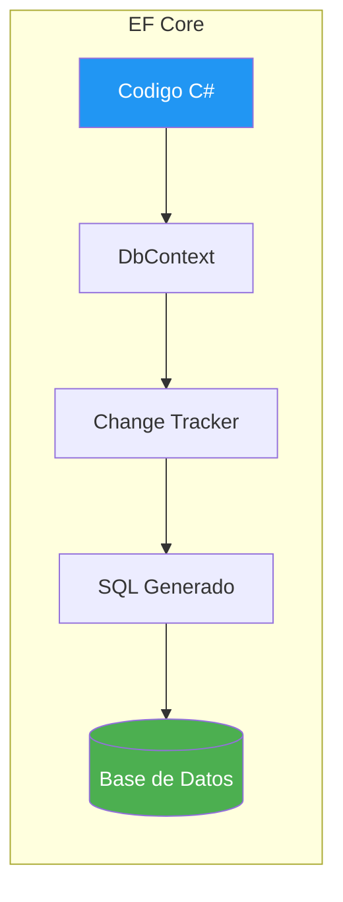

- [12. Entity Framework Core](#12-entity-framework-core)
  - [12.1. Fundamentos](#121-fundamentos)
    - [12.1.1. ¿Qué es un ORM?](#1211-qué-es-un-orm)
    - [12.1.2. DbContext](#1212-dbcontext)
    - [12.1.3. Componentes del DbContext](#1213-componentes-del-dbcontext)
    - [12.1.4. Ventajas de EF Core](#1214-ventajas-de-ef-core)
    - [12.1.5. Change Tracker](#1215-change-tracker)
  - [12.2. Configuración Inicial](#122-configuración-inicial)
    - [12.2.1. Paquetes NuGet](#1221-paquetes-nuget)
    - [12.2.2. Conexión](#1222-conexión)
    - [12.2.3. Registro del DbContext](#1223-registro-del-dbcontext)
    - [12.2.4. EnsureCreated vs Migrate](#1224-ensurecreated-vs-migrate)
  - [12.3. Data Annotations](#123-data-annotations)
    - [12.3.1. Atributos de columna](#1231-atributos-de-columna)
    - [12.3.2. Atributos de clave](#1232-atributos-de-clave)
    - [12.3.3. Atributos de tabla](#1233-atributos-de-tabla)
    - [12.3.4. Atributos de concurrencia](#1234-atributos-de-concurrencia)
    - [12.3.5. Atributos de generación](#1235-atributos-de-generación)
    - [12.3.6. Tabla resumen](#1236-tabla-resumen)
  - [12.4. Fluent API](#124-fluent-api)
    - [12.4.1. Propiedades](#1241-propiedades)
    - [12.4.2. Claves](#1242-claves)
    - [12.4.3. Tablas y vistas](#1243-tablas-y-vistas)
    - [12.4.4. Relaciones](#1244-relaciones)
    - [12.4.5. IEntityTypeConfiguration](#1245-ientitytypeconfiguration)
    - [12.4.6. Data Annotations vs Fluent API](#1246-data-annotations-vs-fluent-api)
  - [12.5. Relaciones](#125-relaciones)
    - [12.5.1. Uno a Uno](#1251-uno-a-uno)
    - [12.5.2. Uno a Muchos](#1252-uno-a-muchos)
    - [12.5.3. Muchos a Muchos](#1253-muchos-a-muchos)
    - [12.5.4. Navegabilidad](#1254-navegabilidad)
    - [12.5.5. Cascada (DeleteBehavior)](#1255-cascada-deletebehavior)
  - [12.6. Owned Types](#126-owned-types)
  - [12.7. Value Converters](#127-value-converters)
  - [12.8. Shadow Properties](#128-shadow-properties)
  - [12.9. NotMapped y Propiedades Calculadas](#129-notmapped-y-propiedades-calculadas)
  - [12.10. Carga de Datos](#1210-carga-de-datos)
    - [12.10.1. Eager Loading](#12101-eager-loading)
    - [12.10.2. Lazy Loading](#12102-lazy-loading)
    - [12.10.3. Explicit Loading](#12103-explicit-loading)
    - [12.10.4. AsSplitQuery](#12104-assplitquery)
  - [12.11. Consultas con LINQ](#1211-consultas-con-linq)
    - [12.11.1. Básicas](#12111-básicas)
    - [12.11.2. Elemento único](#12112-elemento-único)
    - [12.11.3. Condicionales](#12113-condicionales)
    - [12.11.4. Joins explícitos](#12114-joins-explícitos)
    - [12.11.5. GroupBy y agregación](#12115-groupby-y-agregación)
    - [12.11.6. Subconsultas](#12116-subconsultas)
    - [12.11.7. ToQueryString](#12117-toquerystring)
    - [12.11.8. AsNoTracking](#12118-asnotracking)
    - [12.11.9. SQL nativo](#12119-sql-nativo)
  - [12.12. ExecuteUpdate y ExecuteDelete](#1212-executeupdate-y-executedelete)
  - [12.13. Repositorio CRUD](#1213-repositorio-crud)
    - [12.13.1. Entidad y configuración](#12131-entidad-y-configuración)
    - [12.13.2. Interfaz del repositorio](#12132-interfaz-del-repositorio)
    - [12.13.3. Create, GetById, GetAll, Update](#12133-create-getbyid-getall-update)
    - [12.13.4. Borrado físico](#12134-borrado-físico)
    - [12.13.5. Borrado lógico](#12135-borrado-lógico)
    - [12.13.6. Consultas típicas](#12136-consultas-típicas)
  - [12.14. Migraciones](#1214-migraciones)
  - [12.15. Seed Data](#1215-seed-data)
  - [12.16. Logging](#1216-logging)
  - [12.17. Control de Concurrencia](#1217-control-de-concurrencia)
  - [12.18. Testing con EF Core](#1218-testing-con-ef-core)
    - [12.18.1. InMemory Database](#12181-inmemory-database)
    - [12.18.2. TestContainers](#12182-testcontainers)
    - [12.18.3. Buenas prácticas con TestContainers](#12183-buenas-prácticas-con-testcontainers)
    - [12.18.4. Patrón AAA](#12184-patrón-aaa)
  - [12.19. Buenas Prácticas](#1219-buenas-prácticas)
  - [12.20. Reto](#1220-reto)


# 12. Entity Framework Core

> 💡 **Punto de partida:** Cuando creas una tienda online, necesitas guardar productos, categorías y pedidos. ¿Los guardas en ficheros JSON? ¿En una base de datos SQL? Entity Framework Core es el ORM que hace que trabajar con bases de datos sea tan fácil como trabajar con objetos C#. Hablas en C# y él traduce a SQL por ti.

En este punto aprenderás qué es un ORM, cómo configurar EF Core, Data Annotations, Fluent API, relaciones, migraciones y testing.

**Objetivos de aprendizaje:**
- Entender qué es un ORM y por qué se usa EF Core
- Configurar un DbContext con PostgreSQL
- Usar Data Annotations y Fluent API para configurar el modelo
- Crear relaciones entre entidades
- Gestionar migraciones
- Testear con TestContainers

## 12.1. Fundamentos

### 12.1.1. ¿Qué es un ORM?

Un **ORM** (Object-Relational Mapping) es una técnica que mapea objetos C# a tablas de base de datos. En vez de escribir SQL a mano, trabajas con clases y el ORM traduce automáticamente. Piensa en él como un **traductor automático** entre tu código y la BD.

📌 Ejemplo real: **Netflix** usa EF Core en sus microservicios internos para gestionar catálogos de contenido. Los desarrolladores trabajan con objetos C# y EF Core se encarga de generar las consultas SQL optimizadas.

**Sin ORM** (SQL puro):

```csharp
// Sin ORM: debes escribir SQL, mapear resultados manualmente
var command = new SqlCommand("SELECT Id, Nombre, Precio FROM Productos WHERE Precio > @precio", connection);
command.Parameters.AddWithValue("@precio", 30);
var reader = command.ExecuteReader();
while (reader.Read())
{
    var producto = new Producto
    {
        Id = reader.GetInt32(0),
        Nombre = reader.GetString(1),
        Precio = reader.GetDecimal(2)
    };
}
```

**Con ORM** (EF Core):

```csharp
// Con ORM: trabajas con objetos, EF Core genera el SQL
var productos = await context.Productos
    .Where(p => p.Precio > 30)
    .ToListAsync();
```



### 12.1.2. DbContext

El **DbContext** es la clase central de EF Core. Representa una sesión con la base de datos y permite consultar, guardar y manipular datos.

```csharp
using Microsoft.EntityFrameworkCore;

public class AppDbContext : DbContext
{
    public DbSet<Producto> Productos => Set<Producto>();
    public DbSet<Categoria> Categorias => Set<Categoria>();

    protected override void OnModelCreating(ModelBuilder modelBuilder)
    {
        // Configuración del modelo
    }
}
```

📌 Ejemplo real: **Amazon** usa un patrón similar. Cada microservicio tiene su propio DbContext que representa exactamente los datos que necesita consultar.

### 12.1.3. Componentes del DbContext

| Componente | Función | Ejemplo |
|------------|---------|---------|
| **DbSet<T>** | Colección de entidades | `DbSet<Producto>` |
| **OnModelCreating** | Configuración del modelo | Fluent API, seeds |
| **SaveChanges** | Guardar cambios en BD | Insert/Update/Delete |
| **ChangeTracker** | Rastrear cambios | Detectar modificaciones |

### 12.1.4. Ventajas de EF Core

| Ventaja | Descripción |
|---------|-------------|
| **Productividad** | Menos código, más abstracción |
| **LINQ** | Consultas tipadas en C# |
| **Migraciones** | Cambios de esquema controlados |
| **Change Tracking** | Detecta automáticamente qué cambió |
| **Provider** | PostgreSQL, SQL Server, SQLite, MongoDB... |

### 12.1.5. Change Tracker

El **Change Tracker** monitoriza todas las entidades cargadas en el contexto. Cuando llamas a `SaveChanges()`, EF Core compara el estado actual con el original y genera las sentencias SQL correspondientes.

```csharp
// EF Core detecta automáticamente el cambio
var producto = await context.Productos.FindAsync(1);
producto.Precio = 99.99m; // Change Tracker detecta la modificación
await context.SaveChangesAsync(); // Genera: UPDATE Productos SET Precio = 99.99 WHERE Id = 1
```

❌ **MALO**: Cargar entidades que no necesitas para que el Change Tracker las rastree:

```csharp
var todos = await context.Productos.ToListAsync(); // Carga TODO
var producto = todos.First(p => p.Id == 1); // Solo necesitas uno
```

✅ **BUENO**: Usar `AsNoTracking()` para consultas de solo lectura:

```csharp
var producto = await context.Productos.AsNoTracking().FirstAsync(p => p.Id == 1);
```

## 12.2. Configuración Inicial

### 12.2.1. Paquetes NuGet

```bash
dotnet add package Microsoft.EntityFrameworkCore
dotnet add package Npgsql.EntityFrameworkCore.PostgreSQL
dotnet add package Microsoft.EntityFrameworkCore.Design
```

📌 Ejemplo real: **Spotify** usa EF Core con PostgreSQL para gestionar millones de canciones y playlists. Los paquetes NuGet les permiten mantener el código limpio y actualizado.

### 12.2.2. Conexión

```json
// appsettings.json
{
  "ConnectionStrings": {
    "DefaultConnection": "Host=localhost;Port=5432;Database=productos;Username=postgres;Password=postgres"
  }
}
```

```csharp
// Program.cs
builder.Services.AddDbContext<AppDbContext>(options =>
    options.UseNpgsql(builder.Configuration.GetConnectionString("DefaultConnection")));
```

### 12.2.3. Registro del DbContext

```csharp
// Opción 1: AddDbContext (Scoped)
builder.Services.AddDbContext<AppDbContext>();

// Opción 2: AddDbContextFactory (para DataLoaders)
builder.Services.AddDbContextFactory<AppDbContext>(ServiceLifetime.Scoped);
```

### 12.2.4. EnsureCreated vs Migrate

| Método | Uso | Cuándo usar |
|--------|-----|-------------|
| `EnsureCreated()` | Crea BD si no existe, sin migraciones | Desarrollo, tests |
| `Migrate()` | Aplica migraciones pendientes | Producción |

❌ **MALO**: Usar `EnsureCreated()` en producción:

```csharp
await context.Database.EnsureCreated(); // No aplica migraciones, solo crea si no existe
```

✅ **BUENO**: Usar `Migrate()` en producción:

```csharp
await context.Database.MigrateAsync(); // Aplica todas las migraciones pendientes
```

## 12.3. Data Annotations

Las **Data Annotations** son atributos C# que configuran el modelo directamente en las entidades.

### 12.3.1. Atributos de columna

```csharp
[Column("precio_producto")]
[Required]
[StringLength(100)]
public decimal Precio { get; set; }
```

### 12.3.2. Atributos de clave

```csharp
[Key]
[DatabaseGenerated(DatabaseGeneratedOption.Identity)]
public long Id { get; set; }
```

### 12.3.3. Atributos de tabla

```csharp
[Table("tbl_productos")]
public class Producto { ... }
```

### 12.3.4. Atributos de concurrencia

```csharp
[Timestamp]
public byte[] RowVersion { get; set; }
```

### 12.3.5. Atributos de generación

```csharp
[DatabaseGenerated(DatabaseGeneratedOption.Identity)] // Auto-increment
[DatabaseGenerated(DatabaseGeneratedOption.Computed)] // Calculado por BD
[DatabaseGenerated(DatabaseGeneratedOption.None)] // Sin generación
```

### 12.3.6. Tabla resumen

| Atributo | Uso | Ejemplo |
|----------|-----|---------|
| `[Key]` | Clave primaria | `public long Id { get; set; }` |
| `[Required]` | Campo obligatorio | `[Required] public string Nombre { get; set; }` |
| `[StringLength(100)]` | Longitud máxima | `[StringLength(100)]` |
| `[Column("nombre")]` | Nombre de columna | `[Column("producto_nombre")]` |
| `[Table("tbl_prod")]` | Nombre de tabla | `[Table("tbl_productos")]` |
| `[Timestamp]` | Concurrencia optimista | `public byte[] RowVersion { get; set; }` |
| `[NotMapped]` | No mapear a BD | `[NotMapped] public string Temporal { get; set; }` |
| `[ForeignKey("CategoriaId")]` | Clave foránea | `[ForeignKey("Categoria")]` |

## 12.4. Fluent API

La **Fluent API** permite configurar el modelo mediante código en `OnModelCreating`. Es más potente que Data Annotations.

### 12.4.1. Propiedades

```csharp
protected override void OnModelCreating(ModelBuilder modelBuilder)
{
    modelBuilder.Entity<Producto>(entity =>
    {
        entity.Property(p => p.Nombre).HasMaxLength(100).IsRequired();
        entity.Property(p => p.Precio).HasPrecision(18, 2);
    });
}
```

### 12.4.2. Claves

```csharp
entity.HasKey(p => p.Id);
entity.HasAlternateKey(p => p.Codigo); // Clave alternativa
```

### 12.4.3. Tablas y vistas

```csharp
entity.ToTable("tbl_productos");
entity.HasNoKey(); // Para vistas
entity.ToView("vw_productos_resumen");
```

### 12.4.4. Relaciones

```csharp
entity.HasOne(p => p.Categoria)
      .WithMany(c => c.Productos)
      .HasForeignKey(p => p.CategoriaId)
      .OnDelete(DeleteBehavior.Restrict);
```

### 12.4.5. IEntityTypeConfiguration

```csharp
public class ProductoConfiguration : IEntityTypeConfiguration<Producto>
{
    public void Configure(EntityTypeBuilder<Producto> builder)
    {
        builder.HasKey(p => p.Id);
        builder.Property(p => p.Nombre).HasMaxLength(100);
        builder.HasOne(p => p.Categoria).WithMany(c => c.Productos);
    }
}

// En OnModelCreating:
modelBuilder.ApplyConfigurationsFromAssembly(typeof(AppDbContext).Assembly);
```

### 12.4.6. Data Annotations vs Fluent API

| Criterio | Data Annotations | Fluent API |
|----------|-----------------|------------|
| **Sintaxis** | Atributos en la entidad | Código en OnModelCreating |
| **Potencia** | Limitada | Completa |
| **Separación** | Mezclado con la entidad | Separado en configuración |
| **Recomendación** | Para lo simple | Para lo complejo |

## 12.5. Relaciones

### 12.5.1. Uno a Uno

```csharp
public class UsuarioPerfil
{
    public long Id { get; set; }
    public long UsuarioId { get; set; }
    public Usuario Usuario { get; set; } = null!;
    public string Biografia { get; set; } = string.Empty;
}
```

### 12.5.2. Uno a Muchos

```csharp
public class Categoria
{
    public long Id { get; set; }
    public string Nombre { get; set; } = string.Empty;
    public ICollection<Producto> Productos { get; set; } = [];
}

public class Producto
{
    public long Id { get; set; }
    public string Nombre { get; set; } = string.Empty;
    public long CategoriaId { get; set; }
    public Categoria Categoria { get; set; } = null!;
}
```

### 12.5.3. Muchos a Muchos

```csharp
// Con tabla intermedia explícita
public class ProductoEtiqueta
{
    public long ProductoId { get; set; }
    public Producto Producto { get; set; } = null!;
    public long EtiquetaId { get; set; }
    public Etiqueta Etiqueta { get; set; } = null!;
}
```

### 12.5.4. Navegabilidad

```csharp
// Hacia adelante (Producto → Categoria)
public Categoria Categoria { get; set; } = null!;

// Hacia atrás (Categoria → Productos)
public ICollection<Producto> Productos { get; set; } = [];
```

### 12.5.5. Cascada (DeleteBehavior)

| Comportamiento | Descripción |
|----------------|-------------|
| `Cascade` | Elimina registros dependientes |
| `Restrict` | Impide eliminar si hay dependientes |
| `SetNull` | Pone la FK a null |
| `NoAction` | No hace nada |

❌ **MALO**: Usar Cascade sin pensar:

```csharp
.OnDelete(DeleteBehavior.Cascade); // Si borras una categoría, se borran TODOS sus productos
```

✅ **BUENO**: Usar Restrict para datos importantes:

```csharp
.OnDelete(DeleteBehavior.Restrict); // No permite borrar categoría si tiene productos
```

## 12.6. Owned Types

Los **Owned Types** permiten embeber un tipo dentro de otro (como documentos embebidos en MongoDB).

```csharp
[Owned]
public class Direccion
{
    public string Calle { get; set; } = string.Empty;
    public string Ciudad { get; set; } = string.Empty;
}

public class Cliente
{
    public long Id { get; set; }
    public string Nombre { get; set; } = string.Empty;
    public Direccion Direccion { get; set; } = null!; // Embebida
}
```

📌 Ejemplo real: **Netflix** usa un patrón similar para almacenar preferencias de usuario. Cada usuario tiene un objeto `Preferencias` embebido dentro de su documento, no como una tabla separada.

## 12.7. Value Converters

Los **Value Converters** transforman tipos de datos entre C# y la base de datos.

```csharp
modelBuilder.Entity<Producto>()
    .Property(p => p.Estado)
    .HasConversion<string>(); // Enum → string en la BD
```

## 12.8. Shadow Properties

Las **Shadow Properties** son propiedades que existen solo en el modelo de EF Core, no en la entidad C#.

```csharp
// Configurar shadow property
modelBuilder.Entity<Producto>()
    .Property<DateTime>("CreatedAt");

// Acceder a shadow property
var fecha = context.Entry(producto).Property("CreatedAt").CurrentValue;
```

## 12.9. NotMapped y Propiedades Calculadas

```csharp
public class Producto
{
    public long Id { get; set; }
    public string Nombre { get; set; } = string.Empty;
    public decimal Precio { get; set; }
    public int Stock { get; set; }

    [NotMapped]
    public string PrecioFormateado => $"{Precio:C}";

    public decimal ValorTotal => Precio * Stock; // Propiedad calculada
}
```

## 12.10. Carga de Datos

### 12.10.1. Eager Loading

```csharp
// Include: carga la relación junto con la entidad principal
var productos = await context.Productos
    .Include(p => p.Categoria)
    .ToListAsync();

// ThenInclude: carga relaciones anidadas
var productos = await context.Productos
    .Include(p => p.Categoria)
        .ThenInclude(c => c.Subcategorias)
    .ToListAsync();
```

### 12.10.2. Lazy Loading

```csharp
// La relación se carga automáticamente al acceder
var producto = await context.Productos.FindAsync(1);
var categoria = producto.Categoria; // Se carga automáticamente (SELECT adicional)
```

❌ **MALO**: Usar Lazy Loading sin quererlo:

```csharp
foreach (var producto in productos)
{
    var categoria = producto.Categoria; // N+1 queries!
}
```

### 12.10.3. Explicit Loading

```csharp
await context.Entry(producto)
    .Reference(p => p.Categoria)
    .LoadAsync();
```

### 12.10.4. AsSplitQuery

```csharp
// Divide las consultas en vez de un JOIN gigante
var productos = await context.Productos
    .Include(p => p.Categoria)
    .AsSplitQuery()
    .ToListAsync();
```

## 12.11. Consultas con LINQ

### 12.11.1. Básicas

```csharp
var productos = await context.Productos
    .Where(p => p.Precio > 50)
    .OrderBy(p => p.Nombre)
    .ToListAsync();
```

### 12.11.2. Elemento único

```csharp
var producto = await context.Productos.FirstAsync(p => p.Id == 1);
var producto = await context.Productos.FirstOrDefaultAsync(p => p.Nombre == "Teclado");
var producto = await context.Productos.SingleAsync(p => p.Id == 1);
```

### 12.11.3. Condicionales

```csharp
var productos = await context.Productos
    .Where(p => p.Nombre.Contains("Teclado") || p.Precio < 50)
    .ToListAsync();
```

### 12.11.4. Joins explícitos

```csharp
var resultado = await context.Productos
    .Join(context.Categorias,
        p => p.CategoriaId,
        c => c.Id,
        (p, c) => new { Producto = p, Categoria = c })
    .ToListAsync();
```

### 12.11.5. GroupBy y agregación

```csharp
var porCategoria = await context.Productos
    .GroupBy(p => p.CategoriaId)
    .Select(g => new { CategoriaId = g.Key, Count = g.Count(), Total = g.Sum(p => p.Precio) })
    .ToListAsync();
```

### 12.11.6. Subconsultas

```csharp
var productos = await context.Productos
    .Where(p => context.Categorias
        .Where(c => c.Nombre.Contains("Electrónica"))
        .Select(c => c.Id)
        .Contains(p.CategoriaId))
    .ToListAsync();
```

### 12.11.7. ToQueryString

```csharp
var sql = context.Productos
    .Where(p => p.Precio > 50)
    .ToQueryString(); // Muestra el SQL generado
```

### 12.11.8. AsNoTracking

```csharp
// Para consultas de solo lectura: mejor rendimiento
var productos = await context.Productos
    .AsNoTracking()
    .ToListAsync();
```

📌 Ejemplo real: **GitHub** usa consultas optimizadas en su base de datos de millones de repositorios. `AsNoTracking()` reduce el uso de memoria un 30-40% en consultas de solo lectura.

### 12.11.9. SQL nativo

```csharp
var productos = await context.Productos
    .FromSqlRaw("SELECT * FROM Productos WHERE Precio > {0}", 50)
    .ToListAsync();
```

## 12.12. ExecuteUpdate y ExecuteDelete

```csharp
// ExecuteUpdate: actualiza sin cargar entidades
await context.Productos
    .Where(p => p.Precio < 10)
    .ExecuteUpdateAsync(s => s.SetProperty(p => p.Precio, p => p.Precio * 1.1m));

// ExecuteDelete: elimina sin cargar entidades
await context.Productos
    .Where(p => p.IsDeleted)
    .ExecuteDeleteAsync();
```

📌 Ejemplo real: **Amazon** usa operaciones batch para actualizar precios de miles de productos de golpe. `ExecuteUpdate` es mucho más rápido que cargar-modificar-guardar.

## 12.13. Repositorio CRUD

### 12.13.1. Entidad y configuración

```csharp
public class Producto
{
    [Key]
    public long Id { get; set; }

    [Required]
    [StringLength(100)]
    public string Nombre { get; set; } = string.Empty;

    [Required]
    public decimal Precio { get; set; }

    public long CategoriaId { get; set; }
    public Categoria Categoria { get; set; } = null!;

    public bool IsDeleted { get; set; }
    public DateTime CreatedAt { get; set; }
    public DateTime? UpdatedAt { get; set; }
}
```

### 12.13.2. Interfaz del repositorio

```csharp
public interface IProductoRepository
{
    IEnumerable<Producto> GetAll();
    IEnumerable<Producto> GetDeleted();
    Producto? GetById(long id);
    Producto Add(Producto producto);
    Producto? Update(Producto producto);
    bool Delete(long id);
    bool Restore(long id);
    bool IsDuplicated(string nombre, long excludeId = 0);
}
```

### 12.13.3. Create, GetById, GetAll, Update

```csharp
public class ProductoRepository(AppDbContext db) : IProductoRepository
{
    public IEnumerable<Producto> GetAll() =>
        db.Productos.AsNoTracking().Include(p => p.Categoria).ToList();

    public Producto? GetById(long id) =>
        db.Productos.AsNoTracking().Include(p => p.Categoria)
            .FirstOrDefault(p => p.Id == id);

    public Producto Add(Producto producto)
    {
        producto.CreatedAt = DateTime.UtcNow;
        db.Productos.Add(producto);
        db.SaveChanges();
        return producto;
    }

    public Producto? Update(Producto producto)
    {
        var existente = db.Productos.Find(producto.Id);
        if (existente is null) return null;

        existente.Nombre = producto.Nombre;
        existente.Precio = producto.Precio;
        existente.Imagen = producto.Imagen;
        existente.CategoriaId = producto.CategoriaId;
        existente.UpdatedAt = DateTime.UtcNow;

        db.SaveChanges();
        return existente;
    }
}
```

### 12.13.4. Borrado físico

```csharp
public bool Delete(long id)
{
    var producto = db.Productos.Find(id);
    if (producto is null) return false;

    db.Productos.Remove(producto);
    db.SaveChanges();
    return true;
}
```

### 12.13.5. Borrado lógico

```csharp
public bool Delete(long id)
{
    var producto = db.Productos.Find(id);
    if (producto is null) return false;

    producto.IsDeleted = true;
    db.SaveChanges();
    return true;
}

// Query Filter automático
protected override void OnModelCreating(ModelBuilder modelBuilder)
{
    modelBuilder.Entity<Producto>().HasQueryFilter(p => !p.IsDeleted);
}
```

### 12.13.6. Consultas típicas

```csharp
// Paginado
var (items, total) = db.Productos
    .Skip((page - 1) * pageSize)
    .Take(pageSize)
    .ToList();

// Busqueda
var resultados = db.Productos
    .Where(p => p.Nombre.Contains(termino))
    .ToList();

// Conteo
var total = db.Productos.CountAsync();
```

## 12.14. Migraciones

```bash
# Crear migración
dotnet ef migrations add AddProductoTable

# Aplicar migraciones
dotnet ef database update

# Rollback
dotnet ef database update PreviousMigration

# Eliminar última migración
dotnet ef migrations remove

# Generar script SQL
dotnet ef migrations script
```

📌 Ejemplo real: **Netflix** usa migraciones para gestionar cambios de esquema en sus microservicios. Cada cambio de BD es una migración versionada que se aplica automáticamente en despliegue.

## 12.15. Seed Data

```csharp
// En OnModelCreating
modelBuilder.Entity<Categoria>().HasData(
    new Categoria { Id = 1, Nombre = "Electrónica" },
    new Categoria { Id = 2, Nombre = "Mobiliario" }
);

modelBuilder.Entity<Producto>().HasData(
    new Producto { Id = 1, Nombre = "Teclado", Precio = 89.99m, CategoriaId = 1 }
);
```

## 12.16. Logging

```csharp
// Configurar logging de consultas SQL
options.UseNpgsql(connectionString)
    .LogTo(Console.WriteLine, LogLevel.Information)
    .EnableSensitiveDataLogging(); // Solo en desarrollo
```

## 12.17. Control de Concurrencia

```csharp
// Optimista: RowVersion
[Timestamp]
public byte[] RowVersion { get; set; }

// Manejar conflicto
try
{
    await context.SaveChangesAsync();
}
catch (DbUpdateConcurrencyException)
{
    // Otro usuario modificó los datos
}
```

## 12.18. Testing con EF Core

### 12.18.1. InMemory Database

```csharp
var options = new DbContextOptionsBuilder<AppDbContext>()
    .UseInMemoryDatabase("TestDb")
    .Options;

var context = new AppDbContext(options);
```

### 12.18.2. TestContainers

```csharp
private readonly PostgreSqlContainer _postgres = new PostgreSqlBuilder()
    .WithImage("postgres:16-alpine")
    .Build();

[OneTimeSetUp]
public async Task ClassSetUp()
{
    await _postgres.StartAsync();
}

[SetUp]
public async Task SetUp()
{
    var options = new DbContextOptionsBuilder<AppDbContext>()
        .UseNpgsql(_postgres.GetConnectionString())
        .Options;

    Db = new AppDbContext(options);
    await Db.Database.EnsureCreatedAsync();
}
```

### 12.18.3. Buenas prácticas con TestContainers

> ⚠️ **Advertencia — Cada test debe ser aislado**

1. **Container instance, nunca `static`** — cada fixture su propio contenedor
2. **`[OneTimeTearDown]`** — dispose una sola vez al final
3. **`TRUNCATE ... RESTART IDENTITY CASCADE`** — limpiar antes de cada test

### 12.18.4. Patrón AAA

```csharp
[Test]
public void Create_ProductoValido_RetornaProductoConId()
{
    // Arrange
    var producto = new Producto { Nombre = "Teclado", Precio = 89.99m, CategoriaId = 1 };

    // Act
    Db.Productos.Add(producto);
    await Db.SaveChangesAsync();

    // Assert
    producto.Id.Should().BeGreaterThan(0);
}
```

## 12.19. Buenas Prácticas

- **Usa Fluent API** sobre Data Annotations para configuración avanzada
- **Separa configuraciones** con `IEntityTypeConfiguration<T>`
- **Usa `AsNoTracking()`** en consultas de solo lectura
- **Prefiere `ExecuteUpdate/ExecuteDelete`** sobre cargar-modificar-guardar
- **ApplyQueryFilters** para borrado lógico
- **Índices en columnas de filtro** frecuentes
- **TestContainers** para tests de integración con BD real

## 12.20. Reto

> Implementa un repositorio CRUD completo para FunkoApp con Entity Framework Core.

**Añade a tu API:**

1. **Modelo Funko:** `Id`, `Nombre`, `Precio`, `Stock`, `CategoriaId`, `IsDeleted`, `CreatedAt`, `UpdatedAt`
2. **Modelo Categoria:** `Id`, `Nombre`, `Descripcion`
3. **Relación Uno a Muchos** entre Categoria y Funkos
4. **Repositorio** con Create, Read (GetAll, GetById), Update, Delete (borrado lógico), Restore
5. **Query Filters** para borrado lógico
6. **Migraciones** aplicadas automáticamente en desarrollo
7. **Seed Data** con 5 Funkos y 3 Categorías
8. **Tests** con TestContainers: Create, GetById, GetAll, Delete lógico, IsDuplicated

**Puntos extra:**

- Value Converters para enumeraciones
- Concurrencia optimista con RowVersion
- ExecuteUpdate para actualizar precios en lote

---

**Resumen del punto:**

| Concepto | Descripción |
|----------|-------------|
| **ORM** | Mapeo objeto-relacional que traduce C# a SQL |
| **DbContext** | Sesión con la base de datos |
| **DbSet<T>** | Colección de entidades |
| **Data Annotations** | Atributos para configurar el modelo |
| **Fluent API** | Configuración potente en OnModelCreating |
| **Relaciones** | Uno a Uno, Uno a Muchos, Muchos a Muchos |
| **Owned Types** | Tipos embebidos dentro de otros |
| **Eager Loading** | Carga relaciones con Include/ThenInclude |
| **AsNoTracking** | Mejor rendimiento en solo lectura |
| **Migraciones** | Cambios de esquema controlados |
| **Query Filters** | Filtros automáticos (borrado lógico) |
| **TestContainers** | Tests con BD real en Docker |
| **ExecuteUpdate/Delete** | Operaciones batch sin cargar entidades |

**¿Qué viene después?**

En el siguiente punto veremos **MongoDB**: una base de datos NoSQL orientada a documentos que no usa tablas ni SQL. Verás cómo trabajar con colecciones de documentos JSON y cómo muchos conceptos de EF Core (repositorios, mapeo, configuración) tienen su equivalente en el mundo NoSQL con el **MongoDB.Driver** o el uso de **EF Core para MongoDB**.
