# 14. Caché y Redis

## Tabla de Contenidos

- [14. Caché y Redis](#14-caché-y-redis)
  - [14.1. Fundamentos de Caché](#141-fundamentos-de-caché)
    - [14.1.1. Qué es un Caché](#1411-qué-es-un-caché)
    - [14.1.2. Por qué usar Caché](#1412-por-qué-usar-caché)
    - [14.1.3. Arquitectura con Caché](#1413-arquitectura-con-caché)
  - [14.2. Tipos de Caché](#142-tipos-de-caché)
    - [14.2.1. Caché en Memoria (Local)](#1421-caché-en-memoria-local)
    - [14.2.2. Caché Distribuido](#1422-caché-distribuido)
    - [14.2.3. Comparativa MemoryCache vs IDistributedCache](#1423-comparativa-memorycache-vs-idistributedcache)
    - [14.2.4. Cuándo usar cada uno](#1424-cuándo-usar-cada-uno)
  - [14.3. Algoritmos de Caché](#143-algoritmos-de-caché)
    - [14.3.1. LRU - Least Recently Used](#1431-lru---least-recently-used)
    - [14.3.2. LFU - Least Frequently Used](#1432-lfu---least-frequently-used)
    - [14.3.3. FIFO - First In First Out](#1433-fifo---first-in-first-out)
    - [14.3.4. TTL - Time To Live](#1434-ttl---time-to-live)
    - [14.3.5. Comparativa de Algoritmos](#1435-comparativa-de-algoritmos)
  - [14.4. Estrategias de Acceso a Caché](#144-estrategias-de-acceso-a-caché)
    - [14.4.1. Cache-Aside (Lazy Loading)](#1441-cache-aside-lazy-loading)
    - [14.4.2. Write-Through](#1442-write-through)
    - [14.4.3. Write-Behind (Write-Back)](#1443-write-behind-write-back)
    - [14.4.4. Refresh-Ahead](#1444-refresh-ahead)
    - [14.4.5. Cuál elegir](#1445-cuál-elegir)
  - [14.5. Memcached](#145-memcached)
    - [14.5.1. Qué es Memcached](#1451-qué-es-memcached)
    - [14.5.2. Memcached vs Redis](#1452-memcached-vs-redis)
  - [14.6. Redis: Fundamentos](#146-redis-fundamentos)
    - [14.6.1. Qué es Redis](#1461-qué-es-redis)
    - [14.6.2. Estructuras de Datos](#1462-estructuras-de-datos)
    - [14.6.3. Persistencia](#1463-persistencia)
    - [14.6.4. Configuración con Docker](#1464-configuración-con-docker)
  - [14.7. Caché en ASP.NET Core](#147-caché-en-aspnet-core)
    - [14.7.1. Paquetes NuGet](#1471-paquetes-nuget)
    - [14.7.2. Interfaz ICacheService](#1472-interfaz-icacheservice)
    - [14.7.3. MemoryCacheService](#1473-memorycacheservice)
    - [14.7.4. RedisCacheService](#1474-rediscacheservice)
    - [14.7.5. Configuración en DI](#1475-configuración-en-di)
  - [14.8. Qué y qué no cachear](#148-qué-y-qué-no-cachear)
  - [14.9. Invalidación de Caché](#149-invalidación-de-caché)
    - [14.9.1. Invalidación por TTL](#1491-invalidación-por-ttl)
    - [14.9.2. Invalidación por Operación CRUD](#1492-invalidación-por-operación-crud)
    - [14.9.3. Invalidación en Cascada](#1493-invalidación-en-cascada)
    - [14.9.4. Regla de Oro](#1494-regla-de-oro)
  - [14.10. CRUD con Caché: Diagrama Completo](#1410-crud-con-caché-diagrama-completo)
  - [14.11. Decorator Pattern para Caché](#1411-decorator-pattern-para-caché)
  - [14.12. Testing con Caché](#1412-testing-con-caché)
    - [14.12.1. Unit Testing con Mocks](#14121-unit-testing-con-mocks)
    - [14.12.2. Integration Testing con TestContainers](#14122-integration-testing-con-testcontainers)
  - [14.13. Buenas Prácticas](#1413-buenas-prácticas)
  - [14.14. Reto](#1414-reto)
  - [14.15. Resumen](#1415-resumen)

---

# 14. Caché y Redis

## 14.1. Fundamentos de Caché

> 💡 **Punto de partida:** Si tuvieses que buscar un libro en una biblioteca de 100.000 volúmenes cada vez que alguien te preguntase algo, ¿no guardarías los libros más consultados en una estantería junto a tu escritorio? Eso es exactamente lo que hace un caché.

### 14.1.1. Qué es un Caché

Un **caché** es una capa de almacenamiento temporal de alta velocidad que guarda copias de datos frecuentemente accedidos. Su objetivo es reducir la latencia y la carga en sistemas más lentos (como bases de datos) almacenando temporalmente datos que son costosos de obtener pero que se accede con frecuencia.

📌 Ejemplo real: **Netflix** almacena en caché las portadas de películas y los primeros minutos de cada título en servidores CDN distribuidos por el mundo. Cuando abres Netflix, no descarga las imágenes desde un servidor central en California, las obtiene del CDN más cercano a tu ubicación.

### 14.1.2. Por qué usar Caché

El caché resuelve la **brecha de velocidad** entre la memoria (RAM) y el almacenamiento persistente (base de datos):

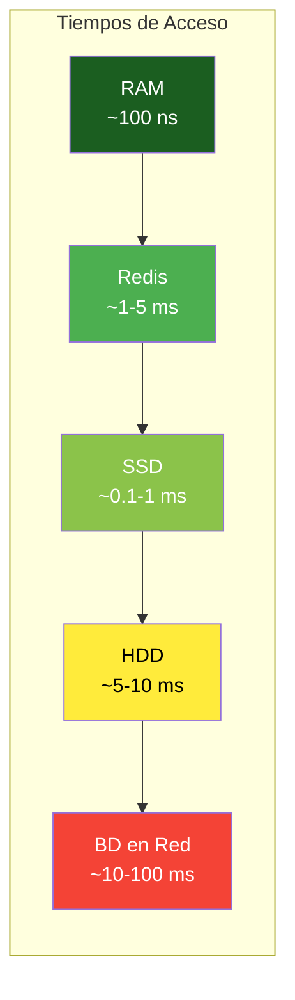

| Nivel | Tecnología | Latencia Típica | Throughput |
|-------|------------|-----------------|------------|
| **RAM** | Memoria RAM | ~100 ns | ~50 GB/s |
| **Redis** | Caché en memoria | ~1-5 ms | ~100K ops/s |
| **SSD** | Almacenamiento | ~0.1-1 ms | ~500 MB/s |
| **HDD** | Disco magnético | ~5-10 ms | ~100 MB/s |
| **BD** | Red a BD | ~10-100 ms | Limitado por red |

> 📝 **Nota:** Redis es tan rápido porque mantiene todos los datos en memoria RAM. A diferencia de una BD tradicional que puede necesitar múltiples lecturas de disco, Redis responde en microsegundos porque todo está ya en memoria.

📌 Ejemplo real: **Amazon** usa caché agresivamente. Cada producto que ves en amazon.com está cacheado. Cuando buscas "auriculares Bluetooth", los resultados vienen de caché, no de una consulta SQL en tiempo real. Solo cuando compras algo se actualiza la BD.

### 14.1.3. Arquitectura con Caché

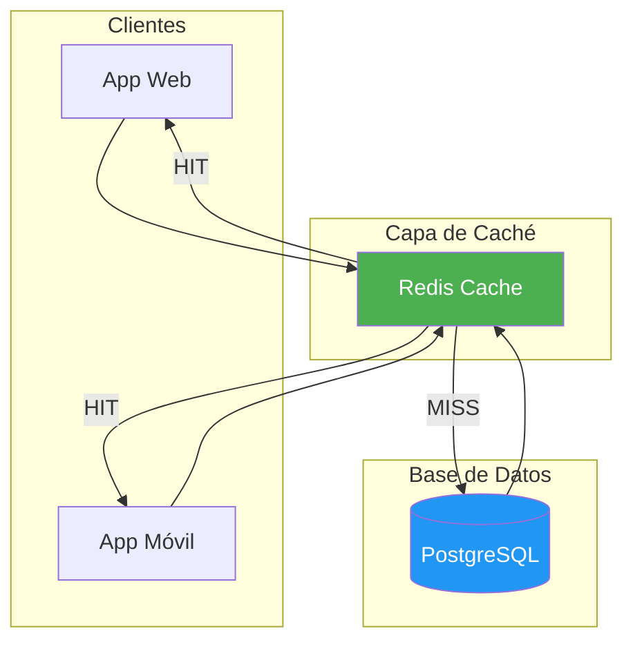

> 💡 **Consejo:** Piensa en el caché como los estantes del supermercado. Los productos más vendidos están al frente (caché). Solo cuando se agota el estante, bajan al almacén (base de datos).

---

## 14.2. Tipos de Caché

### 14.2.1. Caché en Memoria (Local)

El caché en memoria (local) almacena datos en la RAM del propio proceso de la aplicación. Es el tipo de caché más rápido porque no requiere comunicación de red.

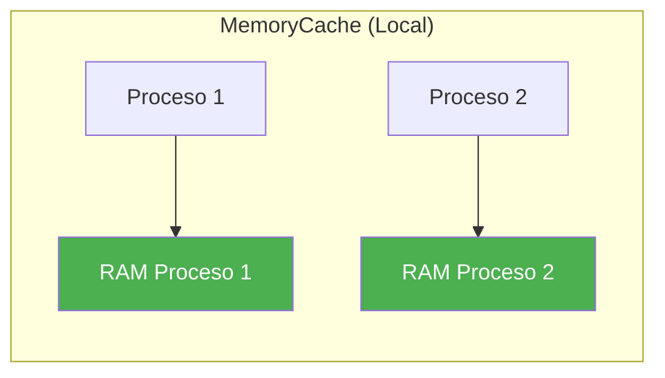

| Aspecto | Descripción |
|---------|-------------|
| **Velocidad** | Extremadamente rápido (mismo proceso) |
| **Latencia** | ~0.001 ms |
| **Compartición** | No compartido entre instancias |
| **Persistencia** | Se pierde al reiniciar |
| **Memoria** | Limitada al proceso |

### 14.2.2. Caché Distribuido

Un caché distribuido es un servicio independiente que múltiples instancias de aplicación pueden compartir. Redis es el ejemplo más popular.

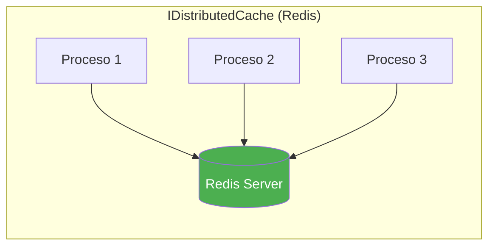

| Aspecto | Descripción |
|---------|-------------|
| **Velocidad** | Muy rápido (red local) |
| **Latencia** | ~1-5 ms |
| **Compartición** | Compartido entre todas las instancias |
| **Persistencia** | Configurable (RDB, AOF) |
| **Memoria** | Dedicada y escalable |

### 14.2.3. Comparativa MemoryCache vs IDistributedCache

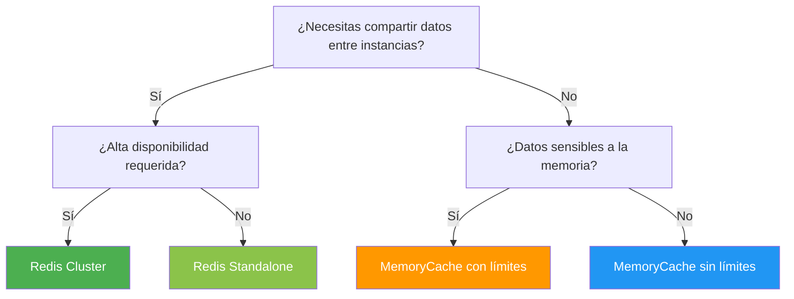

| Característica | MemoryCache (Local) | IDistributedCache (Redis) |
|----------------|---------------------|---------------------------|
| **Compartido entre procesos** | No | Sí |
| **Persistencia** | Se pierde al reiniciar | Opcional (RDB/AOF) |
| **Escalabilidad horizontal** | Limitado | Ilimitado |
| **Latencia** | ~0.001 ms | ~1-5 ms |
| **Overhead de red** | Ninguno | Requiere red |
| **Memoria disponible** | Limitada al proceso | Dedicada al servidor |
| **Alta disponibilidad** | No | Con Sentinel/Cluster |

### 14.2.4. Cuándo usar cada uno

| Escenario | Recomendación | Razón |
|-----------|---------------|-------|
| App de instancia única | MemoryCache | Más rápido, sin overhead de red |
| Multi-instancia (负载均衡) | Redis | Compartido entre todas las instancias |
| Datos críticos | Redis + Persistencia | No perder datos en reinicio |
| Sesiones de usuario | Redis | Persistente entre reinicios |
| Datos muy volátiles | MemoryCache | Invalidación rápida y local |
| Contadores/rate limiting | Redis | Operaciones atómicas |

> 💡 **Consejo:** Para la mayoría de aplicaciones web, usa **MemoryCache en desarrollo** (más rápido para debug) y **Redis en producción** (compartido, persistente). Es el patrón que usaremos en los ejemplos.

---

## 14.3. Algoritmos de Caché

### 14.3.1. LRU - Least Recently Used

**LRU** elimina primero los elementos que no han sido usados durante más tiempo. Es el algoritmo más común y funciona bien cuando los patrones de acceso tienen localidad temporal.

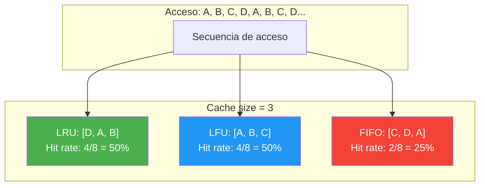

**Cómo funciona:**
1. Cada entrada tiene un timestamp de último acceso
2. Cuando el caché está lleno y entra un nuevo elemento
3. Se elimina el elemento con el timestamp más antiguo
4. Al acceder a un elemento, se actualiza su timestamp

### 14.3.2. LFU - Least Frequently Used

**LFU** elimina primero los elementos menos frecuentemente accedidos. Funciona mejor cuando la frecuencia de acceso es predecible.

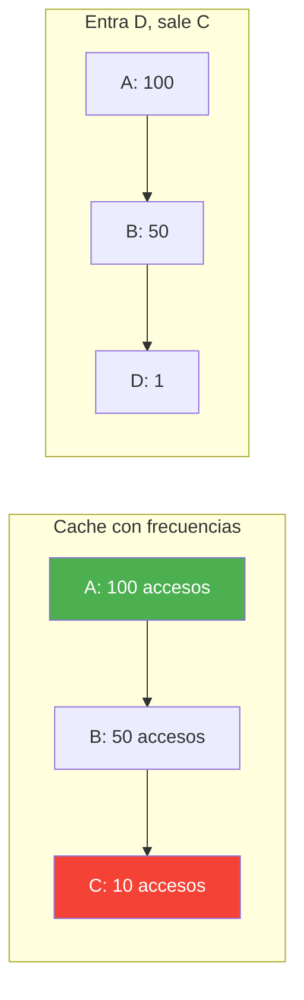

### 14.3.3. FIFO - First In First Out

**FIFO** elimina los elementos en el orden en que fueron añadidos, independientemente de cómo se acceda a ellos.

### 14.3.4. TTL - Time To Live

**TTL** no es un algoritmo de evicción sino una política complementaria. Cada entrada tiene un tiempo de vida después del cual se elimina automáticamente.

```csharp
var options = new MemoryCacheEntryOptions
{
    // Expira 30 minutos después de ahora
    AbsoluteExpirationRelativeToNow = TimeSpan.FromMinutes(30),
    
    // Expira si no se accede durante 10 minutos
    SlidingExpiration = TimeSpan.FromMinutes(10),
    
    // Prioridad de evicción
    Priority = CacheItemPriority.Normal
};
```

### 14.3.5. Comparativa de Algoritmos

| Algoritmo | Mejor Caso | Peor Caso | Complejidad | Uso Típico |
|-----------|------------|-----------|-------------|------------|
| **LRU** | Patrones repetitivos | Acceso secuencial sin repetición | O(1) | Apps web generales |
| **LFU** | Popularidad estable | Cambios frecuentes de popularidad | O(log n) | Rankings, trending |
| **FIFO** | Datos que caducan por edad | Patrones repetitivos | O(1) | Buffering, streaming |
| **TTL** | Datos que caducan naturalmente | Datos permanentes | O(1) | Tokens, sesiones |

> 📝 **Nota:** En Redis, el algoritmo por defecto es **allkeys-lru** (LRU entre todas las claves). Se configura con `maxmemory-policy allkeys-lru` en redis.conf.

---

## 14.4. Estrategias de Acceso a Caché

### 14.4.1. Cache-Aside (Lazy Loading)

El patrón **Cache-Aside** carga datos en el caché solo cuando se necesitan por primera vez. Es la estrategia más utilizada.

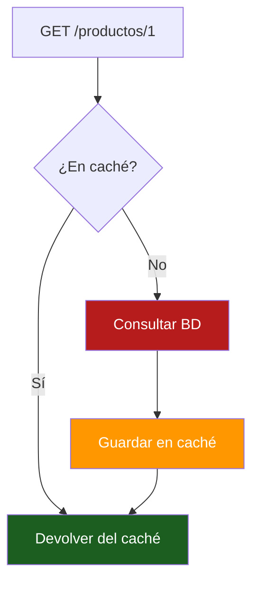

**Implementación:**

```csharp
public async Task<Producto?> GetProductoAsync(int id)
{
    var cacheKey = $"producto:{id}";
    
    // 1. Intentar obtener del caché
    var cached = await _cache.GetAsync<Producto>(cacheKey);
    if (cached != null) return cached; // HIT
    
    // 2. Cache MISS - obtener de la base de datos
    var producto = await _repository.GetByIdAsync(id);
    
    // 3. Guardar en caché para próximas solicitudes
    if (producto != null)
        await _cache.SetAsync(cacheKey, producto, TimeSpan.FromMinutes(30));
    
    return producto;
}
```

**Ventajas:** Simple, datos se cargan bajo demanda, ideal para acceso impredecible.
**Desventajas:** Primer acceso lento (cache miss), posible cache stampede.

### 14.4.2. Write-Through

El patrón **Write-Through** escribe simultáneamente en el caché y en la base de datos.

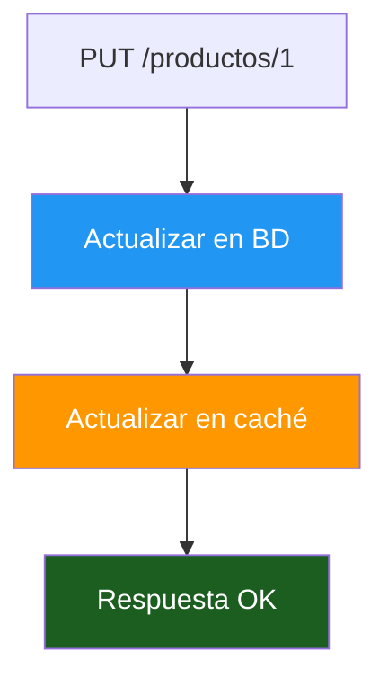

**Ventajas:** Caché siempre sincronizado, lecturas siempre devuelven datos actualizados.
**Desventajas:** Writes más lentos (dos operaciones), overhead en cada write.

### 14.4.3. Write-Behind (Write-Back)

El patrón **Write-Behind** escribe primero en el caché y luego, de forma asíncrona, en la base de datos.

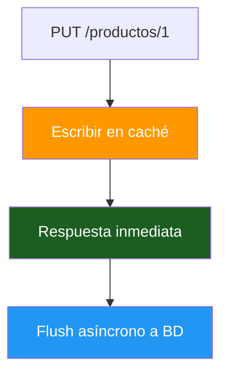

**Ventajas:** Writes muy rápidos, reduce carga en BD.
**Desventajas:** Riesgo de pérdida de datos si el caché falla.

### 14.4.4. Refresh-Ahead

El patrón **Refresh-Ahead** refresca automáticamente los datos antes de que expiren.

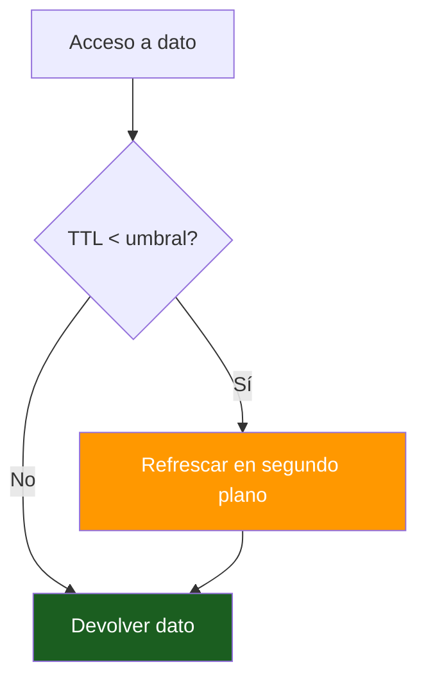

### 14.4.5. Cuál elegir

| Estrategia | Mejor Para | Evitar En |
|------------|------------|-----------|
| **Cache-Aside** | Reads frecuentes, datos no críticos | Datos que cambian constantemente |
| **Write-Through** | Datos que deben estar siempre actualizados | Writes de alto volumen |
| **Write-Behind** | Alta escritura, tolerancia a pérdida | Transacciones financieras |
| **Refresh-Ahead** | Datos muy populares, baja latencia | Datos muy volátiles |

> 💡 **Consejo:** Para la mayoría de aplicaciones web, **Cache-Aside** es la mejor elección. Es simple, efectivo y fácil de debuggear.

---

## 14.5. Memcached

### 14.5.1. Qué es Memcached

**Memcached** es un sistema de caché en memoria distribuido, de código abierto, diseñado para ser rápido y sencillo. A diferencia de Redis, solo almacena cadenas de texto (strings) y no soporta estructuras de datos complejas.

📌 Ejemplo real: **Facebook** usa Memcached masivamente para cachear resultados de consultas de la base de datos MySQL. Fue uno de los impulsores principales del proyecto, contribuyendo mejoras como el "multi-get" y la replicación.

### 14.5.2. Memcached vs Redis

| Característica | Memcached | Redis |
|----------------|-----------|-------|
| **Estructuras de datos** | Solo strings | Múltiples (String, Hash, List, Set, ZSet, Stream) |
| **Persistencia** | No | Sí (RDB + AOF) |
| **Cluster** | Por fragmentación | Nativo |
| **Lua scripting** | No | Sí |
| **Pub/Sub** | No | Sí |
| **Geospatial** | No | Sí |
| **Memoria** | Más eficiente para strings simples | Más flexible |
| **Complejidad** | Baja | Media |

> 📝 **Nota:** Memcached es como una estantería simple: solo guarda cajas (strings). Redis es como un almacén inteligente: tiene cajones, estantes, listas y hasta un tablero de anuncios. Para caché básica, ambos funcionan. Para algo más complejo, Redis gana.

---

## 14.6. Redis: Fundamentos

### 14.6.1. Qué es Redis

**Redis** (Remote Dictionary Server) es una base de datos en memoria de código abierto que funciona como almacén de estructuras de datos clave-valor. Es extremadamente rápido porque mantiene todos los datos en memoria RAM.

📌 Ejemplo real: **Twitter** usa Redis para almacenar los timelines de los usuarios. Cuando abres tu timeline, los tweets más recientes vienen de Redis, no de una consulta a la base de datos principal. Esto permite servir millones de peticiones por segundo.

### 14.6.2. Estructuras de Datos

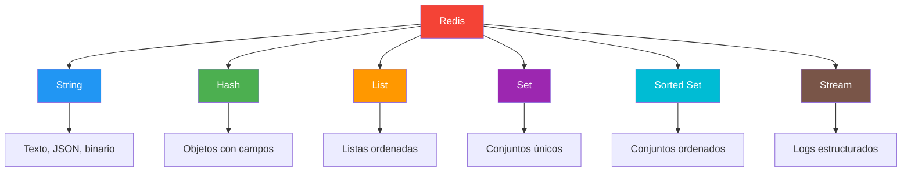

| Estructura | Uso | Ejemplo |
|------------|-----|---------|
| **String** | Cacheo de JSON, contadores | `SET product:1 '{"id":1}'` |
| **Hash** | Objetos con campos | `HSET user:1 name "Juan"` |
| **List** | Colas, feeds | `LPUSH notifications "nuevopedido"` |
| **Set** | Tags, pertenencia | `SADD product:tags "funko"` |
| **Sorted Set** | Leaderboards | `ZADD leaderboard 100 "user:1"` |
| **Stream** | Logging, eventos | `XADD events * type "login"` |

### 14.6.3. Persistencia

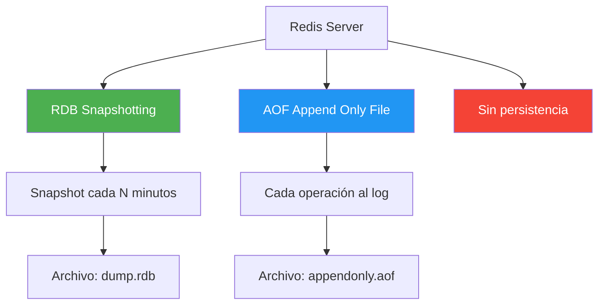

**Configuración recomendada para producción:**

```bash
# redis.conf
appendonly yes
appendfsync everysec
save 900 1
save 300 10
save 60 10000
maxmemory 2gb
maxmemory-policy allkeys-lru
```

### 14.6.4. Configuración con Docker

**docker-compose.yml (solo Redis):**

```yaml
services:
  redis:
    image: redis:7-alpine
    container_name: app-redis
    ports:
      - "6379:6379"
    command: redis-server --appendonly yes --maxmemory 256mb --maxmemory-policy allkeys-lru
    volumes:
      - redis-data:/data

volumes:
  redis-data:
```

---

## 14.7. Caché en ASP.NET Core

### 14.7.1. Paquetes NuGet

```bash
dotnet add package Microsoft.Extensions.Caching.StackExchangeRedis
dotnet add package Microsoft.Extensions.Caching.Memory
```

### 14.7.2. Interfaz ICacheService

```csharp
namespace ProductosApi.Services.Cache;

/// <summary>
/// Interfaz abstracta para operaciones de caché.
/// Permite cambiar entre MemoryCache y Redis sin modificar código.
/// </summary>
public interface ICacheService
{
    Task<T?> GetAsync<T>(string key, CancellationToken ct = default);
    Task SetAsync<T>(string key, T value, TimeSpan? expiration = null, CancellationToken ct = default);
    Task RemoveAsync(string key, CancellationToken ct = default);
    Task<bool> ExistsAsync(string key, CancellationToken ct = default);
    Task<T?> GetOrSetAsync<T>(string key, Func<Task<T>> factory, TimeSpan? expiration = null, CancellationToken ct = default);
}
```

> 💡 **Consejo:** El método `GetOrSetAsync` es crucial para evitar el "cache stampede" donde múltiples hilos intentan cargar el mismo dato simultáneamente.

### 14.7.3. MemoryCacheService

```csharp
using Microsoft.Extensions.Caching.Memory;

namespace ProductosApi.Services.Cache;

/// <summary>
/// Implementación de caché en memoria local.
/// Útil para desarrollo o aplicaciones de instancia única.
/// </summary>
public class MemoryCacheService(IMemoryCache cache) : ICacheService
{
    private static readonly TimeSpan DefaultExpiration = TimeSpan.FromMinutes(30);

    public Task<T?> GetAsync<T>(string key, CancellationToken ct = default)
    {
        cache.TryGetValue(key, out T? value);
        return Task.FromResult(value);
    }

    public Task SetAsync<T>(string key, T value, TimeSpan? expiration = null, CancellationToken ct = default)
    {
        var options = new MemoryCacheEntryOptions
        {
            AbsoluteExpirationRelativeToNow = expiration ?? DefaultExpiration
        };
        cache.Set(key, value, options);
        return Task.CompletedTask;
    }

    public Task RemoveAsync(string key, CancellationToken ct = default)
    {
        cache.Remove(key);
        return Task.CompletedTask;
    }

    public Task<bool> ExistsAsync(string key, CancellationToken ct = default)
    {
        return Task.FromResult(cache.TryGetValue(key, out _));
    }

    public async Task<T?> GetOrSetAsync<T>(string key, Func<Task<T>> factory,
        TimeSpan? expiration = null, CancellationToken ct = default)
    {
        if (cache.TryGetValue(key, out T? cached))
            return cached;

        var value = await factory();
        if (value is not null)
            await SetAsync(key, value, expiration, ct);
        return value;
    }
}
```

### 14.7.4. RedisCacheService

```csharp
using Microsoft.Extensions.Caching.Distributed;
using System.Text.Json;

namespace ProductosApi.Services.Cache;

/// <summary>
/// Implementación de caché distribuido con Redis.
/// Para producción y aplicaciones multi-instancia.
/// </summary>
public class RedisCacheService(IDistributedCache cache) : ICacheService
{
    private static readonly TimeSpan DefaultExpiration = TimeSpan.FromMinutes(30);

    public async Task<T?> GetAsync<T>(string key, CancellationToken ct = default)
    {
        var data = await cache.GetStringAsync(key, ct);
        return data is null ? default : JsonSerializer.Deserialize<T>(data);
    }

    public async Task SetAsync<T>(string key, T value, TimeSpan? expiration = null, CancellationToken ct = default)
    {
        var options = new DistributedCacheEntryOptions
        {
            AbsoluteExpirationRelativeToNow = expiration ?? DefaultExpiration
        };
        await cache.SetStringAsync(key, JsonSerializer.Serialize(value), options, ct);
    }

    public async Task RemoveAsync(string key, CancellationToken ct = default)
    {
        await cache.RemoveAsync(key, ct);
    }

    public async Task<bool> ExistsAsync(string key, CancellationToken ct = default)
    {
        var data = await cache.GetStringAsync(key, ct);
        return data is not null;
    }

    public async Task<T?> GetOrSetAsync<T>(string key, Func<Task<T>> factory,
        TimeSpan? expiration = null, CancellationToken ct = default)
    {
        var cached = await GetAsync<T>(key, ct);
        if (cached is not null) return cached;

        var value = await factory();
        await SetAsync(key, value, expiration, ct);
        return value;
    }
}
```

### 14.7.5. Configuración en DI

```csharp
// Program.cs - Configuración según entorno
if (builder.Environment.IsDevelopment())
{
    builder.Services.AddMemoryCache();
    builder.Services.AddSingleton<ICacheService, MemoryCacheService>();
}
else
{
    builder.Services.AddStackExchangeRedisCache(options =>
    {
        options.Configuration = builder.Configuration["Redis:ConnectionString"];
    });
    builder.Services.AddSingleton<ICacheService, RedisCacheService>();
}
```

**appsettings.json:**

```json
{
  "Redis": {
    "ConnectionString": "localhost:6379,password=miPassword123"
  }
}
```

---

## 14.8. Qué y qué no cachear

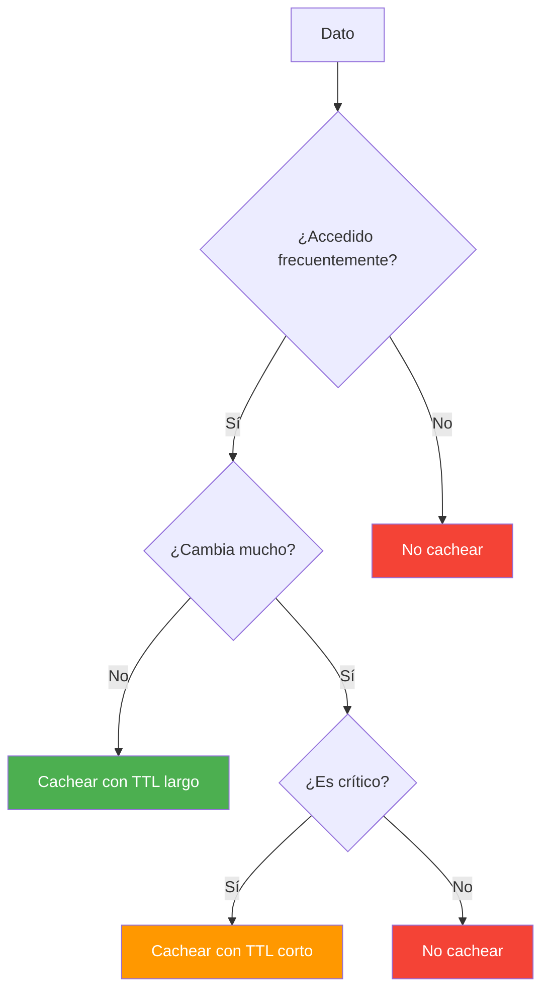

| Qué cachear | Qué NO cachear |
|-------------|----------------|
| Productos, categorías | Datos sensibles (passwords, tokens) |
| Resultados de consultas frecuentes | Datos en tiempo real (stocks) |
| Configuración de la app | Datos muy grandes (imágenes, blobs) |
| Datos de sesión | Datos personales (GDPR) |
| Consultas con JOINs costosos | Datos que cambian cada segundo |

---

## 14.9. Invalidación de Caché

### 14.9.1. Invalidación por TTL

La forma más simple: cada entrada tiene un tiempo de vida después del cual se elimina automáticamente.

```csharp
await _cache.SetAsync(key, value, TimeSpan.FromMinutes(30));
// El dato se elimina automáticamente después de 30 minutos
```

### 14.9.2. Invalidación por Operación CRUD

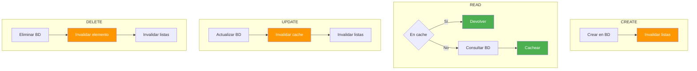

### 14.9.3. Invalidación en Cascada

Cuando un dato relacionado cambia, todas las cachés derivadas deben invalidarse:

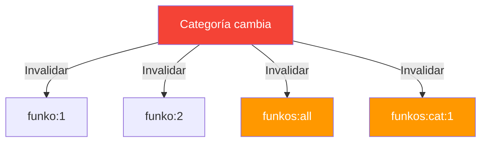

### 14.9.4. Regla de Oro

| Operación | Elemento Individual | Listas/Colecciones |
|-----------|---------------------|-------------------|
| **CREATE** | Cachear O invalidar | Invalidar |
| **READ** | Cachear resultado | No invalidar |
| **UPDATE** | Invalidar O recachear | Invalidar |
| **DELETE** | Invalidar | Invalidar |

> 💡 **Consejo:** No hay una respuesta universal. La mejor estrategia depende de tu patrón de acceso. Analiza si las lecturas del mismo elemento son frecuentes antes de decidir.

---

## 14.10. CRUD con Caché: Diagrama Completo

```mermaid
flowchart TD
    subgraph "CREATE"
        A1["POST /api/productos"] --> A2["Crear en BD"]
        A2 --> A3["Invalidar productos:all"]
    end
    subgraph "READ"
        B1["GET /api/productos/1"] --> B2{"En cache?"}
        B2 -->|Sí| B3["Devolver del cache"]
        B2 -->|No| B4["Consultar BD"]
        B4 --> B5["Cachear resultado"]
        B5 --> B3
    end
    subgraph "UPDATE"
        C1["PUT /api/productos/1"] --> C2["Actualizar en BD"]
        C2 --> C3["Invalidar cache del elemento"]
        C3 --> C4["Invalidar listas"]
    end
    subgraph "DELETE"
        D1["DELETE /api/productos/1"] --> D2["Eliminar de BD"]
        D2 --> D3["Invalidar elemento"]
        D3 --> D4["Invalidar listas"]
    end
    style B3 fill:#4CAF50,color:#fff
    style B5 fill:#4CAF50,color:#fff
    style A3 fill:#FF9800,color:#fff
    style C3 fill:#FF9800,color:#fff
    style D3 fill:#FF9800,color:#fff
```

---

## 14.11. Decorator Pattern para Caché

El patrón **Decorator** permite añadir caché a un servicio sin modificar su código original:

```csharp
// 1. Interfaz del servicio
public interface IProductoService
{
    Task<Producto?> GetByIdAsync(int id);
    Task<Producto> CreateAsync(Producto producto);
}

// 2. Implementación base (sin caché)
public class ProductoService(IProductoRepository repository) : IProductoService
{
    public async Task<Producto?> GetByIdAsync(int id)
        => await repository.GetByIdAsync(id);

    public async Task<Producto> CreateAsync(Producto producto)
        => await repository.CreateAsync(producto);
}

// 3. Decorador con caché
public class CachedProductoService(
    IProductoService inner,
    ICacheService cache) : IProductoService
{
    public async Task<Producto?> GetByIdAsync(int id)
    {
        var cacheKey = $"producto:{id}";
        var cached = await cache.GetAsync<Producto>(cacheKey);
        if (cached is not null) return cached;

        var result = await inner.GetByIdAsync(id);
        if (result is not null)
            await cache.SetAsync(cacheKey, result, TimeSpan.FromMinutes(30));
        return result;
    }

    public async Task<Producto> CreateAsync(Producto producto)
    {
        var result = await inner.CreateAsync(producto);
        await cache.RemoveAsync("productos:all");
        return result;
    }
}

// 4. Registro en DI (con Scrutor)
builder.Services.AddScoped<IProductoService, ProductoService>();
builder.Services.Decorate<IProductoService, CachedProductoService>();
```

---

## 14.12. Testing con Caché

### 14.12.1. Unit Testing con Mocks

```csharp
using NUnit.Framework;
using Moq;
using FluentAssertions;

[TestFixture]
public class CachedProductoServiceTests
{
    private Mock<IProductoService> _innerMock = null!;
    private Mock<ICacheService> _cacheMock = null!;
    private CachedProductoService _service = null!;

    [SetUp]
    public void SetUp()
    {
        _innerMock = new Mock<IProductoService>();
        _cacheMock = new Mock<ICacheService>();
        _service = new CachedProductoService(_innerMock.Object, _cacheMock.Object);
    }

    [Test]
    public async Task GetById_EnCache_RetornaDelCache()
    {
        // Arrange
        var producto = new Producto { Id = 1, Nombre = "Teclado" };
        _cacheMock.Setup(c => c.GetAsync<Producto>("producto:1", It.IsAny<CancellationToken>()))
                  .ReturnsAsync(producto);

        // Act
        var result = await _service.GetByIdAsync(1);

        // Assert
        result.Should().Be(producto);
        _innerMock.Verify(i => i.GetByIdAsync(1), Times.Never);
    }

    [Test]
    public async Task GetById_NoEnCache_ObtieneDeServicio()
    {
        // Arrange
        var producto = new Producto { Id = 1, Nombre = "Teclado" };
        _cacheMock.Setup(c => c.GetAsync<Producto>("producto:1", It.IsAny<CancellationToken>()))
                  .ReturnsAsync((Producto?)null);
        _innerMock.Setup(i => i.GetByIdAsync(1)).ReturnsAsync(producto);

        // Act
        var result = await _service.GetByIdAsync(1);

        // Assert
        result.Should().Be(producto);
        _cacheMock.Verify(c => c.SetAsync("producto:1", producto,
            It.IsAny<TimeSpan?>(), It.IsAny<CancellationToken>()), Times.Once);
    }
}
```

### 14.12.2. Integration Testing con TestContainers

```csharp
using Testcontainers.Redis;
using NUnit.Framework;

[TestFixture]
public class RedisCacheServiceTests : IAsyncLifetime
{
    private RedisContainer _container = null!;
    private ICacheService _cache = null!;

    public async Task InitializeAsync()
    {
        _container = new RedisBuilder().WithImage("redis:7-alpine").Build();
        await _container.StartAsync();
        // Configurar IDistributedCache con la cadena del contenedor
    }

    public async Task DisposeAsync()
    {
        await _container.StopAsync();
    }

    [Test]
    public async Task SetGet_ReturnsCorrectValue()
    {
        // Arrange
        var key = "test:producto";
        var producto = new Producto { Id = 1, Nombre = "Test" };

        // Act
        await _cache.SetAsync(key, producto);
        var result = await _cache.GetAsync<Producto>(key);

        // Assert
        result.Should().NotBeNull();
        result!.Nombre.Should().Be("Test");
    }
}
```

---

## 14.13. Buenas Prácticas

| Práctica | Descripción |
|----------|-------------|
| **Usar abstracción** | Interfaz `ICacheService`, nunca usar `IMemoryCache` directamente |
| **Claves descriptivas** | `producto:1`, `productos:all`, `productos:cat:marvel` |
| **TTL apropiado** | Datos estables: 24h. Datos moderados: 30min. Datos volátiles: 1min |
| **Invalidar en escrituras** | Siempre invalidar listas cuando hay CREATE/UPDATE/DELETE |
| **Loggear HIT/MISS** | Para debug y métricas |
| **Environment-based** | MemoryCache en Development, Redis en Production |

> ⚠️ **Advertencia:** Nunca almacenes datos sensibles (passwords, tokens JWT, datos de tarjetas de crédito) en caché. El caché no está diseñado para seguridad, solo para rendimiento.

---

## 14.14. Reto

> Aplica caché a la API de productos del Ejemplo 11 (EF Core + PostgreSQL).

**Añade a tu API:**

1. Interfaz `ICacheService` con operaciones Get, Set, Remove, GetOrSet
2. `MemoryCacheService` implementando `ICacheService` para desarrollo
3. `RedisCacheService` implementando `ICacheService` para producción
4. Configuración en DI que seleccione la implementación según el entorno
5. Aplicar Cache-Aside en el servicio de productos: cachear individual y lista
6. Invalidación correcta en CREATE, UPDATE y DELETE

**Puntos extra:**

- Implementar el patrón Decorator con Scrutor
- Añadir métricas de hit rate con logs
- Tests unitarios con mocks
- Tests de integración con TestContainers (Redis)

---

## 14.15. Resumen

| Concepto | Descripción |
|----------|-------------|
| **Caché** | Almacenamiento temporal de alta velocidad |
| **MemoryCache** | Caché local, muy rápido, no compartido entre instancias |
| **Redis** | Caché distribuido, compartido, persistente |
| **Memcached** | Caché distribuido simple, solo strings |
| **LRU** | Algoritmo que elimina el menos usado recientemente |
| **Cache-Aside** | Patrón que carga datos bajo demanda (el más común) |
| **Invalidación** | Proceso de eliminar datos obsoletos del caché |
| **TTL** | Tiempo de vida de cada entrada en caché |

**¿Qué viene después?**

En el siguiente punto veremos **Transacciones, Identificadores y Elementos Avanzados de Bases de Datos**: cómo gestionar operaciones atómicas, UUIDs, concurrencia optimista/pesimista y otras funcionalidades avanzadas de persistencia.

