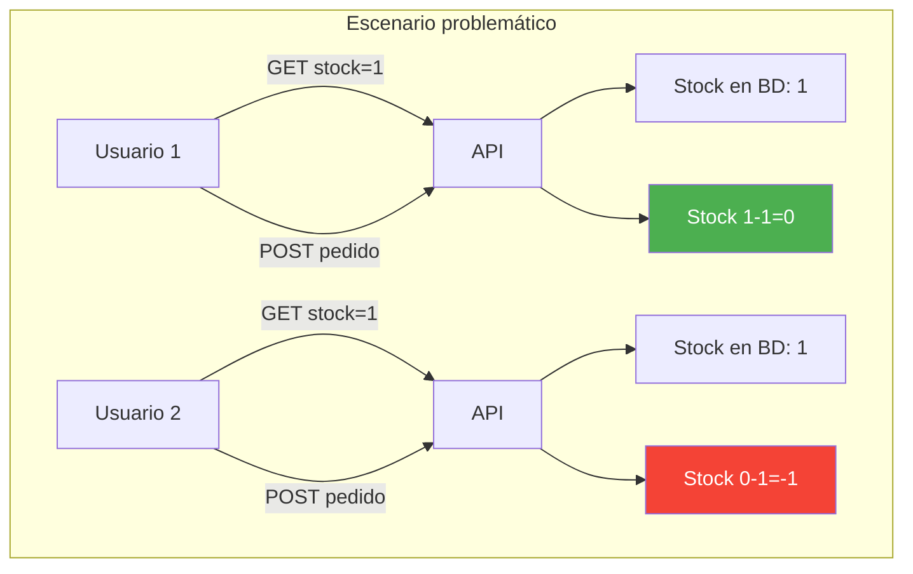
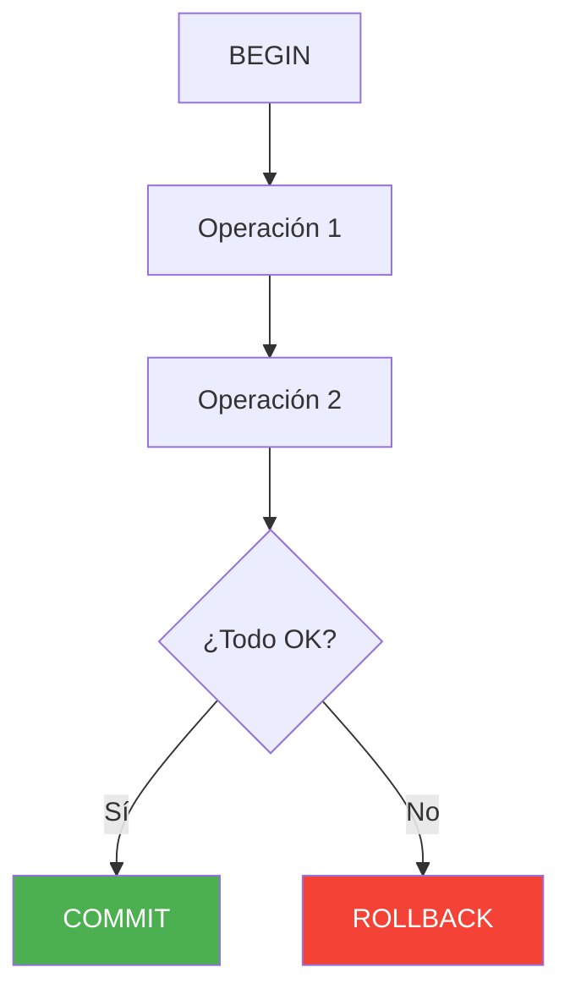
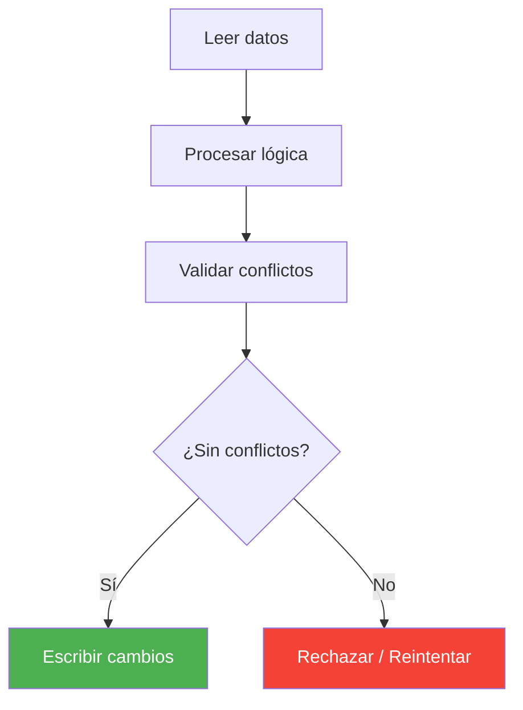
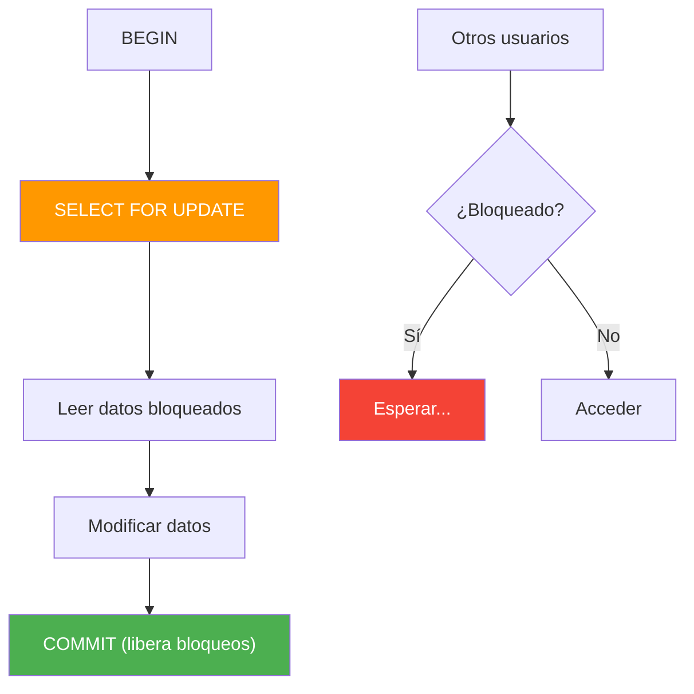
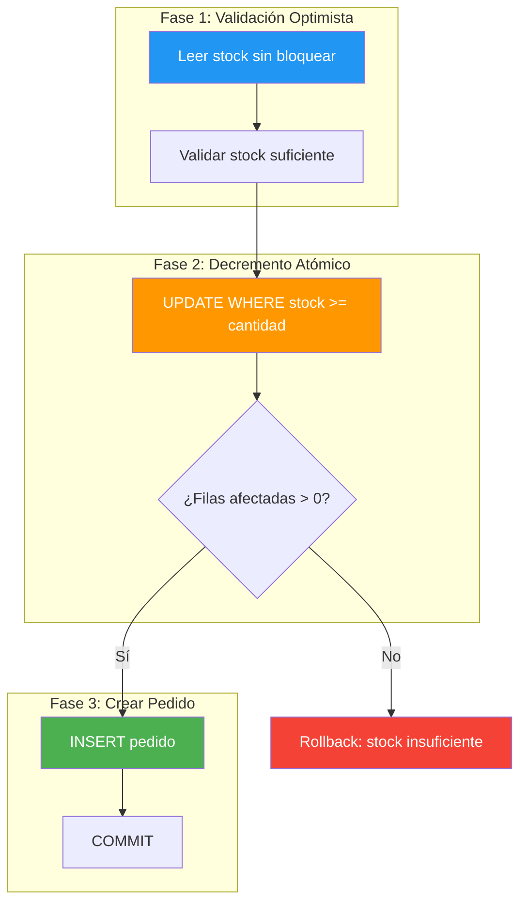
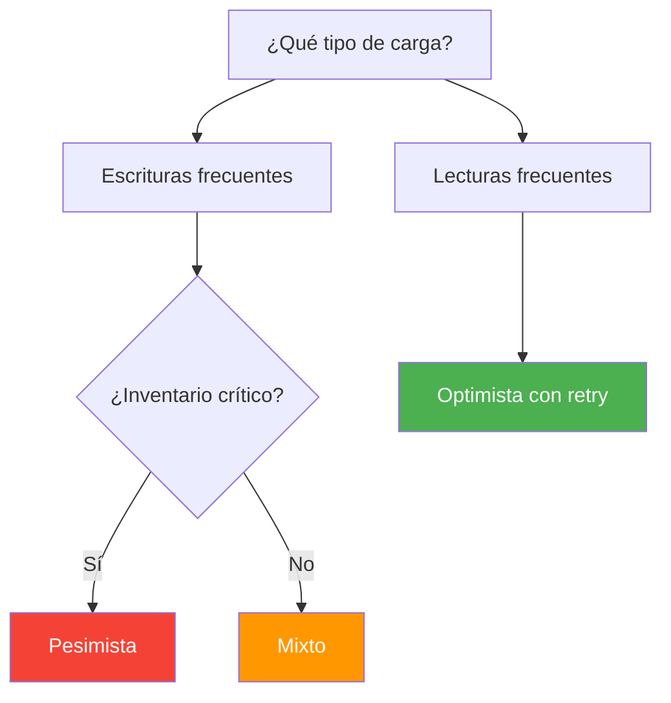
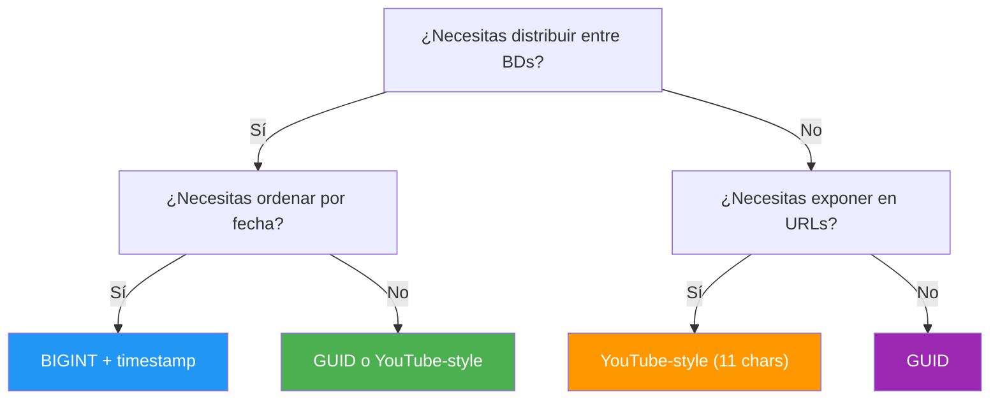

# 15. Transacciones, Concurrencia e Identificadores

- [15. Transacciones, Concurrencia e Identificadores](#15-transacciones-concurrencia-e-identificadores)
  - [15.1. El Problema de la Concurrencia](#151-el-problema-de-la-concurrencia)
  - [15.2. Transacciones](#152-transacciones)
    - [15.2.1. Qué es una Transacción](#1521-qué-es-una-transacción)
    - [15.2.2. Propiedades ACID](#1522-propiedades-acid)
    - [15.2.3. Transacciones en EF Core](#1523-transacciones-en-ef-core)
  - [15.3. Control de Concurrencia](#153-control-de-concurrencia)
    - [15.3.1. Enfoque Optimista](#1531-enfoque-optimista)
    - [15.3.2. Enfoque Pesimista](#1532-enfoque-pesimista)
    - [15.3.3. Enfoque Mixto](#1533-enfoque-mixto)
    - [15.3.4. Comparativa de Enfoques](#1534-comparativa-de-enfoques)
  - [15.4. Identificadores: Claves Primarias](#154-identificadores-claves-primarias)
    - [15.4.1. Autoincrementales (INT/BIGINT)](#1541-autoincrementales-intbigint)
    - [15.4.2. UUID/GUID](#1542-uuidguid)
    - [15.4.3. El ID de YouTube: Base64 de 11 caracteres](#1543-el-id-de-youtube-base64-de-11-caracteres)
    - [15.4.4. Generador de IDs Personalizado con Atributo](#1544-generador-de-ids-personalizado-con-atributo)
    - [15.4.5. Comparativa de Identificadores](#1545-comparativa-de-identificadores)
  - [15.5. Buenas Prácticas](#155-buenas-prácticas)
  - [15.6. Reto](#156-reto)


---

> 💡 **Punto de partida:** Si dos personas intentan comprar el último billete de avión al mismo tiempo, ¿quién se lo lleva? La base de datos debe tener un mecanismo para decidirlo sin perder datos ni vender el mismo billete dos veces.

**Objetivos de aprendizaje:**
- Comprender el problema de la concurrencia y las race conditions
- Implementar transacciones explícitas con EF Core (BeginTransactionAsync)
- Aplicar control de concurrencia optimista y pesimista
- Conocer diferentes estrategias de generación de identificadores (UUID, ULID, Base64)

## 15.1. El Problema de la Concurrencia

Cuando múltiples usuarios intentan modificar el mismo dato simultáneamente, surgen problemas de concurrencia que pueden llevar a inconsistencias en los datos.



**Timeline del problema:**

| Tiempo | Usuario 1 | Usuario 2 | Stock en BD |
|--------|-----------|-----------|-------------|
| T1 | Lee stock = 1 | - | 1 |
| T2 | - | Lee stock = 1 | 1 |
| T3 | Crea pedido | - | 1 |
| T4 | Decrementa stock | - | 0 |
| T5 | - | Crea pedido | 0 |
| T6 | - | Decrementa stock | **-1** |

Vendemos 2 productos cuando solo teníamos 1 en stock. Esto se llama **race condition** (condición de carrera).

📌 Ejemplo real: **Amazon** gestiona millones de compras simultáneas. Cuando ves "último unidad en stock" y la compras, otro usuario en otro país puede estar haciendo lo mismo. Sin control de concurrencia, venderían el mismo producto dos veces.

15.2. Transacciones

### 15.2.1. Qué es una Transacción

Una **transacción** es un conjunto de operaciones que se ejecutan como una unidad indivisible. Todas se completan exitosamente o ninguna se aplica.

> 💡 **Analogía:** Piensa en una transferencia bancaria. No puedes sacar dinero de la cuenta A sin asegurarte de que se deposite en la cuenta B. Si algo falla a mitad, todo debe revertirse.

### 15.2.2. Propiedades ACID


| Propiedad | Descripción | Ejemplo |
|-----------|-------------|---------|
| **Atomicidad** | Todo o nada | Si el pedido falla, el stock no se decrementa |
| **Consistencia** | Datos siempre válidos | Stock nunca negativo |
| **Aislamiento** | Transacciones paralelas no interfieren | Dos pedidos se procesan secuencialmente |
| **Durabilidad** | Commits persistentes | Si el servidor cae después del commit, los datos sobreviven |

### 15.2.3. Transacciones en EF Core



**Transacción implícita** (cada `SaveChanges` es una transacción):

```csharp
// ❌ MALO: Crear pedido y stock en SaveChanges separados — riesgo de inconsistencia
context.Productos.Add(producto);
await context.SaveChangesAsync();  // Transacción 1: si falla aquí...

context.Pedidos.Add(pedido);
await context.SaveChangesAsync();  // Transacción 2: ...el producto ya está creado pero no el pedido

// ✅ BUENO: Usar transacción explícita para operaciones que deben ser atómicas
await using var transaction = await context.Database.BeginTransactionAsync();
try
{
    context.Productos.Add(producto);
    context.Pedidos.Add(pedido);
    await context.SaveChangesAsync();
    await transaction.CommitAsync(); // Todo se aplica junto o nada
}
catch
{
    await transaction.RollbackAsync(); // Deshacer todo si algo falla
    throw;
}
```

> 💡 **Consejo:** Una transacción implícita (`SaveChanges`) solo sirve para una operación simple. Cuando necesitas que varias operaciones sean atómicas (crear pedido + decrementar stock), **siempre** usa transacción explícita con `BeginTransactionAsync`.

> ⚠️ **Advertencia:** Siempre haz `RollbackAsync()` en el bloque `catch`, incluso si el error es esperado. Una transacción abandonada puede bloquear recursos en la BD.

15.3. Control de Concurrencia

### 15.3.1. Enfoque Optimista

El enfoque **optimista** asume que los conflictos son raros. Permite que las transacciones procedan sin bloqueos. Los cambios se validan al final: si otro proceso modificó los datos, se rechaza la transacción.



**Implementación con `[Timestamp]`:**

```csharp
// ❌ MALO: No usar control de concurrencia — race conditions garantizadas
public class Producto
{
    public long Id { get; set; }
    public string Nombre { get; set; } = string.Empty;
    public int Stock { get; set; }
    // Sin [Timestamp] → dos usuarios pueden vender el mismo stock
}

// ✅ BUENO: Usar [Timestamp] para concurrencia optimista
public class Producto
{
    public long Id { get; set; }
    public string Nombre { get; set; } = string.Empty;
    public int Stock { get; set; }

    [Timestamp]
    public byte[] RowVersion { get; set; } = null!; // EF Core valida conflictos automáticamente
}
// Si otro usuario modificó el registro entre tu lectura y tu escritura,
// SaveChanges lanza DbUpdateConcurrencyException
```

**Manejo de `DbUpdateConcurrencyException`:**

```csharp
try
{
    await context.SaveChangesAsync();
}
catch (DbUpdateConcurrencyException ex)
{
    var entry = ex.Entries.First();
    var databaseValues = await entry.GetDatabaseValuesAsync();

    if (databaseValues is null)
        throw new Exception("El registro fue eliminado por otro usuario");

    // Mostrar diferencias y pedir confirmación
    Console.WriteLine($"Tu stock: {entry.CurrentValues["Stock"]}");
    Console.WriteLine($"Stock actual: {databaseValues["Stock"]}");
}
```

> 💡 **Consejo:** Para reintentos automáticos con el enfoque optimista, usa **Polly**: `Policy.Handle<DbUpdateConcurrencyException>().WaitAndRetryAsync(3, ...)`. Esto reintenta la operación 3 veces con espera exponencial.

### 15.3.2. Enfoque Pesimista

El enfoque **pesimista** bloquea los datos antes de modificarlos, impidiendo que otros usuarios accedan hasta que termine la transacción.



**Implementación con `SELECT FOR UPDATE`:**

```csharp
await using var transaction = await context.Database.BeginTransactionAsync();
try
{
    var productos = await context.Productos
        .FromSqlInterpolated($@"
            SELECT * FROM ""Productos""
            WHERE ""Id"" IN ({string.Join(",", ids)})
            FOR UPDATE")
        .ToListAsync();

    // Modificar y guardar
    foreach (var item in productos)
        item.Stock -= cantidad;

    await context.SaveChangesAsync();
    await transaction.CommitAsync();
}
catch
{
    await transaction.RollbackAsync();
    throw;
}
```

**Niveles de aislamiento:**

| Nivel | Dirty Read | Non-repeatable | Phantom | Bloqueo |
|-------|------------|----------------|---------|---------|
| **Read Uncommitted** | Permitido | Permitido | Permitido | Ninguno |
| **Read Committed** | Protegido | Permitido | Permitido | Filas |
| **Repeatable Read** | Protegido | Protegido | Permitido | Filas |
| **Serializable** | Protegido | Protegido | Protegido | Tabla completa |

### 15.3.3. Enfoque Mixto

El **enfoque mixto** combina lo mejor de ambos: validación optimista para lectura rápida, y `UPDATE` atómico para la escritura crítica.



**Fase 1 — Validación optimista:**

```csharp
var productos = await context.Productos
    .AsNoTracking()
    .Where(p => ids.Contains(p.Id))
    .ToDictionaryAsync(p => p.Id);

foreach (var item in items)
    if (productos[item.Id].Stock < item.Cantidad)
        return Result.Failure(...);  // Stock insuficiente
```

**Fase 2 — Decremento atómico:**

```csharp
var filas = await context.Database.ExecuteSqlRawAsync(@"
    UPDATE ""Productos""
    SET ""Stock"" = ""Stock"" - @cantidad
    WHERE ""Id"" = @id AND ""Stock"" >= @cantidad",
    new SqlParameter("@cantidad", cantidad),
    new SqlParameter("@id", productoId));

if (filas == 0)
    return Result.Failure(...);  // Otro usuario ya compró
```

**Fase 3 — Crear pedido:**

```csharp
context.Pedidos.Add(pedido);
await context.SaveChangesAsync();
await transaction.CommitAsync();
```

### 15.3.4. Comparativa de Enfoques

| Criterio | Optimista | Pesimista | Mixto |
|----------|-----------|-----------|-------|
| **Bloqueos** | Ninguno | Largo periodo | Breve (UPDATE atómico) |
| **Deadlocks** | Imposibles | Frecuentes | Raros |
| **Rendimiento** | Alto sin contención | Bajo con contención | Optimizado |
| **Consistencia** | Verificación al final | Garantizada | Garantizada |
| **Retry necesario** | Sí | No | Opcional |
| **Complejidad** | Moderada | Simple | Moderada |



> 📝 **Nota:** El enfoque **mixto** es el más recomendado para la mayoría de aplicaciones web. Combina la rapidez de la validación optimista con la seguridad del `UPDATE` atómico.

15.4. Identificadores: Claves Primarias

### 15.4.1. Autoincrementales (INT/BIGINT)

El tipo más tradicional. La BD asigna automáticamente el siguiente valor: 1, 2, 3, ...

```csharp
// ❌ MALO: Usar INT para sistemas distribuidos (múltiples bases de datos)
// BD1 tiene Producto ID=42, BD2 también tiene Producto ID=42 → colisión
public class Producto
{
    public int Id { get; set; } // ¡Peligro en microservicios!
}

// ✅ BUENO: Usar INT solo en sistemas monolíticos con una única BD
public class Producto
{
    public int Id { get; set; }  // Aceptable en app con una sola BD
    public string Nombre { get; set; } = string.Empty;
}
```

> 💡 **Analogía:** Un INT autoincremental es como el número de tu DNI: es único **dentro de tu país**, pero si dos países emitieran los mismos números, habría colisiones. Un GUID es como tu huella dactilar: única en todo el mundo, sin importar cuántas personas haya.

| Ventaja | Desventaja |
|---------|------------|
| Simple, rápido, indexado | Secuencial: expone cuántos registros hay |
| Ocupa poco espacio (4-8 bytes) | No distribuible (colisiones en BD separadas) |
| Orden natural | Adivinable: `/api/productos/42` → probando `/api/productos/43` |

### 15.4.2. UUID/GUID

Un **GUID** (Globally Unique Identifier) es un identificador de 128 bits con 3.4 × 10^38 combinaciones posibles. Es prácticamente imposible que se repita.

```csharp
// ❌ MALO: Usar GUID sin contexto — no se sabe qué representa
public class Producto
{
    public Guid Id { get; set; } = Guid.NewGuid(); // ¿Por qué GUID aquí?
}

// ✅ BUENO: Usar GUID cuando necesitas distribuir entre sistemas
public class Producto
{
    public Guid Id { get; set; } = Guid.NewGuid(); // Sistemas distribuidos ✓
    public string Nombre { get; set; } = string.Empty;
}

// ✅ BUENO: Usar SHORT GUID para URLs más legibles (ej: invite links)
public class Invitacion
{
    public string Id { get; set; } = ShortGuid.NewGuid().ToString(); // "aB3xYz..."
    // Más corto que un GUID completo, ideal para URLs y códigos de invitación
}
```

```csharp
// ❌ MALO: Comparar GUIDs con == (operación costosa en某些 plataformas)
if (producto.Id == otroProducto.Id) { ... } // Puede ser lento con GUIDs

// ✅ BUENO: Usar Equals() para comparación eficiente de GUIDs
if (producto.Id.Equals(otroProducto.Id)) { ... } // Comparación optimizada
```

| Ventaja | Desventaja |
|---------|------------|
| Único globalmente | Ocupa más espacio (16 bytes) |
| Sin colisiones | Random = mal rendimiento en índices B-Tree |
| Seguro para URLs | No ordenable secuencialmente |
| Distribuible | Menos legible para humanos |

> 💡 **Consejo:** Usa `Guid.NewGuid()` para generar GUIDs. En PostgreSQL, puedes usar `gen_random_uuid()` como valor por defecto de la columna.

### 15.4.3. El ID de YouTube: Base64 de 11 caracteres

El identificador de un video de YouTube es una cadena de **exactamente 11 caracteres** que se usa en la URL (por ejemplo, `dQw4w9WgXcQ` en `youtube.com/watch?v=dQw4w9WgXcQ`).

**Anatomía del ID:**

| Aspecto | Detalle |
|---------|---------|
| **Longitud** | Exactamente 11 caracteres |
| **Juego de caracteres** | Base64url: `a-z`, `A-Z`, `0-9`, `_`, `-` (64 caracteres) |
| **Combinaciones** | 64^11 ≈ 7.37 × 10^19 (73 quintillones) |
| **Probabilidad de colisión** | Prácticamente nula |

**Cómo se genera:**

1. **Generación aleatoria masiva:** Se genera una cadena aleatoria de 64 bits (codificada en 11 caracteres Base64) y se verifica unicidad en Google Spanner. Debido al enorme espacio de nombres, las colisiones son extremadamente infrecuentes.

2. **Ofuscación de IDs secuenciales:** Se toma un ID numérico interno autoincremental y se aplica una función de hash o codificación (como Hashids) para transformarlo en una cadena pseudoaleatoria de 11 caracteres. Esto evita que se adivinen URLs vecinas.

> 📝 **Nota:** YouTube usaba originalmente IDs numéricos secuenciales (como `v0Q8xIbCnQw`), pero los cambió a IDs ofuscados para evitar que se adivinen las URLs de otros videos y para no exponer cuántos videos se suben.

📌 Ejemplo real: El video más visto de YouTube ("Baby Shark") tiene el ID `XqZsoesa55w`. Si intentases adivinar videos vecinos (`XqZsoesa55v`, `XqZsoesa55x`), no encontrarías nada porque los IDs son pseudoaleatorios, no secuenciales.

### 15.4.4. Generador de IDs Personalizado con Atributo

Podemos crear nuestro propio generador de IDs estilo YouTube usando un **atributo personalizado** y un **ValueGenerator** en EF Core.

**Paso 1: Crear el atributo:**

```csharp
[AttributeUsage(AttributeTargets.Property)]
public class YouTubeIdAttribute : Attribute { }
```

**Paso 2: Crear el generador:**

```csharp
using Microsoft.EntityFrameworkCore.ChangeTracking;
using Microsoft.EntityFrameworkCore.ValueGeneration;

namespace ProductosApi.IdGenerators;

/// <summary>
/// Genera IDs de 11 caracteres estilo YouTube (Base64url).
/// </summary>
public class YouTubeIdValueGenerator : ValueGenerator<string>
{
    private const string Chars = "ABCDEFGHIJKLMNOPQRSTUVWXYZabcdefghijklmnopqrstuvwxyz0123456789-_";
    private static readonly Random Random = new();

    public override string Next(EntityEntry entry) =>
        new string(Enumerable.Range(0, 11).Select(_ => Chars[Random.Next(64)]).ToArray());

    public override bool GeneratesTemporaryValues => false;
}
```

**Paso 3: Registrar en `OnModelCreating`:**

```csharp
protected override void OnModelCreating(ModelBuilder modelBuilder)
{
    modelBuilder.Entity<Proveedor>(e =>
    {
        e.Property(p => p.Codigo)
            .HasValueGenerator<YouTubeIdValueGenerator>();
    });
}
```

**Paso 4: Usar en la entidad:**

```csharp
public class Proveedor
{
    [YouTubeId]  // Documentación visual del tipo de ID
    public string Codigo { get; set; } = string.Empty;

    public string Nombre { get; set; } = string.Empty;
}
```

> 💡 **Consejo:** El ValueGenerator se ejecuta solo cuando la entidad es nueva y la propiedad tiene valor por defecto. No necesitas asignar el ID manualmente: EF Core lo genera automáticamente al hacer `Add()`.

> ⚠️ **Advertencia: SaveChanges vs SaveChangesAsync**
>
> Si tu repositorio llama a `SaveChanges()` (sincrono) pero tu override de generacion de IDs solo esta en `SaveChangesAsync()`, **los IDs no se generaran**. Siempre override **ambos** metodos:
>
> ```csharp
> // ❌ MALO: Solo override async
> public override async Task<int> SaveChangesAsync(CancellationToken ct = default)
> {
>     GenerateIds();
>     return await base.SaveChangesAsync(ct);
> }
>
> // ✅ BUENO: Override ambos
> private void GenerateIds()
> {
>     foreach (var entry in ChangeTracker.Entries<Proveedor>()
>         .Where(e => e.State == EntityState.Added))
>     {
>         if (string.IsNullOrEmpty(entry.Entity.Id))
>             entry.Entity.Id = new YouTubeIdValueGenerator().Next(entry);
>     }
> }
>
> public override int SaveChanges()
> {
>     GenerateIds();
>     return base.SaveChanges();
> }
>
> public override Task<int> SaveChangesAsync(CancellationToken ct = default)
> {
>     GenerateIds();
>     return base.SaveChangesAsync(ct);
> }
> ```
>
> También elimina `ValueGeneratedOnAdd()` del Fluent API si generas el ID manualmente en el override.

### 15.4.5. Comparativa de Identificadores

| Tipo | Espacio | Único | Ordenable | Distribuible | Legible |
|------|---------|-------|-----------|--------------|---------|
| **INT autoincremental** | 4 bytes | Sí (en 1 BD) | Sí | No | Sí |
| **BIGINT autoincremental** | 8 bytes | Sí (en 1 BD) | Sí | No | Sí |
| **GUID** | 16 bytes | Sí (global) | No | Sí | No |
| **YouTube-style (11 chars)** | 11 bytes | Sí (prácticamente) | No | Sí | Sí |
| **ShortGuid** | ~22 chars | Sí (global) | No | Sí | Sí |



> 📝 **Nota:** En la práctica, el 90% de las aplicaciones usan BIGINT autoincremental o GUID. Los IDs estilo YouTube son útiles cuando necesitas IDs cortos y legibles en URLs (como YouTube, Bitly, o IDs de invite).

15.5. Buenas Prácticas

```csharp
// ❌ MALO: Olvidar el rollback en catch — transacción abandonada bloquea recursos
await using var transaction = await context.Database.BeginTransactionAsync();
try
{
    context.Pedidos.Add(pedido);
    context.Productos.Update(producto);
    await context.SaveChangesAsync();
    await transaction.CommitAsync();
}
catch (Exception ex)
{
    // ¡Sin rollback! La transacción queda abierta → bloqueo indefinido
    throw;
}

// ✅ BUENO: SIEMPRE hacer rollback en catch, sin excepciones
await using var transaction = await context.Database.BeginTransactionAsync();
try
{
    context.Pedidos.Add(pedido);
    context.Productos.Update(producto);
    await context.SaveChangesAsync();
    await transaction.CommitAsync();
}
catch
{
    await transaction.RollbackAsync(); // Libera recursos siempre
    throw;
}
// Alternativa: usar 'await using' que hace dispose automático (pero explícito es mejor práctica)
```

```csharp
// ❌ MALO: Usar SELECT sin FOR UPDATE en pesimista — otros usuarios modifican mientras lees
var productos = await context.Productos.Where(p => ids.Contains(p.Id)).ToListAsync();
// Otro usuario puede decrementar el stock entre tu SELECT y tu UPDATE

// ✅ BUENO: SELECT FOR UPDATE garantiza bloqueo durante la transacción
var productos = await context.Productos
    .FromSqlInterpolated($@"
        SELECT * FROM ""Productos""
        WHERE ""Id"" IN ({string.Join(",", ids)})
        FOR UPDATE")
    .ToListAsync();
// Bloqueo hasta COMMIT → ningún otro usuario puede modificar estas filas
```

| Práctica | Descripción |
|----------|-------------|
| **Usar transacciones explícitas** | Para operaciones que involucran múltiples entidades |
| **Rollback en catch** | Siempre hacer rollback en caso de excepción |
| **Niveles de aislamiento apropiados** | Elegir el nivel correcto según el caso de uso |
| **Evitar transacciones largas** | Minimizar el tiempo de bloqueo |
| **UPDATE atómico** | Usar `WHERE stock >= cantidad` en lugar de decremento simple |
| **Retry para optimista** | Usar Polly para reintentos automáticos |
| **GUID para distribuido** | Cuando necesitas IDs únicos entre múltiples BDs |
| **BIGINT para simple** | Cuando solo tienes una BD y necesitas orden |

> ⚠️ **Advertencia:** El enfoque pesimista puede causar **deadlocks** (bloqueos mutuos). Si dos transacciones bloquean filas diferentes y esperan una por la otra, ambas quedan bloqueadas indefinidamente. Usa timeouts para evitarlo.

15.6. Reto

> Aplica todo lo visto a FunkoApp: distintos tipos de identificador y políticas de concurrencia.

**Añade a tu API:**

1. **Funko con clave BIGINT autoincremental** (como ya tienes)
2. **Categoria con GUID** como clave primaria
3. **Proveedor con ID estilo YouTube** (11 caracteres, Base64url) usando un generador personalizado con atributo `[YouTubeId]`
4. **Política optimista** en Funko con `[Timestamp] RowVersion` y manejo de `DbUpdateConcurrencyException`
5. **Política pesimista** en un servicio de pedidos con `SELECT FOR UPDATE` dentro de una transacción explícita
6. **Política mixta** con validación optimista + `UPDATE ... WHERE stock >= cantidad`
7. Tests de concurrencia: simular dos usuarios modificando el mismo Funko

**Puntos extra:**

- Reintentos automáticos con Polly en el enfoque optimista
- Endpoint que muestra el SQL generado con `ToQueryString()`
- Generador personalizado de IDs para una tercera entidad

---

**Resumen del punto:**

| Concepto | Descripción |
|----------|-------------|
| **Transacción** | Conjunto de operaciones atómicas (todo o nada) |
| **ACID** | Atomicidad, Consistencia, Aislamiento, Durabilidad |
| **Optimista** | Sin bloqueos, valida al final con `[Timestamp]` |
| **Pesimista** | Bloquea datos con `SELECT FOR UPDATE` |
| **Mixto** | Validación optimista + `UPDATE` atómico |
| **BIGINT** | Autoincremental, simple, no distribuible |
| **GUID** | 128 bits, único globalmente, distribuible |
| **YouTube-style** | 11 chars Base64url, corto, legible, único |
| **ValueGenerator** | Generador personalizado de IDs en EF Core |
| **Deadlocks** | Bloqueos mutuos entre transacciones |

**¿Qué viene después?**

En el siguiente punto veremos **Autenticación y Seguridad**: cómo identificar al usuario que hace cada petición, JWT, OAuth2, y las mejores prácticas para proteger APIs REST.

