- [16. Autenticación JWT y BCrypt](#16-autenticación-jwt-y-bcrypt)
  - [16.1. Introducción](#161-introducción)
    - [16.1.1. ¿Qué es la Autenticación?](#1611-qué-es-la-autenticación)
    - [16.1.2. Stateless vs Stateful](#1612-stateless-vs-stateful)
    - [16.1.3. Por qué JWT para APIs](#1613-por-qué-jwt-para-apis)
    - [16.1.4. Flujo Completo de Autenticación](#1614-flujo-completo-de-autenticación)
  - [16.2. JWT en Profundidad](#162-jwt-en-profundidad)
    - [16.2.1. Estructura del JWT](#1621-estructura-del-jwt)
    - [16.2.2. Claims](#1622-claims)
    - [16.2.3. Validación de Tokens](#1623-validación-de-tokens)
  - [16.3. BCrypt: Hash de Contraseñas](#163-bcrypt-hash-de-contraseñas)
    - [16.3.1. Por qué no MD5 ni SHA256](#1631-por-qué-no-md5-ni-sha256)
    - [16.3.2. BCrypt en C#](#1632-bcrypt-en-c)
    - [16.3.3. Work Factor](#1633-work-factor)
    - [16.3.4. Comparativa de Algoritmos](#1634-comparativa-de-algoritmos)
  - [16.4. Enfoque Manual (Estilo Tienda)](#164-enfoque-manual-estilo-tienda)
    - [16.4.1. Modelo de Usuario](#1641-modelo-de-usuario)
    - [16.4.2. JwtService](#1642-jwtservice)
    - [16.4.3. AuthService](#1643-authservice)
    - [16.4.4. Configuración en DI](#1644-configuración-en-di)
    - [16.4.5. AuthController](#1645-authcontroller)
    - [16.4.6. Program.cs](#1646-programcs)
  - [16.5. OAuth2 y Autenticación con Proveedores Externos](#165-oauth2-y-autenticación-con-proveedores-externos)
    - [16.5.1. ¿Qué es OAuth2?](#1651-qué-es-oauth2)
    - [16.5.2. Configuración con Google](#1652-configuración-con-google)
    - [16.5.3. Configuración con GitHub](#1653-configuración-con-github)
    - [16.5.4. Flow Completo OAuth2](#1654-flow-completo-oauth2)
  - [16.6. Enfoque Identity](#166-enfoque-identity)
    - [16.6.1. ¿Qué es ASP.NET Core Identity?](#1661-qué-es-aspnet-core-identity)
    - [16.6.2. Instalación y Configuración](#1662-instalación-y-configuración)
    - [16.6.3. UserManager y SignInManager](#1663-usermanager-y-signinmanager)
    - [16.6.4. Identity con JWT](#1664-identity-con-jwt)
    - [16.6.5. Identity con OAuth2 (Login Externo)](#1665-identity-con-oauth2-login-externo)
  - [16.7. Comparación de Enfoques](#167-comparación-de-enfoques)
  - [16.8. Buenas Prácticas](#168-buenas-prácticas)
  - [16.9. Reto](#169-reto)


# 16. Autenticación JWT y BCrypt

> 💡 **Punto de partida:** Cuando abres Instagram, introduces tu email y contraseña. Instagram comprueba que eres quien dices ser y te da acceso a tu feed. Ese proceso se llama **autenticación**. Pero en una API REST, ¿cómo sabe el servidor quién eres en cada petición? La respuesta está en JWT y BCrypt.

**Objetivos de aprendizaje:**
- Entender la diferencia entre autenticación y autorización
- Implementar autenticación stateless con JWT (JSON Web Token)
- Hashear contraseñas de forma segura con BCrypt
- Configurar OAuth2 para login con proveedores externos (Google, GitHub)

## 16.1. Introducción

### 16.1.1. ¿Qué es la Autenticación?

La **autenticación** es el proceso de verificar la identidad de un usuario. Es la pregunta: **¿Quién eres?**

> 📝 **Nota:** No confundas autenticación con autorización. La autenticación verifica la identidad (¿quién eres?), mientras que la autorización determina qué puedes hacer (¿qué permisos tienes?). En el siguiente tema veremos autorización en profundidad.

📌 Ejemplo real: Cuando inicias sesión en **Netflix**, introduces tu email y contraseña. Netflix verifica esas credenciales contra su base de datos. Si son correctas, te permite acceder a tu perfil y tu lista de contenido. Eso es autenticación.

### 16.1.2. Stateless vs Stateful

Existen dos modelos fundamentales para mantener la sesión de un usuario. Imagina una discoteca: el modelo **stateful** es como un portero que te reconoce la cara cada vez que pasas; el modelo **stateless** es como si te dieran una pulsera con tu nombre en la entrada y tuvieras que enseñarla en cada zona.

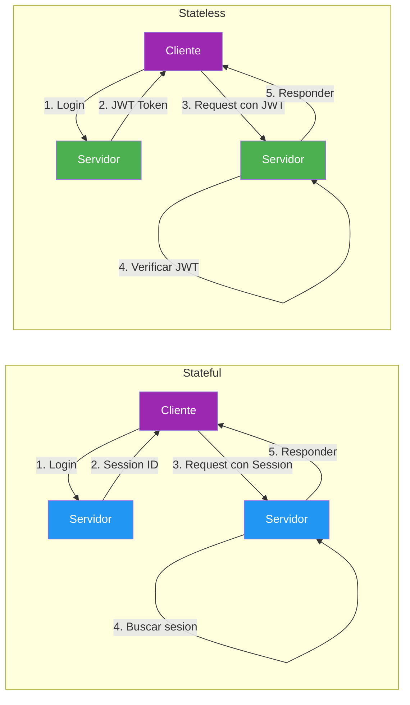

| Aspecto | Stateful (Sesion) | Stateless (JWT) |
|---------|-------------------|-----------------|
| **Almacenamiento** | Sesion en servidor | Token en cliente |
| **Escalabilidad** | Dificil (sticky sessions) | Facil (cualquier servidor) |
| **Rendimiento** | Lookup de sesion en cada request | Verificacion de firma local |
| **Memoria del servidor** | Crece con usuarios | Constante |
| **Mobile/API** | Complicado (cookies) | Natural (header Bearer) |
| **Revocacion** | Inmediata (borrar sesion) | Dificil (esperar expiracion) |

> 💡 **Consejo:** Para APIs REST que sirven a clientes SPA, moviles o microservicios, **stateless con JWT** es casi siempre la mejor opcion. Las sesiones stateful son utiles en aplicaciones Razor Pages o Blazor Server donde el navegador maneja las cookies automaticamente.

### 16.1.3. Por qué JWT para APIs

**JWT (JSON Web Token)** es el estandar de facto para autenticacion en APIs REST. Las razones:

1. **Autocontenido**: El token lleva toda la informacion (claims) dentro
2. **Firado criptograficamente**: No se puede falsificar sin la clave secreta
3. **Sin estado**: El servidor no necesita almacenar nada para validar
4. **Interoperable**: Funciona entre diferentes lenguajes y plataformas
5. **Estandar**: Basado en RFC 7519, soportado por todas las frameworks

📌 Ejemplo real: **Stripe** usa JWT para autenticar las llamadas a su API de pagos. Cada peticion de un cliente lleva un token Bearer que Stripe valida localmente sin consultar una base de datos.

### 16.1.4. Flujo Completo de Autenticacion

El flujo de autenticacion se repite en cada peticion. La diferencia con sesiones es que el servidor NO almacena nada: el token es autocontenido y se valida unicamente con la clave secreta.

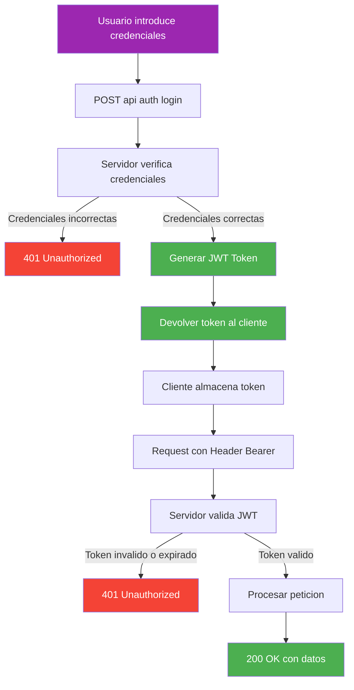

> 📝 **Nota:** Este flujo es identico para el enfoque manual y para Identity. Lo que cambia es como se genera el token y como se gestiona el usuario, pero el ciclo de vida del token es el mismo.

#### Flujo positivo: Login exitoso

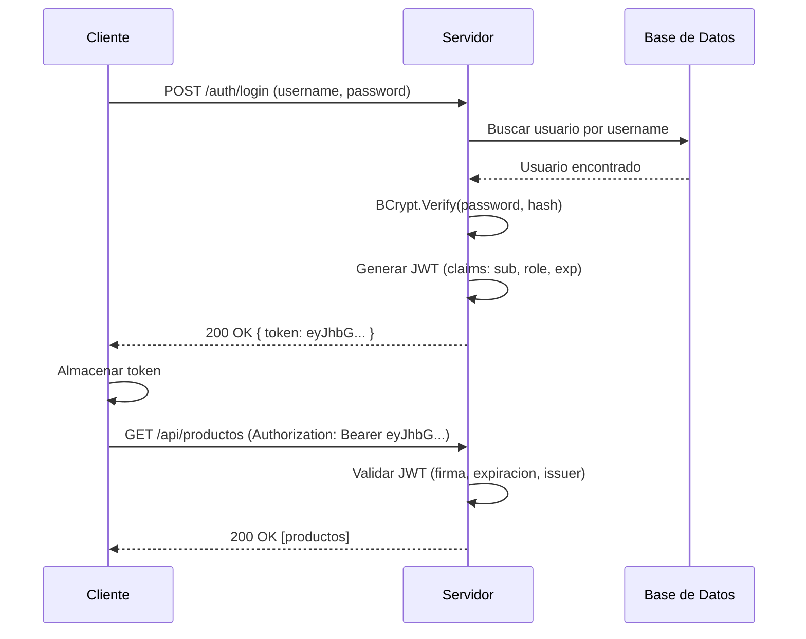

#### Flujo negativo: Credenciales invalidas

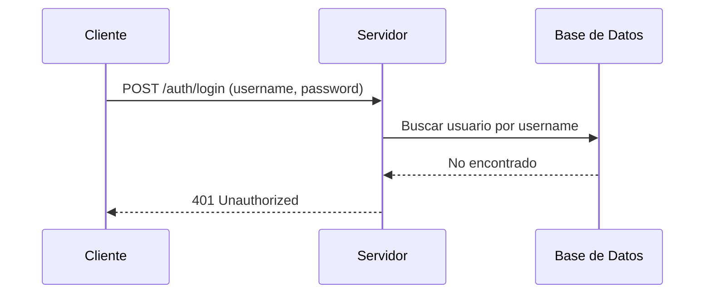

#### Flujo negativo: Token expirado

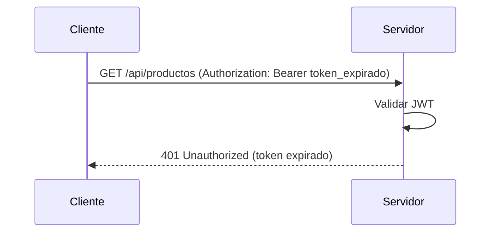

#### Flujo negativo: Token falsificado

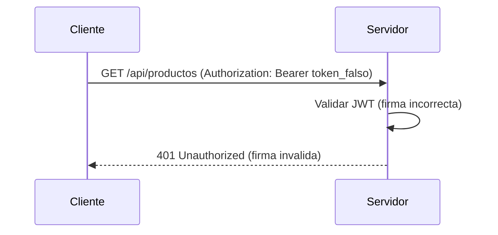

## 16.2. JWT en Profundidad

### 16.2.1. Estructura del JWT

Un JWT se compone de **tres partes** separadas por puntos: `HEADER.PAYLOAD.SIGNATURE`. Cada parte esta codificada en Base64Url, lo que la hace legible pero no cifrada.

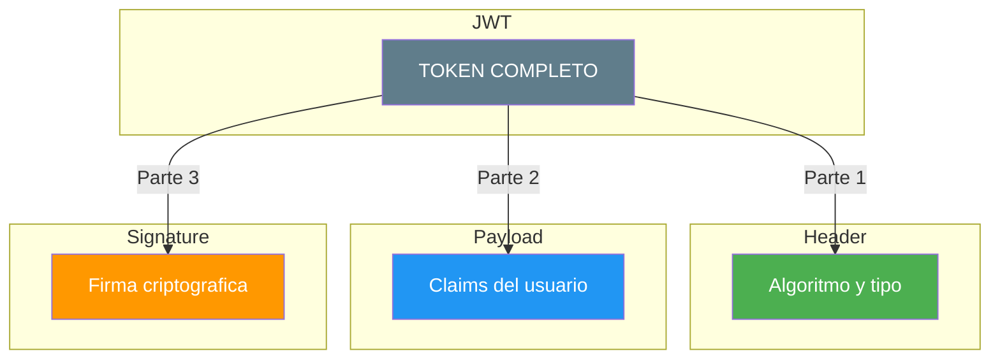

**Header** — Define el algoritmo de firma y tipo de token. Es un JSON con dos campos obligatorios:

```json
{
  "alg": "HS256",
  "typ": "JWT"
}
```

**Payload** — Contiene los claims (informacion del usuario). Aqui es donde metemos la informacion que necesitamos: ID, email, rol, expiracion, etc. Recuerda: el payload NO esta cifrado, solo codificado en Base64Url. Cualquiera puede leerlo.

```json
{
  "sub": "1",
  "name": "Juan Garcia",
  "email": "juan@email.com",
  "role": "ADMIN",
  "iat": 1700000000,
  "exp": 1700000900
}
```

**Signature** — Firma criptografica que garantiza la integridad del token. Se calcula combinando el header, el payload y una clave secreta. Si alguien modifica el payload, la firma no coincidira.

```csharp
var key = new SymmetricSecurityKey(Encoding.UTF8.GetBytes(secretKey));
var creds = new SigningCredentials(key, SecurityAlgorithms.HmacSha256);

var token = new JwtSecurityToken(
    issuer: "MiApi",
    audience: "MiApiClients",
    claims: userClaims,
    expires: DateTime.UtcNow.AddMinutes(15),
    signingCredentials: creds
);
```

> ⚠️ **Advertencia:** El payload de un JWT **NO esta cifrado**, solo codificado en Base64Url. Cualquiera puede leerlo. **Nunca** incluyas informacion sensible (contrasenas, numeros de tarjeta) en el payload. Solo incluye claims que no sean secretos.

> 💡 **Analogia:** Un JWT es como un **carnet de identidad con fecha de caducidad**. El header es el formato del carnet (tipo de documento), el payload son tus datos (nombre, DNI, rol), y la firma es el holograma que impide falsificarlo. El carnet es válido mientras no esté caducado y el holograma sea auténtico. Si alguien intenta cambiar tu nombre en el carnet, el holograma se rompe y el portero lo detecta.

```csharp
// ❌ MALO: JWT sin validar issuer ni audience — aceptaria tokens de cualquier emisor
options.TokenValidationParameters = new TokenValidationParameters
{
    ValidateIssuer = false,      // ¡Cualquier servidor podria emitir tokens validos!
    ValidateAudience = false,    // ¡Cualquier app podria usar el token!
    ValidateIssuerSigningKey = false
};

// ✅ BUENO: JWT validando issuer, audience y signing key — solo acepta tokens de tu servidor
options.TokenValidationParameters = new TokenValidationParameters
{
    ValidateIssuer = true,
    ValidIssuer = jwtSettings["Issuer"],
    ValidateAudience = true,
    ValidAudience = jwtSettings["Audience"],
    ValidateIssuerSigningKey = true,
    IssuerSigningKey = new SymmetricSecurityKey(
        Encoding.UTF8.GetBytes(secretKey)),
    ValidateLifetime = true,
    ClockSkew = TimeSpan.Zero
};
```

### 16.2.2. Claims

Los **claims** son pares clave-valor que transportan informacion sobre el usuario y el token. Es como el contenido de tu DNI: datos identificativos y metadatos.

| Claim | Nombre | Descripcion |
|-------|--------|-------------|
| `sub` | Subject | Identificador principal del usuario (ID) |
| `iss` | Issuer | Quien emite el token |
| `aud` | Audience | Para quien esta destinado el token |
| `exp` | Expiration | Fecha de expiracion (Unix timestamp) |
| `nbf` | Not Before | Fecha a partir de la cual es valido |
| `iat` | Issued At | Fecha de emision del token |
| `jti` | JWT ID | Identificador unico del token |

Claims personalizados que anadimos nosotros:

```csharp
var claims = new List<Claim>
{
    new(JwtRegisteredClaimNames.Sub, user.Id.ToString()),
    new(JwtRegisteredClaimNames.Email, user.Email),
    new(JwtRegisteredClaimNames.Jti, Guid.NewGuid().ToString()),
    new(JwtRegisteredClaimNames.Iat,
        DateTimeOffset.UtcNow.ToUnixTimeSeconds().ToString(),
        ClaimValueTypes.Integer64),
    new("username", user.Username),
    new("role", user.Role),
    new("displayName", $"{user.FirstName} {user.LastName}")
};
```

> 📝 **Nota:** El claim `sub` es el estandar para el identificador del usuario. Usar `user.Id` como valor de `sub` permite al servidor identificar al usuario en cada peticion sin consultar la base de datos.

### 16.2.3. Validacion de Tokens

Cuando un servidor recibe un JWT, debe validar multiples aspectos antes de aceptarlo. Esto es como un policia que comprueba que tu DNI no este caducado, que sea autentico y que corresponda a la persona que lo presenta.

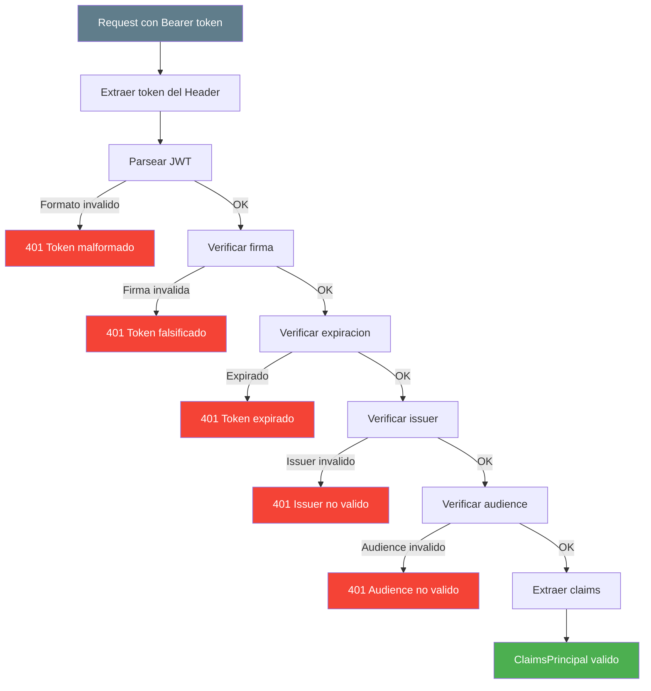

La validacion en ASP.NET Core se configura con `TokenValidationParameters`. Este objeto le dice al middleware que aspectos del token debe comprobar y con que valores esperados.

```csharp
options.TokenValidationParameters = new TokenValidationParameters
{
    ValidateIssuer = true,
    ValidIssuer = jwtSettings["Issuer"],
    ValidateAudience = true,
    ValidAudience = jwtSettings["Audience"],
    ValidateIssuerSigningKey = true,
    IssuerSigningKey = new SymmetricSecurityKey(
        Encoding.UTF8.GetBytes(secretKey)),
    ValidateLifetime = true,
    ClockSkew = TimeSpan.Zero
};
```

> 💡 **Consejo:** Establecer `ClockSkew = TimeSpan.Zero` elimina la tolerancia de 5 minutos por defecto. Si el token expira a las 12:00:00, se considera expirado exactamente a las 12:00:00. Sin esto, un token expirado seguiria siendo valido durante 5 minutos mas.

## 16.3. BCrypt: Hash de Contrasenas

### 16.3.1. Por qué no MD5 ni SHA256

Almacenar contrasenas en texto plano es un error gravisisimo. Pero **¿por qué no usar MD5 o SHA256?** La razon es simple: velocidad. MD5 y SHA256 son rapidos a proposito, lo que los hace ideales para verificar integridad de archivos pero terribles para contrasenas. Un atacante con una GPU puede probar miles de millones de combinaciones por segundo.

| Algoritmo | Velocidad | Problema |
|-----------|-----------|----------|
| **MD5** | ~50.000 millones/segundo | Se puede probar un diccionario entero en segundos |
| **SHA256** | ~10.000 millones/segundo | Igual de rapido, igual de vulnerable |
| **BCrypt** | ~17.000/segundo | Disenado para ser **lento** intencionadamente |

📌 Ejemplo real: Un servidor con una GPU moderna puede calcular **50.000 millones de hashes MD5 por segundo**. Con BCrypt, solo puede calcular **17.000 por segundo**. La diferencia es abismal.

> 📝 **Nota:** MD5 y SHA256 son excelentes para verificar integridad de archivos, pero **nunca** para contrasenas. La velocidad es una virtud para integridad, pero un defecto para passwords.

### 16.3.2. BCrypt en C#

El paquete `BCrypt.Net-Next` proporciona las dos operaciones fundamentales: hashear una contrasena y verificar si una contrasena coincide con un hash.

```csharp
using BCrypt.Net;

// Registrar usuario: hashear la contrasena
string password = "MiContrasena123!";
string hash = BCrypt.Net.BCrypt.HashPassword(password, workFactor: 11);
// Resultado: "$2y$11$N9qo8uLOickgx2ZMRZoMye..."
// El hash incluye: algoritmo + work factor + salt + hash

// Login: verificar la contrasena
bool isValid = BCrypt.Net.BCrypt.Verify(password, hash);
// true si coincide, false si no
```

> 💡 **Analogia:** BCrypt es como una **maquina de picar carne que siempre produce resultados diferentes**. Cada vez que introduces la misma pie de carne (contraseña), la máquina añade sal (salt) antes de picarla, así que el resultado final (hash) es siempre distinto. Para verificar si una contraseña es correcta, pasas la nueva pie por la misma máquina con el mismo salt y comparas el resultado. Un atacante no puede simplemente "deshacer" el picado para recuperar la carne original.

```csharp
// ❌ MALO: Almacenar contraseña en texto plano — si hackean la BD, todos los usuarios quedan comprometidos
public class Usuario
{
    public string Email { get; set; } = string.Empty;
    public string Password { get; set; } = string.Empty;  // ¡NUNCA hacer esto!
}

// ✅ BUENO: Almacenar hash con BCrypt —即使 hackean la BD, las contraseñas son irrecuperables
public class Usuario
{
    public string Email { get; set; } = string.Empty;
    public string PasswordHash { get; set; } = string.Empty;  // BCrypt hash con salt
}

// Registro: hashear antes de guardar
var usuario = new Usuario
{
    Email = request.Email,
    PasswordHash = BCrypt.Net.BCrypt.HashPassword(request.Password, workFactor: 11)
};

// Login: verificar con BCrypt.Verify
bool esValido = BCrypt.Net.BCrypt.Verify(request.Password, usuario.PasswordHash);
```

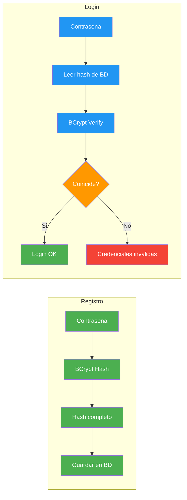

> 💡 **Analogia:** BCrypt es como un molino de cafe. Cuando registras una contrasena, la pasas por el molino 11 veces (work factor 11) para obtener el polvo (hash). Verificar es pasar el cafe por el mismo molino y comparar. Un atacante tendria que moler cada contrasena 11 veces para intentar adivinarla.

### 16.3.3. Work Factor

El **work factor** determina cuantas iteraciones se realizan. Cada incremento **duplica** el tiempo de calculo. Es como subir la dificultad de un juego: cada nivel es el doble de dificil que el anterior.

| Work Factor | Iteraciones | Tiempo aprox. | Uso recomendado |
|-------------|-------------|---------------|-----------------|
| 8 | 256 | ~10ms | Desarrollo/pruebas |
| 10 | 1.024 | ~40ms | Testing |
| **11** | **2.048** | **~100ms** | **Produccion (recomendado)** |
| 12 | 4.096 | ~200ms | Alta seguridad |

```csharp
// Produccion: work factor 11 (~100ms por hash)
string hash = BCrypt.Net.BCrypt.HashPassword(password, workFactor: 11);
```

> 💡 **Consejo:** Un work factor de **11** es el punto optimo: lo suficientemente lento para impedir fuerza bruta (~100ms), pero lo suficientemente rapido para no afectar la experiencia de usuario en login.

### 16.3.4. Comparativa de Algoritmos

| Algoritmo | Velocidad hash | Resistencia rainbow tables | Salt automatico | Recomendado |
|-----------|----------------|---------------------------|-----------------|-------------|
| **MD5** | Muy rapido | Baja | No | Nunca |
| **SHA256** | Rapido | Media | No | Nunca para passwords |
| **PBKDF2** | Lento (configurable) | Buena | Si | Aceptable |
| **BCrypt** | Lento (work factor) | Excelente | Si | Recomendado |
| **Argon2** | Muy lento | Excelente | Si | El mejor (ganador PHC) |

> 📝 **Nota:** BCrypt genera un salt unico automaticamente en cada hash. No necesitas almacenar el salt por separado: esta incrustado en el propio hash. Esto protege contra ataques de rainbow tables, donde un atacante usa tablas precalculadas de hashes comunes.

## 16.4. Enfoque Manual (Estilo Tienda)

Este enfoque implementa autenticacion JWT completa **sin usar ASP.NET Core Identity**. Es mas ligero, mas flexible y ideal para APIs REST donde quieres control total sobre el modelo de usuario y la generacion de tokens.

### 16.4.1. Modelo de Usuario

El modelo de usuario es la base de todo el sistema de autenticacion. Almacena el hash de la contrasena (nunca la contrasena en texto plano), el rol y metadatos de sesion. El campo `PasswordHash` contiene el resultado de BCrypt, que incluye el algoritmo, el work factor, el salt y el hash.

```csharp
using System.ComponentModel.DataAnnotations;

namespace FunkoApi.Models;

/// <summary>
/// Usuario del sistema con autenticacion JWT.
/// </summary>
public class User
{
    public long Id { get; set; }

    [Required]
    [MaxLength(255)]
    public string Username { get; set; } = string.Empty;

    [Required]
    [MaxLength(255)]
    public string Email { get; set; } = string.Empty;

    [Required]
    [MaxLength(255)]
    public string PasswordHash { get; set; } = string.Empty;

    /// <summary>Rol del usuario: USER o ADMIN</summary>
    [MaxLength(50)]
    public string Role { get; set; } = "USER";

    public bool IsDeleted { get; set; }
    public DateTime CreatedAt { get; set; } = DateTime.UtcNow;
    public DateTime? LastLoginAt { get; set; }
    public string? RefreshToken { get; set; }
    public DateTime? RefreshTokenExpiry { get; set; }
}

/// <summary>
/// Constantes para los roles de usuario.
/// </summary>
public static class UserRoles
{
    public const string ADMIN = "ADMIN";
    public const string USER = "USER";
}
```

> ⚠️ **Advertencia:** **Nunca** almacenes la contrasena en texto plano. Si tu base de datos se filtra, todos los usuarios quedan comprometidos. BCrypt transforma la contrasena en un hash unidireccional: no se puede revertir para obtener la original.

### 16.4.2. JwtService

El `JwtService` es responsable de generar tokens JWT, generar refresh tokens y validar tokens existentes. Es como una maquina de firmar documentos: solo quien tiene la clave secreta puede crear tokens validos.

```csharp
using System.IdentityModel.Tokens.Jwt;
using System.Security.Claims;
using System.Security.Cryptography;
using System.Text;
using Microsoft.IdentityModel.Tokens;

namespace FunkoApi.Services;

/// <summary>
/// Servicio para generacion y validacion de JWT tokens.
/// </summary>
public class JwtService(IConfiguration configuration)
{
    private readonly string _secretKey = configuration["Jwt:Secret"]
        ?? throw new InvalidOperationException("JWT Secret no configurado");
    private readonly string _issuer = configuration["Jwt:Issuer"] ?? "FunkoApi";
    private readonly string _audience = configuration["Jwt:Audience"] ?? "FunkoApiClients";
    private readonly int _accessTokenExpiryMinutes = configuration.GetValue<int>("Jwt:ExpirationMinutes", 15);
    private readonly int _refreshTokenExpiryDays = configuration.GetValue<int>("Jwt:RefreshTokenExpiryDays", 7);

    /// <summary>
    /// Genera un JWT access token para el usuario dado.
    /// </summary>
    public string GenerateToken(User user)
    {
        var key = new SymmetricSecurityKey(Encoding.UTF8.GetBytes(_secretKey));
        var creds = new SigningCredentials(key, SecurityAlgorithms.HmacSha256);

        var claims = new List<Claim>
        {
            new(JwtRegisteredClaimNames.Sub, user.Id.ToString()),
            new(JwtRegisteredClaimNames.Email, user.Email),
            new(JwtRegisteredClaimNames.Jti, Guid.NewGuid().ToString()),
            new(JwtRegisteredClaimNames.Iat,
                DateTimeOffset.UtcNow.ToUnixTimeSeconds().ToString(),
                ClaimValueTypes.Integer64),
            new("username", user.Username),
            new("role", user.Role)
        };

        var token = new JwtSecurityToken(
            issuer: _issuer,
            audience: _audience,
            claims: claims,
            expires: DateTime.UtcNow.AddMinutes(_accessTokenExpiryMinutes),
            signingCredentials: creds
        );

        return new JwtSecurityTokenHandler().WriteToken(token);
    }

    /// <summary>
    /// Genera un refresh token aleatorio de 32 bytes.
    /// </summary>
    public string GenerateRefreshToken()
    {
        var randomNumber = new byte[32];
        using var rng = RandomNumberGenerator.Create();
        rng.GetBytes(randomNumber);
        return Convert.ToBase64String(randomNumber)
            .Replace("/", "_")
            .Replace("+", "-");
    }

    /// <summary>
    /// Valida un JWT token y devuelve el ClaimsPrincipal o null.
    /// </summary>
    public ClaimsPrincipal? ValidateToken(string token)
    {
        var tokenHandler = new JwtSecurityTokenHandler();

        try
        {
            var key = new SymmetricSecurityKey(Encoding.UTF8.GetBytes(_secretKey));

            var principal = tokenHandler.ValidateToken(token, new TokenValidationParameters
            {
                ValidateIssuer = true,
                ValidIssuer = _issuer,
                ValidateAudience = true,
                ValidAudience = _audience,
                ValidateIssuerSigningKey = true,
                IssuerSigningKey = key,
                ValidateLifetime = true,
                ClockSkew = TimeSpan.Zero
            }, out _);

            return principal;
        }
        catch
        {
            return null;
        }
    }
}
```

### 16.4.3. AuthService

El `AuthService` orquesta el proceso de login y registro. En el registro, hashea la contrasena con BCrypt antes de guardarla. En el login, verifica la contrasena contra el hash almacenado usando `BCrypt.Verify`. Tambien genera los tokens JWT y refresh tokens para la respuesta.

```csharp
using BCrypt.Net;

namespace FunkoApi.Services;

/// <summary>
/// DTO para respuesta de autenticacion con tokens.
/// </summary>
public record AuthResponse(
    string AccessToken,
    string RefreshToken,
    string TokenType,
    int ExpiresIn,
    long UserId,
    string Username,
    string Role);

/// <summary>
/// DTO para solicitud de login.
/// </summary>
public record LoginRequest(string Email, string Password);

/// <summary>
/// DTO para solicitud de registro.
/// </summary>
public record SignupRequest(string Username, string Email, string Password);

/// <summary>
/// Servicio de autenticacion con BCrypt y JWT.
/// </summary>
public class AuthService(
    IUserRepository userRepository,
    JwtService jwtService,
    ILogger<AuthService> logger)
{
    /// <summary>
    /// Registra un usuario nuevo con contrasena hasheada con BCrypt.
    /// </summary>
    public async Task<AuthResponse> SignupAsync(SignupRequest request)
    {
        var existing = await userRepository.FindByEmailAsync(request.Email);
        if (existing != null)
        {
            throw new InvalidOperationException("El email ya esta registrado");
        }

        var user = new User
        {
            Username = request.Username,
            Email = request.Email,
            PasswordHash = BCrypt.Net.BCrypt.HashPassword(request.Password, workFactor: 11),
            Role = UserRoles.USER,
            CreatedAt = DateTime.UtcNow
        };

        user = await userRepository.CreateAsync(user);

        logger.LogInformation("Usuario registrado: {UserId} ({Username})", user.Id, user.Username);

        return new AuthResponse(
            jwtService.GenerateToken(user),
            jwtService.GenerateRefreshToken(),
            "Bearer",
            15 * 60,
            user.Id,
            user.Username,
            user.Role);
    }

    /// <summary>
    /// Autentica un usuario con email y contrasena.
    /// </summary>
    public async Task<AuthResponse> LoginAsync(string email, string password)
    {
        var user = await userRepository.FindByEmailAsync(email);
        if (user == null || user.IsDeleted)
        {
            throw new UnauthorizedAccessException("Credenciales invalidas");
        }

        if (!BCrypt.Net.BCrypt.Verify(password, user.PasswordHash))
        {
            logger.LogWarning("Intento de login fallido para: {Email}", email);
            throw new UnauthorizedAccessException("Credenciales invalidas");
        }

        user.LastLoginAt = DateTime.UtcNow;
        await userRepository.UpdateAsync(user);

        logger.LogInformation("Login exitoso: {UserId} ({Username})", user.Id, user.Username);

        return new AuthResponse(
            jwtService.GenerateToken(user),
            jwtService.GenerateRefreshToken(),
            "Bearer",
            15 * 60,
            user.Id,
            user.Username,
            user.Role);
    }
}
```

### 16.4.4. Configuracion en DI

La clase `AuthenticationConfig` centraliza toda la configuracion de autenticacion y autorizacion usando el patron de extension methods. Esto mantiene el `Program.cs` limpio y permite reutilizar la configuracion en tests.

```csharp
using System.Text;
using Microsoft.AspNetCore.Authentication.JwtBearer;
using Microsoft.IdentityModel.Tokens;

namespace FunkoApi.Infrastructure;

/// <summary>
/// Configuracion de autenticacion y autorizacion estilo Tienda.
/// Extension method para registrar servicios de autenticacion JWT.
/// </summary>
public static class AuthenticationConfig
{
    public static IServiceCollection AddAuthenticationJwt(
        this IServiceCollection services,
        IConfiguration configuration)
    {
        var jwtSection = configuration.GetSection("Jwt");
        var secretKey = jwtSection["Secret"]
            ?? throw new InvalidOperationException("JWT Secret no configurado");

        services.AddAuthentication(options =>
        {
            options.DefaultAuthenticateScheme = JwtBearerDefaults.AuthenticationScheme;
            options.DefaultChallengeScheme = JwtBearerDefaults.AuthenticationScheme;
            options.DefaultScheme = JwtBearerDefaults.AuthenticationScheme;
        })
        .AddJwtBearer(options =>
        {
            options.TokenValidationParameters = new TokenValidationParameters
            {
                ValidateIssuer = true,
                ValidIssuer = jwtSection["Issuer"],
                ValidateAudience = true,
                ValidAudience = jwtSection["Audience"],
                ValidateIssuerSigningKey = true,
                IssuerSigningKey = new SymmetricSecurityKey(
                    Encoding.UTF8.GetBytes(secretKey)),
                ValidateLifetime = true,
                ClockSkew = TimeSpan.Zero
            };

            options.Events = new JwtBearerEvents
            {
                OnTokenValidated = context =>
                {
                    var logger = context.HttpContext.RequestServices
                        .GetRequiredService<ILogger<Program>>();
                    logger.LogDebug("Token validado para: {User}",
                        context.Principal?.Identity?.Name);
                    return Task.CompletedTask;
                },
                OnAuthenticationFailed = context =>
                {
                    var logger = context.HttpContext.RequestServices
                        .GetRequiredService<ILogger<Program>>();
                    logger.LogWarning("Fallo de autenticacion: {Message}",
                        context.Exception.Message);
                    return Task.CompletedTask;
                }
            };
        });

        services.AddAuthorizationBuilder()
            .AddPolicy("AdminOnly", policy =>
                policy.RequireRole(UserRoles.ADMIN))
            .AddPolicy("UserOrAdmin", policy =>
                policy.RequireRole(UserRoles.USER, UserRoles.ADMIN));

        services.AddScoped<JwtService>();
        services.AddScoped<AuthService>();

        return services;
    }
}
```

> 💡 **Consejo:** El patron de extension methods para configurar servicios es muy comun en proyectos ASP.NET Core. Cada concern de DI tiene su propia clase: `RepositoriesConfig`, `ServicesConfig`, `AuthenticationConfig`. Esto mantiene el `Program.cs` limpio y facilita los tests.

### 16.4.5. AuthController

El controller de autenticacion expone los endpoints de login, signup y perfil de usuario. Usa el atributo `[Authorize]` para proteger el endpoint `me` y los atributos `[ProducesResponseType]` para documentar las respuestas posibles en Swagger.

```csharp
using Microsoft.AspNetCore.Authorization;
using Microsoft.AspNetCore.Mvc;

namespace FunkoApi.Controllers;

/// <summary>
/// Controller de autenticacion: login, signup y perfil de usuario.
/// </summary>
[ApiController]
[Route("api/auth")]
public class AuthController(AuthService authService) : ControllerBase
{
    /// <summary>
    /// Registra un usuario nuevo.
    /// </summary>
    [HttpPost("signup")]
    [ProducesResponseType(typeof(AuthResponse), StatusCodes.Status201Created)]
    [ProducesResponseType(typeof(ProblemDetails), StatusCodes.Status409Conflict)]
    public async Task<IActionResult> Signup([FromBody] SignupRequest request)
    {
        try
        {
            var result = await authService.SignupAsync(request);
            return CreatedAtAction(nameof(GetCurrentUser), new { }, result);
        }
        catch (InvalidOperationException ex)
        {
            return Conflict(new ProblemDetails
            {
                Title = "Conflicto",
                Detail = ex.Message,
                Status = StatusCodes.Status409Conflict
            });
        }
    }

    /// <summary>
    /// Inicia sesion y devuelve un JWT token.
    /// </summary>
    [HttpPost("login")]
    [ProducesResponseType(typeof(AuthResponse), StatusCodes.Status200OK)]
    [ProducesResponseType(typeof(ProblemDetails), StatusCodes.Status401Unauthorized)]
    public async Task<IActionResult> Login([FromBody] LoginRequest request)
    {
        try
        {
            var result = await authService.LoginAsync(request.Email, request.Password);
            return Ok(result);
        }
        catch (UnauthorizedAccessException ex)
        {
            return Unauthorized(new ProblemDetails
            {
                Title = "No autorizado",
                Detail = ex.Message,
                Status = StatusCodes.Status401Unauthorized
            });
        }
    }

    /// <summary>
    /// Devuelve el usuario autenticado actual.
    /// </summary>
    [Authorize]
    [HttpGet("me")]
    [ProducesResponseType(typeof(object), StatusCodes.Status200OK)]
    [ProducesResponseType(StatusCodes.Status401Unauthorized)]
    public IActionResult GetCurrentUser()
    {
        return Ok(new
        {
            Id = User.FindFirst("sub")?.Value,
            Username = User.FindFirst("username")?.Value,
            Email = User.FindFirst("email")?.Value,
            Role = User.FindFirst("role")?.Value
        });
    }
}
```

### 16.4.6. Program.cs

El `Program.cs` registra la autenticacion JWT y configura los middleware en el orden correcto. El orden de `UseAuthentication()` y `UseAuthorization()` es critico: si los inviertes, la autorizacion no funcionara porque no habra identidad que verificar.

```csharp
using FunkoApi.Infrastructure;

var builder = WebApplication.CreateBuilder(args);

builder.Services.AddControllers();
builder.Services.AddEndpointsApiExplorer();
builder.Services.AddSwaggerGen();

// Autenticacion JWT (ANTES de Authorization)
builder.Services.AddAuthenticationJwt(builder.Configuration);

// Repositorios y servicios
builder.Services.AddScoped<IUserRepository, UserRepository>();

var app = builder.Build();

// Middleware (EL ORDEN IMPORTA)
app.UseAuthentication();  // Primero: quien eres?
app.UseAuthorization();   // Segundo: que puedes hacer?

app.MapControllers();

app.Run();
```

> ⚠️ **Advertencia:** El orden de `UseAuthentication()` y `UseAuthorization()` es **critico**. Si los inviertes, la autorizacion no funcionara porque no habra identidad que verificar. **Siempre** autenticacion primero, autorizacion segundo.

El siguiente diagrama muestra el pipeline de middleware y el orden correcto. Cada request pasa por cada middleware en secuencia. Si `UseAuthentication` no valida el token, `UseAuthorization` no tiene identidad que verificar y deniega todo.

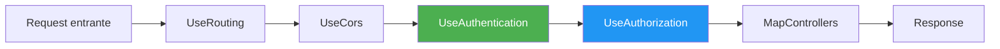

## 16.5. OAuth2 y Autenticacion con Proveedores Externos

### 16.5.1. ¿Qué es OAuth2?

**OAuth2** es un estandar de autorizacion que permite a una aplicacion acceder a recursos de un tercero en nombre del usuario, sin exponer sus credenciales. En vez de que el usuario te de su contrasena de Google, el usuario autoriza a tu app a acceder a ciertos datos de Google.

📌 Ejemplo real: Cuando haces "Iniciar sesion con Google" en cualquier web, no introduces tu contrasena de Google en esa web. Google te redirige a su pagina, tú autorizas, y Google devuelve un token a la web con los permisos que has concedido. Eso es OAuth2.

Los tres actores principales son:

- **Resource Owner**: El usuario (tú)
- **Client**: Tu aplicacion (la que quiere acceder)
- **Authorization Server**: El proveedor (Google, GitHub, Microsoft)

### 16.5.2. Configuracion con Google

Para configurar login con Google, necesitas crear un proyecto en Google Cloud Console, obtener el Client ID y Client Secret, y registrarlos en tu aplicacion.

```csharp
// En Program.cs
builder.Services.AddAuthentication()
    .AddGoogle(options =>
    {
        options.ClientId = configuration["Google:ClientId"]
            ?? throw new InvalidOperationException("Google ClientId no configurado");
        options.ClientSecret = configuration["Google:ClientSecret"]
            ?? throw new InvalidOperationException("Google ClientSecret no configurado");
        options.CallbackPath = "/signin-google";
    });
```

En `appsettings.json` debes configurar las credenciales:

```json
{
  "Google": {
    "ClientId": "tu-client-id.apps.googleusercontent.com",
    "ClientSecret": "GOCSPX-tu-client-secret"
  }
}
```

> 📝 **Nota:** El `CallbackPath` es la ruta donde Google redirigira despues de que el usuario autorice. ASP.NET Core maneja automaticamente el intercambio de codigo por token y la creacion del ClaimsPrincipal.

### 16.5.3. Configuracion con GitHub

GitHub usa el mismo mecanismo de OAuth2. Primero creas una OAuth App en GitHub Settings, obtienes el Client ID y Client Secret, y lo registras en tu aplicacion.

```csharp
// En Program.cs
builder.Services.AddAuthentication()
    .AddGitHub(options =>
    {
        options.ClientId = configuration["GitHub:ClientId"]
            ?? throw new InvalidOperationException("GitHub ClientId no configurado");
        options.ClientSecret = configuration["GitHub:ClientSecret"]
            ?? throw new InvalidOperationException("GitHub ClientSecret no configurado");
        options.CallbackPath = "/signin-github";
    });
```

> 💡 **Consejo:** Para configurar GitHub, ve a Settings > Developer settings > OAuth Apps > New OAuth App. El campo "Authorization callback URL" debe coincidir con la ruta de callback de tu aplicacion (normalmente `https://tu-dominio/signin-github`).

### 16.5.4. Flow Completo OAuth2

El flujo completo de OAuth2 sigue cuatro pasos: redirigir al proveedor, el usuario autoriza, el proveedor devuelve un codigo, y tu aplicacion intercambia ese codigo por un token de acceso.

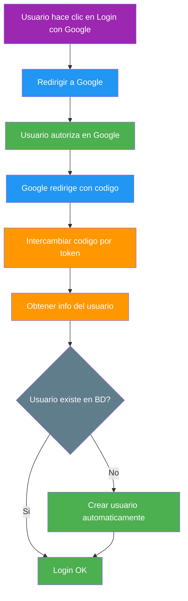

📌 Ejemplo real: **Spotify** usa este flujo exacto. Cuando haces "Conectar con Spotify" en una app de terceros, Spotify te redirige a su pagina de autorizacion, tú eliges que datos compartir (nombre, playlists, etc.), y la app recibe un token con esos permisos.

## 16.6. Enfoque Identity

### 16.6.1. ¿Qué es ASP.NET Core Identity?

**ASP.NET Core Identity** es un framework completo de gestion de usuarios que incluye todo lo necesario para autenticacion y autorizacion: tablas de base de datos, hash de contrasenas, gestion de roles, confirmacion de email, doble factor de autenticacion (2FA), bloqueo por intentos fallidos y login con proveedores externos.

La diferencia principal con el enfoque manual es que Identity te da todo "hecho de serie" pero a cambio pierdes control sobre los detalles. Es como usar un ERP vs construir tu propio sistema: el ERP te ahorra tiempo pero te limita.

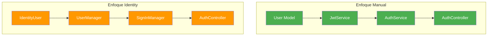

### 16.6.2. Instalacion y Configuracion

Para usar Identity, necesitas instalar los paquetes NuGet correspondientes y configurar el DbContext que herede de `IdentityDbContext`.

```bash
dotnet add package Microsoft.AspNetCore.Identity.EntityFrameworkCore
dotnet add package Microsoft.EntityFrameworkCore.Sqlite
```

El modelo de usuario personalizado hereda de `IdentityUser<long>` y anade campos propios de la aplicacion. El `DbContext` debe heredar de `IdentityDbContext` para que Identity pueda gestionar sus tablas automaticamente.

```csharp
using Microsoft.AspNetCore.Identity;
using Microsoft.AspNetCore.Identity.EntityFrameworkCore;
using Microsoft.EntityFrameworkCore;

namespace FunkoApi.Entity;

/// <summary>
/// Usuario personalizado que hereda de IdentityUser.
/// </summary>
public class User : IdentityUser<long>
{
    [PersonalData]
    public string? FirstName { get; set; }

    [PersonalData]
    public string? LastName { get; set; }

    public DateTime CreatedAt { get; set; } = DateTime.UtcNow;
    public DateTime? LastLoginAt { get; set; }
    public bool IsActive { get; set; } = true;
}

/// <summary>
/// Rol personalizado con descripcion.
/// </summary>
public class Role : IdentityRole<long>
{
    public string? Description { get; set; }
}

/// <summary>
/// DbContext que integra Identity con el modelo de la aplicacion.
/// </summary>
public class AppDbContext(DbContextOptions<AppDbContext> options)
    : IdentityDbContext<User, Role, long>(options)
{
    public DbSet<Funko> Funkos { get; set; } = null!;

    protected override void OnModelCreating(ModelBuilder modelBuilder)
    {
        base.OnModelCreating(modelBuilder);

        // Mapeo de tablas de Identity
        modelBuilder.Entity<User>().ToTable("users");
        modelBuilder.Entity<Role>().ToTable("roles");
        modelBuilder.Entity<IdentityUserClaim<long>>().ToTable("user_claims");
        modelBuilder.Entity<IdentityUserRole<long>>().ToTable("user_roles");
        modelBuilder.Entity<IdentityUserLogin<long>>().ToTable("user_logins");
        modelBuilder.Entity<IdentityUserToken<long>>().ToTable("user_tokens");
        modelBuilder.Entity<IdentityRoleClaim<long>>().ToTable("role_claims");
    }
}
```

La configuracion de Identity en `Program.cs` establece las politicas de contrasena, bloqueo y unicidad de email. Estos parametros se aplican automaticamente a todas las operaciones de `UserManager`.

```csharp
using Microsoft.AspNetCore.Identity;
using FunkoApi.Entity;

builder.Services.AddDbContext<AppDbContext>(options =>
    options.UseSqlite(builder.Configuration.GetConnectionString("Default")));

builder.Services.AddIdentity<User, Role>(options =>
{
    options.Password.RequireDigit = true;
    options.Password.RequireLowercase = true;
    options.Password.RequireUppercase = true;
    options.Password.RequireNonAlphanumeric = false;
    options.Password.RequiredLength = 8;
    options.User.RequireUniqueEmail = true;
    options.Lockout.DefaultLockoutTimeSpan = TimeSpan.FromMinutes(15);
    options.Lockout.MaxFailedAccessAttempts = 5;
})
.AddEntityFrameworkStores<AppDbContext>()
.AddDefaultTokenProviders();
```

> 📝 **Nota:** Identity crea automaticamente 7 tablas en la base de datos: `AspNetUsers`, `AspNetRoles`, `AspNetUserClaims`, `AspNetUserRoles`, `AspNetUserLogins`, `AspNetUserTokens` y `AspNetRoleClaims`. Con `ToTable()` puedes cambiarles el nombre.

> ⚠️ **Advertencia: Un solo DbContext para Identity y datos de negocio**
>
> Error comun: usar **dos DbContexts separados** (uno para Identity, otro para productos, etc.) apuntando a la **misma base de datos**. Esto falla porque `EnsureCreatedAsync()` solo crea tablas cuando la BD no existe. Si un DbContext crea la BD primero, el otro encuentra la BD ya existente y **no crea sus tablas**.
>
> **Solucion:** Usar un **unico DbContext** que herede de `IdentityDbContext` e incluya todas las entidades de la aplicacion:
>
> ```csharp
> // ❌ MALO: Dos contexts para la misma BD
> public class AuthDbContext : IdentityDbContext<AppUser, IdentityRole<long>, long> { ... }
> public class AppDbContext : DbContext { ... } // Productos, Categorias...
>
> // ✅ BUENO: Un solo context para todo
> public class AppDbContext : IdentityDbContext<AppUser, IdentityRole<long>, long>
> {
>     public DbSet<Producto> Productos => Set<Producto>();
>     public DbSet<Categoria> Categorias => Set<Categoria>();
> }
> ```
>
> Si necesitas **dos bases de datos separadas** (una para Identity, otra para negocio), ahi si tiene sentido usar dos DbContexts con **connection strings diferentes**.

### 16.6.3. UserManager y SignInManager

`UserManager<T>` y `SignInManager<T>` son los servicios centrales de Identity. `UserManager` gestiona CRUD de usuarios (crear, buscar, actualizar, eliminar, gestionar roles). `SignInManager` gestiona las operaciones de login (verificar contrasena, bloqueo, login externo).

```csharp
using Microsoft.AspNetCore.Authorization;
using Microsoft.AspNetCore.Identity;
using Microsoft.AspNetCore.Mvc;

namespace FunkoApi.Controllers;

/// <summary>
/// Controller de autenticacion usando ASP.NET Core Identity.
/// </summary>
[ApiController]
[Route("api/auth")]
public class AuthIdentityController(
    UserManager<User> userManager,
    SignInManager<User> signInManager) : ControllerBase
{
    /// <summary>
    /// Registra un usuario nuevo con Identity.
    /// </summary>
    [HttpPost("signup")]
    public async Task<IActionResult> Signup([FromBody] SignupRequest request)
    {
        var user = new User
        {
            UserName = request.Username,
            Email = request.Email,
            FirstName = request.Username
        };

        var result = await userManager.CreateAsync(user, request.Password);

        if (!result.Succeeded)
        {
            return BadRequest(new ProblemDetails
            {
                Title = "Error de registro",
                Detail = string.Join(", ", result.Errors.Select(e => e.Description)),
                Status = StatusCodes.Status400BadRequest
            });
        }

        await userManager.AddToRoleAsync(user, UserRoles.USER);

        return CreatedAtAction(nameof(GetCurrentUser), new { }, new
        {
            user.Id,
            user.UserName,
            user.Email
        });
    }

    /// <summary>
    /// Inicia sesion y genera un JWT token.
    /// </summary>
    [HttpPost("login")]
    public async Task<IActionResult> Login([FromBody] LoginRequest request)
    {
        var user = await userManager.FindByEmailAsync(request.Email);
        if (user == null)
        {
            return Unauthorized(new ProblemDetails
            {
                Title = "Credenciales invalidas",
                Status = StatusCodes.Status401Unauthorized
            });
        }

        var result = await signInManager.CheckPasswordSignInAsync(
            user, request.Password, lockoutOnFailure: true);

        if (!result.Succeeded)
        {
            return Unauthorized(new ProblemDetails
            {
                Title = "Credenciales invalidas",
                Status = StatusCodes.Status401Unauthorized
            });
        }

        // Generar JWT (usando JwtSecurityTokenHandler directamente)
        var roles = await userManager.GetRolesAsync(user);
        var tokenHandler = new System.IdentityModel.Tokens.Jwt.JwtSecurityTokenHandler();
        // ... generacion del token ...

        return Ok(new { Token = "jwt-token-aqui", UserId = user.Id });
    }

    /// <summary>
    /// Devuelve el usuario autenticado actual.
    /// </summary>
    [Authorize]
    [HttpGet("me")]
    public async Task<IActionResult> GetCurrentUser()
    {
        var user = await userManager.GetUserAsync(User);
        if (user == null) return NotFound();

        var roles = await userManager.GetRolesAsync(user);

        return Ok(new
        {
            user.Id,
            user.UserName,
            user.Email,
            user.FirstName,
            user.LastName,
            Roles = roles,
            user.CreatedAt,
            user.LastLoginAt
        });
    }
}
```

> 💡 **Consejo:** `CheckPasswordSignInAsync` con `lockoutOnFailure: true` bloquea automaticamente al usuario despues de 5 intentos fallidos durante 15 minutos. Esto protege contra ataques de fuerza bruta sin que tu tengas que implementar nada.

### 16.6.4. Identity con JWT

Identity genera contrasenas hasheadas con PBKDF2 por defecto (no BCrypt). Para generar JWT desde Identity, puedes usar `UserManager` para obtener el usuario y los roles, y luego generar el token con `JwtSecurityTokenHandler` o integrarlo con el `JwtService` del enfoque manual.

La ventaja de combinar Identity con JWT es que obtienes la gestion de usuarios de Identity (2FA, lockout, external logins) con la escalabilidad de JWT para APIs REST.

#### Flujo positivo: Login con Identity

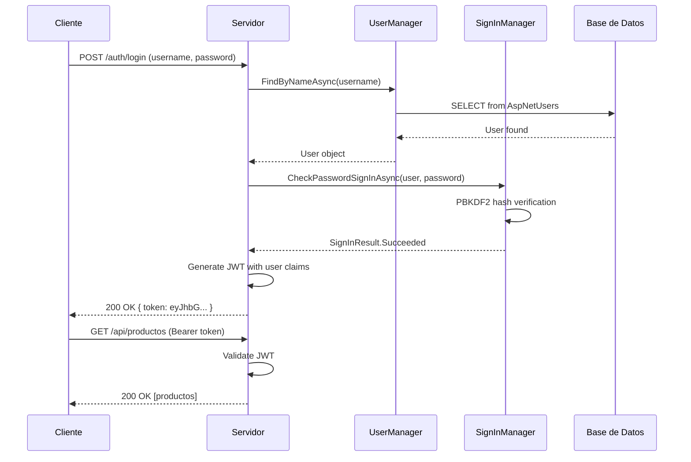

#### Flujo negativo: Identity bloquea usuario

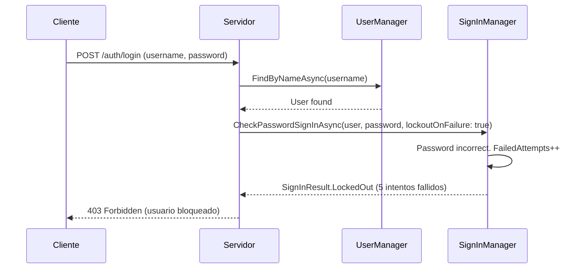

### 16.6.5. Identity con OAuth2 (Login Externo)

Identity integra de forma nativa el login con proveedores externos como Google, GitHub o Microsoft. Esto significa que puedes ofrecer a tus usuarios la opcion de iniciar sesion con su cuenta de Google sin tener que gestionar contrasenas. Identity se encarga automaticamente de crear el usuario la primera vez y de asociar el proveedor externo.

Para configurar Google con Identity, necesitas registrar tu app en la consola de Google Cloud y obtener el ClientId y ClientSecret. Luego, en Program.cs, registras el esquema de autenticacion con `.AddGoogle()` y configuras el Identity para que acepte login externo.

```csharp
// Program.cs - Identity + Google
builder.Services.AddAuthentication(options =>
{
    options.DefaultScheme = IdentityConstants.ApplicationScheme;
    options.DefaultChallengeScheme = GoogleDefaults.AuthenticationScheme;
})
.AddGoogle(GoogleDefaults.AuthenticationScheme, options =>
{
    options.ClientId = configuration["Google:ClientId"]!;
    options.ClientSecret = configuration["Google:ClientSecret"]!;
})
.AddIdentityCookies();

builder.Services.AddAuthorizationBuilder()
    .SetDefaultPolicy(new AuthorizationPolicyBuilder(
        IdentityConstants.ApplicationScheme)
        .RequireAuthenticatedUser()
        .Build());
```

En el `AuthController`, el endpoint de login externo redirige al usuario a Google. Cuando el usuario autoriza, Google redirige de vuelta a tu app con un codigo. Identity intercambia ese codigo por un token y crea o busca el usuario automaticamente.

```csharp
[HttpGet("external-login")]
public IActionResult ExternalLogin(string provider, string? returnUrl = null)
{
    var redirectUrl = Url.Action("ExternalLoginCallback", "Auth",
        new { returnUrl });
    var properties = signInManager
        .ConfigureExternalAuthenticationProperties(provider, redirectUrl);
    return Challenge(properties, provider);
}

[HttpGet("external-login-callback")]
public async Task<IActionResult> ExternalLoginCallback(
    string? returnUrl = null)
{
    var info = await signInManager.GetExternalLoginInfoAsync();
    if (info == null)
        return BadRequest("Error obteniendo informacion del proveedor");

    var result = await signInManager
        .ExternalLoginSignInAsync(info.LoginProvider, info.ProviderKey,
            isPersistent: false, bypassTwoFactor: true);

    if (result.Succeeded)
        return Redirect(returnUrl ?? "/");

    // Primera vez: crear usuario desde los datos del proveedor
    var email = info.Principal.FindFirstValue(ClaimTypes.Email);
    var name = info.Principal.FindFirstValue(ClaimTypes.Name);

    var user = new User { UserName = email, Email = email };
    var createResult = await userManager.CreateAsync(user);
    if (createResult.Succeeded)
    {
        await userManager.AddLoginAsync(user, info);
        await signInManager.SignInAsync(user, isPersistent: false);
        return Redirect(returnUrl ?? "/");
    }

    return BadRequest("Error creando usuario");
}
```

> 📝 **Nota:** Cuando un usuario se registra con Google por primera vez, Identity crea el usuario en tu BD y asocia el proveedor externo. En el segundo login, simplemente lo reconoce. El usuario nunca necesita crear una contrasena local.

## 16.7. Comparacion de Enfoques

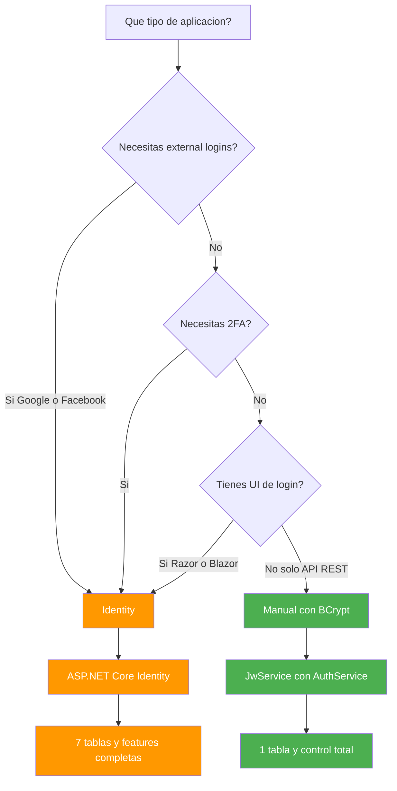

| Aspecto | Manual (JWT + BCrypt) | Identity |
|---------|----------------------|----------|
| **Tablas BD** | 1 tabla (users) | 7+ tablas (AspNetUsers, AspNetRoles, etc.) |
| **Hash de contrasenas** | BCrypt (mas lento = mas seguro) | PBKDF2 (estandar .NET) |
| **External Logins** | Requiere implementacion manual | Integrado (Google, Facebook, etc.) |
| **2FA** | Requiere implementacion manual | Integrado |
| **Confirmacion email** | Requiere implementacion manual | Integrado |
| **Lockout por intentos** | Requiere implementacion manual | Integrado |
| **Flexibilidad** | Total control | Limitado por el framework |
| **Codigo** | ~200 lineas | ~50 lineas (scaffolding) |
| **Curva aprendizaje** | Baja | Media-Alta |
| **Mantenimiento** | Lo mantienes tu | Microsoft mantiene |

| Escenario | Recomendacion | Razon |
|-----------|---------------|-------|
| **API REST simple** | Manual | Ligero, control total, 1 tabla |
| **SPA + API Backend** | Manual | JWT es natural para SPAs |
| **Razor Pages** | Identity | Cookies + UI login integrada |
| **Blazor Server** | Identity | Integracion completa con .NET |
| **Google/Facebook Login** | Identity | External logins incluidos |
| **2FA obligatorio** | Identity | Integrado sin codigo extra |
| **Microservicios** | Manual | Minima sobrecarga por servicio |
| **Auditoria de seguridad** | Identity | Logs y lockout integrados |

> 📝 **Nota:** Ambos enfoques usan el **mismo middleware** de autenticacion/autorizacion de ASP.NET Core. Los atributos `[Authorize]`, `[Authorize(Roles="Admin")]` y la inyeccion de `HttpContext.User` funcionan exactamente igual. Solo cambia como se gestiona el usuario y se genera el token.

## 16.8. Buenas Practicas

| Practica | Descripcion |
|----------|-------------|
| **HTTPS siempre** | Nunca enviar tokens por HTTP en produccion |
| **Secret >= 32 caracteres** | La clave JWT debe ser larga y aleatoria |
| **Expiration corto (15-30 min)** | Access tokens con vida breve para minimizar riesgo |
| **ClockSkew = 0** | Expiracion exacta sin tolerancia de 5 minutos |
| **BCrypt workFactor: 11** | Punto optimo: ~100ms por hash |
| **No localStorage para JWT** | Usar httpOnly cookies o memoria del navegador |
| **Rate limiting en login** | Limitar intentos para evitar fuerza bruta |
| **Refresh tokens** | Renovar access tokens sin re-login |
| **No logear passwords** | Nunca incluir contrasenas en logs |
| **Seed de usuarios** | Crear usuario admin y de prueba en desarrollo |

```csharp
// ❌ MALO: JWT con expiración de 24 horas — si roban el token, tienen acceso todo el día
var token = new JwtSecurityToken(
    expires: DateTime.UtcNow.AddHours(24),  // ¡Muy peligroso!
    signingCredentials: creds
);

// ✅ BUENO: JWT con expiración de 15-30 minutos — ventana de ataque mínima
var token = new JwtSecurityToken(
    expires: DateTime.UtcNow.AddMinutes(15),  // AccessToken de corta vida
    signingCredentials: creds
);
// El refresh token (larga vida) se usa para renovar el access token sin re-login
```

```csharp
// ❌ MALO: Almacenar token en localStorage — vulnerable a XSS
localStorage.setItem("token", jwtToken);  // ¡Cualquier script puede leerlo!

// ✅ BUENO: Usar httpOnly cookies o memoria del navegador — protegido contra XSS
// Opción 1: httpOnly cookie (el navegador la envía automáticamente, JS no puede acceder)
// Opción 2: Variable en memoria del SPA (se pierde al cerrar la pestaña, pero es seguro)
```

> ⚠️ **Advertencia:** **Nunca** almacenes JWT en `localStorage` del navegador. Si un atacante logra inyectar JavaScript (XSS), puede robar el token. Usa **httpOnly cookies** o almacen en memoria del SPA. El `localStorage` es accesible desde cualquier script en la pagina.

> 💡 **Consejo:** Para el seed de usuarios en desarrollo, crea un servicio `SeedService` que se ejecute al iniciar la aplicacion:

```csharp
public static class SeedService
{
    public static async Task SeedAsync(IServiceProvider services)
    {
        using var scope = services.CreateScope();
        var repository = scope.ServiceProvider
            .GetRequiredService<IUserRepository>();

        var existing = await repository.FindByEmailAsync("admin@funko.com");
        if (existing == null)
        {
            await repository.CreateAsync(new User
            {
                Username = "admin",
                Email = "admin@funko.com",
                PasswordHash = BCrypt.Net.BCrypt.HashPassword("admin123", workFactor: 11),
                Role = UserRoles.ADMIN
            });

            await repository.CreateAsync(new User
            {
                Username = "user",
                Email = "user@funko.com",
                PasswordHash = BCrypt.Net.BCrypt.HashPassword("user123", workFactor: 11),
                Role = UserRoles.USER
            });
        }
    }
}
```

## 16.9. Reto

> Implementa autenticacion completa en FunkoApp con ambos enfoques.

**Anade a tu API:**

1. Modelo `User` con `PasswordHash` (BCrypt) — tabla `users` en tu BD
2. **Enfoque Manual:** `JwtService` + `AuthService` + `AuthController` con endpoints `POST /auth/login`, `POST /auth/signup`, `GET /auth/me`
3. **Enfoque Identity:** `IdentityDbContext` + `UserManager<User>` + `SignInManager<User>` + configuracion de roles
4. Endpoints: `POST /auth/login`, `POST /auth/signup`, `GET /auth/me`
5. Configuracion JWT en `appsettings.json` (`Jwt:Secret`, `Jwt:Issuer`, `Jwt:Audience`, `Jwt:ExpirationMinutes`)
6. Seed de usuarios: admin (`admin@funko.com` / `admin123`) y user (`user@funko.com` / `user123`)
7. Tests: login exitoso, login con credenciales incorrectas, token expirado, acceso sin token

**Puntos extra:**

- Refresh tokens: endpoint `POST /auth/refresh` que renueva el access token
- Rate limiting en login (maximo 5 intentos por minuto por IP)
- Validacion de fortaleza de contrasena (minimo 8 caracteres, mayuscula, minuscula, numero)

**Resumen del punto:**

| Concepto | Descripcion |
|----------|-------------|
| **Autenticacion** | Verificar la identidad del usuario (quien eres) |
| **Stateless** | Cada request contiene toda la informacion de autenticacion |
| **JWT** | Token autocontenido con claims firmados criptograficamente |
| **Header** | Algoritmo de firma (HS256) y tipo (JWT) |
| **Payload** | Claims: sub, exp, iat, role, custom claims |
| **Signature** | Firma HMAC-SHA256 con clave secreta |
| **BCrypt** | Hash lento y seguro para contrasenas |
| **Work Factor** | Nivel de dificultad BCrypt (11 recomendado para produccion) |
| **Enfoque Manual** | JwtService + AuthService, 1 tabla, control total |
| **Enfoque Identity** | ASP.NET Core Identity, 7+ tablas, features completas |
| **Access Token** | Token corto (15-30 min) para acceso a APIs |
| **Refresh Token** | Token largo para renovar access tokens |
| **TokenValidationParameters** | Configuracion de validacion en JwtBearer |
| **ClockSkew** | Tolerancia de tiempo en validacion (0 = expiracion exacta) |
| **OAuth2** | Estandar para login con proveedores externos (Google, GitHub) |

**¿Qué viene después?**

En el siguiente punto veremos **Autorizacion**: una vez que sabemos QUIEN es el usuario (autenticacion), veremos QUE puede hacer. Roles, Claims, Politicas de autorizacion y como proteger endpoints con `[Authorize]`.
