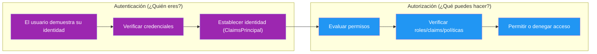
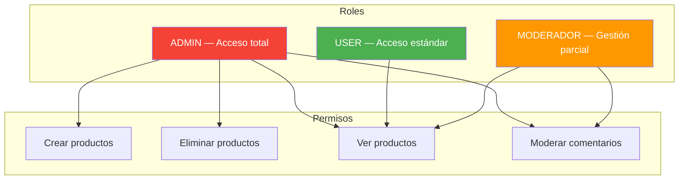
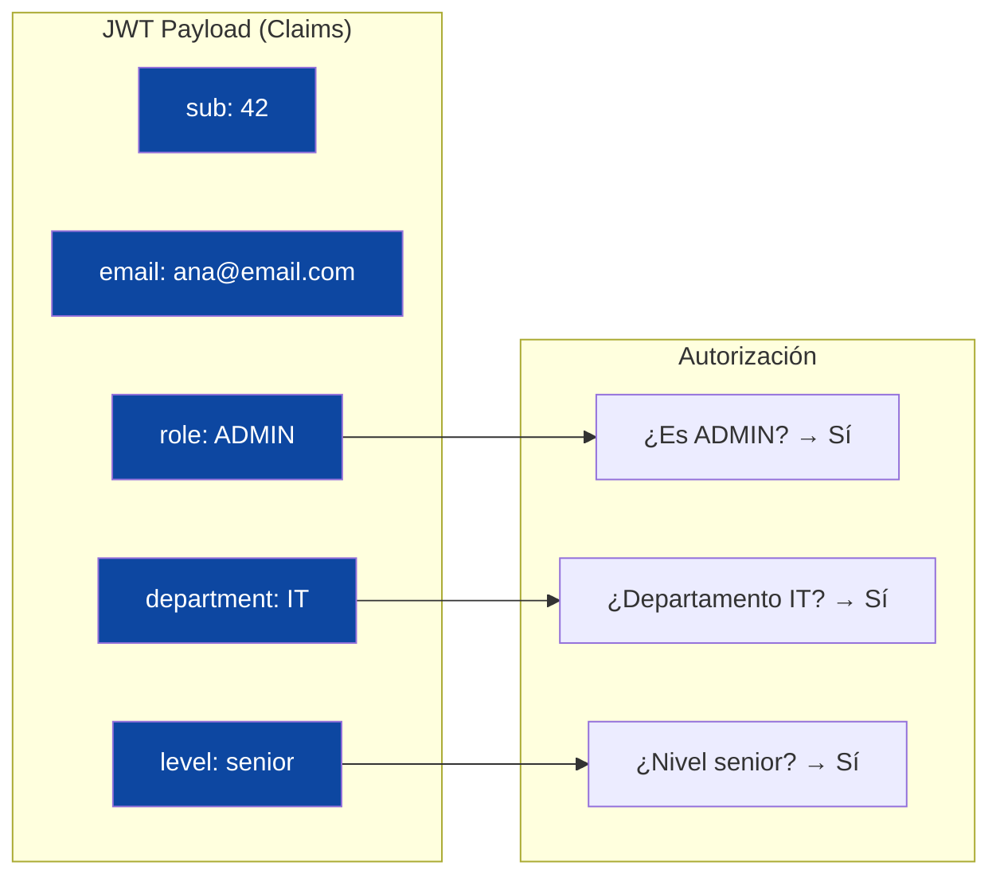
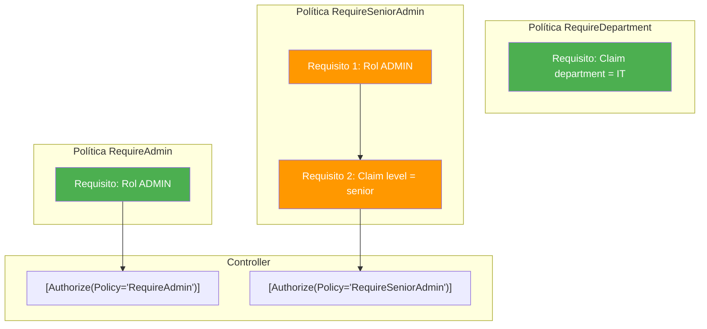
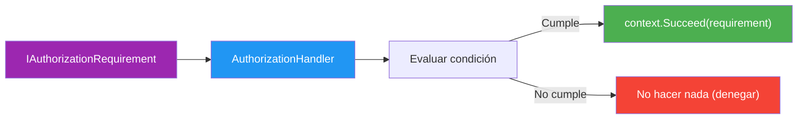
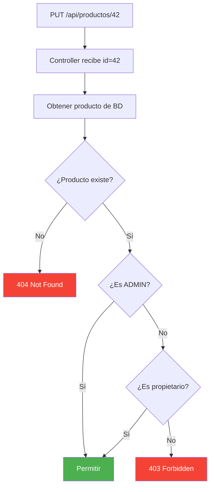
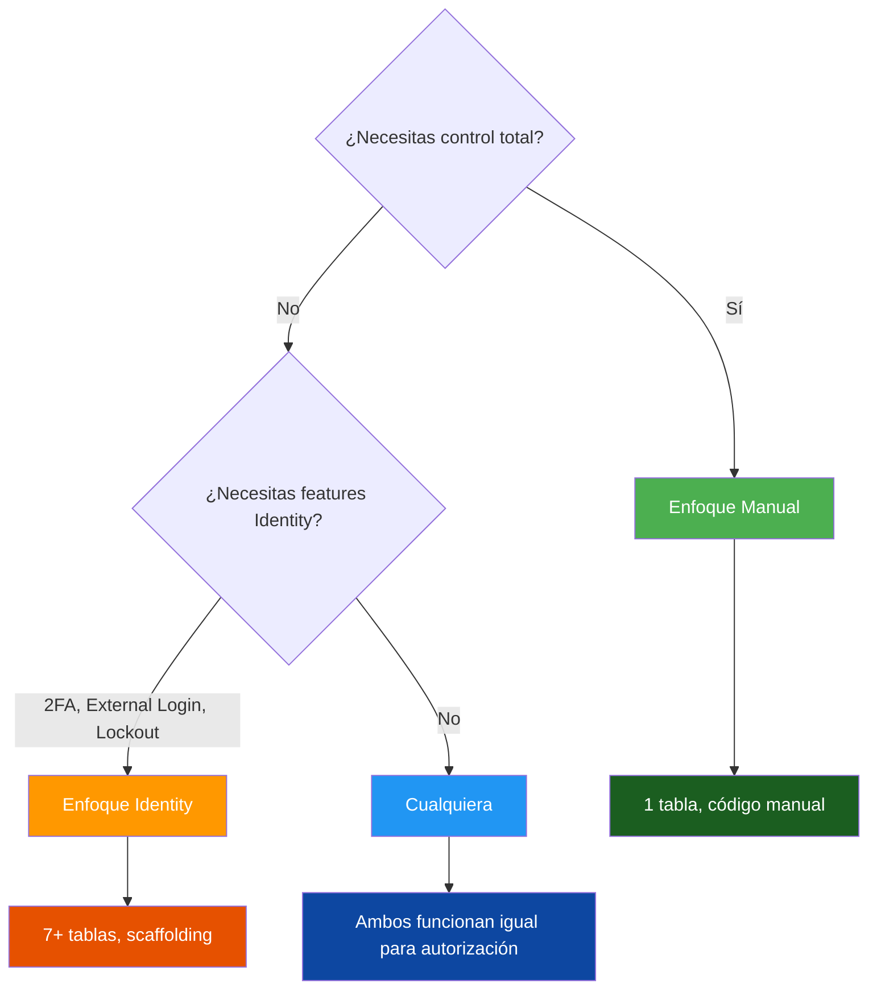

# 17. Autorización

## Tabla de Contenidos

- [17. Autorización](#17-autorización)
  - [17.1. Introducción](#171-introducción)
    - [17.1.1. ¿Qué es la Autorización?](#1711-qué-es-la-autorización)
    - [17.1.2. Autenticación vs Autorización](#1712-autenticación-vs-autorización)
    - [17.1.3. Flujo Completo: Autenticar → Autorizar → Acceder](#1713-flujo-completo-autenticar--autorizar--acceder)
  - [17.2. Conceptos Fundamentales](#172-conceptos-fundamentales)
    - [17.2.1. Roles](#1721-roles)
    - [17.2.2. Claims](#1722-claims)
    - [17.2.3. Policies](#1723-policies)
    - [17.2.4. Requirements y Handlers](#1724-requirements-y-handlers)
  - [17.3. Autorización con Roles](#173-autorización-con-roles)
    - [17.3.1. Enfoque Manual](#1731-enfoque-manual)
    - [17.3.2. Enfoque Identity](#1732-enfoque-identity)
  - [17.4. Autorización con Claims](#174-autorización-con-claims)
    - [17.4.1. Enfoque Manual](#1741-enfoque-manual)
    - [17.4.2. Enfoque Identity](#1742-enfoque-identity)
  - [17.5. Políticas de Autorización](#175-políticas-de-autorización)
    - [17.5.1. Enfoque Manual](#1751-enfoque-manual)
    - [17.5.2. Enfoque Identity](#1752-enfoque-identity)
  - [17.6. Requirements y Handlers Personalizados](#176-requirements-y-handlers-personalizados)
    - [17.6.1. Enfoque Manual](#1761-enfoque-manual)
    - [17.6.2. Enfoque Identity](#1762-enfoque-identity)
  - [17.7. Autorización Basada en Recursos](#177-autorización-basada-en-recursos)
  - [17.8. Comparación de Enfoques](#178-comparación-de-enfoques)
  - [17.9. Buenas Prácticas](#179-buenas-prácticas)
  - [17.10. Reto](#1710-reto)
  - [17.11. Resumen](#1711-resumen)

---

# 17. Autorización

> 💡 **Punto de partida:** Has conseguido que Instagram sepa quién eres (autenticación). Pero... ¿puedes borrar la cuenta de otro usuario? ¿Puedes ver estadísticas de negocio? Eso lo decide la **autorización**: qué puedes hacer una vez autenticado.

## 17.1. Introducción

### 17.1.1. ¿Qué es la Autorización?

La **autorización** es el proceso de determinar **qué recursos puede acceder** un usuario autenticado y **qué operaciones** puede realizar sobre ellos. Es la segunda puerta del proceso de seguridad: primero demuestras quién eres (autenticación), luego el sistema decide qué permisos tienes (autorización).

> 📝 **Nota:** La autorización **siempre** viene después de la autenticación. No tiene sentido verificar permisos de alguien cuya identidad no conoces. Primero autenticas, luego autorizas.

📌 Ejemplo real: En **Netflix**, una vez que te autenticas (login), la autorización determina qué puedes ver. Si tienes una suscripción básica, no puedes ver en 4K. Si tienes perfil de niño, no puedes acceder a contenido para adultos. Los perfiles familiares no pueden cambiar la tarjeta de pago. Todo eso es autorización.

### 17.1.2. Autenticación vs Autorización



| Aspecto | Autenticación | Autorización |
|---------|---------------|--------------|
| **Pregunta** | ¿Quién eres? | ¿Qué puedes hacer? |
| **Proceso** | Verificar identidad | Verificar permisos |
| **Resultado** | ClaimsPrincipal (identidad) | Allow / Deny |
| **HTTP Header** | `Authorization: Bearer <token>` | Atributo `[Authorize]` |
| **Middleware** | `app.UseAuthentication()` | `app.UseAuthorization()` |
| **Después del fallo** | 401 Unauthorized | 403 Forbidden |

> ⚠️ **Advertencia:** 401 Unauthorized = "No sé quién eres". 403 Forbidden = "Sé quién eres, pero no tienes permiso". Son códigos de error diferentes y no deben confundirse.

📌 Ejemplo real: En **Spotify**, la autenticación es tu login con email/contraseña o Google. La autorización determina si puedes escuchar música sin anuncios (Premium), si puedes descargar canciones offline o si puedes crear playlists colaborativas.

### 17.1.3. Flujo Completo: Autenticar → Autorizar → Acceder


```csharp
var app = builder.Build();

app.UseAuthentication();   // 1. Extraer y validar el JWT →ClaimsPrincipal
app.UseAuthorization();    // 2. Evaluar políticas → Allow/Deny

app.MapControllers();

app.Run();
```

> ⚠️ **Advertencia:** El orden de `UseAuthentication()` y `UseAuthorization()` es **crítico**. Si los inviertes, la autorización fallará porque no habrá identidad que verificar. **Siempre** autenticación primero, autorización segundo.

---

## 17.2. Conceptos Fundamentales

### 17.2.1. Roles

Un **rol** agrupa permisos de forma binaria: o tienes el rol o no lo tienes. Es la forma más simple de autorización.



| Rol | Descripción | Ejemplo de uso |
|-----|-------------|----------------|
| **ADMIN** | Administrador del sistema | Crear, modificar y borrar cualquier recurso |
| **USER** | Usuario estándar | Ver contenido, gestionar su perfil |
| **MODERADOR** | Gestor de contenido | Moderar comentarios, revisar reportes |

> 📝 **Nota:** Los roles son binarios: un usuario **tiene** o **no tiene** un rol. No hay valores intermedios. Si necesitas condiciones más complejas, usa Claims o Policies.

### 17.2.2. Claims

Los **claims** son pares clave-valor que transportan información sobre el usuario. A diferencia de los roles (binarios), los claims pueden contener cualquier dato: email, departamento, nivel de acceso, fecha de registro, etc.



| Tipo de claim | Ejemplo | Uso |
|---------------|---------|-----|
| `sub` | `42` | ID del usuario |
| `email` | `ana@email.com` | Correo electrónico |
| `role` | `ADMIN` | Rol del usuario |
| `department` | `IT` | Departamento (personalizado) |
| `level` | `senior` | Nivel de experiencia (personalizado) |

```csharp
// Leer claims del usuario autenticado
var userId = User.FindFirst("sub")?.Value;
var email = User.FindFirst("email")?.Value;
var department = User.FindFirst("department")?.Value;

// Verificar si tiene un claim específico
bool isSenior = User.HasClaim("level", "senior");
```

📌 Ejemplo real: **Slack** usa claims para saber a qué organizaciones perteneces, qué canales puedes ver y si eres administrador de algún workspace. Cada claim es una pieza de información que alimenta las decisiones de autorización.

### 17.2.3. Policies

Una **política** (policy) es una regla de autorización reutilizable que puede combinar múltiples requisitos. En lugar de escribir `[Authorize(Roles = "ADMIN")]` por todas partes, defines una política una vez y la reutilizas.



### 17.2.4. Requirements y Handlers

Un **Requirement** es una interfaz que define una condición de autorización. Un **Handler** es la clase que implementa la lógica para verificar esa condición.



> 💡 **Consejo:** Usa Requirements y Handlers cuando la lógica de autorización es demasiado compleja para una política simple o cuando necesitas acceder a recursos de la base de datos para tomar la decisión.

---

## 17.3. Autorización con Roles

### 17.3.1. Enfoque Manual

Sin Identity, gestionas los roles en tu propio modelo de usuario y los incluyes en el JWT como claims.

**Configurar roles en DI:**

```csharp
using Microsoft.AspNetCore.Authorization;

namespace FunkoApi.Infrastructure;

/// <summary>
/// Configuración de autorización sin Identity.
/// </summary>
public static class AuthorizationConfig
{
    public static IServiceCollection AddAuthorizationManual(
        this IServiceCollection services)
    {
        services.AddAuthorizationBuilder()
            .SetDefaultPolicy(
                new AuthorizationPolicyBuilder(JwtBearerDefaults.AuthenticationScheme)
                    .RequireAuthenticatedUser()
                    .Build())
            .AddPolicy("RequireAdmin", policy =>
                policy.RequireRole("ADMIN"))
            .AddPolicy("RequireUser", policy =>
                policy.RequireRole("USER", "ADMIN"))
            .AddPolicy("RequireModOrAdmin", policy =>
                policy.RequireRole("MODERATOR", "ADMIN"));

        return services;
    }
}
```

**Añadir rol al JWT en JwtService:**

```csharp
var claims = new List<Claim>
{
    new(JwtRegisteredClaimNames.Sub, user.Id.ToString()),
    new(JwtRegisteredClaimNames.Email, user.Email),
    new(JwtRegisteredClaimNames.Jti, Guid.NewGuid().ToString()),
    new("username", user.Username),
    new("role", user.Role)  // ← claim de rol
};
```

**Uso en el controller:**

```csharp
using Microsoft.AspNetCore.Authorization;
using Microsoft.AspNetCore.Mvc;

namespace FunkoApi.Controllers;

/// <summary>
/// Controlador de productos con autorización por roles.
/// </summary>
[ApiController]
[Route("api/[controller]")]
public class ProductosController(IProductoService productoService) : ControllerBase
{
    /// <summary>
    /// GET /api/productos — cualquier usuario autenticado.
    /// </summary>
    [HttpGet]
    [Authorize]
    public async Task<IActionResult> GetAll()
    {
        var productos = await productoService.GetAllAsync();
        return Ok(productos);
    }

    /// <summary>
    /// POST /api/productos — solo ADMIN.
    /// </summary>
    [HttpPost]
    [Authorize(Roles = "ADMIN")]
    public async Task<IActionResult> Create([FromBody] CreateProductoDto dto)
    {
        var producto = await productoService.CreateAsync(dto);
        return CreatedAtAction(nameof(GetById), new { id = producto.Id }, producto);
    }

    /// <summary>
    /// PUT /api/productos/{id} — ADMIN y USER.
    /// </summary>
    [HttpPut("{id:long}")]
    [Authorize(Roles = "ADMIN,USER")]
    public async Task<IActionResult> Update(long id, [FromBody] UpdateProductoDto dto)
    {
        var producto = await productoService.UpdateAsync(id, dto);
        return Ok(producto);
    }

    /// <summary>
    /// DELETE /api/productos/{id} — solo ADMIN.
    /// </summary>
    [HttpDelete("{id:long}")]
    [Authorize(Roles = "ADMIN")]
    public async Task<IActionResult> Delete(long id)
    {
        await productoService.DeleteAsync(id);
        return NoContent();
    }

    /// <summary>
    /// Verificación programática de roles en código.
    /// </summary>
    [HttpGet("{id:long}/detail")]
    [Authorize]
    public async Task<IActionResult> GetById(long id)
    {
        var producto = await productoService.GetByIdAsync(id);

        // Solo el propietario o un admin puede ver detalles completos
        if (!User.IsInRole("ADMIN") &&
            producto.OwnerId != User.FindFirst("sub")?.Value)
        {
            return Forbid();
        }

        return Ok(producto);
    }
}
```

### 17.3.2. Enfoque Identity

Con Identity, los roles se gestionan con `RoleManager` y se asignan con `UserManager`. La configuración de políticas es idéntica.

**Crear roles al iniciar la aplicación:**

```csharp
using Microsoft.AspNetCore.Identity;
using FunkoApi.Entity;

namespace FunkoApi.Infrastructure;

/// <summary>
/// Servicio para crear roles y usuarios seed con Identity.
/// </summary>
public static class SeedIdentityData
{
    public static async Task SeedAsync(IServiceProvider services)
    {
        using var scope = services.CreateScope();
        var roleManager = scope.ServiceProvider
            .GetRequiredService<RoleManager<IdentityRole<long>>>();
        var userManager = scope.ServiceProvider
            .GetRequiredService<UserManager<User>>();

        // Crear roles
        string[] roles = ["ADMIN", "USER", "MODERATOR"];
        foreach (var role in roles)
        {
            if (!await roleManager.RoleExistsAsync(role))
            {
                await roleManager.CreateAsync(new IdentityRole<long>(role));
                Log.Information("Rol creado: {Role}", role);
            }
        }

        // Crear usuario admin
        var adminEmail = "admin@funko.com";
        var adminUser = await userManager.FindByEmailAsync(adminEmail);
        if (adminUser == null)
        {
            adminUser = new User
            {
                UserName = "admin",
                Email = adminEmail,
                EmailConfirmed = true,
                FirstName = "Admin"
            };
            var result = await userManager.CreateAsync(adminUser, "Admin123!");
            if (result.Succeeded)
            {
                await userManager.AddToRoleAsync(adminUser, "ADMIN");
                Log.Information("Usuario admin creado: {Email}", adminEmail);
            }
        }

        // Crear usuario normal
        var userEmail = "user@funko.com";
        var normalUser = await userManager.FindByEmailAsync(userEmail);
        if (normalUser == null)
        {
            normalUser = new User
            {
                UserName = "user",
                Email = userEmail,
                EmailConfirmed = true,
                FirstName = "User"
            };
            var result = await userManager.CreateAsync(normalUser, "User123!");
            if (result.Succeeded)
            {
                await userManager.AddToRoleAsync(normalUser, "USER");
                Log.Information("Usuario normal creado: {Email}", userEmail);
            }
        }
    }
}
```

**Configurar autorización con Identity:**

```csharp
public static class AuthorizationConfig
{
    public static IServiceCollection AddAuthorizationWithIdentity(
        this IServiceCollection services)
    {
        services.AddAuthorizationBuilder()
            .SetDefaultPolicy(
                new AuthorizationPolicyBuilder(JwtBearerDefaults.AuthenticationScheme)
                    .RequireAuthenticatedUser()
                    .Build())
            .AddPolicy("RequireAdmin", policy =>
                policy.RequireRole("ADMIN"))
            .AddPolicy("RequireUser", policy =>
                policy.RequireRole("USER", "ADMIN"));

        return services;
    }
}
```

**Asignar roles con UserManager:**

```csharp
// Asignar rol a un usuario
await userManager.AddToRoleAsync(user, "ADMIN");

// Quitar rol
await userManager.RemoveFromRoleAsync(user, "ADMIN");

// Obtener roles del usuario
var roles = await userManager.GetRolesAsync(user);

// Verificar rol
bool isAdmin = await userManager.IsInRoleAsync(user, "ADMIN");
```

> 📝 **Nota:** La configuración de políticas con `AddAuthorizationBuilder()` es **idéntica** en ambos enfoques. Solo cambia cómo se crean y asignan los roles (RoleManager vs tu propia lógica).

---

## 17.4. Autorización con Claims

### 17.4.1. Enfoque Manual

Con el enfoque manual, añades claims personalizados directamente al JWT en el JwtService.

**Añadir claims al JWT:**

```csharp
public string GenerateToken(User user)
{
    var key = new SymmetricSecurityKey(Encoding.UTF8.GetBytes(_secretKey));
    var creds = new SigningCredentials(key, SecurityAlgorithms.HmacSha256);

    var claims = new List<Claim>
    {
        new(JwtRegisteredClaimNames.Sub, user.Id.ToString()),
        new(JwtRegisteredClaimNames.Email, user.Email),
        new(JwtRegisteredClaimNames.Jti, Guid.NewGuid().ToString()),
        new("username", user.Username),
        new("role", user.Role),
        // Claims personalizados
        new("department", user.Department ?? "GENERAL"),
        new("level", user.Level ?? "junior")
    };

    var token = new JwtSecurityToken(
        issuer: _issuer,
        audience: _audience,
        claims: claims,
        expires: DateTime.UtcNow.AddMinutes(_accessTokenExpiryMinutes),
        signingCredentials: creds
    );

    return new JwtSecurityTokenHandler().WriteToken(token);
}
```

**Leer claims en el controller:**

```csharp
[ApiController]
[Route("api/[controller]")]
public class AdminController : ControllerBase
{
    [HttpGet("profile")]
    [Authorize]
    public IActionResult GetProfile()
    {
        return Ok(new
        {
            Id = User.FindFirst("sub")?.Value,
            Username = User.FindFirst("username")?.Value,
            Email = User.FindFirst("email")?.Value,
            Role = User.FindFirst("role")?.Value,
            Department = User.FindFirst("department")?.Value,
            Level = User.FindFirst("level")?.Value
        });
    }

    [HttpGet("reports")]
    [Authorize(Policy = "RequireDepartmentIT")]
    public IActionResult GetReports()
    {
        return Ok(new { Message = "Reportes del departamento IT" });
    }
}
```

### 17.4.2. Enfoque Identity

Con Identity, los claims se gestionan con `UserManager` y se persisten en la base de datos.

**Añadir claims con UserManager:**

```csharp
// Añadir claims a un usuario
await userManager.AddClaimAsync(user, new Claim("department", "IT"));
await userManager.AddClaimAsync(user, new Claim("level", "senior"));

// Actualizar un claim
await userManager.ReplaceClaimAsync(user,
    new Claim("department", "IT"),
    new Claim("department", "HR"));

// Obtener claims de un usuario
var claims = await userManager.GetClaimsAsync(user);

// Eliminar un claim
await userManager.RemoveClaimAsync(user, new Claim("level", "senior"));
```

**Leer claims (idéntico al enfoque manual):**

```csharp
[HttpGet("profile")]
[Authorize]
public IActionResult GetProfile()
{
    return Ok(new
    {
        Id = User.FindFirst("sub")?.Value,
        Email = User.FindFirst("email")?.Value,
        Department = User.FindFirst("department")?.Value,
        Level = User.FindFirst("level")?.Value
    });
}
```

> 💡 **Consejo:** Con Identity, los claims se almacenan en la tabla `AspNetUserClaims` y se cargan automáticamente en el `ClaimsPrincipal` durante la autenticación. Con el enfoque manual, los claims viajan dentro del JWT y se extraen al validar el token.

---

## 17.5. Políticas de Autorización

### 17.5.1. Enfoque Manual

**Política simple — solo requerir un rol:**

```csharp
services.AddAuthorizationBuilder()
    .AddPolicy("RequireAdmin", policy =>
        policy.RequireRole("ADMIN"));
```

**Política con claims — verificar edad mínima:**

```csharp
services.AddAuthorizationBuilder()
    .AddPolicy("MinimumAge18", policy =>
        policy.RequireClaim("age", claim =>
            int.Parse(claim.Value) >= 18));
```

**Política con assertion — combinación de condiciones:**

```csharp
services.AddAuthorizationBuilder()
    .AddPolicy("CanManageProducts", policy =>
        policy.RequireAssertion(context =>
            context.User.IsInRole("ADMIN") ||
            context.User.HasClaim("department", "INVENTORY")));
```

**Política con requirements personalizados:**

```csharp
services.AddAuthorizationBuilder()
    .AddPolicy("RequireDepartment", policy =>
        policy.AddRequirements(new RequireDepartmentRequirement("IT")));
```

**Uso en el controller:**

```csharp
[ApiController]
[Route("api/[controller]")]
public class ReportsController : ControllerBase
{
    [HttpGet("sales")]
    [Authorize(Policy = "RequireAdmin")]
    public IActionResult GetSalesReport()
    {
        return Ok(new { Report = "Ventas totales" });
    }

    [HttpGet("team")]
    [Authorize(Policy = "RequireDepartment")]
    public IActionResult GetTeamReport()
    {
        return Ok(new { Report = "Reporte del equipo IT" });
    }

    [HttpGet("premium")]
    [Authorize(Policy = "MinimumAge18")]
    public IActionResult GetPremiumContent()
    {
        return Ok(new { Content = "Contenido premium" });
    }
}
```

### 17.5.2. Enfoque Identity

La configuración de políticas es **idéntica**. Solo cambia el contexto de registro (ya tienes Identity configurado):

```csharp
// Con Identity, las políticas se registran igual
services.AddAuthorizationBuilder()
    .SetDefaultPolicy(
        new AuthorizationPolicyBuilder(JwtBearerDefaults.AuthenticationScheme)
            .RequireAuthenticatedUser()
            .Build())
    .AddPolicy("RequireAdmin", policy =>
        policy.RequireRole("ADMIN"))
    .AddPolicy("RequireUser", policy =>
        policy.RequireRole("USER", "ADMIN"))
    .AddPolicy("MinimumAge18", policy =>
        policy.RequireClaim("age", claim =>
            int.Parse(claim.Value) >= 18));
```

> 📝 **Nota:** Las políticas de autorización son **independientes** del sistema de autenticación. Funcionan exactamente igual con JWT manual, Identity, cookies o cualquier otro esquema. Solo necesitan un `ClaimsPrincipal` válido, que viene del middleware de autenticación.

---

## 17.6. Requirements y Handlers Personalizados

### 17.6.1. Enfoque Manual

**Requirement — define la condición:**

```csharp
using Microsoft.AspNetCore.Authorization;

namespace FunkoApi.Authorization;

/// <summary>
/// Requisito que verifica que el usuario pertenece a un departamento concreto.
/// </summary>
public class RequireDepartmentRequirement(string department) : IAuthorizationRequirement
{
    /// <summary>Departamento requerido.</summary>
    public string Department { get; } = department;
}
```

**Handler — implementa la lógica:**

```csharp
using Microsoft.AspNetCore.Authorization;
using Serilog;

namespace FunkoApi.Authorization;

/// <summary>
/// Handler que verifica si el usuario pertenece al departamento requerido.
/// </summary>
public class RequireDepartmentHandler : AuthorizationHandler<RequireDepartmentRequirement>
{
    /// <inheritdoc />
    protected override Task HandleRequirementAsync(
        AuthorizationHandlerContext context,
        RequireDepartmentRequirement requirement)
    {
        var department = context.User.FindFirst("department")?.Value;

        if (department is null)
        {
            Log.Warning("Usuario sin claim 'department'");
            return Task.CompletedTask;
        }

        if (department.Equals(requirement.Department, StringComparison.OrdinalIgnoreCase))
        {
            Log.Information(
                "Departamento verificado: {UserDept} == {RequiredDept}",
                department, requirement.Department);
            context.Succeed(requirement);
        }
        else
        {
            Log.Warning(
                "Departamento no coincide: {UserDept} != {RequiredDept}",
                department, requirement.Department);
        }

        return Task.CompletedTask;
    }
}
```

**Handler para verificar propietario de recurso:**

```csharp
using Microsoft.AspNetCore.Authorization;

namespace FunkoApi.Authorization;

/// <summary>
/// Requisito que verifica si el usuario es propietario del recurso.
/// </summary>
public class ResourceOwnerRequirement : IAuthorizationRequirement { }

/// <summary>
/// Handler que verifica si el usuario es propietario del recurso o es ADMIN.
/// </summary>
public class ResourceOwnerHandler(
    IProductoRepository productoRepository,
    IHttpContextAccessor httpContextAccessor)
    : AuthorizationHandler<ResourceOwnerRequirement>
{
    /// <inheritdoc />
    protected override async Task HandleRequirementAsync(
        AuthorizationHandlerContext context,
        ResourceOwnerRequirement requirement)
    {
        var httpContext = httpContextAccessor.HttpContext;
        if (httpContext is null) return;

        // Si es ADMIN, siempre tiene acceso
        if (context.User.IsInRole("ADMIN"))
        {
            context.Succeed(requirement);
            return;
        }

        // Obtener ID del recurso desde la ruta
        var routeId = httpContext.Request.RouteValues["id"]?.ToString();
        if (string.IsNullOrEmpty(routeId) || !long.TryParse(routeId, out var productId))
            return;

        // Obtener ID del usuario
        var userId = context.User.FindFirst("sub")?.Value;
        if (string.IsNullOrEmpty(userId)) return;

        // Verificar propietario
        var producto = await productoRepository.GetByIdAsync(productId);
        if (producto is not null && producto.OwnerId.ToString() == userId)
        {
            context.Succeed(requirement);
        }
    }
}
```

**Registrar handlers:**

```csharp
services.AddSingleton<IAuthorizationHandler, RequireDepartmentHandler>();
services.AddSingleton<IAuthorizationHandler, ResourceOwnerHandler>();

services.AddAuthorizationBuilder()
    .AddPolicy("RequireDepartmentIT", policy =>
        policy.AddRequirements(new RequireDepartmentRequirement("IT")))
    .AddPolicy("RequireProductOwner", policy =>
        policy.AddRequirements(new ResourceOwnerRequirement()));
```

### 17.6.2. Enfoque Identity

Los handlers son **idénticos**. Solo cambia el registro en DI (ya tienes Identity configurado):

```csharp
// Mismo handler, mismo código
public class RequireDepartmentHandler : AuthorizationHandler<RequireDepartmentRequirement>
{
    protected override Task HandleRequirementAsync(
        AuthorizationHandlerContext context,
        RequireDepartmentRequirement requirement)
    {
        var department = context.User.FindFirst("department")?.Value;
        if (department?.Equals(requirement.Department, StringComparison.OrdinalIgnoreCase) == true)
            context.Succeed(requirement);

        return Task.CompletedTask;
    }
}

// Registro idéntico
services.AddSingleton<IAuthorizationHandler, RequireDepartmentHandler>();
services.AddSingleton<IAuthorizationHandler, ResourceOwnerHandler>();
```

> 💡 **Consejo:** Los handlers son la pieza más flexible del sistema de autorización. Pueden acceder a la base de datos, servicios externos o cualquier lógica de negocio para tomar la decisión. Usa `AddSingleton` si el handler no tiene estado dependiente de la request, o `AddScoped` si necesita servicios Scoped.

---

## 17.7. Autorización Basada en Recursos

La autorización basada en recursos verifica permisos sobre un **objeto concreto**, no sobre una acción genérica. Por ejemplo: "solo el dueño de un producto puede editarlo".



**Con verificación directa en el controller:**

```csharp
[ApiController]
[Route("api/[controller]")]
public class ProductosController(
    IProductoService productoService,
    IAuthorizationService authorizationService) : ControllerBase
{
    [HttpPut("{id:long}")]
    [Authorize]
    public async Task<IActionResult> Update(long id, UpdateProductoDto dto)
    {
        var producto = await productoService.GetByIdAsync(id);
        if (producto is null) return NotFound();

        // Verificar propietario con IAuthorizationService
        var authResult = await authorizationService.AuthorizeAsync(
            User, producto, "RequireProductOwner");

        if (!authResult.Succeeded)
            return Forbid();

        await productoService.UpdateAsync(id, dto);
        return Ok(producto);
    }

    [HttpDelete("{id:long}")]
    [Authorize]
    public async Task<IActionResult> Delete(long id)
    {
        var producto = await productoService.GetByIdAsync(id);
        if (producto is null) return NotFound();

        // Verificación directa (más simple)
        if (!User.IsInRole("ADMIN") &&
            producto.OwnerId.ToString() != User.FindFirst("sub")?.Value)
        {
            return Forbid();
        }

        await productoService.DeleteAsync(id);
        return NoContent();
    }
}
```

**Con IAuthorizationService inyectado:**

```csharp
using Microsoft.AspNetCore.Authorization;

namespace FunkoApi.Services;

/// <summary>
/// Servicio wrapper para IAuthorizationService con métodos de conveniencia.
/// </summary>
public class AuthorizationService(
    Microsoft.AspNetCore.Authorization.IAuthorizationService authorizationService,
    IHttpContextAccessor httpContextAccessor)
{
    /// <summary>
    /// Verifica si el usuario actual cumple una política sobre un recurso.
    /// </summary>
    public async Task<bool> CanAsync<TResource>(string policyName, TResource resource)
    {
        var user = httpContextAccessor.HttpContext!.User;
        var result = await authorizationService.AuthorizeAsync(user, resource, policyName);
        return result.Succeeded;
    }

    /// <summary>
    /// Verifica si el usuario actual es propietario del recurso.
    /// </summary>
    public async Task<bool> IsOwnerAsync<TResource>(TResource resource)
    {
        return await CanAsync("RequireProductOwner", resource);
    }
}
```

> ⚠️ **Advertencia:** La autorización basada en recursos requiere acceso al objeto real desde la base de datos. Esto implica una consulta adicional por cada request protegido. Úsala solo cuando sea estrictamente necesario y considera cachear los resultados.

---

## 17.8. Comparación de Enfoques

| Aspecto | Enfoque Manual | Enfoque Identity |
|---------|---------------|------------------|
| **Control total** | Sí, tú gestionas todo | Limitado por el framework |
| **Tablas BD** | 1 tabla (`users`) | 7+ tablas (`AspNetUsers`, etc.) |
| **Gestión de roles** | Campo en tu modelo | `RoleManager<T>` integrado |
| **Claims en JWT** | Tú los añades en JwtService | `UserManager.AddClaimAsync()` |
| **Policies** | Idénticas | Idénticas |
| **Requirements/Handlers** | Idénticos | Idénticos |
| **Resource-based** | Idéntico | Idéntico |
| **Tiempo de setup** | Medio (más código manual) | Bajo (scaffolding) |
| **Mantenimiento** | Lo mantienes tú | Microsoft lo mantiene |
| **Flexibilidad** | Total | Limitada por convenciones |



> 💡 **Consejo:** La autorización (roles, claims, policies, handlers) funciona **exactamente igual** en ambos enfoques. La única diferencia es cómo gestionas la identidad del usuario. Elige el enfoque de autenticación que mejor se adapte a tu proyecto y la autorización será la misma.

---

## 17.9. Buenas Prácticas

```mermaid
flowchart TB
    subgraph "Principios"
        P1["Mínimo privilegio"]
        P2["Denegar por defecto"]
        P3["Permitir explícitamente"]
    end

    subgraph "Seguridad"
        S1["No confiar en el cliente"]
        S2["Validar en cada request"]
        S3["Logs de accesos denegados"]
    end

    subgraph "Mantenimiento"
        M1["Nombres claros de políticas"]
        M2["Tests de autorización"]
        M3["Documentar permisos"]
    end

    P1 --> P2 --> P3
    S1 --> S2 --> S3
    M1 --> M2 --> M3

    style P1 fill:#4CAF50,color:#fff
    style P2 fill:#4CAF50,color:#fff
    style P3 fill:#4CAF50,color:#fff
    style S1 fill:#f44336,color:#fff
    style S2 fill:#f44336,color:#fff
    style S3 fill:#f44336,color:#fff
    style M1 fill:#2196F3,color:#fff
    style M2 fill:#2196F3,color:#fff
    style M3 fill:#2196F3,color:#fff
```



| Práctica | Descripción |
|----------|-------------|
| **Mínimo privilegio** | Dar solo los permisos estrictamente necesarios |
| **Denegar por defecto** | Si no hay política que permita, se deniega |
| **No confiar en el cliente** | Siempre validar en el servidor, nunca en el frontend |
| **Logs de accesos denegados** | Registrar intentos fallidos para auditoría |
| **Tests de autorización** | Verificar que cada endpoint deniega correctamente |
| **Nombres claros** | Policies con nombres descriptivos: `RequireAdmin`, no `Policy1` |
| **Evitar consultas BD en handlers** | Cuando sea posible, usar claims ya cargados |
| **Documentar permisos** | Cada endpoint debe indicar qué rol/política requiere |

✅ **Buena práctica:** Siempre define una política por defecto que requiera autenticación. Así, si olvidas añadir `[Authorize]` a un endpoint, denegará acceso por defecto en lugar de permitirlo anónimamente.

> ⚠️ **Advertencia:** **Nunca** confíes en que el frontend filtra lo que el usuario puede ver. Si un usuario malicioso llama directamente a tu API con un token válido pero sin permisos, el servidor debe denegar el acceso. La autorización **siempre** se verifica en el backend.

---

## 17.10. Reto

> Aplica autorización completa a FunkoApp usando Identity.

**Añade a tu API:**

1. **Crear roles:** `ADMIN` y `USER` al iniciar la app con `RoleManager`
2. **Seed de usuarios:** admin (`admin@funko.com` / `Admin123!`, rol `ADMIN`) y user (`user@funko.com` / `User123!`, rol `USER`)
3. **Endpoints protegidos:**
   - `GET /api/productos` → público (sin auth)
   - `POST /api/productos` → solo `ADMIN`
   - `PUT /api/productos/{id}` → `ADMIN` y `USER`
   - `DELETE /api/productos/{id}` → solo `ADMIN`
4. **Política personalizada:** `RequireProductOwner` — solo el propietario del producto o un `ADMIN` puede modificar
5. **Tests de autorización:** verificar que cada endpoint deniega correctamente a usuarios sin permisos

**Puntos extra:**

- Claims personalizados (`department`, `level`)
- Handler de autorización basado en recursos con `IAuthorizationService`
- Rate limiting por rol (más requests para ADMIN, menos para USER)

---

## 17.11. Resumen

| Concepto | Descripción |
|----------|-------------|
| **Autorización** | Determina qué puede hacer un usuario autenticado |
| **Autenticación vs Autorización** | ¿Quién eres? vs ¿Qué puedes hacer? |
| **Roles** | Agrupación binaria de permisos (ADMIN, USER) |
| **Claims** | Pares clave-valor con información del usuario |
| **Policies** | Reglas de autorización reutilizables |
| **Requirements** | Interfaces que definen condiciones de autorización |
| **Handlers** | Implementación de la lógica de verificación |
| **Resource-based** | Autorización sobre un objeto concreto |
| **Enfoque Manual** | Tú gestionas usuarios, roles y claims |
| **Enfoque Identity** | UserManager y RoleManager integrados |
| **`[Authorize]`** | Atributo para proteger endpoints |
| **`User.IsInRole()`** | Verificación programática de roles |
| **`IAuthorizationService`** | Autorización programática sobre recursos |
| **401 vs 401** | 401 = no autenticado, 403 = no autorizado |
| **Mínimo privilegio** | Dar solo los permisos estrictamente necesarios |

**¿Qué viene después?**

En el siguiente punto veremos **Logging con Serilog**: cómo configurar el sistema de registro de la aplicación para monitorizar errores, peticiones HTTP y actividad de los usuarios. Verás cómo integrar Serilog con ASP.NET Core y cómo configurar sinks para consola, fichero y bases de datos.
