# 17. Autorización

- [17. Autorización](#17-autorización)
  - [17.1. Introducción](#171-introducción)
    - [17.1.1. ¿Qué es la Autorización?](#1711-qué-es-la-autorización)
    - [17.1.2. Autenticación vs Autorización](#1712-autenticación-vs-autorización)
    - [17.1.3. Flujo Completo: Autenticar → Autorizar → Acceder](#1713-flujo-completo-autenticar--autorizar--acceder)
  - [17.2. Conceptos Fundamentales](#172-conceptos-fundamentales)
    - [17.2.1. Roles](#1721-roles)
    - [17.2.2. Claims](#1722-claims)
    - [17.2.3. Policies](#1723-policies)
    - [17.2.4. Requirements y Handlers](#1724-requirements-y-handlers)
  - [17.3. Autorización con Roles](#173-autorización-con-roles)
    - [17.3.1. Enfoque Manual](#1731-enfoque-manual)
    - [17.3.2. Enfoque Identity](#1732-enfoque-identity)
  - [17.4. Autorización con Claims](#174-autorización-con-claims)
    - [17.4.1. Enfoque Manual](#1741-enfoque-manual)
    - [17.4.2. Enfoque Identity](#1742-enfoque-identity)
  - [17.5. Políticas de Autorización](#175-políticas-de-autorización)
    - [17.5.1. Enfoque Manual](#1751-enfoque-manual)
    - [17.5.2. Enfoque Identity](#1752-enfoque-identity)
  - [17.6. Requirements y Handlers Personalizados](#176-requirements-y-handlers-personalizados)
    - [17.6.1. Enfoque Manual](#1761-enfoque-manual)
    - [17.6.2. Enfoque Identity](#1762-enfoque-identity)
  - [17.7. Autorización Basada en Recursos](#177-autorización-basada-en-recursos)
  - [17.8. Comparación de Enfoques](#178-comparación-de-enfoques)
  - [17.9. Buenas Prácticas](#179-buenas-prácticas)
  - [17.10. Reto](#1710-reto)


---

> 💡 **Punto de partida:** Has conseguido que Instagram sepa quién eres (autenticación). Pero... ¿puedes borrar la cuenta de otro usuario? ¿Puedes ver estadísticas de negocio? Eso lo decide la **autorización**: qué puedes hacer una vez autenticado.

**Objetivos de aprendizaje:**
- Comprender la diferencia entre autenticación y autorización
- Implementar autorización basada en roles, claims y policies
- Crear requirements y handlers personalizados para reglas de negocio complejas
- Aplicar autorización basada en recursos (resource-based authorization)

## 17.1. Introducción

### 17.1.1. ¿Qué es la Autorización?

La **autorización** es el proceso de determinar **qué recursos puede acceder** un usuario autenticado y **qué operaciones** puede realizar sobre ellos. Es la segunda puerta del proceso de seguridad: primero demuestras quién eres (autenticación), luego el sistema decide qué permisos tienes (autorización).

> 📝 **Nota:** La autorización **siempre** viene después de la autenticación. No tiene sentido verificar permisos de alguien cuya identidad no conoces. Primero autenticas, luego autorizas.

📌 Ejemplo real: En **Netflix**, una vez que te autenticas (login), la autorización determina qué puedes ver. Si tienes una suscripción básica, no puedes ver en 4K. Si tienes perfil de niño, no puedes acceder a contenido para adultos. Los perfiles familiares no pueden cambiar la tarjeta de pago. Todo eso es autorización.

### 17.1.2. Autenticación vs Autorización

Para entender la diferencia, piensa en la metáfora de una discoteca. La **autenticación** es cuando sacas tu DNI en la puerta: el portero verifica que eres quien dices ser. La **autorización** es cuando el portero comprueba si tu entrada es VIP, si tienes la pulsera de zona premium o si solo puedes acceder a la zona general. Ya saben quién eres, pero ahora necesitan saber **qué puedes hacer** dentro.

El siguiente diagrama muestra cómo estos dos procesos se encadenan en una aplicación web:

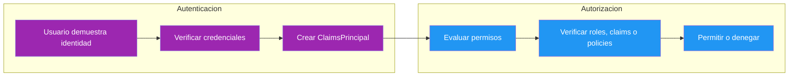

| Aspecto | Autenticación | Autorización |
|---------|---------------|--------------|
| **Pregunta** | ¿Quién eres? | ¿Qué puedes hacer? |
| **Proceso** | Verificar identidad | Verificar permisos |
| **Resultado** | ClaimsPrincipal (identidad) | Allow / Deny |
| **HTTP Header** | `Authorization: Bearer <token>` | Atributo `[Authorize]` |
| **Middleware** | `app.UseAuthentication()` | `app.UseAuthorization()` |
| **Después del fallo** | 401 Unauthorized | 403 Forbidden |

> ⚠️ **Advertencia:** 401 Unauthorized = "No sé quién eres". 403 Forbidden = "Sé quién eres, pero no tienes permiso". Son códigos de error diferentes y no deben confundirse.

📌 Ejemplo real: En **Spotify**, la autenticación es tu login con email/contraseña o Google. La autorización determina si puedes escuchar música sin anuncios (Premium), si puedes descargar canciones offline o si puedes crear playlists colaborativas.

### 17.1.3. Flujo Completo: Autenticar → Autorizar → Acceder

Cuando una petición llega a tu API, el middleware de ASP.NET Core procesa la seguridad en dos fases. Primero `UseAuthentication()` valida el token JWT y extrae los claims del usuario. Si el token es inválido, la petición se rechaza con 401. Si es válido, se crea un `ClaimsPrincipal` con toda la información del usuario. Después, `UseAuthorization()` evalúa si ese usuario tiene permisos para acceder al endpoint solicitado. Si no tiene permisos, devuelve 403. Si todo está correcto, ejecuta la acción del controller.

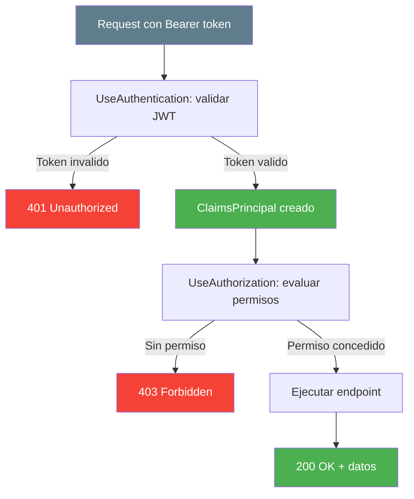

En el `Program.cs`, la configuración de estos middlewares debe seguir un orden estricto. La autenticación siempre va primero porque la autorización necesita saber quién es el usuario antes de evaluar sus permisos:

```csharp
var app = builder.Build();

app.UseAuthentication();   // 1. Extraer y validar el JWT → ClaimsPrincipal
app.UseAuthorization();    // 2. Evaluar políticas → Allow/Deny

app.MapControllers();

app.Run();
```

> ⚠️ **Advertencia:** El orden de `UseAuthentication()` y `UseAuthorization()` es **crítico**. Si los inviertes, la autorización fallará porque no habrá identidad que verificar. **Siempre** autenticación primero, autorización segundo.

#### Flujo positivo: Autorizacion con roles

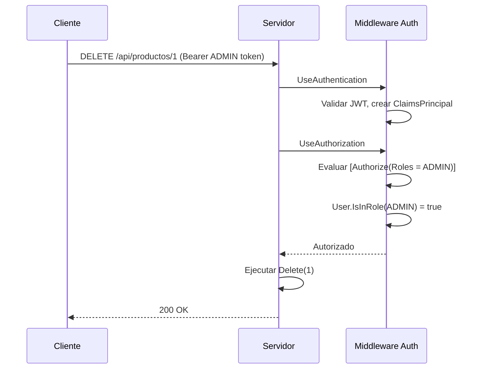

#### Flujo negativo: Usuario sin permisos

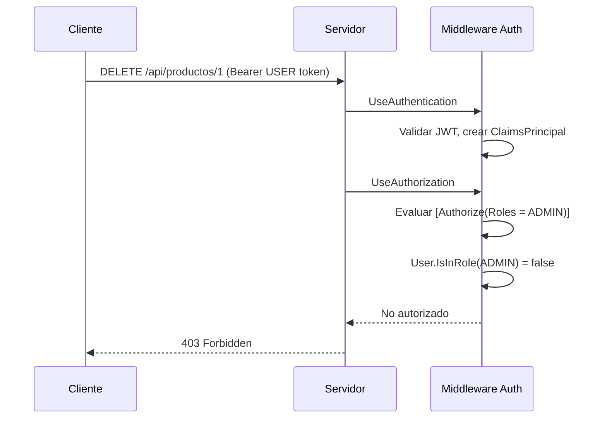

#### Flujo negativo: Sin token

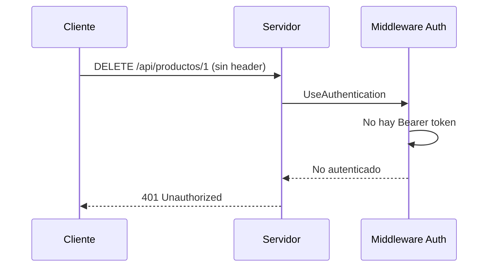

#### Flujo positivo: Policy RequireAdmin

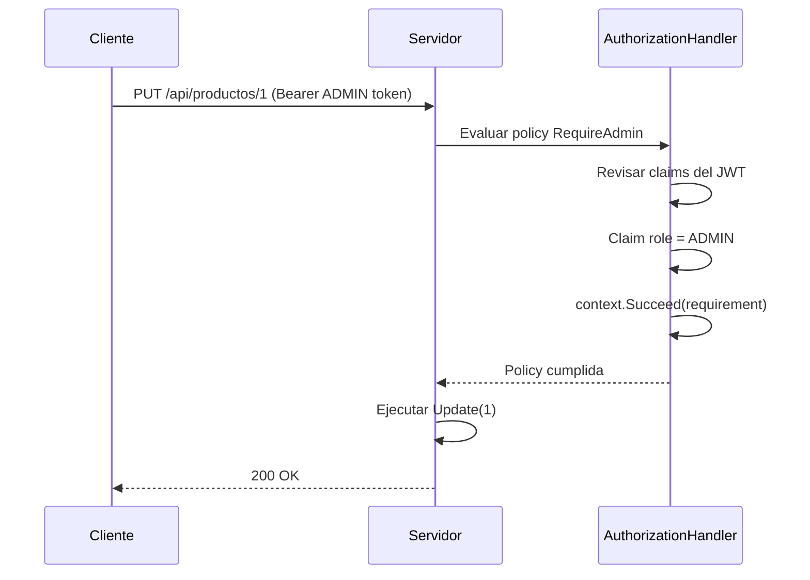

## 17.2. Conceptos Fundamentales

Antes de meternos en código, necesitas entender los cinco pilares sobre los que se construye todo el sistema de autorización en ASP.NET Core: roles, claims, policies, requirements y handlers. Piensa en ello como las piezas de un mecanismo de seguridad: cada pieza tiene una función concreta y todas trabajan juntas.

### 17.2.1. Roles

Un **rol** agrupa permisos de forma binaria: o tienes el rol o no lo tienes. Es la forma más simple de autorización. Si un usuario tiene el rol `ADMIN`, tiene acceso total. Si tiene `USER`, acceso estándar. No hay valores intermedios.

El siguiente diagrama muestra cómo los roles se asocian a permisos concretos en una aplicación típica:

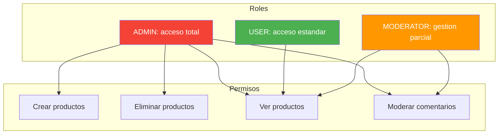

| Rol | Descripción | Ejemplo de uso |
|-----|-------------|----------------|
| **ADMIN** | Administrador del sistema | Crear, modificar y borrar cualquier recurso |
| **USER** | Usuario estándar | Ver contenido, gestionar su perfil |
| **MODERADOR** | Gestor de contenido | Moderar comentarios, revisar reportes |

> 📝 **Nota:** Los roles son binarios: un usuario **tiene** o **no tiene** un rol. No hay valores intermedios. Si necesitas condiciones más complejas, usa Claims o Policies.

> 💡 **Analogia:** La autorización es como un **portero de discoteca que verifica tu pulsera**. Primero te revisa el DNI (autenticación: ¿quién eres?). Luego mira tu pulsera de color (autorización: ¿qué zona puedes usar?). Si tienes la pulsera VIP, accedes a la zona premium. Si tienes la pulsera normal, solo zona general. Si no tienes pulsera, ni entrada al vestíbulo.

```csharp
// ❌ MALO: Permitir todo sin autorización — cualquier usuario anónimo puede acceder
[HttpGet("admin/users")]
public IActionResult GetAllUsers()  // ¡Sin [Authorize]! Cualquiera puede ver todos los usuarios
{
    return Ok(_userRepository.GetAll());
}

// ✅ BUENO: Denegar por defecto, permitir explícitamente — solo usuarios autorizados acceden
[HttpGet("admin/users")]
[Authorize(Policy = "RequireAdmin")]  // Solo ADMIN puede ver la lista de usuarios
public IActionResult GetAllUsers()
{
    return Ok(_userRepository.GetAll());
}
```

```csharp
// ❌ MALO: Hardcodear roles en el código del controller — difícil de mantener y cambiar
[HttpDelete("{id}")]
[Authorize(Roles = "ADMIN")]  // ¿Y si mañana necesitas un rol "SUPERADMIN"?
public IActionResult Delete(long id) { ... }

// ✅ BUENO: Usar políticas configurables — cambiar permisos sin tocar el controller
// En Program.cs: se define la política una vez
services.AddAuthorizationBuilder()
    .AddPolicy("CanDeleteProducts", policy =>
        policy.RequireAssertion(ctx =>
            ctx.User.IsInRole("ADMIN") || ctx.User.IsInRole("SUPERADMIN")));

// En el controller: se usa la política, no el rol directamente
[HttpDelete("{id}")]
[Authorize(Policy = "CanDeleteProducts")]
public IActionResult Delete(long id) { ... }
```

### 17.2.2. Claims

Los **claims** son pares clave-valor que transportan información sobre el usuario. A diferencia de los roles (binarios), los claims pueden contener cualquier dato: email, departamento, nivel de acceso, fecha de registro, etc. Son la materia prima que alimenta las decisiones de autorización.

Piensa en un claim como una etiqueta en tu credencial. Cada etiqueta dice algo de ti: "Departamento: IT", "Nivel: senior", "Email: ana@email.com". El sistema de autorización lee estas etiquetas y decide si tienes acceso.

El siguiente diagrama muestra cómo los claims de un JWT se evalúan para tomar decisiones de autorización:

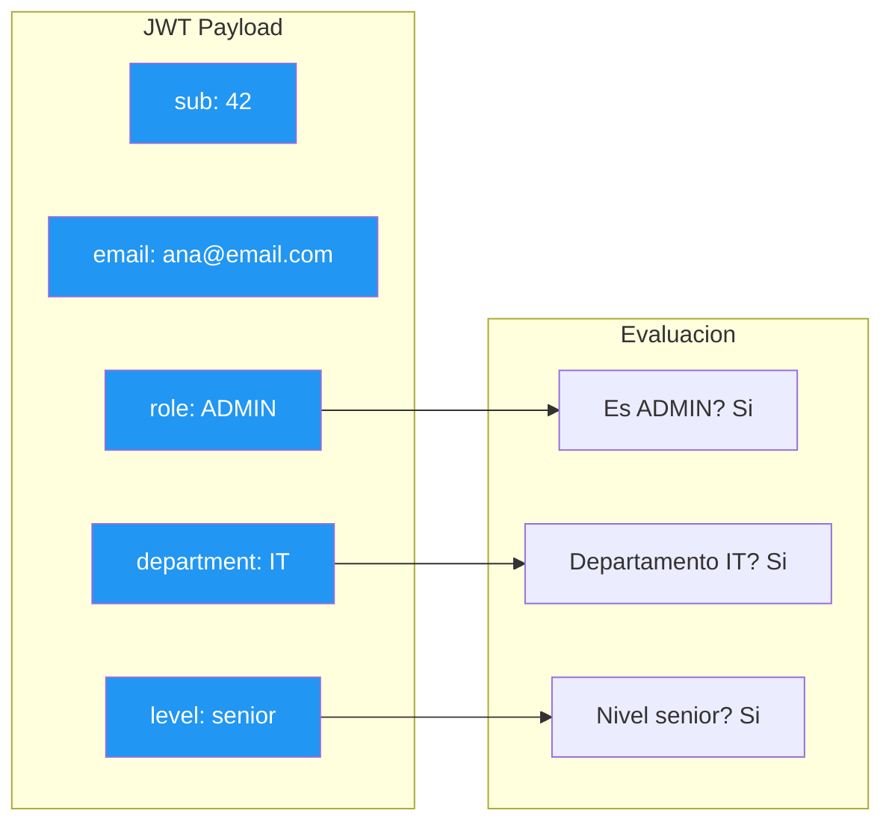

| Tipo de claim | Ejemplo | Uso |
|---------------|---------|-----|
| `sub` | `42` | ID del usuario |
| `email` | `ana@email.com` | Correo electrónico |
| `role` | `ADMIN` | Rol del usuario |
| `department` | `IT` | Departamento (personalizado) |
| `level` | `senior` | Nivel de experiencia (personalizado) |

Una vez que el usuario está autenticado, puedes leer sus claims desde el `HttpContext.User`. Esto es lo que normalmente haces en un controller para obtener información del usuario actual:

```csharp
// Leer claims del usuario autenticado
var userId = User.FindFirst("sub")?.Value;
var email = User.FindFirst("email")?.Value;
var department = User.FindFirst("department")?.Value;

// Verificar si tiene un claim específico
bool isSenior = User.HasClaim("level", "senior");
```

📌 Ejemplo real: **Slack** usa claims para saber a qué organizaciones perteneces, qué canales puedes ver y si eres administrador de algún workspace. Cada claim es una pieza de información que alimenta las decisiones de autorización.

### 17.2.3. Policies

Una **política** (policy) es una regla de autorización reutilizable que puede combinar múltiples requisitos. En lugar de escribir `[Authorize(Roles = "ADMIN")]` por todas partes, defines una política una vez y la reutilizas. Las políticas hacen tu código más limpio, más mantenible y más fácil de modificar.

El siguiente diagrama muestra cómo se construyen políticas a partir de requisitos individuales y cómo se aplican en los controllers:

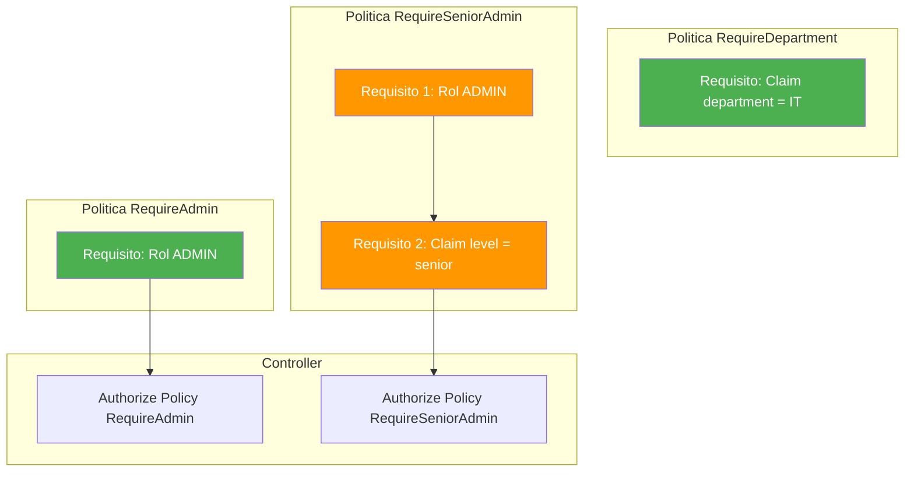

Una política puede ser tan simple como requerir un rol, o tan compleja como combinar múltiples requisitos con lógica personalizada. La clave es que defines la política una vez en `Program.cs` y la reutilizas con el atributo `[Authorize(Policy = "...")]` en cualquier endpoint.

> 💡 **Analogía:** Las Policies son como las **reglas de un club VIP**. Cada sala del club tiene sus propias reglas: la sala de karaoke requiere que seas mayor de 18, la terraza VIP requiere pulsera premium, y la sala de eventos requiere ser socio Y estar bien vestido. Tú defines las reglas una vez en la puerta del club (Program.cs) y cada sala las aplica (controllers). Si mañana cambias la regla de la terraza, solo actualizas la definición en la puerta, no tienes que ir sala por sala.

### 17.2.4. Requirements y Handlers

Un **Requirement** es una interfaz que define una condición de autorización. Un **Handler** es la clase que implementa la lógica para verificar esa condición. Juntos forman el patrón más flexible del sistema de autorización.

El flujo es el siguiente: defines un requirement (qué quieres verificar), implementas un handler (cómo lo verificas), registras la política en DI y la aplicas en tu controller. El framework se encarga de llamar al handler cuando alguien accede a un endpoint protegido con esa política.

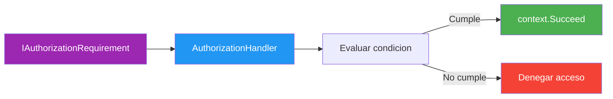

> 💡 **Consejo:** Usa Requirements y Handlers cuando la lógica de autorización es demasiado compleja para una política simple o cuando necesitas acceder a recursos de la base de datos para tomar la decisión.

## 17.3. Autorización con Roles

Los roles son el mecanismo de autorización más directo. Un usuario tiene un rol o no lo tiene, y eso determina si puede acceder a un endpoint. Veamos cómo implementar esta mecánica con ambos enfoques.

### 17.3.1. Enfoque Manual

Sin Identity, gestionas los roles en tu propio modelo de usuario y los incluyes en el JWT como claims. El primer paso es configurar las políticas de autorización en el contenedor de dependencias, indicando qué roles requiere cada política:

```csharp
using Microsoft.AspNetCore.Authorization;

namespace FunkoApi.Infrastructure;

/// <summary>
/// Configuración de autorización sin Identity.
/// </summary>
public static class AuthorizationConfig
{
    public static IServiceCollection AddAuthorizationManual(
        this IServiceCollection services)
    {
        services.AddAuthorizationBuilder()
            .SetDefaultPolicy(
                new AuthorizationPolicyBuilder(JwtBearerDefaults.AuthenticationScheme)
                    .RequireAuthenticatedUser()
                    .Build())
            .AddPolicy("RequireAdmin", policy =>
                policy.RequireRole("ADMIN"))
            .AddPolicy("RequireUser", policy =>
                policy.RequireRole("USER", "ADMIN"))
            .AddPolicy("RequireModOrAdmin", policy =>
                policy.RequireRole("MODERATOR", "ADMIN"));

        return services;
    }
}
```

Una vez configuradas las políticas, necesitas incluir el claim de rol en el token JWT. Esto se hace en el servicio que genera los tokens, añadiendo un claim de tipo `role` con el valor del rol del usuario:

```csharp
var claims = new List<Claim>
{
    new(JwtRegisteredClaimNames.Sub, user.Id.ToString()),
    new(JwtRegisteredClaimNames.Email, user.Email),
    new(JwtRegisteredClaimNames.Jti, Guid.NewGuid().ToString()),
    new("username", user.Username),
    new("role", user.Role)  // ← claim de rol
};
```

Con las políticas configuradas y el rol en el JWT, ya puedes proteger endpoints en tu controller. El atributo `[Authorize]` acepta un parámetro `Roles` donde puedes especificar uno o varios roles separados por comas:

```csharp
using Microsoft.AspNetCore.Authorization;
using Microsoft.AspNetCore.Mvc;

namespace FunkoApi.Controllers;

/// <summary>
/// Controlador de productos con autorización por roles.
/// </summary>
[ApiController]
[Route("api/[controller]")]
public class ProductosController(IProductoService productoService) : ControllerBase
{
    /// <summary>
    /// GET /api/productos — cualquier usuario autenticado.
    /// </summary>
    [HttpGet]
    [Authorize]
    public async Task<IActionResult> GetAll()
    {
        var productos = await productoService.GetAllAsync();
        return Ok(productos);
    }

    /// <summary>
    /// POST /api/productos — solo ADMIN.
    /// </summary>
    [HttpPost]
    [Authorize(Roles = "ADMIN")]
    public async Task<IActionResult> Create([FromBody] CreateProductoDto dto)
    {
        var producto = await productoService.CreateAsync(dto);
        return CreatedAtAction(nameof(GetById), new { id = producto.Id }, producto);
    }

    /// <summary>
    /// PUT /api/productos/{id} — ADMIN y USER.
    /// </summary>
    [HttpPut("{id:long}")]
    [Authorize(Roles = "ADMIN,USER")]
    public async Task<IActionResult> Update(long id, [FromBody] UpdateProductoDto dto)
    {
        var producto = await productoService.UpdateAsync(id, dto);
        return Ok(producto);
    }

    /// <summary>
    /// DELETE /api/productos/{id} — solo ADMIN.
    /// </summary>
    [HttpDelete("{id:long}")]
    [Authorize(Roles = "ADMIN")]
    public async Task<IActionResult> Delete(long id)
    {
        await productoService.DeleteAsync(id);
        return NoContent();
    }

El diagrama siguiente muestra como el middleware de autorizacion evalua cada request. Primero `UseAuthentication` crea el `ClaimsPrincipal` a partir del JWT. Luego `UseAuthorization` evalua si el usuario tiene los permisos necesarios (roles, claims o policies).

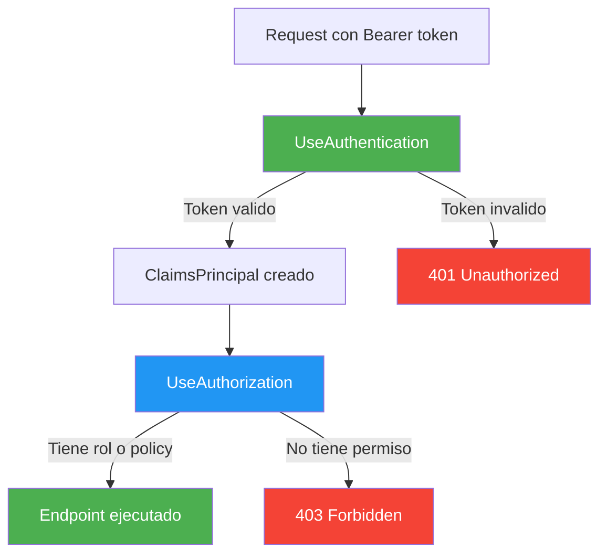

#### Verificación programática de roles en código
    [HttpGet("{id:long}/detail")]
    [Authorize]
    public async Task<IActionResult> GetById(long id)
    {
        var producto = await productoService.GetByIdAsync(id);

        // Solo el propietario o un admin puede ver detalles completos
        if (!User.IsInRole("ADMIN") &&
            producto.OwnerId != User.FindFirst("sub")?.Value)
        {
            return Forbid();
        }

        return Ok(producto);
    }
}
```

> 📝 **Nota:** Cuando especificas varios roles con `Roles = "ADMIN,USER"`, el usuario necesita tener **al menos uno** de esos roles para acceder. No necesita tener todos, solo uno.

### 17.3.2. Enfoque Identity

Con Identity, los roles se gestionan con `RoleManager` y se asignan con `UserManager`. La ventaja es que no tienes que gestionar tú la persistencia de roles en la base de datos: Identity crea automáticamente las tablas necesarias.

El primer paso es crear los roles y usuarios seed al iniciar la aplicación. Esto se hace típicamente en un servicio de inicialización que se ejecuta una vez:

```csharp
using Microsoft.AspNetCore.Identity;
using FunkoApi.Entity;

namespace FunkoApi.Infrastructure;

/// <summary>
/// Servicio para crear roles y usuarios seed con Identity.
/// </summary>
public static class SeedIdentityData
{
    public static async Task SeedAsync(IServiceProvider services)
    {
        using var scope = services.CreateScope();
        var roleManager = scope.ServiceProvider
            .GetRequiredService<RoleManager<IdentityRole<long>>>();
        var userManager = scope.ServiceProvider
            .GetRequiredService<UserManager<User>>();

        // Crear roles
        string[] roles = ["ADMIN", "USER", "MODERATOR"];
        foreach (var role in roles)
        {
            if (!await roleManager.RoleExistsAsync(role))
            {
                await roleManager.CreateAsync(new IdentityRole<long>(role));
                Log.Information("Rol creado: {Role}", role);
            }
        }

        // Crear usuario admin
        var adminEmail = "admin@funko.com";
        var adminUser = await userManager.FindByEmailAsync(adminEmail);
        if (adminUser == null)
        {
            adminUser = new User
            {
                UserName = "admin",
                Email = adminEmail,
                EmailConfirmed = true,
                FirstName = "Admin"
            };
            var result = await userManager.CreateAsync(adminUser, "Admin123!");
            if (result.Succeeded)
            {
                await userManager.AddToRoleAsync(adminUser, "ADMIN");
                Log.Information("Usuario admin creado: {Email}", adminEmail);
            }
        }

        // Crear usuario normal
        var userEmail = "user@funko.com";
        var normalUser = await userManager.FindByEmailAsync(userEmail);
        if (normalUser == null)
        {
            normalUser = new User
            {
                UserName = "user",
                Email = userEmail,
                EmailConfirmed = true,
                FirstName = "User"
            };
            var result = await userManager.CreateAsync(normalUser, "User123!");
            if (result.Succeeded)
            {
                await userManager.AddToRoleAsync(normalUser, "USER");
                Log.Information("Usuario normal creado: {Email}", userEmail);
            }
        }
    }
}
```

La configuración de autorización con Identity es idéntica a la del enfoque manual. Las políticas se registran de la misma manera, porque el sistema de autorización es independiente del sistema de autenticación:

```csharp
public static class AuthorizationConfig
{
    public static IServiceCollection AddAuthorizationWithIdentity(
        this IServiceCollection services)
    {
        services.AddAuthorizationBuilder()
            .SetDefaultPolicy(
                new AuthorizationPolicyBuilder(JwtBearerDefaults.AuthenticationScheme)
                    .RequireAuthenticatedUser()
                    .Build())
            .AddPolicy("RequireAdmin", policy =>
                policy.RequireRole("ADMIN"))
            .AddPolicy("RequireUser", policy =>
                policy.RequireRole("USER", "ADMIN"));

        return services;
    }
}
```

La diferencia fundamental es que Identity te ofrece un conjunto de métodos integrados para gestionar roles. Con `UserManager` puedes añadir, quitar y consultar roles de un usuario sin escribir una sola línea de SQL:

```csharp
// Asignar rol a un usuario
await userManager.AddToRoleAsync(user, "ADMIN");

// Quitar rol
await userManager.RemoveFromRoleAsync(user, "ADMIN");

// Obtener roles del usuario
var roles = await userManager.GetRolesAsync(user);

// Verificar rol
bool isAdmin = await userManager.IsInRoleAsync(user, "ADMIN");
```

> 📝 **Nota:** La configuración de políticas con `AddAuthorizationBuilder()` es **idéntica** en ambos enfoques. Solo cambia cómo se crean y asignan los roles (RoleManager vs tu propia lógica).

## 17.4. Autorización con Claims

Los claims van un paso más allá de los roles. Mientras que un rol te dice "este usuario es ADMIN", un claim te dice "este usuario pertenece al departamento IT y tiene nivel senior". Los claims permiten condiciones de autorización mucho más granulares.

### 17.4.1. Enfoque Manual

Con el enfoque manual, añades claims personalizados directamente al JWT en el JwtService. Estos claims viajan dentro del token y se extraen cuando el middleware de autenticación lo valida.

Para añadir claims personalizados, simplemente inclúyelos en la lista de claims que se genera al crear el token. Cada claim es un par clave-valor que el cliente no puede modificar (está firmado criptográficamente):

```csharp
public string GenerateToken(User user)
{
    var key = new SymmetricSecurityKey(Encoding.UTF8.GetBytes(_secretKey));
    var creds = new SigningCredentials(key, SecurityAlgorithms.HmacSha256);

    var claims = new List<Claim>
    {
        new(JwtRegisteredClaimNames.Sub, user.Id.ToString()),
        new(JwtRegisteredClaimNames.Email, user.Email),
        new(JwtRegisteredClaimNames.Jti, Guid.NewGuid().ToString()),
        new("username", user.Username),
        new("role", user.Role),
        // Claims personalizados
        new("department", user.Department ?? "GENERAL"),
        new("level", user.Level ?? "junior")
    };

    var token = new JwtSecurityToken(
        issuer: _issuer,
        audience: _audience,
        claims: claims,
        expires: DateTime.UtcNow.AddMinutes(_accessTokenExpiryMinutes),
        signingCredentials: creds
    );

    return new JwtSecurityTokenHandler().WriteToken(token);
}
```

Una vez que el token está generado, puedes leer los claims en cualquier controller usando `User.FindFirst()`. Esto te permite personalizar la respuesta según la información del usuario:

```csharp
[ApiController]
[Route("api/[controller]")]
public class AdminController : ControllerBase
{
    [HttpGet("profile")]
    [Authorize]
    public IActionResult GetProfile()
    {
        return Ok(new
        {
            Id = User.FindFirst("sub")?.Value,
            Username = User.FindFirst("username")?.Value,
            Email = User.FindFirst("email")?.Value,
            Role = User.FindFirst("role")?.Value,
            Department = User.FindFirst("department")?.Value,
            Level = User.FindFirst("level")?.Value
        });
    }

    [HttpGet("reports")]
    [Authorize(Policy = "RequireDepartmentIT")]
    public IActionResult GetReports()
    {
        return Ok(new { Message = "Reportes del departamento IT" });
    }
}
```

📌 Ejemplo real: **GitHub** usa claims para controlar el acceso a repositorios. Un claim indica si eres "miembro" o "admin" de una organización, y otro claim indica tu nivel de acceso a cada repositorio (lectura, escritura o administración).

### 17.4.2. Enfoque Identity

Con Identity, los claims se gestionan con `UserManager` y se persisten en la base de datos. A diferencia del enfoque manual (donde los claims viajan en el JWT), Identity almacena los claims en la tabla `AspNetUserClaims` y los carga automáticamente en el `ClaimsPrincipal` durante la autenticación.

Para añadir claims a un usuario, usa `UserManager.AddClaimAsync()`. También puedes actualizar, consultar y eliminar claims con los métodos correspondientes:

```csharp
// Añadir claims a un usuario
await userManager.AddClaimAsync(user, new Claim("department", "IT"));
await userManager.AddClaimAsync(user, new Claim("level", "senior"));

// Actualizar un claim
await userManager.ReplaceClaimAsync(user,
    new Claim("department", "IT"),
    new Claim("department", "HR"));

// Obtener claims de un usuario
var claims = await userManager.GetClaimsAsync(user);

// Eliminar un claim
await userManager.RemoveClaimAsync(user, new Claim("level", "senior"));
```

La forma de leer claims en el controller es exactamente igual que en el enfoque manual. El `ClaimsPrincipal` tiene la misma estructura independientemente de dónde provengan los claims:

```csharp
[HttpGet("profile")]
[Authorize]
public IActionResult GetProfile()
{
    return Ok(new
    {
        Id = User.FindFirst("sub")?.Value,
        Email = User.FindFirst("email")?.Value,
        Department = User.FindFirst("department")?.Value,
        Level = User.FindFirst("level")?.Value
    });
}
```

> 💡 **Consejo:** Con Identity, los claims se almacenan en la tabla `AspNetUserClaims` y se cargan automáticamente en el `ClaimsPrincipal` durante la autenticación. Con el enfoque manual, los claims viajan dentro del JWT y se extraen al validar el token.

## 17.5. Políticas de Autorización

Las políticas son la forma más potente de definir reglas de autorización. En lugar de escribir condiciones sueltas por toda la aplicación, defines una política una vez y la reutilizas. Esto hace tu código más limpio y más fácil de mantener.

### 17.5.1. Enfoque Manual

Las políticas se registran en el contenedor de dependencias con `AddAuthorizationBuilder()`. Cada política es una combinación de requisitos que el framework evalúa cuando alguien accede a un endpoint protegido.

**Política simple — solo requerir un rol:**

La forma más básica es crear una política que requiera un rol concreto. Esto es equivalente a usar `[Authorize(Roles = "ADMIN")]` directamente, pero con la ventaja de que puedes reutilizar la política en múltiples endpoints:

```csharp
services.AddAuthorizationBuilder()
    .AddPolicy("RequireAdmin", policy =>
        policy.RequireRole("ADMIN"));
```

**Política con claims — verificar edad mínima:**

También puedes crear políticas que verifiquen claims específicos. Por ejemplo, una política que solo permita el acceso si el usuario tiene un claim de edad mayor o igual a 18:

```csharp
services.AddAuthorizationBuilder()
    .AddPolicy("MinimumAge18", policy =>
        policy.RequireClaim("age", claim =>
            int.Parse(claim.Value) >= 18));
```

**Política con assertion — combinación de condiciones:**

Cuando necesitas combinar múltiples condiciones con lógica AND/OR, puedes usar `RequireAssertion()`. Esto te permite escribir cualquier condición en C#:

```csharp
services.AddAuthorizationBuilder()
    .AddPolicy("CanManageProducts", policy =>
        policy.RequireAssertion(context =>
            context.User.IsInRole("ADMIN") ||
            context.User.HasClaim("department", "INVENTORY")));
```

**Política con requirements personalizados:**

Para lógica compleja que no puedes expresar con los métodos integrados, puedes crear requisitos personalizados y añadirlos a la política con `AddRequirements()`:

```csharp
services.AddAuthorizationBuilder()
    .AddPolicy("RequireDepartment", policy =>
        policy.AddRequirements(new RequireDepartmentRequirement("IT")));
```

Una vez registradas las políticas, las aplicas en tus controllers con el atributo `[Authorize(Policy = "...")]`. Cada endpoint puede tener una política diferente según sus necesidades:

```csharp
[ApiController]
[Route("api/[controller]")]
public class ReportsController : ControllerBase
{
    [HttpGet("sales")]
    [Authorize(Policy = "RequireAdmin")]
    public IActionResult GetSalesReport()
    {
        return Ok(new { Report = "Ventas totales" });
    }

    [HttpGet("team")]
    [Authorize(Policy = "RequireDepartment")]
    public IActionResult GetTeamReport()
    {
        return Ok(new { Report = "Reporte del equipo IT" });
    }

    [HttpGet("premium")]
    [Authorize(Policy = "MinimumAge18")]
    public IActionResult GetPremiumContent()
    {
        return Ok(new { Content = "Contenido premium" });
    }
}
```

### 17.5.2. Enfoque Identity

La configuración de políticas con Identity es **idéntica** a la del enfoque manual. Las políticas son independientes del sistema de autenticación, por lo que solo cambia el contexto de registro en `Program.cs`. Ya tienes Identity configurado, así que añades las políticas directamente:

```csharp
// Con Identity, las políticas se registran igual
services.AddAuthorizationBuilder()
    .SetDefaultPolicy(
        new AuthorizationPolicyBuilder(JwtBearerDefaults.AuthenticationScheme)
            .RequireAuthenticatedUser()
            .Build())
    .AddPolicy("RequireAdmin", policy =>
        policy.RequireRole("ADMIN"))
    .AddPolicy("RequireUser", policy =>
        policy.RequireRole("USER", "ADMIN"))
    .AddPolicy("MinimumAge18", policy =>
        policy.RequireClaim("age", claim =>
            int.Parse(claim.Value) >= 18));
```

> 📝 **Nota:** Las políticas de autorización son **independientes** del sistema de autenticación. Funcionan exactamente igual con JWT manual, Identity, cookies o cualquier otro esquema. Solo necesitan un `ClaimsPrincipal` válido, que viene del middleware de autenticación.

## 17.6. Requirements y Handlers Personalizados

Cuando las políticas integradas (`RequireRole`, `RequireClaim`, `RequireAssertion`) no son suficientes, puedes crear requirements y handlers personalizados. Esto te permite implementar lógica de autorización arbitraria: consultar la base de datos, llamar a servicios externos o combinar múltiples condiciones de negocio.

### 17.6.1. Enfoque Manual

El patrón consta de tres partes: un **requirement** (define qué quieres verificar), un **handler** (implementa cómo lo verificas) y un **registro** en el contenedor de dependencias.

**Requirement — define la condición:**

El requirement es una clase que implementa `IAuthorizationRequirement`. En C# 14, puedes usar un primary constructor para pasar los parámetros necesarios. En este caso, el nombre del departamento requerido:

```csharp
using Microsoft.AspNetCore.Authorization;

namespace FunkoApi.Authorization;

/// <summary>
/// Requisito que verifica que el usuario pertenece a un departamento concreto.
/// </summary>
public class RequireDepartmentRequirement(string department) : IAuthorizationRequirement
{
    /// <summary>Departamento requerido.</summary>
    public string Department { get; } = department;
}
```

**Handler — implementa la lógica:**

El handler es donde se ejecuta la lógica de verificación. Hereda de `AuthorizationHandler<T>` y sobrescribe `HandleRequirementAsync()`. Si la condición se cumple, llamas a `context.Succeed(requirement)`. Si no se cumple, simplemente no haces nada (el framework denegará el acceso):

```csharp
using Microsoft.AspNetCore.Authorization;
using Serilog;

namespace FunkoApi.Authorization;

/// <summary>
/// Handler que verifica si el usuario pertenece al departamento requerido.
/// </summary>
public class RequireDepartmentHandler : AuthorizationHandler<RequireDepartmentRequirement>
{
    /// <inheritdoc />
    protected override Task HandleRequirementAsync(
        AuthorizationHandlerContext context,
        RequireDepartmentRequirement requirement)
    {
        var department = context.User.FindFirst("department")?.Value;

        if (department is null)
        {
            Log.Warning("Usuario sin claim department");
            return Task.CompletedTask;
        }

        if (department.Equals(requirement.Department, StringComparison.OrdinalIgnoreCase))
        {
            Log.Information(
                "Departamento verificado: {UserDept} == {RequiredDept}",
                department, requirement.Department);
            context.Succeed(requirement);
        }
        else
        {
            Log.Warning(
                "Departamento no coincide: {UserDept} != {RequiredDept}",
                department, requirement.Department);
        }

        return Task.CompletedTask;
    }
}
```

**Handler para verificar propietario de recurso:**

Un caso muy habitual es verificar si el usuario es propietario de un recurso concreto. Este handler extrae el ID del recurso desde la ruta de la petición, obtiene el recurso de la base de datos y compara el propietario con el usuario actual. Los usuarios ADMIN siempre pasan la verificación:

```csharp
using Microsoft.AspNetCore.Authorization;

namespace FunkoApi.Authorization;

/// <summary>
/// Requisito que verifica si el usuario es propietario del recurso.
/// </summary>
public class ResourceOwnerRequirement : IAuthorizationRequirement { }

/// <summary>
/// Handler que verifica si el usuario es propietario del recurso o es ADMIN.
/// </summary>
public class ResourceOwnerHandler(
    IProductoRepository productoRepository,
    IHttpContextAccessor httpContextAccessor)
    : AuthorizationHandler<ResourceOwnerRequirement>
{
    /// <inheritdoc />
    protected override async Task HandleRequirementAsync(
        AuthorizationHandlerContext context,
        ResourceOwnerRequirement requirement)
    {
        var httpContext = httpContextAccessor.HttpContext;
        if (httpContext is null) return;

        // Si es ADMIN, siempre tiene acceso
        if (context.User.IsInRole("ADMIN"))
        {
            context.Succeed(requirement);
            return;
        }

        // Obtener ID del recurso desde la ruta
        var routeId = httpContext.Request.RouteValues["id"]?.ToString();
        if (string.IsNullOrEmpty(routeId) || !long.TryParse(routeId, out var productId))
            return;

        // Obtener ID del usuario
        var userId = context.User.FindFirst("sub")?.Value;
        if (string.IsNullOrEmpty(userId)) return;

        // Verificar propietario
        var producto = await productoRepository.GetByIdAsync(productId);
        if (producto is not null && producto.OwnerId.ToString() == userId)
        {
            context.Succeed(requirement);
        }
    }
}
```

**Registrar handlers y políticas:**

El último paso es registrar los handlers en el contenedor de dependencias y crear las políticas que los referencian. Los handlers se registran como `IAuthorizationHandler`, y las políticas se vinculan a los requirements con `AddRequirements()`:

```csharp
services.AddSingleton<IAuthorizationHandler, RequireDepartmentHandler>();
services.AddSingleton<IAuthorizationHandler, ResourceOwnerHandler>();

services.AddAuthorizationBuilder()
    .AddPolicy("RequireDepartmentIT", policy =>
        policy.AddRequirements(new RequireDepartmentRequirement("IT")))
    .AddPolicy("RequireProductOwner", policy =>
        policy.AddRequirements(new ResourceOwnerRequirement()));
```

### 17.6.2. Enfoque Identity

Los handlers son **idénticos** en ambos enfoques. La lógica de verificación no cambia porque el sistema de autorización es independiente del sistema de autenticación. Lo único que cambia es el contexto de registro en `Program.cs`, donde ya tienes Identity configurado:

```csharp
// Mismo handler, mismo código
public class RequireDepartmentHandler : AuthorizationHandler<RequireDepartmentRequirement>
{
    protected override Task HandleRequirementAsync(
        AuthorizationHandlerContext context,
        RequireDepartmentRequirement requirement)
    {
        var department = context.User.FindFirst("department")?.Value;
        if (department?.Equals(requirement.Department, StringComparison.OrdinalIgnoreCase) == true)
            context.Succeed(requirement);

        return Task.CompletedTask;
    }
}

// Registro idéntico
services.AddSingleton<IAuthorizationHandler, RequireDepartmentHandler>();
services.AddSingleton<IAuthorizationHandler, ResourceOwnerHandler>();
```

> 💡 **Consejo:** Los handlers son la pieza más flexible del sistema de autorización. Pueden acceder a la base de datos, servicios externos o cualquier lógica de negocio para tomar la decisión. Usa `AddSingleton` si el handler no tiene estado dependiente de la request, o `AddScoped` si necesita servicios Scoped.

## 17.7. Autorización Basada en Recursos

La autorización basada en recursos verifica permisos sobre un **objeto concreto**, no sobre una acción genérica. Por ejemplo: "solo el dueño de un producto puede editarlo". Esto va más allá de los roles y claims porque necesita acceder al recurso real para tomar la decisión.

El flujo de este tipo de autorización es el siguiente: el controller recibe la petición, obtiene el recurso de la base de datos y luego verifica si el usuario tiene permiso sobre ese recurso específico. Si el usuario es propietario o tiene un rol elevado (como ADMIN), se permite la operación. En caso contrario, se devuelve 403 Forbidden.


Para implementar esta verificación, puedes usar `IAuthorizationService` que ASP.NET Core te inyecta automáticamente. Este servicio te permite evaluar políticas sobre recursos concretos en tiempo de ejecución:

```csharp
[ApiController]
[Route("api/[controller]")]
public class ProductosController(
    IProductoService productoService,
    IAuthorizationService authorizationService) : ControllerBase
{
    [HttpPut("{id:long}")]
    [Authorize]
    public async Task<IActionResult> Update(long id, UpdateProductoDto dto)
    {
        var producto = await productoService.GetByIdAsync(id);
        if (producto is null) return NotFound();

        // Verificar propietario con IAuthorizationService
        var authResult = await authorizationService.AuthorizeAsync(
            User, producto, "RequireProductOwner");

        if (!authResult.Succeeded)
            return Forbid();

        await productoService.UpdateAsync(id, dto);
        return Ok(producto);
    }

    [HttpDelete("{id:long}")]
    [Authorize]
    public async Task<IActionResult> Delete(long id)
    {
        var producto = await productoService.GetByIdAsync(id);
        if (producto is null) return NotFound();

        // Verificación directa (más simple)
        if (!User.IsInRole("ADMIN") &&
            producto.OwnerId.ToString() != User.FindFirst("sub")?.Value)
        {
            return Forbid();
        }

        await productoService.DeleteAsync(id);
        return NoContent();
    }
}
```

Si necesitas reutilizar la verificación de autorización basada en recursos en varios controllers, puedes crear un servicio wrapper que encapsule `IAuthorizationService` con métodos de conveniencia:

```csharp
using Microsoft.AspNetCore.Authorization;

namespace FunkoApi.Services;

/// <summary>
/// Servicio wrapper para IAuthorizationService con métodos de conveniencia.
/// </summary>
public class AuthorizationService(
    Microsoft.AspNetCore.Authorization.IAuthorizationService authorizationService,
    IHttpContextAccessor httpContextAccessor)
{
    /// <summary>
    /// Verifica si el usuario actual cumple una política sobre un recurso.
    /// </summary>
    public async Task<bool> CanAsync<TResource>(string policyName, TResource resource)
    {
        var user = httpContextAccessor.HttpContext!.User;
        var result = await authorizationService.AuthorizeAsync(user, resource, policyName);
        return result.Succeeded;
    }

    /// <summary>
    /// Verifica si el usuario actual es propietario del recurso.
    /// </summary>
    public async Task<bool> IsOwnerAsync<TResource>(TResource resource)
    {
        return await CanAsync("RequireProductOwner", resource);
    }
}
```

> ⚠️ **Advertencia:** La autorización basada en recursos requiere acceso al objeto real desde la base de datos. Esto implica una consulta adicional por cada request protegido. Úsala solo cuando sea estrictamente necesario y considera cachear los resultados.

## 17.8. Comparación de Enfoques

Hemos visto dos caminos para implementar autorización: el enfoque manual (tú gestionas todo) y el enfoque Identity (el framework te ayuda). La siguiente tabla resume las diferencias clave para que puedas decidir cuál se adapta mejor a tu proyecto:

| Aspecto | Enfoque Manual | Enfoque Identity |
|---------|---------------|------------------|
| **Control total** | Sí, tú gestionas todo | Limitado por el framework |
| **Tablas BD** | 1 tabla (users) | 7+ tablas (AspNetUsers, etc.) |
| **Gestión de roles** | Campo en tu modelo | RoleManager integrado |
| **Claims en JWT** | Tú los añades en JwtService | UserManager.AddClaimAsync() |
| **Policies** | Idénticas | Idénticas |
| **Requirements/Handlers** | Idénticos | Idénticos |
| **Resource-based** | Idéntico | Idéntico |
| **Tiempo de setup** | Medio (más código manual) | Bajo (scaffolding) |
| **Mantenimiento** | Lo mantienes tú | Microsoft lo mantiene |
| **Flexibilidad** | Total | Limitada por convenciones |

Para ayudarte a decidir, el siguiente diagrama muestra el proceso de elección entre ambos enfoques. La clave es que la autorización (roles, claims, policies, handlers) funciona igual en ambos casos; lo que cambia es cómo gestionas la identidad del usuario:

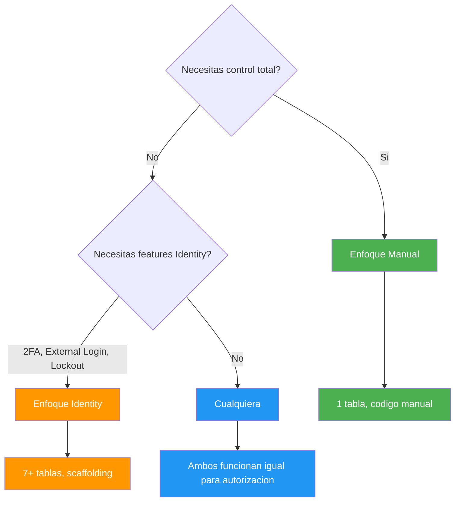

> 💡 **Consejo:** La autorización (roles, claims, policies, handlers) funciona **exactamente igual** en ambos enfoques. La única diferencia es cómo gestionas la identidad del usuario. Elige el enfoque de autenticación que mejor se adapte a tu proyecto y la autorización será la misma.

## 17.9. Buenas Prácticas

Antes de pasar al reto, es fundamental que interiorices estas buenas prácticas. La autorización es una de las áreas donde los errores tienen consecuencias directas en la seguridad de tu aplicación.

```mermaid
flowchart TB
    subgraph "Principios"
        P1["Minimo privilegio"]
        P2["Denegar por defecto"]
        P3["Permitir explicitamente"]
    end

    subgraph "Seguridad"
        S1["No confiar en el cliente"]
        S2["Validar en cada request"]
        S3["Logs de accesos denegados"]
    end

    subgraph "Mantenimiento"
        M1["Nombres claros de politicas"]
        M2["Tests de autorizacion"]
        M3["Documentar permisos"]
    end

    P1 --> P2 --> P3
    S1 --> S2 --> S3
    M1 --> M2 --> M3

    style P1 fill:#4CAF50,color:#fff
    style P2 fill:#4CAF50,color:#fff
    style P3 fill:#4CAF50,color:#fff
    style S1 fill:#f44336,color:#fff
    style S2 fill:#f44336,color:#fff
    style S3 fill:#f44336,color:#fff
    style M1 fill:#2196F3,color:#fff
    style M2 fill:#2196F3,color:#fff
    style M3 fill:#2196F3,color:#fff
```

| Práctica | Descripción |
|----------|-------------|
| **Mínimo privilegio** | Dar solo los permisos estrictamente necesarios |
| **Denegar por defecto** | Si no hay política que permita, se deniega |
| **No confiar en el cliente** | Siempre validar en el servidor, nunca en el frontend |
| **Logs de accesos denegados** | Registrar intentos fallidos para auditoría |
| **Tests de autorización** | Verificar que cada endpoint deniega correctamente |
| **Nombres claros** | Policies con nombres descriptivos: `RequireAdmin`, no `Policy1` |
| **Evitar consultas BD en handlers** | Cuando sea posible, usar claims ya cargados |
| **Documentar permisos** | Cada endpoint debe indicar qué rol/política requiere |

✅ **Buena práctica:** Siempre define una política por defecto que requiera autenticación. Así, si olvidas añadir `[Authorize]` a un endpoint, denegará acceso por defecto en lugar de permitirlo anónimamente.

```csharp
// ❌ MALO: No hacer rollback en catch — si falla la autorización, los cambios parciales quedan en la BD
try
{
    var producto = await repo.GetByIdAsync(id);
    producto.Stock -= cantidad;
    await repo.UpdateAsync(producto);  // Cambio parcial aplicado
    await authorizationService.AuthorizeAsync(User, producto, "RequireOwner");
    // Si la autorización falla, el cambio de stock ya está en la BD
}
catch (UnauthorizedAccessException)
{
    // No se hace nada — ¡el cambio de stock ya se aplicó!
    return Forbid();
}

// ✅ BUENO: SIEMPRE rollback en catch — la transacción solo se confirma si todo va bien
using var transaction = await dbContext.Database.BeginTransactionAsync();
try
{
    var producto = await repo.GetByIdAsync(id);
    producto.Stock -= cantidad;
    await repo.UpdateAsync(producto);
    var authResult = await authorizationService.AuthorizeAsync(User, producto, "RequireOwner");
    if (!authResult.Succeeded)
    {
        await transaction.RollbackAsync();  // Revertir cambios
        return Forbid();
    }
    await transaction.CommitAsync();  // Confirmar solo si todo OK
}
catch
{
    await transaction.RollbackAsync();  // Siempre rollback en error
    throw;
}
```

```csharp
// ❌ MALO: SELECT sin FOR UPDATE en pesimista — dos usuarios leen el mismo stock simultáneamente
var producto = await repo.GetByIdAsync(id);  // SELECT * FROM productos WHERE id = @id
producto.Stock -= cantidad;  // Ambos usuarios leen stock = 10, ambos restan 3 → stock = 7 (debería ser 4)
await repo.UpdateAsync(producto);

// ✅ BUENO: SELECT FOR UPDATE para bloquear filas — un usuario espera a que el otro termine
var producto = await dbContext.Productos
    .FromSqlRaw("SELECT * FROM productos WHERE id = {0} FOR UPDATE", id)
    .FirstAsync();  // Bloquea la fila hasta que termine la transacción
producto.Stock -= cantidad;
await dbContext.SaveChangesAsync();
```

> ⚠️ **Advertencia:** **Nunca** confíes en que el frontend filtra lo que el usuario puede ver. Si un usuario malicioso llama directamente a tu API con un token válido pero sin permisos, el servidor debe denegar el acceso. La autorización **siempre** se verifica en el backend.

## 17.10. Reto

> Aplica autorización completa a FunkoApp usando Identity.

**Añade a tu API:**

1. **Crear roles:** `ADMIN` y `USER` al iniciar la app con `RoleManager`
2. **Seed de usuarios:** admin (`admin` / `admin123`, rol `ADMIN`) y user (`user` / `user123`, rol `USER`)
3. **Endpoints protegidos:**
   - `GET /api/productos` → público (sin auth)
   - `POST /api/productos` → solo `ADMIN`
   - `PUT /api/productos/{id}` → `ADMIN` y `USER`
   - `DELETE /api/productos/{id}` → solo `ADMIN`
4. **Política personalizada:** `RequireProductOwner` — solo el propietario del producto o un `ADMIN` puede modificar
5. **Tests de autorización:** verificar que cada endpoint deniega correctamente a usuarios sin permisos

**Puntos extra:**

- Claims personalizados (`department`, `level`)
- Handler de autorización basado en recursos con `IAuthorizationService`
- Rate limiting por rol (más requests para ADMIN, menos para USER)

**Resumen del punto:**

| Concepto | Descripción |
|----------|-------------|
| **Autorización** | Determina qué puede hacer un usuario autenticado |
| **Autenticación vs Autorización** | ¿Quién eres? vs ¿Qué puedes hacer? |
| **Roles** | Agrupación binaria de permisos (ADMIN, USER) |
| **Claims** | Pares clave-valor con información del usuario |
| **Policies** | Reglas de autorización reutilizables |
| **Requirements** | Interfaces que definen condiciones de autorización |
| **Handlers** | Implementación de la lógica de verificación |
| **Resource-based** | Autorización sobre un objeto concreto |
| **Enfoque Manual** | Tú gestionas usuarios, roles y claims |
| **Enfoque Identity** | UserManager y RoleManager integrados |
| **`[Authorize]`** | Atributo para proteger endpoints |
| **`User.IsInRole()`** | Verificación programática de roles |
| **`IAuthorizationService`** | Autorización programática sobre recursos |
| **401 vs 403** | 401 = no autenticado, 403 = no autorizado |
| **Mínimo privilegio** | Dar solo los permisos estrictamente necesarios |

**¿Qué viene después?**

En el siguiente punto veremos **Logging con Serilog**: cómo configurar el sistema de registro de la aplicación para monitorizar errores, peticiones HTTP y actividad de los usuarios. Verás cómo integrar Serilog con ASP.NET Core y cómo configurar sinks para consola, fichero y bases de datos.
