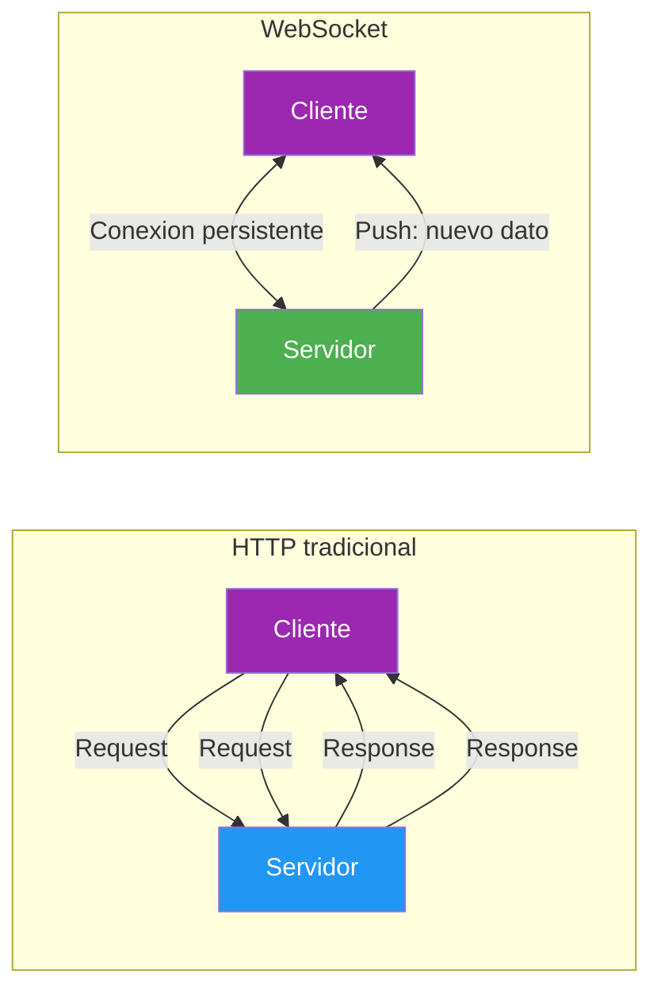
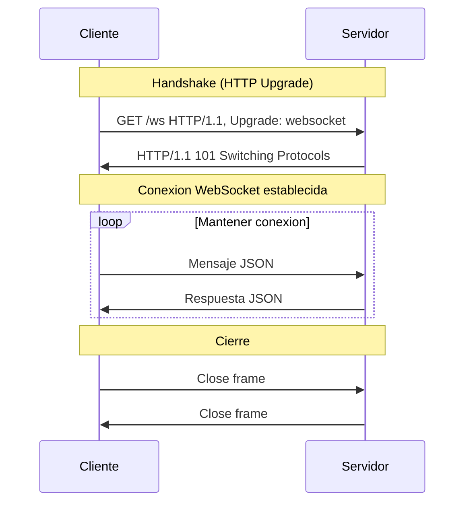
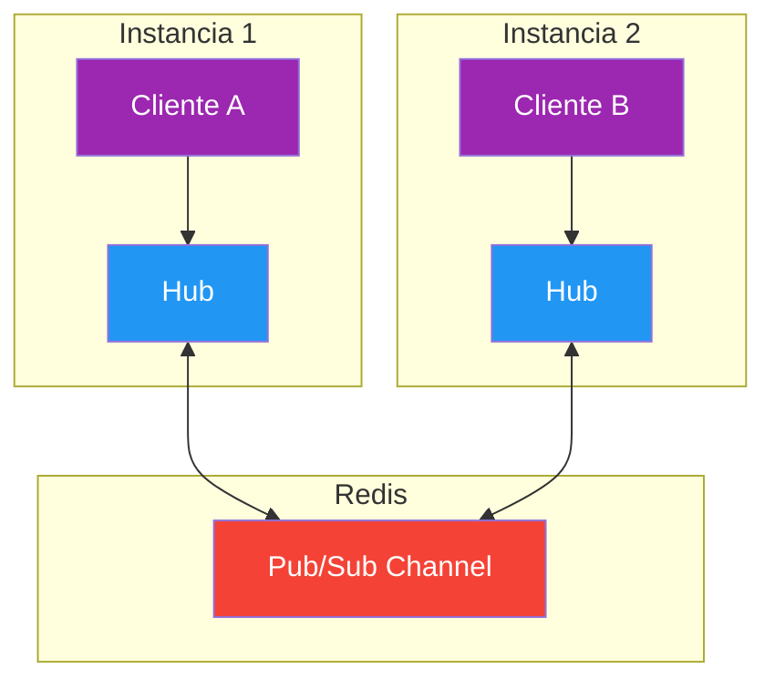

# 18. WebSockets y SignalR

- [18. WebSockets y SignalR](#18-websockets-y-signalr)
  - [18.1. Introduccion](#181-introduccion)
    - [18.1.1. Que es la Comunicacion en Tiempo Real](#1811-que-es-la-comunicacion-en-tiempo-real)
    - [18.1.2. HTTP vs WebSocket](#1812-http-vs-websocket)
    - [18.1.3. Casos de Uso](#1813-casos-de-uso)
    - [18.1.4. El Handshake WebSocket](#1814-el-handshake-websocket)
  - [18.2. WebSocket vs SignalR](#182-websocket-vs-signalr)
    - [18.2.1. Que es SignalR](#1821-que-es-signalr)
    - [18.2.2. Cuándo Usar Cada Uno](#1822-cuándo-usar-cada-uno)
  - [18.3. WebSocket Nativo en ASP.NET Core](#183-websocket-nativo-en-aspnet-core)
    - [18.3.1. Configuracion](#1831-configuracion)
    - [18.3.2. WebSocketConnectionManager](#1832-websocketconnectionmanager)
    - [18.3.3. WebSocketHandler](#1833-websockethandler)
    - [18.3.4. Endpoint de Conexion](#1834-endpoint-de-conexion)
  - [18.4. SignalR en ASP.NET Core](#184-signalr-en-aspnet-core)
    - [18.4.1. Configuracion](#1841-configuracion)
    - [18.4.2. Hub Basico](#1842-hub-basico)
    - [18.4.3. Ciclo de Vida: OnConnectedAsync / OnDisconnectedAsync](#1843-ciclo-de-vida-onconnectedasync--ondisconnectedasync)
  - [18.5. SignalR con Identity y JWT](#185-signalr-con-identity-y-jwt)
    - [18.5.1. Proteccion de Hubs](#1851-proteccion-de-hubs)
    - [18.5.2. Claims en el Hub](#1852-claims-en-el-hub)
    - [18.5.3. Configuracion JWT en SignalR](#1853-configuracion-jwt-en-signalr)
  - [18.6. Sistema de Grupos](#186-sistema-de-grupos)
    - [18.6.1. Grupos por Usuario](#1861-grupos-por-usuario)
    - [18.6.2. Grupos por Rol](#1862-grupos-por-rol)
    - [18.6.3. Grupos Personalizados](#1863-grupos-personalizados)
  - [18.7. IHubContext: Notificaciones desde Servicios](#187-ihubcontext-notificaciones-desde-servicios)
    - [18.7.1. Patron de Inyeccion](#1871-patron-de-inyeccion)
    - [18.7.2. Notificaciones Privadas vs Publicas](#1872-notificaciones-privadas-vs-publicas)
  - [18.8. Cliente JavaScript](#188-cliente-javascript)
    - [18.8.1. Cliente SignalR Basico](#1881-cliente-signalr-basico)
    - [18.8.2. Autenticacion con JWT](#1882-autenticacion-con-jwt)
    - [18.8.3. Reconexion Automatica](#1883-reconexion-automatica)
  - [18.9. Escalabilidad con Redis](#189-escalabilidad-con-redis)
  - [18.10. Seguridad](#1810-seguridad)
  - [18.11. Buenas Practicas](#1811-buenas-practicas)
  - [18.12. Testing](#1812-testing)
  - [18.13. Reto](#1813-reto)
  - [18.14. Resumen](#1814-resumen)

---

> **Punto de partida:** Cuando publicas un producto en una tienda online, los administradores deberian ver el cambio al instante sin recargar la pagina. En el modelo HTTP tradicional, el cliente debe preguntar periodicamente al servidor si hay novedades (polling). La **comunicacion en tiempo real** elimina ese problema: el servidor emite datos a los clientes conectados tan pronto como ocurre un evento.

## 18.1. Introduccion

### 18.1.1. Que es la Comunicacion en Tiempo Real

La **comunicacion en tiempo real** permite que el servidor envie datos a los clientes sin que estos lo soliciten. Elimina el patron request-response donde el cliente siempre inicia la comunicacion. Es fundamental para chat en vivo, dashboards de metricas, notificaciones push y aplicaciones colaborativas como Google Docs.

> 📝 **Nota:** La comunicacion en tiempo real no reemplaza a HTTP. Se usa junto con HTTP para funcionalidades especificas donde el servidor necesita "hablar" primero. Las APIs REST siguen siendo ideales para CRUD operaciones normales.

En HTTP tradicional, si quieres saber si hay nuevo contenido, debes preguntar periodicamente:

```
Cliente: "¿Hay algo nuevo?"  →  Servidor: "No"
Cliente: "¿Hay algo nuevo?"  →  Servidor: "Si, mira esto"
Cliente: "¿Hay algo nuevo?"  →  Servidor: "No"
```

Con tiempo real, el servidor simplemente te avisa cuando hay algo:

```
Servidor: "Oye, hay un producto nuevo"
Servidor: "El stock de este producto se agoto"
```

### 18.1.2. HTTP vs WebSocket

| Aspecto | HTTP | WebSocket |
|---------|------|-----------|
| **Direccion** | Unidireccional (cliente pregunta) | Bidireccional |
| **Conexion** | Se cierra tras cada respuesta | Persistente |
| **Latencia** | Mayor (nueva conexion por request) | Minima (conexion abierta) |
| **Overhead** | Headers completos en cada request | Headers solo al conectar |
| **Uso ideal** | APIs REST, CRUD | Chat, notificaciones, gaming |



> **Analogia:** HTTP es como llamar a un amigo cada vez que quieres saber algo. WebSocket es como tener una llamada telefonica abierta permanente: cualquiera de los dos puede hablar cuando quiera.

### 18.1.3. Casos de Uso

| Caso de uso | Ejemplo real | Tecnologia recomendada |
|-------------|-------------|----------------------|
| **Chat en vivo** | WhatsApp Web, Discord | WebSocket o SignalR |
| **Notificaciones push** | Gmail, Slack | WebSocket o SignalR |
| **Dashboard en tiempo real** | Grafana, Datadog | WebSocket o SignalR |
| **Colaboracion** | Google Docs, Figma | WebSocket |
| **Gaming multiplayer** | .io games | WebSocket nativo |
| **API simple** | CRUD de productos | REST |

📌 Ejemplo real: **Slack** usa WebSocket para mantener abierta la conexion entre el navegador y sus servidores. Cuando alguien escribe un mensaje en un canal, todos los usuarios conectados lo ven al instante sin recargar la pagina. Sin WebSocket, Slack tendria que hacer polling cada 2 segundos, lo cual seria ineficiente y lento.

> **Nota:** Para la mayoria de casos de uso en aplicaciones web empresariales, **SignalR es la mejor eleccion**. WebSocket nativo solo es necesario en escenarios de rendimiento extremo (gaming, streaming de video en tiempo real).

### 18.1.4. El Handshake WebSocket

La conexion WebSocket comienza con un **handshake** que parece una peticion HTTP normal pero incluye headers especiales para actualizar la conexion al protocolo WebSocket.



**Peticion del cliente:**
```http
GET /ws HTTP/1.1
Host: localhost:5000
Upgrade: websocket
Connection: Upgrade
Sec-WebSocket-Key: dGhlIHNhbXBsZSBub25jZQ==
Sec-WebSocket-Version: 13
```

**Respuesta del servidor:**
```http
HTTP/1.1 101 Switching Protocols
Upgrade: websocket
Connection: Upgrade
Sec-WebSocket-Accept: s3pPLMBiTxaq9kYG3hVMrTJSsWw=
```

Una vez completado el handshake, la conexion queda abierta y ambos lados pueden enviar mensajes sin seguir el patron request-response.

## 18.2. WebSocket vs SignalR

### 18.2.1. Que es SignalR

**SignalR** es una abstraccion de Microsoft sobre WebSocket que simplifica enormemente el desarrollo de comunicacion en tiempo real. En lugar de gestionar conexiones, serializacion y reconexion manualmente, SignalR te da todo hecho.

**Lo que SignalR hace por ti:**
- **Grupos**: agrupar clientes y enviar mensajes a subconjuntos
- **Reconexion automatica**: si la conexion se cae, el cliente se reconecta solo
- **Serializacion automatica**: convierte objetos C# a JSON sin codigo manual
- **Fallback**: si WebSocket no esta disponible, usa SSE o LongPolling
- **Integracion con Identity**: autenticacion y autorizacion nativa

| Aspecto | WebSocket Nativo | SignalR |
|---------|------------------|---------|
| **Protocolo** | Solo WebSocket | WebSocket + fallback |
| **Grupos** | Manual (Dictionary) | Integrado |
| **Reconexion** | Manual (retry logic) | Automatica |
| **Serializacion** | JSON manual | Automatica con tipos |
| **Autenticacion** | JWT header manual | `[Authorize]` integrado |
| **Lineas de codigo** | ~200-300 | ~80-100 |
| **Escalabilidad** | Redis Pub/Sub manual | Redis Backplane |

> **Analogia:** WebSocket nativo es como construir un coche desde cero: tienes control total sobre cada pieza pero necesitas saber mucho. SignalR es como comprar un coche ya hecho: funciona perfecto para la mayoria de usos y solo necesitas conducir.

### 18.2.2. Cuándo Usar Cada Uno

| Escenario | Eleccion | Razon |
|-----------|----------|-------|
| Chat simple, notificaciones | **SignalR** | Facilidad de uso, grupos integrados |
| Dashboard en tiempo real | **SignalR** | IHubContext para notificaciones desde servicios |
| Gaming competitivo de baja latencia | **WebSocket nativo** | Control total del protocolo |
| Streaming de video en tiempo real | **WebSocket nativo** | Overhead minimo |
| API con actualizaciones ocasionales | **REST** (ni WebSocket ni SignalR) | No justifica conexion persistente |

> **Consejo:** Si no sabes cual elegir, usa **SignalR**. Solo considera WebSocket nativo si tienes requisitos de rendimiento extremo o necesitas control total sobre el protocolo.

## 18.3. WebSocket Nativo en ASP.NET Core

> **Nota:** Esta seccion es informativa. En la practica, usa SignalR (seccion 18.4). La incluimos para que entiendas que hay detras de la abstraccion.

### 18.3.1. Configuracion

Para habilitar WebSockets en `Program.cs`:

```csharp
var builder = WebApplication.CreateBuilder(args);
var app = builder.Build();

// Habilitar WebSockets
app.UseWebSockets(new WebSocketOptions
{
    KeepAliveInterval = TimeSpan.FromSeconds(30),  // Ping cada 30s
    AllowedOrigins = { "http://localhost:5173" }   // CORS
});

app.Map("/ws", async (HttpContext context, WebSocket webSocket) =>
{
    var buffer = new byte[1024 * 4];
    var receiveResult = await webSocket.ReceiveAsync(
        new ArraySegment<byte>(buffer), CancellationToken.None);

    while (!receiveResult.CloseStatus.HasValue)
    {
        // Eco: devuelve lo que recibe
        await webSocket.SendAsync(
            new ArraySegment<byte>(buffer, 0, receiveResult.Count),
            receiveResult.MessageType,
            receiveResult.EndOfMessage,
            CancellationToken.None);

        receiveResult = await webSocket.ReceiveAsync(
            new ArraySegment<byte>(buffer), CancellationToken.None);
    }

    await webSocket.CloseAsync(
        receiveResult.CloseStatus.Value,
        receiveResult.CloseStatusDescription,
        CancellationToken.None);
});

app.Run();
```

### 18.3.2. WebSocketConnectionManager

Para gestionar multiples conexiones, necesitas un **ConnectionManager** que almacene las conexiones activas:

```csharp
using System.Collections.Concurrent;
using System.Net.WebSockets;

namespace ProductosApi.WebSockets;

/// <summary>
/// Gestiona las conexiones WebSocket activas.
/// Thread-safe gracias a ConcurrentDictionary.
/// </summary>
public class WebSocketConnectionManager
{
    private readonly ConcurrentDictionary<string, WebSocket> _connections = new();

    public string AddConnection(WebSocket socket)
    {
        var connectionId = Guid.NewGuid().ToString();
        _connections.TryAdd(connectionId, socket);
        return connectionId;
    }

    public WebSocket? GetConnection(string connectionId) =>
        _connections.TryGetValue(connectionId, out var socket) ? socket : null;

    public void RemoveConnection(string connectionId) =>
        _connections.TryRemove(connectionId, out _);

    public async Task BroadcastAsync(string message)
    {
        var bytes = System.Text.Encoding.UTF8.GetBytes(message);
        var segment = new ArraySegment<byte>(bytes);

        foreach (var connection in _connections.Values)
        {
            if (connection.State == WebSocketState.Open)
            {
                await connection.SendAsync(segment, WebSocketMessageType.Text, true, CancellationToken.None);
            }
        }
    }
}
```

### 18.3.3. WebSocketHandler

Un **Handler** encapsula la logica de gestion de una conexion individual:

```csharp
using System.Net.WebSockets;
using System.Text;

namespace ProductosApi.WebSockets;

public class WebSocketHandler
{
    private readonly WebSocket _socket;
    private const int BufferSize = 4096;

    public WebSocketHandler(WebSocket socket)
    {
        _socket = socket;
    }

    public async Task HandleAsync()
    {
        var buffer = new byte[BufferSize];

        while (_socket.State == WebSocketState.Open)
        {
            var result = await _socket.ReceiveAsync(
                new ArraySegment<byte>(buffer), CancellationToken.None);

            if (result.MessageType == WebSocketMessageType.Close)
            {
                await _socket.CloseAsync(
                    WebSocketCloseStatus.NormalClosure,
                    "Conexion cerrada",
                    CancellationToken.None);
            }
            else
            {
                var message = Encoding.UTF8.GetString(buffer, 0, result.Count);
                await ProcessMessageAsync(message);
            }
        }
    }

    private async Task ProcessMessageAsync(string message)
    {
        // Procesar mensaje y enviar respuesta
        var response = $"Echo: {message}";
        var bytes = Encoding.UTF8.GetBytes(response);
        await _socket.SendAsync(
            new ArraySegment<byte>(bytes),
            WebSocketMessageType.Text,
            true,
            CancellationToken.None);
    }
}
```

### 18.3.4. Endpoint de Conexion

```csharp
app.Map("/ws", async (HttpContext context) =>
{
    if (context.WebSockets.IsWebSocketRequest)
    {
        var socket = await context.WebSockets.AcceptWebSocketAsync();
        var handler = new WebSocketHandler(socket);
        await handler.HandleAsync();
    }
    else
    {
        context.Response.StatusCode = 400;
    }
});
```

> **Advertencia:** WebSocket nativo no tiene grupos, reconexion automatica ni integracion con Identity. Tienes que implementar todo manualmente. Para aplicaciones reales, usa SignalR.

## 18.4. SignalR en ASP.NET Core

### 18.4.1. Configuracion

**Paso 1: Instalar el paquete NuGet** (viene con el SDK de ASP.NET Core):

```csharp
// No se necesita paquete adicional en .NET 10
// SignalR esta incluido en Microsoft.AspNetCore.App
```

**Paso 2: Configurar en Program.cs:**

```csharp
using ProductosApi.Hubs;

var builder = WebApplication.CreateBuilder(args);

// Registrar SignalR
builder.Services.AddSignalR();

var app = builder.Build();

// Mapear el Hub
app.MapHub<ProductosHub>("/hubs/productos");

app.Run();
```

### 18.4.2. Hub Basico

Un **Hub** es la clase central de SignalR. Representa una conexion entre el cliente y el servidor. Los clientes llaman metodos del Hub, y el Hub puede enviar mensajes a clientes.

```csharp
using Microsoft.AspNetCore.SignalR;

namespace ProductosApi.Hubs;

/// <summary>
/// Hub para notificaciones de productos en tiempo real.
/// Los clientes pueden llamar SendMessage, y el servidor lo reenvia a todos.
/// </summary>
public class ProductosHub : Hub
{
    /// <summary>
    /// El cliente llama a este metodo para enviar un mensaje a todos los conectados.
    /// </summary>
    public async Task SendMessage(string usuario, string mensaje)
    {
        // Enviar a TODOS los clientes conectados
        await Clients.All.SendAsync("ReceiveMessage", usuario, mensaje, DateTime.UtcNow);
    }

    /// <summary>
    /// Enviar un mensaje solo al cliente que lo llamo.
    /// </summary>
    public async Task SendToCaller(string mensaje)
    {
        await Clients.Caller.SendAsync("ReceiveMessage", "Sistema", mensaje, DateTime.UtcNow);
    }

    /// <summary>
    /// Enviar un mensaje a un grupo especifico.
    /// </summary>
    public async Task SendToGroup(string groupName, string mensaje)
    {
        await Clients.Group(groupName).SendAsync("ReceiveMessage", "Sistema", mensaje, DateTime.UtcNow);
    }
}
```

### 18.4.3. Ciclo de Vida: OnConnectedAsync / OnDisconnectedAsync

SignalR ejecuta automaticamente estos metodos cuando un cliente se conecta o desconecta. Es el lugar ideal para gestionar grupos:

```csharp
using System.Security.Claims;
using Microsoft.AspNetCore.SignalR;

namespace ProductosApi.Hubs;

public class ProductosHub : Hub
{
    /// <summary>
    /// Se ejecuta cuando un cliente se conecta.
    /// Aqui asignamos grupos automaticamente.
    /// </summary>
    public override async Task OnConnectedAsync()
    {
        var userId = Context.User?.FindFirstValue(ClaimTypes.NameIdentifier);
        var isAdmin = Context.User?.IsInRole("Admin") ?? false;

        if (userId is not null)
        {
            // Grupo privado: solo este usuario recibe sus notificaciones
            await Groups.AddToGroupAsync(Context.ConnectionId, $"user-{userId}");
        }

        if (isAdmin)
        {
            // Grupo de admins: todas las notificaciones de admin
            await Groups.AddToGroupAsync(Context.ConnectionId, "admins");
        }

        await base.OnConnectedAsync();
    }

    /// <summary>
    /// Se ejecuta cuando un cliente se desconecta.
    /// Limpiamos recursos si es necesario.
    /// </summary>
    public override async Task OnDisconnectedAsync(Exception? exception)
    {
        // SignalR ya elimina la conexion de los grupos automaticamente
        // Aqui solo logueamos o limpiamos recursos personalizados
        await base.OnDisconnectedAsync(exception);
    }
}
```

> **Ejemplo real:** Cuando un usuario se conecta a **Slack**, automaticamente se une a los canales de su workspace. En SignalR, `OnConnectedAsync` hace exactamente eso: al conectarte, te asigna a los grupos que te corresponden.

## 18.5. SignalR con Identity y JWT

### 18.5.1. Proteccion de Hubs

Para que solo usuarios autenticados puedan conectarse al Hub, usa el atributo `[Authorize]`:

```csharp
using Microsoft.AspNetCore.Authorization;
using Microsoft.AspNetCore.SignalR;

namespace ProductosApi.Hubs;

/// <summary>
/// Hub protegido: solo usuarios autenticados pueden conectarse.
/// </summary>
[Authorize]
public class ProductosHub : Hub
{
    public async Task SendMessage(string mensaje)
    {
        await Clients.All.SendAsync("ReceiveMessage", "Sistema", mensaje);
    }
}
```

Si quieres que solo ciertos roles tengan acceso:

```csharp
[Authorize(Roles = "ADMIN")]
public class AdminHub : Hub
{
    // Solo admins pueden conectarse
}
```

### 18.5.2. Claims en el Hub

Dentro del Hub, puedes acceder a los Claims del usuario a traves de `Context.User`:

```csharp
[Authorize]
public class ProductosHub : Hub
{
    public override async Task OnConnectedAsync()
    {
        // Obtener datos del usuario autenticado
        var userId = Context.User!.FindFirstValue(ClaimTypes.NameIdentifier);
        var email = Context.User!.FindFirstValue(ClaimTypes.Email);
        var role = Context.User!.FindFirstValue(ClaimTypes.Role);

        // Grupo privado
        await Groups.AddToGroupAsync(Context.ConnectionId, $"user-{userId}");

        // Notificar a todos que se conecto un usuario
        await Clients.All.SendAsync("UsuarioConecto", email);

        await base.OnConnectedAsync();
    }
}
```

### 18.5.3. Configuracion JWT en SignalR

SignalR necesita pasar el token JWT al conectar. En `Program.cs`:

```csharp
builder.Services.AddSignalR().AddHubOptions<ProductosHub>(options =>
{
    options.EnableDetailedErrors = true;  // Solo en desarrollo
});

app.MapHub<ProductosHub>("/hubs/productos")
    .RequireAuthorization();  // Requiere auth para todo el Hub
```

En el cliente JavaScript, el token se pasa via `accessTokenFactory` (lo veremos en la seccion 18.8).

## 18.6. Sistema de Grupos

Los **grupos** son la forma de enviar mensajes a subconjuntos de clientes conectados. En lugar de enviar a todos (`Clients.All`), puedes enviar solo a los que estan en un grupo concreto.

### 18.6.1. Grupos por Usuario

El patron mas comun: cada usuario tiene su grupo privado `user-{id}`.

```csharp
[Authorize]
public class NotificacionesHub : Hub
{
    public override async Task OnConnectedAsync()
    {
        var userId = Context.User!.FindFirstValue(ClaimTypes.NameIdentifier);
        await Groups.AddToGroupAsync(Context.ConnectionId, $"user-{userId}");
        await base.OnConnectedAsync();
    }
}
```

**Enviar notificacion a un usuario especifico (desde un servicio):**

```csharp
public class PedidoService(IHubContext<NotificacionesHub> hubContext)
{
    public async Task<Pedido> CrearPedidoAsync(PedidoDto dto)
    {
        var pedido = new Pedido { /* ... */ };
        await _repository.SaveAsync(pedido);

        // Notificar SOLO al usuario que creo el pedido
        await hubContext.Clients
            .Group($"user-{pedido.UsuarioId}")
            .SendAsync("PedidoCreado", new { pedido.Id, pedido.Total });

        return pedido;
    }
}
```

### 18.6.2. Grupos por Rol

```csharp
public override async Task OnConnectedAsync()
{
    var userId = Context.User!.FindFirstValue(ClaimTypes.NameIdentifier);
    var isAdmin = Context.User!.IsInRole("ADMIN");

    await Groups.AddToGroupAsync(Context.ConnectionId, $"user-{userId}");

    if (isAdmin)
    {
        await Groups.AddToGroupAsync(Context.ConnectionId, "admins");
    }

    await base.OnConnectedAsync();
}
```

**Notificar solo a admins:**

```csharp
await hubContext.Clients
    .Group("admins")
    .SendAsync("NuevoPedidoPendiente", new { pedido.Id });
```

### 18.6.3. Grupos Personalizados

Puedes crear grupos con cualquier nombre para escenarios especificos:

```csharp
// Grupo por categoria de producto
await Groups.AddToGroupAsync(Context.ConnectionId, "categoria-electronica");

// Grupo por zona geografica
await Groups.AddToGroupAsync(Context.ConnectionId, "zona-madrid");
```

| Tipo de grupo | Patron | Ejemplo de uso |
|---------------|--------|----------------|
| **Por usuario** | `user-{id}` | Notificaciones privadas |
| **Por rol** | `admins`, `users` | Notificaciones de administracion |
| **Por recurso** | `producto-{id}` | Actualizaciones de un producto concreto |
| **Por zona** | `zona-{nombre}` | Notificaciones geolocalizadas |

## 18.7. IHubContext: Notificaciones desde Servicios

### 18.7.1. Patron de Inyeccion

El Hub solo se ejecuta cuando un cliente llama a un metodo. Pero los servicios de negocio necesitan enviar notificaciones sin que haya una llamada del cliente. Para eso se usa `IHubContext<T>`:

```csharp
// Registro en DI (ya se hace automaticamente con AddSignalR)
builder.Services.AddScoped<PedidoService>();

// En el servicio:
public class PedidoService(
    IPedidoRepository repository,
    IHubContext<NotificacionesHub> hubContext)
{
    public async Task<Pedido> CrearPedidoAsync(PedidoDto dto)
    {
        var pedido = new Pedido { /* ... */ };
        await repository.SaveAsync(pedido);

        // Notificar al usuario
        await hubContext.Clients
            .Group($"user-{pedido.UsuarioId}")
            .SendAsync("PedidoCreado", new { pedido.Id });

        // Notificar a admins
        await hubContext.Clients
            .Group("admins")
            .SendAsync("NuevoPedido", new { pedido.Id, pedido.Total });

        return pedido;
    }
}
```

> **Ejemplo real:** En **Amazon**, cuando un vendedor actualiza el stock de un producto, los clientes que tienen ese producto en su carrito reciben una notificacion instantanea. Eso es `IHubContext` en accion: el servicio de inventario notifica a traves del Hub sin que el cliente haya pedido nada.

### 18.7.2. Notificaciones Privadas vs Publicas

```csharp
// Privada: solo un usuario
await hubContext.Clients
    .Group($"user-{usuarioId}")
    .SendAsync("Notificacion", mensaje);

// Publica: todos los conectados
await hubContext.Clients
    .All
    .SendAsync("NotificacionGlobal", mensaje);

// A un grupo de admins
await hubContext.Clients
    .Group("admins")
    .SendAsync("AlertaAdmin", mensaje);

// A todos excepto al que envio el mensaje
await hubContext.Clients
    .Others
    .SendAsync("AlguienEscribio", mensaje);
```

## 18.8. Cliente JavaScript

### 18.8.1. Cliente SignalR Basico

SignalR proporciona una libreria de JavaScript para conectarse al Hub:

```html
<script src="https://cdnjs.cloudflare.com/ajax/libs/microsoft-signalr/8.0.0/signalr.min.js"></script>

<script>
const connection = new signalR.HubConnectionBuilder()
    .withUrl("/hubs/productos")
    .build();

// Escuchar mensajes del servidor
connection.on("ReceiveMessage", (usuario, mensaje, fecha) => {
    console.log(`${usuario}: ${mensaje} (${fecha})`);
    // Actualizar la interfaz...
});

// Iniciar la conexion
connection.start()
    .then(() => console.log("Conectado al Hub"))
    .catch(err => console.error("Error de conexion:", err));

// Enviar mensaje al servidor
async function enviarMensaje(mensaje) {
    await connection.invoke("SendMessage", "Usuario1", mensaje);
}
</script>
```

### 18.8.2. Autenticacion con JWT

Para pasar un token JWT al conectar:

```html
<script>
const connection = new signalR.HubConnectionBuilder()
    .withUrl("/hubs/productos", {
        accessTokenFactory: () => {
            return localStorage.getItem("token");  // Tu JWT
        }
    })
    .withAutomaticReconnect([0, 2000, 5000, 10000, 30000])  // Reintentos
    .build();

connection.on("ReceiveMessage", (usuario, mensaje) => {
    document.getElementById("messages").innerHTML += `<p>${usuario}: ${mensaje}</p>`;
});

connection.start()
    .then(() => console.log("Conectado"))
    .catch(err => {
        if (err.statusCode === 401) {
            console.log("Token expirado, redirigir a login");
        }
    });
</script>
```

### 18.8.3. Reconexion Automatica

SignalR reconecta automaticamente si la conexion se pierde. Configura los intervalos de reintento:

```html
<script>
const connection = new signalR.HubConnectionBuilder()
    .withUrl("/hubs/productos", {
        accessTokenFactory: () => localStorage.getItem("token")
    })
    .withAutomaticReconnect([0, 2000, 5000, 10000, 30000])
    .configureLogging(signalR.LogLevel.Information)
    .build();

// Evento cuando se reconecta
connection.onreconnected((connectionId) => {
    console.log(`Reconectado. Nuevo connectionId: ${connectionId}`);
});

// Evento cuando falla la reconexion
connection.onclose((error) => {
    console.log("Conexion cerrada definitivamente");
    // Mostrar UI de "Desconectado"
});

connection.start();
</script>
```

> **Consejo:** Siempre implementa `withAutomaticReconnect` en produccion. Las conexiones WebSocket se caen por timeouts de red, cambios de WiFi o actualizaciones del navegador. La reconexion automatica evita que el usuario tenga que recargar la pagina.

## 18.9. Escalabilidad con Redis

Cuando despliegues tu aplicacion en multiples instancias (ej: 3 contenedores Docker), necesitas que las notificaciones lleguen a todos los clientes, no solo a los conectados a la misma instancia. **Redis Backplane** resuelve esto.

```csharp
// Instalar: dotnet add package Microsoft.AspNetCore.SignalR.StackExchangeRedis

builder.Services.AddSignalR()
    .AddStackExchangeRedis("localhost:6379", options =>
    {
        options.Configuration.ChannelPrefix = "ProductosApp";
    });
```

```yaml
# docker-compose.yml
services:
  redis:
    image: redis:7-alpine
    ports:
      - "6379:6379"
```



Sin Redis, si el Cliente A esta en la Instancia 1 y el Cliente B en la Instancia 2, un mensaje enviado desde la Instancia 1 no llega al Cliente B. Redis actua como canal de comunicacion entre instancias.

## 18.10. Seguridad

| Amenaza | Proteccion |
|---------|-----------|
| **Conexion no autenticada** | `[Authorize]` en el Hub |
| **Token expirado** | `accessTokenFactory` renueva el token |
| **Origen malicioso** | `AllowedOrigins` en `UseWebSockets` |
| **Abuso de conexiones** | Rate limiting en el Hub |
| **Mensajes maliciosos** | Validacion de datos en el Hub |

```csharp
// Rate limiting basico en un Hub
public class ProductosHub : Hub
{
    private static readonly ConcurrentDictionary<string, int> _messageCounts = new();

    public async Task SendMessage(string mensaje)
    {
        var userId = Context.User!.FindFirstValue(ClaimTypes.NameIdentifier)!;

        var count = _messageCounts.AddOrUpdate(userId, 1, (_, c) => c + 1);

        if (count > 100)  // Max 100 mensajes por conexion
        {
            await Clients.Caller.SendAsync("Error", "Limite de mensajes alcanzado");
            return;
        }

        await Clients.All.SendAsync("ReceiveMessage", userId, mensaje);
    }
}
```

> **Advertencia:** Nunca confies en que el cliente envia datos validos. Siempre valida en el Hub, igual que lo harias en un Controller. Un usuario malicioso puede enviar cualquier cosa al Hub usando herramientas como la consola del navegador.

## 18.11. Buenas Practicas

```mermaid
flowchart TB
    subgraph "Arquitectura"
        A1["Hub solo para comunicacion"]
        A2["Logica de negocio en servicios"]
        A3["IHubContext para notificaciones"]
    end

    subgraph "Seguridad"
        S1="[Authorize] en Hubs"]
        S2["JWT via accessTokenFactory"]
        S3["Validar datos en Hub"]
    end

    subgraph "Experiencia"
        E1["Reconexion automatica"]
        E2["Grupos por usuario"]
        E3["Logging de conexiones"]
    end

    A1 --> A2 --> A3
    S1 --> S2 --> S3
    E1 --> E2 --> E3

    style A1 fill:#4CAF50,color:#fff
    style A2 fill:#4CAF50,color:#fff
    style A3 fill:#4CAF50,color:#fff
    style S1 fill:#f44336,color:#fff
    style S2 fill:#f44336,color:#fff
    style S3 fill:#f44336,color:#fff
    style E1 fill:#2196F3,color:#fff
    style E2 fill:#2196F3,color:#fff
    style E3 fill:#2196F3,color:#fff
```

| Practica | Descripcion |
|----------|-------------|
| **Hub delgado** | El Hub solo gestiona conexiones, la logica va en servicios |
| **IHubContext** | Notificar desde servicios de negocio, no desde el Hub |
| **Grupos automaticos** | Asignar grupos en `OnConnectedAsync` con Identity |
| **Reconexion** | Siempre `withAutomaticReconnect` en el cliente |
| **JWT** | Autenticar conexiones con `accessTokenFactory` |
| **Validar datos** | Nunca confiar en lo que el cliente envia |
| **Logging** | Registrar conexiones, desconexiones y errores |

> **Buena practica:** Separa la logica de negocio del Hub. El Hub solo debe gestionar conexiones y delegar la logica a servicios inyectados via `IHubContext`. Asi el Hub es facil de testear y la logica es reutilizable.

```csharp
// ❌ MALO: Logica de negocio en el Hub
public class ProductosHub : Hub
{
    public async Task CrearProducto(string nombre, decimal precio)
    {
        var producto = new Producto { Nombre = nombre, Precio = precio };
        await _db.Productos.AddAsync(producto);  // ❌ Acceso directo a BD en el Hub
        await _db.SaveChangesAsync();
        await Clients.All.SendAsync("ProductoCreado", producto);
    }
}

// ✅ BUENO: Hub delega a servicio
public class ProductosHub(IProductoService service, IHubContext<ProductosHub> hubContext) : Hub
{
    public async Task CrearProducto(string nombre, decimal precio)
    {
        var producto = await service.CrearAsync(nombre, precio);  // ✅ Logica en servicio
        await hubContext.Clients.All.SendAsync("ProductoCreado", producto);
    }
}
```

## 18.12. Testing

Para testear Hubs de SignalR, se usa `Mock` de `IHubCallerClients`, `IGroupManager` y `HubCallerContext`:

```csharp
using FluentAssertions;
using Microsoft.AspNetCore.SignalR;
using Microsoft.Extensions.Logging;
using Moq;
using NUnit.Framework;
using System.Security.Claims;
using ProductosApi.Hubs;

namespace ProductosApi.Tests.Hubs;

[TestFixture]
public class ProductosHubTests
{
    private Mock<IHubCallerClients> _clientsMock = null!;
    private Mock<IGroupManager> _groupsMock = null!;
    private Mock<ILogger<ProductosHub>> _loggerMock = null!;
    private ProductosHub _hub = null!;

    [SetUp]
    public void SetUp()
    {
        _clientsMock = new Mock<IHubCallerClients>();
        _groupsMock = new Mock<IGroupManager>();
        _loggerMock = new Mock<ILogger<ProductosHub>>();

        var user = new ClaimsPrincipal(new ClaimsIdentity(new[]
        {
            new Claim(ClaimTypes.NameIdentifier, "42"),
            new Claim(ClaimTypes.Email, "test@email.com"),
            new Claim(ClaimTypes.Role, "USER")
        }, "Test"));

        _hub = new ProductosHub(_loggerMock.Object)
        {
            Context = new DefaultHubCallerContext(
                new DefaultHttpContext { User = user },
                "test-connection-id"),
            Clients = _clientsMock.Object,
            Groups = _groupsMock.Object
        };
    }

    [Test]
    public async Task OnConnectedAsync_AgregaGrupoUserPorId()
    {
        // Arrange
        _groupsMock.Setup(g => g.AddToGroupAsync(
            It.IsAny<string>(), It.IsAny<string>(), It.IsAny<CancellationToken>()))
            .Returns(Task.CompletedTask);

        // Act
        await _hub.OnConnectedAsync();

        // Assert
        _groupsMock.Verify(g => g.AddToGroupAsync(
            "test-connection-id",
            "user-42",
            It.IsAny<CancellationToken>()), Times.Once);
    }

    [Test]
    public async Task SendMessage_EnviaATodos()
    {
        // Arrange
        var mockAll = new Mock<IClientProxy>();
        _clientsMock.Setup(c => c.All).Returns(mockAll.Object);

        // Act
        await _hub.SendMessage("Hola a todos");

        // Assert
        mockAll.Verify(c => c.SendAsync(
            "ReceiveMessage",
            It.IsAny<object[]>(),
            It.IsAny<CancellationToken>()), Times.Once);
    }
}
```

## 18.13. Reto

> Implementa un sistema de notificaciones en tiempo real para FunkoApp.

**Requisitos:**

1. **Hub protegido:** `[Authorize]` con Identity/JWT
2. **OnConnectedAsync:** asignar grupos automaticos (`user-{id}`, `admins`)
3. **Notificaciones:**
   - Cuando se crea un funko → notificar a admins
   - Cuando se actualiza stock → notificar al usuario propietario
   - Cuando se elimina un funko → notificar a todos los conectados
4. **IHubContext:** notificaciones desde `FunkoService`, no desde el Hub

**Puntos extra:**

- Rate limiting en el Hub (max 100 mensajes por conexion)
- Grupo por coleccion de funkos (suscripcion a colecciones)
- Redis Backplane para escalabilidad

## 18.14. Resumen

| Concepto | Descripcion |
|----------|-------------|
| **WebSocket** | Protocolo bidireccional persistente sobre TCP |
| **SignalR** | Abstraccion de Microsoft sobre WebSocket con features adicionales |
| **Hub** | Clase SignalR que gestiona conexiones y metodos |
| **IHubContext** | Permite enviar mensajes desde servicios de negocio |
| **Grupos** | Subdivisiones de clientes para notificaciones selectivas |
| **OnConnectedAsync** | Lifecycle hook para asignar grupos al conectar |
| **OnDisconnectedAsync** | Lifecycle hook para limpiar al desconectar |
| **accessTokenFactory** | Funcion JS para pasar el token JWT al conectar |
| **Redis Backplane** | Escalabilidad horizontal con Redis Pub/Sub |
| **`[Authorize]`** | Protege Hubs con autenticacion/autorizacion |

**¿Qué viene después?**

En el siguiente punto veremos **GraphQL**: como crear APIs con un esquema autoexplicable donde el cliente decide que datos necesita. Veras como definir tipos, queries y mutations con Hot Chocolate en ASP.NET Core.
