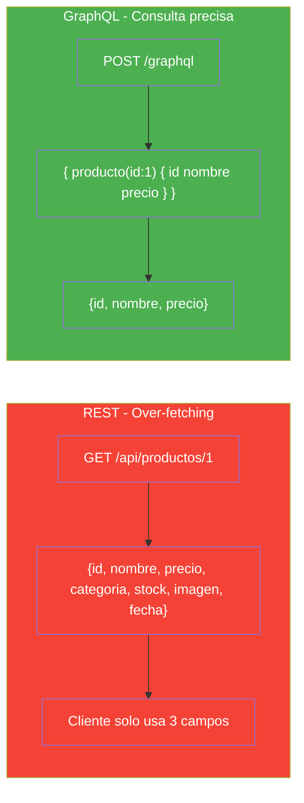
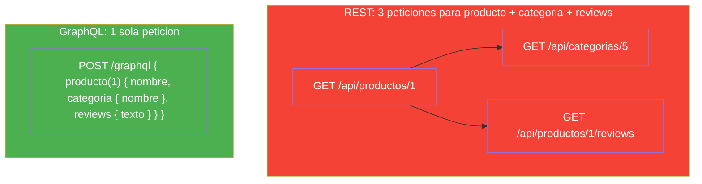
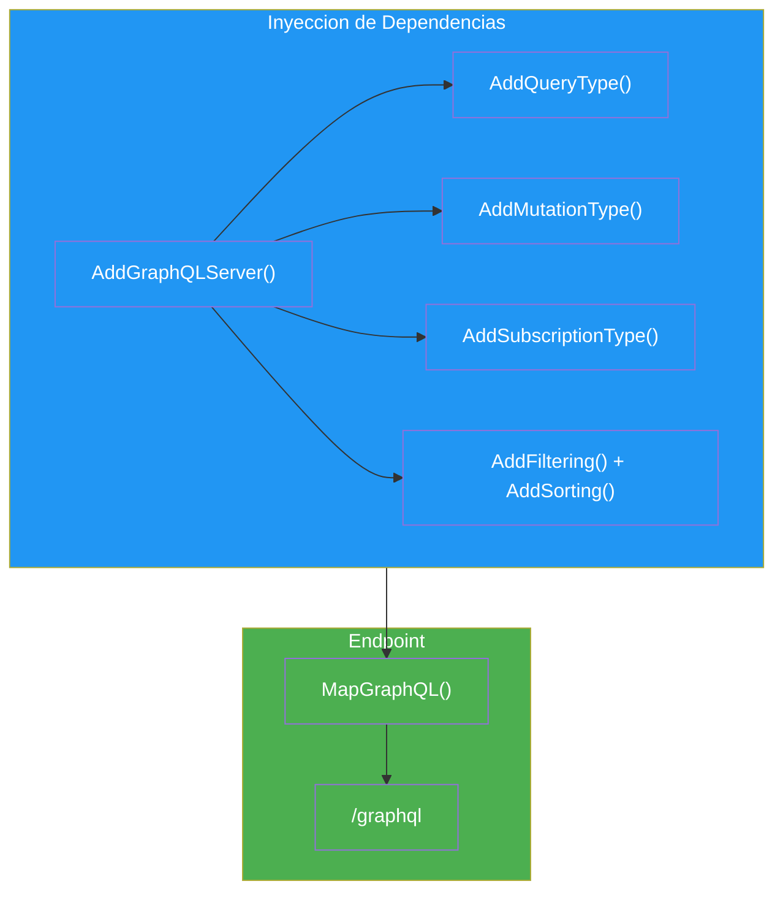
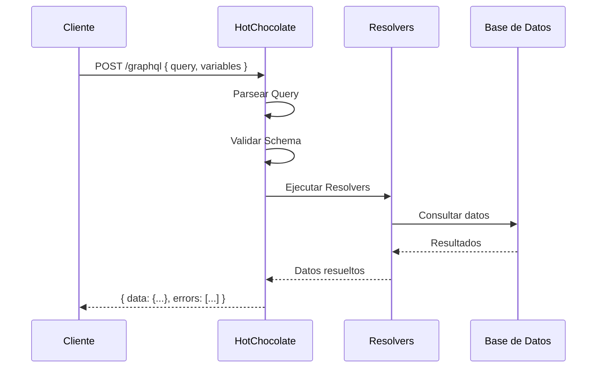
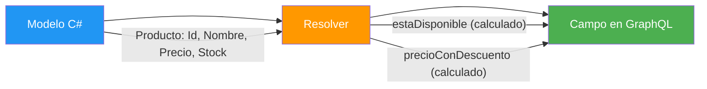
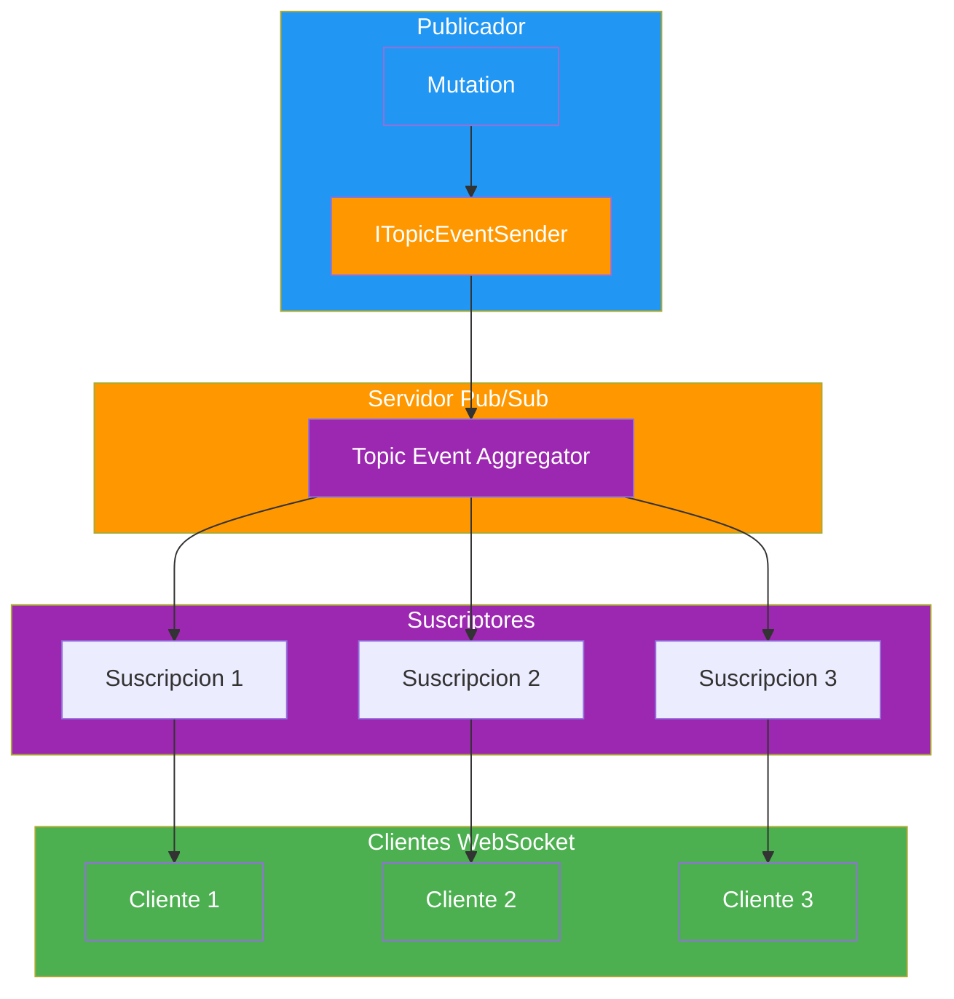
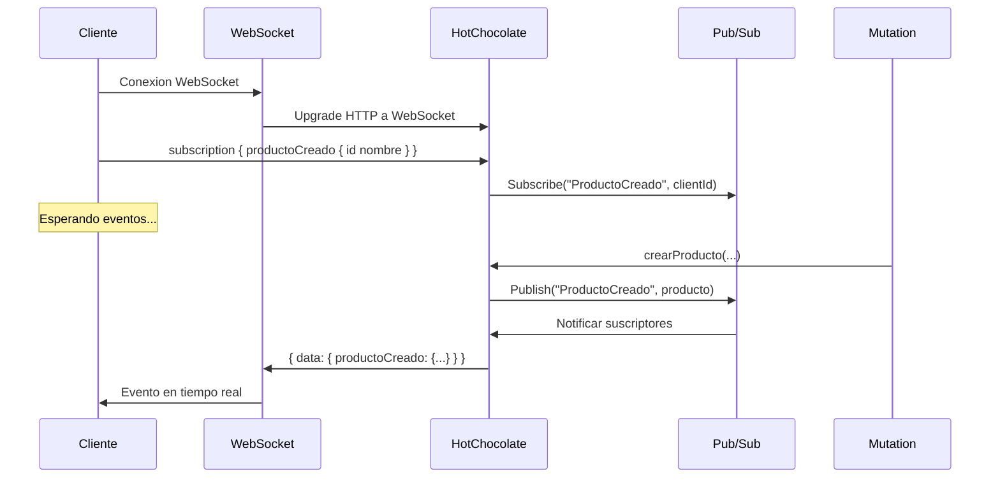
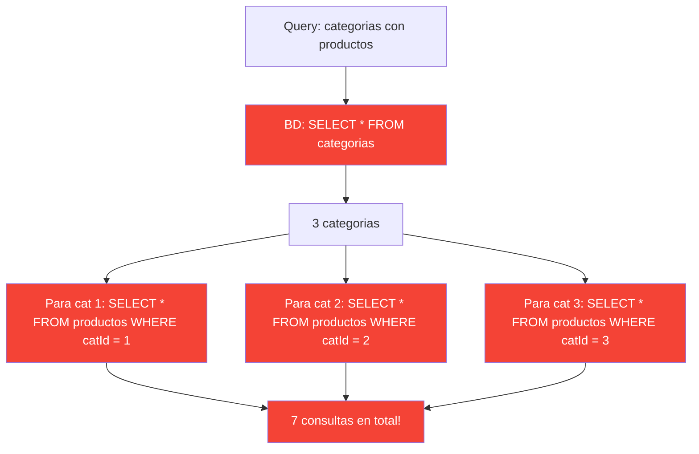
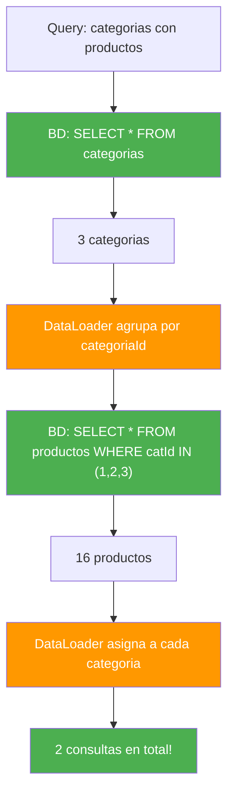
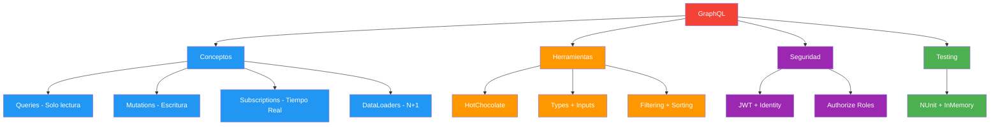

# 19. APIs con GraphQL

- [19. APIs con GraphQL](#19-apis-con-graphql)
  - [19.1. Introduccion](#191-introduccion)
    - [19.1.1. Que es GraphQL](#1911-que-es-graphql)
    - [19.1.2. REST vs GraphQL](#1912-rest-vs-graphql)
    - [19.1.3. Cuando Usar GraphQL](#1913-cuando-usar-graphql)
  - [19.2. HotChocolate en ASP.NET Core](#192-hotchocolate-en-aspnet-core)
    - [19.2.1. Paquetes NuGet](#1921-paquetes-nut)
    - [19.2.2. Configuracion en Program.cs](#1922-configuracion-en-programcs)
    - [19.2.3. Flujo de Peticion GraphQL](#1923-flujo-de-peticion-graphql)
  - [19.3. Tipos y Esquema](#193-tipos-y-esquema)
    - [19.3.1. ObjectType Basico](#1931-objecttype-basico)
    - [19.3.2. Mapeo de Tipos GraphQL](#1932-mapeo-de-tipos-graphql)
    - [19.3.3. Resolvers Personalizados](#1933-resolvers-personalizados)
    - [19.3.4. Campos Calculados](#1934-campos-calculados)
  - [19.4. Inputs y Validacion](#194-inputs-y-validacion)
    - [19.4.1. Input Record](#1941-input-record)
    - [19.4.2. Input con Validacion](#1942-input-con-validacion)
    - [19.4.3. Input para Actualizacion Parcial](#1943-input-para-actualizacion-parcial)
  - [19.5. Queries](#195-queries)
    - [19.5.1. Query Basica](#1951-query-basica)
    - [19.5.2. Paginacion, Filtrado y Ordenamiento](#1952-paginacion-filtrado-y-ordenamiento)
    - [19.5.3. Consultas GraphQL de Ejemplo](#1953-consultas-graphql-de-ejemplo)
    - [19.5.4. Operadores de Filtro](#1954-operadores-de-filtro)
  - [19.6. Mutations](#196-mutations)
    - [19.6.1. Mutation de Crear](#1961-mutation-de-crear)
    - [19.6.2. Mutation de Actualizar](#1962-mutation-de-actualizar)
    - [19.6.3. Mutation de Eliminar](#1963-mutation-de-eliminar)
    - [19.6.4. Mutations GraphQL de Ejemplo](#1964-mutations-graphql-de-ejemplo)
  - [19.7. Subscriptions y Tiempo Real](#197-subscriptions-y-tiempo-real)
    - [19.7.1. Patron Pub/Sub](#1971-patron-pubsub)
    - [19.7.2. Implementacion de Subscription](#1972-implementacion-de-subscription)
    - [19.7.3. Configuracion de WebSockets](#1973-configuracion-de-websockets)
    - [19.7.4. Flujo de Subscription](#1974-flujo-de-subscription)
  - [19.8. DataLoaders y Problema N+1](#198-dataloaders-y-problema-n1)
    - [19.8.1. El Problema N+1](#1981-el-problema-n1)
    - [19.8.2. Solucion con DataLoader](#1982-solucion-con-dataloader)
    - [19.8.3. Implementacion de DataLoaders](#1983-implementacion-de-dataloaders)
  - [19.9. Autorizacion](#199-autorizacion)
    - [19.9.1. Configuracion de Autenticacion JWT](#1991-configuracion-de-autenticacion-jwt)
    - [19.9.2. Proteger Queries y Mutations](#1992-proteger-queries-y-mutations)
    - [19.9.3. Politicas Personalizadas](#1993-politicas-personalizadas)
  - [19.10. Testing](#1910-testing)
    - [19.10.1. Test de Queries](#19101-test-de-queries)
    - [19.10.2. Test de Mutations](#19102-test-de-mutations)
  - [19.11. Buenas Practicas](#1911-buenas-practicas)
  - [19.12. Reto](#1912-reto)
  - [19.13. Resumen](#1913-resumen)

> **Punto de partida:** En una tienda online, un cliente movil solo necesita el nombre y precio de un producto, pero el administrador necesita el stock, la categoria y las ventas. Con REST, haces una peticion y recibes todo (over-fetching). O haces 3 peticiones para obtener 3 recursos diferentes (under-fetching). GraphQL resuelve esto: el cliente pide exactamente lo que necesita, ni mas ni menos, en una sola peticion.

**Objetivos de aprendizaje:**
- Comprender las diferencias fundamentales entre REST y GraphQL
- Configurar un servidor GraphQL con HotChocolate en ASP.NET Core
- Definir tipos, queries, mutations y subscriptions
- Resolver el problema N+1 con DataLoaders
- Proteger APIs GraphQL con JWT y autorizacion
- Testear endpoints GraphQL

---

## 19.1. Introduccion

## 19.1. Introduccion

### 19.1.1. Que es GraphQL

GraphQL es un lenguaje de consulta desarrollado por Facebook (2015) que permite al cliente especificar **exactamente que datos necesita**. A diferencia de REST, donde el servidor define la estructura de la respuesta, en GraphQL es el cliente quien decide que campos recibe.



> **Analogia:** REST es como un menu fijo donde recibes el plato completo aunque solo quieras la ensalada. GraphQL es como un buffet donde sirves exactamente lo que quieres: "un poco de pollo, mucha ensalada, nada de arroz".

📌 Ejemplo real: **GitHub** usa GraphQL para su API. La app móvil de GitHub usa la misma API que la web, pero cada cliente pide los campos que necesita. La versión móvil pide menos datos (mas rapida), la web pide todos los campos (mas completa).

### 19.1.2. REST vs GraphQL

| Aspecto | REST | GraphQL |
|---------|------|---------|
| **Endpoints** | Multiples URLs (`/api/productos`, `/api/categorias`) | Un solo endpoint (`/graphql`) |
| **Datos** | Servidor define la respuesta | Cliente elige los campos |
| **Over-fetching** | Si (recibes mas de lo que necesitas) | No (solo lo que pides) |
| **Under-fetching** | Si (multiples peticiones para relacionados) | No (consulta anidada en una sola peticion) |
| **Versionado** | Comun (`/v1/`, `/v2/`) | No necesario (el esquema evoluciona) |
| **Cache** | HTTP nativo (GET, headers) | Mas complejo (POST siempre) |
| **Documentacion** | Manual o Swagger | Automatica (introspection) |



📌 Ejemplo real: **GitHub** usa GraphQL para su API. La app móvil de GitHub usa la misma API que la web, pero cada cliente pide los campos que necesita. La versión móvil pide menos datos (más rápida), la web pide todos los campos (más completa). Si GitHub usara REST, tendría que crear endpoints separados para móvil y web, o devolver siempre todos los campos (over-fetching).

### 19.1.3. Cuando Usar GraphQL

| Usar GraphQL cuando... | Usar REST cuando... |
|------------------------|---------------------|
| Clientes moviles/web diferentes | API simple y estatica |
| Consultas complejas anidadas | Cacheo prioritario (CDN, HTTP cache) |
| Reducir llamadas API | Equipo nuevo sin experiencia GraphQL |
| API publica con muchos clientes | Microservicios independientes |
| Datos relacionados frecuentemente | Archivos multimedia (REST + streaming) |

> **Nota:** GraphQL **no reemplaza** REST. Son complementarios. Muchas aplicaciones usan REST para operaciones simples y GraphQL para consultas complejas.

---

## 19.2. HotChocolate en ASP.NET Core

HotChocolate es la implementacion mas popular de GraphQL para .NET. Usa un enfoque **Code-First**: defines el esquema con clases C# y HotChocolate genera el esquema GraphQL automaticamente.

### 19.2.1. Paquetes NuGet

```bash
# Paquete principal
dotnet add package HotChocolate.AspNetCore

# Autorizacion integrada
dotnet add package HotChocolate.AspNetCore.Authorization

# DataLoaders (GreenDonut)
dotnet add package GreenDonut
```

### 19.2.2. Configuracion en Program.cs

```csharp
using HotChocolate;
using HotChocolate.AspNetCore;

var builder = WebApplication.CreateBuilder(args);

// DbContext
builder.Services.AddDbContext<ApplicationDbContext>(options =>
    options.UseNpgsql(builder.Configuration.GetConnectionString("Default")));

// GraphQL Server
builder.Services
    .AddGraphQLServer()
    .AddQueryType(d => d.Name("Query"))
    .AddMutationType(d => d.Name("Mutation"))
    .AddSubscriptionType(d => d.Name("Subscription"))
    .AddType<ProductoType>()
    .AddType<CategoriaType>()
    .AddInMemorySubscriptions()
    .AddAuthorization()
    .AddFiltering()
    .AddSorting()
    .AddProjections();

var app = builder.Build();

// Endpoint GraphQL
app.MapGraphQL();

app.Run();
```



### 19.2.3. Flujo de Peticion GraphQL



> **Nota:** El playground de HotChocolate (Banana Cake Pop) se accede en `/graphql` en modo desarrollo. Permite explorar el esquema, ejecutar consultas y depurar suscripciones.

---

## 19.3. Tipos y Esquema

HotChocolate usa **Code-First**: el esquema GraphQL se genera automaticamente desde clases C#. No necesitas escribir un `.graphql` a mano.

### 19.3.1. ObjectType Basico

```csharp
using HotChocolate.Types;

public class ProductoType : ObjectType<Producto>
{
    protected override void Configure(IObjectTypeDescriptor<Producto> descriptor)
    {
        descriptor.Name("Producto");
        descriptor.Description("Producto de la tienda");

        descriptor.Field(p => p.Id)
            .Type<NonNullType<IdType>>()
            .Description("ID unico del producto");

        descriptor.Field(p => p.Nombre)
            .Type<NonNullType<StringType>>()
            .Description("Nombre del producto");

        descriptor.Field(p => p.Precio)
            .Type<NonNullType<DecimalType>>()
            .Description("Precio en euros");

        descriptor.Field(p => p.Stock)
            .Type<NonNullType<IntType>>()
            .Description("Cantidad en stock");

        descriptor.Field(p => p.Categoria)
            .Type<NonNullType<CategoriaType>>()
            .Description("Categoria del producto");
    }
}
```

```csharp
// ❌ MALO: Sin descripcion en los campos
descriptor.Field(p => p.Nombre);

// ✅ BUENO: Descripcion en cada campo para documentacion automatica
descriptor.Field(p => p.Nombre)
    .Type<NonNullType<StringType>>()
    .Description("Nombre del producto");
```

### 19.3.2. Mapeo de Tipos GraphQL

| GraphQL Type | .NET Type | Descripcion |
|--------------|-----------|-------------|
| `ID` | `string` o `long` | Identificador unico |
| `String` | `string` | Cadena de texto |
| `Int` | `int` | Entero de 32 bits |
| `Float` | `double` | Numero decimal |
| `Boolean` | `bool` | Verdadero/Falso |
| `DateTime` | `DateTime` | Fecha y hora |
| `Decimal` | `decimal` | Decimal preciso (monetario) |
| `[Type!]!` | `List<T>` | Lista no nula de no nulos |

📌 Ejemplo real: **Shopify** usa GraphQL para su storefront. Los tipos GraphQL mapean directamente a entidades como `Product`, `Order`, `Customer`. Cada campo tiene un tipo y una descripcion que se genera automaticamente en la documentacion.

### 19.3.3. Resolvers Personalizados

Los resolvers son metodos que calculan campos que no existen en el modelo de datos.

```csharp
using HotChocolate;
using HotChocolate.Types;

[ExtendObjectType(typeof(Producto))]
public class ProductoResolvers
{
    /// <summary>
    /// Campo calculado: disponible si hay stock
    /// </summary>
    public bool GetEstaDisponible([Parent] Producto producto)
    {
        return producto.Stock > 0;
    }

    /// <summary>
    /// Campo calculado: precio con descuento
    /// </summary>
    public decimal GetPrecioConDescuento(
        [Parent] Producto producto,
        [GraphQLNonNullType] int porcentaje)
    {
        return producto.Precio * (100 - porcentaje) / 100;
    }
}
```



### 19.3.4. Campos Calculados

Los campos calculados no se almacenan en la BD. Se calculan en tiempo de ejecucion usando resolvers:

```csharp
// En el ObjectType, se exponen como campos normales:
descriptor.Field(p => p.Nombre)
    .Type<NonNullType<StringType>>();

// El resolver se registra con [ExtendObjectType]
// y se ejecuta automaticamente cuando el cliente pide ese campo
```

> **Consejo:** Solo crea campos calculados cuando el cliente los pide. Si nadie usa `precioConDescuento`, no lo incluyas en el esquema.

---

## 19.4. Inputs y Validacion

Los Input Types representan datos de entrada para las Mutations, equivalentes a los DTOs en REST.

### 19.4.1. Input Record

```csharp
public record CreateProductoInput(
    string Nombre,
    string? Descripcion,
    decimal Precio,
    int Stock,
    long CategoriaId
);
```

> **Consejo:** Usa `record` para Inputs simples. Son inmutables, con `init` implicito y serializan bien.

### 19.4.2. Input con Validacion

```csharp
using System.ComponentModel.DataAnnotations;

public class CreateProductoInput : IValidatableObject
{
    [Required]
    [StringLength(100, MinimumLength = 3)]
    public string Nombre { get; set; } = string.Empty;

    [StringLength(500)]
    public string? Descripcion { get; set; }

    [Range(0.01, 10000)]
    public decimal Precio { get; set; }

    [Range(0, int.MaxValue)]
    public int Stock { get; set; }

    public long CategoriaId { get; set; }

    public IEnumerable<ValidationResult> Validate(
        ValidationContext validationContext)
    {
        if (Precio <= 0 && Stock > 0)
        {
            yield return new ValidationResult(
                "El precio debe ser mayor a 0 si hay stock",
                new[] { nameof(Precio) });
        }
    }
}
```

```csharp
// ❌ MALO: Sin validacion — datos invalidos llegan a la BD
public record CreateProductoInput(string Nombre, decimal Precio);

// ✅ BUENO: Validacion con DataAnnotations + IValidatableObject
public class CreateProductoInput : IValidatableObject
{
    [Required] public string Nombre { get; set; } = string.Empty;
    [Range(0.01, 10000)] public decimal Precio { get; set; }
    // ...
}
```

### 19.4.3. Input para Actualizacion Parcial

```csharp
public record UpdateProductoInput(
    string? Nombre,
    string? Descripcion,
    decimal? Precio,
    int? Stock,
    long? CategoriaId
);
```

> **Nota:** Todos los campos son nullable para permitir actualizaciones parciales. Solo se actualizan los campos que el cliente envia.

---

## 19.5. Queries

Las Queries son operaciones de solo lectura, equivalentes a GET en REST.

### 19.5.1. Query Basica

```csharp
using HotChocolate.Data;

public class Query
{
    /// <summary>
    /// Obtiene todos los productos con paginacion
    /// </summary>
    [UsePaging(MaxPageSize = 50, DefaultPageSize = 10)]
    [UseFiltering]
    [UseSorting]
    public IQueryable<Producto> GetProductos([Service] ApplicationDbContext context)
    {
        return context.Productos.Include(p => p.Categoria);
    }

    /// <summary>
    /// Obtiene un producto por ID
    /// </summary>
    [UseFirstOrDefault]
    public async Task<Producto?> GetProducto(
        long id,
        [Service] IProductoService service)
    {
        return await service.GetByIdAsync(id);
    }

    /// <summary>
    /// Obtiene categorias
    /// </summary>
    [UsePaging]
    public IQueryable<Categoria> GetCategorias([Service] ApplicationDbContext context)
    {
        return context.Categorias;
    }
}
```

### 19.5.2. Paginacion, Filtrado y Ordenamiento

HotChocolate incluye atributos listos para usar:

| Atributo | Funcion | Ejemplo |
|----------|---------|---------|
| `[UsePaging]` | Paginacion por cursor | `productos(first: 10, skip: 0)` |
| `[UseFiltering]` | Filtros automaticos | `productos(where: { precio: { gt: 20 } })` |
| `[UseSorting]` | Ordenamiento | `productos(order: { precio: DESC })` |
| `[UseFirstOrDefault]` | Primer elemento | `producto(id: 1)` |
| `[UseProjection]` | Proyeccion de campos | Solo los campos que el cliente pide |

### 19.5.3. Consultas GraphQL de Ejemplo

**Productos paginados:**

> 📝 **Nota:** En GraphQL, el cliente especifica exactamente que campos quiere recibir. No hay over-fetching (recibir mas datos de los necesarios) ni under-fetching (necesitar multiples peticiones).

```graphql
query {
  productos(first: 10, skip: 0) {
    nodes {
      id
      nombre
      precio
      stock
      estaDisponible
    }
    pageInfo {
      hasNextPage
      hasPreviousPage
      totalCount
    }
  }
}
```

**Con filtrado y ordenamiento:**

```graphql
query {
  productos(
    where: { precio: { gt: 20, lte: 100 } }
    order: { precio: DESC }
    first: 10
  ) {
    nodes {
      id
      nombre
      precio
      categoria { nombre }
    }
  }
}
```

**Consulta anidada:**

```graphql
query {
  categorias {
    id
    nombre
    productos(first: 5, order: { precio: DESC }) {
      nodes {
        id
        nombre
        precio
      }
    }
  }
}
```

### 19.5.4. Operadores de Filtro

| Operador | Descripcion | Ejemplo |
|----------|-------------|---------|
| `eq` | Igual a | `precio: { eq: 29.99 }` |
| `neq` | Diferente a | `stock: { neq: 0 }` |
| `gt` | Mayor que | `precio: { gt: 20 }` |
| `gte` | Mayor o igual | `stock: { gte: 10 }` |
| `lt` | Menor que | `precio: { lt: 50 }` |
| `lte` | Menor o igual | `precio: { lte: 100 }` |
| `contains` | Contiene texto | `nombre: { contains: "Iron" }` |
| `startsWith` | Empieza con | `nombre: { startsWith: "Funko" }` |
| `in` | En lista | `categoriaId: { in: [1, 2, 3] }` |

---

## 19.6. Mutations

Las Mutations son operaciones que modifican datos, equivalentes a POST, PUT, DELETE en REST.

### 19.6.1. Mutation de Crear

```csharp
using HotChocolate.Subscriptions;

public class Mutation
{
    /// <summary>
    /// Crea un nuevo producto
    /// </summary>
    [Authorize(Roles = new[] { "Admin", "Editor" })]
    public async Task<Producto> CrearProducto(
        CreateProductoInput input,
        [Service] IProductoService service,
        [Service] ITopicEventSender eventSender)
    {
        var dto = new CreateProductoDto
        {
            Nombre = input.Nombre,
            Descripcion = input.Descripcion,
            Precio = input.Precio,
            Stock = input.Stock,
            CategoriaId = input.CategoriaId
        };

        var producto = await service.CreateAsync(dto);

        // Notificar a suscriptores
        await eventSender.SendAsync("ProductoCreado", producto);

        return producto;
    }
}
```

### 19.6.2. Mutation de Actualizar

```csharp
public class Mutation
{
    /// <summary>
    /// Actualiza un producto existente
    /// </summary>
    [Authorize(Roles = new[] { "Admin", "Editor" })]
    public async Task<Producto?> ActualizarProducto(
        long id,
        UpdateProductoInput input,
        [Service] IProductoService service,
        [Service] ITopicEventSender eventSender)
    {
        var dto = new UpdateProductoDto
        {
            Nombre = input.Nombre,
            Descripcion = input.Descripcion,
            Precio = input.Precio,
            Stock = input.Stock
        };

        var producto = await service.UpdateAsync(id, dto);

        if (producto is not null)
        {
            await eventSender.SendAsync("ProductoActualizado", producto);
        }

        return producto;
    }
}
```

### 19.6.3. Mutation de Eliminar

```csharp
public class Mutation
{
    /// <summary>
    /// Elimina un producto (borrado logico)
    /// </summary>
    [Authorize(Roles = new[] { "Admin" })]
    public async Task<bool> EliminarProducto(
        long id,
        [Service] IProductoService service,
        [Service] ITopicEventSender eventSender)
    {
        var eliminado = await service.DeleteAsync(id);

        if (eliminado)
        {
            await eventSender.SendAsync("ProductoEliminado", id);
        }

        return eliminado;
    }
}
```

### 19.6.4. Mutations GraphQL de Ejemplo

**Crear producto:**

```graphql
mutation CrearProducto {
  crearProducto(input: {
    nombre: "Funko Iron Man"
    precio: 29.99
    stock: 15
    categoriaId: 1
  }) {
    id
    nombre
    precio
    estaDisponible
  }
}
```

**Actualizar producto:**

```graphql
mutation ActualizarProducto {
  actualizarProducto(id: 1, input: { precio: 34.99, stock: 20 }) {
    id
    nombre
    precio
    stock
  }
}
```

**Eliminar producto:**

```graphql
mutation EliminarProducto {
  eliminarProducto(id: 1)
}
```

---

## 19.7. Subscriptions y Tiempo Real

Las Subscriptions permiten recibir actualizaciones en tiempo real mediante WebSockets.

### 19.7.1. Patron Pub/Sub



📌 Ejemplo real: **Shopify** usa subscriptions para notificar a los comerciantes cuando se realiza un pedido nuevo. El panel de administracion se actualiza instantaneamente sin recargar la pagina.

### 19.7.2. Implementacion de Subscription

```csharp
public class Subscription
{
    /// <summary>
    /// Notifica cuando se crea un nuevo producto
    /// </summary>
    [Subscribe]
    [Topic(nameof(ProductoCreado))]
    public Producto ProductoCreado([EventMessage] Producto producto)
    {
        return producto;
    }

    /// <summary>
    /// Notifica cuando se actualiza un producto
    /// </summary>
    [Subscribe]
    [Topic(nameof(ProductoActualizado))]
    public Producto ProductoActualizado([EventMessage] Producto producto)
    {
        return producto;
    }

    /// <summary>
    /// Notifica cuando se elimina un producto
    /// </summary>
    [Subscribe]
    [Topic(nameof(ProductoEliminado))]
    public long ProductoEliminado([EventMessage] long id)
    {
        return id;
    }
}
```

**Ejemplo de suscripcion GraphQL:**

```graphql
subscription OnProductoCreado {
  productoCreado {
    id
    nombre
    precio
    categoria { nombre }
    estaDisponible
  }
}
```

### 19.7.3. Configuracion de WebSockets

```csharp
var builder = WebApplication.CreateBuilder(args);

builder.Services.AddServerSentEvents();

var app = builder.Build();

// Habilitar WebSockets para suscripciones
app.UseWebSockets(new WebSocketOptions
{
    KeepAliveInterval = TimeSpan.FromMinutes(2)
});

app.MapGraphQL();

app.Run();
```

### 19.7.4. Flujo de Subscription



---

## 19.8. DataLoaders y Problema N+1

El problema N+1 ocurre cuando una query causa N+1 consultas a la base de datos. Es el problema de rendimiento mas comun en GraphQL.

### 19.8.1. El Problema N+1



### 19.8.2. Solucion con DataLoader



### 19.8.3. Implementacion de DataLoaders

```csharp
using GreenDonut;
using Microsoft.EntityFrameworkCore;

/// <summary>
/// DataLoader para cargar categorias por ID
/// </summary>
public class CategoriaByIdDataLoader : BatchDataLoader<long, Categoria>
{
    private readonly IDbContextFactory<ApplicationDbContext> _dbContextFactory;

    public CategoriaByIdDataLoader(
        IDbContextFactory<ApplicationDbContext> dbContextFactory,
        IBatchScheduler batchScheduler)
        : base(batchScheduler)
    {
        _dbContextFactory = dbContextFactory;
    }

    protected override async Task<IReadOnlyDictionary<long, Categoria>> LoadBatchAsync(
        IReadOnlyList<long> keys,
        CancellationToken cancellationToken)
    {
        await using var context = await _dbContextFactory.CreateDbContextAsync(cancellationToken);

        return await context.Categorias
            .Where(c => keys.Contains(c.Id))
            .ToDictionaryAsync(c => c.Id, cancellationToken);
    }
}
```

```csharp
/// <summary>
/// DataLoader para cargar productos por categoria
/// </summary>
public class ProductoByCategoriaDataLoader : GroupedDataLoader<long, Producto>
{
    private readonly IDbContextFactory<ApplicationDbContext> _dbContextFactory;

    public ProductoByCategoriaDataLoader(
        IDbContextFactory<ApplicationDbContext> dbContextFactory,
        IBatchScheduler batchScheduler)
        : base(batchScheduler)
    {
        _dbContextFactory = dbContextFactory;
    }

    protected override async Task<ILookup<long, Producto>> LoadGroupedBatchAsync(
        IReadOnlyList<long> keys,
        CancellationToken cancellationToken)
    {
        await using var context = await _dbContextFactory.CreateDbContextAsync(cancellationToken);

        var productos = await context.Productos
            .Where(p => keys.Contains(p.CategoriaId))
            .ToListAsync(cancellationToken);

        return productos.ToLookup(p => p.CategoriaId);
    }
}
```

**Registro en Program.cs:**

```csharp
builder.Services
    .AddGraphQLServer()
    .AddDataLoader<CategoriaByIdDataLoader>()
    .AddDataLoader<ProductoByCategoriaDataLoader>();
```

**Uso en resolvers:**

```csharp
[ExtendObjectType(typeof(Producto))]
public class ProductoResolvers
{
    public async Task<Categoria> GetCategoria(
        [Parent] Producto producto,
        [Service] CategoriaByIdDataLoader dataLoader)
    {
        return await dataLoader.LoadAsync(producto.CategoriaId);
    }
}
```

---

## 19.9. Autorizacion

HotChocolate se integra directamente con ASP.NET Core Identity y JWT.

### 19.9.1. Configuracion de Autenticacion JWT

```csharp
builder.Services
    .AddAuthentication(JwtBearerDefaults.AuthenticationScheme)
    .AddJwtBearer(options =>
    {
        options.TokenValidationParameters = new TokenValidationParameters
        {
            ValidateIssuer = true,
            ValidateAudience = true,
            ValidateLifetime = true,
            ValidateIssuerSigningKey = true,
            ValidIssuer = builder.Configuration["Jwt:Issuer"],
            ValidAudience = builder.Configuration["Jwt:Audience"],
            IssuerSigningKey = new SymmetricSecurityKey(
                Encoding.UTF8.GetBytes(builder.Configuration["Jwt:Key"]))
        };
    });

builder.Services.AddAuthorization();

builder.Services
    .AddGraphQLServer()
    .AddAuthorization();
```

### 19.9.2. Proteger Queries y Mutations

```csharp
public class Query
{
    /// <summary>
    /// Query publica - cualquiera puede ver productos
    /// </summary>
    [UsePaging]
    public IQueryable<Producto> GetProductos([Service] ApplicationDbContext context)
    {
        return context.Productos;
    }

    /// <summary>
    /// Solo administradores pueden ver productos eliminados
    /// </summary>
    [Authorize(Roles = new[] { "Admin" })]
    public async Task<List<Producto>> GetProductosEliminados(
        [Service] IProductoService service)
    {
        return await service.GetEliminadosAsync();
    }
}

public class Mutation
{
    /// <summary>
    /// Admin o Editor pueden crear productos
    /// </summary>
    [Authorize(Roles = new[] { "Admin", "Editor" })]
    public async Task<Producto> CrearProducto(
        CreateProductoInput input,
        [Service] IProductoService service)
    {
        return await service.CreateAsync(input);
    }

    /// <summary>
    /// Solo Admin puede eliminar
    /// </summary>
    [Authorize(Roles = new[] { "Admin" })]
    public async Task<bool> EliminarProducto(
        long id,
        [Service] IProductoService service)
    {
        return await service.DeleteAsync(id);
    }
}
```

```csharp
// ❌ MALO: Mutation sensible sin autorizacion
public async Task<bool> EliminarProducto(long id, ...) { ... }

// ✅ BUENO: Protegido con [Authorize]
[Authorize(Roles = new[] { "Admin" })]
public async Task<bool> EliminarProducto(long id, ...) { ... }
```

### 19.9.3. Politicas Personalizadas

```csharp
builder.Services.AddAuthorization(options =>
{
    options.AddPolicy("AdminGerente", policy =>
        policy.RequireRole("Admin").RequireRole("Gerente"));

    options.AddPolicy("PremiumUser", policy =>
        policy.RequireAssertion(ctx =>
            ctx.User.HasClaim(c =>
                c.Type == "subscription_type" &&
                c.Value == "premium")));
});
```

---

## 19.10. Testing

### 19.10.1. Test de Queries

```csharp
using HotChocolate;
using Microsoft.EntityFrameworkCore;
using NUnit.Framework;
using FluentAssertions;

[TestFixture]
public class ProductoGraphQLTests
{
    private ApplicationDbContext _context = null!;
    private IRequestExecutor _executor = null!;

    [SetUp]
    public void SetUp()
    {
        _context = new ApplicationDbContext(
            new DbContextOptionsBuilder<ApplicationDbContext>()
                .UseInMemoryDatabase(databaseName: $"TestDb_{Guid.NewGuid()}")
                .Options);

        // Seed data
        _context.Categorias.Add(new Categoria { Id = 1, Nombre = "Marvel" });
        _context.Productos.Add(new Producto
        {
            Id = 1,
            Nombre = "Iron Man",
            Precio = 29.99m,
            Stock = 10,
            CategoriaId = 1
        });
        _context.Productos.Add(new Producto
        {
            Id = 2,
            Nombre = "Spider-Man",
            Precio = 24.99m,
            Stock = 5,
            CategoriaId = 1
        });
        _context.SaveChanges();

        _executor = new ServiceCollection()
            .AddDbContext<ApplicationDbContext>(p =>
                p.UseInMemoryDatabase($"TestDb_{Guid.NewGuid()}"))
            .AddGraphQL()
            .AddQueryType<Query>()
            .AddMutationType<Mutation>()
            .AddInMemorySubscriptions()
            .AddFiltering()
            .AddSorting()
            .Services
            .BuildServiceProvider()
            .GetRequiredService<IRequestExecutor>();
    }

    [TearDown]
    public void TearDown()
    {
        _context.Dispose();
    }

    [Test]
    public async Task Query_GetProductos_ReturnsAllProducts()
    {
        // Arrange
        var query = @"
            query {
                productos {
                    nodes {
                        id
                        nombre
                        precio
                        stock
                    }
                }
            }
        ";

        // Act
        var result = await _executor.ExecuteAsync(query);

        // Assert
        result.ToJson().Should().Contain("Iron Man");
        result.ToJson().Should().Contain("Spider-Man");
    }

    [Test]
    public async Task Query_GetProductos_WithFilter_ReturnsFilteredResults()
    {
        // Arrange
        var query = @"
            query {
                productos(where: { precio: { gt: 25 } }) {
                    nodes {
                        id
                        nombre
                        precio
                    }
                }
            }
        ";

        // Act
        var result = await _executor.ExecuteAsync(query);

        // Assert
        result.ToJson().Should().Contain("Iron Man");
        result.ToJson().Should().NotContain("Spider-Man");
    }
}
```

### 19.10.2. Test de Mutations

```csharp
[Test]
public async Task Mutation_CrearProducto_ReturnsNewProduct()
{
    // Arrange
    var mutation = @"
        mutation {
            crearProducto(input: {
                nombre: ""Batman""
                precio: 29.99
                stock: 15
                categoriaId: 1
            }) {
                id
                nombre
                precio
            }
        }
    ";

    // Act
    var result = await _executor.ExecuteAsync(mutation);

    // Assert
    result.ToJson().Should().Contain("Batman");
    result.ToJson().Should().Contain("29.99");
}
```

---

## 19.11. Buenas Practicas

```csharp
// ❌ MALO: Exponer entidades directamente sin filtrar campos
public class Query
{
    public IQueryable<Usuario> GetUsuarios([Service] ApplicationDbContext db)
    {
        return db.Usuarios; // Expone password hash, tokens, etc.
    }
}

// ✅ BUENO: Usar DTOs o proyecciones para exponer solo lo necesario
public class Query
{
    [UseProjection]
    public IQueryable<UsuarioDto> GetUsuarios([Service] ApplicationDbContext db)
    {
        return db.Usuarios.Select(u => new UsuarioDto
        {
            Id = u.Id,
            Nombre = u.Nombre,
            Email = u.Email
            // Password, tokens, etc. NO se exponen
        });
    }
}
```

```csharp
// ❌ MALO: Resolver sin DataLoader — problema N+1
public async Task<Categoria> GetCategoria([Parent] Producto producto, [Service] ApplicationDbContext db)
{
    return await db.Categorias.FindAsync(producto.CategoriaId); // 1 consulta por producto
}

// ✅ BUENO: DataLoader — agrupa consultas
public async Task<Categoria> GetCategoria(
    [Parent] Producto producto,
    [Service] CategoriaByIdDataLoader dataLoader)
{
    return await dataLoader.LoadAsync(producto.CategoriaId); // 1 consulta para todos
}
```

1. **Un solo endpoint** — Todas las queries van a `/graphql`, no crees endpoints REST paralelos
2. **Usa DataLoaders** — Siempre que accedas a datos relacionados en resolvers
3. **Valida los Inputs** — Usa DataAnnotations o FluentValidation
4. **Protege las Mutations** — `[Authorize]` en toda operacion de escritura
5. **No expongas entidades directamente** — Usa DTOs o proyecciones
6. **Documenta los campos** — Descripciones en ObjectType y resolvers
7. **Usa paging** — `[UsePaging]` para colecciones grandes
8. **Subscriptions solo cuando sea necesario** — No las uses para datos que cambian poco
9. **Testing** — Testea queries y mutations como si fueran endpoints REST
10. **Error handling** — HotChocolate convierte excepciones en errores GraphQL automaticamente

---

## 19.12. Reto

> Implementa una API GraphQL completa para gestionar Funkos con categorias usando HotChocolate y ASP.NET Core.

**Requisitos:**

1. **Tipos GraphQL:**
   - `FunkoType` con campos: `Id`, `Nombre`, `Precio`, `Stock`, `Categoria`, `EstaDisponible`
   - `CategoriaType` con campos: `Id`, `Nombre`, `Funkos`
   - `CreateFunkoInput` y `UpdateFunkoInput`

2. **Queries:**
   - `funkos` con paginacion, filtrado y ordenamiento
   - `funko(id)` por ID
   - `categorias` con paginacion
   - Campo calculado `estaDisponible` en Funko

3. **Mutations:**
   - `crearFunko` (requiere rol Admin/Editor)
   - `actualizarFunko` (requiere rol Admin/Editor)
   - `eliminarFunko` (requiere rol Admin)

4. **Subscriptions:**
   - `funkoCreado` — notifica al crear
   - `funkoActualizado` — notifica al actualizar
   - `funkoEliminado` — notifica al eliminar

5. **DataLoaders:**
   - `CategoriaByIdDataLoader` para resolver la categoria de cada funko

6. **Autorizacion:**
   - Queries publicas (cualquiera puede leer)
   - Mutations protegidas con JWT + roles

7. **Tests:**
   - Al menos 4 tests: query funkos, query por filtro, mutation crear, mutation eliminar

**Arquitectura:**

```
FunkosGraphQL/
├── FunkosGraphQL.slnx
├── FunkosGraphQL/
│   ├── Program.cs
│   ├── Models/
│   │   ├── Funko.cs
│   │   └── Categoria.cs
│   ├── GraphQL/
│   │   ├── Types/
│   │   │   ├── FunkoType.cs
│   │   │   └── CategoriaType.cs
│   │   ├── Inputs/
│   │   │   ├── CreateFunkoInput.cs
│   │   │   └── UpdateFunkoInput.cs
│   │   ├── Query.cs
│   │   ├── Mutation.cs
│   │   ├── Subscription.cs
│   │   └── Resolvers/
│   │       └── FunkoResolvers.cs
│   ├── DataLoaders/
│   │   └── CategoriaByIdDataLoader.cs
│   ├── Entity/
│   │   └── AppDbContext.cs
│   └── Infrastructures/
│       ├── DatabaseConfig.cs
│       └── RepositoriesConfig.cs
└── FunkosGraphQL.Test/
    └── GraphQLTests.cs
```

---

## 19.13. Resumen



| Concepto | Descripcion |
|----------|-------------|
| **GraphQL** | Lenguaje de consulta que permite al cliente especificar exactamente que datos necesita |
| **HotChocolate** | Implementacion mas popular de GraphQL para .NET (Code-First) |
| **ObjectType** | Define tipos de objeto en el esquema GraphQL |
| **Input Type** | Representa datos de entrada para mutations |
| **Query** | Operaciones de solo lectura equivalentes a GET |
| **Mutation** | Operaciones de escritura equivalentes a POST, PUT, DELETE |
| **Subscription** | Notificaciones en tiempo real mediante WebSockets |
| **DataLoader** | Solucion al problema N+1 agrupando consultas |
| **`[UsePaging]`** | Paginacion automatica por cursor |
| **`[UseFiltering]`** | Filtros automaticos en queries |
| **`[UseSorting]`** | Ordenamiento automatico en queries |
| **`[Authorize]`** | Protege endpoints con autenticacion/autorizacion |

**¿Que viene despues?**

En el siguiente punto veremos **Almacenamiento de Ficheros**: como gestionar upload y download de archivos, almacenamiento local y en la nube, y integracion con servicios como Azure Blob Storage o AWS S3.
