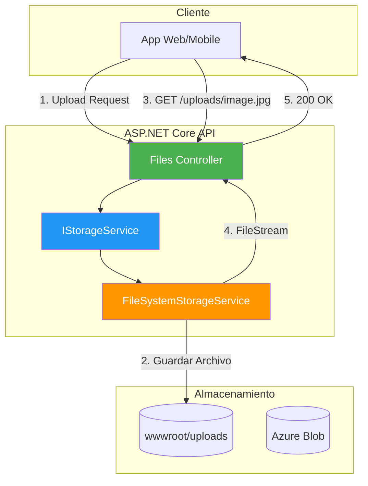
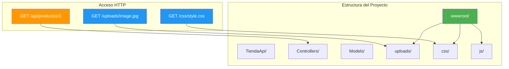
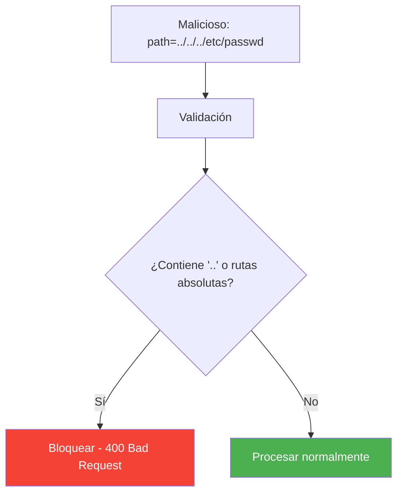

- [20. File Storage: Almacenamiento de Archivos](#20-file-storage-almacenamiento-de-archivos)
  - [20.1. Conceptos Fundamentales](#201-conceptos-fundamentales)
    - [20.1.1. Arquitectura de Almacenamiento](#2011-arquitectura-de-almacenamiento)
    - [20.1.2. Tipos de Archivos Comunes](#2012-tipos-de-archivos-comunes)
    - [20.1.3. Enfoques de Almacenamiento](#2013-enfoques-de-almacenamiento)
  - [20.2. wwwroot y Archivos Estáticos](#202-wwwroot-y-archivos-estáticos)
    - [20.2.1. Qué es wwwroot](#2021-qué-es-wwwroot)
    - [20.2.2. Configuración de Límites](#2022-configuración-de-límites)
    - [20.2.3. Clase de Configuración](#2023-clase-de-configuración)
  - [20.3. UseStaticFiles](#203-usestaticfiles)
    - [20.3.1. Configuración Básica](#2031-configuración-básica)
    - [20.3.2. Configuración Avanzada](#2032-configuración-avanzada)
    - [20.3.3. Servir Archivos de Uploads](#2033-servir-archivos-de-uploads)
    - [20.3.4. WebRootPath vs ContentRootPath](#2034-webrootpath-vs-contentrootpath)
  - [20.4. IStorageService](#204-istorageservice)
    - [20.4.1. Interfaz Completa](#2041-interfaz-completa)
  - [20.5. FileSystemStorageService](#205-filesystemstorageservice)
    - [20.5.1. Implementación Completa](#2051-implementación-completa)
    - [20.5.2. Excepciones Personalizadas](#2052-excepciones-personalizadas)
    - [20.5.3. Registro en DI](#2053-registro-en-di)
  - [20.6. Controlador de Archivos](#206-controlador-de-archivos)
    - [20.6.1. FilesController](#2061-filescontroller)
    - [20.6.2. DTOs de Respuesta](#2062-dtos-de-respuesta)
  - [20.7. Validaciones de Seguridad](#207-validaciones-de-seguridad)
    - [20.7.1. Validar Extensión y Tipo MIME](#2071-validar-extensión-y-tipo-mime)
    - [20.7.2. Validar Tamaño](#2072-validar-tamaño)
    - [20.7.3. Protección contra Path Traversal](#2073-protección-contra-path-traversal)
    - [20.7.4. Validar Nombre de Archivo](#2074-validar-nombre-de-archivo)
  - [20.8. Integración con Entidades](#208-integración-con-entidades)
    - [20.8.1. Endpoint para Actualizar Imagen de Producto](#2081-endpoint-para-actualizar-imagen-de-producto)
  - [20.9. Azure Blob Storage](#209-azure-blob-storage)
    - [20.9.1. AzureBlobStorageService](#2091-azureblobstorageservice)
    - [20.9.2. Configuración y Cambio entre Proveedores](#2092-configuración-y-cambio-entre-proveedores)
  - [20.10. Testing](#2010-testing)
    - [20.10.1. Test del Servicio](#20101-test-del-servicio)
    - [20.10.2. Test del Controlador](#20102-test-del-controlador)
  - [20.11. Buenas Prácticas](#2011-buenas-prácticas)
  - [20.12. Reto: Sube Imágenes de Funkos](#2012-reto-sube-imágenes-de-funkos)

---

# 20. File Storage: Almacenamiento de Archivos

> **Punto de partida:** Cuando subes una foto de perfil en Instagram, la app recibe tu imagen, la guarda en sus servidores, la redimensiona y te devuelve una URL. Cuando otro usuario visita tu perfil, simplemente carga esa URL. Detrás de esa operación aparentemente simple hay todo un sistema de almacenamiento de archivos. En este tema aprenderemos a construir ese sistema en ASP.NET Core.

El almacenamiento de archivos es una funcionalidad común en aplicaciones web modernas: imágenes de productos, avatares de usuario, documentos adjuntos, etc. En este tema veremos cómo diseñar un sistema de almacenamiento seguro, escalable y testeable.

**Objetivos de aprendizaje:**

- Entender los enfoques de almacenamiento (local vs nube)
- Configurar wwwroot y el middleware UseStaticFiles
- Diseñar la interfaz IStorageService y su implementación
- Implementar un controlador de archivos con validaciones de seguridad
- Integrar el almacenamiento con entidades de negocio (productos)
- Conocer Azure Blob Storage como alternativa en producción
- Escribir tests unitarios para el servicio de almacenamiento

## 20.1. Conceptos Fundamentales

### 20.1.1. Arquitectura de Almacenamiento



> **Analogia:** El almacenamiento de archivos es como el almacén de un restaurante. Cuando un cliente pide un plato especial, el mesero va al almacén, busca el ingrediente y lo trae a la cocina. El almacén puede ser físico (disco local) o externo (nube).

📌 **Ejemplo real:** Netflix almacena millones de miniaturas de películas y series. Cuando navegas por el catálogo, cada imagen viene de Azure Blob Storage. No está en la base de datos: está en un almacén de archivos optimizado para entrega rápida.

### 20.1.2. Tipos de Archivos Comunes

| Tipo | Extensiones | Uso Típico |
|------|-------------|------------|
| **Imágenes** | .jpg, .jpeg, .png, .gif, .webp | Avatares, productos, galerías |
| **Documentos** | .pdf, .doc, .docx, .xlsx | Facturas, contratos, reportes |
| **Videos** | .mp4, .mov, .avi | Contenido multimedia |
| **Audio** | .mp3, .wav, .flac | Podcasts, música |

### 20.1.3. Enfoques de Almacenamiento

| Enfoque | Ventajas | Desventajas | Cuándo Usar |
|---------|----------|-------------|-------------|
| **Local (wwwroot)** | Simple, rápido, gratuito | No escalable | Desarrollo, apps pequeñas |
| **Azure Blob** | Escalable, redundante, barato | Requiere internet | Producción, apps medianas |
| **AWS S3** | Muy escalable | Más complejo, costoso | Apps grandes, enterprise |
| **Base de Datos** | Integrado, backup automático | Lento, BD grande | Archivos pequeños, críticos |

### Configuración en appsettings.json

```json
{
  "Storage": {
    "UploadPath": "wwwroot/uploads",
    "MaxFileSize": 5242880,
    "AllowedExtensions": [".jpg", ".jpeg", ".png", ".gif", ".webp"],
    "AllowedContentTypes": ["image/jpeg", "image/png", "image/gif", "image/webp"]
  }
}
```

### Estructura de Directorios

```
TuProyecto/
├── wwwroot/                    # Directorio raíz para archivos estáticos
│   ├── uploads/                # Archivos subidos por usuarios
│   │   ├── images/             # Imágenes de productos
│   │   ├── avatars/            # Avatares de usuarios
│   │   ├── documents/          # Documentos varios
│   │   └── temp/               # Archivos temporales
│   ├── css/                    # Estilos CSS
│   ├── js/                     # JavaScript
│   └── lib/                    # Librerías externas
├── appsettings.json
└── Program.cs
```

**Resumen del punto:**

- **Local (wwwroot):** Simple y rápido, ideal para desarrollo y apps pequeñas
- **Azure Blob:** Escalable y redundante, recomendado para producción
- **Estructura de directorios:** Organizar uploads por tipo (images, avatars, documents)

**¿Qué viene después?**

En el siguiente punto veremos **wwwroot y UseStaticFiles**: cómo configurar ASP.NET Core para servir archivos estáticos al cliente.

## 20.2. wwwroot y Archivos Estáticos

El directorio **wwwroot** es el directorio especial de ASP.NET Core para servir archivos estáticos directamente al cliente.

### 20.2.1. Qué es wwwroot

El directorio `wwwroot` es el único directorio accesible públicamente vía HTTP. Todos los archivos fuera de wwwroot no son accesibles directamente desde el navegador.



📌 **Ejemplo real:** Cuando un navegador carga una página web, pide el HTML, luego el CSS, luego las imágenes. Todos esos archivos estáticos están en wwwroot. Si intentas acceder a ` Controllers/`, recibirás un 404: esos archivos no están en wwwroot.

### 20.2.2. Configuración de Límites

Por defecto, ASP.NET Core limita el tamaño de las peticiones. Para permitir uploads de archivos, debemos configurar los límites.

```csharp
using Microsoft.AspNetCore.HttpFeatures;

var builder = WebApplication.CreateBuilder(args);

// Configurar límite de formularios multipart
builder.Services.Configure<FormOptions>(options =>
{
    options.MultipartBodyLengthLimit = 10 * 1024 * 1024; // 10 MB
});

// Configurar límite del request body
builder.WebHost.ConfigureKestrel(options =>
{
    options.Limits.MaxRequestBodySize = 10 * 1024 * 1024; // 10 MB
});
```

### 20.2.3. Clase de Configuración

```csharp
namespace TiendaApi.Apis.Configuration;

public class StorageSettings
{
    /// <summary>
    /// Ruta base donde se guardan los archivos
    /// </summary>
    public string RootPath { get; set; } = "wwwroot/uploads";
    
    /// <summary>
    /// Tamaño máximo en bytes (5 MB por defecto)
    /// </summary>
    public long MaxFileSize { get; set; } = 5 * 1024 * 1024;
    
    /// <summary>
    /// Extensiones permitidas
    /// </summary>
    public string[] AllowedExtensions { get; set; } = 
        { ".jpg", ".jpeg", ".png", ".gif", ".webp" };
    
    /// <summary>
    /// Tipos MIME permitidos
    /// </summary>
    public string[] AllowedContentTypes { get; set; } = 
        { "image/jpeg", "image/png", "image/gif", "image/webp" };
    
    /// <summary>
    /// Subdirectorio para imágenes
    /// </summary>
    public string ImagesFolder { get; set; } = "images";
    
    /// <summary>
    /// Subdirectorio para documentos
    /// </summary>
    public string DocumentsFolder { get; set; } = "documents";
}
```

**Resumen del punto:**

- **wwwroot:** Directorio público vía HTTP, el único accesible directamente
- **Límites:** Configurar `FormOptions` y `Kestrel` para permitir uploads
- **StorageSettings:** Clase de configuración tipada con `IOptions<T>`

**¿Qué viene después?**

En el siguiente punto veremos **UseStaticFiles**: el middleware que habilita el servicio de archivos estáticos en ASP.NET Core.

## 20.3. UseStaticFiles

El middleware `UseStaticFiles` permite servir archivos desde wwwroot y otros directorios.

### 20.3.1. Configuración Básica

```csharp
var builder = WebApplication.CreateBuilder(args);

var app = builder.Build();

// Habilitar archivos estáticos desde wwwroot
app.UseStaticFiles();

app.Run();
```

📌 **Ejemplo real:** Spotify Web usa archivos estáticos para servir sus iconos, fuentes y hojas de estilo. Cuando abres open.spotify.com, el navegador carga decenas de archivos estáticos desde el directorio raíz del servidor.

### 20.3.2. Configuración Avanzada

```csharp
using Microsoft.AspNetCore.StaticFiles;

var provider = new FileExtensionContentTypeProvider();
provider.Mappings[".webp"] = "image/webp";
provider.Mappings[".svg"] = "image/svg+xml";

app.UseStaticFiles(new StaticFileOptions
{
    FileProvider = new PhysicalFileProvider(
        Path.Combine(builder.Environment.ContentRootPath, "wwwroot")),
    RequestPath = "/static",
    ServeUnknownFileTypes = false,
    DefaultContentType = "application/octet-stream",
    ContentTypeProvider = provider,
    OnPrepareResponse = context =>
    {
        // Headers de cache para archivos estáticos
        context.Context.Response.Headers["Cache-Control"] = 
            "public, max-age=31536000";
    }
});
```

### 20.3.3. Servir Archivos de Uploads

```csharp
// Servir archivos desde wwwroot/uploads con RequestPath /uploads
app.UseStaticFiles(new StaticFileOptions
{
    FileProvider = new PhysicalFileProvider(
        Path.Combine(app.Environment.WebRootPath, "uploads")),
    RequestPath = "/uploads",
    ServeUnknownFileTypes = false,
    OnPrepareResponse = context =>
    {
        // No cachear archivos de usuarios
        context.Context.Response.Headers["Cache-Control"] = "no-cache";
    }
});
```

### 20.3.4. WebRootPath vs ContentRootPath

```csharp
// En Program.cs
Console.WriteLine($"WebRootPath: {app.Environment.WebRootPath}");
// Salida: C:\...\TuProyecto\wwwroot

Console.WriteLine($"ContentRootPath: {app.Environment.ContentRootPath}");
// Salida: C:\...\TuProyecto
```

| Propiedad | Descripción | Uso |
|-----------|-------------|-----|
| **WebRootPath** | Ruta a `wwwroot` | Archivos estáticos públicos |
| **ContentRootPath** | Raíz del proyecto | Configuración, logs, migraciones |

> ⚠️ **Advertencia:** No confundas `WebRootPath` con `ContentRootPath`. El primero apunta a wwwroot (público), el segundo a la raíz del proyecto (privado). Usar el equivocado puede exponer archivos sensibles.

**Resumen del punto:**

- **UseStaticFiles():** Middleware obligatorio para servir archivos estáticos
- **RequestPath:** Permite mapear un directorio a una ruta HTTP personalizada
- **Cache-Control:** Configurar headers para optimizar rendimiento

**¿Qué viene después?**

En el siguiente punto veremos **IStorageService**: la interfaz que abstrae las operaciones de almacenamiento para permitir diferentes implementaciones.

## 20.4. IStorageService

La interfaz `IStorageService` define el contrato para operaciones de almacenamiento, permitiendo diferentes implementaciones (local, nube, etc.) sin cambiar el código que la usa.

### 20.4.1. Interfaz Completa

```csharp
using Microsoft.AspNetCore.Http;

namespace TiendaApi.Apis.Services.Storage;

public interface IStorageService
{
    /// <summary>
    /// Inicializa el almacenamiento
    /// </summary>
    Task InitAsync(CancellationToken cancellationToken = default);

    /// <summary>
    /// Almacena un archivo y devuelve el nombre generado
    /// </summary>
    Task<string> StoreAsync(
        IFormFile file, 
        string? folder = null, 
        CancellationToken cancellationToken = default);

    /// <summary>
    /// Almacena un archivo desde un stream
    /// </summary>
    Task<string> StoreAsync(
        Stream stream,
        string fileName,
        string? folder = null,
        CancellationToken cancellationToken = default);

    /// <summary>
    /// Carga un archivo como stream
    /// </summary>
    Task<Stream> LoadAsStreamAsync(
        string fileName, 
        string? folder = null,
        CancellationToken cancellationToken = default);

    /// <summary>
    /// Obtiene la ruta completa del archivo
    /// </summary>
    string GetFilePath(string fileName, string? folder = null);

    /// <summary>
    /// Obtiene la URL pública del archivo
    /// </summary>
    string GetUrl(string fileName, string? folder = null);

    /// <summary>
    /// Verifica si un archivo existe
    /// </summary>
    bool Exists(string fileName, string? folder = null);

    /// <summary>
    /// Elimina un archivo
    /// </summary>
    Task<bool> DeleteAsync(
        string fileName, 
        string? folder = null,
        CancellationToken cancellationToken = default);

    /// <summary>
    /// Lista todos los archivos de una carpeta
    /// </summary>
    Task<IEnumerable<string>> ListFilesAsync(string? folder = null);
}
```

📌 **Ejemplo real:** En una tienda online como Amazon, el mismo `IStorageService` puede usar `FileSystemStorageService` en desarrollo (guarda en tu disco) y `AzureBlobStorageService` en producción (guarda en la nube). El controller no nota la diferencia: llama a `StoreAsync` y listo.

> 💡 **Consejo:** Diseñar una interfaz antes de implementar es clave. Si mañana cambias de Azure a AWS, solo cambias la implementación, no todo el código que usa el servicio.

**Resumen del punto:**

- **IStorageService:** Contrato que abstrae el almacenamiento de archivos
- **Métodos principales:** Store, Load, Delete, Exists, ListFiles, GetUrl
- **Patrón:** Interface + Implementación permite cambiar de proveedor sin tocar el resto del código

**¿Qué viene después?**

En el siguiente punto veremos **FileSystemStorageService**: la implementación concreta que guarda archivos en el sistema de archivos local.

## 20.5. FileSystemStorageService

Implementación de `IStorageService` que almacena archivos en el sistema de archivos local.

### 20.5.1. Implementación Completa

```csharp
using TiendaApi.Apis.Configuration;
using TiendaApi.Apis.Services.Storage;
using Microsoft.Extensions.Options;

namespace TiendaApi.Apis.Services.Storage.Implementation;

public class FileSystemStorageService(
    IOptions<StorageSettings> settings,
    ILogger<FileSystemStorageService> logger) : IStorageService
{
    private readonly string _rootPath;

    public FileSystemStorageService()
    {
        _rootPath = Path.GetFullPath(Path.Combine(
            AppContext.BaseDirectory, 
            "..", "..", "..", 
            settings.Value.RootPath));
        
        _rootPath = Path.GetFullPath(_rootPath);
    }

    public Task InitAsync(CancellationToken cancellationToken = default)
    {
        return Task.Run(() =>
        {
            var directories = new[]
            {
                _rootPath,
                Path.Combine(_rootPath, settings.Value.ImagesFolder),
                Path.Combine(_rootPath, settings.Value.DocumentsFolder),
                Path.Combine(_rootPath, "temp")
            };

            foreach (var dir in directories)
            {
                if (!Directory.Exists(dir))
                {
                    Directory.CreateDirectory(dir);
                    logger.LogInformation("Directorio creado: {Path}", dir);
                }
            }
        }, cancellationToken);
    }

    public async Task<string> StoreAsync(
        IFormFile file, 
        string? folder = null,
        CancellationToken cancellationToken = default)
    {
        if (file == null || file.Length == 0)
            throw new ArgumentException("El archivo es nulo o vacío", nameof(file));

        if (file.Length > settings.Value.MaxFileSize)
            throw new FileSizeExceededException(
                $"El archivo excede el tamaño máximo de {settings.Value.MaxFileSize / 1024 / 1024}MB");

        var extension = Path.GetExtension(file.FileName).ToLowerInvariant();
        if (!settings.Value.AllowedExtensions.Contains(extension))
            throw new InvalidFileTypeException(
                $"Tipo de archivo no permitido: {extension}");

        var fileName = GenerateFileName(file.FileName);
        var folderPath = GetFolderPath(folder);
        var filePath = Path.Combine(folderPath, fileName);

        Directory.CreateDirectory(folderPath);

        await using var stream = new FileStream(filePath, FileMode.Create);
        await file.CopyToAsync(stream, cancellationToken);

        logger.LogInformation("Archivo guardado: {FileName} ({Size} bytes)", 
            fileName, file.Length);

        return fileName;
    }

    public async Task<string> StoreAsync(
        Stream stream,
        string fileName,
        string? folder = null,
        CancellationToken cancellationToken = default)
    {
        if (stream == null)
            throw new ArgumentNullException(nameof(stream));
        
        var extension = Path.GetExtension(fileName).ToLowerInvariant();
        if (!settings.Value.AllowedExtensions.Contains(extension))
            throw new InvalidFileTypeException(
                $"Tipo de archivo no permitido: {extension}");

        var fileNameGenerated = GenerateFileName(fileName);
        var folderPath = GetFolderPath(folder);
        var filePath = Path.Combine(folderPath, fileNameGenerated);

        Directory.CreateDirectory(folderPath);

        await using var fileStream = new FileStream(filePath, FileMode.Create);
        await stream.CopyToAsync(fileStream, cancellationToken);

        return fileNameGenerated;
    }

    public Task<Stream> LoadAsStreamAsync(
        string fileName, 
        string? folder = null,
        CancellationToken cancellationToken = default)
    {
        var filePath = GetFilePath(fileName, folder);
        
        if (!File.Exists(filePath))
            throw new FileNotFoundException($"Archivo no encontrado: {fileName}");

        var stream = new FileStream(filePath, FileMode.Open, FileAccess.Read);
        return Task.FromResult<Stream>(stream);
    }

    public string GetFilePath(string fileName, string? folder = null)
    {
        return Path.Combine(GetFolderPath(folder), fileName);
    }

    public string GetUrl(string fileName, string? folder = null)
    {
        var path = folder != null ? $"/uploads/{folder}/{fileName}" : $"/uploads/{fileName}";
        return path.Replace("\\", "/");
    }

    public bool Exists(string fileName, string? folder = null)
    {
        var filePath = GetFilePath(fileName, folder);
        return File.Exists(filePath);
    }

    public async Task<bool> DeleteAsync(
        string fileName, 
        string? folder = null,
        CancellationToken cancellationToken = default)
    {
        var filePath = GetFilePath(fileName, folder);
        
        if (!File.Exists(filePath))
            return false;

        File.Delete(filePath);
        logger.LogInformation("Archivo eliminado: {FileName}", fileName);
        
        return true;
    }

    public Task<IEnumerable<string>> ListFilesAsync(string? folder = null)
    {
        var folderPath = GetFolderPath(folder);
        
        if (!Directory.Exists(folderPath))
            return Task.FromResult<IEnumerable<string>>(Array.Empty<string>());

        var files = Directory.GetFiles(folderPath)
            .Select(Path.GetFileName);
        
        return Task.FromResult(files);
    }

    private string GetFolderPath(string? folder)
    {
        if (string.IsNullOrEmpty(folder))
            return _rootPath;

        var folderPath = Path.Combine(_rootPath, folder);
        return Path.GetFullPath(folderPath);
    }

    private static string GenerateFileName(string originalFileName)
    {
        var extension = Path.GetExtension(originalFileName);
        var uniqueName = Guid.NewGuid().ToString("N")[..16];
        var timestamp = DateTime.UtcNow.ToString("yyyyMMddHHmmss");
        return $"{timestamp}_{uniqueName}{extension}";
    }
}
```

```csharp
// ❌ MALO: Usar el nombre original del archivo — puede colisionar o ser malicioso
var filePath = Path.Combine(folderPath, file.FileName);

// ✅ BUENO: Generar nombre único con GUID + timestamp
var fileName = GenerateFileName(file.FileName);
// Resultado: 20240115143022_a1b2c3d4e5f6g7h8.jpg
```

### 20.5.2. Excepciones Personalizadas

```csharp
namespace TiendaApi.Apis.Models.Exceptions;

public class FileSizeExceededException : Exception
{
    public long MaxSize { get; }
    public long ActualSize { get; }

    public FileSizeExceededException(string message) : base(message) { }

    public FileSizeExceededException(string message, long maxSize, long actualSize)
        : base(message)
    {
        MaxSize = maxSize;
        ActualSize = actualSize;
    }
}

public class InvalidFileTypeException : Exception
{
    public string? FileType { get; }
    public string[]? AllowedTypes { get; }

    public InvalidFileTypeException(string message) : base(message) { }
}
```

### 20.5.3. Registro en DI

```csharp
builder.Services.AddScoped<IStorageService, FileSystemStorageService>();

builder.Services.Configure<StorageSettings>(
    builder.Configuration.GetSection("Storage"));
```

**Resumen del punto:**

- **Generar nombres únicos:** Usar GUID + timestamp para evitar colisiones
- **Validar antes de guardar:** Comprobar extensión y tamaño antes de escribir
- **Excepciones personalizadas:** `FileSizeExceededException` e `InvalidFileTypeException`
- **DI:** Registrar como `Scoped` con `IOptions<StorageSettings>`

**¿Qué viene después?**

En el siguiente punto veremos **Controlador de Archivos**: cómo exponer endpoints REST para subir, descargar y eliminar archivos.

## 20.6. Controlador de Archivos

El controlador expone endpoints REST para las operaciones de almacenamiento.

### 20.6.1. FilesController

```csharp
using Microsoft.AspNetCore.Mvc;
using TiendaApi.Apis.Services.Storage;

namespace TiendaApi.Apis.Controllers;

[ApiController]
[Route("api/[controller]")]
public class FilesController : ControllerBase
{
    private readonly IStorageService _storageService;
    private readonly ILogger<FilesController> _logger;

    public FilesController(
        IStorageService storageService,
        ILogger<FilesController> logger)
    {
        _storageService = storageService;
        _logger = logger;
    }

    /// <summary>
    /// Sube un archivo al servidor
    /// </summary>
    [HttpPost("upload")]
    [ProducesResponseType(typeof(FileUploadResponse), StatusCodes.Status200OK)]
    [ProducesResponseType(typeof(ProblemDetails), StatusCodes.Status400BadRequest)]
    public async Task<IActionResult> Upload(
        IFormFile file,
        [FromQuery] string? folder = "images")
    {
        try
        {
            if (file == null || file.Length == 0)
                return BadRequest(new ProblemDetails
                {
                    Title = "Archivo inválido",
                    Detail = "Debe proporcionar un archivo válido"
                });

            var fileName = await _storageService.StoreAsync(file, folder);
            var url = _storageService.GetUrl(fileName, folder);

            _logger.LogInformation("Archivo subido: {FileName}", fileName);

            return Ok(new FileUploadResponse
            {
                FileName = fileName,
                OriginalName = file.FileName,
                Size = file.Length,
                ContentType = file.ContentType,
                Url = url,
                UploadedAt = DateTime.UtcNow
            });
        }
        catch (FileSizeExceededException ex)
        {
            return BadRequest(new ProblemDetails
            {
                Title = "Archivo muy grande",
                Detail = ex.Message,
                Status = 400
            });
        }
        catch (InvalidFileTypeException ex)
        {
            return BadRequest(new ProblemDetails
            {
                Title = "Tipo no permitido",
                Detail = ex.Message,
                Status = 400
            });
        }
    }

    /// <summary>
    /// Descarga un archivo
    /// </summary>
    [HttpGet("download/{fileName}")]
    [ProducesResponseType(typeof(FileContentResult), StatusCodes.Status200OK)]
    [ProducesResponseType(StatusCodes.Status404NotFound)]
    public async Task<IActionResult> Download(
        string fileName,
        [FromQuery] string? folder = "images")
    {
        try
        {
            var stream = await _storageService.LoadAsStreamAsync(fileName, folder);
            var contentType = GetContentType(fileName);

            return File(stream, contentType, fileName);
        }
        catch (FileNotFoundException)
        {
            return NotFound(new ProblemDetails
            {
                Title = "Archivo no encontrado",
                Detail = $"El archivo '{fileName}' no existe"
            });
        }
    }

    /// <summary>
    /// Obtiene la URL de un archivo
    /// </summary>
    [HttpGet("url/{fileName}")]
    [ProducesResponseType(typeof(FileUrlResponse), StatusCodes.Status200OK)]
    [ProducesResponseType(StatusCodes.Status404NotFound)]
    public IActionResult GetUrl(string fileName, [FromQuery] string? folder = "images")
    {
        if (!_storageService.Exists(fileName, folder))
            return NotFound();

        return Ok(new FileUrlResponse
        {
            FileName = fileName,
            Url = _storageService.GetUrl(fileName, folder)
        });
    }

    /// <summary>
    /// Elimina un archivo
    /// </summary>
    [HttpDelete("{fileName}")]
    [ProducesResponseType(StatusCodes.Status204NoContent)]
    [ProducesResponseType(typeof(ProblemDetails), StatusCodes.Status404NotFound)]
    public async Task<IActionResult> Delete(
        string fileName,
        [FromQuery] string? folder = "images")
    {
        var deleted = await _storageService.DeleteAsync(fileName, folder);
        
        if (!deleted)
            return NotFound(new ProblemDetails
            {
                Title = "Archivo no encontrado",
                Detail = $"El archivo '{fileName}' no existe"
            });

        _logger.LogInformation("Archivo eliminado: {FileName}", fileName);

        return NoContent();
    }

    /// <summary>
    /// Lista archivos de una carpeta
    /// </summary>
    [HttpGet]
    [ProducesResponseType(typeof(FileListResponse), StatusCodes.Status200OK)]
    public async Task<IActionResult> List([FromQuery] string? folder = "images")
    {
        var files = await _storageService.ListFilesAsync(folder);
        
        return Ok(new FileListResponse
        {
            Folder = folder,
            Files = files.Select(f => new FileInfoDto
            {
                Name = f,
                Url = _storageService.GetUrl(f, folder)
            }).ToList(),
            Count = files.Count()
        });
    }

    private static string GetContentType(string fileName)
    {
        var extension = Path.GetExtension(fileName).ToLowerInvariant();
        return extension switch
        {
            ".jpg" or ".jpeg" => "image/jpeg",
            ".png" => "image/png",
            ".gif" => "image/gif",
            ".webp" => "image/webp",
            ".pdf" => "application/pdf",
            _ => "application/octet-stream"
        };
    }
}
```

### 20.6.2. DTOs de Respuesta

```csharp
public class FileUploadResponse
{
    public string FileName { get; set; } = string.Empty;
    public string OriginalName { get; set; } = string.Empty;
    public long Size { get; set; }
    public string ContentType { get; set; } = string.Empty;
    public string Url { get; set; } = string.Empty;
    public DateTime UploadedAt { get; set; }
}

public class FileUrlResponse
{
    public string FileName { get; set; } = string.Empty;
    public string Url { get; set; } = string.Empty;
}

public class FileListResponse
{
    public string? Folder { get; set; }
    public List<FileInfoDto> Files { get; set; } = new();
    public int Count { get; set; }
}

public class FileInfoDto
{
    public string Name { get; set; } = string.Empty;
    public string Url { get; set; } = string.Empty;
}
```

📌 **Ejemplo real:** Cuando subes una imagen en Discord, el cliente envía `POST /api/files/upload` con el archivo. El servidor responde con un JSON que incluye la URL de la imagen. Esa URL se inserta automáticamente en el chat.

**Resumen del punto:**

- **Upload:** `POST /api/files/upload` con `IFormFile` en el body (multipart/form-data)
- **Download:** `GET /api/files/download/{fileName}` devuelve el stream del archivo
- **Delete:** `DELETE /api/files/{fileName}` elimina el archivo
- **ProblemDetails:** Formato estándar para errores en ASP.NET Core

**¿Qué viene después?**

En el siguiente punto veremos **Validaciones de Seguridad**: cómo proteger el sistema contra archivos maliciosos y ataques comunes.

## 20.7. Validaciones de Seguridad

La seguridad en uploads es crítica. Un atacante podría subir un archivo `.exe` disfrazado de `.jpg`, o usar `../` para acceder a archivos fuera del directorio permitido.

### 20.7.1. Validar Extensión y Tipo MIME

```csharp
using System.ComponentModel.DataAnnotations;

namespace TiendaApi.Apis.Models.Validation;

public class AllowedExtensionsAttribute : ValidationAttribute
{
    private readonly string[] _extensions;

    public AllowedExtensionsAttribute(params string[] extensions)
    {
        _extensions = extensions;
        ErrorMessage = "Tipo de archivo no permitido. Archivos permitidos: {0}";
    }

    protected override ValidationResult? IsValid(
        object? value, 
        ValidationContext validationContext)
    {
        if (value is not IFormFile file)
            return ValidationResult.Success;

        var extension = Path.GetExtension(file.FileName)?.ToLowerInvariant();
        
        if (string.IsNullOrEmpty(extension) || 
            !_extensions.Contains(extension))
        {
            var allowed = string.Join(", ", _extensions);
            return new ValidationResult(
                string.Format(ErrorMessage, allowed),
                new[] { validationContext.MemberName });
        }

        if (!string.IsNullOrEmpty(file.ContentType) && 
            !file.ContentType.StartsWith("image/"))
        {
            return new ValidationResult(
                "El archivo debe ser una imagen",
                new[] { validationContext.MemberName });
        }

        return ValidationResult.Success;
    }
}
```

### 20.7.2. Validar Tamaño

```csharp
using System.ComponentModel.DataAnnotations;

namespace TiendaApi.Apis.Models.Validation;

public class MaxFileSizeAttribute : ValidationAttribute
{
    private readonly long _maxSizeInBytes;

    public MaxFileSizeAttribute(long maxSizeInBytes)
    {
        _maxSizeInBytes = maxSizeInBytes;
        ErrorMessage = $"El archivo no puede superar los {_maxSizeInBytes / 1024 / 1024}MB";
    }

    protected override ValidationResult? IsValid(
        object? value, 
        ValidationContext validationContext)
    {
        if (value is not IFormFile file)
            return ValidationResult.Success;

        if (file.Length > _maxSizeInBytes)
        {
            return new ValidationResult(
                ErrorMessage,
                new[] { validationContext.MemberName });
        }

        return ValidationResult.Success;
    }
}
```

### 20.7.3. Protección contra Path Traversal

El ataque **Path Traversal** intenta acceder a archivos fuera del directorio permitido usando `../` en el nombre del archivo.



```csharp
// ❌ MALO: Confiar en el nombre del archivo del cliente
var filePath = Path.Combine(folderPath, userProvidedFileName);

// ✅ BUENO: Usar Path.GetFileName para eliminar rutas
var safeName = Path.GetFileName(userProvidedFileName);
if (safeName.Contains("..") || Path.IsPathRooted(safeName))
    throw new InvalidFileTypeException("Nombre de archivo inválido");
```

### 20.7.4. Validar Nombre de Archivo

```csharp
using System.Text.RegularExpressions;

namespace TiendaApi.Apis.Models.Validation;

public static class FileNameValidator
{
    private static readonly Regex ValidFileNameRegex = 
        new(@"^[\w\-. ]+$", RegexOptions.Compiled);

    public static bool IsValidFileName(string fileName)
    {
        if (string.IsNullOrWhiteSpace(fileName))
            return false;

        if (fileName.Length > 255)
            return false;

        if (!ValidFileNameRegex.IsMatch(fileName))
            return false;

        var dangerousExtensions = new[]
        {
            ".exe", ".bat", ".cmd", ".com", ".pif", ".scr", ".sh", 
            ".php", ".asp", ".aspx", ".jsp", ".cgi", ".pl"
        };
        
        var extension = Path.GetExtension(fileName)?.ToLowerInvariant();
        return !dangerousExtensions.Contains(extension);
    }

    public static string SanitizeFileName(string fileName)
    {
        var invalidChars = Path.GetInvalidFileNameChars();
        var sanitized = new string(fileName
            .Where(c => !invalidChars.Contains(c))
            .ToArray());

        return string.IsNullOrWhiteSpace(sanitized) 
            ? "archivo" 
            : sanitized;
    }
}
```

📌 **Ejemplo real:** Gmail permite adjuntar archivos al enviar un correo, pero validate que no subas un `.exe` o `.bat`. Si lo intentas, muestra un error: "Tipo de archivo no permitido". Esa validación es exactamente lo que estamos implementando.

> ⚠️ **Advertencia:** NUNCA confíes solo en la validación del lado del cliente (JavaScript). Un atacante puede saltarse esa validación fácilmente. SIEMPRE valida en el servidor.

**Resumen del punto:**

- **Validar extensión:** Comprobar que está en la lista blanca
- **Validar tamaño:** Limitar el tamaño máximo del archivo
- **Path Traversal:** Usar `Path.GetFileName()` para eliminar rutas peligrosas
- **Validar nombre:** Regex + lista de extensiones peligrosas
- **NUNCA confiar en el cliente:** Validar siempre en el servidor

**¿Qué viene después?**

En el siguiente punto veremos **Integración con Entidades**: cómo conectar el almacenamiento de archivos con modelos de negocio como Productos.

## 20.8. Integración con Entidades

El almacenamiento de archivos cobra sentido cuando lo conectamos con entidades de negocio: un producto tiene una imagen, un usuario tiene un avatar, un documento tiene un archivo adjunto.

### Modelo con Campo de Imagen

```csharp
using System.ComponentModel.DataAnnotations;

namespace TiendaApi.Apis.Models;

public class Producto
{
    [Key]
    public long Id { get; set; }

    [Required]
    [StringLength(100)]
    public string Nombre { get; set; } = string.Empty;

    [Required]
    [Range(0.01, 10000)]
    public decimal Precio { get; set; }

    public int Stock { get; set; }

    /// <summary>
    /// Nombre del archivo de imagen
    /// </summary>
    [StringLength(200)]
    public string? Imagen { get; set; }

    public DateTime FechaCreacion { get; set; } = DateTime.UtcNow;

    public bool Activo { get; set; } = true;
}
```

### 20.8.1. Endpoint para Actualizar Imagen de Producto

```csharp
/// <summary>
/// Actualiza la imagen de un producto
/// </summary>
[HttpPost("{id}/imagen")]
[ProducesResponseType(typeof(ProductoResponseDto), StatusCodes.Status200OK)]
[ProducesResponseType(StatusCodes.Status404NotFound)]
public async Task<IActionResult> UpdateImage(
    long id,
    IFormFile imagen,
    [FromServices] IProductoService productoService,
    [FromServices] IStorageService storageService)
{
    var producto = await productoService.GetByIdAsync(id);
    if (producto == null)
        return NotFound();

    // Eliminar imagen anterior si existe
    if (!string.IsNullOrEmpty(producto.Imagen))
    {
        await storageService.DeleteAsync(producto.Imagen, "productos");
    }

    // Guardar nueva imagen
    var fileName = await storageService.StoreAsync(imagen, "productos");
    producto.Imagen = fileName;

    await productoService.UpdateAsync(producto);

    return Ok(new ProductoResponseDto
    {
        Id = producto.Id,
        Nombre = producto.Nombre,
        Precio = producto.Precio,
        Imagen = storageService.GetUrl(fileName, "productos")
    });
}
```

📌 **Ejemplo real:** En Mercado Libre, cuando un vendedor sube fotos de su producto, el sistema guarda la imagen en su almacén y actualiza el registro del producto con el nombre del archivo. Si el vendedor sube una nueva foto, la anterior se elimina automáticamente.

```csharp
// ❌ MALO: Guardar la imagen directamente en la base de datos
public byte[] Imagen { get; set; }  // ¡NUNCA almacenes archivos binarios en la BD!

// ✅ BUENO: Guardar solo el nombre del archivo
public string? Imagen { get; set; }  // Referencia al archivo en el almacén
```

**Resumen del punto:**

- **Campo Imagen:** Guardar solo el nombre del archivo, nunca el binario
- **Eliminar anterior:** Antes de subir nueva imagen, eliminar la vieja
- **URL pública:** Usar `GetUrl()` para generar la URL accesible al cliente

**¿Qué viene después?**

En el siguiente punto veremos **Azure Blob Storage**: cómo escalar el almacenamiento a la nube para producción.

## 20.9. Azure Blob Storage

Para producción, Azure Blob Storage ofrece seguridad, redundancia y escalabilidad automáticas. Es el equivalente a un almacén profesional: escalable, con backup automático y acceso desde cualquier parte del mundo.

### 20.9.1. AzureBlobStorageService

```csharp
using Azure.Storage.Blobs;
using TiendaApi.Apis.Configuration;
using TiendaApi.Apis.Services.Storage;
using Microsoft.Extensions.Options;

namespace TiendaApi.Apis.Services.Storage.Implementation;

public class AzureBlobStorageService : IStorageService
{
    private readonly BlobServiceClient _blobServiceClient;
    private readonly string _containerName;
    private readonly ILogger<AzureBlobStorageService> _logger;

    public AzureBlobStorageService(
        IOptions<AzureBlobSettings> settings,
        ILogger<AzureBlobStorageService> logger)
    {
        _logger = logger;
        _containerName = settings.Value.ContainerName;
        
        _blobServiceClient = new BlobServiceClient(settings.Value.ConnectionString);
    }

    public async Task InitAsync(CancellationToken cancellationToken = default)
    {
        var containerClient = _blobServiceClient.GetBlobContainerClient(_containerName);
        await containerClient.CreateIfNotExistsAsync(
            Azure.Storage.Blobs.Models.PublicAccessType.Blob, 
            cancellationToken: cancellationToken);
    }

    public async Task<string> StoreAsync(
        IFormFile file, 
        string? folder = null,
        CancellationToken cancellationToken = default)
    {
        var fileName = GenerateFileName(file.FileName);
        var blobPath = GetBlobPath(fileName, folder);

        var containerClient = _blobServiceClient.GetBlobContainerClient(_containerName);
        var blobClient = containerClient.GetBlobClient(blobPath);

        await using var stream = file.OpenReadStream();
        await blobClient.UploadAsync(stream, cancellationToken);

        return blobPath;
    }

    public async Task<Stream> LoadAsStreamAsync(
        string fileName, 
        string? folder = null,
        CancellationToken cancellationToken = default)
    {
        var blobPath = GetBlobPath(fileName, folder);
        var containerClient = _blobServiceClient.GetBlobContainerClient(_containerName);
        var blobClient = containerClient.GetBlobClient(blobPath);

        var response = await blobClient.DownloadAsync(cancellationToken);
        return response.Value.Content;
    }

    public string GetUrl(string fileName, string? folder = null)
    {
        var blobPath = GetBlobPath(fileName, folder);
        var containerClient = _blobServiceClient.GetBlobContainerClient(_containerName);
        var blobClient = containerClient.GetBlobClient(blobPath);
        return blobClient.Uri.ToString();
    }

    private string GetBlobPath(string fileName, string? folder)
    {
        return folder != null ? $"{folder}/{fileName}" : fileName;
    }

    private static string GenerateFileName(string originalFileName)
    {
        var extension = Path.GetExtension(originalFileName);
        var uniqueName = Guid.NewGuid().ToString("N")[..16];
        var timestamp = DateTime.UtcNow.ToString("yyyyMMddHHmmss");
        return $"{timestamp}_{uniqueName}{extension}";
    }
}
```

### 20.9.2. Configuración y Cambio entre Proveedores

```json
{
  "AzureBlob": {
    "ConnectionString": "DefaultEndpointsProtocol=https;AccountName=...;AccountKey=...;EndpointSuffix=core.windows.net",
    "ContainerName": "uploads"
  }
}
```

```csharp
// En Program.cs: cambiar según entorno
if (builder.Environment.IsDevelopment())
{
    builder.Services.AddScoped<IStorageService, FileSystemStorageService>();
}
else
{
    builder.Services.AddScoped<IStorageService, AzureBlobStorageService>();
}
```

📌 **Ejemplo real:** Netflix usa Azure Blob Storage para almacenar millones de miniaturas de películas. Cada vez que buscas una película, la imagen viene de Blob Storage, no de la base de datos. Esto les permite escalar a millones de usuarios sin problemas de rendimiento.

> 💡 **Consejo:** El patrón `IStorageService` permite cambiar de FileSystem a Azure Blob con una sola línea en `Program.cs`. Eso es el poder de programar contra interfaces.

**Resumen del punto:**

- **Azure Blob:** Almacenamiento escalable en la nube para producción
- **Patrón Strategy:** Cambiar implementación según el entorno (dev/prod)
- **Misma interfaz:** `IStorageService` se usa igual con FileSystem o Azure Blob

**¿Qué viene después?**

En el siguiente punto veremos **Testing**: cómo testear el servicio de almacenamiento con tests unitarios.

## 20.10. Testing

### 20.10.1. Test del Servicio

```csharp
using Microsoft.Extensions.Options;
using Moq;
using NUnit.Framework;
using FluentAssertions;
using TiendaApi.Apis.Configuration;
using TiendaApi.Apis.Services.Storage.Implementation;

namespace TiendaApi.Apis.Tests.Services;

[TestFixture]
public class FileSystemStorageServiceTests
{
    private FileSystemStorageService _service = null!;
    private string _testFolder = null!;

    [SetUp]
    public void Setup()
    {
        _testFolder = Path.Combine(Path.GetTempPath(), $"test_{Guid.NewGuid()}");
        
        var settings = Options.Create(new StorageSettings
        {
            RootPath = _testFolder,
            MaxFileSize = 5 * 1024 * 1024,
            AllowedExtensions = new[] { ".jpg", ".png", ".gif" }
        });

        var logger = Mock.Of<ILogger<FileSystemStorageService>>();
        _service = new FileSystemStorageService(settings, logger);
    }

    [TearDown]
    public void TearDown()
    {
        if (Directory.Exists(_testFolder))
        {
            Directory.Delete(_testFolder, recursive: true);
        }
    }

    [Test]
    public async Task InitAsync_CreatesDirectories()
    {
        // Arrange
        // (ya hecho en Setup)

        // Act
        await _service.InitAsync();

        // Assert
        Directory.Exists(_testFolder).Should().BeTrue();
        Directory.Exists(Path.Combine(_testFolder, "images")).Should().BeTrue();
    }

    [Test]
    public async Task StoreAsync_WithValidFile_SavesFile()
    {
        // Arrange
        await _service.InitAsync();
        var content = "dummy image content"u8.ToArray();
        var stream = new MemoryStream(content);
        var fileName = "test.jpg";

        // Act
        var result = await _service.StoreAsync(stream, fileName, "images");

        // Assert
        result.Should().NotBeNullOrEmpty();
        result.Should().EndWith(".jpg");
        _service.Exists(result, "images").Should().BeTrue();
    }

    [Test]
    public async Task StoreAsync_WithInvalidExtension_ThrowsException()
    {
        // Arrange
        await _service.InitAsync();
        var content = "malicious content"u8.ToArray();
        var stream = new MemoryStream(content);
        var fileName = "test.exe";

        // Act & Assert
        Assert.ThrowsAsync<InvalidFileTypeException>(async () =>
            await _service.StoreAsync(stream, fileName, "images"));
    }

    [Test]
    public async Task DeleteAsync_WithExistingFile_DeletesFile()
    {
        // Arrange
        await _service.InitAsync();
        var content = "file to delete"u8.ToArray();
        var stream = new MemoryStream(content);
        var fileName = await _service.StoreAsync(stream, "delete_test.jpg", "images");

        // Act
        var result = await _service.DeleteAsync(fileName, "images");

        // Assert
        result.Should().BeTrue();
        _service.Exists(fileName, "images").Should().BeFalse();
    }

    [Test]
    public async Task ListFilesAsync_ReturnsAllFiles()
    {
        // Arrange
        await _service.InitAsync();
        await _service.StoreAsync(new MemoryStream("file1"u8.ToArray()), "file1.jpg", "images");
        await _service.StoreAsync(new MemoryStream("file2"u8.ToArray()), "file2.jpg", "images");

        // Act
        var files = await _service.ListFilesAsync("images");

        // Assert
        files.Should().HaveCount(2);
    }
}
```

### 20.10.2. Test del Controlador

```csharp
using Microsoft.AspNetCore.Http;
using Microsoft.AspNetCore.Mvc;
using Moq;
using NUnit.Framework;
using FluentAssertions;
using TiendaApi.Apis.Controllers;
using TiendaApi.Apis.Services.Storage;

namespace TiendaApi.Apis.Tests.Controllers;

[TestFixture]
public class FilesControllerTests
{
    private FilesController _controller = null!;
    private Mock<IStorageService> _storageMock = null!;
    private Mock<ILogger<FilesController>> _loggerMock = null!;

    [SetUp]
    public void Setup()
    {
        _storageMock = new Mock<IStorageService>();
        _loggerMock = new Mock<ILogger<FilesController>>();
        _controller = new FilesController(_storageMock.Object, _loggerMock.Object);
    }

    [Test]
    public async Task Upload_WithValidFile_ReturnsOk()
    {
        // Arrange
        var content = new byte[] { 0xFF, 0xD8, 0xFF };
        var stream = new MemoryStream(content);
        var fileMock = new Mock<IFormFile>();
        fileMock.Setup(f => f.FileName).Returns("test.jpg");
        fileMock.Setup(f => f.Length).Returns(content.Length);
        fileMock.Setup(f => f.ContentType).Returns("image/jpeg");
        fileMock.Setup(f => f.CopyToAsync(It.IsAny<Stream>(), It.IsAny<CancellationToken>()))
            .Returns(Task.CompletedTask);

        _storageMock.Setup(s => s.StoreAsync(fileMock.Object, "images", It.IsAny<CancellationToken>()))
            .ReturnsAsync("20240101_abc123.jpg");

        _storageMock.Setup(s => s.GetUrl("20240101_abc123.jpg", "images"))
            .Returns("/uploads/images/20240101_abc123.jpg");

        // Act
        var result = await _controller.Upload(fileMock.Object, "images");

        // Assert
        result.Should().BeOfType<OkObjectResult>();
    }

    [Test]
    public async Task Upload_WithNullFile_ReturnsBadRequest()
    {
        // Arrange
        // (null file)

        // Act
        var result = await _controller.Upload(null!, "images");

        // Assert
        result.Should().BeOfType<BadRequestObjectResult>();
    }

    [Test]
    public async Task Delete_WithExistingFile_ReturnsNoContent()
    {
        // Arrange
        _storageMock.Setup(s => s.DeleteAsync("test.jpg", "images", It.IsAny<CancellationToken>()))
            .ReturnsAsync(true);

        // Act
        var result = await _controller.Delete("test.jpg", "images");

        // Assert
        result.Should().BeOfType<NoContentResult>();
    }

    [Test]
    public async Task Delete_WithNonExistingFile_ReturnsNotFound()
    {
        // Arrange
        _storageMock.Setup(s => s.DeleteAsync("missing.jpg", "images", It.IsAny<CancellationToken>()))
            .ReturnsAsync(false);

        // Act
        var result = await _controller.Delete("missing.jpg", "images");

        // Assert
        result.Should().BeOfType<NotFoundObjectResult>();
    }
}
```

> 💡 **Consejo:** Para tests de archivos, usa `MemoryStream` en lugar de archivos reales. Es más rápido y no depende del sistema de archivos.

**Resumen del punto:**

- **Arrange-Act-Assert:** Patrón para estructurar tests claros
- **TearDown:** Limpiar archivos temporales después de cada test
- **Mock IStorageService:** Para tests del controller, mockear el servicio
- **MemoryStream:** Para simular archivos sin crearlos en disco

**¿Qué viene después?**

En el siguiente punto veremos **Buenas Prácticas**: recomendaciones para implementar almacenamiento de archivos de forma segura y mantenible.

## 20.11. Buenas Prácticas

- **Siempre validar en el servidor:** Nunca confíes en la validación del cliente (JavaScript). Un atacante puede saltarse cualquier validación del navegador
- **Generar nombres únicos:** Usar GUID + timestamp para evitar colisiones y ataques de filename
- **Validar extensión Y tipo MIME:** No basta con comprobar la extensión; el Content-Type también puede ser manipulado
- **Limitar tamaño:** Siempre establecer un tamaño máximo para evitar abuso de disco y denegación de servicio
- **Usar la interfaz IStorageService:** Programar contra interfaces, no contra implementaciones concretas
- **Eliminar archivos huérfanos:** Cuando se actualiza una imagen, eliminar la anterior para no llenar el disco
- **No almacenar binarios en la BD:** Guardar solo el nombre del archivo, nunca el contenido binario
- **Caché inteligente:** Usar `Cache-Control` para archivos estáticos, `no-cache` para uploads de usuarios
- **Logging:** Registrar operaciones de upload y delete para auditoría
- **Tests unitarios:** Testear cada implementación de IStorageService con su propio entorno temporal

> ⚠️ **Advertencia:** Si no generas nombres únicos, dos usuarios que suban "foto.jpg" se pisarán entre sí. Siempre usa GUID o timestamp en el nombre.

**Resumen del punto:**

- **Seguridad:** Validar siempre en el servidor, generar nombres únicos, limitar tamaño
- **Arquitectura:** Usar interfaces, eliminar archivos huérfanos, logging
- **Testing:** Tests con MemoryStream y carpetas temporales

**¿Qué viene después?**

En el siguiente punto encontrarás un **Reto** para aplicar todo lo aprendido en un caso práctico con Funkos.

## 20.12. Reto: Sube Imágenes de Funkos

> Antes de irte, pon en práctica lo aprendido. Diseña e implementa el sistema de almacenamiento para tu API de Funkos.

### Contexto

Tu API de Funkos necesita permitir subir imágenes para cada Funko. Cuando un usuario crea o actualiza un Funko, debe poder adjuntar una foto del Funko.

### Modelo de datos

```csharp
public class Funko
{
    public long Id { get; set; }
    public string Nombre { get; set; } = string.Empty;
    public decimal Precio { get; set; }
    public string? Categoria { get; set; }
    
    /// <summary>
    /// Nombre del archivo de imagen en el almacén
    /// </summary>
    public string? Imagen { get; set; }
    
    public DateTime CreadoEn { get; set; } = DateTime.UtcNow;
}
```

### Operaciones

| Operación | Endpoint | Método | Descripción |
|-----------|----------|--------|-------------|
| **Subir imagen de Funko** | `POST /api/funkos/{id}/imagen` | POST | Sube imagen del Funko |
| **Obtener imagen** | `GET /uploads/funkos/{fileName}` | GET | Sirve la imagen estática |
| **Eliminar imagen** | `DELETE /api/funkos/{id}/imagen` | DELETE | Elimina la imagen del Funko |

### Ejercicio

1. **Configurar wwwroot** con el directorio `uploads/funkos/`
2. **Implementar IStorageService** con `FileSystemStorageService`
3. **Crear el endpoint** `POST /api/funkos/{id}/imagen` que:
   - Valide que el archivo sea una imagen (.jpg, .png, .webp)
   - Valide que no supere 5 MB
   - Elimine la imagen anterior si existe
   - Guarde la nueva imagen y actualice el Funko
4. **Crear el endpoint** `DELETE /api/funkos/{id}/imagen` que elimine la imagen
5. **Configurar UseStaticFiles** para servir imágenes desde `/uploads`
6. **Escribir tests** para el servicio de almacenamiento

> 💡 **Consejo:** Sigue el patrón que hemos visto: interfaz → implementación → controlador → tests. No intentes hacer todo a la vez.

---

**Resumen del punto:**

| Concepto | Descripción |
|----------|-------------|
| **IStorageService** | Interfaz para desacoplar el almacenamiento |
| **FileSystemStorageService** | Implementación local en wwwroot/uploads |
| **wwwroot** | Directorio de archivos estáticos |
| **UseStaticFiles** | Middleware para servir archivos estáticos |
| **Validación** | Comprobar extensión y tamaño antes de guardar |
| **Azure Blob Storage** | Almacenamiento en la nube de Microsoft |
| **.archivos huérfanos** | Eliminar archivos anteriores al actualizar |

**¿Qué viene después?**

En el siguiente punto veremos **Email Services**: como enviar emails automáticos con MailKit, plantillas HTML y colas asíncronas.
