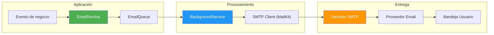

- [21. Servicios de Email](#21-servicios-de-email)
  - [21.1. Fundamentos del Sistema de Emails](#211-fundamentos-del-sistema-de-emails)
    - [21.1.1. ¿Por Qué un Sistema de Emails Robusto?](#2111-por-qué-un-sistema-de-emails-robusto)
    - [21.1.2. Casos de Uso](#2112-casos-de-uso)
    - [21.1.3. Desafíos del Sistema de Emails](#2113-desafíos-del-sistema-de-emails)
  - [21.2. Instalación de MailKit](#212-instalación-de-mailkit)
  - [21.3. Interfaz IEmailService](#213-interfaz-iemailservice)
  - [21.4. Implementación con MailKit](#214-implementación-con-mailkit)
    - [21.4.1. MailKitEmailService](#2141-mailkitemailservice)
    - [21.4.2. Configuración SMTP](#2142-configuración-smtp)
    - [21.4.3. Envío de Adjuntos](#2143-envío-de-adjuntos)
  - [21.5. Servicio de Desarrollo (MemoryEmailService)](#215-servicio-de-desarrollo-memoryemailservice)
  - [21.6. Sistema de Plantillas](#216-sistema-de-plantillas)
    - [21.6.1. ITemplateService](#2161-itemplateservice)
    - [21.6.2. Renderizado de Plantillas](#2162-renderizado-de-plantillas)
  - [21.7. Cola de Emails con BackgroundService](#217-cola-de-emails-con-backgroundservice)
    - [21.7.1. EmailQueueService](#2171-emailqueueservice)
    - [21.7.2. Procesamiento de Cola](#2172-procesamiento-de-cola)
  - [21.8. Integración con Productos](#218-integración-con-productos)
  - [21.9. Configuración en appsettings.json](#219-configuración-en-appsettingsjson)
  - [21.10. Testing](#2110-testing)
  - [21.11. Buenas Prácticas](#2111-buenas-prácticas)
  - [21.12. Reto: Email en FunkoApp](#2112-reto-email-en-funkoapp)

---

# 21. Servicios de Email

> **Punto de partida:** Cuando compras en Amazon, recibes un email de confirmación al instante. Cuando alguien comenta tu foto en Instagram, te llega una notificación. El envío de emails es una parte fundamental de cualquier aplicación moderna. ¿Cómo se implementa un sistema de emails robusto, escalable y fácil de probar?

En este punto aprenderás a diseñar e implementar un servicio de envío de emails en .NET: desde los conceptos básicos de SMTP hasta un sistema completo con plantillas, colas asíncronas e integración con tus servicios de negocio.

**Objetivos de aprendizaje:**

- Comprender los fundamentos de SMTP y el envío de emails
- Instalar y configurar MailKit en un proyecto .NET
- Diseñar una interfaz `IEmailService` desacoplada
- Implementar servicios reales y de desarrollo para testing
- Crear un sistema de plantillas HTML reutilizable
- Usar `BackgroundService` para procesar emails en segundo plano
- Integrar el envío de emails con servicios de negocio (Productos)

## 21.1. Fundamentos del Sistema de Emails

### 21.1.1. ¿Por Qué un Sistema de Emails Robusto?

El envío de emails es fundamental para la comunicación con usuarios. Las notificaciones por email incluyen confirmaciones de pedidos, restablecimiento de contraseñas, notificaciones de envío, recibos fiscales y alertas de seguridad.

Un sistema bien diseñado debe ser **confiable** (no perder emails), **eficiente** (no bloquear la aplicación), **probable** (facilitar tests sin SMTP real) y **maintainable** (plantillas fáciles de cambiar).



> **Analogía:** El sistema de emails es como el servicio de correo de una empresa. Los empleados (aplicación) entregan las cartas (emails) al departamento de correo (EmailService). El departamento las procesa en batch (BackgroundService) y las entrega al correo (SMTP) para que lleguen a los destinatarios finales.

📌 **Ejemplo real:** Amazon envía emails de confirmación de pedido de forma asíncrona. Cuando haces clic en "Comprar", el pedido se guarda en la BD y se encola un email. El usuario ve la confirmación al instante, y el email llega unos segundos después. No espera al email para mostrar la respuesta.

### 21.1.2. Casos de Uso

| Caso de Uso | Trigger | Importancia |
|-------------|---------|-------------|
| **Confirmación de pedido** | Pedido creado | Alta |
| **Restablecer contraseña** | Solicitud usuario | Crítica |
| **Notificación de envío** | Pedido enviado | Media |
| **Newsletter** | Campaña marketing | Baja |
| **Alerta de seguridad** | Login sospechoso | Alta |
| **Recibo fiscal** | Pago completado | Alta |

### 21.1.3. Desafíos del Sistema de Emails

| Desafío | Solución |
|---------|----------|
| **Fiabilidad** | Cola asíncrona con reintentos |
| **Rendimiento** | BackgroundService no bloqueante |
| **Testing** | Servicio de memoria para tests |
| **Templates** | Sistema de plantillas HTML |
| **Cola persistente** | Redis o base de datos |

> ⚠️ **Advertencia:** **Nunca** envíes emails de forma síncrona dentro de un endpoint HTTP. Si el servidor SMTP tarda 3 segundos, tu usuario espera 3 segundos con la pantalla en blanco. Usa siempre una cola asíncrona.

## 21.2. Instalación de MailKit

**MailKit** es la biblioteca más popular para envío de emails en .NET. Es moderna, rápida y soporta SMTP, IMAP y POP3. Incluye **MimeKit** como dependencia para construir mensajes MIME con soporte completo para HTML, texto plano, adjuntos y codificación de caracteres.

```bash
# Instalación mediante .NET CLI
dotnet add package MailKit
```

📌 **Ejemplo real:** MailKit es la librería que usa internamente ASP.NET Core para enviar emails. Cuando configuras `IEmailSender` con un proveedor SMTP, por debajo usa MailKit/MimeKit.

> 💡 **Consejo:** No necesitas instalar MimeKit por separado. MailKit lo incluye como dependencia automática.

## 21.3. Interfaz IEmailService

La clave de un buen sistema de emails es **desacoplar** la abstracción de la implementación. Definimos una interfaz `IEmailService` que nuestros servicios de negocio usarán, sin importar si el email se envía por SMTP real o se almacena en memoria para tests.

```csharp
public interface IEmailService
{
    Task SendAsync(EmailMessage message, CancellationToken cancellationToken = default);
    Task SendBatchAsync(IEnumerable<EmailMessage> messages, CancellationToken cancellationToken = default);
    Task<EmailTemplate?> GetTemplateAsync(string templateName, CancellationToken cancellationToken = default);
}

public class EmailMessage
{
    public required string To { get; init; }
    public required string Subject { get; init; }
    public required string Body { get; init; }
    public bool IsHtml { get; init; } = true;
    public string? From { get; init; }
    public string? ReplyTo { get; init; }
    public List<string> Cc { get; init; } = new();
    public List<string> Bcc { get; init; } = new();
    public List<EmailAttachment> Attachments { get; init; } = new();
}

public class EmailAttachment
{
    public required string FileName { get; init; }
    public required byte[] Content { get; init; }
    public string? ContentType { get; init; }
}

public class EmailTemplate
{
    public string Name { get; init; } = string.Empty;
    public string Subject { get; init; } = string.Empty;
    public string BodyHtml { get; init; } = string.Empty;
    public string? BodyText { get; init; }
}
```

📌 **Ejemplo real:** Spotify usa este patrón cuando envía emails de "Tu resumen anual está listo". El servicio de negocio llama a `IEmailService.SendAsync()` sin preocuparse de si el email se envía por SMTP, SendGrid o se guarda en una cola.

## 21.4. Implementación con MailKit

### 21.4.1. MailKitEmailService

Esta es la implementación real que envía emails a través de un servidor SMTP:

```csharp
using MailKit.Net.Smtp;
using MailKit.Security;
using MimeKit;
using MimeKit.Text;

public class MailKitEmailService(
    IConfiguration configuration,
    ILogger<MailKitEmailService> logger,
    ITemplateService templateService) : IEmailService
{
    public async Task SendAsync(EmailMessage message, CancellationToken cancellationToken = default)
    {
        var smtpConfig = GetSmtpConfiguration();

        var mimeMessage = new MimeMessage
        {
            Subject = message.Subject,
            Body = new TextPart(message.IsHtml ? TextFormat.Html : TextFormat.Plain)
            {
                Text = message.Body
            }
        };

        mimeMessage.From.Add(new MailboxAddress(smtpConfig.DisplayName, smtpConfig.From));
        mimeMessage.To.Add(new MailboxAddress("", message.To));

        foreach (var attachment in message.Attachments)
        {
            var memory = new MemoryStream(attachment.Content);
            mimeMessage.Attachments.Add(new MimePart(
                attachment.ContentType ?? "application/octet-stream",
                attachment.FileName)
            {
                Content = new MimeContent(memory)
            });
        }

        logger.LogInformation("Enviando email a {To} con asunto: {Subject}", message.To, message.Subject);

        try
        {
            using var smtpClient = new SmtpClient();

            await smtpClient.ConnectAsync(
                smtpConfig.Host,
                smtpConfig.Port,
                GetSecureSocket(smtpConfig.Security),
                cancellationToken);

            if (!string.IsNullOrEmpty(smtpConfig.Username))
            {
                await smtpClient.AuthenticateAsync(smtpConfig.Username, smtpConfig.Password, cancellationToken);
            }

            await smtpClient.SendAsync(mimeMessage, cancellationToken);
            await smtpClient.DisconnectAsync(true, cancellationToken);

            logger.LogInformation("Email enviado exitosamente a {To}", message.To);
        }
        catch (Exception ex)
        {
            logger.LogError(ex, "Error enviando email a {To}: {Error}", message.To, ex.Message);
            throw;
        }
    }

    // ... SendBatchAsync, GetTemplateAsync, helpers
}
```

> ⚠️ **Advertencia:** Usa `using var smtpClient` (con `var`), nunca `using (var smtpClient = ...)`. La forma actual es más limpia y sigue las convenciones de C# moderno.

### 21.4.2. Configuración SMTP

```csharp
private SmtpConfiguration GetSmtpConfiguration()
{
    return new SmtpConfiguration
    {
        Host = configuration["Email:Smtp:Host"] ?? "localhost",
        Port = int.Parse(configuration["Email:Smtp:Port"] ?? "25"),
        Username = configuration["Email:Smtp:Username"],
        Password = configuration["Email:Smtp:Password"],
        From = configuration["Email:From"] ?? "noreply@tienda.com",
        DisplayName = configuration["Email:DisplayName"] ?? "TiendaDAW",
        Security = configuration["Email:Smtp:Security"] ?? "Auto"
    };
}

private static SecureSocketOptions GetSecureSocket(string security)
{
    return security?.ToLowerInvariant() switch
    {
        "ssl" => SecureSocketOptions.SslOnConnect,
        "tls" => SecureSocketOptions.StartTls,
        "none" => SecureSocketOptions.None,
        _ => SecureSocketOptions.Auto
    };
}
```

### 21.4.3. Envío de Adjuntos

```csharp
foreach (var attachment in message.Attachments)
{
    var memory = new MemoryStream(attachment.Content);
    mimeMessage.Attachments.Add(new MimePart(
        attachment.ContentType ?? "application/octet-stream",
        attachment.FileName)
    {
        Content = new MimeContent(memory)
    });
}
```

📌 **Ejemplo real:** Gmail permite adjuntos de hasta 25 MB. Tu sistema de emails debe validar el tamaño antes de enviar para evitar rechazos del servidor SMTP.

## 21.5. Servicio de Desarrollo (MemoryEmailService)

Durante el desarrollo y los tests, **no queremos enviar emails reales**. `MemoryEmailService` almacena los emails en memoria para poder verificarlos sin configurar SMTP.

```csharp
public class MemoryEmailService : IEmailService
{
    private readonly ILogger<MemoryEmailService> _logger;
    public static readonly List<EmailMessage> SentEmails = new();

    public MemoryEmailService(ILogger<MemoryEmailService> logger)
    {
        _logger = logger;
    }

    public Task SendAsync(EmailMessage message, CancellationToken cancellationToken = default)
    {
        _logger.LogInformation("[MOCK EMAIL] Para: {To}, Asunto: {Subject}", message.To, message.Subject);
        SentEmails.Add(message);
        return Task.CompletedTask;
    }

    public Task SendBatchAsync(IEnumerable<EmailMessage> messages, CancellationToken cancellationToken = default)
    {
        SentEmails.AddRange(messages);
        return Task.CompletedTask;
    }

    public Task<EmailTemplate?> GetTemplateAsync(string templateName, CancellationToken cancellationToken = default)
    {
        var template = new EmailTemplate
        {
            Name = templateName,
            Subject = $"[TEST] Plantilla {templateName}",
            BodyHtml = $"<h1>Plantilla de prueba: {templateName}</h1>"
        };
        return Task.FromResult<EmailTemplate?>(template);
    }

    public static void Clear() => SentEmails.Clear();

    public static EmailMessage? GetLastEmail(string to)
    {
        return SentEmails.LastOrDefault(e => e.To.Equals(to, StringComparison.OrdinalIgnoreCase));
    }
}
```

📌 **Ejemplo real:** En el proyecto Tienda, usamos `MemoryEmailService` en el entorno de desarrollo para que los tests puedan verificar que se envían los emails correctos sin necesidad de un servidor SMTP real.

❌ **MALO:** Enviar emails reales en tests → lentos, dependen de red, pueden fallar por rate limiting.

✅ **BUENO:** Usar `MemoryEmailService` → instantáneo, sin red, verificable con assertions.

## 21.6. Sistema de Plantillas

### 21.6.1. ITemplateService

Las plantillas permiten separar el contenido visual del código. Un email de "pedido confirmado" tiene un diseño HTML que puede cambiar sin tocar C#.

```csharp
public interface ITemplateService
{
    Task<EmailTemplate?> GetTemplateAsync(string templateName, CancellationToken cancellationToken = default);
    string Render(string templateName, Dictionary<string, object> data);
}

public class TemplateService(IWebHostEnvironment environment, ILogger<TemplateService> logger) : ITemplateService
{
    private readonly Dictionary<string, EmailTemplate> _templates = LoadTemplates(environment, logger);

    private static Dictionary<string, EmailTemplate> LoadTemplates(IWebHostEnvironment env, ILogger log)
    {
        var templatesPath = Path.Combine(env.ContentRootPath, "Templates", "Emails");
        if (!Directory.Exists(templatesPath)) return new Dictionary<string, EmailTemplate>();

        var templates = new Dictionary<string, EmailTemplate>(StringComparer.OrdinalIgnoreCase);
        foreach (var templateDir in Directory.GetDirectories(templatesPath))
        {
            var templateName = Path.GetFileName(templateDir);
            var subjectFile = Path.Combine(templateDir, "subject.txt");
            var htmlFile = Path.Combine(templateDir, "body.html");

            if (File.Exists(subjectFile) && File.Exists(htmlFile))
            {
                templates[templateName] = new EmailTemplate
                {
                    Name = templateName,
                    Subject = File.ReadAllText(subjectFile).Trim(),
                    BodyHtml = File.ReadAllText(htmlFile)
                };
            }
        }

        log.LogInformation("Cargadas {Count} plantillas de email", templates.Count);
        return templates;
    }

    public Task<EmailTemplate?> GetTemplateAsync(string templateName, CancellationToken cancellationToken = default)
    {
        return Task.FromResult(
            _templates.TryGetValue(templateName, out var template) ? template : null);
    }

    public string Render(string templateName, Dictionary<string, object> data)
    {
        if (!_templates.TryGetValue(templateName, out var template))
            throw new KeyNotFoundException($"Plantilla '{templateName}' no encontrada");

        var result = template.BodyHtml;
        foreach (var kvp in data)
            result = result.Replace($"{{{{ {kvp.Key} }}}}", kvp.Value?.ToString() ?? "");
        return result;
    }
}
```

### 21.6.2. Renderizado de Plantillas

Las plantillas se almacenan en archivos separados dentro del proyecto:

```
Templates/
└── Emails/
    ├── pedido-confirmado/
    │   ├── subject.txt
    │   └── body.html
    ├── pedido-enviado/
    │   ├── subject.txt
    │   └── body.html
    └── reset-password/
        ├── subject.txt
        └── body.html
```

**Ejemplo de plantilla (body.html):**

```html
<h1>Hola {{ nombre }},</h1>
<p>Tu pedido #{{ pedidoId }} ha sido confirmado.</p>
<p>Total: {{ total }} €</p>
<p>Gracias por comprar en TiendaDAW</p>
```

📌 **Ejemplo real:** Netflix envía emails con diseño HTML complejo (imagenes, botones, colores). Todo está en plantillas que el equipo de marketing puede editar sin tocar código C#.

> 💡 **Consejo:** Usa marcadores como `{{ variable }}` en las plantillas. Es simple, no depende de librerías externas y es fácil de entender.

## 21.7. Cola de Emails con BackgroundService

### 21.7.1. EmailQueueService

Una cola en memoria permite que la aplicación encole emails sin esperar a que se envíen. Un `BackgroundService` los procesa en segundo plano.

```csharp
using System.Collections.Concurrent;

public class EmailQueueService
{
    private readonly ConcurrentQueue<EmailMessage> _queue = new();
    private readonly SemaphoreSlim _signal = new(0);

    public void Enqueue(EmailMessage email)
    {
        _queue.Enqueue(email);
        _signal.Release();
    }

    public async Task<EmailMessage?> DequeueAsync(CancellationToken cancellationToken)
    {
        await _signal.WaitAsync(cancellationToken);
        return _queue.TryDequeue(out var email) ? email : null;
    }

    public int Count => _queue.Count;
}
```

### 21.7.2. Procesamiento de Cola

```csharp
public class EmailBackgroundWorker(
    EmailQueueService queue,
    IEmailService emailService,
    ILogger<EmailBackgroundWorker> logger) : BackgroundService
{
    protected override async Task ExecuteAsync(CancellationToken stoppingToken)
    {
        logger.LogInformation("Email worker iniciado");

        while (!stoppingToken.IsCancellationRequested)
        {
            try
            {
                var email = await queue.DequeueAsync(stoppingToken);
                if (email != null)
                {
                    await emailService.SendAsync(email, stoppingToken);
                    logger.LogInformation("Email procesado: {To}", email.To);
                }
            }
            catch (OperationCanceledException) { break; }
            catch (Exception ex)
            {
                logger.LogError(ex, "Error procesando email de la cola");
            }
        }

        logger.LogInformation("Email worker detenido");
    }
}
```

📌 **Ejemplo real:** Cuando haces "Publicar" en Instagram, la app encola un email de notificación a tus seguidores. El `BackgroundService` lo procesa mientras tú sigues navegando. No notas retraso.

> 💡 **Consejo:** Registra el `EmailBackgroundWorker` en `Program.cs` con `builder.Services.AddHostedService<EmailBackgroundWorker>()`.

## 21.8. Integración con Productos

Veamos cómo integrar el envío de emails con un servicio de negocio real. Cuando se crea o elimina un producto, se envía una notificación por email:

```csharp
public class ProductosService(
    IProductosRepository repository,
    IEmailService emailService,
    EmailQueueService emailQueue,
    ILogger<ProductosService> logger) : IProductosService
{
    public async Task<Result<Producto, Error>> CreateAsync(CreateProductoRequest request)
    {
        var producto = new Producto
        {
            Nombre = request.Nombre,
            Precio = request.Precio,
            Categoria = request.Categoria,
            CreadoEn = DateTime.UtcNow
        };

        var result = await repository.AddAsync(producto);

        if (result.IsSuccess)
        {
            var email = new EmailMessage
            {
                To = "admin@tienda.com",
                Subject = $"Nuevo producto: {producto.Nombre}",
                Body = $"Se ha creado el producto '{producto.Nombre}' con precio {producto.Precio} €.",
                IsHtml = false
            };

            emailQueue.Enqueue(email);
            logger.LogInformation("Email de notificación encolado para producto {ProductoId}", result.Value.Id);
        }

        return result;
    }

    public async Task<Result<bool, Error>> DeleteAsync(long id)
    {
        var result = await repository.DeleteAsync(id);

        if (result.IsSuccess)
        {
            var email = new EmailMessage
            {
                To = "admin@tienda.com",
                Subject = $"Producto eliminado: ID {id}",
                Body = $"El producto con ID {id} ha sido eliminado del catálogo.",
                IsHtml = false
            };

            emailQueue.Enqueue(email);
            logger.LogInformation("Email de eliminación encolado para producto {ProductoId}", id);
        }

        return result;
    }
}
```

❌ **MALO:** Enviar el email directamente dentro del `CreateAsync` y esperar a que se envíe → el endpoint tarda 3 segundos.

✅ **BUENO:** Encolar el email y devolver inmediatamente → el endpoint responde en milisegundos, el email se envía en background.

📌 **Ejemplo real:** En Glovo, cuando un restaurante confirma tu pedido, la app te notifica al instante. El email de confirmación se envía en background mientras tú ves el estado del pedido.

## 21.9. Configuración en appsettings.json

```json
{
  "Email": {
    "From": "noreply@tienda.com",
    "DisplayName": "TiendaDAW",
    "Smtp": {
      "Host": "smtp.gmail.com",
      "Port": 587,
      "Username": "tu-cuenta@gmail.com",
      "Password": "tu-password-de-aplicacion",
      "Security": "TLS"
    }
  }
}
```

Para desarrollo local con Mailhog (servidor SMTP ficticio):

```json
{
  "Email": {
    "Smtp": {
      "Host": "localhost",
      "Port": 1025,
      "Security": "None"
    }
  }
}
```

> ⚠️ **Advertencia:** **Nunca** guardes contraseñas reales en `appsettings.json`. Usa Variables de Entorno o Azure Key Vault. En desarrollo, puedes usar el Secret Manager de .NET: `dotnet user-secrets set "Email:Smtp:Password" "tu-password"`.

📌 **Ejemplo real:** En Gmail, para usar SMTP necesitas generar una "Contraseña de aplicación" en la configuración de seguridad. Nunca usas tu contraseña normal.

## 21.10. Testing

```csharp
using FluentAssertions;
using Moq;
using NUnit.Framework;

[TestFixture]
public class EmailServiceTests
{
    private Mock<ILogger<MemoryEmailService>> _loggerMock = null!;
    private MemoryEmailService _memoryEmailService = null!;

    [SetUp]
    public void SetUp()
    {
        _loggerMock = new Mock<ILogger<MemoryEmailService>>();
        _memoryEmailService = new MemoryEmailService(_loggerMock.Object);
        MemoryEmailService.Clear();
    }

    [Test]
    public void SendAsync_AddsEmailToInMemoryCollection()
    {
        // Arrange
        var email = new EmailMessage
        {
            To = "test@example.com",
            Subject = "Test Subject",
            Body = "Test Body",
            IsHtml = false
        };

        // Act
        _memoryEmailService.SendAsync(email);

        // Assert
        MemoryEmailService.SentEmails.Should().HaveCount(1);
        MemoryEmailService.SentEmails[0].To.Should().Be("test@example.com");
    }

    [Test]
    public void SendAsync_StoresCorrectSubject()
    {
        // Arrange
        var email = new EmailMessage
        {
            To = "user@example.com",
            Subject = "Confirmación de Pedido",
            Body = "Tu pedido ha sido confirmado",
            IsHtml = true
        };

        // Act
        _memoryEmailService.SendAsync(email);

        // Assert
        var sent = MemoryEmailService.GetLastEmail("user@example.com");
        sent.Should().NotBeNull();
        sent!.Subject.Should().Be("Confirmación de Pedido");
    }

    [Test]
    public void SendBatchAsync_AddsMultipleEmails()
    {
        // Arrange
        var emails = new List<EmailMessage>
        {
            new() { To = "user1@example.com", Subject = "Email 1", Body = "Body 1", IsHtml = false },
            new() { To = "user2@example.com", Subject = "Email 2", Body = "Body 2", IsHtml = false },
            new() { To = "user3@example.com", Subject = "Email 3", Body = "Body 3", IsHtml = false }
        };

        // Act
        _memoryEmailService.SendBatchAsync(emails);

        // Assert
        MemoryEmailService.SentEmails.Should().HaveCount(3);
    }

    [Test]
    public void Clear_RemovesAllSentEmails()
    {
        // Arrange
        var email = new EmailMessage
        {
            To = "test@example.com",
            Subject = "Test",
            Body = "Test",
            IsHtml = false
        };
        _memoryEmailService.SendAsync(email);

        // Act
        MemoryEmailService.Clear();

        // Assert
        MemoryEmailService.SentEmails.Should().BeEmpty();
    }

    [Test]
    public void GetTemplateAsync_ReturnsTemplate()
    {
        // Act
        var template = _memoryEmailService.GetTemplateAsync("test-template").Result;

        // Assert
        template.Should().NotBeNull();
        template!.Name.Should().Be("test-template");
    }
}

[TestFixture]
public class EmailQueueServiceTests
{
    [Test]
    public void Enqueue_AddsMessageToQueue()
    {
        // Arrange
        var queue = new EmailQueueService();
        var email = new EmailMessage
        {
            To = "test@example.com",
            Subject = "Test",
            Body = "Test",
            IsHtml = false
        };

        // Act
        queue.Enqueue(email);

        // Assert
        queue.Count.Should().Be(1);
    }

    [Test]
    public async Task DequeueAsync_RemovesMessageFromQueue()
    {
        // Arrange
        var queue = new EmailQueueService();
        var email = new EmailMessage
        {
            To = "test@example.com",
            Subject = "Test",
            Body = "Test",
            IsHtml = false
        };
        queue.Enqueue(email);

        // Act
        var dequeued = await queue.DequeueAsync(CancellationToken.None);

        // Assert
        dequeued.Should().NotBeNull();
        dequeued!.To.Should().Be("test@example.com");
        queue.Count.Should().Be(0);
    }
}
```

> 💡 **Consejo:** Usa el patrón **Arrange-Act-Assert** en todos tus tests. Comenta cada sección para que el código sea legible.

## 21.11. Buenas Prácticas

| Categoría | Buena Práctica | Por qué |
|-----------|----------------|---------|
| **Desacoplamiento** | Usar `IEmailService` como abstracción | Permite cambiar la implementación sin tocar la lógica de negocio |
| **Testing** | Implementar `MemoryEmailService` | Tests rápidos sin dependencia de red |
| **Rendimiento** | Cola asíncrona con `BackgroundService` | No bloquea los endpoints HTTP |
| **Plantillas** | Archivos externos HTML | El equipo de diseño puede cambiar emails sin tocar código |
| **Configuración** | `appsettings.json` + Variables de Entorno | Separar configuración del código, nunca hardcodear credenciales |
| **Logging** | Loggear cada envío y cada error | Trazabilidad para debugging en producción |
| **Reintentos** | Implementar retry en fallos temporales | La red puede fallar, hay que reintentar |
| **Seguridad** | Nunca enviar passwords por email | Si necesitas contraseñas, usa enlaces de reset |

> ⚠️ **Advertencia:** **Nunca** envíes emails de forma síncrona en un endpoint HTTP. Si el servidor SMTP tarda, tu usuario ve una pantalla de carga. Usa siempre la cola.

📌 **Ejemplo real:** Netflix no te envía el email de "Tu resumen anual está listo" inmediatamente. Lo encola y lo procesa en background mientras tú sigues usando la app.

## 21.12. Reto: Email en FunkoApp

> Antes de irte, implementa un sistema de emails para tu FunkoApp. No necesitas SMTP real: usa `MemoryEmailService`.

### Contexto

Vas a añadir notificaciones por email a tu FunkoApp de productos. Cuando se crea o elimina un Funko, se envía un email de notificación.

### Modelo de datos

Un Funko tiene estas propiedades:

| Propiedad | Tipo | Obligatorio |
|-----------|------|:-----------:|
| `id` | long | Sí (autogenerado) |
| `nombre` | string | Sí |
| `precio` | decimal | Sí |
| `categoria` | string | Sí |
| `imagen` | string | No |
| `creadoEn` | DateTime | Sí (autogenerado) |

### Ejercicio: Completa la implementación

**Parte 1: Interfaz y modelo**

1. Crea la interfaz `IEmailService` con los métodos `SendAsync`, `SendBatchAsync` y `GetTemplateAsync`
2. Crea las clases `EmailMessage`, `EmailAttachment` y `EmailTemplate`

**Parte 2: Implementación**

3. Implementa `MemoryEmailService` que almacene emails en memoria
4. Implementa `EmailQueueService` con `ConcurrentQueue` y `SemaphoreSlim`
5. Implementa `EmailBackgroundWorker` que procese la cola

**Parte 3: Integración**

6. Modifica tu `ProductosService` para que al crear un Funko encole un email de notificación
7. Modifica tu `ProductosService` para que al eliminar un Funko encole un email de notificación
8. Registra los servicios en `Program.cs` con inyección de dependencias

**Parte 4: Testing**

9. Escribe tests unitarios para `MemoryEmailService` (SendAsync, SendBatchAsync, Clear, GetLastEmail)
10. Escribe tests unitarios para `EmailQueueService` (Enqueue, DequeueAsync)

**Parte 5: Plantillas (opcional)**

11. Crea una plantilla HTML para el email de "producto creado"
12. Implementa `TemplateService` que cargue plantillas desde archivos

> 💡 **Consejo:** Empieza por `MemoryEmailService` y los tests. Una vez que funcionen, pasa a la cola y al `BackgroundService`. No intentes hacer todo a la vez.

---

**Resumen del punto:**

| Concepto | Descripción |
|----------|-------------|
| **SMTP** | Protocolo para enviar emails entre servidores |
| **MailKit** | Biblioteca .NET moderna para envío de emails |
| **IEmailService** | Interfaz abstracta para desacoplar la implementación |
| **MailKitEmailService** | Implementación real con servidor SMTP |
| **MemoryEmailService** | Implementación para desarrollo y testing |
| **TemplateService** | Sistema de plantillas HTML externas |
| **EmailQueueService** | Cola en memoria para procesamiento asíncrono |
| **BackgroundService** | Procesamiento de emails en segundo plano |
| **EmailMessage** | Modelo de datos para un email |
| **EmailTemplate** | Modelo de datos para una plantilla |

**¿Qué viene después?**

En el siguiente punto aprenderemos a implementar **seguridad y autenticación**: JWT, OAuth2, identity y cómo proteger tus endpoints. El servicio de emails que hemos visto aquí será útil para enviar emails de verificación y restablecimiento de contraseña.
