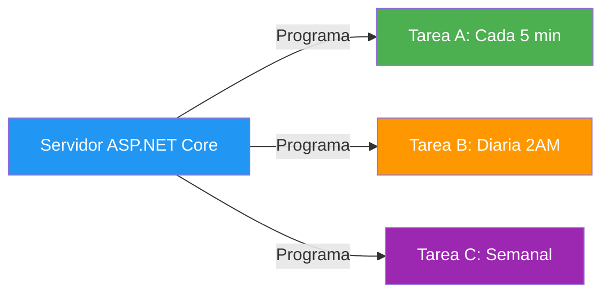
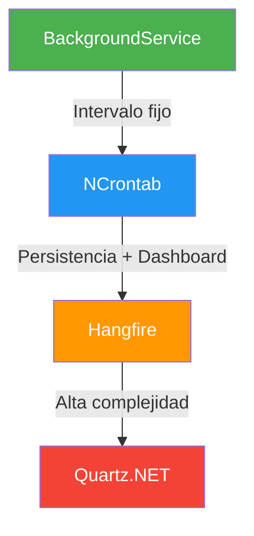
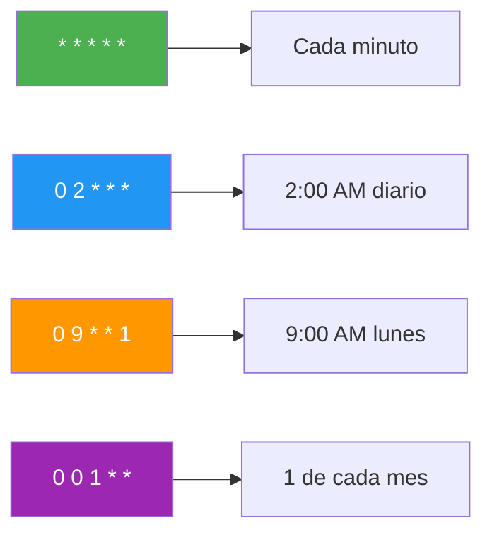
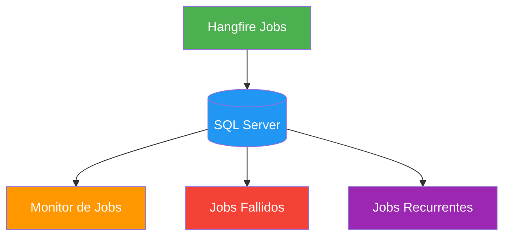

- [22. Tareas Programadas en ASP.NET Core](#22-tareas-programadas-en-aspnet-core)
  - [22.1. Introducción](#221-introducción)
    - [22.1.1. Qué son las tareas programadas](#2211-qué-son-las-tareas-programadas)
    - [22.1.2. Casos de uso comunes](#2212-casos-de-uso-comunes)
  - [22.2. Opciones para implementar tareas programadas](#222-opciones-para-implementar-tareas-programadas)
  - [22.3. Implementación con BackgroundService](#223-implementación-con-backgroundservice)
    - [22.3.1. Tarea simple con intervalo fijo](#2231-tarea-simple-con-intervalo-fijo)
    - [22.3.2. Tarea con intervalo configurable](#2232-tarea-con-intervalo-configurable)
    - [22.3.3. Tarea con expresión Cron](#2233-tarea-con-expresión-cron)
    - [22.3.4. PeriodicTimer y TimeProvider](#2234-periodictimer-y-timeprovider)
  - [22.4. Implementación con NCrontab](#224-implementación-con-ncrontab)
    - [22.4.1. Instalación](#2241-instalación)
    - [22.4.2. Servicio base con Cron](#2242-servicio-base-con-cron)
    - [22.4.3. Ejemplo: Limpieza diaria de caché](#2243-ejemplo-limpieza-diaria-de-caché)
    - [22.4.4. Expresiones Cron comunes](#2244-expresiones-cron-comunes)
  - [22.5. Implementación con Hangfire (Producción)](#225-implementación-con-hangfire-producción)
    - [22.5.1. Instalación](#2251-instalación)
    - [22.5.2. Configuración](#2252-configuración)
    - [22.5.3. Crear tareas recurrentes](#2253-crear-tareas-recurrentes)
    - [22.5.4. Dashboard de monitoreo](#2254-dashboard-de-monitoreo)
  - [22.6. Ejemplo avanzado: Servicio de novedades por email](#226-ejemplo-avanzado-servicio-de-novedades-por-email)
    - [22.6.1. Con BackgroundService](#2261-con-backgroundservice)
    - [22.6.2. Con Hangfire](#2262-con-hangfire)
  - [22.7. Monitoreo y Logging](#227-monitoreo-y-logging)
  - [22.8. Testing de tareas programadas](#228-testing-de-tareas-programadas)
  - [22.9. Buenas prácticas](#229-buenas-prácticas)
  - [22.10. Comparación de opciones](#2210-comparación-de-opciones)
  - [22.11. Reto: Sistema de Tareas para FunkoApp](#2211-reto-sistema-de-tareas-para-funkoapp)


# 22. Tareas Programadas en ASP.NET Core

> 💡 **Punto de partida:** ¿Has pensado alguna vez cómo Netflix te envía notificaciones de "hay novedades para ti" cada mañana a las 8:00? O cómo Glovo limpia los pedidos cancelados cada noche sin que nadie lo pulse. Detrás de todo eso hay tareas programadas: código que se ejecuta solo, en el momento justo, sin intervención humana.

En este punto aprenderás a crear tareas programadas en ASP.NET Core: desde un BackgroundService sencillo hasta Hangfire con dashboard de monitoreo.

**Objetivos de aprendizaje:**

- Comprender qué son las tareas programadas y cuándo usarlas
- Implementar tareas con BackgroundService (intervalo fijo, configurable, Cron)
- Usar NCrontab para expresiones Cron precisas
- Configurar Hangfire para producción con dashboard y persistencia
- Monitorear, testear y aplicar buenas prácticas

## 22.1. Introducción

### 22.1.1. Qué son las tareas programadas

Las **tareas programadas** (scheduled tasks o background jobs) son fragmentos de código que se ejecutan automáticamente en momentos específicos o con intervalos regulares, sin intervención manual. Son esenciales para automatizar procesos repetitivos en aplicaciones modernas.

> 💡 **Analogía:** Imagina un empleado diligentísimo que cada mañana a las 8:00 AM revisa el correo, genera reportes semanales todos los lunes, y hace copias de seguridad cada noche a las 2:00 AM. Las tareas programadas son exactamente eso: empleados virtuales que trabajan incansablemente en segundo plano.

📌 **Ejemplo real:** Cuando abres Instagram, la app muestra contenido nuevo porque cada cierto tiempo un job en el servidor actualiza el feed. Si eso no existiera, tendrías que recargar la app manualmente para ver algo nuevo.



### 22.1.2. Casos de uso comunes

| Categoría | Ejemplo | Frecuencia típica |
|:----------|:--------|:------------------|
| **Mantenimiento** | Limpieza de datos antiguos | Diaria |
| **Reportes** | Generación de estadísticas de ventas | Semanal |
| **Comunicación** | Envío de newsletters | Diaria/semanal |
| **Sincronización** | Importar datos de proveedores | Horaria |
| **Copia de seguridad** | Backup de base de datos | Nocturna |
| **Alertas** | Notificar stock bajo | Continua |
| **Limpieza** | Eliminar archivos temporales | Diaria |

📌 **Ejemplo real:** En un e-commerce como FunkoApp, una tarea horaria comprueba el stock de productos y envía un email al administrador cuando un Funko tiene menos de 10 unidades. Sin esa tarea, alguien tendría que revisar manualmente cada producto cada día.

> 💡 **Consejo:** En entrevistas, menciona que las tareas programadas son fundamentales en arquitecturas de microservicios para manejar cross-cutting concerns como logging, métricas y mantenimiento automático.

## 22.2. Opciones para implementar tareas programadas

En ASP.NET Core existen varias formas de implementar tareas programadas, cada una con diferentes niveles de complejidad y características.

| Opción | Complejidad | Características | Uso recomendado |
|:-------|:------------|:----------------|:----------------|
| **IHostedService** | Baja | Integrado en .NET, control total del ciclo de vida | Arranque/parada a medida |
| **BackgroundService** | Baja | Más sencillo que IHostedService | Tareas con intervalos fijos |
| **NCrontab** | Media | Expresiones Cron precisas | Tareas con horarios específicos |
| **Hangfire** | Media-Alta | Dashboard, persistencia, reintentos | Producción con monitoreo |
| **Quartz.NET** | Alta | Muy completo y robusto | Sistemas empresariales complejos |

**¿Qué diferencia hay entre `IHostedService` y `BackgroundService`?**

`IHostedService` es la interfaz de más bajo nivel: tú implementas `StartAsync` (arranque) y `StopAsync` (parada), y decides cuándo empieza y cuándo para el trabajo. `BackgroundService` implementa `IHostedService` por ti y te deja un único método, `ExecuteAsync`, que arranca automáticamente con la aplicación y corre en segundo plano hasta que llega la señal de cancelación:

| Interfaz | Métodos que implementas | Ciclo de vida |
|:---------|:------------------------|:--------------|
| **`IHostedService`** | `StartAsync` + `StopAsync` | Tú controlas cuándo se ejecuta el trabajo (bajo demanda, eventos, temporizadores propios) |
| **`BackgroundService`** | `ExecuteAsync` | Arranca con la app y se ejecuta en bucle hasta `stoppingToken` |

> 💡 **Consejo:** Para tareas "arranca y olvídate" (bucles con `Task.Delay`, Cron...), usa `BackgroundService`. Si necesitas control fino del arranque y la parada (iniciar bajo demanda, cerrar recursos ordenadamente al parar), implementa `IHostedService`.



> 📝 **Nota:** Para este curso nos centraremos en **BackgroundService** para desarrollo (simple y efectivo) y **Hangfire** para producción (robusto con monitoreo).

## 22.3. Implementación con BackgroundService

### 22.3.1. Tarea simple con intervalo fijo

```csharp
using Microsoft.Extensions.Hosting;
using Microsoft.Extensions.Logging;

namespace FunkosApi.Services.Background;

public class SimpleScheduledTask(ILogger<SimpleScheduledTask> logger) : BackgroundService
{
    private readonly TimeSpan _interval = TimeSpan.FromSeconds(30);

    protected override async Task ExecuteAsync(CancellationToken stoppingToken)
    {
        logger.LogInformation("Tarea programada iniciada");

        while (!stoppingToken.IsCancellationRequested)
        {
            try
            {
                logger.LogInformation("Ejecutando tarea: {Time}", DateTime.Now);

                await DoWorkAsync();

                await Task.Delay(_interval, stoppingToken);
            }
            catch (OperationCanceledException)
            {
                logger.LogInformation("Tarea cancelada por shutdown");
                break;
            }
            catch (Exception ex)
            {
                logger.LogError(ex, "Error en tarea programada");

                // Esperar antes de reintentar sin dejar que una cancelación escape
                try
                {
                    await Task.Delay(TimeSpan.FromMinutes(1), stoppingToken);
                }
                catch (OperationCanceledException)
                {
                    break;
                }
            }
        }

        logger.LogInformation("Tarea programada detenida");
    }

    private async Task DoWorkAsync()
    {
        await Task.Delay(100);
        logger.LogInformation("Trabajo completado");
    }
}
```

**Registro en Program.cs:**

```csharp
builder.Services.AddHostedService<SimpleScheduledTask>();
```

> 💡 **Consejo:** Siempre incluye `try-catch` dentro del bucle `while`. Si una excepción escapa, la tarea se detiene silenciosamente y nunca vuelves a tener noticias de ella.

### 22.3.2. Tarea con intervalo configurable

```csharp
public class ConfigurableScheduledTask(
    ILogger<ConfigurableScheduledTask> logger,
    IConfiguration configuration) : BackgroundService
{
    private readonly TimeSpan _interval = TimeSpan.FromSeconds(
        configuration.GetValue<int>("ScheduledTasks:IntervalSeconds", 60));

    protected override async Task ExecuteAsync(CancellationToken stoppingToken)
    {
        logger.LogInformation("Tarea configurable iniciada (intervalo: {Interval})", _interval);

        while (!stoppingToken.IsCancellationRequested)
        {
            try
            {
                await DoWorkAsync();
                await Task.Delay(_interval, stoppingToken);
            }
            catch (OperationCanceledException)
            {
                logger.LogInformation("Tarea cancelada");
                break;
            }
            catch (Exception ex)
            {
                logger.LogError(ex, "Error en tarea");

                // Esperar antes de reintentar sin dejar que una cancelación escape
                try
                {
                    await Task.Delay(TimeSpan.FromMinutes(1), stoppingToken);
                }
                catch (OperationCanceledException)
                {
                    break;
                }
            }
        }
    }

    private async Task DoWorkAsync()
    {
        logger.LogInformation("Ejecutando tarea: {Time}", DateTime.Now);
        await Task.CompletedTask;
    }
}
```

**appsettings.json:**

```json
{
  "ScheduledTasks": {
    "IntervalSeconds": 300
  }
}
```

### 22.3.3. Tarea con expresión Cron

Para tareas que necesitan ejecutarse en horarios específicos (como "a las 2:00 AM cada día"), puedes combinar BackgroundService con expresiones Cron.

```csharp
public class CronScheduledTask(ILogger<CronScheduledTask> logger) : BackgroundService
{
    private readonly TimeSpan _checkInterval = TimeSpan.FromMinutes(1);
    private readonly string _cronExpression = "0 2 * * *"; // 2:00 AM diario
    private DateTime _nextRun = DateTime.MinValue;

    protected override async Task ExecuteAsync(CancellationToken stoppingToken)
    {
        _nextRun = CalculateNextRun();
        logger.LogInformation("Tarea Cron iniciada. Próxima ejecución: {NextRun}", _nextRun);

        while (!stoppingToken.IsCancellationRequested)
        {
            if (DateTime.Now >= _nextRun)
            {
                try
                {
                    logger.LogInformation("Ejecutando tarea programada");
                    await DoWorkAsync();
                    _nextRun = CalculateNextRun();
                    logger.LogInformation("Tarea completada. Próxima: {NextRun}", _nextRun);
                }
                catch (Exception ex)
                {
                    logger.LogError(ex, "Error en tarea Cron");
                }
            }

            try
            {
                await Task.Delay(_checkInterval, stoppingToken);
            }
            catch (OperationCanceledException)
            {
                break;
            }
        }
    }

    private DateTime CalculateNextRun()
    {
        var now = DateTime.Now;
        var parts = _cronExpression.Split(' ');
        var minute = int.Parse(parts[0]);
        var hour = int.Parse(parts[1]);
        var nextRun = now.Date.AddHours(hour).AddMinutes(minute);

        return nextRun > now ? nextRun : nextRun.AddDays(1);
    }

    private async Task DoWorkAsync()
    {
        logger.LogInformation("Ejecutando limpieza programada");
        await Task.CompletedTask;
    }
}
```

> ⚠️ **Advertencia:** En BackgroundService, debes crear un nuevo scope para acceder a servicios con lifetime Scoped (como DbContext). Sin esto, obtendrás errores de "captive dependency".

```csharp
// ✅ BUENO: Crear scope para servicios Scoped
using var scope = _serviceProvider.CreateScope();
var db = scope.ServiceProvider.GetRequiredService<ApplicationDbContext>();
```

### 22.3.4. PeriodicTimer y TimeProvider

Desde .NET 6 tenemos `PeriodicTimer`, y desde .NET 8 la abstracción `TimeProvider`, que permite "desacoplar" el reloj de la tarea. Combinados, son la alternativa moderna al patrón `while + Task.Delay`:

```csharp
public class PeriodicTask(
    ILogger<PeriodicTask> logger,
    TimeProvider timeProvider) : BackgroundService
{
    private readonly TimeSpan _interval = TimeSpan.FromMinutes(5);

    protected override async Task ExecuteAsync(CancellationToken stoppingToken)
    {
        using var timer = new PeriodicTimer(_interval, timeProvider);

        try
        {
            while (await timer.WaitForNextTickAsync(stoppingToken))
            {
                try
                {
                    logger.LogInformation(
                        "Ejecutando tarea: {Time}", timeProvider.GetLocalNow());
                    await DoWorkAsync();
                }
                catch (Exception ex)
                {
                    logger.LogError(ex, "Error en tarea periódica");
                }
            }
        }
        catch (OperationCanceledException)
        {
            logger.LogInformation("Tarea periódica cancelada");
        }
    }

    private async Task DoWorkAsync()
    {
        await Task.CompletedTask;
    }
}
```

**Registro en Program.cs:**

```csharp
// TimeProvider.System ya viene registrado por defecto desde .NET 8;
// se declara solo si quieres sustituirlo explícitamente
builder.Services.AddSingleton(TimeProvider.System);
builder.Services.AddHostedService<PeriodicTask>();
```

> 💡 **Truco (tests):** En producción inyectas `TimeProvider.System`, pero en tests puedes usar un `FakeTimeProvider` (paquete `Microsoft.Extensions.TimeProvider.Testing`) y avanzar el reloj con `timeProvider.Advance(...)`. Así un teste que "espera" 24 horas termina en milisegundos, sin dormir el hilo real.

> ⚠️ **Advertencia:** `PeriodicTimer` mantiene el periodo estable (no se "desvía" como `Task.Delay` encadenado), pero sigue siendo tiempo real: para horarios concretos de reloj de pared ("cada día a las 8:30") usa el patrón `_nextRun` de la sección 22.3.3 o expresiones Cron (22.4).

## 22.4. Implementación con NCrontab

### 22.4.1. Instalación

```bash
dotnet add package NCrontab
```

> 📝 **Nota:** El paquete se llama **`NCrontab`** (no "NCronTab"): es el repositorio [atifaziz/NCrontab](https://github.com/atifaziz/NCrontab) y su namespace es `NCrontab`.

### 22.4.2. Servicio base con Cron

```csharp
using NCrontab;

namespace FunkosApi.Services.Background;

public abstract class CronScheduledService(ILogger logger) : BackgroundService
{
    private DateTime _nextRun;

    protected abstract string Schedule { get; }

    protected override async Task ExecuteAsync(CancellationToken stoppingToken)
    {
        // Se parsea aquí y no en un inicializador de campo:
        // Schedule es abstracta y solo el tipo derivado puede responder
        var schedule = CrontabSchedule.Parse(Schedule);
        _nextRun = schedule.GetNextOccurrence(DateTime.Now);

        logger.LogInformation("Tarea Cron iniciada. Próxima ejecución: {NextRun}", _nextRun);

        while (!stoppingToken.IsCancellationRequested)
        {
            if (DateTime.Now >= _nextRun)
            {
                try
                {
                    logger.LogInformation("Ejecutando tarea programada");
                    await DoWorkAsync();

                    _nextRun = schedule.GetNextOccurrence(DateTime.Now);
                    logger.LogInformation("Tarea completada. Próxima: {NextRun}", _nextRun);
                }
                catch (Exception ex)
                {
                    logger.LogError(ex, "Error en tarea Cron");
                    _nextRun = schedule.GetNextOccurrence(DateTime.Now);
                }
            }

            try
            {
                await Task.Delay(TimeSpan.FromMinutes(1), stoppingToken);
            }
            catch (OperationCanceledException)
            {
                break;
            }
        }
    }

    protected abstract Task DoWorkAsync();
}
```

### 22.4.3. Ejemplo: Limpieza diaria de caché

```csharp
public class DailyCacheCleanupTask(
    ICacheService cacheService,
    ILogger<DailyCacheCleanupTask> logger) : CronScheduledService(logger)
{
    protected override string Schedule => "0 2 * * *"; // Todos los días a las 2:00 AM

    protected override async Task DoWorkAsync()
    {
        logger.LogInformation("Iniciando limpieza de caché");

        await cacheService.RemoveExpiredAsync();
        await cacheService.RemoveByPrefixAsync("temp:");

        logger.LogInformation("Limpieza de caché completada");
    }
}
```

### 22.4.4. Expresiones Cron comunes

| Expresión | Descripción | Ejemplo práctico |
|:----------|:------------|:-----------------|
| `* * * * *` | Cada minuto | Monitoreo continuo |
| `0 * * * *` | Cada hora (minuto 0) | Limpieza horaria |
| `0 */2 * * *` | Cada 2 horas | Sincronización cada 2h |
| `0 9 * * *` | Todos los días a las 9:00 AM | Envío de reportes diarios |
| `0 9 * * 1` | Todos los lunes a las 9:00 AM | Resumen semanal |
| `0 0 1 * *` | Primer día de cada mes | Reporte mensual |
| `0 0 * * 0` | Domingos a medianoche | Backup semanal |
| `30 8 * * 1-5` | Lun-Vie a las 8:30 AM | Notificaciones laborales |

> 💡 **Analogía:** La expresión Cron se divide en 5 campos: `minuto hora día-del-mes mes día-de-la-semana`. Es como configurar una alarma de reloj pero mucho más flexible: puedes decir "solo los lunes", "cada 15 días", o "el primer día de cada mes".

📌 **Ejemplo real:** En Spotify, el algoritmo de descubrimiento se ejecuta con expresiones como `0 3 * * 1` (cada lunes a las 3:00 AM) para generar las playlist personalizadas de "Descubrimiento de la Semana".



## 22.5. Implementación con Hangfire (Producción)

### 22.5.1. Instalación

```bash
dotnet add package Hangfire.Core
dotnet add package Hangfire.AspNetCore
dotnet add package Hangfire.SqlServer
```

### 22.5.2. Configuración

**Program.cs:**

```csharp
using Hangfire;
using Hangfire.SqlServer;

var builder = WebApplication.CreateBuilder(args);

builder.Services.AddHangfire(configuration => configuration
    .SetDataCompatibilityLevel(CompatibilityLevel.Version_180)
    .UseSimpleAssemblyNameTypeSerializer()
    .UseRecommendedSerializerSettings()
    .UseSqlServerStorage(
        builder.Configuration.GetConnectionString("HangfireConnection"),
        new SqlServerStorageOptions
        {
            CommandBatchMaxTimeout = TimeSpan.FromMinutes(5),
            SlidingInvisibilityTimeout = TimeSpan.FromMinutes(5),
            QueuePollInterval = TimeSpan.Zero,
            UseRecommendedIsolationLevel = true,
            DisableGlobalLocks = true,
            DistributedLockTimeout = TimeSpan.FromMinutes(10)
        }
    );

builder.Services.AddHangfireServer();

var app = builder.Build();

if (app.Environment.IsDevelopment())
{
    app.UseHangfireDashboard("/hangfire");
}

app.Run();
```

**appsettings.json:**

```json
{
  "ConnectionStrings": {
    "HangfireConnection": "Server=localhost;Database=Hangfire;Trusted_Connection=true;MultipleActiveResultSets=true"
  }
}
```

### 22.5.3. Crear tareas recurrentes

```csharp
using Hangfire;

// Configurar tareas recurrentes
RecurringJob.AddOrUpdate<CleanupService>(
    "cleanup-temp-files",
    service => service.CleanupTempFiles(),
    "*/10 * * * *"
);

RecurringJob.AddOrUpdate<BackupService>(
    "daily-backup",
    service => service.CreateBackup(),
    Cron.Daily(2)
);

RecurringJob.AddOrUpdate<ReportService>(
    "weekly-report",
    service => service.GenerateWeeklyReport(),
    Cron.Weekly(DayOfWeek.Monday, 9)
);
```

📌 **Ejemplo real:** En una plataforma de e-commerce, Hangfire ejecuta la sincronización de inventario con el proveedor cada 10 minutos (`*/10 * * * *`), genera el reporte de ventas cada lunes a las 9:00 AM, y envía los emails de confirmación de pedido de forma asíncrona.

### 22.5.4. Dashboard de monitoreo

```csharp
// Proteger dashboard en producción
app.UseHangfireDashboard("/hangfire", new DashboardOptions
{
    Authorization = new[] { new HangfireAuthorizationFilter() }
});

public class HangfireAuthorizationFilter : IDashboardAuthorizationFilter
{
    public bool Authorize(DashboardContext context)
    {
        var httpContext = context.GetHttpContext();
        return httpContext.User.IsInRole("Admin");
    }
}
```



> 📝 **Nota:** El dashboard de Hangfire muestra tareas recurrentes programadas, historial de ejecuciones, tareas fallidas con reintentos automáticos, colas de procesamiento y métricas de rendimiento.

## 22.6. Ejemplo avanzado: Servicio de novedades por email

### 22.6.1. Con BackgroundService

```csharp
public class NovedadesEmailTask(
    IServiceProvider serviceProvider,
    ILogger<NovedadesEmailTask> logger) : BackgroundService
{
    private DateTime _ultimaEjecucion = DateTime.Now.AddDays(-1);

    protected override async Task ExecuteAsync(CancellationToken stoppingToken)
    {
        // Patrón _nextRun (igual que 22.3.3): comprobamos el reloj cada minuto.
        // Dormir 24h con Task.Delay se desvía y puede saltarse el minuto 8:30
        var proximaEjecucion = CalcularProximaEjecucion(DateTime.Now);

        while (!stoppingToken.IsCancellationRequested)
        {
            if (DateTime.Now >= proximaEjecucion)
            {
                await EnviarNovedadesAsync();
                _ultimaEjecucion = proximaEjecucion;
                proximaEjecucion = CalcularProximaEjecucion(DateTime.Now);
            }

            try
            {
                await Task.Delay(TimeSpan.FromMinutes(1), stoppingToken);
            }
            catch (OperationCanceledException)
            {
                break;
            }
        }
    }

    private static DateTime CalcularProximaEjecucion(DateTime desde)
    {
        // Próxima salida a las 8:30 (si ya pasó hoy, mañana)
        var candidata = new DateTime(desde.Year, desde.Month, desde.Day, 8, 30, 0);
        return candidata > desde ? candidata : candidata.AddDays(1);
    }

    private async Task EnviarNovedadesAsync()
    {
        using var scope = serviceProvider.CreateScope();
        var funkoService = scope.ServiceProvider.GetRequiredService<IFunkoService>();
        var emailService = scope.ServiceProvider.GetRequiredService<IEmailService>();
        var userService = scope.ServiceProvider.GetRequiredService<IUserService>();

        try
        {
            logger.LogInformation("Enviando novedades diarias");

            var nuevosFunkos = await funkoService.GetNuevosDesdeAsync(_ultimaEjecucion);

            if (nuevosFunkos.Any())
            {
                var htmlBody = GenerarHtmlNovedades(nuevosFunkos);
                var usuarios = await userService.GetAllSuscritosAsync();

                foreach (var usuario in usuarios)
                {
                    await emailService.SendHtmlEmailAsync(usuario.Email, "Nuevos Funkos", htmlBody);
                }

                logger.LogInformation("Novedades enviadas a {Count} usuarios", usuarios.Count());
            }
        }
        catch (Exception ex)
        {
            logger.LogError(ex, "Error enviando novedades");
        }
    }

    private static string GenerarHtmlNovedades(IEnumerable<Funko> funkos)
    {
        var items = string.Join("", funkos.Select(f =>
            $@"<div style=""margin-bottom: 20px; padding: 15px; border: 1px solid #eee; border-radius: 8px;"">
                <h3 style=""margin: 0 0 10px 0; color: #4CAF50;"">{f.Nombre}</h3>
                <p><strong>Precio:</strong> {f.Precio:C}</p>
            </div>"
        ));

        return $@"<!DOCTYPE html>
<html><head><meta charset=""UTF-8""></head>
<body style=""font-family: Arial; padding: 20px;"">
    <h1 style=""color: #4CAF50;"">Nuevos Funkos disponibles</h1>
    {items}
</body></html>";
    }
}
```

### 22.6.2. Con Hangfire

```csharp
public class NovedadesEmailService(
    IFunkoService funkoService,
    IEmailService emailService,
    IUserService userService,
    ILogger<NovedadesEmailService> logger)
{
    public async Task EnviarNovedadesDiarias()
    {
        logger.LogInformation("Enviando novedades diarias");

        var ayer = DateTime.Now.AddDays(-1);
        var nuevosFunkos = await funkoService.GetNuevosDesdeAsync(ayer);

        if (!nuevosFunkos.Any())
        {
            logger.LogInformation("No hay funkos nuevos para enviar");
            return;
        }

        var htmlBody = GenerarHtmlNovedades(nuevosFunkos);
        var usuarios = await userService.GetAllSuscritosAsync();

        foreach (var usuario in usuarios)
        {
            await emailService.SendHtmlEmailAsync(usuario.Email, "Nuevos Funkos en la tienda", htmlBody);
        }

        logger.LogInformation("Novedades enviadas a {Count} usuarios", usuarios.Count());
    }

    private static string GenerarHtmlNovedades(IEnumerable<Funko> funkos)
    {
        // Mismo código que antes
        return string.Empty;
    }
}
```

**Registro en Program.cs:**

```csharp
RecurringJob.AddOrUpdate<NovedadesEmailService>(
    "novedades-diarias",
    service => service.EnviarNovedadesDiarias(),
    Cron.Daily(8, 30) // 8:30 AM
);
```

> 💡 **Consejo:** Hangfire maneja automáticamente los reintentos. Si un email falla, Hangfire lo reintentará según la configuración. Con BackgroundService, tú solo controlas eso con tu propio try-catch.

## 22.7. Monitoreo y Logging

```csharp
public class MonitoredScheduledTask(ILogger<MonitoredScheduledTask> logger) : BackgroundService
{
    private readonly TimeSpan _interval = TimeSpan.FromMinutes(5);

    protected override async Task ExecuteAsync(CancellationToken stoppingToken)
    {
        while (!stoppingToken.IsCancellationRequested)
        {
            var stopwatch = Stopwatch.StartNew();

            try
            {
                logger.LogInformation("Iniciando tarea programada");

                await DoWorkAsync();

                stopwatch.Stop();
                logger.LogInformation(
                    "Tarea completada en {Duration}ms",
                    stopwatch.ElapsedMilliseconds);
            }
            catch (Exception ex)
            {
                stopwatch.Stop();
                logger.LogError(
                    ex,
                    "Error en tarea programada (duración: {Duration}ms)",
                    stopwatch.ElapsedMilliseconds);
            }

            try
            {
                await Task.Delay(_interval, stoppingToken);
            }
            catch (OperationCanceledException)
            {
                break;
            }
        }
    }

    private async Task DoWorkAsync()
    {
        await Task.CompletedTask;
    }
}
```

📌 **Ejemplo real:** En Netflix, cada tarea programada registra cuánto tarda y si tuvo errores. Si la tarea de generación de thumbnails tarda más de 5 minutos, el equipo recibe una alerta automáticamente.

> 💡 **Analogía:** El monitoreo de tareas programadas es como tener un panel de control en una fábrica. Te muestra qué máquinas están trabajando, cuántas piezas producen, y si hay algún problema.

## 22.8. Testing de tareas programadas

```csharp
using Moq;
using NUnit.Framework;
using FluentAssertions;

namespace FunkosApi.Tests.Background;

[TestFixture]
public class SimpleScheduledTaskTests
{
    [Test]
    public async Task ExecuteAsync_DeberiaEjecutarseSinErrores()
    {
        // Arrange
        var loggerMock = new Mock<ILogger<SimpleScheduledTask>>();
        using var cts = new CancellationTokenSource();
        var task = new SimpleScheduledTask(loggerMock.Object);

        // Act
        await task.StartAsync(cts.Token);
        await Task.Delay(TimeSpan.FromSeconds(2), cts.Token);
        await task.StopAsync(cts.Token);

        // Assert
        loggerMock.Invocations.Should().Contain(x =>
            x.Arguments[0]?.ToString()?.Contains("Ejecutando tarea") == true);
    }

    [Test]
    public async Task StopAsync_DeberiaCancelarEjecucion()
    {
        // Arrange
        var loggerMock = new Mock<ILogger<SimpleScheduledTask>>();
        using var cts = new CancellationTokenSource();
        var task = new SimpleScheduledTask(loggerMock.Object);

        // Act
        await task.StartAsync(cts.Token);
        await Task.Delay(TimeSpan.FromSeconds(1));
        cts.Cancel();
        await Task.Delay(TimeSpan.FromSeconds(1));
        await task.StopAsync(cts.Token);

        // Assert
        loggerMock.Invocations.Should().Contain(x =>
            x.Arguments[0]?.ToString()?.Contains("cancelada") == true);
    }
}
```

> ⚠️ **Advertencia:** Estos tests duermen 1-2 segundos de reloj real (`Task.Delay`), lo que los hace lentos y potencialmente flaky en CI. Categorízalos como "lentos" (p. ej. `[Category("Slow")]`) o mejóralos con `FakeTimeProvider` + `PeriodicTimer` (sección 22.3.4): así "esperan" minutos u horas en milisegundos.

**Test de servicio con dependencias:**

```csharp
[TestFixture]
public class CleanupServiceTests
{
    [Test]
    public async Task CleanupTempFiles_DeberiaLimpiarArchivosAntiguos()
    {
        // Arrange
        var loggerMock = new Mock<ILogger<CleanupService>>();
        var environmentMock = new Mock<IWebHostEnvironment>();
        environmentMock.Setup(e => e.ContentRootPath).Returns("/tmp");

        var service = new CleanupService(loggerMock.Object, environmentMock.Object);

        // Act
        await service.CleanupTempFiles();

        // Assert
        loggerMock.Invocations.Should().Contain(x =>
            x.Arguments[0]?.ToString()?.Contains("Limpieza completada") == true);
    }
}
```

## 22.9. Buenas prácticas

| Práctica | Descripción | Ejemplo |
|:---------|:------------|:--------|
| **Usar scopes** | Crear scopes para servicios Scoped | `using var scope = ...` |
| **Manejo de errores** | No dejar que excepciones detengan la tarea | try-catch en cada iteración |
| **Logging detallado** | Registrar inicio, fin, duración y errores | `LogInformation` en cada paso |
| **Configuración flexible** | Usar appsettings.json para intervalos | `_configuration.GetValue()` |
| **Idempotencia** | La tarea debe poder ejecutarse múltiples veces | Verificar antes de crear |
| **Timeout** | Implementar timeouts para evitar bloqueos | `CancellationToken` |
| **Monitoreo** | Métricas y alertas para tareas críticas | Application Insights |
| **Testing** | Testear lógica separada de planificación | Mock del scheduler |

> ⚠️ **Advertencia:** Nunca uses servicios Scoped directamente en BackgroundService sin crear un scope primero. Obtendrás errores de "captive dependency" difíciles de detectar.

```csharp
// ❌ MALO: Servicio Scoped usado directamente (captive dependency)
public class BadTask(MyDbContext db) : BackgroundService
{
    protected override async Task ExecuteAsync(CancellationToken stoppingToken)
    {
        // ¡Error! MyDbContext es Scoped, no se puede usar así
        while (!stoppingToken.IsCancellationRequested)
        {
            await DoWorkAsync(db);
            await Task.Delay(TimeSpan.FromSeconds(30), stoppingToken);
        }
    }
}

// ✅ BUENO: Crear scope para servicios Scoped
public class GoodTask(IServiceProvider serviceProvider) : BackgroundService
{
    protected override async Task ExecuteAsync(CancellationToken stoppingToken)
    {
        while (!stoppingToken.IsCancellationRequested)
        {
            using var scope = serviceProvider.CreateScope();
            var db = scope.ServiceProvider.GetRequiredService<MyDbContext>();
            await DoWorkAsync(db);
            await Task.Delay(TimeSpan.FromSeconds(30), stoppingToken);
        }
    }
}
```

```csharp
// ❌ MALO: Thread.Sleep bloquea el hilo
await Task.Delay(_interval, stoppingToken);  // Esto es correcto
Thread.Sleep(10000);                          // ¡NUNCA hacer esto!

// ✅ BUENO: Task.Delay es no bloqueante y respeta CancellationToken
await Task.Delay(_interval, stoppingToken);
```

## 22.10. Comparación de opciones

| Característica | BackgroundService | NCrontab | Hangfire | Quartz.NET |
|:---------------|:------------------|:---------|:---------|:-----------|
| **Complejidad** | Simple | Media | Media-Alta | Alta |
| **Expresiones Cron** | Manual | Automático | Automático | Automático |
| **Dashboard** | No | No | Sí | Opcional |
| **Persistencia** | No (en memoria) | No (en memoria) | Sí (base de datos) | Sí (base de datos) |
| **Reintentos** | Manual | Manual | Automático | Automático |
| **Escalabilidad** | Limitada | Limitada | Alta | Alta |
| **Dependencias** | Ninguna extra | NCrontab | Hangfire.SqlServer | Quartz |

📌 **Ejemplo real:** Spotify usa Hangfire o similar para gestionar millones de tareas diarias (actualizar playlists, procesar pagos, enviar notificaciones). Para un proyecto académico como FunkoApp, BackgroundService es más que suficiente.

**Recomendación por escenario:**

| Escenario | Opción recomendada |
|:----------|:-------------------|
| Desarrollo/Aprendizaje | BackgroundService |
| Proyectos personales | BackgroundService + NCrontab |
| Producción pequeña | Hangfire |
| Producción enterprise | Hangfire o Quartz.NET |
| Microservicios | Hangfire con Redis |

> 📝 **Nota:** Para la mayoría de proyectos académicos y aplicaciones de pequeño/mediano tamaño, **BackgroundService** es suficiente. Usa **Hangfire** cuando necesites dashboard, persistencia o alta disponibilidad.

## 22.11. Reto: Sistema de Tareas para FunkoApp

> Antes de irte, implementa un sistema completo de tareas programadas para FunkoApp. Piensa primero en el diseño antes de escribir código.

### Objetivo

Implementar un sistema completo de tareas programadas para la aplicación de **FunkoApp** que gestione productos, stock y notificaciones de forma automática.

### Tareas a implementar

| # | Tarea | Frecuencia | Complejidad |
|:--|:------|:-----------|:------------|
| 1 | Limpieza de Funkos sin stock (>6 meses) | Diaria | Simple |
| 2 | Resumen semanal de ventas | Semanal (Lunes 9:00) | Media |
| 3 | Registro de ejecuciones en BD | Cada ejecución | Simple |
| 4 | Alerta de stock bajo (<10 unidades) | Horaria | Media |
| 5 | Generación de reporte PDF con estadísticas | Mensual | Alta |

### Pasos a implementar

| # | Paso | Verificación |
|:--|:-----|:-------------|
| 1 | Implementar BackgroundService base | La tarea se ejecuta y registra en logs |
| 2 | Crear servicio de limpieza de Funkos eliminados | Los Funkos antiguos se eliminan automáticamente |
| 3 | Implementar resumen semanal con envío de email | Se envía un email con el resumen cada lunes |
| 4 | Crear tabla de logs de tareas ejecutadas | Cada ejecución queda registrada en la BD |
| 5 | Implementar alerta de stock bajo | Se envía un email cuando un Funko tiene <10 unidades |
| 6 | Configurar Hangfire para producción | Hangfire conecta a SQL Server |
| 7 | Crear dashboard de monitoreo | Acceso a `/hangfire` con autenticación |
| 8 | Escribir tests unitarios | Los tests pasan con cobertura >80% |

### Criterios de evaluación

| Criterio | Puntos |
|:---------|:-------|
| Limpieza de datos funciona correctamente | 1.5 |
| Resumen semanal se genera y envía | 2.0 |
| Sistema de logging de ejecuciones | 1.5 |
| Alertas de stock bajo | 1.5 |
| Configuración de Hangfire | 1.5 |
| Tests unitarios | 1.0 |
| Documentación | 1.0 |

**Total: 10 puntos**

### Extras (opcional)

- Implementar tarea de sincronización con proveedor externo
- Crear sistema de dependencias entre tareas
- Implementar dashboard personalizado
- Añadir notificaciones por Slack/Teams

### Recursos útiles

| Recurso | Descripción |
|:--------|:------------|
| [Microsoft: Background tasks](https://docs.microsoft.com/en-us/aspnet/core/fundamentals/host/hosted-services) | Documentación oficial de BackgroundService |
| [Hangfire Documentation](https://docs.hangfire.io/) | Documentación completa de Hangfire |
| [NCrontab GitHub](https://github.com/atifaziz/NCrontab) | Repositorio oficial de NCrontab |
| [Crontab Guru](https://crontab.guru/) | Generador visual de expresiones Cron |

---

**Resumen del punto:**

| Concepto | Descripción |
|----------|-------------|
| **BackgroundService** | Forma más simple de implementar tareas programadas, ideal para desarrollo y proyectos simples |
| **NCrontab** | Añade soporte para expresiones Cron precisas, útil cuando necesitas horarios específicos complejos |
| **Hangfire** | Opción recomendada para producción: dashboard visual, persistencia en BD, reintentos automáticos y alta escalabilidad |
| **Expresiones Cron** | Siguen el formato `minuto hora día-mes mes día-semana` y permiten definir horarios precisos |
| **Monitoreo y logging** | Es crucial para identificar problemas en tareas que ejecutan en segundo plano |
| **Buenas prácticas** | Incluyen usar scopes, manejar errores, CancellationToken y testing |
| **Configuración flexible** | Mediante appsettings.json permite cambiar intervalos sin recompilar |

**¿Qué viene después?**

En el siguiente punto veremos **optimización de consultas y rendimiento**: cómo medir, mejorar y monitorear el rendimiento de tu API REST para que responda rápido incluso con miles de peticiones concurrentes.
