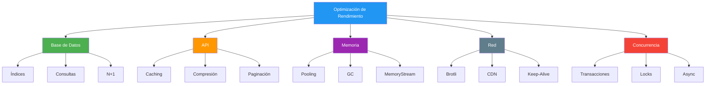
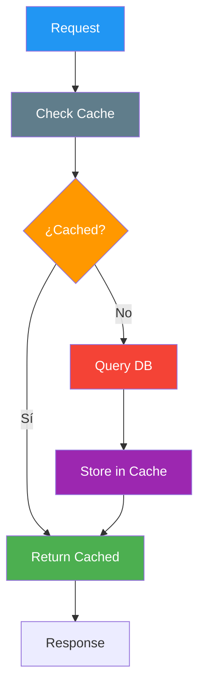

- [23. Optimización de Servicios Web](#23-optimización-de-servicios-web)
  - [23.1. Conceptos Fundamentales](#231-conceptos-fundamentales)
    - [23.1.1. Áreas de optimización](#2311-áreas-de-optimización)
    - [23.1.2. Principios de optimización](#2312-principios-de-optimización)
  - [23.2. Optimización de Consultas a BD](#232-optimización-de-consultas-a-bd)
    - [23.2.1. Selects optimizados](#2321-selects-optimizados)
    - [23.2.2. Include eficiente](#2322-include-eficiente)
    - [23.2.3. Índices en EF Core](#2323-índices-en-ef-core)
    - [23.2.4. Split Queries](#2324-split-queries)
    - [23.2.5. Paginación](#2325-paginación)
  - [23.3. Caching](#233-caching)
    - [23.3.1. Memory Cache](#2331-memory-cache)
    - [23.3.2. Distributed Cache con Redis](#2332-distributed-cache-con-redis)
    - [23.3.3. Cache-Aside Pattern](#2333-cache-aside-pattern)
    - [23.3.4. Response Caching](#2334-response-caching)
    - [23.3.5. Invalidación de caché](#2335-invalidación-de-caché)
  - [23.4. Optimización de API](#234-optimización-de-api)
    - [23.4.1. Compresión de respuestas](#2341-compresión-de-respuestas)
    - [23.4.2. Mínimo de peticiones HTTP](#2342-mínimo-de-peticiones-http)
    - [23.4.3. Query Tracking](#2343-query-tracking)
  - [23.5. Rate Limiting](#235-rate-limiting)
    - [23.5.1. Rate Limiting con ASP.NET Core](#2351-rate-limiting-con-aspnet-core)
    - [23.5.2. Token Bucket Algorithm](#2352-token-bucket-algorithm)
  - [23.6. Monitoring y Profiling](#236-monitoring-y-profiling)
    - [23.6.1. Health Checks](#2361-health-checks)
    - [23.6.2. Application Metrics](#2362-application-metrics)
    - [23.6.3. Performance Profiling](#2363-performance-profiling)
  - [23.7. Resiliencia con Polly](#237-resiliencia-con-polly)
  - [23.8. Buenas Prácticas](#238-buenas-prácticas)
  - [23.9. Testing de Rendimiento](#239-testing-de-rendimiento)
  - [23.10. Reto: Optimiza tu FunkoApp](#2310-reto-optimiza-tu-funkoapp)


# 23. Optimización de Servicios Web

> 💡 **Punto de partida:** ¿Alguna vez has esperado más de 3 segundos a que una web cargue y has pulsado "Atrás"? Según Google, si una página tarda más de 3 segundos en cargar, el 53% de los usuarios la abandonan. La optimización no es un lujo: es una necesidad para cualquier API que quiera ser usada por millones de personas.

En este punto aprenderás a optimizar APIs en ASP.NET Core: desde la consulta a la base de datos hasta la compresión de respuestas, pasando por caché, rate limiting y monitorización. Todo lo que necesitas para que tu API sea rápida, eficiente y escalable.

**Objetivos de aprendizaje:**

- Comprender los fundamentos de la optimización de rendimiento
- Optimizar consultas a base de datos con EF Core
- Implementar caché en memoria y distribuido con Redis
- Configurar compresión de respuestas y paginación
- Aplicar rate limiting para proteger la API
- Monitorizar el rendimiento con health checks y métricas

## 23.1. Conceptos Fundamentales

La **optimización de rendimiento** es el proceso de mejorar la velocidad, eficiencia y escalabilidad de una aplicación. En APIs de alto tráfico, cada milisegundo cuenta. Una optimización bien aplicada puede reducir el tiempo de respuesta de 500ms a 50ms, mejorando la experiencia de usuario y reduciendo costes de infraestructura.

> 💡 **Analogía:** Optimizar una API es como afinar un coche de carreras. Cada pequeña mejora (neumáticos, aerodinámica, motor) se suma para obtener un mejor tiempo en la pista. No hay una sola solución mágica, son muchas pequeñas optimizaciones.

### 23.1.1. Áreas de optimización



📌 **Ejemplo real:** Netflix optimiza cada capa de su API. Usa Redis para caché de perfiles, compresión Brotli para respuestas JSON, y paginación para listados de series. Cada capa contribuye a que tu feed cargue en menos de 200ms.

### 23.1.2. Principios de optimización

| Principio | Descripción |
|-----------|-------------|
| **Medir antes de optimizar** | No optimices ciegamente, mide primero con profiling |
| **Regla 80/20** | El 80% del tiempo se pasa en el 20% del código |
| **Caching is king** | El caché es la optimización más efectiva |
| **Lazy loading** | Carga recursos solo cuando se necesitan |
| **Batch operations** | Agrupa operaciones para reducir overhead de red |

> ⚠️ **Advertencia:** No optimices prematuramente. Primero haz que funcione correctamente, luego mide dónde está el cuello de botella, y solo optimiza lo que realmente sea lento.

## 23.2. Optimización de Consultas a BD

Las consultas a la base de datos suelen ser el cuello de botella más común en APIs. Optimizarlas puede reducir tiempos de respuesta de segundos a milisegundos.

📌 **Ejemplo real:** Amazon optimiza sus consultas usando índices compuestos y proyecciones selectivas. Cuando buscas un producto, no carga todas las columnas de la tabla: solo las que necesita para mostrar la lista.

### 23.2.1. Selects optimizados

Cargar todas las columnas de una tabla es un error muy común. Usa proyecciones `Select` para traer solo lo que necesitas.

```csharp
// ❌ MALO: Carga todas las propiedades de la tabla
var producto = await context.Productos.FindAsync(id);

// ✅ BUENO: Solo las propiedades necesarias
var producto = await context.Productos
    .AsNoTracking()
    .Where(p => p.Id == id)
    .Select(p => new ProductoDto
    {
        Id = p.Id,
        Nombre = p.Nombre,
        Precio = p.Precio
    })
    .FirstOrDefaultAsync();
```

📌 **Ejemplo real:** Instagram usa proyecciones selectivas al cargar el feed. No trae el contenido completo de cada post, solo los metadatos necesarios para la lista. El contenido completo se carga bajo demanda.

### 23.2.2. Include eficiente

El uso indiscriminado de `Include` causa el problema N+1 o explosión cartesiana. Usa `Include` solo cuando sea necesario y combina con `Select`.

```csharp
// ❌ MALO: Include todo sin control
var productos = await context.Productos
    .Include(p => p.Categoria)
    .Include(p => p.Reviews)
    .Include(p => p.Imagenes)
    .ToListAsync();

// ✅ BUENO: Include solo lo necesario con ThenInclude
var productos = await context.Productos
    .Include(p => p.Categoria)
        .ThenInclude(c => c.Productos)
    .Where(p => p.Activo)
    .Select(p => new ProductoDto
    {
        Id = p.Id,
        Nombre = p.Nombre,
        Categoria = new CategoriaDto
        {
            Id = p.Categoria.Id,
            Nombre = p.Categoria.Nombre
        }
    })
    .ToListAsync();
```

### 23.2.3. Índices en EF Core

Los índices aceleran las búsquedas pero ralentizan las escrituras. Úsalos en columnas que se usan frecuentemente en `Where`, `OrderBy` o `Join`.

```csharp
protected override void OnModelCreating(ModelBuilder modelBuilder)
{
    modelBuilder.Entity<Producto>(entity =>
    {
        // Índice simple
        entity.HasIndex(p => p.Nombre);

        // Índice compuesto
        entity.HasIndex(p => new { p.CategoriaId, p.Activo });

        // Índice único
        entity.HasIndex(p => p.Sku).IsUnique();

        // Índice con filtro
        entity.HasIndex(p => p.Activo)
            .HasFilter("IsDeleted = 0");

        // Index covering (incluye columnas adicionales)
        entity.HasIndex(p => p.CategoriaId)
            .IncludeProperties(p => new { p.Nombre, p.Precio });
    });
}
```

> 💡 **Consejo:** Usa un índice compuesto en `(CategoriaId, Activo)` si frecuentemente filtras por categoría y solo muestras productos activos. Esto es mucho más rápido que dos índices separados.

### 23.2.4. Split Queries

Cuando usas múltiples `Include`, EF Core genera una sola consulta SQL que puede causar una explosión cartesiana. `AsSplitQuery` ejecuta consultas separadas para cada relación.

```csharp
// ❌ MALO: Query única con muchos includes (explosión cartesiana)
var productos = await context.Productos
    .Include(p => p.Reviews)
    .Include(p => p.Imagenes)
    .ToListAsync();

// ✅ BUENO: Split queries para evitar explosión cartesiana
var productos = await context.Productos
    .AsSplitQuery()
    .Include(p => p.Reviews)
    .Include(p => p.Imagenes)
    .ToListAsync();
```

### 23.2.5. Paginación

Nunca devuelvas todos los registros de una tabla. Usa paginación para dividir los resultados en bloques manejables.

```csharp
public async Task<PagedResult<ProductoDto>> GetProductosAsync(
    int page = 1,
    int pageSize = 20)
{
    var query = context.Productos
        .AsNoTracking()
        .Where(p => p.Activo)
        .OrderBy(p => p.Nombre);

    var total = await query.CountAsync();
    var items = await query
        .Skip((page - 1) * pageSize)
        .Take(pageSize)
        .Select(p => new ProductoDto
        {
            Id = p.Id,
            Nombre = p.Nombre,
            Precio = p.Precio
        })
        .ToListAsync();

    return new PagedResult<ProductoDto>(items, total, page, pageSize);
}
```

📌 **Ejemplo real:** Spotify pagina las canciones de una playlist. No carga las 10.000 canciones de golpe: muestra 50 y carga más conforme haces scroll. Esto reduce el tiempo de respuesta y el uso de memoria.

## 23.3. Caching

El caching es una de las optimizaciones más efectivas. Almacenar datos frecuentes en memoria rápida evita consultar la base de datos una y otra vez.

📌 **Ejemplo real:** Twitter usa Redis para cachear los timelines de los usuarios. Cuando abres la app, no consulta la base de datos: sirve datos cacheados que se actualizan en segundo plano.

### 23.3.1. Memory Cache

`IMemoryCache` almacena datos en la memoria del proceso. Es ideal para datos que no cambian frecuentemente y que son accesados muchas veces.

```csharp
builder.Services.AddMemoryCache();

public class ProductoService(
    IMemoryCache cache,
    AppDbContext context)
{
    private readonly TimeSpan _cacheDuration = TimeSpan.FromMinutes(10);

    public async Task<Producto?> GetByIdAsync(long id)
    {
        var cacheKey = $"producto:{id}";

        if (cache.TryGetValue(cacheKey, out Producto? producto))
        {
            return producto;
        }

        producto = await context.Productos.FindAsync(id);

        if (producto != null)
        {
            cache.Set(cacheKey, producto, _cacheDuration);
        }

        return producto;
    }

    public async Task InvalidateCacheAsync(long id)
    {
        var cacheKey = $"producto:{id}";
        cache.Remove(cacheKey);
    }
}
```

> ⚠️ **Advertencia:** `IMemoryCache` es por instancia de servidor. Si tienes múltiples instancias, cada una tiene su propio caché. Para datos compartidos, usa Redis.

### 23.3.2. Distributed Cache con Redis

Redis es un almacén de datos en memoria que funciona como caché distribuido. Todas las instancias de tu aplicación comparten el mismo caché.

```csharp
builder.Services.AddStackExchangeRedisCache(options =>
{
    options.Configuration =
        builder.Configuration.GetConnectionString("Redis")!;
    options.InstanceName = "FunkoApp:";
});

public class ProductoCacheService(
    IDistributedCache cache,
    IJsonSerializer serializer)
{
    public async Task<ProductoDto?> GetCachedAsync(long id)
    {
        var cacheKey = $"producto:{id}";
        var cached = await cache.GetStringAsync(cacheKey);

        if (cached != null)
        {
            return serializer.Deserialize<ProductoDto>(cached);
        }

        return null;
    }

    public async Task SetCacheAsync(ProductoDto producto)
    {
        var cacheKey = $"producto:{producto.Id}";
        var serialized = serializer.Serialize(producto);

        await cache.SetStringAsync(cacheKey, serialized, new DistributedCacheEntryOptions
        {
            AbsoluteExpirationRelativeToNow = TimeSpan.FromMinutes(10),
            SlidingExpiration = TimeSpan.FromMinutes(2)
        });
    }

    public async Task InvalidateAsync(long id)
    {
        var cacheKey = $"producto:{id}";
        await cache.RemoveAsync(cacheKey);
    }
}
```

### 23.3.3. Cache-Aside Pattern

El patrón Cache-Aside es el más común: primero consultar el caché, si no está, cargar de la base de datos y guardar en caché.



### 23.3.4. Response Caching

`ResponseCaching` almacena la respuesta HTTP completa en el servidor. El cliente recibe un header `Cache-Control` que le indica si puede usar una versión cacheada.

```csharp
builder.Services.AddResponseCaching();

var app = builder.Build();

app.UseResponseCaching();

app.MapGet("/api/productos", async (context) =>
{
    context.Response.GetTypedHeaders().CacheControl =
        new CacheControlHeaderValue
        {
            Public = true,
            MaxAge = TimeSpan.FromMinutes(5)
        };

    var productos = await context.Services
        .GetRequiredService<IProductoService>()
        .GetAllAsync();

    await context.Response.WriteAsJsonAsync(productos);
});
```

### 23.3.5. Invalidación de caché

El mayor reto del caching es mantener los datos actualizados. Cuando un dato cambia, debes invalidar la entrada de caché correspondiente.

```csharp
public class ProductoService(
    IMemoryCache cache,
    AppDbContext context)
{
    public async Task UpdateAsync(Producto producto)
    {
        context.Productos.Update(producto);
        await context.SaveChangesAsync();

        // Invalidar caché después de actualizar
        var cacheKey = $"producto:{producto.Id}";
        cache.Remove(cacheKey);

        // También invalidar la lista
        cache.Remove("productos:all");
    }
}
```

> 💡 **Consejo:** Para invalidación en cascada, cuando actualices un producto, invalida tanto el caché del individual como el de la lista. Así la próxima petición carga datos frescos.

## 23.4. Optimización de API

La optimización de la capa HTTP reduce el tamaño de las respuestas y el número de peticiones necesarias.

📌 **Ejemplo real:** Google comprime todas sus respuestas JSON con Brotli. Una respuesta de 100KB se reduce a ~25KB, mejorando los tiempos de carga en conexiones lentas.

### 23.4.1. Compresión de respuestas

La compresión reduce el tamaño de las respuestas HTTP, mejorando los tiempos de carga especialmente en conexiones lentas.

```csharp
builder.Services.AddResponseCompression(options =>
{
    options.EnableForHttps = true;
    options.MimeTypes = new[]
    {
        "application/json",
        "text/plain",
        "text/html",
        "text/css",
        "application/javascript"
    };

    options.Providers.Add<BrotliCompressionProvider>();
    options.Providers.Add<GzipCompressionProvider>();
});

builder.Services.Configure<BrotliCompressionProviderOptions>(options =>
{
    options.Level = CompressionLevel.Optimal;
});

builder.Services.Configure<GzipCompressionProviderOptions>(options =>
{
    options.Level = CompressionLevel.Fastest;
});

var app = builder.Build();

app.UseResponseCompression();
```

> 💡 **Consejo:** Brotli ofrece mejor compresión que Gzip, pero Gzip es más rápido. Usa Brotli para producción y Gzip como fallback para navegadores antiguos.

### 23.4.2. Mínimo de peticiones HTTP

Cada petición HTTP tiene overhead (conexión, headers, latencia). Reduce el número de peticiones agrupando datos.

```csharp
// ❌ MALO: Múltiples peticiones secuenciales
var productos = await httpClient.GetAsync("/api/productos");
var categorias = await httpClient.GetAsync("/api/categorias");
var carrito = await httpClient.GetAsync("/api/carrito");

// ✅ BUENO: Un solo endpoint con datos agrupados
var dashboard = await httpClient.GetAsync(
    "/api/dashboard?secciones=productos,categorias,carrito");
```

### 23.4.3. Query Tracking

EF Core rastrea por defecto todas las entidades que carga, lo cual consume memoria. Para operaciones de solo lectura, desactiva el tracking.

```csharp
// ❌ MALO: Tracking implícito (consume más memoria)
var productos = await context.Productos.ToListAsync();

// ✅ BUENO: No tracking para solo lectura
var productos = await context.Productos
    .AsNoTracking()
    .ToListAsync();

// ✅ BUENO: No tracking con resolución de identidad
var productos = await context.Productos
    .AsNoTrackingWithIdentityResolution()
    .ToListAsync();
```

📌 **Ejemplo real:** Un endpoint de listado de productos que recibe miles de peticiones por minuto no necesita rastrear cambios. `AsNoTracking` reduce el uso de memoria un 30-40% en estos casos.

## 23.5. Rate Limiting

El rate limiting protege tu API limitando el número de peticiones que un cliente puede hacer en un período de tiempo. Esto evita abusos y garantiza disponibilidad para todos.

📌 **Ejemplo real:** La API de GitHub limita a 5.000 peticiones por hora por usuario autenticado. Si superas el límite, devuelve 403 con headers que indican cuándo podrás hacer más peticiones.

### 23.5.1. Rate Limiting con ASP.NET Core

ASP.NET Core incluye rate limiting nativo. Puedes configurar diferentes políticas por endpoint o por usuario.

```csharp
builder.Services.AddRateLimiter(options =>
{
    options.AddPolicy("api", context =>
    {
        var ip = context.Connection.RemoteIpAddress?.ToString() ?? "unknown";
        return RateLimitPartition.GetFixedWindowLimiter(
            ip,
            partition => new FixedWindowRateLimiterOptions
            {
                PermitLimit = 100,
                Window = TimeSpan.FromMinutes(1),
                QueueProcessingOrder = QueueProcessingOrder.OldestFirst
            });
    });

    options.AddPolicy("premium", context =>
    {
        var userId = context.User.FindFirst("sub")?.Value ?? "anonymous";
        return RateLimitPartition.GetFixedWindowLimiter(
            userId,
            partition => new FixedWindowRateLimiterOptions
            {
                PermitLimit = 1000,
                Window = TimeSpan.FromMinutes(1)
            });
    });

    options.OnRejected = async (context, cancellationToken) =>
    {
        context.HttpContext.Response.StatusCode = 429;
        await context.HttpContext.Response.WriteAsJsonAsync(new
        {
            error = "Demasiadas peticiones. Intenta de nuevo más tarde.",
            retryAfter = context.Lease.TryGetMetadata(
                MetadataName.RetryAfter, out var retryAfter)
                ? retryAfter.TotalSeconds
                : (double?)null
        }, cancellationToken);
    };
});

var app = builder.Build();

app.UseRateLimiter();

app.MapGet("/api/productos",
    [EnableRateLimiting("api")]
async (IProductoService service) => { });
```

### 23.5.2. Token Bucket Algorithm

El algoritmo Token Bucket es una implementación popular de rate limiting. Cada cliente tiene un "cubo" de tokens que se rellena periódicamente. Cada petición consume un token.

```csharp
public class TokenBucketRateLimiter(
    int maxTokens,
    TimeSpan refillInterval)
{
    private readonly SemaphoreSlim _semaphore = new(maxTokens, maxTokens);
    private int _currentTokens = maxTokens;
    private DateTime _nextRefill = DateTime.UtcNow.Add(refillInterval);

    public async Task<bool> TryAcquireAsync()
    {
        await _semaphore.WaitAsync();
        try
        {
            RefillIfNeeded();
            if (_currentTokens > 0)
            {
                _currentTokens--;
                return true;
            }
            return false;
        }
        finally
        {
            _semaphore.Release();
        }
    }

    private void RefillIfNeeded()
    {
        var now = DateTime.UtcNow;
        if (now >= _nextRefill)
        {
            _currentTokens = maxTokens;
            _nextRefill = now.Add(refillInterval);
        }
    }
}
```

## 23.6. Monitoring y Profiling

No puedes optimizar lo que no mides. El monitoring te permite detectar problemas de rendimiento antes de que afecten a los usuarios.

📌 **Ejemplo real:** Netflix usa herramientas como Atlas para monitorizar miles de métricas en tiempo real. Si una API empieza a responder más lento, se dispara una alerta automáticamente.

### 23.6.1. Health Checks

Los health checks verifican que los componentes de tu aplicación funcionan correctamente. Son esenciales para orquestadores como Kubernetes.

```csharp
builder.Services.AddHealthChecks()
    .AddCheck("database", () =>
    {
        try
        {
            using var connection = new SqlConnection(
                builder.Configuration.GetConnectionString("Default")!);
            connection.Open();
            return HealthCheckResult.Healthy();
        }
        catch (Exception ex)
        {
            return HealthCheckResult.Unhealthy(ex.Message);
        }
    })
    .AddRedis(
        builder.Configuration.GetConnectionString("Redis")!,
        name: "redis",
        tags: ["cache"]);

app.MapHealthChecks("/health", new HealthCheckOptions
{
    ResponseWriter = async (context, report) =>
    {
        context.Response.ContentType = "application/json";
        var response = new
        {
            status = report.Status.ToString(),
            checks = report.Entries.Select(e => new
            {
                name = e.Key,
                status = e.Value.Status.ToString(),
                duration = e.Value.Duration.TotalMilliseconds
            })
        };
        await context.Response.WriteAsJsonAsync(response);
    }
});
```

### 23.6.2. Application Metrics

Las métricas personalizadas te permiten rastrear el comportamiento específico de tu aplicación.

```csharp
// Configurar métricas con Prometheus
builder.Services.AddOpenTelemetry()
    .WithMetrics(metrics =>
    {
        metrics.AddAspNetCoreInstrumentation();
        metrics.AddHttpClientInstrumentation();
        metrics.AddRuntimeInstrumentation();
        metrics.AddMeter("FunkoApp.Metrics");
    });

// Contador personalizado
var productoCounter = meter.CreateCounter<long>(
    "productos_consultados_total",
    description: "Total de consultas de productos");

[HttpGet("productos")]
public async Task<IActionResult> GetProductos()
{
    productoCounter.Add(1);
    // ...
}
```

### 23.6.3. Performance Profiling

MiniProfiler muestra en tiempo real las consultas SQL, el tiempo de ejecución y los problemas de rendimiento.

```csharp
builder.Services.AddMiniProfiler(options =>
{
    options.RouteBasePath = "/profiler";
    options.ShouldProfile = request =>
        request.HttpContext.Request.Query.ContainsKey("profile");
    options.ColorScheme = StackExchange.Profiling.ColorScheme.Auto;
});

app.UseMiniProfiler();

// Resultado visible en: /profiler/results
```

> 💡 **Consejo:** En desarrollo, añade `?profile=true` a tus peticiones para ver el profiling. En producción, solo actívalo para administradores.

## 23.7. Resiliencia con Polly

**Polly** es la librería estándar de .NET para manejar fallos transitorios y mejorar la resiliencia de llamadas a servicios externos. Proporciona patrones como Retry, Circuit Breaker, Timeout y Bulkhead que evitan que un servicio caído cascada a toda la aplicación.

> 📝 **Nota:** En microservicios, una llamada a un servicio que tarda 5 segundos puede bloquear un hilo del servidor. Polly gestiona estos fallos de forma automatica, reintentando, cortando circuitos o limitando tiempo de espera.

📌 Ejemplo real: **Netflix** usa Polly para gestionar las llamadas a sus miles de microservicios. Si un servicio de recomendaciones tarda demasiado, Polly corta el circuito y devuelve datos cacheados en su lugar, evitando que la app se cuelgue.

### Patrones principales de Polly

| Patron | Que hace | Cuando usarlo |
|--------|----------|---------------|
| **Retry** | Reintenta una operacion fallida N veces con backoff | Fallos transitorios (red, timeout) |
| **Circuit Breaker** | Corta llamadas a un servicio caido durante X tiempo | Servicio externo no disponible |
| **Timeout** | Limita el tiempo de espera de una operacion | Llamadas que pueden colgarse |
| **Bulkhead Isolation** | Aisla recursos por servicio | Evitar que un servicio agote todos los hilos |
| **Fallback** | Devuelve un valor por defecto cuando falla | Datos no criticos (cache, defaults) |

### Instalacion

```bash
dotnet add package Microsoft.Extensions.Http.Polly
dotnet add package Polly
```

### Retry Policy

Reintenta una operacion cuando falla por un fallo transitorio (timeout de red, servicio temporalmente no disponible):

```csharp
using Polly;
using Polly.CircuitBreaker;

// Configurar Retry con backoff exponencial
var retryPolicy = Policy
    .Handle<HttpRequestException>()
    .Or<TimeoutException>()
    .WaitAndRetryAsync(
        retryCount: 3,
        sleepDurationProvider: attempt => TimeSpan.FromSeconds(Math.Pow(2, attempt)),
        onRetry: (exception, delay, retryCount, context) =>
        {
            Log.Warning("Reintento {RetryCount} tras {Delay}s por {Exception}",
                retryCount, delay.TotalSeconds, exception.Message);
        });

// Uso
var resultado = await retryPolicy.ExecuteAsync(async () =>
{
    return await httpClient.GetAsync("https://api-externa.com/datos");
});
```

### Circuit Breaker

Corta las llamadas a un servicio cuando detecta fallos repetidos, evitando sobrecargar un servicio caido:

```csharp
var circuitBreaker = Policy
    .Handle<HttpRequestException>()
    .CircuitBreaker(
        exceptionsAllowedBeforeBreaking: 3,
        durationOfBreak: TimeSpan.FromSeconds(30),
        onBreak: (exception, duration) =>
        {
            Log.Warning("Circuit OPEN por {Duration}s: {Exception}",
                duration.TotalSeconds, exception.Message);
        },
        onReset: () => Log.Information("Circuit CLOSED"),
        onHalfOpen: () => Log.Information("Circuit HALF-OPEN"));

// Uso
var resultado = await circuitBreaker.ExecuteAsync(async () =>
{
    return await httpClient.GetAsync("https://api-externa.com/datos");
});
```

### Timeout

Limita el tiempo maximo de espera de una operacion:

```csharp
var timeoutPolicy = Policy
    .Timeout(TimeSpan.FromSeconds(5))
    .OnTimeout((context, delay, exception) =>
    {
        Log.Warning("Timeout tras {Delay}s: {Exception}",
            delay.TotalSeconds, exception.Message);
    });

// Uso
var resultado = await timeoutPolicy.ExecuteAsync(async () =>
{
    return await httpClient.GetAsync("https://api-externa.com/datos");
});
```

### Combinar politicas

```csharp
// Combinar: Retry + Circuit Breaker + Timeout
var resiliencePolicy = Policy
    .Handle<HttpRequestException>()
    .WaitAndRetryAsync(3, attempt => TimeSpan.FromSeconds(Math.Pow(2, attempt)))
    .Wrap(Policy
        .Handle<HttpRequestException>()
        .CircuitBreaker(3, TimeSpan.FromSeconds(30)))
    .Wrap(Policy.Timeout(TimeSpan.FromSeconds(10)));

// Uso con IHttpClientFactory
builder.Services.AddHttpClient("Externo")
    .AddPolicyHandler(resiliencePolicy);
```

### Resumen de patrones

| Patron | Configuracion | Ejemplo de uso |
|--------|---------------|----------------|
| **Retry** | 3 reintentos, backoff 2^n | Llamada a API externa |
| **Circuit Breaker** | 3 fallos, 30s pausa | Servicio de pagos |
| **Timeout** | 5 segundos max | Cualquier llamada de red |
| **Fallback** | Valor por defecto | Datos de cache |

> 💡 **Consejo:** Empieza con Retry + Timeout. Si tu API depende de servicios criticos (pagos, notificaciones), añade Circuit Breaker.

## 23.8. Buenas Prácticas

Aplica estas prácticas para mantener tu API optimizada:

- **Mide antes de optimizar:** Usa MiniProfiler o Application Insights para identificar cuellos de botella reales, no asumas dónde están
- **AsNoTracking para lecturas:** Cualquier consulta de solo lectura debe usar `AsNoTracking()` para reducir consumo de memoria
- **Paginación obligatoria:** Nunca devuelvas listados completos. Usa paginación con `Skip`/`Take` o cursor-based
- **Caching con invalidación:** Implementa caché pero siempre con una estrategia de invalidación clara
- **Compresión habilitada:** Activa Brotli/Gzip en producción. La reducción de tamaño puede ser del 60-80%
- **Rate limiting por defecto:** Protege todos los endpoints públicos con rate limiting
- **Health checks en todos los servicios:** Database, Redis, APIs externas: todo debe tener health check
- **Índices en columnas de filtro:** Revisa las consultas más frecuentes y añade índices compuestos
- **Parallel execution:** Usa `Task.WhenAll` para ejecutar operaciones independientes en paralelo
- **Transacciones cortas:** Mantén las transacciones de base de datos lo más breves posible

## 23.8. Testing de Rendimiento

Optimizar sin testear es como correr sin medir tiempos. Necesitas verificar que tus optimizaciones realmente mejoran el rendimiento.

```csharp
[TestFixture]
public class ProductoPerformanceTests
{
    private AppDbContext _context = null!;

    [SetUp]
    public void SetUp()
    {
        var options = new DbContextOptionsBuilder<AppDbContext>()
            .UseInMemoryDatabase(databaseName: Guid.NewGuid().ToString())
            .Options;
        _context = new AppDbContext(options);
    }

    [Test]
    public async Task GetProductos_AsNoTracking_RetornaMasRapido()
    {
        // Arrange
        await SeedProductos(1000);

        // Act - Con tracking
        var sw = Stopwatch.StartNew();
        var conTracking = await _context.Productos.ToListAsync();
        var tiempoConTracking = sw.ElapsedMilliseconds;

        // Act - Sin tracking
        sw.Restart();
        var sinTracking = await _context.Productos
            .AsNoTracking()
            .ToListAsync();
        var tiempoSinTracking = sw.ElapsedMilliseconds;

        // Assert
        sinTracking.Should().HaveCount(1000);
        tiempoSinTracking.Should().BeLessThan(tiempoConTracking);
    }

    [Test]
    public async Task GetProductos_Paginacion_RetornaSoloPagina()
    {
        // Arrange
        await SeedProductos(100);

        // Act
        var resultado = await _context.Productos
            .AsNoTracking()
            .OrderBy(p => p.Nombre)
            .Skip(0)
            .Take(10)
            .ToListAsync();

        // Assert
        resultado.Should().HaveCount(10);
    }

    private async Task SeedProductos(int cantidad)
    {
        var productos = Enumerable.Range(1, cantidad)
            .Select(i => new Producto
            {
                Id = i,
                Nombre = $"Producto {i}",
                Precio = i * 1.5m,
                Activo = true
            })
            .ToList();

        _context.Productos.AddRange(productos);
        await _context.SaveChangesAsync();
    }
}
```

> 💡 **Consejo:** Usa `BenchmarkDotNet` para benchmarks precisos. Los tests de rendimiento con `Stopwatch` son útiles para comparaciones rápidas, pero BenchmarkDotNet genera estadísticas completas.

## 23.9. Reto: Optimiza tu FunkoApp

> Antes de irte, aplica las optimizaciones a tu FunkoApp. No todo a la vez: prioriza según el impacto.

### Contexto

Tu FunkoApp tiene una API de productos que recibe cada vez más tráfico. Necesitas optimizarla para que responda rápidamente incluso con miles de productos y cientos de peticiones concurrentes.

### Modelo de datos

Un Funko tiene estas propiedades:

| Propiedad | Tipo | Obligatorio |
|-----------|------|:-----------:|
| `id` | long | Si (autogenerado) |
| `nombre` | string | Si |
| `precio` | decimal | Si |
| `categoria` | string | Si |
| `imagen` | string | No |
| `creadoEn` | DateTime | Si (autogenerado) |

### Tareas de optimización

**Fase 1: Optimización de consultas (impacto alto)**
- Añade índices en `nombre` y `categoria`
- Implementa paginación en el listado de productos
- Usa `AsNoTracking()` en todas las consultas de lectura
- Crea proyecciones `Select` con DTOs en lugar de devolver entidades completas

**Fase 2: Caching (impacto muy alto)**
- Implementa `IMemoryCache` para productos individuales
- Configura Redis para caché distribuido
- Implementa invalidación de caché al actualizar/eliminar productos
- Añade Response Caching al endpoint de listado

**Fase 3: Compresión y Rate Limiting (impacto medio)**
- Configura Brotli + Gzip para compresión de respuestas
- Implementa rate limiting: 100 peticiones/min por IP para lectura, 20/min para escritura
- Configura respuesta 429 con mensaje claro

**Fase 4: Monitoring (impacto bajo, pero necesario)**
- Añade health check para la base de datos
- Añade health check para Redis
- Configura métricas básicas de peticiones

### Criterios de evaluación

| Criterio | Puntos |
|----------|--------|
| Índices correctamente definidos | 2 |
| Paginación implementada | 2 |
| AsNoTracking en lecturas | 1 |
| Caching con invalidación | 2 |
| Compresión configurada | 1 |
| Rate limiting funcional | 1 |
| Health checks | 1 |

**Resumen del punto:**

| Área | Técnica | Impacto |
|------|---------|---------|
| **Base de Datos** | Índices | Alto |
| **Base de Datos** | AsNoTracking | Medio |
| **Base de Datos** | Paginación | Alto |
| **Base de Datos** | Select/Proyección | Alto |
| **Caching** | Memory Cache | Alto |
| **Caching** | Redis | Muy Alto |
| **Caching** | Invalidación | Crítico |
| **API** | Compresión Brotli/Gzip | Medio |
| **API** | Mínimo de peticiones | Alto |
| **Rate Limiting** | Fixed Window | Medio |
| **Monitoring** | Health Checks | Bajo |
| **Monitoring** | Métricas | Medio |

**¿Qué viene después?**

En el siguiente punto veremos **Seguridad en APIs**: autenticación JWT, autorización, CORS y protección contra ataques comunes. Las optimizaciones que hemos visto serán la base sobre la que construiremos una API no solo rápida, sino también segura.
