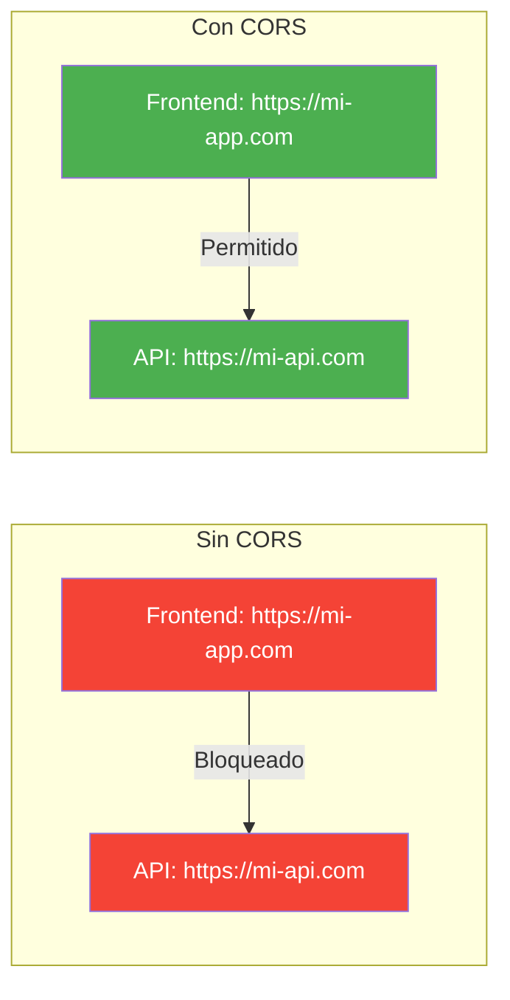

- [24. Documentacion con Swagger/OpenAPI](#24-documentacion-con-swaggeropenapi)
  - [24.1. CORS (Cross-Origin Resource Sharing)](#241-cors-cross-origin-resource-sharing)
    - [24.1.1. Que es CORS](#2411-que-es-cors)
    - [24.1.2. Configuracion de CORS en ASP.NET Core](#2412-configuracion-de-cors-en-aspnet-core)
  - [24.2. Swagger y OpenAPI](#242-swagger-y-openapi)
    - [24.2.1. Que es OpenAPI](#2421-que-es-openapi)
    - [24.2.2. Que es Swagger](#2422-que-es-swagger)
    - [24.2.3. Configuracion basica](#2423-configuracion-basica)
    - [24.2.4. Configuracion avanzada](#2424-configuracion-avanzada)
  - [24.3. Documentar Endpoints](#243-documentar-endpoints)
    - [24.3.1. Atributos de documentacion](#2431-atributos-de-documentacion)
    - [24.3.2. Ejemplo completo de endpoint documentado](#2432-ejemplo-completo-de-endpoint-documentado)
  - [24.4. Documentar Modelos y DTOs](#244-documentar-modelos-y-dtos)
  - [24.5. Documentar Autenticacion JWT](#245-documentar-autenticacion-jwt)
  - [24.6. Documentar Respuestas de Error](#246-documentar-respuestas-de-error)
  - [24.7. Versionado de API](#247-versionado-de-api)
  - [24.8. Ejemplos de Solicitudes](#248-ejemplos-de-solicitudes)
  - [24.9. Filtros Personalizados](#249-filtros-personalizados)
  - [24.10. Buenas Practicas](#2410-buenas-practicas)
  - [24.11. Reto: Documenta la API de FunkoApp](#2411-reto-documenta-la-api-de-funkoapp)

---

# 24. Documentacion con Swagger/OpenAPI

> **Punto de partida:** Cuando usas la API de Stripe para cobrar en tu tienda online, necesitas saber qué endpoints existen, qué datos envías y qué respuestas recibes. Stripe提供了文档 interactiva donde puedes probar cada endpoint en vivo. Eso es lo que Swagger/OpenAPI hace por tu API: documentación automática, interactiva y siempre actualizada.

En este punto aprenderás a configurar CORS, integrar Swagger/OpenAPI en ASP.NET Core, documentar endpoints, modelos, autenticación y errores, versionar tu API y usar filtros personalizados.

**Objetivos de aprendizaje:**
- Configurar CORS para permitir solicitudes cross-origin
- Integrar Swagger/OpenAPI en una aplicación ASP.NET Core
- Documentar endpoints, modelos y respuestas de error
- Configurar autenticación JWT en Swagger
- Implementar versionado de API
- Usar filtros personalizados para personalizar la documentación

## 24.1. CORS (Cross-Origin Resource Sharing)

### 24.1.1. Que es CORS

**CORS** es un mecanismo de seguridad de los navegadores que controla las solicitudes HTTP entre diferentes dominios. Sin CORS, los navegadores bloquean solicitudes a dominios diferentes por defecto.



📌 **Ejemplo real:** Cuando un frontend React en `localhost:3000` quiere consumir tu API en `localhost:5001`, el navegador bloquea la solicitud si no configuras CORS. Es como un portero que solo deja entrar a personas con autorización.

> 📝 **Nota:** CORS solo afecta a solicitudes desde navegadores. Aplicaciones servidor a servidor no están afectadas por CORS.

### 24.1.2. Configuracion de CORS en ASP.NET Core

**Politica permisiva (solo desarrollo):**

```csharp
// ❌ MALO: Usar AllowAll en produccion
builder.Services.AddCors(options =>
{
    options.AddPolicy("AllowAll", policy =>
    {
        policy.AllowAnyOrigin()
              .AllowAnyMethod()
              .AllowAnyHeader();
    });
});
```

```csharp
// ✅ BUENO: Politica restrictiva para produccion
builder.Services.AddCors(options =>
{
    options.AddPolicy("Production", policy =>
    {
        policy.WithOrigins(
                "https://mi-frontend.com",
                "https://admin.mi-frontend.com"
            )
            .WithMethods("GET", "POST", "PUT", "DELETE")
            .WithHeaders("Content-Type", "Authorization")
            .AllowCredentials();
    });
});
```

```csharp
// Uso en Program.cs
app.UseCors("Production");
app.UseAuthentication();
app.UseAuthorization();
app.MapControllers();
```

> ⚠️ **Advertencia:** Nunca uses "AllowAll" en producción. Esto permite que cualquier dominio acceda a tu API, lo cual es un riesgo de seguridad.

## 24.2. Swagger y OpenAPI

### 24.2.1. Que es OpenAPI

**OpenAPI** es una especificación estándar para describir APIs REST en formato JSON/YAML. Define la estructura de tu API de forma que pueda ser consumida por herramientas automatizadas.

📌 **Ejemplo real:** La API de Twitter/X sigue OpenAPI. Cuando usas herramientas como Postman para explorar la API de Twitter, estás consumindo la especificación OpenAPI que ellos publican.

| Beneficio | Descripcion |
|-----------|-------------|
| **Documentacion estandarizada** | Machine-readable y auto-descriptiva |
| **Generacion automatica de SDKs** | Clientes en multiples lenguajes |
| **Pruebas interactivas** | Testing desde la propia documentacion |

### 24.2.2. Que es Swagger

**Swagger** es un conjunto de herramientas que implementa la especificacion OpenAPI:

| Herramienta | Descripcion |
|-------------|-------------|
| **Swagger UI** | Interfaz web interactiva para explorar y probar la API |
| **Swagger Editor** | Editor en linea para crear especificaciones OpenAPI |
| **Swagger Codegen** | Genera codigo cliente y servidor desde la especificacion |

### 24.2.3. Configuracion basica

```bash
dotnet add package Swashbuckle.AspNetCore
dotnet add package Swashbuckle.AspNetCore.Annotations
```

```csharp
var builder = WebApplication.CreateBuilder(args);

builder.Services.AddControllers();
builder.Services.AddEndpointsApiExplorer();
builder.Services.AddSwaggerGen();

var app = builder.Build();

// Habilitar Swagger solo en desarrollo
if (app.Environment.IsDevelopment())
{
    app.UseSwagger();
    app.UseSwaggerUI();
}

app.UseHttpsRedirection();
app.UseAuthorization();
app.MapControllers();
app.Run();
```

Acceder a Swagger UI: `https://localhost:5001/swagger/index.html`

### 24.2.4. Configuracion avanzada

```csharp
using Microsoft.OpenApi.Models;

builder.Services.AddSwaggerGen(options =>
{
    options.SwaggerDoc("v1", new OpenApiInfo
    {
        Version = "v1.0.0",
        Title = "FunkoApp API",
        Description = "API REST para gestion de Funkos",
        Contact = new OpenApiContact
        {
            Name = "Jose Luis Gonzalez",
            Email = "jose@example.com"
        }
    });

    // Incluir comentarios XML
    var xmlFile = $"{Assembly.GetExecutingAssembly().GetName().Name}.xml";
    var xmlPath = Path.Combine(AppContext.BaseDirectory, xmlFile);
    options.IncludeXmlComments(xmlPath);

    options.EnableAnnotations();
});
```

Habilitar comentarios XML en `.csproj`:

```xml
<PropertyGroup>
  <GenerateDocumentationFile>true</GenerateDocumentationFile>
  <NoWarn>$(NoWarn);1591</NoWarn>
</PropertyGroup>
```

## 24.3. Documentar Endpoints

### 24.3.1. Atributos de documentacion

```csharp
[ApiController]
[Route("api/[controller]")]
[Produces("application/json")]
[SwaggerTag("Gestion de Funkos")]
public class FunkosController : ControllerBase
{
    /// <summary>
    /// Obtiene todos los funkos con paginacion
    /// </summary>
    /// <param name="pageNumber">Numero de pagina (default: 1)</param>
    /// <param name="pageSize">Tamano de pagina (default: 10)</param>
    /// <returns>Lista paginada de funkos</returns>
    /// <response code="200">Devuelve la lista de funkos</response>
    [HttpGet]
    [SwaggerOperation(
        Summary = "Obtener todos los funkos",
        Description = "Devuelve una lista paginada de funkos con filtros opcionales",
        OperationId = "GetAllFunkos",
        Tags = new[] { "Funkos" }
    )]
    [SwaggerResponse(200, "Lista de funkos obtenida correctamente", typeof(PageResponse<FunkoResponseDto>))]
    [SwaggerResponse(400, "Parametros invalidos")]
    public async Task<ActionResult<PageResponse<FunkoResponseDto>>> GetAll(
        [FromQuery, SwaggerParameter("Numero de pagina", Required = false)] int pageNumber = 1,
        [FromQuery, SwaggerParameter("Tamano de pagina", Required = false)] int pageSize = 10)
    {
        // ...
    }
```

### 24.3.2. Ejemplo completo de endpoint documentado

```csharp
/// <summary>
/// Actualiza un funko existente
/// </summary>
/// <param name="id">ID del funko a actualizar</param>
/// <param name="dto">Nuevos datos del funko</param>
/// <returns>Funko actualizado</returns>
[HttpPut("{id}")]
[Authorize(Roles = Roles.Admin)]
[SwaggerOperation(
    Summary = "Actualizar funko",
    Description = "Actualiza todos los campos de un funko. Solo administradores pueden ejecutar esta operacion",
    OperationId = "UpdateFunko"
)]
[SwaggerResponse(200, "Funko actualizado correctamente", typeof(FunkoResponseDto))]
[SwaggerResponse(400, "Datos invalidos o incompletos", typeof(ValidationProblemDetails))]
[SwaggerResponse(401, "Usuario no autenticado")]
[SwaggerResponse(404, "Funko no encontrado", typeof(ProblemDetails))]
public async Task<ActionResult<FunkoResponseDto>> Update(
    [FromRoute, SwaggerParameter("ID del funko", Required = true)] int id,
    [FromBody, SwaggerRequestBody("Datos actualizados del funko", Required = true)] UpdateFunkoDto dto)
{
    var result = await _service.UpdateAsync(id, dto);
    return result.Match<ActionResult<FunkoResponseDto>>(
        success => Ok(success),
        error => error switch
        {
            FunkoError.NotFound => NotFound(new ProblemDetails { Detail = error.Message }),
            FunkoError.InvalidData => BadRequest(new ValidationProblemDetails()),
            _ => StatusCode(500)
        }
    );
}
```

📌 **Ejemplo real:** Netflix documenta cada endpoint de su API interna con atributos similares. Cuando un desarrollador necesita consumir un servicio, abre Swagger y ve exactamente qué datos enviar y qué respuestas esperar.

## 24.4. Documentar Modelos y DTOs

```csharp
using System.ComponentModel.DataAnnotations;
using Swashbuckle.AspNetCore.Annotations;

/// <summary>
/// DTO para crear un funko
/// </summary>
[SwaggerSchema(Description = "Datos necesarios para crear un funko")]
public record CreateFunkoDto
{
    /// <summary>
    /// Nombre del funko
    /// </summary>
    /// <example>Iron Man</example>
    [Required(ErrorMessage = "El nombre es obligatorio")]
    [StringLength(100, MinimumLength = 3, ErrorMessage = "El nombre debe tener entre 3 y 100 caracteres")]
    [SwaggerSchema(Description = "Nombre del funko", Nullable = false)]
    public string Nombre { get; init; } = string.Empty;

    /// <summary>
    /// Precio del funko en euros
    /// </summary>
    /// <example>29.99</example>
    [Required(ErrorMessage = "El precio es obligatorio")]
    [Range(0.01, 9999.99, ErrorMessage = "El precio debe estar entre 0.01 y 9999.99")]
    [SwaggerSchema(Description = "Precio del funko en euros", Format = "decimal", Nullable = false)]
    public decimal Precio { get; init; }

    /// <summary>
    /// Categoria del funko
    /// </summary>
    /// <example>Marvel</example>
    [Required(ErrorMessage = "La categoria es obligatoria")]
    [SwaggerSchema(Description = "Categoria a la que pertenece el funko", Nullable = false)]
    public string Categoria { get; init; } = string.Empty;

    /// <summary>
    /// URL de la imagen del funko
    /// </summary>
    /// <example>https://example.com/images/ironman.jpg</example>
    [Url(ErrorMessage = "La imagen debe ser una URL valida")]
    [SwaggerSchema(Description = "URL de la imagen del funko", Format = "uri", Nullable = true)]
    public string? Imagen { get; init; }
}
```

> 💡 **Consejo:** Usa el tag `<example>` para mostrar valores de ejemplo en Swagger. Esto ayuda mucho a los desarrolladores que consumen tu API.

## 24.5. Documentar Autenticacion JWT

```csharp
builder.Services.AddSwaggerGen(options =>
{
    // Definir esquema de seguridad JWT
    options.AddSecurityDefinition("Bearer", new OpenApiSecurityScheme
    {
        Name = "Authorization",
        Type = SecuritySchemeType.Http,
        Scheme = "Bearer",
        BearerFormat = "JWT",
        In = ParameterLocation.Header,
        Description = "Ingrese 'Bearer' seguido de un espacio y el token JWT."
    });

    // Aplicar esquema de seguridad globalmente
    options.AddSecurityRequirement(new OpenApiSecurityRequirement
    {
        {
            new OpenApiSecurityScheme
            {
                Reference = new OpenApiReference
                {
                    Type = ReferenceType.SecurityScheme,
                    Id = "Bearer"
                }
            },
            Array.Empty<string>()
        }
    });
});
```

📌 **Ejemplo real:** La API de Spotify usa OAuth2 con un flujo similar. Cuando pruebas endpoints protegidos en su documentación, haces clic en "Authorize", introduces tu token y puedes probar endpoints que requieren autenticación.

Pasos para usar autenticación en Swagger UI:
1. Hacer clic en "Authorize" (botón con candado)
2. Ingresar token: `Bearer eyJhbGciOiJIUzI1NiIs...`
3. Probar endpoints protegidos

## 24.6. Documentar Respuestas de Error

```csharp
/// <summary>
/// Modelo de error estandar
/// </summary>
public class ApiError
{
    /// <example>404</example>
    public int Status { get; set; }

    /// <example>Recurso no encontrado</example>
    public string Title { get; set; } = string.Empty;

    /// <example>El funko con ID 999 no existe</example>
    public string Detail { get; set; } = string.Empty;

    /// <example>2024-01-20T10:30:00Z</example>
    public DateTime Timestamp { get; set; } = DateTime.UtcNow;
}
```

```csharp
[HttpGet("{id}")]
[SwaggerOperation(Summary = "Obtener funko por ID")]
[SwaggerResponse(200, "Funko encontrado", typeof(FunkoResponseDto))]
[SwaggerResponse(404, "Funko no encontrado", typeof(ApiError))]
[SwaggerResponse(500, "Error interno del servidor", typeof(ApiError))]
public async Task<ActionResult<FunkoResponseDto>> GetById(int id)
{
    var funko = await _service.GetByIdAsync(id);
    if (funko is null)
    {
        return NotFound(new ApiError
        {
            Status = 404,
            Title = "Funko no encontrado",
            Detail = $"No existe un funko con ID {id}"
        });
    }
    return Ok(funko);
}
```

## 24.7. Versionado de API

```csharp
builder.Services.AddApiVersioning(options =>
{
    options.AssumeDefaultVersionWhenUnspecified = true;
    options.DefaultApiVersion = new ApiVersion(1, 0);
    options.ReportApiVersions = true;
});

builder.Services.AddVersionedApiExplorer(options =>
{
    options.GroupNameFormat = "'v'VVV";
    options.SubstituteApiVersionInUrl = true;
});

builder.Services.AddSwaggerGen(options =>
{
    options.SwaggerDoc("v1", new OpenApiInfo { Title = "FunkoApp API", Version = "v1" });
    options.SwaggerDoc("v2", new OpenApiInfo { Title = "FunkoApp API", Version = "v2" });
});
```

```csharp
[ApiController]
[ApiVersion("1.0")]
[Route("api/v{version:apiVersion}/[controller]")]
public class FunkosV1Controller : ControllerBase
{
    // Endpoints V1 - Version original
}

[ApiController]
[ApiVersion("2.0")]
[Route("api/v{version:apiVersion}/[controller]")]
public class FunkosV2Controller : ControllerBase
{
    // Endpoints V2 - Nueva version con cambios
}
```

📌 **Ejemplo real:** La API de GitHub usa versionado en la URL (`/api/v3/`). Cuando lanzan cambios breaking, crean una nueva versión sin romper las aplicaciones existentes.

## 24.8. Ejemplos de Solicitudes

```csharp
[HttpPost]
[SwaggerOperation(
    Summary = "Crear funko",
    Description = "Crea un nuevo funko con los datos proporcionados"
)]
[SwaggerRequestExample(typeof(CreateFunkoDto), typeof(CreateFunkoExample))]
public async Task<ActionResult<FunkoResponseDto>> Create(CreateFunkoDto dto)
{
    // ...
}

public class CreateFunkoExample : IExamplesProvider<CreateFunkoDto>
{
    public CreateFunkoDto GetExamples()
    {
        return new CreateFunkoDto
        {
            Nombre = "Iron Man Mark 50",
            Precio = 34.99m,
            Categoria = "Marvel",
            Imagen = "https://example.com/images/ironman-mk50.jpg"
        };
    }
}
```

## 24.9. Filtros Personalizados

Los filtros permiten personalizar la documentación que genera Swagger automáticamente.

```csharp
public class SwaggerExamplesFilter : IOperationFilter
{
    public void Apply(OpenApiOperation operation, OperationFilterContext context)
    {
        if (operation.RequestBody?.Content != null)
        {
            foreach (var content in operation.RequestBody.Content)
            {
                if (content.Key == "application/json")
                {
                    content.Value.Example = new OpenApiString(@"{
                        ""nombre"": ""Batman"",
                        ""precio"": 29.99,
                        ""categoria"": ""DC"",
                        ""imagen"": ""https://example.com/batman.jpg""
                    }");
                }
            }
        }
    }
}

// Registrar filtro
builder.Services.AddSwaggerGen(options =>
{
    options.OperationFilter<SwaggerExamplesFilter>();
});
```

## 24.10. Buenas Practicas

| Practica | Descripcion |
|----------|-------------|
| **Documentar todos los endpoints** | Incluye resumenes y descripciones claras |
| **Documentar parametros** | Explica que espera cada parametro y su formato |
| **Documentar respuestas** | Incluye todos los codigos HTTP posibles |
| **Ejemplos claros** | Proporciona ejemplos realistas con valores de ejemplo |
| **Modelos documentados** | Documenta todos los DTOs con descripciones y ejemplos |
| **Versionado** | Versiona tu API desde el inicio para evitar breaking changes |
| **Autenticacion** | Documenta como autenticarse e incluye el esquema JWT |
| **Errores** | Documenta todos los posibles errores que puede retornar la API |
| **CORS restrictivo** | En produccion, permite solo origenes conocidos |
| **Documentacion viva** | Debe mantenerse actualizada con el codigo |

> ⚠️ **Advertencia:** La documentacion desactualizada es peor que ninguna documentacion. Manten siempre sincronizada la documentacion con el codigo.

**Resumen del punto:**

| Concepto | Descripcion |
|----------|-------------|
| **CORS** | Controla el acceso cross-domain entre navegadores y APIs |
| **Swagger/OpenAPI** | Genera documentacion interactiva automaticamente |
| **Swashbuckle** | Integra Swagger en ASP.NET Core |
| **Atributos de documentacion** | Enriquecen la documentacion con descripciones |
| **JWT en Swagger** | Permite probar endpoints protegidos desde la UI |
| **Versionado de API** | Permite evolucionar sin romper clientes existentes |
| **Filtros personalizados** | Permiten customizar la documentacion generada |

**¿Qué viene después?**

En el siguiente punto veremos **Configuracion de Entornos**: cómo manejar diferentes configuraciones para desarrollo y producción, variables de entorno, User Secrets y Azure App Configuration.

## 24.11. Reto: Documenta la API de FunkoApp

> Antes de irte, documenta completamente la API de Funkos. No escribas codigo: diseña la documentacion.

### Contexto

Vas a documentar una API REST para gestionar una **coleccion de Funkos** con Swagger/OpenAPI.

### Modelo de datos

| Propiedad | Tipo | Obligatorio |
|-----------|------|:-----------:|
| `id` | long | Si (autogenerado) |
| `nombre` | string | Si |
| `precio` | decimal | Si |
| `categoria` | string | Si |
| `imagen` | string | No |
| `creadoEn` | DateTime | Si (autogenerado) |

### Ejercicio

1. Configura Swagger con informacion completa de la API
2. Documenta todos los endpoints con `[SwaggerOperation]`
3. Documenta el `CreateFunkoDto` con atributos de validacion y ejemplos
4. Configura el esquema de seguridad JWT en Swagger
5. Documenta las respuestas de error con `ApiError`
6. Configura CORS con politica restrictiva

> 💡 **Consejo:** Usa comentarios XML en todos los modelos y endpoints. Los comentarios XML se convierten automaticamente en la documentacion de Swagger.
