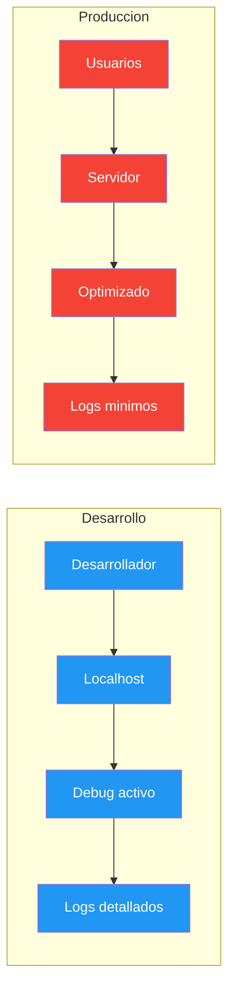
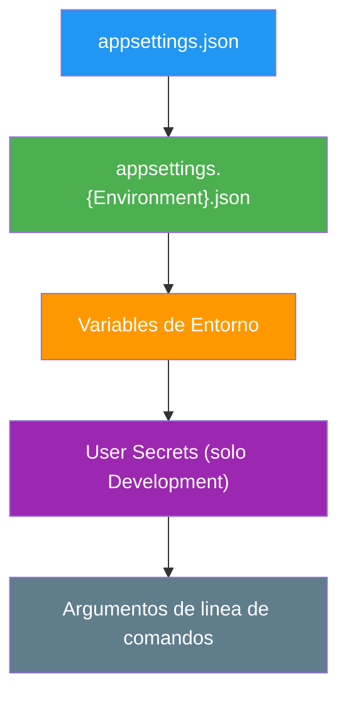

- [25. Configuracion de Entornos](#25-configuracion-de-entornos)
  - [25.1. Que son los Entornos](#251-que-son-los-entornos)
    - [25.1.1. Entornos predefinidos](#2511-entornos-predefinidos)
    - [25.1.2. Prioridad de configuracion](#2512-prioridad-de-configuracion)
  - [25.2. Configuracion por Entorno](#252-configuracion-por-entorno)
    - [25.2.1. Estructura de archivos](#2521-estructura-de-archivos)
    - [25.2.2. Configuracion base](#2522-configuracion-base)
    - [25.2.3. Configuracion de desarrollo](#2523-configuracion-de-desarrollo)
    - [25.2.4. Configuracion de produccion](#2524-configuracion-de-produccion)
  - [25.3. Configuracion de Base de Datos por Entorno](#253-configuracion-de-base-de-datos-por-entorno)
  - [25.4. Variables de Entorno](#254-variables-de-entorno)
  - [25.5. Uso de IWebHostEnvironment](#255-uso-de-iwebhostenvironment)
  - [25.6. Configuracion de Swagger por Entorno](#256-configuracion-de-swagger-por-entorno)
  - [25.7. Configuracion de Logging por Entorno](#257-configuracion-de-logging-por-entorno)
  - [25.8. Secretos de Usuario (User Secrets)](#258-secretos-de-usuario-user-secrets)
  - [25.9. Configuracion Avanzada](#259-configuracion-avanzada)
  - [25.10. Azure App Configuration](#2510-azure-app-configuration)
  - [25.11. Buenas Practicas](#2511-buenas-practicas)
  - [25.12. Reto: Configura Entornos para FunkoApp](#2512-reto-configura-entornos-para-funkoapp)

---

# 25. Configuracion de Entornos

> **Punto de partida:** Cuando abres Instagram en tu móvil, la app se conecta a un servidor de desarrollo para probar funcionalidades nuevas. Cuando la version final sale a producción, usa configuración diferente: base de datos real, logs mínimos y seguridad estricta. Eso es lo que hacen los entornos: permitir que la misma aplicación se comporte de forma diferente según dónde se ejecute.

En este punto aprenderás a configurar diferentes entornos en ASP.NET Core, usar variables de entorno, User Secrets y manejar configuración específica por entorno.

**Objetivos de aprendizaje:**
- Comprender el sistema de entornos de ASP.NET Core
- Configurar appsettings.json por entorno
- Usar variables de entorno y User Secrets
- Configurar IWebHostEnvironment para comportamiento condicional
- Gestionar secretos de forma segura

## 25.1. Que son los Entornos

Los **entornos** (environments) en ASP.NET Core permiten configurar la aplicación de manera diferente según dónde se ejecute. Esto es esencial para mantener la seguridad en producción mientras se facilita el desarrollo.



📌 **Ejemplo real:** Cuando usas Netflix, la aplicación en tu móvil (producción) se conecta a servidores optimizados. Pero los desarrolladores de Netflix prueban nuevas funcionalidades en su propio entorno de desarrollo con datos ficticios.

### 25.1.1. Entornos predefinidos

ASP.NET Core tiene tres entornos predefinidos:

| Entorno | Descripcion | Uso Tipico |
|---------|-------------|------------|
| **Development** | Desarrollo local | Debug, Swagger, logs detallados |
| **Staging** | Pre-produccion | Pruebas finales antes de produccion |
| **Production** | Produccion real | Configuracion optimizada y segura |

**Establecer el entorno:**

```bash
# Windows
set ASPNETCORE_ENVIRONMENT=Development

# Linux/Mac
export ASPNETCORE_ENVIRONMENT=Development
```

### 25.1.2. Prioridad de configuracion



**Orden de prioridad (mayor a menor):**

1. Argumentos de linea de comandos
2. Variables de entorno
3. User Secrets (solo Development)
4. `appsettings.{Environment}.json`
5. `appsettings.json`

> 📝 **Nota:** Los valores que aparecen mas abajo en la lista sobrescriben a los que aparecen arriba. Por ejemplo, una variable de entorno sobrescribe el mismo valor en appsettings.json.

## 25.2. Configuracion por Entorno

### 25.2.1. Estructura de archivos

```
FunkoApp/
├── appsettings.json                  # Configuracion base (comun)
├── appsettings.Development.json      # Desarrollo (sobrescribe base)
├── appsettings.Staging.json          # Staging (opcional)
├── appsettings.Production.json       # Produccion (sobrescribe base)
├── Program.cs
└── FunkoApp.csproj
```

### 25.2.2. Configuracion base

**appsettings.json:**

```json
{
  "Logging": {
    "LogLevel": {
      "Default": "Information",
      "Microsoft.AspNetCore": "Warning"
    }
  },
  "AllowedHosts": "*",
  "ApplicationName": "FunkoApp API",
  "Jwt": {
    "Issuer": "https://localhost:5001",
    "Audience": "https://localhost:5001",
    "ExpirationInMinutes": 60
  }
}
```

### 25.2.3. Configuracion de desarrollo

**appsettings.Development.json:**

```json
{
  "Logging": {
    "LogLevel": {
      "Default": "Debug",
      "Microsoft.AspNetCore": "Information",
      "Microsoft.EntityFrameworkCore": "Information"
    }
  },
  "ConnectionStrings": {
    "DefaultConnection": "Data Source=funkoapp_dev.db"
  },
  "EnableSwagger": true,
  "EnableDetailedErrors": true,
  "Cors": {
    "AllowedOrigins": ["http://localhost:3000"]
  }
}
```

### 25.2.4. Configuracion de produccion

```json
{
  "Logging": {
    "LogLevel": {
      "Default": "Warning",
      "Microsoft.AspNetCore": "Error",
      "Microsoft.EntityFrameworkCore": "Error"
    }
  },
  "ConnectionStrings": {
    "DefaultConnection": "Server=prod-server;Database=FunkoDb;User Id=admin;Password=${DB_PASSWORD};"
  },
  "EnableSwagger": false,
  "EnableDetailedErrors": false,
  "Cors": {
    "AllowedOrigins": ["https://miaplicacion.com"]
  }
}
```

> ⚠️ **Advertencia:** Nunca uses claves reales o contrasenas de produccion en appsettings.Development.json. Usa User Secrets para datos sensibles.

## 25.3. Configuracion de Base de Datos por Entorno

```csharp
var builder = WebApplication.CreateBuilder(args);

if (builder.Environment.IsDevelopment())
{
    // SQLite para desarrollo local
    builder.Services.AddDbContext<FunkoDbContext>(options =>
        options.UseSqlite(builder.Configuration.GetConnectionString("DefaultConnection"))
               .EnableSensitiveDataLogging()
               .EnableDetailedErrors()
    );
}
else
{
    // SQL Server para produccion
    builder.Services.AddDbContext<FunkoDbContext>(options =>
        options.UseSqlServer(builder.Configuration.GetConnectionString("DefaultConnection"),
            sqlServerOptions =>
            {
                sqlServerOptions.EnableRetryOnFailure(
                    maxRetryCount: 5,
                    maxRetryDelay: TimeSpan.FromSeconds(30),
                    errorNumbersToAdd: null);
            })
    );
}
```

📌 **Ejemplo real:** En desarrollo usas SQLite (rapido, sin instalacion). En produccion usas SQL Server o PostgreSQL (escalable, con replicas). Es como usar un coche de practicas en el parking y el coche de carrera en la pista.

## 25.4. Variables de Entorno

Las variables de entorno son la forma mas segura de configurar secretos en produccion.

**Configurar en launchSettings.json:**

```json
{
  "profiles": {
    "Development": {
      "commandName": "Project",
      "environmentVariables": {
        "ASPNETCORE_ENVIRONMENT": "Development",
        "JWT_SECRET": "clave-desarrollo-12345"
      }
    }
  }
}
```

**Configurar en el Sistema Operativo:**

```powershell
# Windows (PowerShell)
$env:ASPNETCORE_ENVIRONMENT = "Production"
$env:JWT_SECRET = "mi-clave-secreta-produccion"
```

**Configurar en Docker:**

```dockerfile
ENV ASPNETCORE_ENVIRONMENT=Production
ENV JWT_SECRET=${JWT_SECRET}
```

📌 **Ejemplo real:** Las aplicaciones en Azure usan variables de entorno para las connection strings de bases de datos. Nunca se guardan en el codigo fuente.

## 25.5. Uso de IWebHostEnvironment

`IWebHostEnvironment` permite ejecutar codigo condicional segun el entorno.

```csharp
var builder = WebApplication.CreateBuilder(args);

var env = builder.Environment;

// Configurar segun entorno
if (env.IsDevelopment())
{
    Console.WriteLine("Modo DESARROLLO habilitado");
}
else if (env.IsProduction())
{
    Console.WriteLine("Modo PRODUCCION habilitado");
}

var app = builder.Build();

// Configuracion condicional del middleware
if (app.Environment.IsDevelopment())
{
    app.UseDeveloperExceptionPage();
    app.UseSwagger();
    app.UseSwaggerUI();
}
else
{
    app.UseExceptionHandler("/Error");
    app.UseHsts();
}
```

```csharp
// En un servicio
public class EmailService(IWebHostEnvironment environment, ILogger<EmailService> logger) : IEmailService
{
    public async Task SendEmailAsync(string to, string subject, string body)
    {
        if (environment.IsDevelopment())
        {
            // En desarrollo, solo loguear (no enviar emails reales)
            logger.LogInformation("[DEV] Email simulado a {To}: {Subject}", to, subject);
            await Task.CompletedTask;
        }
        else
        {
            // En produccion, enviar email real
            logger.LogInformation("[PROD] Enviando email a {To}", to);
        }
    }
}
```

## 25.6. Configuracion de Swagger por Entorno

```csharp
// Configurar Swagger solo en Development
if (builder.Environment.IsDevelopment())
{
    builder.Services.AddEndpointsApiExplorer();
    builder.Services.AddSwaggerGen(options =>
    {
        options.SwaggerDoc("v1", new OpenApiInfo
        {
            Title = "FunkoApp API - Development",
            Version = "v1"
        });
    });
}

var app = builder.Build();

if (app.Environment.IsDevelopment())
{
    app.UseSwagger();
    app.UseSwaggerUI();
}
```

> ⚠️ **Advertencia:** Nunca expongas Swagger en produccion. Swagger revela la estructura completa de tu API, lo cual es un riesgo de seguridad.

## 25.7. Configuracion de Logging por Entorno

**appsettings.Development.json:**

```json
{
  "Logging": {
    "LogLevel": {
      "Default": "Debug",
      "Microsoft.EntityFrameworkCore": "Information"
    }
  }
}
```

**appsettings.Production.json:**

```json
{
  "Logging": {
    "LogLevel": {
      "Default": "Warning",
      "Microsoft.AspNetCore": "Error"
    }
  }
}
```

## 25.8. Secretos de Usuario (User Secrets)

User Secrets almacenan datos sensibles de forma segura en desarrollo. Los secretos se guardan en un archivo JSON separado en el perfil del usuario, nunca en el repositorio.

**Inicializar:**

```bash
dotnet user-secrets init
```

**Agregar secretos:**

```bash
dotnet user-secrets set "Jwt:Secret" "mi-clave-secreta-desarrollo"
dotnet user-secrets set "ConnectionStrings:DefaultConnection" "Server=.;Database=FunkoDb;Trusted_Connection=true"
```

**Usar en Program.cs:**

```csharp
var builder = WebApplication.CreateBuilder(args);

if (builder.Environment.IsDevelopment())
{
    builder.Configuration.AddUserSecrets<Program>();
}

var jwtSecret = builder.Configuration["Jwt:Secret"];
```

> 📝 **Nota:** User Secrets solo funciona en desarrollo y los secretos se almacenan en un archivo JSON separado en el perfil del usuario. Nunca se commitea al repositorio.

## 25.9. Configuracion Avanzada

### Clases de Configuracion Tipadas

```csharp
// ❌ MALO: Acceder a configuracion con strings mágicos
var issuer = configuration["Jwt:Issuer"];
var secret = configuration["Jwt:Secret"];

// ✅ BUENO: Clase tipada con validacion
public class JwtSettings
{
    public string Secret { get; set; } = string.Empty;
    public string Issuer { get; set; } = string.Empty;
    public string Audience { get; set; } = string.Empty;
    public int ExpirationInMinutes { get; set; } = 60;

    public void Validate()
    {
        if (string.IsNullOrEmpty(Secret) || Secret.Length < 32)
            throw new InvalidOperationException("JWT Secret debe tener al menos 32 caracteres");
    }
}

// Registrar configuracion
builder.Services.Configure<JwtSettings>(
    builder.Configuration.GetSection("Jwt")
);

// Validar al inicio
var jwtSettings = builder.Configuration.GetSection("Jwt").Get<JwtSettings>();
jwtSettings?.Validate();
```

## 25.10. Azure App Configuration

Azure App Configuration ofrece configuracion centralizada para multiples aplicaciones en la nube.

```bash
dotnet add package Microsoft.Extensions.Configuration.AzureAppConfiguration
```

```csharp
builder.Configuration.AddAzureAppConfiguration(options =>
{
    options.Connect(builder.Configuration["ConnectionStrings:AppConfig"])
           .Select(KeyFilter.Any, LabelFilter.Null)
           .Select(KeyFilter.Any, builder.Environment.EnvironmentName);
});
```

📌 **Ejemplo real:** Las empresas como IKEA usan Azure App Configuration para gestionar la configuracion de miles de tiendas online desde un solo lugar. Si cambian un precio promocional, todas las aplicaciones se actualizan automaticamente.

## 25.11. Buenas Practicas

| Practica | Descripcion |
|----------|-------------|
| **Nunca commits secretos** | Usa User Secrets o variables de entorno, nunca guardes contrasenas en el codigo |
| **Separar configuracion por entorno** | Un archivo appsettings por entorno |
| **Validar configuracion** | Valida la configuracion al inicio de la aplicacion |
| **Usar variables de entorno en produccion** | No hardcodear secretos en archivos de configuracion |
| **Swagger solo en desarrollo** | Deshabilitar Swagger en produccion por seguridad |
| **Logs apropiados** | Detallados en desarrollo, minimos en produccion |
| **Base de datos diferente** | Nunca usar la misma base de datos en desarrollo y produccion |
| **Documentar configuracion** | Documentar todas las variables requeridas en README |
| **Usar IWebHostEnvironment** | Para comportamiento condicional segun el entorno |
| **No exponer detalles de error** | En produccion, oculta los detalles de excepciones al cliente |

**Resumen del punto:**

| Concepto | Descripcion |
|----------|-------------|
| **Entornos** | Development, Staging, Production permiten configurar la app de forma diferente |
| **appsettings.json** | Organiza la configuracion por entorno con prioridad |
| **Variables de entorno** | Son la forma mas segura de configurar secretos en produccion |
| **IWebHostEnvironment** | Permite acceder al entorno actual desde cualquier parte del codigo |
| **User Secrets** | Almacenan datos sensibles de forma segura en desarrollo |
| **Swagger** | Debe estar deshabilitado en produccion por seguridad |
| **Logging** | Debe ser detallado en desarrollo y minimo en produccion |
| **Validacion de configuracion** | Previene errores de inicio por configuracion incompleta |
| **Prioridad de configuracion** | appsettings.json < appsettings.{Env}.json < variables de entorno < user secrets |

**¿Qué viene despues?**

En el siguiente punto veremos **Organizacion de Program.cs**: como refactorizar un Program.cs monolitico usando extension methods y el patron Infrastructure para mantener el codigo limpio y mantenible.

## 25.12. Reto: Configura Entornos para FunkoApp

> Antes de irte, configura los entornos de desarrollo y produccion para tu API de Funkos.

### Contexto

Tu API de Funkos necesita funcionar correctamente tanto en desarrollo como en produccion, con configuracion diferente para cada entorno.

### Ejercicio

1. Crea `appsettings.json` con configuracion base
2. Crea `appsettings.Development.json` con SQLite, Swagger habilitado y logs detallados
3. Crea `appsettings.Production.json` con SQL Server, Swagger deshabilitado y logs minimos
4. Configura User Secrets para el JWT secret en desarrollo
5. Configura variables de entorno para produccion
6. Implementa un servicio que se comporte diferente segun el entorno

> 💡 **Consejo:** Asegurate de que el .gitignore excluya archivos sensibles como .env y secrets.json. Los secretos nunca deben llegar al repositorio.
