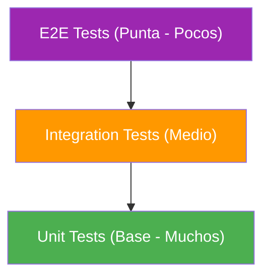

- [28. Testing de Servicios Web](#28-testing-de-servicios-web)
  - [28.1. Conceptos Fundamentales](#281-conceptos-fundamentales)
  - [28.2. Tipos de Tests](#282-tipos-de-tests)
    - [28.2.1. Piramide de Testing](#2821-piramide-de-testing)
    - [28.2.2. Test Unitario](#2822-test-unitario)
    - [28.2.3. Test de Integracion](#2823-test-de-integracion)
    - [28.2.4. Test E2E](#2824-test-e2e)
  - [28.3. Frameworks de Testing en .NET](#283-frameworks-de-testing-en-net)
  - [28.4. Estructura del Proyecto de Tests](#284-estructura-del-proyecto-de-tests)
  - [28.5. Patron AAA (Arrange-Act-Assert)](#285-patron-aaa-arrange-act-assert)
  - [28.6. NUnit Basics](#286-nunit-basics)
  - [28.7. FluentAssertions](#287-fluentassertions)
  - [28.8. Moq - Creando Mocks](#288-moq---creando-mocks)
  - [28.9. TestContainers](#289-testcontainers)
  - [28.10. Tests de Controladores con WebApplicationFactory](#2810-tests-de-controladores-con-webapplicationfactory)
  - [28.11. Tests en Paralelo vs Secuenciales](#2811-tests-en-paralelo-vs-secuenciales)
  - [28.12. Comandos Utiles](#2812-comandos-utiles)
  - [28.13. Buenas Practicas](#2813-buenas-practicas)
  - [28.14. Reto: Tests para FunkoApp](#2814-reto-tests-para-funkoapp)


# 28. Testing de Servicios Web

> **Punto de partida:** Como sabes que tu codigo funciona correctamente? Y como verificas que los cambios no rompen funcionalidades existentes? Los tests automatizados son la respuesta: ejecutan tu codigo de forma controlada y detectan errores antes de que lleguen a produccion.

En este punto aprenderás a escribir tests unitarios con NUnit, usar FluentAssertions para aserciones legibles, crear mocks con Moq y implementar tests de integracion con TestContainers y WebApplicationFactory.

**Objetivos de aprendizaje:**
- Comprender los fundamentos del testing y la piramide de tests
- Escribir test unitarios con NUnit, FluentAssertions y Moq
- Implementar tests de integracion con TestContainers y WebApplicationFactory
- Configurar paralelismo y medir cobertura de codigo

## 28.1. Conceptos Fundamentales

**Testing** es el proceso de verificar que el codigo funciona correctamente. En lugar de esperar que los usuarios encuentren errores, los tests automatizados detectan problemas antes de llegar a produccion.

📌 **Ejemplo real:** Cuando Amazon despliega una nueva version de su web, ejecutan miles de tests automaticos en minutos. Si alguno falla, el despliegue se detiene automaticamente.

| Problema sin Tests | Solucion con Tests |
|-------------------|-------------------|
| Errores detectados tarde | Deteccion inmediata |
| Miedo a refactorizar | Refactorizacion segura |
| Regresiones no detectadas | Tests regresivos automaticos |
| Deploys arriesgados | Confianza en el codigo |

## 28.2. Tipos de Tests

### 28.2.1. Piramide de Testing



| Tipo | Que testea | Velocidad | Aislamiento | Cantidad |
|------|------------|-----------|-------------|----------|
| **Unit** | Una unidad de codigo | Rapido (~ms) | Alto | Muchos |
| **Integration** | Multiples componentes juntos | Medio (~s) | Medio | Medio |
| **E2E** | Flujo completo de usuario | Lento (~min) | Bajo | Pocos |

### 28.2.2. Test Unitario

Un test unitario verifica que una **unica unidad** de codigo funciona correctamente. Un buen test unitario es rapido, aislado, determinista e independiente.

### 28.2.3. Test de Integracion

Los tests de integracion prueban multiples componentes trabajando juntos, generalmente con bases de datos reales o servicios externos en contenedores Docker.

### 28.2.4. Test E2E

Los tests End-to-End simulan un usuario real, probando la aplicacion completa desde la interfaz hasta la base de datos.

## 28.3. Frameworks de Testing en .NET

| Framework | Caracteristicas |
|-----------|-----------------|
| **NUnit** | Popular, sintaxis elegante, attributes ricos |
| **xUnit** | Moderno, creado por ASP.NET Core team |
| **MSTest** | De Microsoft, menos flexible |

En este proyecto usamos **NUnit** por su sintaxis clara y atributos descriptivos.

| Libreria | Proposito |
|----------|-----------|
| **NUnit** | Framework de testing |
| **FluentAssertions** | Assertions mas legibles |
| **Moq** | Crear mocks de interfaces |
| **TestContainers** | Contenedores Docker para tests de integracion |
| **coverlet** | Medir cobertura de codigo |

## 28.4. Estructura del Proyecto de Tests

```
FunkoApp.Tests/
├── Unit/
│   ├── Services/
│   │   └── FunkoServiceTests.cs
│   └── Validators/
│       └── FunkoValidatorTests.cs
├── Integration/
│   ├── Controllers/
│   │   └── FunkosControllerTests.cs
│   └── Repositories/
│       └── FunkoRepositoryTests.cs
├── Fixtures/
│   ├── FunkoAppWebApplicationFactory.cs
│   └── TestContainersFixture.cs
└── FunkoApp.Tests.csproj
```

## 28.5. Patron AAA (Arrange-Act-Assert)

Todo test debe seguir el patron **Arrange-Act-Assert**:

```csharp
using FluentAssertions;
using Moq;
using NUnit.Framework;

[TestFixture]
public class FunkoServiceTests
{
    [Test]
    public void GetById_FunkoExistente_ReturnSuccess()
    {
        // =====================================
        // ARRANGE: Preparar el escenario
        // =====================================
        var funkoId = 1L;
        var funkoEsperado = new Funko
        {
            Id = funkoId,
            Nombre = "Iron Man",
            Precio = 29.99m
        };

        var repositoryMock = new Mock<IFunkoRepository>();
        repositoryMock.Setup(r => r.GetByIdAsync(funkoId))
            .ReturnsAsync(funkoEsperado);

        var service = new FunkoService(repositoryMock.Object);

        // =====================================
        // ACT: Ejecutar la accion a testear
        // =====================================
        var resultado = service.GetByIdAsync(funkoId);

        // =====================================
        // ASSERT: Verificar el resultado
        // =====================================
        resultado.Should().NotBeNull();
        resultado.Result.IsSuccess.Should().BeTrue();
        resultado.Result.Value.Nombre.Should().Be("Iron Man");
    }
}
```

## 28.6. NUnit Basics

### Atributos Principales

| Atributo | Proposito | Ejemplo |
|----------|-----------|---------|
| `[Test]` | Metodo de test | `public void Test() {}` |
| `[TestCase]` | Test con parametros | `[TestCase(1, 2, 3)]` |
| `[SetUp]` | Se ejecuta antes de cada test | `SetUp() {}` |
| `[TearDown]` | Se ejecuta despues de cada test | `TearDown() {}` |
| `[OneTimeSetUp]` | Una vez antes de todos | `OneTimeSetUp() {}` |
| `[Category]` | Categorizar tests | `[Category("Slow")]` |

### Ejemplo Completo

```csharp
[TestFixture]
public class FunkoServiceTests
{
    private Mock<IFunkoRepository> _repositoryMock = null!;
    private FunkoService _service = null!;

    [SetUp]
    public void SetUp()
    {
        _repositoryMock = new Mock<IFunkoRepository>();
        _service = new FunkoService(_repositoryMock.Object);
    }

    [TearDown]
    public void TearDown()
    {
        _repositoryMock.VerifyAll();
    }

    [Test]
    public void GetById_FunkoExistente_ReturnSuccess()
    {
        var funko = new Funko { Id = 1, Nombre = "Iron Man" };
        _repositoryMock.Setup(r => r.GetByIdAsync(1)).ReturnsAsync(funko);

        var result = _service.GetByIdAsync(1);

        result.Result.IsSuccess.Should().BeTrue();
    }

    [TestCase(1L)]
    [TestCase(2L)]
    [TestCase(100L)]
    public void GetById_DiferentesIds_ReturnCorrecto(long funkoId)
    {
        var funko = new Funko { Id = funkoId, Nombre = "Funko" };
        _repositoryMock.Setup(r => r.GetByIdAsync(funkoId)).ReturnsAsync(funko);

        var result = _service.GetByIdAsync(funkoId);

        result.Result.IsSuccess.Should().BeTrue();
        result.Result.Value.Id.Should().Be(funkoId);
    }
}
```

## 28.7. FluentAssertions

**FluentAssertions** permite escribir assertions de forma mas legible y con mensajes de error claros.

```csharp
using FluentAssertions;

public class FluentAssertionsExamples
{
    [Test]
    public void EjemplosDeAssertions()
    {
        // Valores simples
        var resultado = 42;
        resultado.Should().Be(42);
        resultado.Should().NotBe(0);
        resultado.Should().BeGreaterThan(10);

        // Strings
        var nombre = "Iron Man";
        nombre.Should().NotBeEmpty();
        nombre.Should().StartWith("Iron");
        nombre.Should().Contain("Man");

        // Colecciones
        var funkos = new List<Funko> { new() { Id = 1 }, new() { Id = 2 } };
        funkos.Should().HaveCount(2);
        funkos.Should().Contain(f => f.Id == 1);

        // Excepciones
        Action accion = () => throw new ArgumentException("Error");
        accion.Should().Throw<ArgumentException>()
            .WithMessage("*Error*");

        // Objetos
        var funko = new Funko { Id = 1, Nombre = "Batman" };
        funko.Should().NotBeNull();
        funko.Nombre.Should().Be("Batman");
    }
}
```

📌 **Ejemplo real:** FluentAssertions es como hablar en espanol en vez de un lenguaje tecnico cryptico. `resultado.Should().Be(42)` es mucho mas legible que `Assert.AreEqual(42, resultado)`.

## 28.8. Moq - Creando Mocks

**Moq** permite crear objetos falsos (mocks) para aislar el codigo bajo test.

### Configurar Comportamiento con Setup

```csharp
[TestFixture]
public class FunkoServiceMockTests
{
    private Mock<IFunkoRepository> _repositoryMock = null!;
    private Mock<ILogger<FunkoService>> _loggerMock = null!;
    private FunkoService _service = null!;

    [SetUp]
    public void SetUp()
    {
        _repositoryMock = new Mock<IFunkoRepository>();
        _loggerMock = new Mock<ILogger<FunkoService>>();
        _service = new FunkoService(_repositoryMock.Object, _loggerMock.Object);
    }

    [Test]
    public async Task GetById_FunkoExistente_ReturnSuccess()
    {
        // Arrange
        var funkoId = 1L;
        var funkoEsperado = new Funko
        {
            Id = funkoId,
            Nombre = "Iron Man",
            Precio = 29.99m
        };

        _repositoryMock
            .Setup(r => r.GetByIdAsync(funkoId))
            .ReturnsAsync(funkoEsperado);

        // Act
        var resultado = await _service.GetByIdAsync(funkoId);

        // Assert
        resultado.IsSuccess.Should().BeTrue();
        resultado.Value.Nombre.Should().Be("Iron Man");

        // Verify: verificar que se llamo al metodo exactamente una vez
        _repositoryMock.Verify(
            r => r.GetByIdAsync(funkoId),
            Times.Once);
    }

    [Test]
    public async Task CreateAsync_Duplicado_ReturnConflict()
    {
        // Arrange
        var nuevoFunko = new CreateFunkoDto
        {
            Nombre = "Iron Man", // Ya existe
            Precio = 29.99m,
            Categoria = "Marvel"
        };

        _repositoryMock
            .Setup(r => r.GetByNombreAsync(nuevoFunko.Nombre))
            .ReturnsAsync(new Funko { Id = 1, Nombre = "Iron Man" });

        // Act
        var resultado = await _service.CreateAsync(nuevoFunko);

        // Assert
        resultado.IsFailure.Should().BeTrue();

        // Verify: NO debe crear
        _repositoryMock.Verify(
            r => r.CreateAsync(It.IsAny<Funko>()),
            Times.Never);
    }
}
```

### Tipos de Setup

```csharp
// Setup con valor fijo
_repositoryMock.Setup(r => r.GetCountAsync()).ReturnsAsync(42);

// Setup con expresion lambda
_repositoryMock
    .Setup(r => r.GetByIdAsync(It.IsAny<long>()))
    .ReturnsAsync((long id) => new Funko { Id = id });

// Setup que lanza excepcion
_repositoryMock
    .Setup(r => r.DeleteAsync(It.IsAny<long>()))
    .ThrowsAsync(new InvalidOperationException("No encontrado"));

// SetupSequence - diferentes valores en cada llamada
_repositoryMock
    .SetupSequence(r => r.GetCountAsync())
    .ReturnsAsync(0)
    .ReturnsAsync(1)
    .ReturnsAsync(2);
```

### Verify - Verificar Interacciones

```csharp
// Verificar que se llamo una vez
_repositoryMock.Verify(r => r.GetByIdAsync(1), Times.Once);

// Verificar que NUNCA se llamo
_repositoryMock.Verify(r => r.DeleteAsync(It.IsAny<long>()), Times.Never);

// Verificar que se llamo al menos una vez
_repositoryMock.Verify(r => r.GetByIdAsync(It.IsAny<long>()), Times.AtLeastOnce());

// Verificar todos los setups
_repositoryMock.VerifyAll();
```

## 28.9. TestContainers

**TestContainers** permite crear contenedores Docker durante los tests de integracion, proporcionando bases de datos reales en entornos aislados.

```csharp
using NUnit.Framework;
using TestContainers.PostgreSql;

[TestFixture]
[Parallelizable(ParallelScope.None)]
public class IntegrationTestBase : IAsyncLifetime
{
    protected PostgreSqlContainer _container = null!;
    protected FunkoDbContext _context = null!;

    public async Task InitializeAsync()
    {
        _container = new PostgreSqlBuilder()
            .WithImage("postgres:17-alpine")
            .WithDatabase("funkoapp_test")
            .WithUsername("test")
            .WithPassword("test")
            .Build();

        await _container.StartAsync();

        var options = new DbContextOptionsBuilder<FunkoDbContext>()
            .UseNpgsql(_container.GetConnectionString())
            .Options;

        _context = new FunkoDbContext(options);
        _context.Database.EnsureCreated();
    }

    public async Task DisposeAsync()
    {
        await _context.DisposeAsync();
        await _container.DisposeAsync();
    }
}
```

```csharp
public class FunkoRepositoryTests : IntegrationTestBase
{
    private FunkoRepository _repository = null!;

    [SetUp]
    public override async Task InitializeAsync()
    {
        await base.InitializeAsync();
        _repository = new FunkoRepository(_context);
    }

    [Test]
    public async Task AddAsync_FunkoValido_ReturnSuccess()
    {
        // Arrange
        var funko = new Funko
        {
            Nombre = "Batman",
            Precio = 29.99m,
            Categoria = "DC"
        };

        // Act
        var result = await _repository.AddAsync(funko);

        // Assert
        result.IsSuccess.Should().BeTrue();
        funko.Id.Should().BeGreaterThan(0);
    }
}
```

> ⚠️ **Advertencia:** Cada test debe empezar con la BD limpia. Usa `TRUNCATE TABLE ... RESTART IDENTITY` en SQL o `DeleteMany` en MongoDB para limpiar datos entre tests.

## 28.10. Tests de Controladores con WebApplicationFactory

`WebApplicationFactory` crea un servidor en memoria para probar endpoints HTTP sin necesidad de un servidor real.

```csharp
using Microsoft.AspNetCore.Mvc.Testing;
using Microsoft.EntityFrameworkCore;
using Microsoft.Extensions.DependencyInjection;

public class FunkoAppWebApplicationFactory : WebApplicationFactory<Program>
{
    protected override void ConfigureWebHost(IWebHostBuilder builder)
    {
        builder.ConfigureServices(services =>
        {
            var descriptor = services.SingleOrDefault(
                d => d.ServiceType == typeof(DbContextOptions<FunkoDbContext>));
            if (descriptor != null)
                services.Remove(descriptor);

            services.AddDbContext<FunkoDbContext>(options =>
            {
                options.UseInMemoryDatabase("TestDatabase");
            });
        });
    }
}
```

```csharp
public class FunkosControllerTests
{
    private WebApplicationFactory<Program> _factory = null!;
    private HttpClient _client = null!;

    [SetUp]
    public void SetUp()
    {
        _factory = new FunkoAppWebApplicationFactory();
        _client = _factory.CreateClient();
    }

    [TearDown]
    public void TearDown()
    {
        _factory.Dispose();
        _client.Dispose();
    }

    [Test]
    public async Task Get_Funkos_ReturnsOkWithLista()
    {
        // Act
        var response = await _client.GetAsync("/api/funkos");

        // Assert
        response.StatusCode.Should().Be(HttpStatusCode.OK);

        var funkos = await response.Content.ReadFromJsonAsync<List<Funko>>();
        funkos.Should().NotBeNull();
    }

    [Test]
    public async Task Post_FunkoValido_ReturnsCreated()
    {
        // Arrange
        var request = new CreateFunkoDto
        {
            Nombre = "Spider-Man",
            Precio = 24.99m,
            Categoria = "Marvel"
        };

        // Act
        var response = await _client.PostAsJsonAsync("/api/funkos", request);

        // Assert
        response.StatusCode.Should().Be(HttpStatusCode.Created);
    }
}
```

📌 **Ejemplo real:** Netflix usa WebApplicationFactory para testear sus APIs internas antes de cada despliegue. Cada endpoint se prueba con requests HTTP reales sin levantar un servidor completo.

## 28.11. Tests en Paralelo vs Secuenciales

NUnit puede ejecutar tests en paralelo para acelerar el tiempo de ejecucion.

```csharp
[assembly: LevelOfParallelism(4)]

// Este test se ejecuta en paralelo
[Parallelizable(ParallelScope.All)]
public class FunkoServiceTests { }

// Este test se ejecuta en secuencia (porque usa TestContainers)
[Parallelizable(ParallelScope.None)]
public class FunkoIntegrationTests { }
```

| Escenario | Recomendacion | Razon |
|-----------|---------------|-------|
| Tests unitarios con mocks | **Paralelo** | Rapidos, sin estado compartido |
| Tests que comparten base de datos | **Secuencial** | Evitar conflictos |
| Tests con TestContainers | **Limitado** | Cada contenedor es pesado |

## 28.12. Comandos Utiles

```bash
# Ejecutar todos los tests
dotnet test

# Ejecutar tests con verbosidad
dotnet test --verbosity normal

# Ejecutar tests con cobertura
dotnet test --collect:"XPlat Code Coverage"

# Tests especificos
dotnet test --filter "FullyQualifiedName~FunkoServiceTests"

# Tests de integracion
dotnet test --filter "Category=Integration"
```

## 28.13. Buenas Practicas

| Practica | Descripcion |
|----------|-------------|
| **Patron AAA** | Siempre usar Arrange-Act-Assert en cada test |
| **Nombres descriptivos** | `Metodo_Condicion_ResultadoEsperado` |
| **Tests aislados** | Cada test debe poder ejecutarse independientemente |
| **Un test, una afirmacion** | Cada test debe verificar una sola cosa |
| **Usar SetUp/TearDown** | Para configuracion comun y limpieza |
| **Mockear dependencias** | Para aislar la unidad bajo test |
| **Testear el comportamiento** | No testear implementacion, testear resultados |
| **Cobertura > 80%** | Objetivo minimo de cobertura de codigo |
| **No testear codigo trivial** | Propiedades auto, getters/setters |
| **Tests rapidos** | Los unitarios deben ejecutarse en milisegundos |

> ⚠️ **Advertencia:** No sobre-testear. Tests que testean el framework o la implementacion interna son fragiles y se rompen con cambios de refactorizacion. Testea el comportamiento, no la implementacion.

## 28.14. Reto: Tests para FunkoApp

> Antes de irte, implementa una suite completa de tests para tu API de Funkos.

### Contexto

Tu API de Funkos necesita tests automatizados para garantizar que cada cambio no rompe funcionalidades existentes.

### Ejercicio

1. Crea un proyecto de tests con NUnit, FluentAssertions y Moq
2. Implementa tests unitarios para `FunkoService`:
   - Mockear `IFunkoRepository`
   - Testear CRUD completo
   - Verificar casos de exito y error
3. Implementa tests de integracion usando `WebApplicationFactory`
4. Verifica los codigos HTTP correctos (200, 201, 400, 404)
5. Genera reporte de cobertura (>80%)

> 💡 **Consejo:** Usa el patron AAA en cada test. Comenta las secciones Arrange, Act y Assert para que el codigo sea legible.

**Resumen del punto:**

| Concepto | Descripcion |
|----------|-------------|
| **Test Unitario** | Prueba una unidad de codigo de forma aislada con mocks |
| **Test de Integracion** | Prueba multiples componentes juntos con dependencias reales |
| **Test E2E** | Simula un usuario real en la aplicacion completa |
| **NUnit** | Framework de testing con atributos descriptivos |
| **FluentAssertions** | Assertions legibles y expresivos |
| **Moq** | Creacion de objetos mocks para dependencias |
| **TestContainers** | Contenedores Docker para tests de integracion |
| **WebApplicationFactory** | Servidor en memoria para tests de API |
| **Patron AAA** | Arrange-Act-Assert para estructurar tests |
| **Cobertura** | Porcentaje de codigo ejecutado por tests |

**¿Qué viene después?**

En el siguiente punto veremos **Docker y Despliegue**: como crear Dockerfiles optimizados, usar Docker Compose para orquestar multiples contenedores, implementar multi-stage builds y configurar CI/CD con GitHub Actions.
