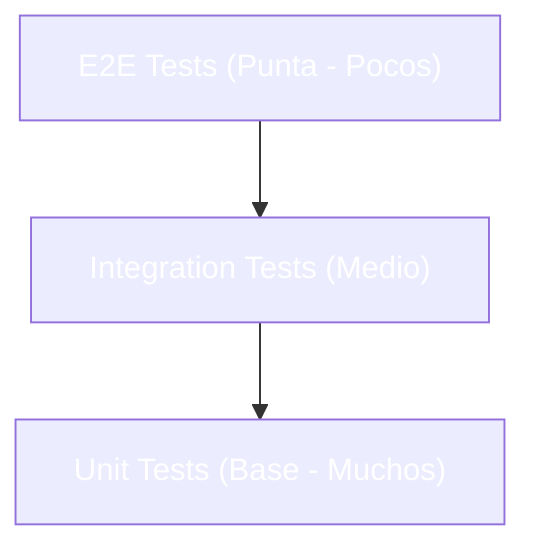

- [28. Testing de servicios web](#28-testing-de-servicios-web)
  - [28.1. Conceptos fundamentales](#281-conceptos-fundamentales)
  - [28.2. Tipos de tests](#282-tipos-de-tests)
    - [28.2.1. Piramide de testing](#2821-piramide-de-testing)
    - [28.2.2. Test unitario](#2822-test-unitario)
    - [28.2.3. Test de integracion](#2823-test-de-integracion)
    - [28.2.4. Test E2E](#2824-test-e2e)
  - [28.3. Frameworks de testing en .NET](#283-frameworks-de-testing-en-net)
  - [28.4. Estructura del proyecto de tests](#284-estructura-del-proyecto-de-tests)
  - [28.5. Patron AAA (Arrange-Act-Assert)](#285-patron-aaa-arrange-act-assert)
  - [28.6. NUnit basics](#286-nunit-basics)
    - [28.6.1. Atributos principales](#2861-atributos-principales)
    - [28.6.2. Ejemplo completo](#2862-ejemplo-completo)
    - [28.6.3. Organización con inner classes](#2863-organización-con-inner-classes)
  - [28.7. FluentAssertions](#287-fluentassertions)
  - [28.8. Moq - creando mocks](#288-moq---creando-mocks)
    - [28.8.1. Configurar comportamiento con setup](#2881-configurar-comportamiento-con-setup)
    - [28.8.2. Tipos de setup](#2882-tipos-de-setup)
    - [28.8.3. Verify - verificar interacciones](#2883-verify---verificar-interacciones)
  - [28.9. Testcontainers](#289-testcontainers)
    - [28.9.1. Optimización: un contenedor por assembly](#2891-optimización-un-contenedor-por-assembly)
  - [28.10. Tests de controladores con WebApplicationFactory](#2810-tests-de-controladores-con-webapplicationfactory)
    - [28.10.1. Tests de la forma de los errores](#28101-tests-de-la-forma-de-los-errores)
  - [28.11. Tests de contrato: OpenAPI](#2811-tests-de-contrato-openapi)
    - [28.11.1. Cambios que rompen el contrato](#28111-cambios-que-rompen-el-contrato)
    - [28.11.2. Tu primer test de contrato](#28112-tu-primer-test-de-contrato)
    - [28.11.3. ¿Dónde encaja en la pirámide?](#28113-dónde-encaja-en-la-pirámide)
  - [28.12. Tests en paralelo vs secuenciales](#2812-tests-en-paralelo-vs-secuenciales)
  - [28.13. Comandos utiles](#2813-comandos-utiles)
  - [28.14. Buenas practicas](#2814-buenas-practicas)
  - [28.15. Reto: tests para FunkoApp](#2815-reto-tests-para-funkoapp)


# 28. Testing de servicios web

> 💡 **Punto de partida:** ¿Cómo sabes que tu código funciona correctamente? ¿Y cómo verificas que los cambios no rompen funcionalidades existentes? Los tests automatizados son la respuesta: ejecutan tu código de forma controlada y detectan errores antes de que lleguen a producción.

En este punto aprenderás a escribir tests unitarios con NUnit, usar FluentAssertions para aserciones legibles, crear mocks con Moq e implementar tests de integracion con Testcontainers y WebApplicationFactory.

**Objetivos de aprendizaje:**
- Comprender los fundamentos del testing y la piramide de tests
- Escribir test unitarios con NUnit, FluentAssertions y Moq
- Implementar tests de integracion con Testcontainers y WebApplicationFactory
- Configurar paralelismo y medir cobertura de codigo

## 28.1. Conceptos fundamentales

**Testing** es el proceso de verificar que el codigo funciona correctamente. En lugar de esperar que los usuarios encuentren errores, los tests automatizados detectan problemas antes de llegar a produccion.

📌 **Ejemplo real:** Cuando Amazon despliega una nueva version de su web, ejecutan miles de tests automaticos en minutos. Si alguno falla, el despliegue se detiene automaticamente.

| Problema sin Tests | Solucion con Tests |
|-------------------|-------------------|
| Errores detectados tarde | Deteccion inmediata |
| Miedo a refactorizar | Refactorizacion segura |
| Regresiones no detectadas | Tests regresivos automaticos |
| Deploys arriesgados | Confianza en el codigo |

## 28.2. Tipos de tests

### 28.2.1. Piramide de testing


```mermaid
flowchart TD
    A["E2E Tests (Punta - Pocos)"] --> B["Integration Tests (Medio)"]
    B --> C["Unit Tests (Base - Muchos)"]

    style A fill:#9C27B,color:#fff0,color:#fff
    style B fill:#FF980,color:#fff0,color:#fff
    style C fill:#4CAF5,color:#fff0,color:#fff
```

| Tipo | Que testea | Velocidad | Aislamiento | Cantidad |
|------|------------|-----------|-------------|----------|
| **Unit** | Una unidad de codigo | Rapido (~ms) | Alto | Muchos |
| **Integration** | Multiples componentes juntos | Medio (~s) | Medio | Medio |
| **E2E** | Flujo completo de usuario | Lento (~min) | Bajo | Pocos |

### 28.2.2. Test unitario

Un test unitario verifica que una **unica unidad** de codigo funciona correctamente. Un buen test unitario es rapido, aislado, determinista e independiente.

### 28.2.3. Test de integracion

Los tests de integracion prueban multiples componentes trabajando juntos, generalmente con bases de datos reales o servicios externos en contenedores Docker.

### 28.2.4. Test E2E

Los tests End-to-End simulan un usuario real, probando la aplicacion completa desde la interfaz hasta la base de datos.

## 28.3. Frameworks de testing en .NET

| Framework | Caracteristicas |
|-----------|-----------------|
| **NUnit** | Popular, sintaxis elegante, attributes ricos |
| **xUnit** | Moderno, creado por ASP.NET Core team |
| **MSTest** | De Microsoft, menos flexible |

En este proyecto usamos **NUnit** por su sintaxis clara y atributos descriptivos.

| Libreria | Proposito |
|----------|-----------|
| **NUnit** | Framework de testing |
| **FluentAssertions** | Assertions mas legibles |
| **Moq** | Crear mocks de interfaces |
| **Testcontainers** | Contenedores Docker para tests de integracion |
| **coverlet** | Medir cobertura de codigo |

## 28.4. Estructura del proyecto de tests

```
FunkoApp.Tests/
├── Unit/
│   ├── Services/
│   │   └── FunkoServiceTests.cs
│   └── Validators/
│       └── FunkoValidatorTests.cs
├── Integration/
│   ├── Controllers/
│   │   └── FunkosControllerTests.cs
│   └── Repositories/
│       └── FunkoRepositoryTests.cs
├── Fixtures/
│   ├── FunkoAppWebApplicationFactory.cs
│   └── TestContainersFixture.cs
└── FunkoApp.Tests.csproj
```

**Fichero `.csproj` del proyecto de tests** (versiones del módulo):

```xml
<Project Sdk="Microsoft.NET.Sdk">
    <PropertyGroup>
        <TargetFramework>net10.0</TargetFramework>
        <LangVersion>14</LangVersion>
        <ImplicitUsings>enable</ImplicitUsings>
        <Nullable>enable</Nullable>
        <IsPackable>false</IsPackable>
    </PropertyGroup>

    <ItemGroup>
        <PackageReference Include="coverlet.collector" Version="6.0.4" />
        <PackageReference Include="FluentAssertions" Version="6.12.2" />
        <PackageReference Include="Microsoft.NET.Test.Sdk" Version="17.14.0" />
        <PackageReference Include="Moq" Version="4.20.72" />
        <PackageReference Include="NUnit" Version="4.3.2" />
        <PackageReference Include="NUnit.Analyzers" Version="4.7.0" />
        <PackageReference Include="NUnit3TestAdapter" Version="5.0.0" />
        <PackageReference Include="Testcontainers.PostgreSql" Version="3.10.0" />
    </ItemGroup>

    <ItemGroup>
        <ProjectReference Include="..\FunkoApp\FunkoApp.csproj" />
    </ItemGroup>
</Project>
```

## 28.5. Patron AAA (Arrange-Act-Assert)

Todo test debe seguir el patron **Arrange-Act-Assert**:

```csharp
using FluentAssertions;
using Moq;
using NUnit.Framework;

[TestFixture]
public class FunkoServiceTests
{
    [Test]
    public async Task GetById_FunkoExistente_ReturnSuccess()
    {
        // =====================================
        // ARRANGE: Preparar el escenario
        // =====================================
        var funkoId = 1L;
        var funkoEsperado = new Funko
        {
            Id = funkoId,
            Nombre = "Iron Man",
            Precio = 29.99m
        };

        var repositoryMock = new Mock<IFunkoRepository>();
        repositoryMock.Setup(r => r.GetByIdAsync(funkoId))
            .ReturnsAsync(funkoEsperado);

        var service = new FunkoService(repositoryMock.Object);

        // =====================================
        // ACT: Ejecutar la accion a testear
        // =====================================
        var resultado = await service.GetByIdAsync(funkoId);

        // =====================================
        // ASSERT: Verificar el resultado
        // =====================================
        resultado.IsSuccess.Should().BeTrue();
        resultado.Value.Nombre.Should().Be("Iron Man");
    }
}
```

## 28.6. NUnit basics

### 28.6.1. Atributos principales

| Atributo | Proposito | Ejemplo |
|----------|-----------|---------|
| `[Test]` | Metodo de test | `public void Test() {}` |
| `[TestCase]` | Test con parametros | `[TestCase(1, 2, 3)]` |
| `[SetUp]` | Se ejecuta antes de cada test | `SetUp() {}` |
| `[TearDown]` | Se ejecuta despues de cada test | `TearDown() {}` |
| `[OneTimeSetUp]` | Una vez antes de todos | `OneTimeSetUp() {}` |
| `[Category]` | Categorizar tests | `[Category("Slow")]` |

### 28.6.2. Ejemplo completo

```csharp
[TestFixture]
public class FunkoServiceTests
{
    private Mock<IFunkoRepository> _repositoryMock = null!;
    private FunkoService _service = null!;

    [SetUp]
    public void SetUp()
    {
        _repositoryMock = new Mock<IFunkoRepository>();
        _service = new FunkoService(_repositoryMock.Object);
    }

    [TearDown]
    public void TearDown()
    {
        _repositoryMock.VerifyAll();
    }

    [Test]
    public async Task GetById_FunkoExistente_ReturnSuccess()
    {
        var funko = new Funko { Id = 1, Nombre = "Iron Man" };
        _repositoryMock.Setup(r => r.GetByIdAsync(1)).ReturnsAsync(funko);

        var result = await _service.GetByIdAsync(1);

        result.IsSuccess.Should().BeTrue();
    }

    [TestCase(1L)]
    [TestCase(2L)]
    [TestCase(100L)]
    public async Task GetById_DiferentesIds_ReturnCorrecto(long funkoId)
    {
        var funko = new Funko { Id = funkoId, Nombre = "Funko" };
        _repositoryMock.Setup(r => r.GetByIdAsync(funkoId)).ReturnsAsync(funko);

        var result = await _service.GetByIdAsync(funkoId);

        result.IsSuccess.Should().BeTrue();
        result.Value.Id.Should().Be(funkoId);
    }
}
```

### 28.6.3. Organización con inner classes

Separa los casos válidos e inválidos con **inner classes** para que la suite sea más legible:

```csharp
[TestFixture]
public class FunkoTests
{
    [TestFixture]
    public class CasosValidos
    {
        [Test]
        public void Precio_Cero_OtrasPropiedadesCorrectas()
        {
            // Arrange
            var funko = new Funko { Id = 1, Nombre = "Iron Man", Precio = 29.99m };

            // Act
            var resultado = funko.Nombre;

            // Assert
            resultado.Should().Be("Iron Man");
        }
    }

    [TestFixture]
    public class CasosInvalidos
    {
        [Test]
        public void Precio_Negativo_ThrowsArgumentException()
        {
            // Arrange
            var accion = () =>
            {
                var funko = new Funko { Nombre = "Iron Man", Precio = -1 };
                _ = funko.Validar();
            };

            // Assert
            accion.Should().Throw<ArgumentException>()
                .WithMessage("*precio debe ser mayor que 0*");
        }
    }
}
```

## 28.7. FluentAssertions

**FluentAssertions** permite escribir assertions de forma mas legible y con mensajes de error claros.

```csharp
using FluentAssertions;

public class FluentAssertionsExamples
{
    [Test]
    public void EjemplosDeAssertions()
    {
        // Valores simples
        var resultado = 42;
        resultado.Should().Be(42);
        resultado.Should().NotBe(0);
        resultado.Should().BeGreaterThan(10);

        // Strings
        var nombre = "Iron Man";
        nombre.Should().NotBeEmpty();
        nombre.Should().StartWith("Iron");
        nombre.Should().Contain("Man");

        // Colecciones
        var funkos = new List<Funko> { new() { Id = 1 }, new() { Id = 2 } };
        funkos.Should().HaveCount(2);
        funkos.Should().Contain(f => f.Id == 1);

        // Excepciones
        Action accion = () => throw new ArgumentException("Error");
        accion.Should().Throw<ArgumentException>()
            .WithMessage("*Error*");

        // Objetos
        var funko = new Funko { Id = 1, Nombre = "Batman" };
        funko.Should().NotBeNull();
        funko.Nombre.Should().Be("Batman");
    }
}
```

📌 **Ejemplo real:** FluentAssertions es como hablar en espanol en vez de un lenguaje tecnico cryptico. `resultado.Should().Be(42)` es mucho mas legible que `Assert.AreEqual(42, resultado)`.

## 28.8. Moq - creando mocks

**Moq** permite crear objetos falsos (mocks) para aislar el codigo bajo test.

### 28.8.1. Configurar comportamiento con setup

```csharp
[TestFixture]
public class FunkoServiceMockTests
{
    private Mock<IFunkoRepository> _repositoryMock = null!;
    private Mock<ILogger<FunkoService>> _loggerMock = null!;
    private FunkoService _service = null!;

    [SetUp]
    public void SetUp()
    {
        _repositoryMock = new Mock<IFunkoRepository>();
        _loggerMock = new Mock<ILogger<FunkoService>>();
        _service = new FunkoService(_repositoryMock.Object, _loggerMock.Object);
    }

    [Test]
    public async Task GetById_FunkoExistente_ReturnSuccess()
    {
        // Arrange
        var funkoId = 1L;
        var funkoEsperado = new Funko
        {
            Id = funkoId,
            Nombre = "Iron Man",
            Precio = 29.99m
        };

        _repositoryMock
            .Setup(r => r.GetByIdAsync(funkoId))
            .ReturnsAsync(funkoEsperado);

        // Act
        var resultado = await _service.GetByIdAsync(funkoId);

        // Assert
        resultado.IsSuccess.Should().BeTrue();
        resultado.Value.Nombre.Should().Be("Iron Man");

        // Verify: verificar que se llamo al metodo exactamente una vez
        _repositoryMock.Verify(
            r => r.GetByIdAsync(funkoId),
            Times.Once);
    }

    [Test]
    public async Task CreateAsync_Duplicado_ReturnConflict()
    {
        // Arrange
        var nuevoFunko = new CreateFunkoDto
        {
            Nombre = "Iron Man", // Ya existe
            Precio = 29.99m,
            Categoria = "Marvel"
        };

        _repositoryMock
            .Setup(r => r.GetByNombreAsync(nuevoFunko.Nombre))
            .ReturnsAsync(new Funko { Id = 1, Nombre = "Iron Man" });

        // Act
        var resultado = await _service.CreateAsync(nuevoFunko);

        // Assert
        resultado.IsFailure.Should().BeTrue();

        // Verify: NO debe crear
        _repositoryMock.Verify(
            r => r.CreateAsync(It.IsAny<Funko>()),
            Times.Never);
    }
}
```

### 28.8.2. Tipos de setup

```csharp
// Setup con valor fijo
_repositoryMock.Setup(r => r.GetCountAsync()).ReturnsAsync(42);

// Setup con expresion lambda
_repositoryMock
    .Setup(r => r.GetByIdAsync(It.IsAny<long>()))
    .ReturnsAsync((long id) => new Funko { Id = id });

// Setup que lanza excepcion
_repositoryMock
    .Setup(r => r.DeleteAsync(It.IsAny<long>()))
    .ThrowsAsync(new InvalidOperationException("No encontrado"));

// SetupSequence - diferentes valores en cada llamada
_repositoryMock
    .SetupSequence(r => r.GetCountAsync())
    .ReturnsAsync(0)
    .ReturnsAsync(1)
    .ReturnsAsync(2);
```

### 28.8.3. Verify - verificar interacciones

```csharp
// Verificar que se llamo una vez
_repositoryMock.Verify(r => r.GetByIdAsync(1), Times.Once);

// Verificar que NUNCA se llamo
_repositoryMock.Verify(r => r.DeleteAsync(It.IsAny<long>()), Times.Never);

// Verificar que se llamo al menos una vez
_repositoryMock.Verify(r => r.GetByIdAsync(It.IsAny<long>()), Times.AtLeastOnce());

// Verificar todos los setups
_repositoryMock.VerifyAll();
```

## 28.9. Testcontainers

**Testcontainers** permite crear contenedores Docker durante los tests de integracion, proporcionando bases de datos reales en entornos aislados.

```csharp
using NUnit.Framework;
using Testcontainers.PostgreSql;

[TestFixture]
[Parallelizable(ParallelScope.None)]
public class IntegrationTestBase : IAsyncLifetime
{
    protected PostgreSqlContainer _container = null!;
    protected FunkoDbContext _context = null!;

    // IAsyncLifetime: se ejecuta UNA SOLA VEZ por fixture (antes de todos los tests)
    public async Task InitializeAsync()
    {
        _container = new PostgreSqlBuilder()
            .WithImage("postgres:17-alpine")
            .WithDatabase("funkoapp_test")
            .WithUsername("test")
            .WithPassword("test")
            .Build();

        await _container.StartAsync();

        var options = new DbContextOptionsBuilder<FunkoDbContext>()
            .UseNpgsql(_container.GetConnectionString())
            .Options;

        _context = new FunkoDbContext(options);
        _context.Database.EnsureCreated();
    }

    public async Task DisposeAsync()
    {
        await _context.DisposeAsync();
        await _container.DisposeAsync();
    }
}
```

```csharp
public class FunkoRepositoryTests : IntegrationTestBase
{
    private FunkoRepository _repository = null!;

    // [SetUp] normal (NO override): InitializeAsync NO es virtual,
    // pertenece a IAsyncLifetime y ya se ejecuta una vez por fixture en la base.
    [SetUp]
    public void SetUp()
    {
        // Limpieza real: cada test empieza con la BD limpia
        _context.Database.ExecuteSqlRaw(
            "TRUNCATE TABLE Funkos RESTART IDENTITY CASCADE");

        _repository = new FunkoRepository(_context);
    }

    [Test]
    public async Task AddAsync_FunkoValido_ReturnSuccess()
    {
        // Arrange
        var funko = new Funko
        {
            Nombre = "Batman",
            Precio = 29.99m,
            Categoria = "DC"
        };

        // Act
        var result = await _repository.AddAsync(funko);

        // Assert
        result.IsSuccess.Should().BeTrue();
        funko.Id.Should().BeGreaterThan(0);
    }
}
```

> ⚠️ **Advertencia:** Cada test debe empezar con la BD limpia. Haz la limpieza real en el `[SetUp]` de cada fixture (como en el ejemplo: `TRUNCATE TABLE ... RESTART IDENTITY CASCADE` con `ExecuteSqlRaw`, o `DeleteMany` en MongoDB). El `InitializeAsync` de `IAsyncLifetime` solo levanta el contenedor una vez: no sirve para limpiar entre tests.

### 28.9.1. Optimización: un contenedor por assembly

El patrón de arriba funciona bien, pero tiene un coste: **cada clase de tests arranca su propio PostgreSQL**. Con 10 clases de integración (y más si además usas MongoDB), la suite arranca una veintena de contenedores: cada arranque cuesta unos segundos y se suman en cada ejecución.

La solución es un **`[SetUpFixture]` a nivel de assembly**: un único contenedor para toda la suite, y el aislamiento entre clases se consigue con **bases de datos de nombre propio** dentro de ese contenedor.

> 💡 **Analogía:** Es la diferencia entre que cada clase alquile su propia sala de reuniones (10 contenedores) o que todo el grupo comparta una sala grande con una pizarra por equipo (un contenedor, bases de datos separadas).

```csharp
// Un solo [SetUpFixture] gobierna todos los tests de este namespace
[SetUpFixture]
public sealed class AssemblyContainerFixture
{
    private static PostgreSqlContainer? _postgres;

    internal static PostgreSqlContainer Postgres =>
        _postgres ?? throw new InvalidOperationException("El contenedor no está arrancado.");

    [OneTimeSetUp]
    public async Task InitializeAsync()
    {
        _postgres = new PostgreSqlBuilder().WithImage("postgres:17-alpine").Build();
        await _postgres.StartAsync();
    }

    // Crea (o recrea) una BD con nombre propio para una clase de tests
    internal static async Task<string> CreateDatabaseAsync(string dbName)
    {
        var admin = new NpgsqlConnectionStringBuilder(Postgres.GetConnectionString())
        {
            Database = "postgres"
        };

        await using var conn = new NpgsqlConnection(admin.ConnectionString);
        await conn.OpenAsync();

        // WITH (FORCE) mata las conexiones vivas: si un test anterior
        // dejó una abierta, el DROP no falla
        await using (var drop = new NpgsqlCommand(
            $"DROP DATABASE IF EXISTS \"{dbName}\" WITH (FORCE)", conn))
        {
            await drop.ExecuteNonQueryAsync();
        }

        await using (var create = new NpgsqlCommand($"CREATE DATABASE \"{dbName}\"", conn))
        {
            await create.ExecuteNonQueryAsync();
        }

        var target = new NpgsqlConnectionStringBuilder(Postgres.GetConnectionString())
        {
            Database = dbName
        };
        return target.ConnectionString;
    }

    internal static async Task DropDatabaseAsync(string dbName)
    {
        var admin = new NpgsqlConnectionStringBuilder(Postgres.GetConnectionString())
        {
            Database = "postgres"
        };

        await using var conn = new NpgsqlConnection(admin.ConnectionString);
        await conn.OpenAsync();

        await using var drop = new NpgsqlCommand(
            $"DROP DATABASE IF EXISTS \"{dbName}\" WITH (FORCE)", conn);
        await drop.ExecuteNonQueryAsync();
    }

    [OneTimeTearDown]
    public async Task DisposeAsync()
    {
        if (_postgres is not null)
        {
            await _postgres.DisposeAsync();
            _postgres = null;
        }
    }
}
```

Cada clase de tests solo pide su propia base de datos:

```csharp
public class ProductoServiceIntegrationTests
{
    private const string DatabaseName = "it_producto_service";
    private string _connectionString = string.Empty;

    [OneTimeSetUp]
    public async Task OneTimeSetup() =>
        _connectionString = await AssemblyContainerFixture.CreateDatabaseAsync(DatabaseName);

    [OneTimeTearDown]
    public async Task OneTimeTearDown() =>
        await AssemblyContainerFixture.DropDatabaseAsync(DatabaseName);
}
```

**Resultado medido** (TiendaAPI, suite de integración, dos pasadas sin fallos):

| Métrica | Antes (contenedor por clase) | Después (1 por assembly) |
|---------|------------------------------|--------------------------|
| Arranques de contenedor | 19 | **2** |
| Tests de integración | 193 | 203 |
| Duración de la suite | **88,3 s** | **23 s** |

> ⚠️ **Advertencia:** El `[SetUpFixture]` gobierna el **namespace donde está declarado**. Los tests fuera de ese namespace no lo usan: si esperan encontrar contenedor ahí, fallarán. Y aunque el contenedor se comparta, **los datos siguen sin compartirse**: una base de datos por clase.

> 💡 **Truco:** `DROP DATABASE ... WITH (FORCE)` (PostgreSQL 13+) es la clave: elimina las conexiones que un test anterior haya dejado abiertas, que si no bloquearían la creación de la siguiente BD. En MongoDB basta con `new MongoClient(cs).DropDatabase(nombre)`.

## 28.10. Tests de controladores con WebApplicationFactory

`WebApplicationFactory` crea un servidor en memoria para probar endpoints HTTP sin necesidad de un servidor real.

**Paquetes NuGet necesarios:**

```bash
dotnet add package Microsoft.AspNetCore.Mvc.Testing
dotnet add package Microsoft.EntityFrameworkCore.InMemory
```

> ⚠️ **Advertencia — Top Level Statements:** Si tu `Program.cs` usa Top Level Statements (el estilo por defecto en .NET 10), `WebApplicationFactory<Program>` necesita que `Program` sea visible desde el proyecto de tests. Añade al final de `Program.cs`:

```csharp
// En Program.cs de la API (Top Level Statements)
public partial class Program;
```

```csharp
using Microsoft.AspNetCore.Mvc.Testing;
using Microsoft.EntityFrameworkCore;
using Microsoft.Extensions.DependencyInjection;

public class FunkoAppWebApplicationFactory : WebApplicationFactory<Program>
{
    protected override void ConfigureWebHost(IWebHostBuilder builder)
    {
        builder.ConfigureServices(services =>
        {
            var descriptor = services.SingleOrDefault(
                d => d.ServiceType == typeof(DbContextOptions<FunkoDbContext>));
            if (descriptor is not null)
                services.Remove(descriptor);

            services.AddDbContext<FunkoDbContext>(options =>
            {
                options.UseInMemoryDatabase("TestDatabase");
            });
        });
    }
}
```

```csharp
public class FunkosControllerTests
{
    private WebApplicationFactory<Program> _factory = null!;
    private HttpClient _client = null!;

    [SetUp]
    public void SetUp()
    {
        _factory = new FunkoAppWebApplicationFactory();
        _client = _factory.CreateClient();
    }

    [TearDown]
    public void TearDown()
    {
        _factory.Dispose();
        _client.Dispose();
    }

    [Test]
    public async Task Get_Funkos_ReturnsOkWithLista()
    {
        // Act
        var response = await _client.GetAsync("/api/funkos");

        // Assert
        response.StatusCode.Should().Be(HttpStatusCode.OK);

        var funkos = await response.Content.ReadFromJsonAsync<List<Funko>>();
        funkos.Should().NotBeNull();
    }

    [Test]
    public async Task Post_FunkoValido_ReturnsCreated()
    {
        // Arrange
        var request = new CreateFunkoDto
        {
            Nombre = "Spider-Man",
            Precio = 24.99m,
            Categoria = "Marvel"
        };

        // Act
        var response = await _client.PostAsJsonAsync("/api/funkos", request);

        // Assert
        response.StatusCode.Should().Be(HttpStatusCode.Created);
    }
}
```

📌 **Ejemplo real:** Netflix usa WebApplicationFactory para testear sus APIs internas antes de cada despliegue. Cada endpoint se prueba con requests HTTP reales sin levantar un servidor completo.

### 28.10.1. Tests de la forma de los errores

No basta con comprobar que un error devuelve `400`: hay que comprobar **la forma** (el *shape*) del cuerpo, porque tus clientes la parsean. Cada origen de error tiene su propio formato:

| Status | Origen | Cuerpo esperado |
|--------|--------|-----------------|
| `400` | Validación de `[ApiController]` | ProblemDetails: `status`, `title`, `errors` por campo |
| `401` | Sin token (challenge JWT) | Cuerpo vacío + cabecera `WWW-Authenticate: Bearer` |
| `401` | Credenciales inválidas (dominio `Result`) | `{ "message": "..." }` |
| `404` / `409` | Errores de dominio (patrón `Result`) | `{ "message": "..." }` |
| `429` | Rate limiting | `{ errorType, message, path, limit, window, retryAfter }` + `Retry-After` y `RateLimit-*` |

> 💡 **Analogía:** Es el **contrato** de tu API. Si cambias `message` por `error`, rompes a todos los clientes que ya lo parsean; estos tests son la red de seguridad que lo impide.

📌 **Ejemplo real:** TiendaAPI añadió una clase `ErrorShapeApiTests` (10 tests) que fija esta forma: 400 con `errors` agrupados por campo, 401 con `WWW-Authenticate`, 404/409 de dominio con `message` (**y sin `errorId`**, porque esos errores no pasan por el manejador global de excepciones) y 429 con `errorType: "RateLimitError"`, `limit: 10`, `window: "1m"` y las cabeceras `RateLimit-Limit`/`Remaining`/`Reset`.

```csharp
[Test]
public async Task CuerpoInvalido_Devuelve400_ConProblemDetails()
{
    // Act
    var response = await _client.PostAsJsonAsync(
        "/api/auth/signin", new Dictionary<string, string>());

    // Assert
    response.StatusCode.Should().Be(HttpStatusCode.BadRequest);

    var body = await response.Content.ReadFromJsonAsync<JsonElement>();
    body.GetProperty("status").GetInt32().Should().Be(400);
    body.GetProperty("title").GetString().Should().NotBeNullOrWhiteSpace();
    body.TryGetProperty("errors", out var errors).Should().BeTrue(
        "la validacion de [ApiController] debe agrupar errores por campo");
    errors.EnumerateObject().Should().NotBeEmpty();
}

[Test]
public async Task RecursoDuplicado_Devuelve409_ConShapeDeDominio()
{
    // Act
    var response = await _client.PostAsJsonAsync("/api/funkos", funkoExistente);

    // Assert
    response.StatusCode.Should().Be(HttpStatusCode.Conflict);

    var body = await response.Content.ReadFromJsonAsync<JsonElement>();
    body.GetProperty("message").GetString().Should().NotBeNullOrWhiteSpace();
    body.TryGetProperty("errorId", out _).Should().BeFalse(
        "los errores de dominio no pasan por el manejador global de excepciones");
}

[Test]
public async Task LimiteDePeticiones_Devuelve429_ConHeadersYCuerpo()
{
    // Sonda con IP propia: cada IP tiene su ventana de rate limiting,
    // asi este test no consume la cuota de los demas
    for (var i = 0; i < 12; i++)
    {
        var request = new HttpRequestMessage(HttpMethod.Post, "/api/auth/signin")
        {
            Content = JsonContent.Create(new { username = "sonda", password = "noimporta" })
        };
        request.Headers.Add("X-Forwarded-For", "172.16.9.9");

        var response = await _client.SendAsync(request);
        if (response.StatusCode != HttpStatusCode.TooManyRequests)
        {
            continue;
        }

        response.Headers.RetryAfter.Should().NotBeNull();

        var body = await response.Content.ReadFromJsonAsync<JsonElement>();
        body.GetProperty("errorType").GetString().Should().Be("RateLimitError");
        body.GetProperty("limit").GetInt32().Should().Be(10);
        body.GetProperty("window").GetString().Should().Be("1m");
        return;
    }

    Assert.Fail("el limite de autenticacion es 10 peticiones por minuto");
}
```

> ⚠️ **Advertencia:** Al ser tests de `WebApplicationFactory`, necesitan el `public partial class Program;` del final del `Program.cs` (apartado anterior) y, si la suite comparte contenedor, su propia base de datos creada en el `[OneTimeSetUp]` (apartado 28.9.1).

## 28.11. Tests de contrato: OpenAPI

En 28.10.1 fijamos la **forma de los errores** de la API. Un paso más allá está el **test de contrato**: comprobar que la especificación OpenAPI publicada (`swagger.json`) **no ha cambiado** sin que nadie lo decidiera. No mide si el código es correcto: mide si la API **sigue prometiendo lo mismo** que ayer.

> 💡 **Analogía:** Es el contrato de un alquiler. Si el casero cambia una cláusula sin avisar, el inquilino (tu Frontend, tu app móvil, el otro equipo) se entera tarde y mal. El documento OpenAPI es lo que tu API **promete** a sus consumidores.

📌 **Ejemplo real:** TiendaAPI existe en dos variantes (API simple y variante CQRS con MediatR). El script `scripts/check-openapi.mjs` arranca ambas (puertos 5041 y 5042), descarga el `swagger.json` de cada una y hace un **diff profundo**: **22 rutas, 39 operaciones y 0 diferencias** significa que las dos cumplen exactamente el mismo contrato.

### 28.11.1. Cambios que rompen el contrato

| Cambio en la API | ¿Rompe contrato? | Ejemplo |
|------------------|------------------|---------|
| Eliminar un endpoint | ✅ Sí | `DELETE /funkos` desaparece |
| Cambiar un código de estado | ✅ Sí | `201 Created` → `200 OK` |
| Renombrar o eliminar un campo | ✅ Sí | `nombre` → `name` |
| Cambiar el tipo de un campo | ✅ Sí | `precio` string → number |
| Añadir un campo opcional | ❌ No | nuevo campo con valor por defecto |
| Cambiar descripciones o ejemplos | ❌ No | texto libre de Swagger |

> ⚠️ **Advertencia:** "Solo he cambiado el nombre de un campo" es la frase que más Frontends ha roto. El diff lo detecta en milisegundos; tu usuario lo detecta en producción.

### 28.11.2. Tu primer test de contrato

La idea es siempre la misma: **descargar el contrato y compararlo**.

```bash
# 1. Arranca las dos versiones del servicio (o la de hoy vs la de ayer)
# 2. Descarga el contrato de cada una
curl -s http://localhost:5041/swagger/v1/swagger.json -o contrato-a.json
curl -s http://localhost:5042/swagger/v1/swagger.json -o contrato-b.json

# 3. Compara con un diff profundo (rutas, operaciones, esquemas)
node scripts/check-openapi.mjs
```

Y este es el esqueleto de un script equivalente, sin dependencias:

```js
// check-openapi.mjs (versión mínima, Node 18+)
const [a, b] = await Promise.all([
  fetch("http://localhost:5041/swagger/v1/swagger.json").then(r => r.json()),
  fetch("http://localhost:5042/swagger/v1/swagger.json").then(r => r.json())
]);

const rutas = doc => Object.keys(doc.paths).sort();
const soloEnA = rutas(a).filter(r => !rutas(b).includes(r));

if (soloEnA.length > 0) {
  console.error("❌ Rutas que solo están en un contrato:", soloEnA);
  process.exit(1); // ← esto es lo que rompe el CI
}

console.log(`✅ ${rutas(a).length} rutas idénticas`);
```

La pieza clave es el `process.exit(1)`: un test de contrato **solo sirve si su fallo detiene la ejecución** (CI/CD o pre-commit).

### 28.11.3. ¿Dónde encaja en la pirámide?

- **Más barato que un E2E:** no recorres flujos, solo comparas documentos.
- **Más fiel que un unit:** valida lo que realmente se expone al exterior.
- Encaja justo **por debajo de los E2E** y por encima de los tests unitarios de detalle.

> 💡 **Consejo:** Ejecuta el diff **antes de cada despliegue**. Si comparas dos variantes del servicio, ambas deben estar arrancadas; si comparas contra la última versión publicada, versiona el `swagger.json` en el repo y compáralo contra él.

> 📝 **Nota:** Para contratos **entre servicios** (el consumidor declara lo que espera) existen herramientas dedicadas como **Pact**. Para verificar tu propia API publicada, un diff de `swagger.json` es suficiente y no necesita dependencias.

**Resumen de la sección:**

| Concepto | Descripción |
|----------|-------------|
| **Contrato OpenAPI** | Lo que tu API promete a sus consumidores |
| **Cambio roto** | Eliminar endpoints/campos o alterar códigos/tipos |
| **Test de contrato** | Diff profundo entre dos `swagger.json` (o contra el versionado) |
| **Gate real** | El script debe terminar con código ≠ 0 para fallar el CI |

## 28.12. Tests en paralelo vs secuenciales

NUnit puede ejecutar tests en paralelo para acelerar el tiempo de ejecucion.

```csharp
[assembly: LevelOfParallelism(4)]

// Este test se ejecuta en paralelo
[Parallelizable(ParallelScope.All)]
public class FunkoServiceTests { }

// Este test se ejecuta en secuencia (porque usa Testcontainers)
[Parallelizable(ParallelScope.None)]
public class FunkoIntegrationTests { }
```

| Escenario | Recomendacion | Razon |
|-----------|---------------|-------|
| Tests unitarios con mocks | **Paralelo** | Rapidos, sin estado compartido |
| Tests que comparten base de datos | **Secuencial** | Evitar conflictos |
| **Tests con Testcontainers** | **Limitado** | Cada contenedor es pesado |

## 28.13. Comandos utiles

```bash
# Ejecutar todos los tests
dotnet test

# Ejecutar tests con verbosidad
dotnet test --verbosity normal

# Ejecutar tests con cobertura
dotnet test --collect:"XPlat Code Coverage"

# Tests especificos
dotnet test --filter "FullyQualifiedName~FunkoServiceTests"

# Tests de integracion
dotnet test --filter "Category=Integration"
```

## 28.14. Buenas practicas

| Practica | Descripcion |
|----------|-------------|
| **Patron AAA** | Siempre usar Arrange-Act-Assert en cada test |
| **Nombres descriptivos** | `Metodo_Condicion_ResultadoEsperado` |
| **Tests aislados** | Cada test debe poder ejecutarse independientemente |
| **Un test, una afirmacion** | Cada test debe verificar una sola cosa |
| **Usar SetUp/TearDown** | Para configuracion comun y limpieza |
| **Mockear dependencias** | Para aislar la unidad bajo test |
| **Testear el comportamiento** | No testear implementacion, testear resultados |
| **Cobertura > 80%** | Objetivo minimo de cobertura de codigo |
| **No testear codigo trivial** | Propiedades auto, getters/setters |
| **Tests rapidos** | Los unitarios deben ejecutarse en milisegundos |

> ⚠️ **Advertencia:** No sobre-testear. Tests que testean el framework o la implementacion interna son fragiles y se rompen con cambios de refactorizacion. Testea el comportamiento, no la implementacion.

## 28.15. Reto: tests para FunkoApp

> Antes de irte, implementa una suite completa de tests para tu API de Funkos.

### Contexto

Tu API de Funkos necesita tests automatizados para garantizar que cada cambio no rompe funcionalidades existentes.

### Ejercicio

1. Crea un proyecto de tests con NUnit, FluentAssertions y Moq
2. Implementa tests unitarios para `FunkoService`:
   - Mockear `IFunkoRepository`
   - Testear CRUD completo
   - Verificar casos de exito y error
3. Implementa tests de integracion usando `WebApplicationFactory`
4. Verifica los codigos HTTP correctos (200, 201, 400, 404)
5. Genera reporte de cobertura (>80%)

> 💡 **Consejo:** Usa el patron AAA en cada test. Comenta las secciones Arrange, Act y Assert para que el codigo sea legible.

---

**Resumen del punto:**

| Concepto | Descripcion |
|----------|-------------|
| **Test Unitario** | Prueba una unidad de codigo de forma aislada con mocks |
| **Test de Integracion** | Prueba multiples componentes juntos con dependencias reales |
| **Test E2E** | Simula un usuario real en la aplicacion completa |
| **NUnit** | Framework de testing con atributos descriptivos |
| **FluentAssertions** | Assertions legibles y expresivos |
| **Moq** | Creacion de objetos mocks para dependencias |
| **Testcontainers** | Contenedores Docker para tests de integracion |
| **WebApplicationFactory** | Servidor en memoria para tests de API |
| **Patron AAA** | Arrange-Act-Assert para estructurar tests |
| **Cobertura** | Porcentaje de codigo ejecutado por tests |

**¿Qué viene después?**

En el siguiente punto veremos **Docker y Despliegue**: como crear Dockerfiles optimizados, usar Docker Compose para orquestar multiples contenedores, implementar multi-stage builds y configurar CI/CD con GitHub Actions.
