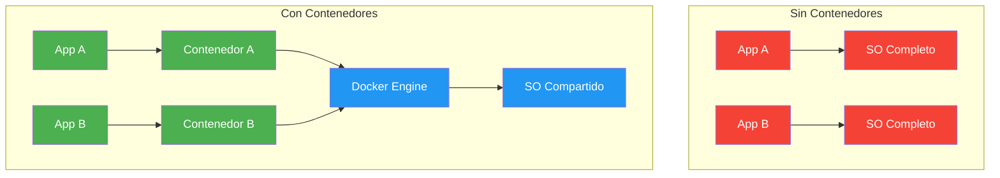

- [29. Docker y Despliegue](#29-docker-y-despliegue)
  - [29.1. Conceptos Fundamentales](#291-conceptos-fundamentales)
    - [29.1.1. Que es un Contenedor](#2911-que-es-un-contenedor)
    - [29.1.2. Ventajas de los Contenedores](#2912-ventajas-de-los-contenedores)
  - [29.2. Dockerfile](#292-dockerfile)
    - [29.2.1. Estructura del Proyecto](#2921-estructura-del-proyecto)
    - [29.2.2. Dockerfile basico](#2922-dockerfile-basico)
    - [29.2.3. Explicacion de instrucciones](#2923-explicacion-de-instrucciones)
  - [29.3. Multi-Stage Build](#293-multi-stage-build)
  - [29.4. Docker Compose](#294-docker-compose)
    - [29.4.1. docker-compose.yml completo](#2941-docker-composeyml-completo)
    - [29.4.2. Patron de dos archivos](#2942-patron-de-dos-archivos)
  - [29.5. Variables de Entorno](#295-variables-de-entorno)
  - [29.6. Health Checks](#296-health-checks)
  - [29.7. Optimizacion de Imagenes](#297-optimizacion-de-imagenes)
  - [29.8. CI/CD con GitHub Actions](#298-cicd-con-github-actions)
  - [29.9. Buenas Practicas](#299-buenas-practicas)
  - [29.10. Reto: Despliega FunkoApp con Docker](#2910-reto-despliega-funkoapp-con-docker)

---

# 29. Docker y Despliegue

> **Punto de partida:** Recuerdas cuando instalabas un programa y decia "funciona en mi ordenador"? Docker resuelve ese problema: empaqueta tu aplicacion con todo lo que necesita (runtime, librerias, configuracion) y funciona igual en cualquier lugar. Es como un contenedor de الشحن pero para codigo.

En este punto aprenderás a crear Dockerfiles optimizados, usar Docker Compose para orquestar multiples contenedores, implementar multi-stage builds y configurar CI/CD con GitHub Actions.

**Objetivos de aprendizaje:**
- Comprender que son los contenedores y por que se usan
- Crear Dockerfiles para aplicaciones ASP.NET Core
- Implementar multi-stage builds para reducir tamanio de imagenes
- Usar Docker Compose para orquestar multiples servicios
- Configurar variables de entorno y health checks
- Implementar CI/CD con GitHub Actions

## 29.1. Conceptos Fundamentales

### 29.1.1. Que es un Contenedor

Un **contenedor** es una unidad de software que incluye todo lo necesario para ejecutar una aplicacion: codigo, runtime, herramientas del sistema, librerias y configuraciones. A diferencia de las maquinas virtuales, los contenedores comparten el kernel del sistema operativo y son mas ligeros.



📌 **Ejemplo real:** Spotify usa contenedores Docker para desplegar miles de microservicios. Cada servicio esta empaquetado en su propio contenedor, lo que permite escalar solo los que necesitan mas recursos.

### 29.1.2. Ventajas de los Contenedores

| Aspecto | Beneficio |
|---------|-----------|
| **Consistencia** | Mismo entorno en desarrollo, testing y produccion |
| **Portabilidad** | Funciona en cualquier sistema con Docker |
| **Aislamiento** | Cada aplicacion tiene su propio contenedor |
| **Escalabilidad** | Facil de escalar horizontalmente |
| **Velocidad** | Arrancan en segundos, no en minutos |
| **Eficiencia** | Usan menos recursos que maquinas virtuales |

## 29.2. Dockerfile

El **Dockerfile** es un archivo de texto que contiene instrucciones para construir una imagen Docker.

### 29.2.1. Estructura del Proyecto

```
FunkoApp/
├── src/
│   └── FunkoApp/
│       ├── Program.cs
│       └── FunkoApp.csproj
├── Dockerfile
├── .dockerignore
└── docker-compose.yml
```

### 29.2.2. Dockerfile basico

```dockerfile
FROM mcr.microsoft.com/dotnet/aspnet:8.0
WORKDIR /app
COPY ./publish .
EXPOSE 80
EXPOSE 443
ENTRYPOINT ["dotnet", "FunkoApp.dll"]
```

### 29.2.3. Explicacion de instrucciones

| Instruccion | Proposito |
|-------------|-----------|
| `FROM` | Imagen base sobre la que construimos |
| `WORKDIR` | Directorio de trabajo dentro del contenedor |
| `COPY` | Copiar archivos del host al contenedor |
| `RUN` | Ejecutar comandos durante la construccion |
| `ENV` | Variables de entorno |
| `EXPOSE` | Puertos que expone el contenedor |
| `USER` | Usuario que ejecuta la aplicacion |
| `ENTRYPOINT` | Comando que se ejecuta al iniciar |
| `HEALTHCHECK` | Verificacion de salud del contenedor |

## 29.3. Multi-Stage Build

El **multi-stage build** permite construir la aplicacion en una etapa y copiar solo los archivos necesarios a una imagen final mas pequena.

```dockerfile
# ==================================================
# ETAPA 1: BUILD - Compilar la aplicacion
# ==================================================
FROM mcr.microsoft.com/dotnet/sdk:8.0 AS build
WORKDIR /src

# Restaurar dependencias
COPY ["FunkoApp/FunkoApp.csproj", "FunkoApp/"]
RUN dotnet restore "FunkoApp/FunkoApp.csproj"

# Copiar codigo fuente
COPY . .
WORKDIR "/src/FunkoApp"

# Construir
RUN dotnet build "FunkoApp.csproj" -c Release -o /app/build

# ==================================================
# ETAPA 2: PUBLISH
# ==================================================
FROM build AS publish
RUN dotnet publish "FunkoApp.csproj" -c Release -o /app/publish

# ==================================================
# ETAPA 3: RUNTIME - Imagen final
# ==================================================
FROM mcr.microsoft.com/dotnet/aspnet:8.0 AS final
WORKDIR /app

# Usuario no-root para seguridad
RUN addgroup --system --gid 1000 appgroup \
    && adduser --system --uid 1000 --ingroup appgroup --shell /bin/sh appuser

COPY --from=publish /app/publish .
RUN chown -R appuser:appgroup /app
USER appuser

EXPOSE 8080

ENV ASPNETCORE_URLS=http://+:8080
ENV ASPNETCORE_ENVIRONMENT=Production

HEALTHCHECK --interval=30s --timeout=3s --start-period=5s --retries=3 \
    CMD curl --fail http://localhost:8080/health || exit 1

ENTRYPOINT ["dotnet", "FunkoApp.dll"]
```

📌 **Ejemplo real:** La imagen de Netflix Backend usa multi-stage builds. La etapa de build tiene el SDK completo (~800MB), pero la imagen final solo tiene el runtime (~200MB). Esto reduce el tiempo de despliegue y el ataque superficial de seguridad.

### Comparacion de Tamanos

| Tipo de Build | Tamanio Aproximado |
|---------------|-------------------|
| Single-stage con SDK | ~800 MB |
| Multi-stage con aspnet | ~200 MB |
| Multi-stage con alpine | ~150 MB |

> ⚠️ **Advertencia:** Usa siempre multi-stage builds en produccion. Una imagen con el SDK incluido expone herramientas de desarrollo que no deberian estar en produccion.

## 29.4. Docker Compose

**Docker Compose** es una herramienta para definir y ejecutar aplicaciones Docker multi-contenedor usando un archivo YAML.

### 29.4.1. docker-compose.yml completo

```yaml
version: '3.8'

services:
  api:
    build:
      context: .
      dockerfile: Dockerfile
    container_name: funkoapp
    ports:
      - "8080:8080"
    environment:
      - ASPNETCORE_ENVIRONMENT=Production
      - ConnectionStrings__DefaultConnection=Host=db;Port=5432;Database=funkodb;Username=postgres;Password=${DB_PASSWORD}
      - Jwt__Secret=${JWT_SECRET}
    depends_on:
      db:
        condition: service_healthy
    restart: unless-stopped
    networks:
      - funkoapp-network
    healthcheck:
      test: ["CMD", "curl", "-f", "http://localhost:8080/health"]
      interval: 30s
      timeout: 3s
      retries: 3

  db:
    image: postgres:17-alpine
    container_name: funkoapp-postgres
    environment:
      POSTGRES_DB: funkodb
      POSTGRES_USER: postgres
      POSTGRES_PASSWORD: ${DB_PASSWORD}
    ports:
      - "5432:5432"
    volumes:
      - postgres_data:/var/lib/postgresql/data
    healthcheck:
      test: ["CMD-SHELL", "pg_isready -U postgres"]
      interval: 10s
      timeout: 5s
      retries: 5
    restart: unless-stopped
    networks:
      - funkoapp-network

volumes:
  postgres_data:

networks:
  funkoapp-network:
    driver: bridge
```

### Comandos de Docker Compose

| Comando | Descripcion |
|---------|-------------|
| `docker-compose up -d` | Iniciar todos los servicios en background |
| `docker-compose down` | Detener todos los servicios |
| `docker-compose logs -f api` | Ver logs de la API |
| `docker-compose build api` | Reconstruir imagen de la API |
| `docker-compose ps` | Ver estado de los servicios |

### 29.4.2. Patron de dos archivos

En desarrollo es comun separar la infraestructura de la API en dos archivos:

```yaml
# docker-compose.yml — Solo base de datos (para desarrollo local)
services:
  db:
    image: postgres:17-alpine
    ports:
      - "5432:5432"
    environment:
      POSTGRES_USER: admin
      POSTGRES_PASSWORD: admin123
      POSTGRES_DB: funkodb
```

```yaml
# docker-compose.api.yml — API + base de datos (para despliegue)
services:
  api:
    build: .
    ports:
      - "5000:8080"
    depends_on:
      db:
        condition: service_healthy
  db:
    image: postgres:17-alpine
    ports:
      - "5433:5432"
```

```bash
# Desarrollo: solo BD
docker compose up -d

# Despliegue: API + BD
docker compose -f docker-compose.api.yml up -d
```

> 💡 **Consejo:** Manten las versiones de imagenes consistentes en todos los compose. Ejemplo: `postgres:17-alpine`, `redis:7-alpine`.

## 29.5. Variables de Entorno

Las variables de entorno permiten configurar la aplicacion sin modificar el codigo.

### Archivo .env

```bash
# .env
DB_PASSWORD=Postgres123!
JWT_SECRET=mi-clave-secreta-produccion-muy-larga-y-segura-de-al-menos-32-caracteres
```

### Uso en docker-compose.yml

```yaml
services:
  api:
    build: .
    env_file:
      - .env
    environment:
      - ConnectionStrings__DefaultConnection=Host=postgres;Database=funkodb;Password=${DB_PASSWORD}
```

> ⚠️ **Advertencia:** Nunca subas el archivo .env al repositorio. Agregalo al `.gitignore` siempre.

### Agregar al .gitignore

```gitignore
.env
.env.local
.env.*.local
secrets.json
```

## 29.6. Health Checks

Los health checks monitorizan la salud de la aplicacion y permiten al orquestador tomar decisiones.

### Endpoint de Salud en ASP.NET Core

```csharp
builder.Services.AddHealthChecks()
    .AddDbContextCheck<FunkoDbContext>("database")
    .AddRedis(
        builder.Configuration.GetConnectionString("Redis")!,
        "redis"
    );

app.MapHealthChecks("/health");
app.MapHealthChecks("/health/ready", new HealthCheckOptions
{
    Predicate = check => check.Tags.Contains("ready")
});
```

### Healthcheck en Dockerfile

```dockerfile
HEALTHCHECK --interval=30s --timeout=3s --start-period=10s --retries=3 \
    CMD curl --fail http://localhost:8080/health || exit 1
```

### Healthcheck en docker-compose.yml

```yaml
services:
  api:
    healthcheck:
      test: ["CMD", "curl", "-f", "http://localhost:8080/health"]
      interval: 30s
      timeout: 3s
      retries: 3
      start_period: 10s
```

## 29.7. Optimizacion de Imagenes

### Usar Alpine Linux

```dockerfile
# Imagenes Alpine son mas ligeras
FROM mcr.microsoft.com/dotnet/sdk:8.0-alpine AS build
FROM mcr.microsoft.com/dotnet/aspnet:8.0-alpine AS final
```

### .dockerignore

```
.git
.gitignore
.vs
.vscode
*.suo
*.user
bin/
obj/
out/
**/*.md
**/Dockerfile*
**/docker-compose*
.env
.secrets
```

> 💡 **Consejo:** El `.dockerignore` es como el `.gitignore` pero para Docker. Excluye archivos innecesarios para reducir el tamanio de la imagen y mejorar la seguridad.

## 29.8. CI/CD con GitHub Actions

CI/CD (Continuous Integration / Continuous Deployment) automatiza el build, test y deploy de tu aplicacion.

### Workflow Completo

```yaml
name: CI/CD Pipeline

on:
  push:
    branches: [main, develop]
  pull_request:
    branches: [main]

env:
  REGISTRY: ghcr.io
  IMAGE_NAME: ${{ github.repository }}
  DOTNET_VERSION: '8.0.x'

jobs:
  build:
    name: Build
    runs-on: ubuntu-latest

    steps:
      - name: Checkout code
        uses: actions/checkout@v4

      - name: Setup .NET
        uses: actions/setup-dotnet@v4
        with:
          dotnet-version: ${{ env.DOTNET_VERSION }}

      - name: Restore dependencies
        run: dotnet restore

      - name: Build
        run: dotnet build --configuration Release --no-restore

      - name: Set up Docker Buildx
        uses: docker/setup-buildx-action@v3

      - name: Log in to Container Registry
        uses: docker/login-action@v3
        with:
          registry: ${{ env.REGISTRY }}
          username: ${{ github.actor }}
          password: ${{ secrets.GITHUB_TOKEN }}

      - name: Build and push Docker image
        uses: docker/build-push-action@v5
        with:
          context: .
          push: ${{ github.event_name == 'push' }}
          tags: |
            type=raw,value=latest,enable={{is_default_branch}}
            type=ref,event=branch

  test:
    name: Test
    needs: build
    runs-on: ubuntu-latest

    services:
      postgres:
        image: postgres:17-alpine
        env:
          POSTGRES_USER: postgres
          POSTGRES_PASSWORD: postgres
          POSTGRES_DB: funkodb
        ports:
          - 5432:5432

    steps:
      - name: Checkout code
        uses: actions/checkout@v4

      - name: Setup .NET
        uses: actions/setup-dotnet@v4
        with:
          dotnet-version: ${{ env.DOTNET_VERSION }}

      - name: Run tests
        run: |
          dotnet test \
            --configuration Release \
            --collect:"XPlat Code Coverage"
```

📌 **Ejemplo real:** Spotify ejecuta mas de 50,000 tests en cada pull request usando pipelines CI/CD similares. Si algun test falla, el PR no se puede merge.

## 29.9. Buenas Practicas

| Practica | Descripcion |
|----------|-------------|
| **Multi-stage builds** | Reducir tamanio de imagen final |
| **Usuario no-root** | Seguridad en el contenedor |
| **Variables de entorno** | Para secretos, nunca hardcodear |
| **Health checks** | Para monitorizacion y orquestacion |
| **.dockerignore** | Excluir archivos innecesarios |
| **Cache de layers** | En CI/CD para acelerar builds |
| **Imagenes Alpine** | Para reducir tamanio |
| **Persistencia de datos** | Usar volumes para bases de datos |
| **Redes aisladas** | Para seguridad entre contenedores |
| **CI/CD automatizado** | Para builds y deploys consistentes |

> ⚠️ **Advertencia:** Nunca guardes secretos en el Dockerfile o en el codigo fuente. Usa variables de entorno o archivos .env que nunca se suban al repositorio.

**Resumen del punto:**

| Concepto | Descripcion |
|----------|-------------|
| **Contenedor** | Unidad de software portable con todas las dependencias |
| **Imagen Docker** | Plantilla de solo lectura para crear contenedores |
| **Dockerfile** | Instrucciones para construir una imagen |
| **Multi-stage** | Construir en etapas para reducir tamanio final |
| **Docker Compose** | Orquestar multiples contenedores |
| **Variables de entorno** | Configurar la aplicacion sin modificar el codigo |
| **Health Check** | Verificacion de salud del contenedor |
| **CI/CD** | Automatizacion de build, test y deploy |
| **GitHub Actions** | Plataforma de CI/CD integrada en GitHub |
| **Alpine Linux** | Imagenes mas ligeras para produccion |

**¿Que viene despues?**

En la siguiente unidad veremos **Clean Architecture**: como organizar una aplicacion ASP.NET Core en capas (Domain, Application, Infrastructure, Presentation) siguiendo principios SOLID y patrones de diseño.

## 29.10. Reto: Despliega FunkoApp con Docker

> Antes de irte, despliega tu API de Funkos completamente con Docker.

### Contexto

Tu API de Funkos necesita ser desplegable en cualquier entorno usando contenedores Docker.

### Ejercicio

1. Crea un `Dockerfile` optimizado con multi-stage build
2. Crea un `docker-compose.yml` con API + PostgreSQL
3. Configura variables de entorno para secretos
4. Implementa health checks en el contenedor
5. Configura persistencia de datos con volumes
6. Crea un workflow basico de CI/CD con GitHub Actions

### Archivos Esperados

```
FunkoApp/
├── Dockerfile
├── docker-compose.yml
├── .env
├── .dockerignore
└── .github/workflows/
    └── ci-cd.yml
```

> 💡 **Consejo:** Prueba primero con `docker compose up -d` para verificar que todo funciona. Luego configura el CI/CD para automatizar el proceso.
