- [30. CQRS y MediatR](#30-cqrs-y-mediatr)
  - [30.1. ¿Qué es CQRS?](#301-qué-es-cqrs)
    - [30.1.1. Nuestro dominio: Productos, Categorías y Proveedores](#3011-nuestro-dominio-productos-categorías-y-proveedores)
    - [30.1.2. El problema tradicional](#3012-el-problema-tradicional)
    - [30.1.2. La solución CQRS](#3012-la-solución-cqrs)
    - [30.1.3. ¿Por qué separar escrituras y lecturas?](#3013-por-qué-separar-escrituras-y-lecturas)
  - [30.2. Commands y Queries](#302-commands-y-queries)
    - [30.2.1. Commands (Escrituras)](#3021-commands-escrituras)
    - [30.2.2. Queries (Lecturas)](#3022-queries-lecturas)
  - [30.3. SQL para Escrituras](#303-sql-para-escrituras)
    - [30.3.1. Modelo normalizado](#3031-modelo-normalizado)
    - [30.3.2. Producto con Categoria y Proveedor](#3032-producto-con-categoria-y-proveedor)
  - [30.4. MongoDB para Lecturas](#304-mongodb-para-lecturas)
    - [30.4.1. Documentos denormalizados](#3041-documentos-denormalizados)
    - [30.4.2. Producto con relaciones embebidas](#3042-producto-con-relaciones-embebidas)
    - [30.4.3. Otras opciones para lecturas](#3043-otras-opciones-para-lecturas)
  - [30.5. Consistencia Eventual](#305-consistencia-eventual)
    - [30.5.1. Qué es la consistencia eventual](#3051-qué-es-la-consistencia-eventual)
    - [30.5.2. Ventana de inconsistencia](#3052-ventana-de-inconsistencia)
    - [30.5.3. Cómo manejarla](#3053-cómo-manejarla)
  - [30.6. Sincronización SQL a MongoDB](#306-sincronización-sql-a-mongodb)
    - [30.6.1. El problema: ¿Qué pasa si sincronizamos TODO?](#3061-el-problema-qué-pasa-si-sincronizamos-todo)
    - [30.6.2. Enfoque 1: Sync Completo (NO recomendado)](#3062-enfoque-1-sync-completo-no-recomendado)
    - [30.6.3. Enfoque 2: Sync Incremental](#3063-enfoque-2-sync-incremental)
    - [30.6.4. Enfoque 3: Domain Events (Ideal)](#3064-enfoque-3-domain-events-ideal)
    - [30.6.5. Enfoque 4: CDC (Profesional)](#3065-enfoque-4-cdc-profesional)
    - [30.6.6. Enfoque 5: RX.NET con Observables](#3066-enfoque-5-rxnet-con-observables)
    - [30.6.7. Comparativa](#3067-comparativa)
  - [30.7. Ventajas y Desventajas](#307-ventajas-y-desventajas)
  - [30.8. Kafka: la opcion profesional](#308-kafka-la-opcion-profesional)
    - [30.8.1. ¿Qué es Kafka?](#3081-qué-es-kafka)
    - [30.8.2. ¿Qué es Debezium (CDC)?](#3082-qué-es-debezium-cdc)
    - [30.8.3. Flujo completo: PostgreSQL a Kafka a MongoDB](#3083-flujo-completo-postgresql-a-kafka-a-mongodb)
    - [30.8.4. Ventajas y desventajas de Kafka](#3084-ventajas-y-desventajas-de-kafka)
  - [30.9. MediatR: Implementando CQRS](#309-mediatr-implementando-cqrs)
    - [30.9.1. ¿Qué es MediatR?](#3091-qué-es-mediatr)
    - [30.9.2. Commands con MediatR](#3092-commands-con-mediatr)
    - [30.9.3. Queries con MediatR](#3093-queries-con-mediatr)
    - [30.9.4. Pipeline Behaviors](#3094-pipeline-behaviors)
  - [30.10. Sincronización con Domain Events y MediatR](#3010-sincronización-con-domain-events-y-mediatr)
    - [30.10.1. La idea clave: ya tienes los datos en memoria](#30101-la-idea-clave-ya-tienes-los-datos-en-memoria)
    - [30.10.2. Código de ejemplo](#30102-código-de-ejemplo)
    - [30.10.3. Ventajas de este enfoque](#30103-ventajas-de-este-enfoque)
  - [30.11. Testing de CQRS](#3011-testing-de-cqrs)
  - [30.12. Buenas Prácticas](#3012-buenas-prácticas)
  - [30.13. Reto](#3013-reto)


# 30. CQRS y MediatR

> 💡 **Punto de partida:** En una tienda online, el administrador actualiza precios y stock (escritura), pero miles de clientes buscan productos (lectura). ¿Por qué usar la misma base de datos para las dos cosas si tienen necesidades tan distintas? **CQRS** separa las lecturas de las escrituras para optimizar cada una por separado.

En este punto aprenderás a separar Commands de Queries, usar PostgreSQL para escrituras y MongoDB para lecturas, y entender la consistencia eventual.

**Objetivos de aprendizaje:**
- Entender qué es CQRS y por qué se usa
- Separar Commands (escrituras) de Queries (lecturas)
- Usar PostgreSQL normalizado para escrituras y MongoDB denormalizado para lecturas
- Implementar sincronización entre ambas bases de datos
- Comprender la consistencia eventual y sus implicaciones

## 30.1. ¿Qué es CQRS?

**CQRS** (Command Query Responsibility Segregation) es un patrón de arquitectura que separa las operaciones de **lectura** (Queries) de las de **escritura** (Commands) en modelos diferentes.

📌 Ejemplo real: **Amazon** usa CQRS. Las escrituras van a una base de datos relacional optimizada para transacciones, pero las lecturas (búsqueda de productos, catálogos) van a un sistema optimizado para búsquedas rápidas como Elasticsearch. Cada una tiene su propia base de datos.

### 30.1.1. Nuestro dominio: Productos, Categorías y Proveedores

Vamos a usar un ejemplo concreto para entender CQRS. Imagina una tienda online con estos datos:

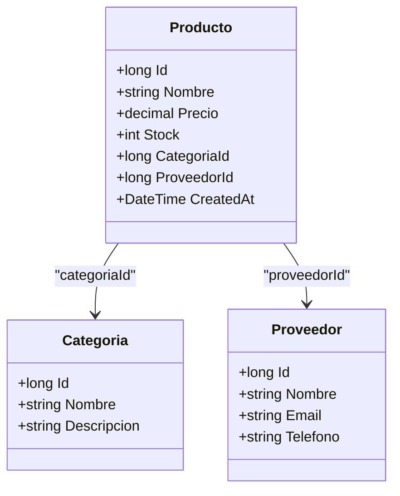

📌 Ejemplo real: **Mercado Libre** maneja millones de productos con categorías y proveedores. Cada búsqueda debe ser rápida, pero cada actualización debe ser segura y consistente.

**Modelo relacional en PostgreSQL (3 tablas):**

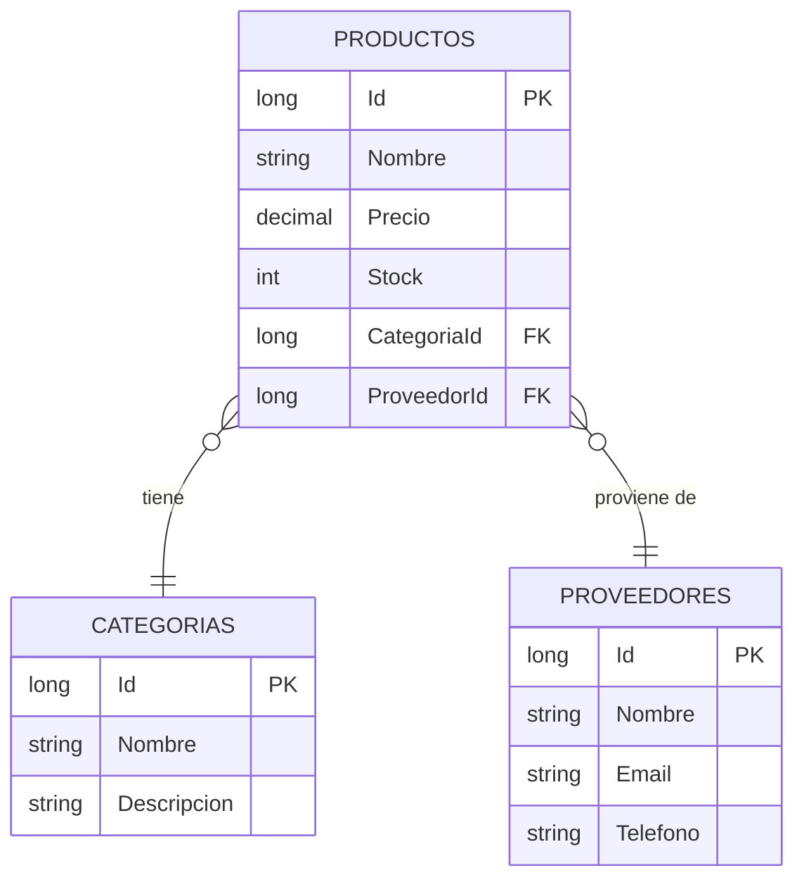

**El problema: ¿Qué pasa cuando queremos devolver un DTO con toda la info?**

Cuando un cliente pide un producto, necesita ver el nombre de la categoría y el nombre del proveedor. Pero esos datos están en **tablas diferentes**. Para devolver un DTO como este:

```json
{
    "id": 1,
    "nombre": "Teclado Mecánico",
    "precio": 89.99,
    "categoria": { "id": 1, "nombre": "Electrónica" },
    "proveedor": { "id": 5, "nombre": "Logitech" }
}
```

PostgreSQL necesita hacer **3 consultas (JOINs)**:

```sql
-- 1. Buscar el producto
SELECT * FROM Productos WHERE Id = 1;

-- 2. JOIN con Categorias
SELECT * FROM Productos p
INNER JOIN Categorias c ON p.CategoriaId = c.Id
WHERE p.Id = 1;

-- 3. JOIN con Proveedores
SELECT * FROM Productos p
INNER JOIN Proveedores pr ON p.ProveedorId = pr.Id
WHERE p.Id = 1;

-- O todo junto (pero más complejo):
SELECT p.*, c.Nombre as CatNombre, pr.Nombre as ProvNombre
FROM Productos p
INNER JOIN Categorias c ON p.CategoriaId = c.Id
INNER JOIN Proveedores pr ON p.ProveedorId = pr.Id
WHERE p.Id = 1;
```

**¿Cuánto cuesta esto?**

| Operación | Tiempo estimado | Memoria |
|-----------|----------------|---------|
| SELECT de 1 producto | 1ms | Baja |
| JOIN con Categorias | +2ms | Media |
| JOIN con Proveedores | +2ms | Media |
| **Total** | **~5ms** | **Media** |

Con 100 productos, el coste crece:

| Productos | JOINs totales | Tiempo estimado |
|-----------|---------------|-----------------|
| 1 | 3 | ~5ms |
| 10 | 30 | ~20ms |
| 100 | 300 | ~100ms |
| 1000 | 3000 | ~500ms |

📌 Ejemplo real: **Amazon** tiene millones de productos. Si cada búsqueda hiciera 3 JOINs por producto, las consultas tardarían segundos en vez de milisegundos.

> ⚠️ **Advertencia — LINQ oculta el coste real:** Cuando usas LINQ con EF Core, el código parece sencillo:
> ```csharp
> var productos = await context.Productos
>     .Include(p => p.Categoria)
>     .Include(p => p.Proveedor)
>     .ToListAsync();
> ```
> Pero por debajo, EF Core está generando **3 consultas SQL** (1 SELECT + 2 JOINs). El ORM oculta la complejidad.

**¿Cómo se hacen estas consultas en LINQ?**

Hay 3 formas de cargar datos relacionados en EF Core:

**1. Eager Loading (Include):** Carga todo de golpe con JOINs
```csharp
var productos = await context.Productos
    .Include(p => p.Categoria)      // JOIN con Categorias
    .Include(p => p.Proveedor)      // JOIN con Proveedores
    .ToListAsync();                 // Genera 1 consulta con 2 JOINs
```

**2. Lazy Loading:** Carga cada relación bajo demanda (N+1 queries)
```csharp
var productos = await context.Productos.ToListAsync(); // 1 consulta
foreach (var p in productos)
{
    var cat = p.Categoria;  // Cada acceso = 1 consulta nueva
    var prov = p.Proveedor; // Cada acceso = 1 consulta nueva
}
// 1 + N + N = 2N+1 consultas
```

**3. Explicit Loading:** Carga manualmente bajo demanda
```csharp
var productos = await context.Productos.ToListAsync(); // 1 consulta
foreach (var p in productos)
{
    await context.Entry(p).Reference(x => x.Categoria).LoadAsync(); // 1 por producto
}
```

> 📝 **Nota:** Si tu DTO "monta" datos de 3 tablas (Producto + Categoria + Proveedor), **siempre** vas a leer de las 3 tablas. No hay forma de evitarlo. La única diferencia es cuándo y cómo se hacen esas lecturas. Por eso CQRS es útil: separar las lecturas (que necesitan JOINs) de las escrituras (que no los necesitan).

### 30.1.2. El problema tradicional

En una arquitectura tradicional (CRUD), la misma entidad sirve para leer y escribir. Esto crea varios problemas:

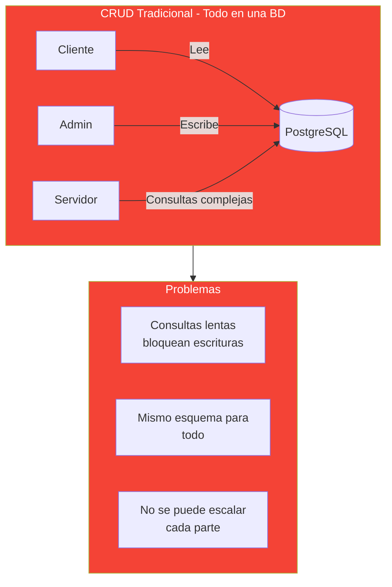

📌 Ejemplo real: **Netflix** tenía este problema. Sus consultas de catálogo (millones de series) eran lentas porque la misma BD manejaba escrituras de configuración. Al separar CQRS, las lecturas se volvieron 10x más rápidas.

| Problema | Impacto | Ejemplo |
|----------|---------|---------|
| **Consultas lentas** | Los clientes esperan segundos | Buscar "teclado" tarda 3s en vez de 200ms |
| **Mismo esquema** | Compromisos en diseño | No puedes denormalizar para lecturas sin afectar escrituras |
| **No escala** | Crecimiento limitado | No puedes añadir nodos de solo lectura |
| **Bloqueos** | Escrituras bloquean lecturas | Un UPDATE bloquea las consultas |

### 30.1.2. La solución CQRS

CQRS resuelve esto separando en dos modelos optimizados para cada caso:

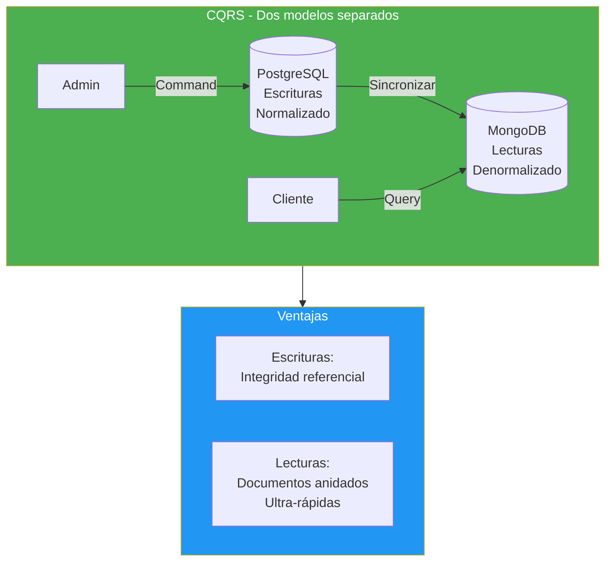

📌 Ejemplo real: **LinkedIn** usa CQRS. Cuando actualizas tu perfil (escritura), va a PostgreSQL. Cuando alguien busca tu perfil (lectura), va a un sistema optimizado para búsquedas rápidas.

### 30.1.3. ¿Por qué separar escrituras y lecturas?

Para entender por qué CQRS es útil, necesitas comprender el **coste real** de cada operación:

#### El coste de las claves foráneas y los JOINs

En PostgreSQL normalizado, cuando consultas un producto con su categoría y proveedor, el motor de BD debe:

1. **Buscar el producto** en la tabla `Productos`
2. **Hacer JOIN** con `Categorias` para obtener el nombre
3. **Hacer JOIN** con `Proveedores` para obtener el nombre
4. **Cargar todo en memoria** para devolver el resultado

```sql
-- Consulta típica en PostgreSQL normalizado
SELECT p.Nombre, p.Precio, c.Nombre, pr.Nombre
FROM Productos p
INNER JOIN Categorias c ON p.CategoriaId = c.Id
INNER JOIN Proveedores pr ON p.ProveedorId = pr.Id
WHERE p.Precio > 50;
```

**Problemas:**
- Cada JOIN **multiplica** el tiempo de ejecución
- Con 3 tablas y 10.000 productos, la consulta puede tardar **50-100ms**
- Con millones de registros, puede tardar **segundos**
- Cada JOIN consume **memoria** en el servidor de BD

#### El coste de tener dos bases de datos

CQRS añade complejidad:

| Coste | Descripción |
|-------|-------------|
| **Mantenimiento** | Dos sistemas que actualizar |
| **Sincronización** | BackgroundService adicional |
| **Consistencia eventual** | Los datos no están al instante sincronizados |
| **Operaciones** | Dos servidores, dos backups, dos monitoreos |
| **Coste económico** | Dos servidores = el doble de coste |

#### ¿Cuándo merece la pena?

| Escenario | CQRS | Por qué |
|-----------|------|---------|
| **API con miles de lecturas por escritura** | ✅ Sí | Las lecturas se vuelven 10x más rápidas |
| **Consultas complejas con muchos JOINs** | ✅ Sí | MongoDB resuelve todo en un documento |
| **Escalabilidad independiente** | ✅ Sí | Puedes añadir nodos de solo lectura |
| **API simple, pocos usuarios** | ❌ No | La complejidad no compensa |
| **Datos que cambian muy rápido** | ⚠️ Dependiendo | La consistencia puede ser un problema |
| **Cache ya resuelve el problema** | ⚠️ Dependiendo | Redis puede ser suficiente |

📌 Ejemplo real: **Amazon** recibe millones de lecturas (buscar productos) por cada escritura (actualizar precio). CQRS les permite escalar las lecturas independientemente de las escrituras.

#### Comparativa detallada

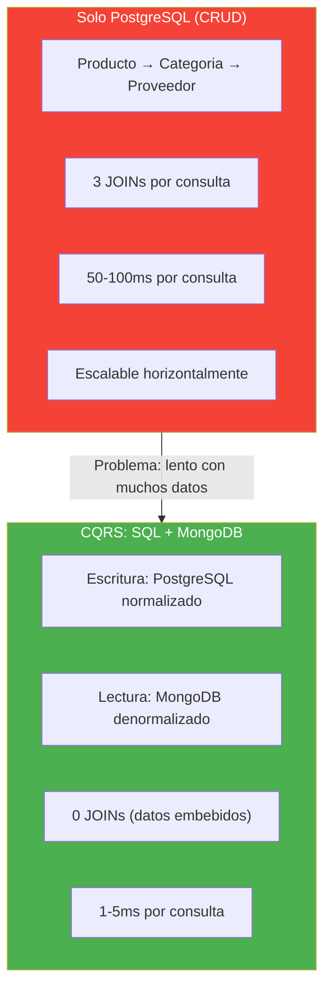

> 📝 **Nota:** CQRS no es la solución para todo. Si tu API tiene 100 usuarios y 50 productos, la complejidad adicional no compensa. CQRS brilla cuando tienes **miles de lecturas por escritura** y necesitas **escalar las lecturas** independientemente.

## 30.2. Commands y Queries

### 30.2.1. Commands (Escrituras)

Un **Command** es una operación que modifica el estado del sistema. Siempre devuelve `true/false` o el objeto creado.

| Command | Qué hace | Ejemplo HTTP |
|---------|----------|--------------|
| `CreateProducto` | Crea un nuevo producto | POST /api/productos |
| `UpdateProducto` | Actualiza un producto existente | PUT /api/productos/1 |
| `DeleteProducto` | Elimina un producto | DELETE /api/productos/1 |

```csharp
// Command: crear producto
public record CreateProductoCommand(
    string Nombre,
    decimal Precio,
    long CategoriaId,
    long ProveedorId
);
```

### 30.2.2. Queries (Lecturas)

Una **Query** es una operación que lee datos sin modificarlos. Devuelve el objeto o una lista.

| Query | Qué hace | Ejemplo HTTP |
|-------|----------|--------------|
| `GetProductoById` | Obtiene un producto por ID | GET /api/productos/1 |
| `GetAllProductos` | Lista todos los productos | GET /api/productos |
| `SearchProductos` | Busca productos | GET /api/productos/search?q=teclado |

```csharp
// Query: buscar productos
public record SearchProductosQuery(string Termino);
```

## 30.3. SQL para Escrituras

### 30.3.1. Modelo normalizado

Las escrituras usan PostgreSQL **normalizado** para garantizar consistencia e integridad referencial:

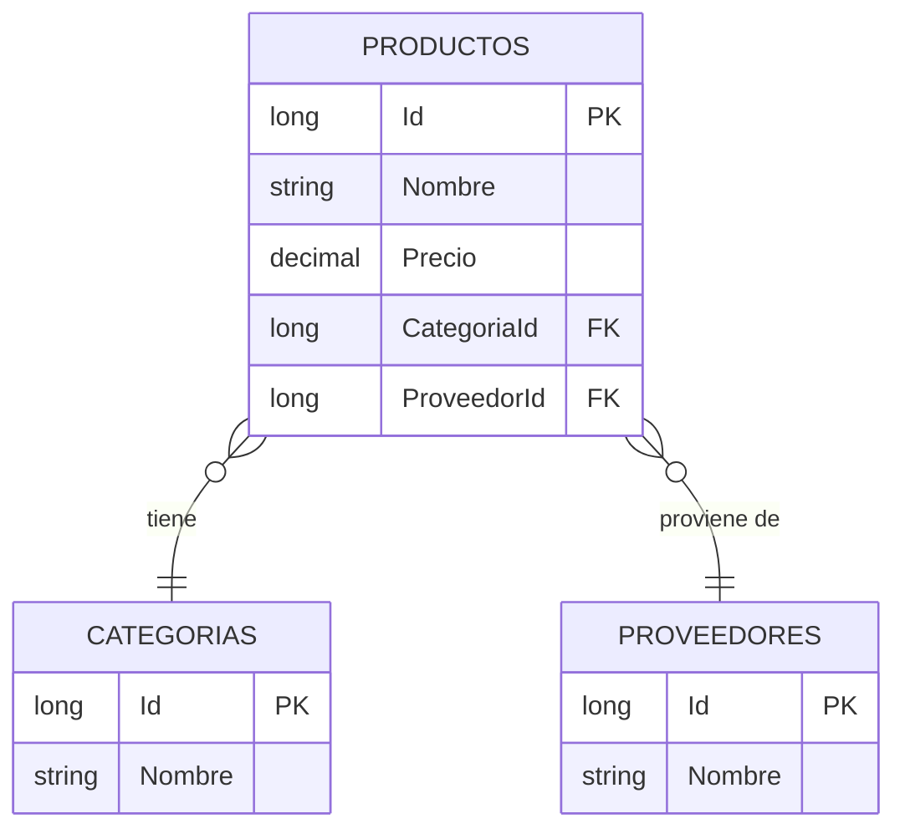

📌 Ejemplo real: **Amazon** almacena productos, categorías y proveedores en tablas separadas normalizadas. Cuando un proveedor cambia de nombre, solo se actualiza una fila en la tabla `Proveedores`.

### 30.3.2. Producto con Categoria y Proveedor

```csharp
// Modelo normalizado en PostgreSQL
public class Producto
{
    public long Id { get; set; }
    public string Nombre { get; set; } = string.Empty;
    public decimal Precio { get; set; }
    public long CategoriaId { get; set; }
    public Categoria Categoria { get; set; } = null!;
    public long ProveedorId { get; set; }
    public Proveedor Proveedor { get; set; } = null!;
}

public class Categoria
{
    public long Id { get; set; }
    public string Nombre { get; set; } = string.Empty;
}

public class Proveedor
{
    public long Id { get; set; }
    public string Nombre { get; set; } = string.Empty;
}
```

❌ **MALO**: Guardar el nombre de la categoría directamente en el producto:

```csharp
public class Producto
{
    public string NombreCategoria { get; set; } = string.Empty; // Duplicado
}
// Si cambia el nombre de la categoría, hay que actualizar TODOS los productos
```

✅ **BUENO**: Usar claves foráneas y relaciones:

```csharp
public class Producto
{
    public long CategoriaId { get; set; } // Referencia, no duplicado
    public Categoria Categoria { get; set; } = null!;
}
```

## 30.4. MongoDB para Lecturas

### 30.4.1. Documentos denormalizados

Las lecturas usan MongoDB **desnormalizado** con documentos que contienen toda la información anidada:

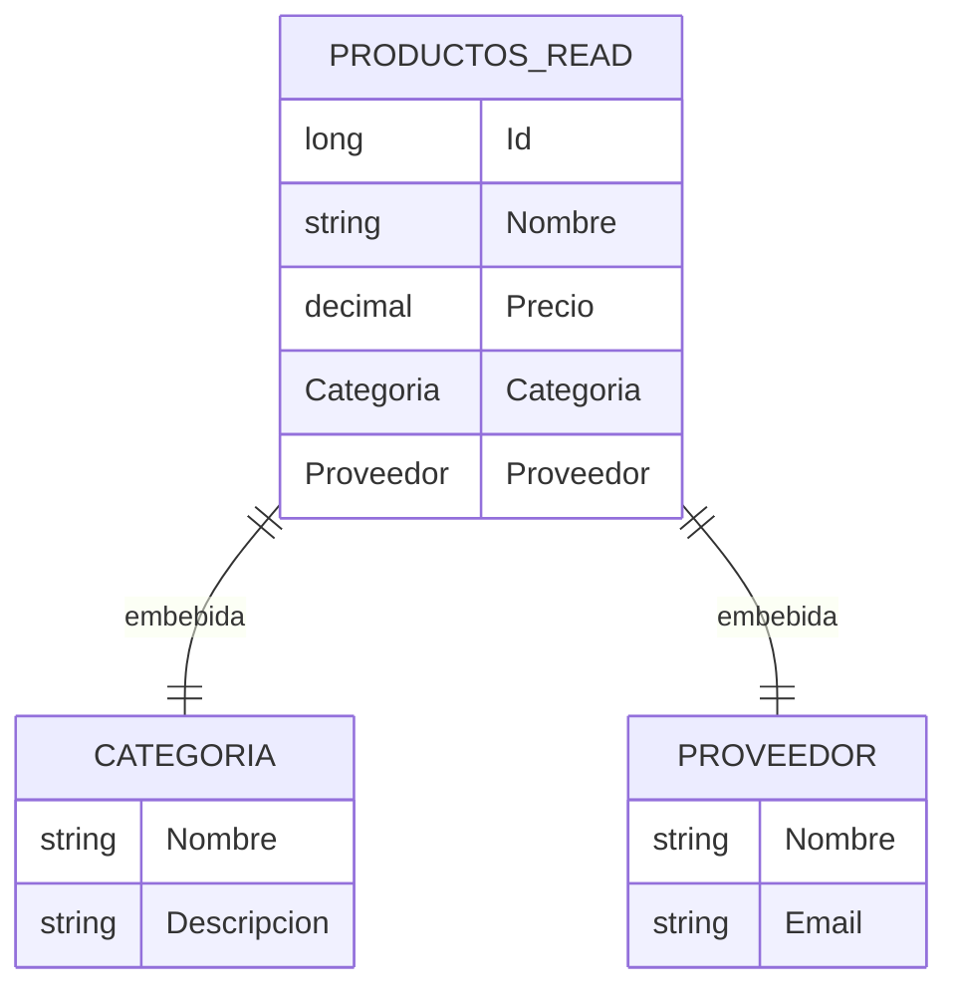

📌 Ejemplo real: **Instagram** almacena posts con el perfil del usuario embebido. Cuando ves un post, no necesitas hacer JOIN con la tabla de usuarios: todo está en el mismo documento.

### 30.4.2. Producto con relaciones embebidas

```csharp
// Modelo denormalizado en MongoDB
public class ProductoRead
{
    public long Id { get; set; }
    public string Nombre { get; set; } = string.Empty;
    public decimal Precio { get; set; }
    public CategoriaRead Categoria { get; set; } = null!;
    public ProveedorRead Proveedor { get; set; } = null!;
    public DateTime SyncAt { get; set; } // Última sincronización
}

public class CategoriaRead
{
    public long Id { get; set; }
    public string Nombre { get; set; } = string.Empty;
}

public class ProveedorRead
{
    public long Id { get; set; }
    public string Nombre { get; set; } = string.Empty;
}
```

```json
{
    "_id": ObjectId("..."),
    "id": 1,
    "nombre": "Teclado Mecánico",
    "precio": 89.99,
    "categoria": {
        "id": 1,
        "nombre": "Electrónica"
    },
    "proveedor": {
        "id": 5,
        "nombre": "Logitech"
    },
    "syncAt": "2026-09-22T10:00:00Z"
}
```

### 30.4.3. Otras opciones para lecturas

MongoDB es solo **una opción**. También puedes usar:

| Opción | Ventaja | Cuándo usar |
|--------|---------|-------------|
| **MongoDB** | Documentos flexibles, búsquedas rápidas | Datos anidados, catálogos |
| **Elasticsearch** | Búsquedas full-text avanzadas | Búsqueda de texto libre |
| **Redis** | Ultra-rápido, caché | Datos que cambian poco |
| **Vistas materializadas SQL** | Simple, misma BD | Consultas precalculadas |
| **Apache Solr** | Búsquedas complejas | E-commerce grande |

📌 Ejemplo real: **Netflix** usa MongoDB para el catálogo de contenido (documentos anidados con temporadas, episodios, actores) pero Elasticsearch para las búsquedas de texto.

## 30.5. Consistencia Eventual

### 30.5.1. Qué es la consistencia eventual

La **consistencia eventual** significa que después de una escritura, las lecturas no reflejan el cambio **inmediatamente**. Hay una **ventana de inconsistencia** donde los datos están desincronizados.

📌 Ejemplo real: Cuando publicas una foto en **Instagram**, tus seguidores no la ven al instante. Hay un pequeño retraso (segundos o minutos) mientras el sistema sincroniza los datos entre servidores. Eso es consistencia eventual.

### 30.5.2. Ventana de inconsistencia

El **SyncService** es el componente que se encarga de sincronizar datos entre PostgreSQL y MongoDB. Puede funcionar de diferentes maneras:

| Tipo de SyncService | Cómo funciona | Ejemplo |
|---------------------|---------------|---------|
| **Polling** | Consulta cada X tiempo | `Task.Delay(60s)` |
| **Domain Events** | Escucha cada evento de cambio | `OnProductoCreado` |
| **CDC** | Lee el log de la BD | Debezium + Kafka |
| **RX.NET** | Observable reactivo | `Subject<T>.Throttle(30s)` |

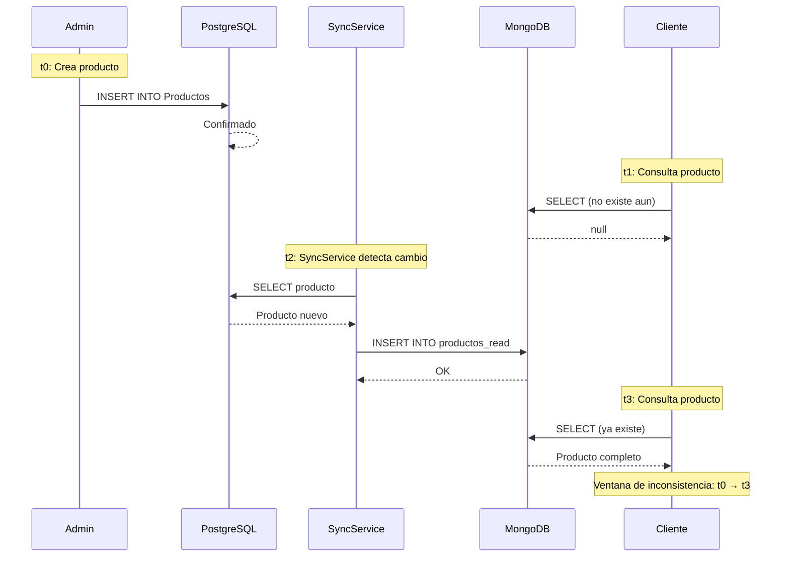

### 30.5.3. Cómo manejarla

| Estrategia | Descripción |
|------------|-------------|
| **Mostrar timestamp** | Indicar "datos actualizados hace X min" |
| **Forzar refresh** | Botón para recargar datos manualmente |
| **Sync más rápido** | Usar Domain Events en vez de polling |
| **Cache corto** | TTL bajo en la capa de lectura |
| **Aceptar la latencia** | Si la latencia es aceptable, no hacer nada |

❌ **MALO**: Mentir al usuario diciendo que los datos están actualizados:

```csharp
// Si el sync tarda, el usuario cree que el cambio fue inmediato
return Ok(new { message = "Producto creado correctamente" });
```

✅ **BUENO**: Informar sobre la sincronización:

```csharp
return Ok(new { 
    message = "Producto creado correctamente",
    syncNote = "Los cambios serán visibles en breve"
});
```

## 30.6. Sincronización SQL a MongoDB

El objetivo de la sincronización es **reducir la latencia** de la consistencia eventual. Cuanto más rápido sincronicemos, menor será la ventana de inconsistencia.

La sincronización es el corazón de CQRS. Sin ella, las lecturas mostrarían datos obsoletos.

### 30.6.1. El problema: ¿Qué pasa si sincronizamos TODO?

Si cada minuto leemos **todos** los productos de PostgreSQL, hacemos JOINs con Categorías y Proveedores, y reescribimos todo en MongoDB...

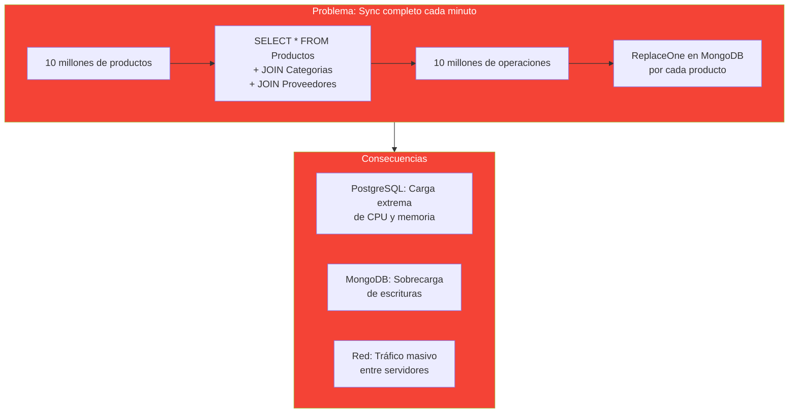

📌 Ejemplo real: Si **Amazon** sincronizara todos sus millones de productos cada minuto, sus servidores de BD colapsarían en segundos.

| Consecuencia | Impacto |
|--------------|---------|
| **CPU SQL** | 100% durante la sync |
| **Memoria SQL** | Carga millones de registros en RAM |
| **CPU MongoDB** | Sobrecarga de escrituras |
| **Red** | Tráfico masivo entre servidores |
| **Latencia** | La API se ralentiza durante la sync |

### 30.6.2. Enfoque 1: Sync Completo (NO recomendado)

Lee **todos** los registros, los transforma y los reescribe en MongoDB.

**Algoritmo:**
```
1. Cada 60 segundos:
   a. SELECT * FROM Productos (todos)
   b. JOIN con Categorias (para cada producto)
   c. JOIN con Proveedores (para cada producto)
   d. Para CADA producto (10 millones):
      - Crear documento denormalizado
      - ReplaceOne en MongoDB (upsert)
   e. Guardar timestamp de sync
```

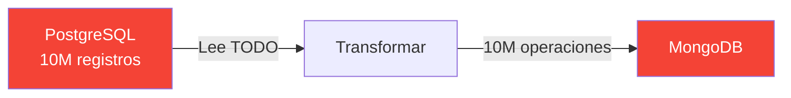

| Pros | Contras |
|------|---------|
| Simple de implementar | Destroza SQL y MongoDB |
| Siempre consistente | No escala con millones de registros |
| Sin código adicional | Latencia de 1-5 minutos |

### 30.6.3. Enfoque 2: Sync Incremental

Solo sincroniza los registros que **cambiaron** desde la última sync. Usa el campo `UpdatedAt` como marca de agua.

**Algoritmo:**
```
1. Leer LastSyncTime de MongoDB
2. SELECT * FROM Productos WHERE UpdatedAt > LastSyncTime
3. Para CADA producto cambiado (ej: 3 de 10M):
   a. Crear documento denormalizado
   b. ReplaceOne en MongoDB (upsert)
4. Actualizar LastSyncTime en MongoDB
```

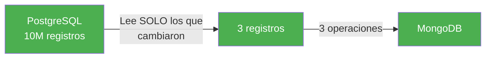

| Pros | Contras |
|------|---------|
| Rápido (solo 3 ops en vez de 10M) | Sigue siendo polling |
| Eficiente en recursos | Latencia de 1 minuto |
| Escala con millones de registros | Si nadie cambia nada, desperdicia una consulta |

### 30.6.4. Enfoque 3: Domain Events (Ideal)

Cuando se crea/modifica/borra, se publica un evento. No hay polling.

**Algoritmo:**
```
1. Admin crea producto → Handler ejecuta Create
2. Handler publica evento "ProductoCreado" con el ID
3. SyncHandler escucha el evento
4. SyncHandler lee SOLO ese producto de PostgreSQL (con JOINs)
5. SyncHandler crea documento denormalizado
6. SyncHandler escribe en MongoDB (1 operación)
```

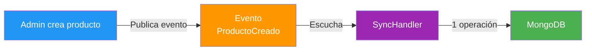

| Pros | Contras |
|------|---------|
| Tiempo real (segundos) | Más código |
| No desperdicia recursos | Necesita patrón de eventos |
| Escala perfectamente | Complejidad adicional |

### 30.6.5. Enfoque 4: CDC (Profesional)

Change Data Capture captura cambios a nivel de base de datos con Kafka + Debezium.

**Algoritmo:**
```
1. Admin crea producto → PostgreSQL escribe en WAL (Write-Ahead Log)
2. Debezium lee el WAL en tiempo real
3. Debezium publica evento a Kafka
4. Consumer escucha Kafka
5. Consumer lee el producto de PostgreSQL (con JOINs)
6. Consumer escribe en MongoDB (1 operación)
```

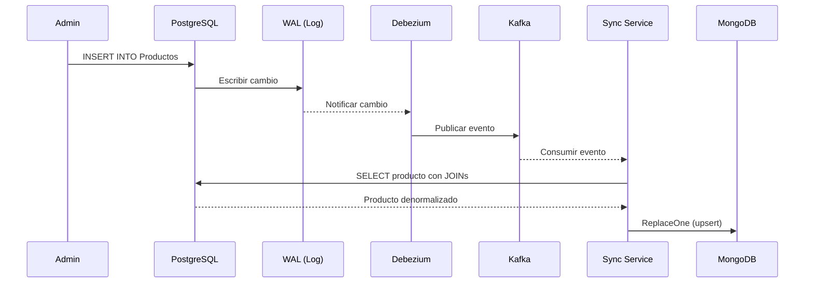

| Pros | Contras |
|------|---------|
| Latencia < 1s | Necesita Kafka + Debezium |
| Escalable | Complejo de configurar |
| No necesita código | Coste de infraestructura |

### 30.6.6. Enfoque 5: RX.NET con Observables

Usa programación reactiva para escuchar cambios en tiempo real. Cuando se produce un cambio, se notifica inmediatamente.

**Algoritmo:**
```
1. ProductoService crea/modifica/borra producto
2. ProductoService publica cambio en Subject<Producto>
3. ReactiveSyncService escucha el Subject
4. Throttle de 30 segundos (esperar 30s de calma)
5. Cuando hay cambio, lee ese producto de PostgreSQL (con JOINs)
6. Crea documento denormalizado
7. Escribe en MongoDB (1 operación)
```

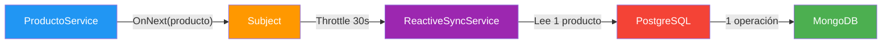

| Pros | Contras |
|------|---------|
| Reactivo (no polling) | Más complejo de entender |
| Latencia baja | Necesita programación reactiva |
| Throttle agrupa cambios | Más código que Domain Events |

### 30.6.7. Comparativa

| Criterio | Sync Completo | Sync Incremental | Domain Events | CDC | RX.NET |
|----------|---------------|------------------|---------------|-----|--------|
| **Eficiencia** | Mala | Buena | Excelente | Excelente | Excelente |
| **Latencia** | 1-5 min | 1 min | Segundos | < 1s | Segundos |
| **Escalabilidad** | No escala | Escala | Escala | Escala mucho | Escala |
| **Complejidad** | Baja | Baja | Media | Alta | Media |
| **Coste** | Alto (recursos) | Bajo | Bajo | Medio | Bajo |

> 📝 **Nota:** Cada enfoque tiene sus ventajas y desventajas. Elige según la escala y complejidad de tu aplicación.

## 30.7. Ventajas y Desventajas

| Ventaja | Desventaja |
|---------|------------|
| Lecturas ultra-rápidas | Complejidad de dos BDs |
| Escrituras optimizadas | Consistencia eventual |
| Cada parte escala por separado | Sincronización adicional |
| Modelos optimizados para cada caso | Más código y mantenimiento |

## 30.8. Kafka: la opción profesional

**Apache Kafka** es un sistema de streaming de eventos usado en producción para sincronizar datos entre sistemas. En lugar de polling, Kafka recibe eventos de cambios y los propaga a los consumidores.

### 30.8.1. ¿Qué es Kafka?

Kafka es como una **cola de mensajes distribuida**. Cuando algo cambia en PostgreSQL, Kafka recibe un mensaje y lo propaga a todos los sistemas que estén escuchando.

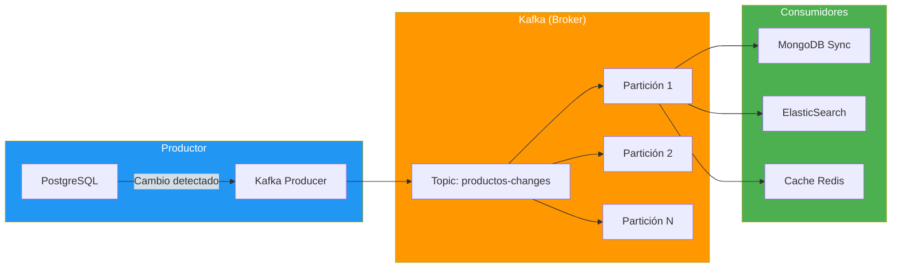

📌 Ejemplo real: **LinkedIn** usa Kafka para sincronizar datos entre cientos de microservicios. Cuando actualizas tu perfil, el evento viaja por Kafka y actualiza ElasticSearch, caches y sistemas de recomendación.

### 30.8.2. ¿Qué es Debezium (CDC)?

**Debezium** es una herramienta de **Change Data Capture** que lee el **WAL** (Write-Ahead Log) de PostgreSQL en tiempo real.

**¿Qué es el WAL?** Es el log de transacciones de PostgreSQL. Cada vez que modificas datos, PostgreSQL escribe primero el cambio en el WAL (para seguridad) y luego lo aplica a las tablas. Debezium lee ese WAL.

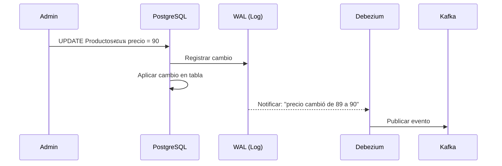

📌 Ejemplo real: **Amazon** usa Debezium para capturar cambios en sus bases de datos de productos. Cada vez que un vendedor actualiza un precio, Debezium lo detecta y propaga el cambio a sistemas de búsqueda y caché.

### 30.8.3. Flujo completo: PostgreSQL a Kafka a MongoDB

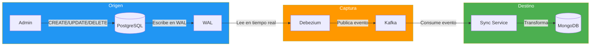

### 30.8.4. Ventajas y desventajas de Kafka

| Ventaja | Desventaja |
|---------|------------|
| Latencia menor a 1 segundo | Complejo de configurar |
| Escalable: maneja millones de eventos | Necesita infraestructura adicional |
| No necesita código de sincronización | Coste de servidores Kafka + Debezium |
| Desacopla productores de consumidores | Curva de aprendizaje pronunciada |
| Persiste eventos (no se pierden) | Más difícil de debuggear |

> 📝 **Nota:** Kafka es una herramienta profesional. Para aprender, primero domina los conceptos de CQRS con las opciones más simples.

## 30.9. MediatR: Implementando CQRS

### 30.9.1. ¿Qué es MediatR?

**MediatR** es una librería de .NET que implementa el patrón **Mediator**. En CQRS, MediatR separa quién envía un command/query (el controller) de quién lo procesa (el handler). Esto desacopla completamente las capas.

📌 Ejemplo real: **eBay** usa un patrón similar. Cuando un vendedor actualiza un producto, el controller solo envía un `UpdateProductCommand`. MediatR se encarga de buscar el handler correcto, ejecutar la lógica y devolver el resultado. El controller no sabe nada de la implementación.

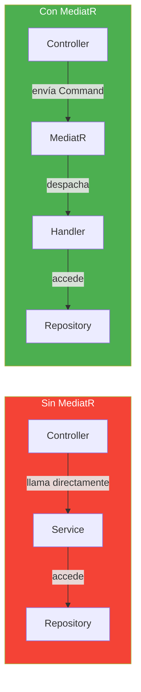

**Instalación:**

```bash
dotnet add package MediatR
dotnet add package MediatR.Extensions.Microsoft.DependencyInjection
```

### 30.9.2. Commands con MediatR

Un **Command** es un objeto que representa una intención de modificar datos. MediatR lo envía al **Handler** correspondiente.

```csharp
// Command: representa la intención de crear un producto
public record CreateProductoCommand(
    string Nombre,
    decimal Precio,
    long CategoriaId,
    long ProveedorId
) : IRequest<Producto>;
```

```csharp
// Handler: ejecuta la lógica del command
public class CreateProductoHandler(
    IProductoRepository repository,
    IMediator mediator) : IRequestHandler<CreateProductoCommand, Producto>
{
    public async Task<Producto> Handle(
        CreateProductoCommand request,
        CancellationToken cancellationToken)
    {
        var producto = new Producto
        {
            Nombre = request.Nombre,
            Precio = request.Precio,
            CategoriaId = request.CategoriaId,
            ProveedorId = request.ProveedorId
        };

        var creado = repository.Add(producto);

        // Publicar evento para sincronización
        await mediator.Publish(new ProductoCreadoEvent(creado.Id), cancellationToken);

        return creado;
    }
}
```

```csharp
// En el Controller
[HttpPost]
public async Task<IActionResult> Create([FromBody] CreateProductoInput input)
{
    var command = new CreateProductoCommand(
        input.Nombre, input.Precio, input.CategoriaId, input.ProveedorId);
    
    var producto = await _mediator.Send(command);
    return CreatedAtAction(nameof(GetById), new { id = producto.Id }, producto);
}
```

### 30.9.3. Queries con MediatR

Una **Query** es un objeto que representa una intención de leer datos.

```csharp
// Query: representa la intención de buscar productos
public record SearchProductosQuery(string Termino) : IRequest<List<Producto>>;
```

```csharp
// Handler
public class SearchProductosHandler(
    IProductoReadRepository repository) : IRequestHandler<SearchProductosQuery, List<Producto>>
{
    public Task<List<Producto>> Handle(
        SearchProductosQuery request,
        CancellationToken cancellationToken)
    {
        return repository.SearchAsync(request.Termino, cancellationToken);
    }
}
```

### 30.9.4. Pipeline Behaviors

Los **Behaviors** son middleware que se ejecutan antes/después de cada handler. Útiles para logging, validación, caching, etc.

```csharp
// Logging Behavior
public class LoggingBehavior<TRequest, TResponse>(
    ILogger<LoggingBehavior<TRequest, TResponse>> logger)
    : IPipelineBehavior<TRequest, TResponse>
    where TRequest : IRequest<TResponse>
{
    public async Task<TResponse> Handle(
        TRequest request,
        RequestHandlerDelegate<TResponse> next,
        CancellationToken cancellationToken)
    {
        logger.LogInformation("Handling {RequestType}", typeof(TRequest).Name);
        var response = await next();
        logger.LogInformation("Handled {ResponseType}", typeof(TResponse).Name);
        return response;
    }
}
```

📌 Ejemplo real: **Uber** usa behaviors para validar que el conductor tenga licencia antes de procesar un viaje. El behavior se ejecuta antes del handler y verifica los permisos.

```csharp
[Test]
public async Task Sync_ProductoCreado_SeSincronizaMongoDB()
{
    // Arrange
    var producto = new Producto { Nombre = "Teclado", Precio = 89.99m, CategoriaId = 1 };
    await sqlContext.Productos.AddAsync(producto);
    await sqlContext.SaveChangesAsync();

    // Act
    await syncService.SyncProductosAsync();

    // Assert
    var read = await mongoContext.Productos.FirstOrDefaultAsync(p => p.Id == producto.Id);
    read.Should().NotBeNull();
    read!.Nombre.Should().Be("Teclado");
    read.Categoria.Should().NotBeNull();
}
```

## 30.10. Sincronización con Domain Events y MediatR

En la sección 30.6 vimos que los Domain Events son una opción para sincronizar. Ahora veamos cómo implementarlos con MediatR, que ya usamos para CQRS.

### 30.10.1. La idea clave: ya tienes los datos en memoria

Cuando el handler de un Command crea/modifica un producto, **ya tiene el objeto en memoria**. No necesitas hacer `SELECT` otra vez. Solo mapeas el objeto al formato documento y lo escribes en MongoDB.

> 📝 **Nota sobre tiempos:** El evento se publica **inmediatamente** después de la escritura. Pero la consistencia eventual sigue existiendo: el tiempo que tarda el SyncHandler en **procesar** el evento y **escribir** en MongoDB. Con Domain Events, esa ventana se reduce a **segundos** en vez de minutos.

**Algoritmo:**
```
1. Admin crea producto → CreateProductoCommand
2. Handler ejecuta: producto = repository.Add(dto.ToModel())
3. Handler TIENE el objeto producto en memoria (ya lo creó)
4. Handler publica evento: mediator.Publish(new ProductoCreadoEvent(producto))
5. SyncHandler recibe el evento CON el objeto
6. SyncHandler transforma a formato documento (sin JOINs)
7. SyncHandler escribe en MongoDB (1 operación)
```

**Comparación con polling:**

| | Polling (BackgroundService) | Domain Events |
|--|----------------------------|---------------|
| **¿Cuándo consulta SQL?** | Cada X tiempo | Solo cuando hay cambio |
| **¿Cuántas consultas?** | Todas las tablas (JOINs) | Ya tiene los datos en memoria |
| **¿Cuándo se ejecuta?** | Cada 60 segundos | Instantáneamente |
| **Recursos** | Consume CPU SQL periódicamente | No consume nada extra |

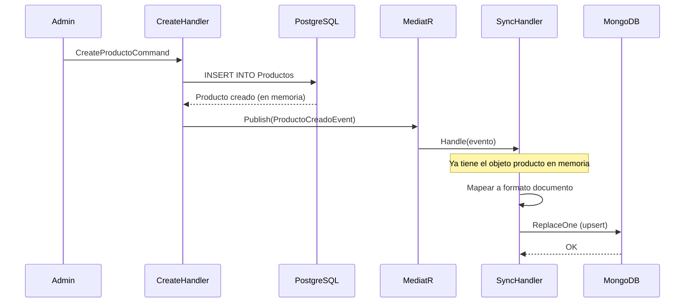

### 30.10.2. Código de ejemplo

**El Command Handler publica el evento:**

```csharp
public class CreateProductoHandler(
    IProductoRepository repository,
    IMediator mediator) : IRequestHandler<CreateProductoCommand, Result<ProductoDto, DomainError>>
{
    public async Task<Result<ProductoDto, DomainError>> Handle(
        CreateProductoCommand request, CancellationToken cancellationToken)
    {
        // 1. Crear producto en PostgreSQL
        var producto = new Producto
        {
            Nombre = request.Dto.Nombre,
            Precio = request.Dto.Precio,
            CategoriaId = request.Dto.CategoriaId,
            CreatedAt = DateTime.UtcNow
        };

        var creado = repository.Add(producto);

        // 2. Publicar evento CON el objeto (ya está en memoria)
        await mediator.Publish(new ProductoCreadoEvent(creado), cancellationToken);

        return Result.Success<ProductoDto, DomainError>(creado.ToDto());
    }
}
```

**El SyncHandler escucha y sincroniza:**

```csharp
public class SyncProductoHandler(
    MongoDbContext mongoContext) : INotificationHandler<ProductoCreadoEvent>
{
    public async Task Handle(ProductoCreadoEvent notification, CancellationToken cancellationToken)
    {
        // 1. Recibe el objeto directamente (sin SELECT)
        var producto = notification.Producto;

        // 2. Mapear a formato documento
        var read = new ProductoRead
        {
            Id = producto.Id,
            Nombre = producto.Nombre,
            Precio = producto.Precio,
            Categoria = new CategoriaRead
            {
                Id = producto.CategoriaId,
                Nombre = producto.Categoria?.Nombre ?? ""
            },
            SyncAt = DateTime.UtcNow
        };

        // 3. Escribir en MongoDB (1 operación)
        await mongoContext.Productos
            .Where(p => p.Id == producto.Id)
            .ExecuteDeleteAsync(cancellationToken);

        mongoContext.Productos.Add(read);
        await mongoContext.SaveChangesAsync(cancellationToken);
    }
}
```

### 30.10.3. Ventajas de este enfoque

- **0 consultas SQL adicionales**: El handler ya tiene el objeto en memoria
- **Tiempo real**: Sincronización instantánea
- **Simple**: Solo handler + evento, sin configurar intervalos
- **Integrado**: Usa MediatR que ya tenemos para CQRS

> 📝 **Nota:** Este enfoque requiere que el handler tenga acceso a los datos completos del objeto (con relaciones). Si el handler solo tiene el ID, necesitaría hacer un SELECT.

## 30.11. Testing de CQRS

```csharp
[Test]
public async Task Sync_ProductoCreado_SeSincronizaMongoDB()
{
    // Arrange
    var producto = new Producto { Nombre = "Teclado", Precio = 89.99m, CategoriaId = 1 };
    await sqlContext.Productos.AddAsync(producto);
    await sqlContext.SaveChangesAsync();

    // Act
    await syncService.SyncProductosAsync();

    // Assert
    var read = await mongoContext.Productos.FirstOrDefaultAsync(p => p.Id == producto.Id);
    read.Should().NotBeNull();
    read!.Nombre.Should().Be("Teclado");
    read.Categoria.Should().NotBeNull();
}
```

## 30.12. Buenas Prácticas

> ⚠️ **Advertencia — CQRS no es la solución para todo**

CQRS añade complejidad (dos BDs, sincronización, consistencia eventual). Solo tiene sentido cuando las **ventajas superan la complejidad**.

**¿Cuándo SÍ usar CQRS?**
- Miles de lecturas por cada escritura
- Consultas complejas con muchos JOINs que lentan la BD
- Necesitas escalar las lecturas independientemente de las escrituras
- Los DTOs "montan" datos de 3+ tablas relacionadas
- La latencia de las consultas es un problema real

**¿Cuándo NO usar CQRS?**
- API simple con pocos usuarios (100-500)
- Consultas simples sin muchos JOINs
- Cache ya resuelve el problema de rendimiento
- No tienes experiencia con sincronización de datos
- La complejidad no compensa el beneficio

📌 Ejemplo real: **Netflix** usa CQRS porque tiene millones de usuarios buscando contenido. **Una tienda online pequeña** con 100 productos no necesita CQRS: un solo PostgreSQL con cache es suficiente.

- **Sincronización periódica**: Usa el enfoque que mejor se adapte a tu caso
- **Upsert en MongoDB**: `ReplaceOne` con `IsUpsert = true` para crear o actualizar
- **Timestamps de sync**: Guarda `SyncAt` para saber cuándo se sincronizó cada documento
- **Manejo de errores**: Si falla la sync, reintenta pero no bloquee el sistema
- **Logs detallados**: Registra cada sync para debugging

## 30.13. Reto

> Implementa CQRS para FunkoApp: PostgreSQL para escrituras, MongoDB para lecturas.

**Añade a tu API:**

1. **Modelo SQL:** Funko con CategoriaId y ProveedorId (claves foráneas)
2. **Modelo MongoDB:** FunkoRead con Categoría y Proveedor embebidos
3. **Mecanismo de sincronización** entre PostgreSQL y MongoDB
4. **Queries en MongoDB** (lecturas rápidas con documentos denormalizados)
5. **Commands en PostgreSQL** (escrituras transaccionales)
6. **Tests:** Verificar que la sincronización funciona correctamente

**Puntos extra:**

- Mostrar timestamp de última sincronización en la API
- Manejar errores de sincromización con reintentos
- Documentar la ventana de inconsistencia

---

**Resumen del punto:**

| Concepto | Descripción |
|----------|-------------|
| **CQRS** | Separar Commands (escrituras) de Queries (lecturas) |
| **Command** | Operación que modifica el estado (Create, Update, Delete) |
| **Query** | Operación que lee datos sin modificarlos |
| **PostgreSQL normalizado** | BD relacional para escrituras (integridad referencial) |
| **MongoDB denormalizado** | BD NoSQL para lecturas (documentos anidados) |
| **BackgroundService** | Tarea programada que sincroniza PostgreSQL → MongoDB |
| **Consistencia eventual** | Retraso entre escritura y disponibilidad en lectura |
| **Ventana de inconsistencia** | Tiempo que tarda la sincronización (ej: 5 min) |
| **Kafka** | Sistema de streaming para sincronización profesional |
| **Upsert** | Crear o actualizar en una sola operación |
| **Timestamp de sync** | Saber cuándo se sincronizó cada documento |

**¿Qué viene después?**

En el siguiente punto veremos **API Gateway**: cómo crear un punto de entrada único que enrute peticiones a diferentes microservicios, gestione autenticación, rate limiting y agregación de respuestas.
