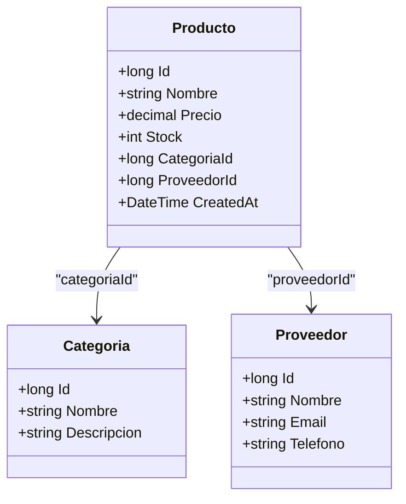
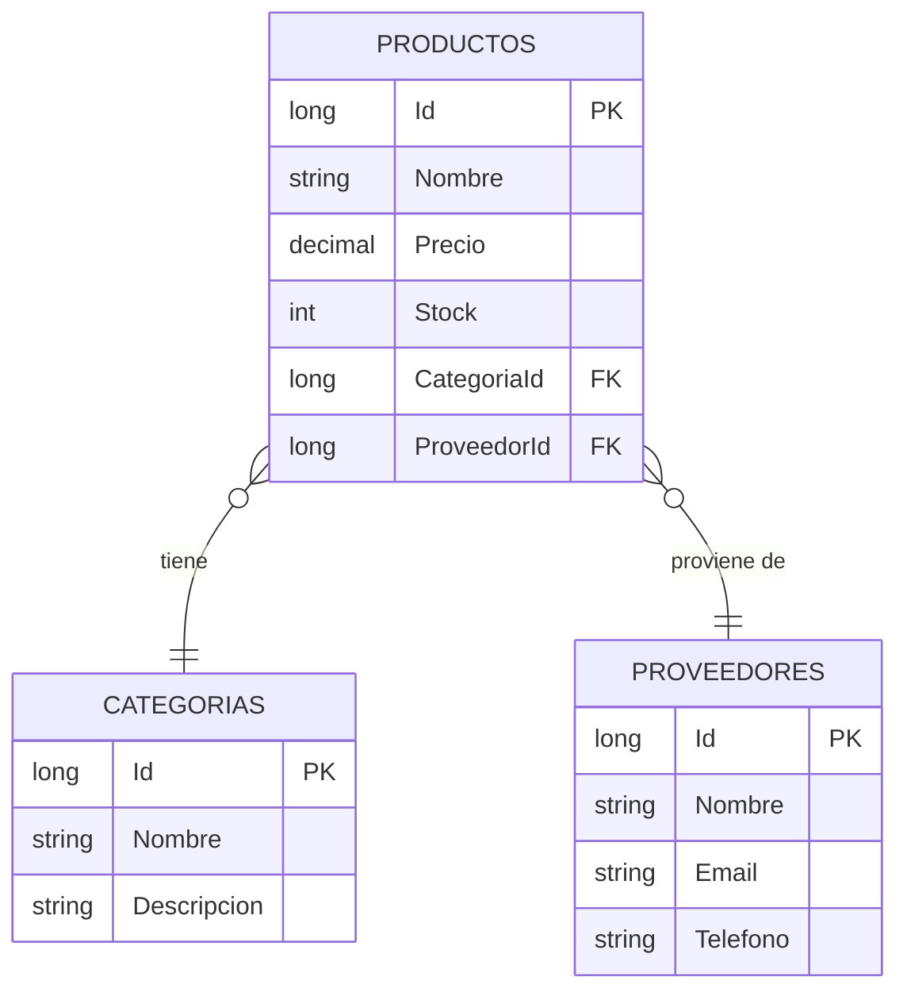
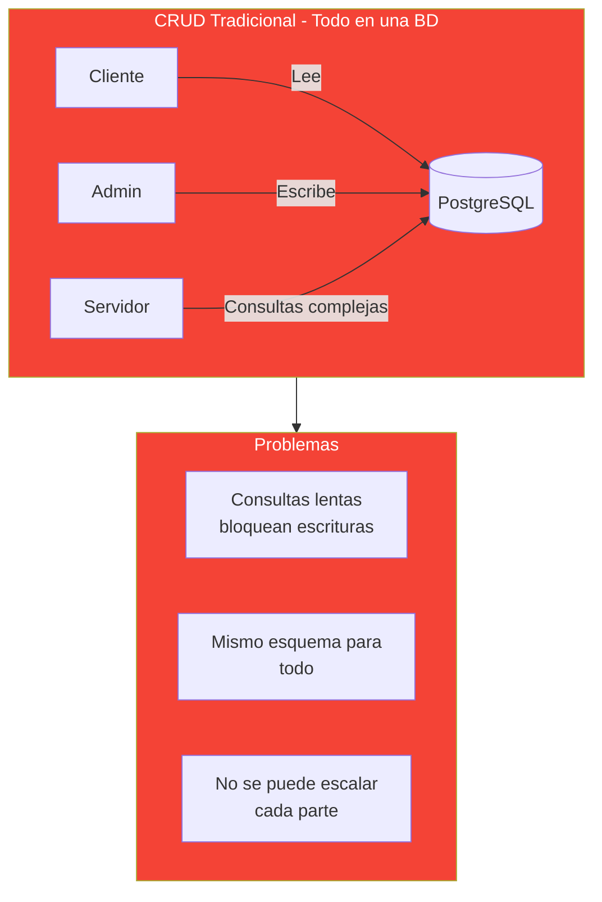
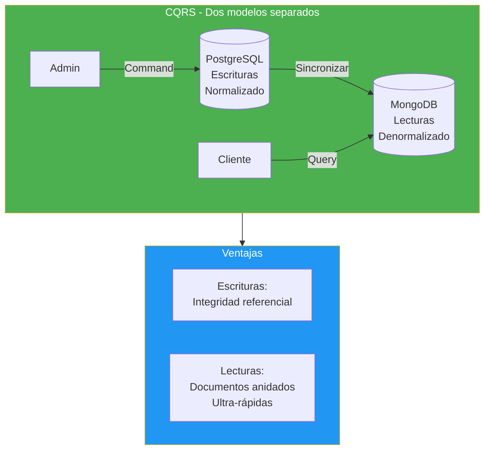
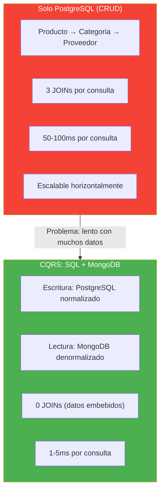
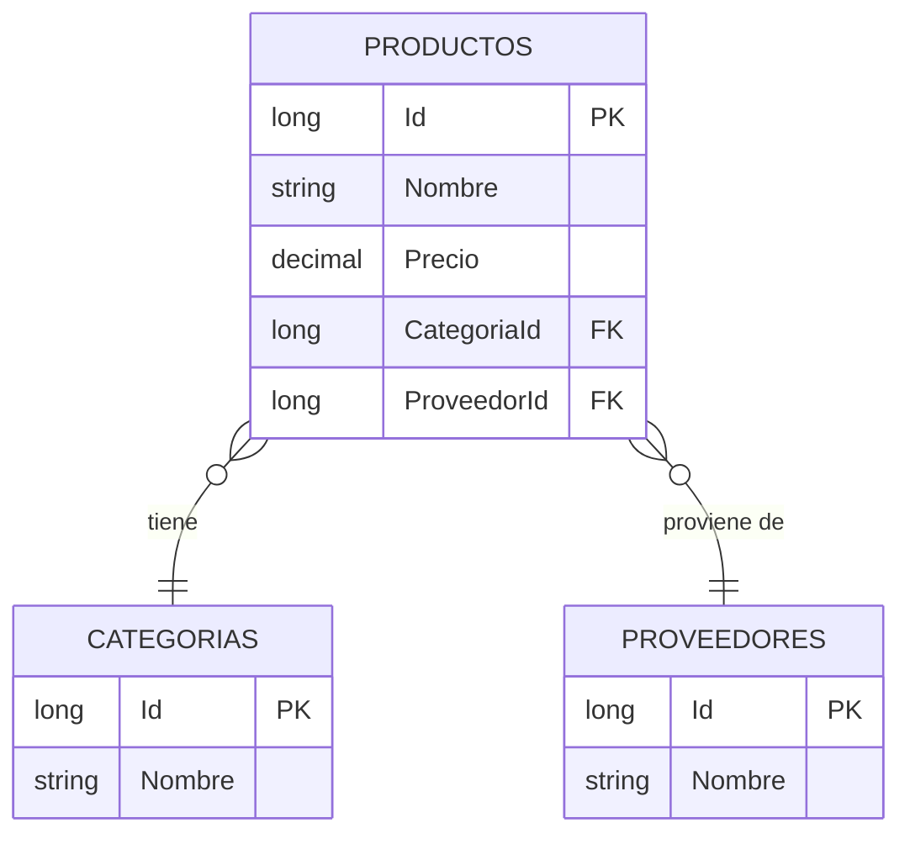
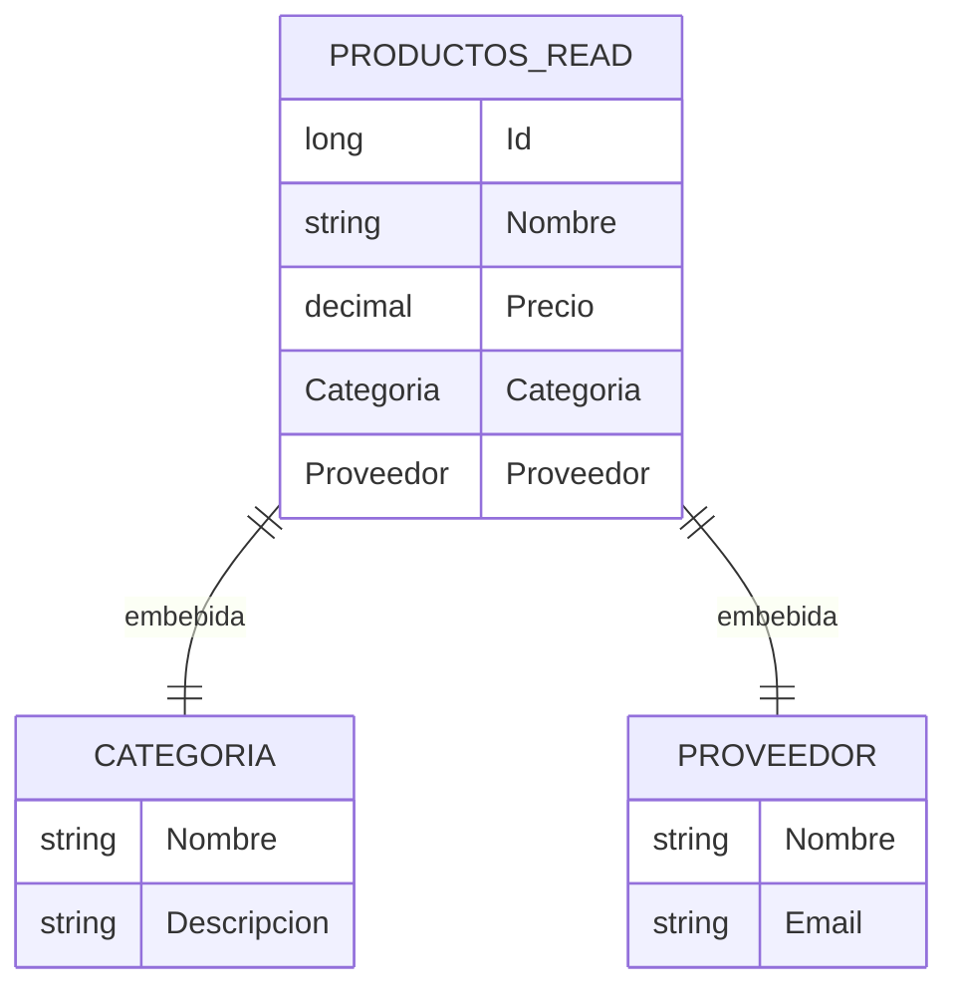
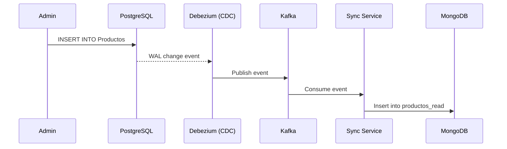
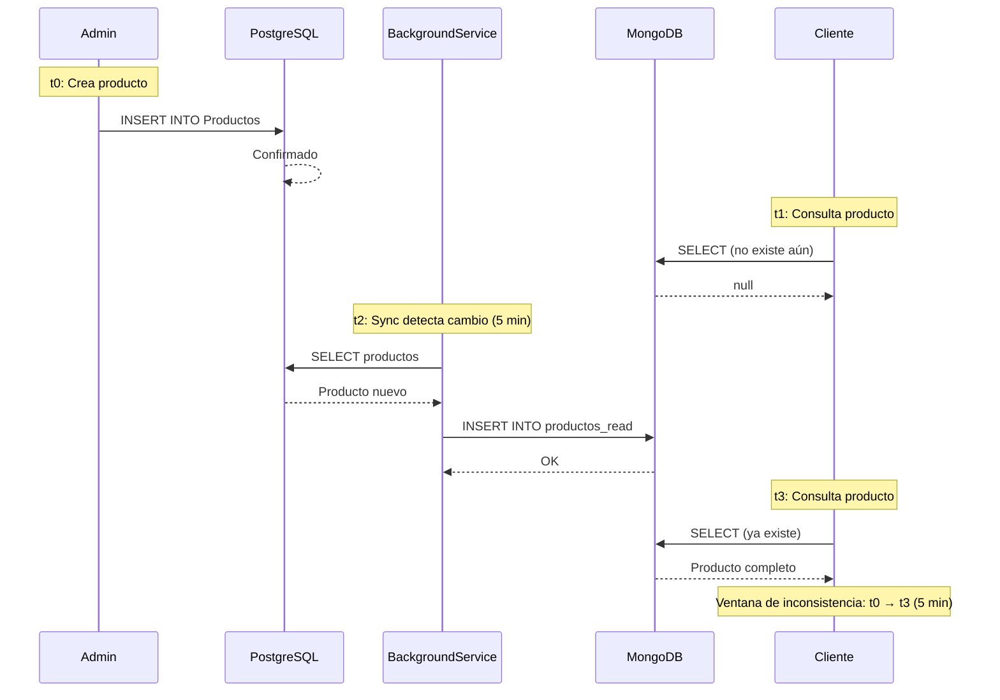

# 30. CQRS: Command Query Responsibility Segregation

- [30. CQRS: Command Query Responsibility Segregation](#30-cqrs-command-query-responsibility-segregation)
  - [30.1. ¿Qué es CQRS?](#301-qué-es-cqrs)
    - [30.1.1. El problema tradicional](#3011-el-problema-tradicional)
    - [30.1.2. La solución CQRS](#3012-la-solución-cqrs)
  - [30.2. Commands y Queries](#302-commands-y-queries)
    - [30.2.1. Commands (Escrituras)](#3021-commands-escrituras)
    - [30.2.2. Queries (Lecturas)](#3022-queries-lecturas)
  - [30.3. SQL para Escrituras](#303-sql-para-escrituras)
    - [30.3.1. Modelo normalizado](#3031-modelo-normalizado)
    - [30.3.2. Producto con Categoria y Proveedor](#3032-producto-con-categoria-y-proveedor)
  - [30.4. MongoDB para Lecturas](#304-mongodb-para-lecturas)
    - [30.4.1. Documentos denormalizados](#3041-documentos-denormalizados)
    - [30.4.2. Producto con relaciones embebidas](#3042-producto-con-relaciones-embebidas)
    - [30.4.3. Otras opciones para lecturas](#3043-otras-opciones-para-lecturas)
  - [30.5. Sincronización SQL → MongoDB](#305-sincronización-sql--mongodb)
    - [30.5.1. BackgroundService de sincronización](#3051-backgroundservice-de-sincronización)
    - [30.5.2. Patron de publicación](#3052-patron-de-publicación)
  - [30.6. Consistencia Eventual](#306-consistencia-eventual)
    - [30.6.1. Qué es la consistencia eventual](#3061-qué-es-la-consistencia-eventual)
    - [30.6.2. Ventana de inconsistencia](#3062-ventana-de-inconsistencia)
    - [30.6.3. Cómo manejarla](#3063-cómo-manejarla)
  - [30.7. Ventajas y Desventajas](#307-ventajas-y-desventajas)
  - [30.8. Kafka: la opción profesional](#308-kafka-la-opción-profesional)
  - [30.9. Testing de CQRS](#309-testing-de-cqrs)
  - [30.10. Buenas Prácticas](#3010-buenas-prácticas)
  - [30.11. Reto](#3011-reto)

---

> 💡 **Punto de partida:** En una tienda online, el administrador actualiza precios y stock (escritura), pero miles de clientes buscan productos (lectura). ¿Por qué usar la misma base de datos para las dos cosas si tienen necesidades tan distintas? **CQRS** separa las lecturas de las escrituras para optimizar cada una por separado.

En este punto aprenderás a separar Commands de Queries, usar PostgreSQL para escrituras y MongoDB para lecturas, y entender la consistencia eventual.

**Objetivos de aprendizaje:**
- Entender qué es CQRS y por qué se usa
- Separar Commands (escrituras) de Queries (lecturas)
- Usar PostgreSQL normalizado para escrituras y MongoDB denormalizado para lecturas
- Implementar sincronización entre ambas bases de datos
- Comprender la consistencia eventual y sus implicaciones

## 30.1. ¿Qué es CQRS?

**CQRS** (Command Query Responsibility Segregation) es un patrón de arquitectura que separa las operaciones de **lectura** (Queries) de las de **escritura** (Commands) en modelos diferentes.

📌 Ejemplo real: **Amazon** usa CQRS. Las escrituras van a una base de datos relacional optimizada para transacciones, pero las lecturas (búsqueda de productos, catálogos) van a un sistema optimizado para búsquedas rápidas como Elasticsearch. Cada una tiene su propia base de datos.

### 30.1.1. Nuestro dominio: Productos, Categorías y Proveedores

Vamos a usar un ejemplo concreto para entender CQRS. Imagina una tienda online con estos datos:



📌 Ejemplo real: **Mercado Libre** maneja millones de productos con categorías y proveedores. Cada búsqueda debe ser rápida, pero cada actualización debe ser segura y consistente.

**Modelo relacional en PostgreSQL (3 tablas):**



**El problema: ¿Qué pasa cuando queremos devolver un DTO con toda la info?**

Cuando un cliente pide un producto, necesita ver el nombre de la categoría y el nombre del proveedor. Pero esos datos están en **tablas diferentes**. Para devolver un DTO como este:

```json
{
    "id": 1,
    "nombre": "Teclado Mecánico",
    "precio": 89.99,
    "categoria": { "id": 1, "nombre": "Electrónica" },
    "proveedor": { "id": 5, "nombre": "Logitech" }
}
```

PostgreSQL necesita hacer **3 consultas (JOINs)**:

```sql
-- 1. Buscar el producto
SELECT * FROM Productos WHERE Id = 1;

-- 2. JOIN con Categorias
SELECT * FROM Productos p
INNER JOIN Categorias c ON p.CategoriaId = c.Id
WHERE p.Id = 1;

-- 3. JOIN con Proveedores
SELECT * FROM Productos p
INNER JOIN Proveedores pr ON p.ProveedorId = pr.Id
WHERE p.Id = 1;

-- O todo junto (pero más complejo):
SELECT p.*, c.Nombre as CatNombre, pr.Nombre as ProvNombre
FROM Productos p
INNER JOIN Categorias c ON p.CategoriaId = c.Id
INNER JOIN Proveedores pr ON p.ProveedorId = pr.Id
WHERE p.Id = 1;
```

**¿Cuánto cuesta esto?**

| Operación | Tiempo estimado | Memoria |
|-----------|----------------|---------|
| SELECT de 1 producto | 1ms | Baja |
| JOIN con Categorias | +2ms | Media |
| JOIN con Proveedores | +2ms | Media |
| **Total** | **~5ms** | **Media** |

Con 100 productos, el coste crece:

| Productos | JOINs totales | Tiempo estimado |
|-----------|---------------|-----------------|
| 1 | 3 | ~5ms |
| 10 | 30 | ~20ms |
| 100 | 300 | ~100ms |
| 1000 | 3000 | ~500ms |

📌 Ejemplo real: **Amazon** tiene millones de productos. Si cada búsqueda hiciera 3 JOINs por producto, las consultas tardarían segundos en vez de milisegundos.

### 30.1.2. El problema tradicional

En una arquitectura tradicional (CRUD), la misma entidad sirve para leer y escribir. Esto crea varios problemas:



📌 Ejemplo real: **Netflix** tenía este problema. Sus consultas de catálogo (millones de series) eran lentas porque la misma BD manejaba escrituras de configuración. Al separar CQRS, las lecturas se volvieron 10x más rápidas.

| Problema | Impacto | Ejemplo |
|----------|---------|---------|
| **Consultas lentas** | Los clientes esperan segundos | Buscar "teclado" tarda 3s en vez de 200ms |
| **Mismo esquema** | Compromisos en diseño | No puedes denormalizar para lecturas sin afectar escrituras |
| **No escala** | Crecimiento limitado | No puedes añadir nodos de solo lectura |
| **Bloqueos** | Escrituras bloquean lecturas | Un UPDATE bloquea las consultas |

### 30.1.2. La solución CQRS

CQRS resuelve esto separando en dos modelos optimizados para cada caso:



📌 Ejemplo real: **LinkedIn** usa CQRS. Cuando actualizas tu perfil (escritura), va a PostgreSQL. Cuando alguien busca tu perfil (lectura), va a un sistema optimizado para búsquedas rápidas.

### 30.1.3. ¿Por qué separar escrituras y lecturas?

Para entender por qué CQRS es útil, necesitas comprender el **coste real** de cada operación:

#### El coste de las claves foráneas y los JOINs

En PostgreSQL normalizado, cuando consultas un producto con su categoría y proveedor, el motor de BD debe:

1. **Buscar el producto** en la tabla `Productos`
2. **Hacer JOIN** con `Categorias` para obtener el nombre
3. **Hacer JOIN** con `Proveedores` para obtener el nombre
4. **Cargar todo en memoria** para devolver el resultado

```sql
-- Consulta típica en PostgreSQL normalizado
SELECT p.Nombre, p.Precio, c.Nombre, pr.Nombre
FROM Productos p
INNER JOIN Categorias c ON p.CategoriaId = c.Id
INNER JOIN Proveedores pr ON p.ProveedorId = pr.Id
WHERE p.Precio > 50;
```

**Problemas:**
- Cada JOIN **multiplica** el tiempo de ejecución
- Con 3 tablas y 10.000 productos, la consulta puede tardar **50-100ms**
- Con millones de registros, puede tardar **segundos**
- Cada JOIN consume **memoria** en el servidor de BD

#### El coste de tener dos bases de datos

CQRS añade complejidad:

| Coste | Descripción |
|-------|-------------|
| **Mantenimiento** | Dos sistemas que actualizar |
| **Sincronización** | BackgroundService adicional |
| **Consistencia eventual** | Los datos no están al instante sincronizados |
| **Operaciones** | Dos servidores, dos backups, dos monitoreos |
| **Coste económico** | Dos servidores = el doble de coste |

#### ¿Cuándo merece la pena?

| Escenario | CQRS | Por qué |
|-----------|------|---------|
| **API con miles de lecturas por escritura** | ✅ Sí | Las lecturas se vuelven 10x más rápidas |
| **Consultas complejas con muchos JOINs** | ✅ Sí | MongoDB resuelve todo en un documento |
| **Escalabilidad independiente** | ✅ Sí | Puedes añadir nodos de solo lectura |
| **API simple, pocos usuarios** | ❌ No | La complejidad no compensa |
| **Datos que cambian muy rápido** | ⚠️ Dependiendo | La consistencia puede ser un problema |
| **Cache ya resuelve el problema** | ⚠️ Dependiendo | Redis puede ser suficiente |

📌 Ejemplo real: **Amazon** recibe millones de lecturas (buscar productos) por cada escritura (actualizar precio). CQRS les permite escalar las lecturas independientemente de las escrituras.

#### Comparativa detallada



> 📝 **Nota:** CQRS no es la solución para todo. Si tu API tiene 100 usuarios y 50 productos, la complejidad adicional no compensa. CQRS brilla cuando tienes **miles de lecturas por escritura** y necesitas **escalar las lecturas** independientemente.

## 30.2. Commands y Queries

### 30.2.1. Commands (Escrituras)

Un **Command** es una operación que modifica el estado del sistema. Siempre devuelve `true/false` o el objeto creado.

| Command | Qué hace | Ejemplo HTTP |
|---------|----------|--------------|
| `CreateProducto` | Crea un nuevo producto | POST /api/productos |
| `UpdateProducto` | Actualiza un producto existente | PUT /api/productos/1 |
| `DeleteProducto` | Elimina un producto | DELETE /api/productos/1 |

```csharp
// Command: crear producto
public record CreateProductoCommand(
    string Nombre,
    decimal Precio,
    long CategoriaId,
    long ProveedorId
);
```

### 30.2.2. Queries (Lecturas)

Una **Query** es una operación que lee datos sin modificarlos. Devuelve el objeto o una lista.

| Query | Qué hace | Ejemplo HTTP |
|-------|----------|--------------|
| `GetProductoById` | Obtiene un producto por ID | GET /api/productos/1 |
| `GetAllProductos` | Lista todos los productos | GET /api/productos |
| `SearchProductos` | Busca productos | GET /api/productos/search?q=teclado |

```csharp
// Query: buscar productos
public record SearchProductosQuery(string Termino);
```

## 30.3. SQL para Escrituras

### 30.3.1. Modelo normalizado

Las escrituras usan PostgreSQL **normalizado** para garantizar consistencia e integridad referencial:



📌 Ejemplo real: **Amazon** almacena productos, categorías y proveedores en tablas separadas normalizadas. Cuando un proveedor cambia de nombre, solo se actualiza una fila en la tabla `Proveedores`.

### 30.3.2. Producto con Categoria y Proveedor

```csharp
// Modelo normalizado en PostgreSQL
public class Producto
{
    public long Id { get; set; }
    public string Nombre { get; set; } = string.Empty;
    public decimal Precio { get; set; }
    public long CategoriaId { get; set; }
    public Categoria Categoria { get; set; } = null!;
    public long ProveedorId { get; set; }
    public Proveedor Proveedor { get; set; } = null!;
}

public class Categoria
{
    public long Id { get; set; }
    public string Nombre { get; set; } = string.Empty;
}

public class Proveedor
{
    public long Id { get; set; }
    public string Nombre { get; set; } = string.Empty;
}
```

❌ **MALO**: Guardar el nombre de la categoría directamente en el producto:

```csharp
public class Producto
{
    public string NombreCategoria { get; set; } = string.Empty; // Duplicado
}
// Si cambia el nombre de la categoría, hay que actualizar TODOS los productos
```

✅ **BUENO**: Usar claves foráneas y relaciones:

```csharp
public class Producto
{
    public long CategoriaId { get; set; } // Referencia, no duplicado
    public Categoria Categoria { get; set; } = null!;
}
```

## 30.4. MongoDB para Lecturas

### 30.4.1. Documentos denormalizados

Las lecturas usan MongoDB **desnormalizado** con documentos que contienen toda la información anidada:



📌 Ejemplo real: **Instagram** almacena posts con el perfil del usuario embebido. Cuando ves un post, no necesitas hacer JOIN con la tabla de usuarios: todo está en el mismo documento.

### 30.4.2. Producto con relaciones embebidas

```csharp
// Modelo denormalizado en MongoDB
public class ProductoRead
{
    public long Id { get; set; }
    public string Nombre { get; set; } = string.Empty;
    public decimal Precio { get; set; }
    public CategoriaRead Categoria { get; set; } = null!;
    public ProveedorRead Proveedor { get; set; } = null!;
    public DateTime SyncAt { get; set; } // Última sincronización
}

public class CategoriaRead
{
    public long Id { get; set; }
    public string Nombre { get; set; } = string.Empty;
}

public class ProveedorRead
{
    public long Id { get; set; }
    public string Nombre { get; set; } = string.Empty;
}
```

```json
{
    "_id": ObjectId("..."),
    "id": 1,
    "nombre": "Teclado Mecánico",
    "precio": 89.99,
    "categoria": {
        "id": 1,
        "nombre": "Electrónica"
    },
    "proveedor": {
        "id": 5,
        "nombre": "Logitech"
    },
    "syncAt": "2026-09-22T10:00:00Z"
}
```

### 30.4.3. Otras opciones para lecturas

MongoDB es solo **una opción**. También puedes usar:

| Opción | Ventaja | Cuándo usar |
|--------|---------|-------------|
| **MongoDB** | Documentos flexibles, búsquedas rápidas | Datos anidados, catálogos |
| **Elasticsearch** | Búsquedas full-text avanzadas | Búsqueda de texto libre |
| **Redis** | Ultra-rápido, caché | Datos que cambian poco |
| **Vistas materializadas SQL** | Simple, misma BD | Consultas precalculadas |
| **Apache Solr** | Búsquedas complejas | E-commerce grande |

📌 Ejemplo real: **Netflix** usa MongoDB para el catálogo de contenido (documentos anidados con temporadas, episodios, actores) pero Elasticsearch para las búsquedas de texto.

## 30.5. Sincronización SQL → MongoDB

La sincronización es el corazón de CQRS. Hay varias formas de pasar datos de PostgreSQL a MongoDB, cada una con diferentes niveles de complejidad y latencia.

### 30.5.1. Opciones de sincronización

| Opción | Latencia | Complejidad | Cuándo usar |
|--------|----------|-------------|-------------|
| **BackgroundService (polling)** | 1-5 min | Baja | Datos que cambian poco, prototipos |
| **Domain Events** | Segundos | Media | Cuando ya tienes el patrón implementado |
| **Change Data Capture (CDC)** | Muy baja | Alta | Producción con millones de registros |
| **RX.NET Observables** | Segundos | Media | Cuando necesitas reactividad en tiempo real |

📌 Ejemplo real: **Amazon** usa CDC con Kafka para sincronizar datos entre cientos de microservicios. Cada cambio en PostgreSQL genera un evento que actualiza ElasticSearch en menos de 1 segundo.

### 30.5.2. Opción 1: BackgroundService (polling)

La forma más simple. Un servicio en segundo plano consulta PostgreSQL periódicamente y actualiza MongoDB.

```csharp
public class SyncBackgroundService : BackgroundService
{
    private readonly IServiceProvider _serviceProvider;
    private readonly ILogger<SyncBackgroundService> _logger;

    protected override async Task ExecuteAsync(CancellationToken stoppingToken)
    {
        while (!stoppingToken.IsCancellationRequested)
        {
            try
            {
                await SyncProductosAsync();
            }
            catch (Exception ex)
            {
                _logger.LogError(ex, "Error en sincronización");
            }

            // Intervalo de 1 minuto (no 5, que es demasiado)
            await Task.Delay(TimeSpan.FromMinutes(1), stoppingToken);
        }
    }

    private async Task SyncProductosAsync()
    {
        using var scope = _serviceProvider.CreateScope();
        var sqlContext = scope.ServiceProvider.GetRequiredService<SqlDbContext>();
        var mongoContext = scope.ServiceProvider.GetRequiredService<MongoDbContext>();

        var productos = await sqlContext.Productos
            .Include(p => p.Categoria)
            .Include(p => p.Proveedor)
            .ToListAsync();

        foreach (var producto in productos)
        {
            var read = new ProductoRead
            {
                Id = producto.Id,
                Nombre = producto.Nombre,
                Precio = producto.Precio,
                Categoria = new CategoriaRead { Id = producto.Categoria.Id, Nombre = producto.Categoria.Nombre },
                Proveedor = new ProveedorRead { Id = producto.Proveedor.Id, Nombre = producto.Proveedor.Nombre },
                SyncAt = DateTime.UtcNow
            };

            await mongoContext.Productos.ReplaceOneAsync(
                p => p.Id == producto.Id, read,
                new ReplaceOptions { IsUpsert = true });
        }
    }
}
```

✅ **Ventajas**: Simple de implementar, no necesita herramientas extra
❌ **Desventajas**: Latencia de 1-5 minutos, consume recursos periódicamente

### 30.5.3. Opción 2: Domain Events

Cuando se crea/modifica/elimina un producto, se publica un evento que el servicio de sincronización escucha.

```csharp
// Publicar evento después de crear producto
public class ProductoService
{
    private readonly IProductoRepository _repository;
    private readonly IEventBus _eventBus;

    public async Task<Producto> CreateAsync(CreateProductoDto dto)
    {
        var producto = _repository.Add(dto.ToModel());
        
        // Publicar evento
        await _eventBus.PublishAsync(new ProductoCreadoEvent(producto.Id, producto.Nombre));
        
        return producto;
    }
}

// Escuchar evento
public class SyncEventHandler
{
    private readonly IMongoDbContext _mongoContext;
    private readonly ISqlDbContext _sqlContext;

    public async Task Handle(ProductoCreadoEvent evento)
    {
        var producto = await _sqlContext.Productos
            .Include(p => p.Categoria)
            .Include(p => p.Proveedor)
            .FirstAsync(p => p.Id == evento.ProductoId);

        await _mongoContext.Productos.ReplaceOneAsync(
            p => p.Id == producto.Id, producto.ToRead(),
            new ReplaceOptions { IsUpsert = true });
    }
}
```

✅ **Ventajas**: Latencia de segundos, no consume recursos periódicamente
❌ **Desventajas**: Más código, necesita implementar el patrón de eventos

### 30.5.4. Opción 3: Change Data Capture (CDC)

CDC captura los cambios en PostgreSQL y los propaga a MongoDB automáticamente. La herramienta más común es **Debezium** con **Kafka**.



✅ **Ventajas**: Latencia de segundos, escalable, profesional
❌ **Desventajas**: Complejo de configurar, necesita Kafka + Debezium

### 30.5.5. Opción 4: RX.NET con Observables

Usa programación reactiva para escuchar cambios en tiempo real:

```csharp
public class ReactiveSyncService
{
    private readonly Subject<Producto> _productoChanges = new();

    public void OnProductoChanged(Producto producto)
    {
        _productoChanges.OnNext(producto);
    }

    public IDisposable Subscribe(Action<Producto> onSync)
    {
        return _productoChanges
            .Throttle(TimeSpan.FromSeconds(30)) // Esperar 30s de calma
            .Subscribe(producto => onSync(producto));
    }
}

// En ProductoService:
public class ProductoService
{
    private readonly ReactiveSyncService _syncService;

    public async Task<Producto> CreateAsync(CreateProductoDto dto)
    {
        var producto = _repository.Add(dto.ToModel());
        _syncService.OnProductoChanged(producto); // Publicar cambio
        return producto;
    }
}
```

✅ **Ventajas**: Reactivo, latencia baja, no consume recursos periódicamente
❌ **Desventajas**: Más complejo, necesita entender programación reactiva

### 30.5.6. Comparativa de opciones

| Criterio | BackgroundService | Domain Events | CDC | RX.NET |
|----------|-------------------|---------------|-----|--------|
| **Latencia** | 1-5 min | Segundos | < 1s | Segundos |
| **Complejidad** | Baja | Media | Alta | Media |
| **Herramientas** | Ninguna | Ninguna | Kafka + Debezium | RX.NET |
| **Escalabilidad** | Limitada | Buena | Excelente | Buena |
| **Coste** | Bajo | Bajo | Medio-Alto | Bajo |
| **Producción** | Solo datos lentos | Recomendado | Ideal | Alternativa |

> 📝 **Nota:** Para este curso usamos **BackgroundService con 1 minuto** por simplicidad pedagógica. En producción real, usarías **Domain Events** o **CDC** según la escala de tu aplicación.

📌 Ejemplo real: **LinkedIn** usa CDC con Kafka para sincronizar datos entre cientos de microservicios. Cuando actualizas tu perfil, el evento viaja por Kafka y actualiza ElasticSearch, caches y sistemas de recomendación en menos de 1 segundo.

## 30.6. Consistencia Eventual

### 30.6.1. Qué es la consistencia eventual

La **consistencia eventual** significa que después de una escritura, las lecturas no reflejan el cambio **inmediatamente**. Hay una **ventana de inconsistencia** donde los datos están desincronizados.

📌 Ejemplo real: Cuando publicas una foto en **Instagram**, tus seguidores no la ven al instante. Hay un pequeño retraso (segundos o minutos) mientras el sistema sincroniza los datos entre servidores. Eso es consistencia eventual.

### 30.6.2. Ventana de inconsistencia



### 30.6.3. Cómo manejarla

| Estrategia | Descripción |
|------------|-------------|
| **Mostrar timestamp** | Indicar "datos actualizados hace X min" |
| **Forzar refresh** | Botón para recargar datos manualmente |
| **Polling corto** | Sincronizar cada 30s en vez de 5min |
| **Cache corto** | TTL bajo en la capa de lectura |
| **Aceptar la latencia** | Si 5 min es aceptable, no hacer nada |

❌ **MALO**: Mentir al usuario diciendo que los datos están actualizados:

```csharp
// Si el sync tarda 5 minutos, el usuario cree que el cambio fue inmediato
return Ok(new { message = "Producto creado correctamente" });
```

✅ **BUENO**: Informar sobre la sincronización:

```csharp
return Ok(new { 
    message = "Producto creado correctamente",
    syncEstimated = "Los cambios serán visibles en ~5 minutos"
});
```

## 30.7. Ventajas y Desventajas

| Ventaja | Desventaja |
|---------|------------|
| Lecturas ultra-rápidas | Complejidad de dos BDs |
| Escrituras optimizadas | Consistencia eventual |
| Cada parte escala por separado | Sincronización adicional |
| Modelos optimizados para cada caso | Más código y mantenimiento |

## 30.8. Kafka: la opción profesional

**Apache Kafka** es un sistema de streaming de eventos usado en producción para sincronizar datos entre sistemas. En lugar de polling, Kafka recibe eventos de cambios y los propaga a los consumidores.

> 📝 **Nota:** En este curso usamos un BackgroundService de sincronización por simplicidad pedagógica. En producción real, Kafka sería la opción recomendada para sincronizar PostgreSQL → MongoDB de forma escalable y fiable.

📌 Ejemplo real: **LinkedIn** usa Kafka para sincronizar datos entre cientos de microservicios. Cuando actualizas tu perfil, el evento viaja por Kafka y actualiza ElasticSearch, caches y sistemas de recomendación.

## 30.9. Testing de CQRS

```csharp
[Test]
public async Task Sync_ProductoCreado_SeSincronizaMongoDB()
{
    // Arrange
    var producto = new Producto { Nombre = "Teclado", Precio = 89.99m, CategoriaId = 1 };
    await sqlContext.Productos.AddAsync(producto);
    await sqlContext.SaveChangesAsync();

    // Act
    await syncService.SyncProductosAsync();

    // Assert
    var read = await mongoContext.Productos.FirstOrDefaultAsync(p => p.Id == producto.Id);
    read.Should().NotBeNull();
    read!.Nombre.Should().Be("Teclado");
    read.Categoria.Should().NotBeNull();
}
```

## 30.10. Buenas Prácticas

- **Sincronización periódica**: No en tiempo real, usa intervals (5min, 15min)
- **Upsert en MongoDB**: `ReplaceOne` con `IsUpsert = true` para crear o actualizar
- **Timestamps de sync**: Guarda `SyncAt` para saber cuándo se sincronizó cada documento
- **Manejo de errores**: Si falla la sync, reintenta pero no bloquee el sistema
- **Logs detallados**: Registra cada sync para debugging
- **Aceptar la inconsistencia**: Si 5min es aceptable, no compliques el sistema

## 30.11. Reto

> Implementa CQRS para FunkoApp: PostgreSQL para escrituras, MongoDB para lecturas.

**Añade a tu API:**

1. **Modelo SQL:** Funko con CategoriaId y ProveedorId (claves foráneas)
2. **Modelo MongoDB:** FunkoRead con Categoría y Proveedor embebidos
3. **BackgroundService** de sincronización cada 5 minutos
4. **Queries en MongoDB** (lecturas rápidas con documentos denormalizados)
5. **Commands en PostgreSQL** (escrituras transaccionales)
6. **Tests:** Verificar que la sincronización funciona correctamente

**Puntos extra:**

- Mostrar timestamp de última sincronización en la API
- Manejar errores de sincromización con reintentos
- Documentar la ventana de inconsistencia

---

**Resumen del punto:**

| Concepto | Descripción |
|----------|-------------|
| **CQRS** | Separar Commands (escrituras) de Queries (lecturas) |
| **Command** | Operación que modifica el estado (Create, Update, Delete) |
| **Query** | Operación que lee datos sin modificarlos |
| **PostgreSQL normalizado** | BD relacional para escrituras (integridad referencial) |
| **MongoDB denormalizado** | BD NoSQL para lecturas (documentos anidados) |
| **BackgroundService** | Tarea programada que sincroniza PostgreSQL → MongoDB |
| **Consistencia eventual** | Retraso entre escritura y disponibilidad en lectura |
| **Ventana de inconsistencia** | Tiempo que tarda la sincronización (ej: 5 min) |
| **Kafka** | Sistema de streaming para sincronización profesional |
| **Upsert** | Crear o actualizar en una sola operación |
| **Timestamp de sync** | Saber cuándo se sincronizó cada documento |

**¿Qué viene después?**

En el siguiente punto veremos **API Gateway**: cómo crear un punto de entrada único que enrute peticiones a diferentes microservicios, gestione autenticación, rate limiting y agregación de respuestas.
