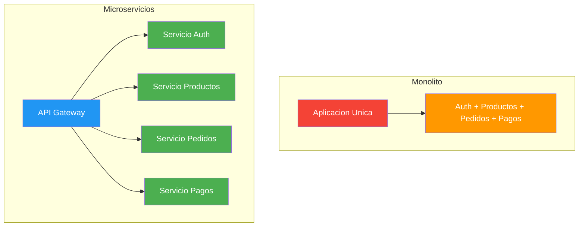
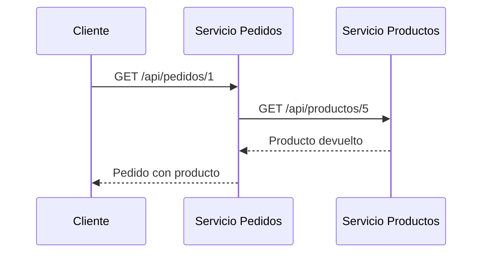
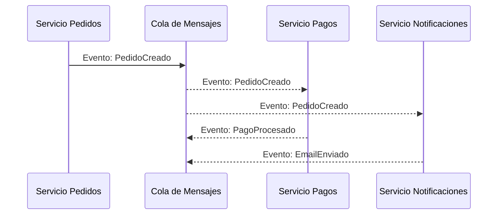
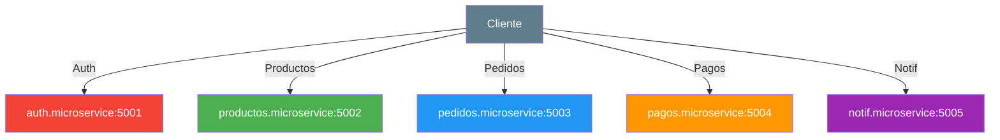
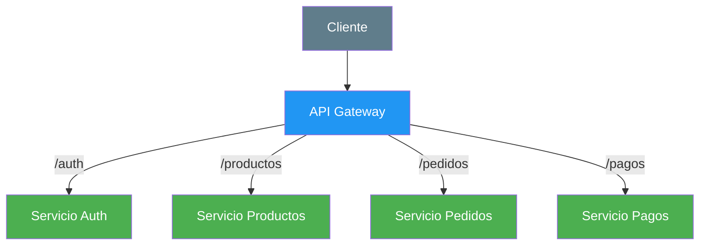
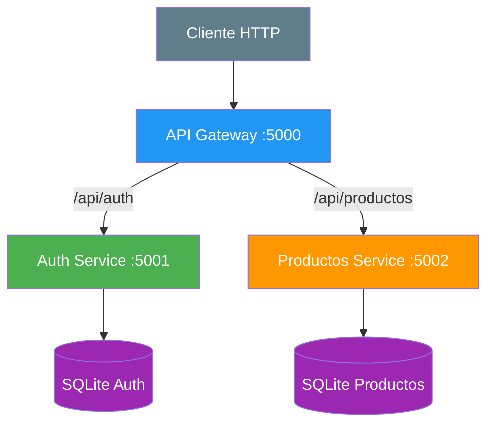
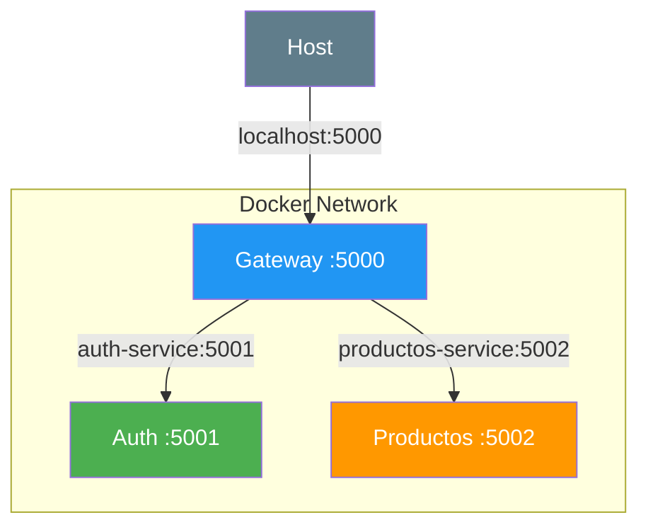
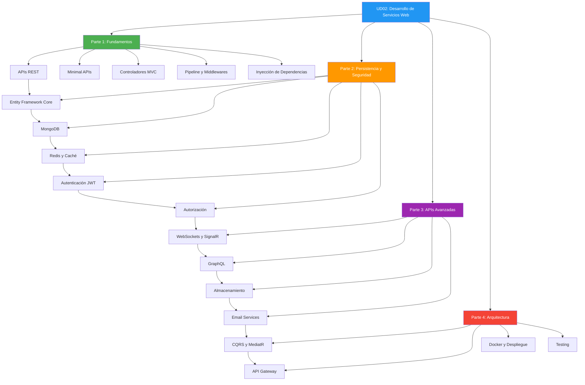

- [31. API Gateway y Microservicios](#31-api-gateway-y-microservicios)
  - [31.1. ¿Por qué Microservicios?](#311-por-qué-microservicios)
    - [31.1.1. Monolito vs Microservicios](#3111-monolito-vs-microservicios)
    - [31.1.2. Ventajas de los Microservicios](#3112-ventajas-de-los-microservicios)
    - [31.1.3. Problemas de los Microservicios](#3113-problemas-de-los-microservicios)
  - [31.2. Comunicación entre Microservicios](#312-comunicación-entre-microservicios)
    - [31.2.1. Comunicación sincrónica (REST)](#3121-comunicación-sincrónica-rest)
    - [31.2.2. Comunicación asincrónica (Eventos)](#3122-comunicación-asincrónica-eventos)
    - [31.2.3. Repositorio remoto vs URL directa](#3123-repositorio-remoto-vs-url-directa)
  - [31.3. ¿Qué es un API Gateway?](#313-qué-es-un-api-gateway)
    - [31.3.1. El problema sin Gateway](#3131-el-problema-sin-gateway)
    - [31.3.2. La solución: Gateway como proxy inverso](#3132-la-solución-gateway-como-proxy-inverso)
    - [31.3.3. Funciones del Gateway](#3133-funciones-del-gateway)
  - [31.4. YARP: Microsoft Reverse Proxy](#314-yarp-microsoft-reverse-proxy)
    - [31.4.1. ¿Qué es YARP?](#3141-qué-es-yarp)
    - [31.4.2. Configuración en appsettings.json](#3142-configuración-en-appsettingsjson)
    - [31.4.3. Configuración en Program.cs](#3143-configuración-en-programcs)
    - [31.4.4. Tokens JWT con YARP](#3144-tokens-jwt-con-yarp)
  - [31.5. Ejemplo práctico: Auth y Productos con YARP](#315-ejemplo-práctico-auth-y-productos-con-yarp)
    - [31.5.1. Arquitectura del ejemplo](#3151-arquitectura-del-ejemplo)
    - [31.5.2. Docker Compose](#3152-docker-compose)
    - [31.5.3. Configuración de rutas](#3153-configuración-de-rutas)
  - [31.6. Nginx: La alternativa profesional](#316-nginx-la-alternativa-profesional)
    - [31.6.1. ¿Qué es Nginx?](#3161-qué-es-nginx)
    - [31.6.2. Configuración de Nginx](#3162-configuración-de-nginx)
    - [31.6.3. YARP vs Nginx](#3163-yarp-vs-nginx)
  - [31.7. Docker y contenedores](#317-docker-y-contenedores)
    - [31.7.1. Nombres de servicio vs localhost](#3171-nombres-de-servicio-vs-localhost)
    - [31.7.2. Redes internas](#3172-redes-internas)
  - [31.8. Ventajas y Desventajas](#318-ventajas-y-desventajas)
  - [31.9. Buenas Prácticas](#319-buenas-prácticas)
  - [31.10. Reto](#3110-reto)


# 31. API Gateway y Microservicios

> **Punto de partida:** Netflix no tiene una sola aplicación gigante. Tiene cientos de servicios independientes: uno para recomendar contenido, otro para gestionar pagos, otro para enviar notificaciones. Cuando abres la app, todos esos servicios trabajan juntos como si fueran uno solo. ¿Cómo lo consiguen? Con **microservicios** y un **API Gateway** que coordina todo.

En este punto aprenderás por qué los microservicios han revolucionado el desarrollo moderno, cómo se comunican entre sí, qué es un API Gateway y cómo implementarlo con YARP y Nginx.

**Objetivos de aprendizaje:**

- Comprender las diferencias entre arquitectura monolítica y microservicios
- Conocer los patrones de comunicación entre servicios (sincrónica y asincrónica)
- Entender qué es un API Gateway y qué funciones cumple
- Configurar YARP como reverse proxy en ASP.NET Core
- Implementar un ejemplo práctico con Docker Compose
- Conocer Nginx como alternativa profesional

## 31.1. ¿Por qué Microservicios?

La arquitectura de software ha evolucionado mucho en los últimos años. Hasta hace relativamente poco, la mayoría de aplicaciones se construían como **monolitos**: un único bloque de código que contenía toda la lógica de negocio, acceso a datos, interfaces de usuario y más. Con el crecimiento de las aplicaciones web y la demanda de escalabilidad, surgieron los **microservicios** como alternativa.

> 💡 **Analogía:** Un monolito es como un restaurante donde un solo cocinero hace todo: la carta, los primeros platos, los postres y cobra. Los microservicios son como un centro comercial: cada tienda se especializa en una cosa (ropa, comida, tecnología), tiene su propio personal y horario, pero todas comparten el mismo edificio.

📌 **Ejemplo real:** Netflix pasó de un monolito a microservicios en 2009. Hoy tiene más de 1000 servicios independientes. Cuando haces play en una serie, el servicio de recomendaciones sugiere títulos, el servicio de streaming entrega el vídeo, el servicio de pagos verifica tu suscripción y el de notificaciones avisa a tus amigos. Todo en paralelo, sin que uno dependa del otro para funcionar.

### 31.1.1. Monolito vs Microservicios



| Característica | Monolito | Microservicios |
|----------------|----------|----------------|
| **Estructura** | Un solo bloque desplegable | Múltiples servicios independientes |
| **Despliegue** | Todo o nada | Cada servicio se despliega por separado |
| **Escalado** | Escalar todo el bloque | Escalar solo el servicio que necesita |
| **Tecnología** | Un lenguaje/framework para todo | Cada servicio puede usar la tecnología que mejor le vaya |
| **Base de datos** | Una sola base compartida | Cada servicio tiene la suya |
| **Complejidad inicial** | Baja | Alta |
| **Complejidad a largo plazo** | Alta (código enredado) | Media (servicios independientes) |

### 31.1.2. Ventajas de los Microservicios

- **Escalabilidad independiente**: Si el servicio de productos recibe más tráfico, solo escalas ese servicio, no toda la aplicación
- **Despliegue aislado**: Si introduces un bug en el servicio de pagos, solo afecta a pagos, no a login ni a productos
- **Diversidad tecnológica**: El servicio de IA puede usar Python, el de productos C#, el de notificaciones Node.js. Cada uno con la mejor herramienta
- **Equipos autónomos**: Un equipo puede trabajar en autenticación mientras otro trabaja en productos, sin interferirse
- **Resiliencia**: Si el servicio de recomendaciones se cae, el usuario puede seguir navegando el catálogo

📌 **Ejemplo real:** Amazon despliega cambios en producción cada 11.7 segundos de media. ¿Cómo? Porque cada microservicio se despliega de forma independiente. Cuando cambian el algoritmo de recomendaciones, no necesitan tocar el servicio de pagos.

### 31.1.3. Problemas de los Microservicios

- **Complejidad de red**: Ahora los servicios se comunican por HTTP o mensajería, lo que introduce latencia y posibles fallos de red
- **Transacciones distribuidas**: En un monolito, una transacción de base de datos lo cubre todo. En microservicios, necesitas patrones como **Saga** o **eventual consistency**
- **Consistencia eventual**: Los datos entre servicios pueden estar momentáneamente desincronizados
- **Testing más complejo**: Probar un flujo que involucra 5 servicios es mucho más difícil que probar un monolito
- **Monitorización**: Necesitas herramientas como **Jaeger**, **Zipkin** o **Application Insights** para rastrear peticiones que cruzan múltiples servicios
- **Despliegue coordinado**: Aunque cada servicio es independiente, a veces un cambio en la interfaz de un servicio afecta a varios consumidores

> ⚠️ **Advertencia:** Los microservicios **no son la respuesta a todo**. Si tu aplicación es pequeña (menos de 100.000 usuarios), un monolito bien diseñado puede ser mejor opción. Los microservicios aportan valor cuando tienes **escala, equipos grandes y necesidad de despliegues independientes**.

## 31.2. Comunicación entre Microservicios

En un monolito, las partes de la aplicación se comunican llamando a métodos en el mismo proceso. En microservicios, esa comunicación se hace a través de la red, y hay dos grandes enfoques.

### 31.2.1. Comunicación sincrónica (REST)

La comunicación **sincrónica** significa que un servicio hace una petición HTTP a otro y **espera** la respuesta antes de continuar.



- **Ventaja**: Simple de entender e implementar
- **Desventaja**: El servicio que llama **queda bloqueado** esperando la respuesta. Si el otro servicio tarda o se cae, toda la cadena se ve afectada
- **Uso habitual**: Consultas rápidas donde necesitas los datos inmediatamente

📌 **Ejemplo real:** Cuando haces un pedido en Amazon, el servicio de pedidos llama sincrónicamente al servicio de inventario para comprobar stock. Necesita saber **ahora mismo** si hay disponibilidad antes de confirmar el pedido.

### 31.2.2. Comunicación asincrónica (Eventos)

La comunicación **asincrónica** usa colas de mensajes (como RabbitMQ o Apache Kafka). Un servicio publica un evento y otros servicios se suscriben para reaccionar a él.



- **Ventaja**: Los servicios **no se bloquean**. El servicio de pedidos publica el evento y sigue trabajando
- **Desventaja**: Más complejo de implementar. El sistema debe garantizar que los mensajes no se pierden
- **Uso habitual**: Procesos que no necesitan respuesta inmediata (envío de emails, generación de informes, actualización de caché)

📌 **Ejemplo real:** Spotify usa eventos cuando guardas una canción en una playlist. El servicio de playlist publica un evento, y el servicio de recomendaciones lo recibe para actualizar tus sugerencias. No necesitas esperar a que las recomendaciones se actualicen: simplemente guardas y listo.

### 31.2.3. Repositorio remoto vs URL directa

Cuando un servicio necesita datos de otro, ¿debe llamar a la URL del otro servicio o tener una **copia local** de esos datos?

| Enfoque | Descripción | Cuándo usarlo |
|---------|-------------|---------------|
| **URL directa** | Servicio A llama a `http://servicio-b/api/datos` | Datos que cambian frecuentemente y necesitas siempre los más actualizados |
| **Copia local (repo remoto)** | Servicio A tiene una copia de los datos de B en su propia base de datos | Datos que cambian poco, consultas frecuentes, necesitas independencia |

> 💡 **Consejo:** La **copia local** es más rápida (no hay llamada a red) y más resiliente (si B se cae, A sigue funcionando). Pero debes sincronizar los datos periódicamente, lo que introduce **consistencia eventual**.

📌 **Ejemplo real:** En Netflix, el servicio de reproducción tiene una copia local de los metadatos de las películas (título, duración, sinopsis). No consulta el catálogo cada vez quedas play. Pero el servicio de pagos sí llama directamente al servicio de suscripciones porque necesita datos siempre actualizados.

## 31.3. ¿Qué es un API Gateway?

Un **API Gateway** es el punto de entrada único de tu arquitectura de microservicios. En lugar de que el cliente conozca la URL de cada servicio, solo conoce una: la del Gateway.

### 31.3.1. El problema sin Gateway

Sin un Gateway, el cliente (app móvil, web, IoT) debe conocer la URL de cada microservicio:



**Problemas:**

- El cliente debe **conocer todas las URLs** de los servicios
- Si un servicio cambia de dirección, hay que actualizar al cliente
- No hay un punto centralizado para auth, rate limiting o logs
- Duplicación de lógica transversal en cada servicio

### 31.3.2. La solución: Gateway como proxy inverso



El cliente solo conoce **una URL** (la del Gateway). El Gateway se encarga de redirigir la petición al servicio correcto.

📌 **Ejemplo real:** Cuando entras en la web de Netflix, tu navegador solo hace peticiones a `netflix.com`. El API Gateway internamente redirige a cientos de microservicios. Tú no necesitas saber que el catálogo está en `catalogue.service` y las recomendaciones en `recommendations.service`.

### 31.3.3. Funciones del Gateway

| Función | Descripción | Ejemplo |
|---------|-------------|---------|
| **Enrutamiento** | Redirige la petición al servicio correcto | `/api/productos` → `productos-service:5001` |
| **Autenticación** | Verifica el token JWT antes de dejar pasar | Valida el token en `/api/pedidos` pero no en `/api/productos` (público) |
| **Rate Limiting** | Limita peticiones por cliente para evitar abusos | Máximo 100 peticiones/minuto por IP |
| **Balanceo de carga** | Distribuye peticiones entre réplicas del mismo servicio | 3 instancias de productos, el Gateway reparte equitativamente |
| **Caché** | Almacena respuestas frecuentes para reducir carga | Caché de la lista de categorías (raramente cambian) |
| **SSL Termination** | Gestiona HTTPS en un solo punto | El Gateway maneja SSL, los servicios internos usan HTTP |
| **Logging** | Registra todas las peticiones para monitoreo | Logs centralizados de todas las llamadas |

> 💡 **Analogía:** El API Gateway es como la recepción de un hotel. Los clientes llegan a recepción, no a las habitaciones directamente. El recepcionista verifica tu identidad (auth), te asigna una habitación (routing) y si hay muchos huéspedes, gestiona la cola (rate limiting).

## 31.4. YARP: Microsoft Reverse Proxy

### 31.4.1. ¿Qué es YARP?

**YARP (Yet Another Reverse Proxy)** es un proyecto de Microsoft que facilita la creación de reverse proxies en aplicaciones ASP.NET Core. No es un producto final sino un **conjunto de bibliotecas** que puedes personalizar.

- **Open source**: Código disponible en GitHub
- **Altamente configurable**: Se configura con JSON o código
- **Integrado con .NET**: Usa el mismo pipeline de middleware que conoces
- **Producción-ready**: Usado en Microsoft Bing y otras aplicaciones de alto tráfico

```bash
dotnet add package Yarp.ReverseProxy
```

### 31.4.2. Configuración en appsettings.json

La configuración de YARP se divide en **Routes** (cómo se redirigen las peticiones) y **Clusters** (a dónde van):

```json
{
  "ReverseProxy": {
    "Routes": {
      "auth-route": {
        "ClusterId": "auth-cluster",
        "Match": {
          "Path": "/api/auth/{**catch-all}"
        },
        "Transforms": [
          { "PathPattern": "/api/auth/{**catch-all}" }
        ]
      },
      "productos-route": {
        "ClusterId": "productos-cluster",
        "Match": {
          "Path": "/api/productos/{**catch-all}"
        },
        "Transforms": [
          { "PathPattern": "/api/productos/{**catch-all}" }
        ]
      }
    },
    "Clusters": {
      "auth-cluster": {
        "Destinations": {
          "destination1": {
            "Address": "http://auth-service:5001/"
          }
        }
      },
      "productos-cluster": {
        "Destinations": {
          "destination1": {
            "Address": "http://productos-service:5002/"
          }
        }
      }
    }
  }
}
```

| Concepto | Qué es | Ejemplo |
|----------|--------|---------|
| **Route** | Define qué peticiones captura el Gateway | `/api/auth/{**catch-all}` |
| **Cluster** | Define a qué servicio se redirige | `http://auth-service:5001/` |
| **Destination** | Una instancia concreta de un servicio | Puede haber varias para balanceo de carga |

### 31.4.3. Configuración en Program.cs

```csharp
var builder = WebApplication.CreateBuilder(args);

builder.Services.AddReverseProxy()
    .LoadFromConfig(builder.Configuration.GetSection("ReverseProxy"));

var app = builder.Build();

app.MapReverseProxy();

app.Run();
```

Solo tres líneas de código reales:
1. **Registra** YARP en el contenedor de dependencias
2. **Carga** la configuración desde `appsettings.json`
3. **Mapea** el middleware de proxy inverso en el pipeline

> 💡 **Consejo:** Puedes configurar YARP también en código (sin JSON) usando `AddReverseProxy().Configure回忆(config => ...)`. Esto es útil cuando necesitas lógica dinámica en las rutas.

### 31.4.4. Tokens JWT con YARP

YARP **no valida tokens JWT** por sí solo. Pero puedes añadir un middleware de autenticación antes del proxy:

```csharp
using Microsoft.AspNetCore.Authentication.JwtBearer;

var builder = WebApplication.CreateBuilder(args);

builder.Services.AddAuthentication(JwtBearerDefaults.AuthenticationScheme)
    .AddJwtBearer(options =>
    {
        options.Authority = "http://auth-service:5001";
        options.Audience = "productos-api";
        options.RequireHttpsMetadata = false;
    });

builder.Services.AddAuthorization();
builder.Services.AddReverseProxy()
    .LoadFromConfig(builder.Configuration.GetSection("ReverseProxy"));

var app = builder.Build();

app.UseAuthentication();
app.UseAuthorization();
app.MapReverseProxy();

app.Run();
```

Los headers `Authorization` pasan a través del Gateway hacia el servicio destino. El Gateway valida el token y, si es válido, reenvía la petición.

> ⚠️ **Advertencia:** Si el Gateway valida el token y el servicio destino también, se hace una **doble validación**. Decide en qué punto validas: en el Gateway (centralizado) o en cada servicio (distribuido). La mayoría de arquitecturas validan en el Gateway para simplificar los servicios.

## 31.5. Ejemplo práctico: Auth + Productos con YARP

### 31.5.1. Arquitectura del ejemplo

Vamos a montar una arquitectura con tres contenedores Docker:



- **API Gateway** (puerto 5000): Recibe todas las peticiones y las redirige
- **Auth Service** (puerto 5001): Gestiona login y genera tokens JWT
- **Productos Service** (puerto 5002): CRUD de productos, requiere token válido

### 31.5.2. Docker Compose

```yaml
version: '3.8'

services:
  gateway:
    build:
      context: .
      dockerfile: Gateway/Dockerfile
    ports:
      - "5000:5000"
    depends_on:
      - auth-service
      - productos-service
    networks:
      - microservices-net

  auth-service:
    build:
      context: .
      dockerfile: AuthService/Dockerfile
    environment:
      - ASPNETCORE_URLS=http://+:5001
    networks:
      - microservices-net

  productos-service:
    build:
      context: .
      dockerfile: ProductosService/Dockerfile
    environment:
      - ASPNETCORE_URLS=http://+:5002
    networks:
      - microservices-net

networks:
  microservices-net:
    driver: bridge
```

> 💡 **Consejo:** Fíjate en que los servicios se comunican entre sí usando **nombres de servicio** (`auth-service`, `productos-service`), no `localhost`. Docker se encarga de resolver los nombres a las IPs internas del contenedor.

### 31.5.3. Configuración de rutas

El `appsettings.json` del Gateway:

```json
{
  "ReverseProxy": {
    "Routes": {
      "auth-route": {
        "ClusterId": "auth-cluster",
        "Match": {
          "Path": "/api/auth/{**catch-all}"
        },
        "Transforms": [
          { "PathPattern": "/api/auth/{**catch-all}" }
        ]
      },
      "productos-route": {
        "ClusterId": "productos-cluster",
        "Match": {
          "Path": "/api/productos/{**catch-all}"
        },
        "Transforms": [
          { "PathPattern": "/api/productos/{**catch-all}" }
        ]
      }
    },
    "Clusters": {
      "auth-cluster": {
        "Destinations": {
          "destination1": {
            "Address": "http://auth-service:5001/"
          }
        }
      },
      "productos-cluster": {
        "Destinations": {
          "destination1": {
            "Address": "http://productos-service:5002/"
          }
        }
      }
    }
  }
}
```

**Flujo de una petición:**

1. El cliente envía `POST http://localhost:5000/api/auth/login`
2. El Gateway captura la ruta `/api/auth/{**catch-all}`
3. Redirige a `http://auth-service:5001/api/auth/login`
4. El servicio de auth devuelve un token JWT
5. El cliente envía `GET http://localhost:5000/api/productos` con el header `Authorization: Bearer <token>`
6. El Gateway valida el token y redirige a `http://productos-service:5002/api/productos`

## 31.6. Nginx: La alternativa profesional

### 31.6.1. ¿Qué es Nginx?

**Nginx** es un servidor web de alto rendimiento que también funciona como **reverse proxy**, load balancer y caché HTTP. Es la herramienta más usada en producción a nivel mundial para este tipo de tareas.

- **Altísimo rendimiento**: Puede manejar miles de conexiones simultáneas con poca memoria
- **Madurez**: Más de 20 años de uso en producción
- **Configuración declarativa**: Se configura con archivos `.conf` sencillos
- **Multiplataforma**: Linux, Windows, Docker

> 📝 **Nota:** Mientras YARP es la opción nativa de .NET, Nginx es el estándar de la industria. Conocer ambos te da más opciones en el mercado laboral.

### 31.6.2. Configuración de Nginx

```nginx
events {
    worker_connections 1024;
}

http {
    upstream auth_service {
        server auth-service:5001;
    }

    upstream productos_service {
        server productos-service:5002;
    }

    server {
        listen 80;

        location /api/auth/ {
            proxy_pass http://auth_service;
            proxy_set_header Host $host;
            proxy_set_header X-Real-IP $remote_addr;
            proxy_set_header X-Forwarded-For $proxy_add_x_forwarded_for;
        }

        location /api/productos/ {
            proxy_pass http://productos_service;
            proxy_set_header Host $host;
            proxy_set_header X-Real-IP $remote_addr;
            proxy_set_header X-Forwarded-For $proxy_add_x_forwarded_for;
        }
    }
}
```

| Directiva | Qué hace |
|-----------|----------|
| `upstream` | Define un grupo de servidores para balanceo de carga |
| `server` | Escucha en un puerto determinado |
| `location` | Captura rutas específicas |
| `proxy_pass` | Redirige la petición al servicio destino |
| `proxy_set_header` | Añade headers para que el servicio sepa la IP real del cliente |

📌 **Ejemplo real:** GitHub usa Nginx como reverse proxy frontal de todas sus APIs. Cuando haces `git push`, la petición pasa por Nginx antes de llegar al servicio de Git.

### 31.6.3. YARP vs Nginx

| Característica | YARP | Nginx |
|----------------|------|-------|
| **Lenguaje** | C# / .NET | C |
| **Configuración** | JSON o código C# | Archivo `.conf` |
| **Integración con .NET** | Nativa (middleware) | Externo (proceso aparte) |
| **Personalización** |-total (puedes escribir C#) | Limitada a directivas |
| **Rendimiento** | Muy bueno | Excelente (más optimizado) |
| **Madurez** | Reciente (2020) | Más de 20 años |
| **Curva de aprendizaje** | Baja (si conoces .NET) | Media |
| **Uso en producción** | Microsoft, empresas .NET | GitHub, Netflix, WordPress |
| **Open source** | Sí (MIT) | Sí (BSD) |

> 💡 **Consejo:** Si tu stack es .NET puro, empieza con YARP. Si necesitas rendimiento extremo o multiplexas varios lenguajes, Nginx es la opción profesional.

## 31.7. Docker y contenedores

### 31.7.1. Nombres de servicio vs localhost

Cuando trabajas con Docker Compose, los servicios se comunican entre sí usando **nombres de servicio**, no `localhost`:

```yaml
# ❌ MALO: localhost no funciona entre contenedores
environment:
  - AuthUrl=http://localhost:5001

# ✅ BUENO: usar el nombre del servicio
environment:
  - AuthUrl=http://auth-service:5001
```

`localhost` dentro de un contenedor se refiere **a ese contenedor**, no a la máquina host. Cada contenedor tiene su propio `localhost`.

### 31.7.2. Redes internas

Docker Compose crea automáticamente una **red bridge** para todos los servicios definidos en el mismo `docker-compose.yml`. Los servicios pueden comunicarse libremente dentro de esa red.



> ⚠️ **Advertencia:** Si necesitas que un servicio acceda a otro de un **docker-compose.yml diferente**, necesitas declarar la red como `external` o usar `host` networking. Las redes por defecto son aisladas por proyecto.

## 31.8. Ventajas y Desventajas

| Ventajas | Desventajas |
|----------|-------------|
| **Escalabilidad**: Escalar solo los servicios que lo necesitan | **Complejidad**: Más servicios = más piezas que gestionar |
| **Despliegue independiente**: Cada equipo despliega cuando quiera | **Red**: Comunicación por red = latencia adicional |
| **Resiliencia**: Si un servicio cae, los demás siguen | **Testing**: Probar flujos entre servicios es complejo |
| **Tecnología mixta**: Cada servicio con la mejor herramienta | **Consistencia**: Datos eventualmente consistentes |
| **Punto de entrada único**: El Gateway simplifica el acceso del cliente | **Monitorización**: Necesitas herramientas de tracing distribuido |
| **Seguridad centralizada**: Auth y rate limiting en un solo punto | **Operaciones**: Docker, Kubernetes, logs distribuidos |

## 31.9. Buenas Prácticas

- **Un servicio, una base de datos**: Nunca compartas base de datos entre servicios. Cada uno esdueño de sus datos
- **API Gateway como único punto de entrada**: Los clientes nunca deben llamar directamente a los servicios internos
- **Fallbacks**: Si un servicio dependiente se cae, devuelve una respuesta por defecto en vez de propagar el error
- **Timeouts**: Siempre configura timeouts en las llamadas entre servicios. Nunca esperes indefinidamente
- **Circuit Breaker**: Usa patrones como Polly para cortar la cadena de llamadas cuando un servicio falla repetidamente
- **Idempotencia**: Las llamadas entre servicios deben ser idempotentes para poder reintentarlas de forma segura
- **Versionado de APIs**: Cuando cambies la interfaz de un servicio, mantén la versión anterior hasta que todos los consumidores migren
- **Logs centralizados**: Usa herramientas como Serilog + Seq o ELK para buscar logs de múltiples servicios en un solo sitio
- **Health checks**: Cada servicio debe exponer un endpoint `/health` para que el Gateway y Docker sepan si está vivo
- **Observabilidad**: Implementa métricas (Prometheus), tracing (Jaeger) y logs (Serilog) desde el principio

> 💡 **Consejo:** No implementes todos los microservicios desde el primer día. Empieza con un monolito, identifica las partes que necesitan escalabilidad independiente, y **extrae** esos módulos como servicios. Esto se conoce como "monolito modular".

## 31.10. Reto

> Antes de irte, piensa en cómo aplicarías esta arquitectura a tu proyecto.

### Contexto

Imagina que vas a escalar la **FunkoApp** que estás construyendo en esta unidad. Actualmente es un monolito con un solo proyecto ASP.NET Core que gestiona productos, usuarios y pedidos.

### Ejercicio: Diseña la arquitectura de microservicios

1. **Identifica los servicios**: ¿En cuántos microservicios dividirías la FunkoApp? Justifica cada uno
2. **Dibuja la arquitectura**: ¿Cómo se comunicarían entre sí? ¿Qué datos compartiría cada servicio?
3. **Configura YARP**: Crea el `appsettings.json` con las rutas y clusters necesarios para tu FunkoApp
4. **Docker Compose**: Escribe el `docker-compose.yml` con el Gateway y tus servicios
5. **Comunicación**: ¿Qué llamadas serían sincrónicas y cuáles asincrónicas? ¿Por qué?

> 💡 **Consejo:** Piensa en el flujo de un usuario que se registra, busca un Funko, lo añade al carrito y paga. ¿Qué servicios se involucran en cada paso? ¿Qué datos necesita cada servicio del otro?

> 🔧 **Truco:** Dibuja primero en papel el diagrama de componentes antes de escribir código. La arquitectura se diseña, no se improvisa.

---

# 31. Resumen y Conclusiones

> 💡 **Punto de partida:** Has completado la Unidad 02, que cubre el desarrollo de servicios web en .NET. Desde conceptos básicos (Minimal APIs, Controladores) hasta arquitectura avanzada (CQRS, Microservicios). Este resumen consolida todos los conceptos en una sola mirada.

Hemos visto la teoría completa de Desarrollo de Servicios Web en .NET. Este punto consolida todos los conceptos en una sola mirada.

**Objetivos de aprendizaje:**

- Repasar los conceptos fundamentales de la unidad
- Consolidar el vocabulario técnico
- Tener una referencia rápida para el examen

## 31.1. Mapa Conceptual de la Unidad



## 31.2. Conceptos Clave

### Fundamentos del Desarrollo Web

- **Servicios Web:** Funcionalidad accesible vía HTTP
- **REST:** Arquitectura basada en recursos, métodos HTTP y JSON
- **HTTP:** Protocolo con métodos (GET, POST, PUT, DELETE) y códigos de estado
- **Minimal APIs:** Endpoints simples sin controladores
- **Controladores MVC:** Arquitectura estructurada con separación de responsabilidades
- **Pipeline:** Cadena de middlewares que procesan las peticiones

📌 Ejemplo real: **Netflix** usa REST para su API pública. Cada endpoint sigue las convenciones de recursos y métodos HTTP.

### Persistencia y Seguridad

- **Entity Framework Core:** ORM para PostgreSQL con migraciones y LINQ
- **MongoDB:** BD NoSQL orientada a documentos para lecturas rápidas
- **Redis:** Cache distribuido para datos que cambian poco
- **JWT:** Tokens autocontenidos para autenticación stateless
- **Identity:** Gestión de usuarios, roles y contraseñas

📌 Ejemplo real: **Amazon** usa PostgreSQL para escrituras (transacciones seguras) y MongoDB para lecturas (catálogos rápidos).

### APIs Avanzadas

- **WebSockets y SignalR:** Comunicación en tiempo real bidireccional
- **GraphQL:** Consultas flexibles donde el cliente elige los campos
- **Almacenamiento:** Gestión de ficheros locales y en la nube
- **Email:** Envío de notificaciones automáticas

📌 Ejemplo real: **WhatsApp** usa WebSockets para mensajes en tiempo real. **GitHub** usa GraphQL para su API.

### Arquitectura

- **CQRS:** Separar Commands (escrituras) de Queries (lecturas)
- **API Gateway:** Punto de entrada único para microservicios
- **Docker:** Contenedores para despliegue consistente
- **Testing:** NUnit, FluentAssertions, TestContainers

📌 Ejemplo real: **LinkedIn** usa CQRS para separar escrituras de perfil (PostgreSQL) de lecturas de búsqueda (MongoDB).

## 31.3. Herramientas y Perfiles

### SDK y CLI
- **`dotnet new`**: Crear proyectos y soluciones
- **`dotnet build`**: Compilar proyectos
- **`dotnet run`**: Ejecutar proyectos
- **`dotnet test`**: Ejecutar tests
- **`dotnet ef`**: Migraciones de Entity Framework

### NuGet
- **HotChocolate.AspNetCore** — GraphQL
- **MediatR** — CQRS y patrón mediator
- **Npgsql.EntityFrameworkCore.PostgreSQL** — PostgreSQL
- **MongoDB.EntityFrameworkCore** — MongoDB
- **StackExchange.Redis** — Cache Redis
- **MailKit** — Envío de emails
- **Microsoft.AspNetCore.Authentication.JwtBearer** — JWT
- **Testcontainers** — Tests con Docker

### IDE
- **JetBrains Rider** — IDE principal
- **Visual Studio Code** — Alternativo ligero

## 31.4. Errores Comunes a Evitar

| Error | Por qué está mal | Cómo evitarlo |
|-------|------------------|---------------|
| No usar `AsNoTracking()` | Ralentiza consultas de solo lectura | Usar `AsNoTracking()` en queries |
| No paginar listados | Memoria excesiva | Usar `Skip/Take` o `[UsePaging]` |
| No validar uploads | Seguridad comprometida | Validar extensión y tamaño |
| No cachear | Consultas lentas | Implementar Redis o MemoryCache |
| No testear | Regresiones no detectadas | Usar TestContainers |

## 31.5. Checklist de Supervivencia

Antes de dar por cerrado el tema, asegúrate de poder responder **SÍ** a estas preguntas:

- [ ] ¿Puedes crear una API REST con Minimal APIs o Controladores?
- [ ] ¿Sabes usar Entity Framework Core con PostgreSQL?
- [ ] ¿Conoces la diferencia entre Eager y Lazy Loading?
- [ ] ¿Implementas autenticación con JWT?
- [ ] ¿Usas TestContainers para tests de integración?
- [ ] ¿Configuras Docker para despliegue?
- [ ] ¿Implementas caché con Redis?
- [ ] ¿Usas SignalR para tiempo real?

> 🔧 **Truco:** Para el examen, practica crear una API completa desde cero: proyecto, CRUD, auth, tests, Docker.

## 31.6. Glosario de Términos

| Término | Definición |
|---------|------------|
| **API** | Interfaz de programación para comunicar sistemas |
| **REST** | Arquitectura basada en HTTP y recursos |
| **CRUD** | Create, Read, Update, Delete |
| **EF Core** | ORM de Microsoft para .NET |
| **LINQ** | Language Integrated Query |
| **JWT** | JSON Web Token para autenticación |
| **SignalR** | Librería para tiempo real en ASP.NET Core |
| **GraphQL** | Lenguaje de consulta flexible para APIs |
| **CQRS** | Separar lecturas de escrituras |
| **Docker** | Plataforma de contenedores |
| **TestContainers** | Tests con contenedores Docker |

## 31.7. Ejercicios de Repaso

1. **Ejercicio 1:** Crea una API REST completa para una entidad con CRUD, auth JWT y tests
2. **Ejercicio 2:** Implementa caché con Redis en una consulta frecuente
3. **Ejercicio 3:** Añade un endpoint GraphQL para la misma entidad
4. **Ejercicio 4:** Containeriza la aplicación con Docker Compose

## 31.8. ¿Qué viene después?

En la **DAW** seguirás aprendiendo tecnologías avanzadas como microservicios con Kubernetes, CI/CD con GitHub Actions, y arquitecturas más complejas.

**¿Qué viene después?**

En el siguiente punto encontrarás el **Resumen General** de toda la unidad.

---

**Resumen del punto:**

| Concepto | Descripción |
|----------|-------------|
| **Servicios Web** | Funcionalidad accesible vía HTTP |
| **REST** | Arquitectura basada en recursos y métodos HTTP |
| **Minimal APIs** | Endpoints simples sin controladores |
| **Controladores MVC** | Arquitectura estructurada con separación |
| **EF Core** | ORM para PostgreSQL con LINQ |
| **MongoDB** | BD NoSQL para lecturas rápidas |
| **Redis** | Cache distribuido |
| **JWT** | Tokens para autenticación stateless |
| **SignalR** | Tiempo real bidireccional |
| **GraphQL** | Consultas flexibles |
| **CQRS** | Separar Commands de Queries |
| **API Gateway** | Punto de entrada único |
| **Docker** | Contenedores para despliegue |
| **Testing** | NUnit, FluentAssertions, TestContainers |
