- [32. Resumen y Conclusiones](#32-resumen-y-conclusiones)
  - [32.1. Mapa Conceptual de la Unidad](#321-mapa-conceptual-de-la-unidad)
  - [32.2. Conceptos Clave](#322-conceptos-clave)
    - [Parte 1: Fundamentos de Servicios Web en .NET](#parte-1-fundamentos-de-servicios-web-en-net)
      - [Tema 01: Conceptos de Servicios Web](#tema-01-conceptos-de-servicios-web)
      - [Tema 02: REST API](#tema-02-rest-api)
      - [Tema 03: Minimal APIs](#tema-03-minimal-apis)
      - [Tema 04: Controladores MVC](#tema-04-controladores-mvc)
      - [Tema 05: Arquitectura y Pipeline](#tema-05-arquitectura-y-pipeline)
      - [Tema 06: Inyección de Dependencias](#tema-06-inyección-de-dependencias)
      - [Tema 07: Excepciones y Patrón Result](#tema-07-excepciones-y-patrón-result)
      - [Tema 08: DTOs, Mapeadores y Validaciones](#tema-08-dtos-mapeadores-y-validaciones)
      - [Tema 09: Configuración y Logging](#tema-09-configuración-y-logging)
      - [Tema 10: Pruebas y Despliegue](#tema-10-pruebas-y-despliegue)
    - [Parte 2: Persistencia y Seguridad](#parte-2-persistencia-y-seguridad)
      - [Tema 11: Clean Architecture](#tema-11-clean-architecture)
      - [Tema 12: Entity Framework Core](#tema-12-entity-framework-core)
      - [Tema 13: MongoDB](#tema-13-mongodb)
      - [Tema 14: Cache Redis](#tema-14-cache-redis)
      - [Tema 15: Transacciones e Identificadores](#tema-15-transacciones-e-identificadores)
      - [Tema 16: Autenticación](#tema-16-autenticación)
      - [Tema 17: Autorización](#tema-17-autorización)
    - [Parte 3: APIs Especializadas](#parte-3-apis-especializadas)
      - [Tema 18: WebSockets y SignalR](#tema-18-websockets-y-signalr)
      - [Tema 19: GraphQL](#tema-19-graphql)
      - [Tema 20: File Storage](#tema-20-file-storage)
      - [Tema 21: Email Services](#tema-21-email-services)
      - [Tema 22: Tareas Programadas](#tema-22-tareas-programadas)
    - [Parte 4: Arquitectura y Operaciones](#parte-4-arquitectura-y-operaciones)
      - [Tema 23: Optimización](#tema-23-optimización)
      - [Tema 24: Documentación con Swagger/OpenAPI](#tema-24-documentación-con-swaggeropenapi)
      - [Tema 25: Perfiles y Configuración](#tema-25-perfiles-y-configuración)
      - [Tema 26: Organización de Program.cs](#tema-26-organización-de-programcs)
      - [Tema 27: Logging Avanzado con Serilog](#tema-27-logging-avanzado-con-serilog)
      - [Tema 28: Testing Profesional](#tema-28-testing-profesional)
      - [Tema 29: Docker y Contenedores](#tema-29-docker-y-contenedores)
      - [Tema 30: CQRS y Mediator](#tema-30-cqrs-y-mediator)
      - [Tema 31: API Gateway](#tema-31-api-gateway)
  - [32.3. Herramientas y Perfiles](#323-herramientas-y-perfiles)
    - [SDK y CLI](#sdk-y-cli)
    - [NuGet (paquetes habituales)](#nuget-paquetes-habituales)
    - [IDE](#ide)
  - [32.4. Errores Comunes a Evitar](#324-errores-comunes-a-evitar)
  - [32.5. Checklist de Supervivencia](#325-checklist-de-supervivencia)
    - [Parte 1: Fundamentos](#parte-1-fundamentos)
    - [Parte 2: Persistencia y Seguridad](#parte-2-persistencia-y-seguridad)
    - [Parte 3: APIs Especializadas](#parte-3-apis-especializadas)
    - [Parte 4: Arquitectura y Operaciones](#parte-4-arquitectura-y-operaciones)
  - [32.6. Glosario de Términos](#326-glosario-de-términos)
  - [32.7. Ejercicios de Repaso](#327-ejercicios-de-repaso)
  - [32.8. ¿Qué viene después?](#328-qué-viene-después)
  - [32.9. Mapa de Conexiones entre Temas](#329-mapa-de-conexiones-entre-temas)

# 32. Resumen y Conclusiones

> 💡 **Punto de partida:** Has completado la Unidad 02, que consta de cuatro partes fundamentales. La Parte 1 te dio los cimientos de ASP.NET Core y las APIs REST. La Parte 2 te enseñó a persistir datos y proteger la app. La Parte 3 te abrió las puertas a APIs especializadas (GraphQL, SignalR, email). La Parte 4 te dio las herramientas de arquitectura, testing y despliegue profesional. Este resumen consolida todo en una sola mirada.

Hemos visto el desarrollo completo de servicios web con ASP.NET Core. Este punto consolida todos los conceptos en una sola mirada.

**Objetivos de aprendizaje:**

- Repasar los conceptos fundamentales de la unidad
- Consolidar el vocabulario técnico
- Tener una referencia rápida para el examen

## 32.1. Mapa Conceptual de la Unidad

```mermaid
graph TD
    UD02[UD02: Desarrollo de Servicios Web en .NET] --> P1[Parte 1: Fundamentos]
    UD02 --> P2[Parte 2: Persistencia y Seguridad]
    UD02 --> P3[Parte 3: APIs Especializadas]
    UD02 --> P4[Parte 4: Arquitectura y Operaciones]

    P1 --> CON[Conceptos Servicios Web]
    P1 --> REST[REST API]
    P1 --> MIN[Minimal APIs]
    P1 --> MVC[Controladores MVC]
    P1 --> PIPE[Arquitectura y Pipeline]
    P1 --> DI[Inyección de Dependencias]
    P1 --> RES[Excepciones y Result]
    P1 --> DTO[DTOs y Mapeadores]
    P1 --> CONF[Configuración y Logging]
    P1 --> TEST1[Pruebas y Despliegue]

    CON --> CON1[Servicios: Acción Remota]
    CON --> CON2[SOAP vs REST]
    CON --> CON3[HTTP: Protocolo Base]
    REST --> REST1[Recursos: URLs]
    REST --> REST2[Verbos: GET,POST,PUT,DELETE]
    REST --> REST3[Códigos: 200,201,404,500]
    MIN --> MIN1[Endpoints Ligeros]
    MIN --> MIN2[Filters y Tags]
    MVC --> MVC1[Controller, Action, Route]
    MVC --> MVC2[Model Binding]
    MVC --> MVC3[Filters: Before/After]
    PIPE --> PIPE1[Middleware Pipeline]
    PIPE --> PIPE2[Request-Response]
    PIPE --> PIPE3[Order Matters]
    DI --> DI1[Transient, Scoped, Singleton]
    DI --> DI2[Scrutor: Auto-registro]
    DI --> DI3[Primary Constructors]
    RES --> RES1[Result<T, TError>]
    RES --> RES2[Bind, Map, Match]
    RES --> RES3[CSharpFunctionalExtensions]
    DTO --> DTO1[Request/Response DTOs]
    DTO --> DTO2[AutoMapper]
    DTO --> DTO3[FluentValidation]
    CONF --> CONF1[appsettings.json]
    CONF --> CONF2[IOptions<T>]
    CONF --> CONF3[Environment Variables]
    TEST1 --> TEST1a[NUnit + Moq]
    TEST1 --> TEST1b[FluentAssertions]

    P2 --> ARCH[Clean Architecture]
    P2 --> EF[Entity Framework Core]
    P2 --> MONGO[MongoDB]
    P2 --> REDIS[Cache Redis]
    P2 --> TRANS[Transacciones]
    P2 --> AUTH[Autenticación JWT]
    P2 --> AUTHZ[Autorización]

    ARCH --> ARCH1[Onion: Dominio en Centro]
    ARCH --> ARCH2[Inversión de Dependencias]
    ARCH --> ARCH3[Capas: API→App→Domain→Infra]
    EF --> EF1[DbContext y Migraciones]
    EF --> EF2[Eager vs Lazy Loading]
    EF --> EF3[Fluent API]
    MONGO --> MONGO1[Aggregation Pipeline]
    MONGO --> MONGO2[Documentos BSON]
    REDIS --> REDIS1[Cache-Aside Pattern]
    REDIS --> REDIS2[Expiración TTL]
    TRANS --> TRANS1[BeginTransactionAsync]
    TRANS --> TRANS2[Commit y Rollback]
    AUTH --> AUTH1[JWT: Header,Payload,Firma]
    AUTH --> AUTH2[Token Validation]
    AUTHZ --> AUTHZ1[Roles y Claims]
    AUTHZ --> AUTHZ2[Policies Personalizadas]

    P3 --> WS[WebSockets y SignalR]
    P3 --> GQL[GraphQL]
    P3 --> FILE[File Storage]
    P3 --> EMAIL[Email Services]
    P3 --> CRON[Tareas Programadas]

    WS --> WS1[Hub: Bidireccional]
    WS --> WS2[Groups y Users]
    WS --> WS3[Notificaciones Real-time]
    GQL --> GQL1[HotChocolate]
    GQL --> GQL2[Queries y Mutations]
    GQL --> GQL3[DataLoaders: N+1]
    FILE --> FILE1[IStorageService]
    FILE --> FILE2[Local y Azure Blob]
    EMAIL --> EMAIL1[MailKit]
    EMAIL --> EMAIL2[HTML Templates]
    CRON --> CRON1[BackgroundService]
    CRON --> CRON2[CancellationToken]

    P4 --> OPT[Optimización]
    P4 --> SWAG[Swagger/OpenAPI]
    P4 --> PROF[Perfiles]
    P4 --> PROG[Organización Program.cs]
    P4 --> SLOG[Serilog Avanzado]
    P4 --> TESTP[Testing Profesional]
    P4 --> DOCKER[Docker y Contenedores]
    P4 --> CQRS[CQRS y Mediator]
    P4 --> GW[API Gateway]

    OPT --> OPT1[Response Compression]
    OPT --> OPT2[Rate Limiting]
    OPT --> OPT3[AsNoTracking]
    SWAG --> SWAG1[OpenAPI Spec]
    SWAG --> SWAG2[Security Definitions]
    PROF --> PROF1[Development/Production]
    PROF --> PROF2[User Secrets]
    PROG --> PROG1[Extension Methods]
    PROG --> PROG2[Config Classes]
    SLOG --> SLOG1[Sinks: Console,File,Seq]
    SLOG --> SLOG2[Enrichers y Filters]
    TESTP --> TESTP1[NUnit + Moq]
    TESTP --> TESTP2[TestContainers]
    TESTP --> TESTP3[FluentAssertions]
    DOCKER --> DOCKER1[Dockerfile Multi-etapa]
    DOCKER --> DOCKER2[docker-compose.yml]
    CQRS --> CQRS1[Command Handler]
    CQRS --> CQRS2[Query Handler]
    CQRS --> CQRS3[MediatR]
    GW --> GW1[Enrutamiento]
    GW --> GW2[Rate Limiting]
    GW --> GW3[Carga y Seguridad]

    style UD02 fill:#2196F3,color:#fff
    style P1 fill:#7c3aed,color:#fff
    style P2 fill:#4CAF50,color:#fff
    style P3 fill:#FF9800,color:#fff
    style P4 fill:#f44336,color:#fff
    style CON fill:#FF9800,color:#fff
    style REST fill:#FF9800,color:#fff
    style MIN fill:#FF9800,color:#fff
    style MVC fill:#FF9800,color:#fff
    style PIPE fill:#FF9800,color:#fff
    style DI fill:#FF9800,color:#fff
    style RES fill:#FF9800,color:#fff
    style DTO fill:#FF9800,color:#fff
    style CONF fill:#FF9800,color:#fff
    style TEST1 fill:#FF9800,color:#fff
    style ARCH fill:#2196F3,color:#fff
    style EF fill:#2196F3,color:#fff
    style MONGO fill:#2196F3,color:#fff
    style REDIS fill:#2196F3,color:#fff
    style TRANS fill:#2196F3,color:#fff
    style AUTH fill:#2196F3,color:#fff
    style AUTHZ fill:#2196F3,color:#fff
    style WS fill:#4CAF50,color:#fff
    style GQL fill:#4CAF50,color:#fff
    style FILE fill:#4CAF50,color:#fff
    style EMAIL fill:#4CAF50,color:#fff
    style CRON fill:#4CAF50,color:#fff
    style OPT fill:#f44336,color:#fff
    style SWAG fill:#f44336,color:#fff
    style PROF fill:#f44336,color:#fff
    style PROG fill:#f44336,color:#fff
    style SLOG fill:#f44336,color:#fff
    style TESTP fill:#f44336,color:#fff
    style DOCKER fill:#f44336,color:#fff
    style CQRS fill:#f44336,color:#fff
    style GW fill:#f44336,color:#fff
```

## 32.2. Conceptos Clave

### Parte 1: Fundamentos de Servicios Web en .NET

#### Tema 01: Conceptos de Servicios Web
- **Servicio web:** Aplicación que se expone vía HTTP para que otros sistemas la consuman. Acción remota sobre recursos
- **SOAP vs REST:** SOAP = XML rígido, contratos WSDL. REST = JSON flexible, arquitectura ligera. REST domina hoy
- **HTTP como base:** Todo servicio web se apoya en el protocolo HTTP: verbos, códigos de estado, headers
- **Tipos de servicios:** REST (recursos), GraphQL (consultas), WebSocket (tiempo real), gRPC (alto rendimiento)
- 📌 Netflix usa servicios web REST para su catálogo, GraphQL para pantallas móviles y gRPC para comunicación interna entre microservicios

#### Tema 02: REST API
- **REST:** Arquitectura basada en recursos (URLs) y verbos HTTP. Stateless. Cacheable
- **Recursos:** Todo es un recurso identificable con una URL (`/api/funkos`, `/api/categorias/1`)
- **URIs significativas:** Nombres sustantivos, no verbos. ✅ `/funkos`, ❌ `/getFunkos`
- **Idempotencia:** GET, PUT, DELETE son idempotentes (repetir da el mismo resultado). POST no
- **Códigos de estado:** 2xx (éxito: 200, 201, 204), 3xx (redirección), 4xx (error cliente: 400, 401, 404), 5xx (error servidor)
- 📌 Instagram usa REST para el feed: GET `/api/posts`, POST `/api/posts`, DELETE `/api/posts/{id}`

#### Tema 03: Minimal APIs
- **Minimal APIs:** Endpoints ligeros sin controllers. Ideal para microservicios y APIs pequeñas
- **Sintaxis:** `app.MapGet("/path", async () => { ... })` directo en Program.cs
- **Filters:** `AddEndpointFilter<T>()` para lógica横切ante (validación, logging)
- **Tags:** Agrupar endpoints en Swagger con `.WithTags("Nombre")`
- **Ventaja:** Menos boilerplate, arranque rápido. **Desventaja:** Menos estructura para APIs grandes
- 📌 Un microservicio de health check usa Minimal API: 3 líneas de código, sin controller

#### Tema 04: Controladores MVC
- **Controller:** Clase que agrupa endpoints relacionados. Hereda de `ControllerBase`
- **[ApiController]:** Añade validación automática, respuestas 400, binding automático
- **Routing:** `[Route("api/[controller]")]` a nivel de clase, `[HttpGet]`, `[HttpPost]` a nivel de método
- **Model Binding:** Parámetros del método se rellenan automáticamente (body, query, route)
- **Filters:** Before (antes de la acción) y After (después). Tipos: Authorization, Resource, Action, Exception
- **ActionResult<T>:** Respuesta tipada con soporte para status codes (Ok, NotFound, BadRequest)
- 📌 Un e-commerce usa controllers: `ProductosController` (CRUD), `PedidosController` (crear, listar), `AuthController` (login, registro)

#### Tema 05: Arquitectura y Pipeline
- **Pipeline de middleware:** Cada request pasa por una cadena de componentes. El orden importa
- **Use vs Map vs Run:** `Use` pasa al siguiente, `Map` bifurca por path, `Run` terminal
- **ExceptionHandler:** Captura errores globalmente. Siempre el primero en el pipeline
- **CORS:** Controla qué dominios pueden acceder. Configurar antes de Authentication
- **Order Matters:** `UseRouting` → `UseCors` → `UseAuthentication` → `UseAuthorization` → `UseEndpoints`
- 📌 ASP.NET Core usa un pipeline de middleware como una cebolla: cada capa procesa antes de pasar al siguiente

#### Tema 06: Inyección de Dependencias
- **DI:** No crees dependencias, recíbelas. El contenedor las crea y te las inyecta
- **Ciclos de vida:** Transient (nueva cada vez), Scoped (una por petición), Singleton (una global)
- **Scrutor:** Auto-registro de dependencias sin escribir cada `AddSingleton`/`AddScoped`
- **Primary constructors (C# 14):** Inyectas por parámetro del constructor, no por campo privado
- **Ventaja:** Código desacoplado, testeable, mantenible
- 📌 ASP.NET Core usa DI por defecto. Cada controller recibe sus servicios por constructor

#### Tema 07: Excepciones y Patrón Result
- **Result<T, TError>:** Tipo funcional que encapsula éxito o error. Sin excepciones
- **Railway Oriented Programming:** Dos vías: happy path (Success) y error path (Failure)
- **Bind:** Encadena operaciones que retornan Result. Si una falla, salta al error
- **Map:** Transforma el valor en éxito. Solo se ejecuta en Success
- **Match:** Maneja ambos casos con dos lambdas: `result.Match(onSuccess, onFailure)`
- **DomainErrors:** Errores personalizados y tipados (`DomainErrors.NotFound`, `DomainErrors.InvalidState`)
- 📌 Un login usa Result: credenciales correctas → Success, usuario no existe → Failure, contraseña mala → Failure

#### Tema 08: DTOs, Mapeadores y Validaciones
- **DTOs:** Data Transfer Objects. Objetos que transportan datos entre capas sin exponer entidades
- **Request DTOs:** Lo que el cliente envía (`CreateFunkoDto`, `UpdateFunkoDto`)
- **Response DTOs:** Lo que el servidor devuelve (`FunkoResponseDto`, `FunkoListDto`)
- **AutoMapper:** Mapea propiedades automáticamente entre entidades y DTOs
- **FluentValidation:** Validación declarativa con reglas legibles en cascada
- **[ApiController] + `[Validate]`:** Validación automática. Si falla, devuelve 400 Bad Request
- 📌 Un endpoint de crear funko: `CreateFunkoDto` (request) → AutoMapper → Entidad → AutoMapper → `FunkoResponseDto` (response)

#### Tema 09: Configuración y Logging
- **appsettings.json:** Fichero de configuración. Valores por defecto + valores por entorno
- **IOptions<T>:** Configuración tipada. Accedes a valores como propiedades
- **Secciones:** ConnectionStrings, Jwt, Logging, Cors, AppState
- **Serilog:** Logging estructurado. Sinks: Console, File, Seq
- **Niveles:** Verbose, Debug, Information, Warning, Error, Fatal
- **Logger<T>:** Logger inyectado por DI. Escríbelo en logs con `LogInformation`, `LogError`
- 📌 Un banco registra cada transacción con Serilog para auditoría y depuración

#### Tema 10: Pruebas y Despliegue
- **NUnit:** Framework de tests. [TestFixture], [Test], [SetUp], [TestCase]
- **Moq:** Mocking de interfaces. Simula dependencias para aislar lo que se testea
- **FluentAssertions:** Aserciones legibles. `resultado.Should().Be(esperado)`
- **Patrón AAA:** Arrange (preparar), Act (ejecutar), Assert (verificar)
- **TestContainers:** Tests con Docker/Podman. BD real, Redis real, todo efímero
- **Cobertura:** `dotnet test --collect:"XPlat Code Coverage"`. Objetivo: >80%
- 📌 Un equipo usa TestContainers para testear la BD real sin contaminar datos de desarrollo

### Parte 2: Persistencia y Seguridad

#### Tema 11: Clean Architecture
- **Onion Architecture:** El dominio está en el centro. Las demás capas dependen hacia adentro
- **Capas:** External (API) → Application (Services) → Domain (Entities) → Infrastructure (DB)
- **Inversión de dependencias:** Interfaces en Domain, implementaciones en Infrastructure
- **Multi-database:** PostgreSQL (datos maestros), MongoDB (documentos), Redis (caché)
- **Ventajas:** Testabilidad (core sin dependencias), mantenibilidad, flexibilidad
- 📌 Netflix usa Clean Architecture para que cada microservicio tenga su dominio independiente

#### Tema 12: Entity Framework Core
- **ORM:** Object-Relational Mapping. Trabajar con BD como si fueran objetos C#
- **DbContext:** Clase que representa la conexión a la BD. Contiene DbSets
- **Migraciones:** Cambios en el modelo → cambios en la BD. `dotnet ef migrations add`
- **Fluent API:** Configuración avanzada: `HasKey`, `HasMaxLength`, `HasQueryFilter`
- **Carga de datos:** Eager (Include), Lazy (proxy), Explicit (Load)
- **AsNoTracking:** Solo lectura. Mejora rendimiento al no rastrear cambios
- **SQL Raw:** FromSqlRaw para consultas nativas, ExecuteSqlRaw para comandos
- 📌 Un e-commerce usa EF Core con PostgreSQL para gestionar productos, pedidos y clientes

#### Tema 13: MongoDB
- **MongoDB:** BD documental. JSON flexible. Sin esquema fijo
- **Documentos BSON:** JSON binario, tipado, con soporte para fechas y ObjectId
- **Aggregation Pipeline:** Pipeline de transformación: $match → $group → $sort → $project
- **Drivers:** `MongoDB.Driver` para .NET. Colecciones, filtros, ordenación
- **Ventaja:** Flexibilidad de esquema. **Desventaja:** No hay joins como en SQL
- 📌 Un catálogo de productos usa MongoDB para almacenar fichas con campos variables (tallas, colores, especificaciones)

#### Tema 14: Cache Redis
- **Redis:** BD en memoria. Caché clave-valor con expiración TTL
- **Cache-Aside Pattern:** Primero cache, si no está → BD → guardar en cache
- **IDistributedCache:** Interfaz de .NET para caché (Memory, Redis, SQL Server)
- **Expiración TTL:** Los datos caducan tras un tiempo. Evita datos obsoletos
- **Escritura:** SetAsync con TimeSpan para expiración automática
- 📌 Toyota usa Redis para cachear catálogos de productos (consulta frecuente, datos que cambian poco)

#### Tema 15: Transacciones e Identificadores
- **Transacciones:** Operaciones que se ejecutan como unidad atómica. Todo o nada
- **BeginTransactionAsync:** Inicia la transacción
- **CommitAsync:** Confirma los cambios si todo va bien
- **RollbackAsync:** Revierte los cambios si algo falla
- **Identificadores:** GUID (global único), Identity (autoincremental), Snowflake (escalable)
- 📌 Un banco usa transacciones para transferir dinero: si la resta falla, la suma se revierte

#### Tema 16: Autenticación
- **JWT:** Token firmado. Header (algoritmo), Payload (datos), Firma (secreto)
- **Token Validation:** ValidateIssuer, ValidateAudience, ValidateLifetime, ValidateIssuerSigningKey
- **AddAuthentication + AddJwtBearer:** Configurar esquema de autenticación JWT
- **Bearer Token:** El cliente envía `Authorization: Bearer {token}` en cada petición
- **Expiración:** Tokens de corta duración. Refresh tokens para renovar
- 📌 Spotify usa JWT para autenticar cada petición de la app móvil al API

#### Tema 17: Autorización
- **Roles:** Agrupaciones de permisos. `[Authorize(Roles = "Admin")]`
- **Claims:** Atributos del usuario (nombre, email, permisos específicos)
- **Policies:** Reglas personalizadas. `policy.RequireRole("Admin")` o `policy.RequireAssertion(...)`
- **[Authorize] vs [AllowAnonymous]:** Por defecto requiere auth. `[AllowAnonymous]` exime
- **Política combinada:** Un usuario puede tener role Admin Y claim CanDelete
- 📌 Un panel de administración: Admin ve todo, Editor edita posts, Viewer solo lee

### Parte 3: APIs Especializadas

#### Tema 18: WebSockets y SignalR
- **WebSocket:** Protocolo de comunicación bidireccional en tiempo real
- **SignalR:** Abstracción de Microsoft sobre WebSockets. Negociación automática
- **Hub:** Clase que maneja conexiones. Métodos invocables desde cliente y servidor
- **Groups:** Agrupar conexiones. Enviar mensajes a un grupo específico
- **Métodos:** SendAsync (enviar), Clients.Group (broadcast a grupo), JoinGroup
- 📌 Un chat en tiempo real usa SignalR: cada mensaje llega a todos los usuarios del grupo al instante

#### Tema 19: GraphQL
- **GraphQL:** Lenguaje de consultas para APIs. Un solo endpoint, flexibilidad total
- **HotChocolate:** Librería de GraphQL para ASP.NET Core
- **Queries (lectura):** El cliente pide exactamente lo que necesita
- **Mutations (escritura):** Crear, actualizar, eliminar datos
- **DataLoaders:** Resuelven el problema N+1. Carga batch de datos relacionados
- **Projections, Filtering, Sorting:** Funcionalidades incluidas con atributos
- 📌 Instagram usa GraphQL para que cada pantalla pida solo los datos que necesita, reduciendo tráfico

#### Tema 20: File Storage
- **IStorageService:** Interfaz para almacenar y eliminar ficheros
- **LocalStorageService:** Almacena en disco local. `wwwroot/uploads/`
- **AzureBlobStorageService:** Almacena en la nube. Escalable y persistente
- **IFormFile:** Representa un fichero subido desde el cliente
- **Nombre único:** `Guid.NewGuid()` para evitar colisiones de nombre
- 📌 Un e-commerce almacena fotos de productos: local en desarrollo, Azure Blob en producción

#### Tema 21: Email Services
- **IEmailService:** Interfaz para enviar emails
- **MailKit:** Librería para enviar emails via SMTP
- **MimeMessage:** Construir el email: From, To, Subject, Body (HTML)
- **HTML Templates:** Plantillas reutilizables para emails transaccionales
- **Configuración:** SMTP server, puerto, credenciales en appsettings.json
- 📌 Un e-commerce envía emails de confirmación de pedido con HTML y logo de la empresa

#### Tema 22: Tareas Programadas
- **BackgroundService:** Clase que ejecuta tareas en segundo plano
- **ExecuteAsync:** Método principal. Ejecuta la lógica periódicamente
- **CancellationToken:** Señal para detener la tarea de forma elegante
- **AddHostedService:** Registrar el servicio en DI
- **Ciclo:** while (!stoppingToken.IsCancellationRequested) { ... Task.Delay(...) }
- 📌 Un sistema de monitoreo ejecuta un health check cada 5 minutos con BackgroundService

### Parte 4: Arquitectura y Operaciones

#### Tema 23: Optimización
- **ResponseCompression:** Comprimir respuestas HTTP (gzip, brotli). Reduce tamaño de payload
- **ResponseCaching:** Caché a nivel de respuesta HTTP. Evita recalcular lo mismo
- **Rate Limiting:** Limitar peticiones por IP. Evita abusos y DDoS
- **AsNoTracking:** Consultas de solo lectura sin rastreo de entidades. Más rápido
- **Select proyectado:** Seleccionar solo las propiedades necesarias, no toda la entidad
- 📌 Netflix optimiza cada petición: compresión, caché y rate limiting para millones de usuarios

#### Tema 24: Documentación con Swagger/OpenAPI
- **Swagger/OpenAPI:** Estándar para documentar APIs REST automáticamente
- **AddSwaggerGen:** Configurar Swagger en Program.cs
- **SwaggerDoc:** Definir versión, título, descripción de la API
- **SecurityDefinition:** Añadir autenticación JWT a Swagger para probar endpoints protegidos
- **Swagger UI:** Interfaz web para probar la API interactivamente
- 📌 Cada API profesional tiene Swagger para que otros desarrolladores la consuman

#### Tema 25: Perfiles y Configuración
- **Perfiles de entorno:** Development, Staging, Production. Cada uno con su configuración
- **appsettings.{Environment}.json:** Configuración específica por entorno
- **User Secrets:** Secretos fuera del código. `dotnet user-secrets set`
- **Variables de entorno:** En producción, los secretos van en variables de entorno, no en ficheros
- **IConfiguration:** Acceder a cualquier valor de configuración de forma tipada
- 📌 Un equipo usa Development en local, Staging para QA, Production para clientes

#### Tema 26: Organización de Program.cs
- **Extension Methods:** `builder.Services.AddRepositories()`, `AddServices()`, `AddAuthentication()`
- **Config Classes:** Clases estáticas por concern: RepositoriesConfig, ServicesConfig, CacheConfig
- **Separación:** Cada grupo de registros en su propia clase estática
- **Legibilidad:** Program.cs se queda limpio: builder + app, sin bloques largos
- **Escalabilidad:** Añadir nuevos servicios es añadir una línea en Program.cs
- 📌 Un proyecto grande tiene 20+ líneas de registro. Con extension methods, Program.cs tiene 10 líneas

#### Tema 27: Logging Avanzado con Serilog
- **Serilog:** Logging estructurado. Alternativa al logging nativo de .NET
- **Sinks:** Console (desarrollo), File (producción), Seq (análisis), ElasticSearch (búsqueda)
- **Enrichers:** Añadir contexto: Environment, Thread, Exception, TenantId
- **Filters:** Excluir ruido. Por ejemplo, excluir logs de Health Checks
- **Rotación:** Archivos que rotan por día/tamaño. Evita llenar el disco
- 📌 Un banco usa Serilog con Seq para buscar transacciones por usuario, fecha o tipo

#### Tema 28: Testing Profesional
- **NUnit:** Framework de tests. [TestFixture], [Test], [SetUp], [TestCase]
- **Moq:** Mocking de interfaces. Simula dependencias para aislar lo que se testea
- **FluentAssertions:** Aserciones fluidas y legibles. `resultado.Should().Be(esperado)`
- **TestContainers:** Tests con contenedores Docker/Podman efímeros. BD real, Redis real
- **Patrón AAA:** Arrange (preparar), Act (ejecutar), Assert (verificar)
- **Cobertura:** `dotnet test --collect:"XPlat Code Coverage"`. Objetivo: >80%
- 📌 Un equipo usa TestContainers para testear PostgreSQL real sin contaminar datos de desarrollo

#### Tema 29: Docker y Contenedores
- **Dockerfile:** Receta multi-etapa: build → test → runtime. Mismo formato para Docker y Podman
- **docker-compose.yml:** Define servicios: app, BD, caché, etc. Compatible con Podman Compose
- **.dockerignore:** Excluir bin/, obj/, .git/ del contexto de build
- **Multi-etapa:** Build stage compila y testea, runtime stage solo tiene la app
- **Non-root user:** Ejecutar como usuario no root por seguridad
- **COPY individual:** NUNCA `COPY . .`. Copiar carpetas una a una
- 📌 Netflix ejecuta +4000 contenedores diarios con Docker/Podman en la nube

#### Tema 30: CQRS y Mediator
- **CQRS:** Command Query Responsibility Segregation. Separar lecturas (Queries) de escrituras (Commands)
- **Mediator:** Patrón que desacopla el emisor del receptor. Un mediador centraliza las peticiones
- **MediatR:** Librería que implementa el patrón Mediator en .NET
- **Command Handler:** Recibe un Command, ejecuta la lógica, retorna un resultado
- **Query Handler:** Recibe una Query, lee datos, retorna una respuesta
- **Ventaja:** Separación clara, testeable, escalable. **Desventaja:** Más complejidad inicial
- 📌 Un e-commerce usa CQRS: Commands para crear pedidos, Queries para listar productos (caché)

#### Tema 31: API Gateway
- **API Gateway:** Punto de entrada único que enruta peticiones a múltiples microservicios
- **Enrutamiento:** Redirigir `/api/products` al microservicio de productos
- **Rate Limiting:** Limitar peticiones por cliente/IP a nivel de gateway
- **Carga:** Balanceo de carga entre réplicas del mismo microservicio
- **Seguridad:** Autenticación centralizada. Un solo JWT validado en el gateway
- **Ocelot:** Librería popular de API Gateway para .NET
- 📌 Netflix usa un API Gateway para que los clientes solo hablen con un punto, y el gateway distribuya internamente

## 32.3. Herramientas y Perfiles

### SDK y CLI
- **`dotnet new webapi`**: Crea un proyecto de API REST con ASP.NET Core
- **`dotnet new sln`**: Crea una solución (.slnx en .NET 10)
- **`dotnet sln add`**: Añade un proyecto a la solución
- **`dotnet build`**: Compila el proyecto
- **`dotnet run`**: Compila y ejecuta
- **`dotnet restore`**: Restaura paquetes NuGet
- **`dotnet test`**: Ejecuta tests
- **`dotnet ef migrations add`**: Crea una migración de EF Core
- **`dotnet ef database update`**: Aplica migraciones a la BD
- **`dotnet user-secrets set`**: Guarda secretos fuera del código

### NuGet (paquetes habituales)
- **Microsoft.EntityFrameworkCore.SqlServer** — EF Core con SQL Server
- **MongoDB.Driver** — Cliente MongoDB
- **StackExchange.Redis** — Cliente Redis
- **Microsoft.AspNetCore.Authentication.JwtBearer** — Autenticación JWT
- **HotChocolate.AspNetCore** — GraphQL
- **Microsoft.AspNetCore.SignalR** — WebSockets en tiempo real
- **MailKit** — Envío de emails via SMTP
- **Serilog.AspNetCore** + sinks — Logging estructurado
- **FluentValidation** — Validación declarativa
- **AutoMapper** — Mapeo de objetos
- **NUnit** + Moq + FluentAssertions — Testing
- **CSharpFunctionalExtensions** — Patrón Result
- **MediatR** — CQRS y Mediator
- **Hangfire.AspNetCore** — Tareas programadas

### IDE
- **JetBrains Rider:** IDE profesional, recomendado para C#. Multiplataforma
- **Visual Studio Code:** Editor ligero, multiplataforma, gratuito
- **Visual Studio:** IDE completo de Microsoft (versión Community gratuita)

## 32.4. Errores Comunes a Evitar

| Error | Por qué está mal | Cómo evitarlo |
|-------|------------------|---------------|
| Usar `.Result` o `.Wait()` | Bloquea el hilo, puede causar deadlocks | Usar siempre `await` |
| `async void` en servicios | No se puede await, errores silenciosos | Usar `async Task` |
| `HttpClient` directo | Socket Exhaustion en producción | Usar `IHttpClientFactory` |
| Contraseñas en texto plano | Cualquier hacker las lee | Usar BCrypt con salt |
| `AllowAnyOrigin()` en CORS | Cualquier web puede acceder a tu API | Configurar orígenes específicos |
| No usar `Include` en EF Core | Problema N+1 (muchas queries) | Usar Eager Loading con Include |
| Guardar secretos en appsettings.json | Se sube a git por accidente | Usar User Secrets o variables de entorno |
| `Parse` sin validar | Excepción si el dato no es válido | Usar `TryParse` |
| No usar `CancellationToken` | Operaciones no se pueden cancelar | Pasar token en métodos asíncronos |
| No rotar logs | El disco se llena | Configurar retención y rotación |
| `COPY . .` en Dockerfile | Copia archivos innecesarios | Copiar carpetas individuales |
| SQL con concatenación | SQL Injection | Usar consultas parametrizadas |
| `int` para dinero | Pierde decimales | Usar `decimal` |
| Confundir `=` y `==` | Asignación vs comparación | Usar `==` en condiciones |
| No usar `using` con recursos | Memory leaks | Envolver en `using` statements |
| No validar DTOs | Datos inconsistentes en BD | Usar FluentValidation con [ApiController] |
| Exponer entidades directamente | Acoplamiento fuerte entre capas | Usar DTOs intermedios |
| Olvidar `AsNoTracking` en queries de solo lectura | Rastreo innecesario, más lento | Añadir `.AsNoTracking()` |

## 32.5. Checklist de Supervivencia

Antes de dar por cerrado el tema, asegúrate de poder responder **SÍ** a estas preguntas:

### Parte 1: Fundamentos
- [ ] ¿Puedo diseñar una API REST con los verbos y códigos correctos?
- [ ] ¿Sé crear endpoints con Minimal APIs y con Controladores MVC?
- [ ] ¿Entiendo el pipeline de middleware y el orden de los componentes?
- [ ] ¿Configuro DI con los ciclos de vida correctos (Transient, Scoped, Singleton)?
- [ ] ¿Uso el Patrón Result para errores esperados en vez de excepciones?
- [ ] ¿Creo DTOs y uso AutoMapper para mapear entre capas?
- [ ] ¿Valido entradas con FluentValidation y `[ApiController]`?
- [ ] ¿Configuro `IOptions<T>` y Serilog para configuración y logging?

### Parte 2: Persistencia y Seguridad
- [ ] ¿Organizo el proyecto con Clean Architecture (capas e invertidas)?
- [ ] ¿Creo un DbContext con EF Core y hago migraciones?
- [ ] ¿Uso Fluent API para relaciones y configuración avanzada?
- [ ] ¿Implemento consultas con MongoDB y Aggregation Pipeline?
- [ ] ¿Configuro Redis con Cache-Aside Pattern y expiración TTL?
- [ ] ¿Manejo transacciones con BeginTransaction/Commit/Rollback?
- [ ] ¿Implemento autenticación JWT con Token Validation?
- [ ] ¿Configuro autorización con Roles, Claims y Policies?

### Parte 3: APIs Especializadas
- [ ] ¿Creo un Hub de SignalR para comunicación en tiempo real?
- [ ] ¿Implemento GraphQL con HotChocolate (Queries, Mutations, DataLoaders)?
- [ ] ¿Almaceno ficheros con IStorageService (local y cloud)?
- [ ] ¿Envío emails con MailKit y plantillas HTML?
- [ ] ¿Creo BackgroundServices para tareas programadas?

### Parte 4: Arquitectura y Operaciones
- [ ] ¿Optimizo con ResponseCompression, Rate Limiting y AsNoTracking?
- [ ] ¿Documento la API con Swagger/OpenAPI y security definitions?
- [ ] ¿Uso perfiles de entorno (Development, Production) y User Secrets?
- [ ] ¿Organizo Program.cs con extension methods y Config classes?
- [ ] ¿Configuro Serilog con sinks, enrichers y rotación de archivos?
- [ ] ¿Escribo tests con NUnit, Moq, FluentAssertions y TestContainers?
- [ ] ¿Creo Dockerfiles multi-etapa y docker-compose.yml?
- [ ] ¿Entiendo CQRS/Mediator y cuándo usarlos?
- [ ] ¿Sé qué es un API Gateway y para qué sirve?

> 🔧 **Truco:** La mejor forma de aprender es practicando. No leas solo los apuntes: abre el IDE y prueba cada ejemplo. Modifícalos, rompelos, arreglalos. Eso es como se aprende.

## 32.6. Glosario de Términos

| Término | Definición |
|---------|------------|
| **REST** | Arquitectura basada en recursos (URLs) y verbos HTTP |
| **Minimal API** | Endpoints ligeros sin controllers. Ideal para microservicios |
| **Controller** | Clase que agrupa endpoints relacionados en ASP.NET Core |
| **Middleware** | Componente que procesa requests en el pipeline de ASP.NET |
| **DI** | Inyección de Dependencias. El contenedor crea e inyecta objetos |
| **Transient** | Ciclo de vida: nueva instancia cada vez que se resuelve |
| **Scoped** | Ciclo de vida: una instancia por petición HTTP |
| **Singleton** | Ciclo de vida: una instancia global compartida |
| **Scrutor** | Librería para auto-registro de dependencias por decoración |
| **Result<T, TError>** | Tipo funcional que encapsula éxito o error. Railway Oriented Programming |
| **Bind** | Encadena operaciones que retornan Result en el patrón ROP |
| **Map** | Transforma el valor de éxito en un Result |
| **Match** | Maneja ambos casos (Success y Failure) con lambdas |
| **DTO** | Data Transfer Object. Objeto que transporta datos entre capas |
| **AutoMapper** | Librería para mapear propiedades entre objetos automáticamente |
| **FluentValidation** | Validación declarativa con reglas legibles en cascada |
| **IOptions<T>** | Configuración tipada en .NET. Accedes a valores como propiedades |
| **appsettings.json** | Fichero de configuración principal de ASP.NET Core |
| **Clean Architecture** | Arquitectura con dominio en el centro e inversión de dependencias |
| **Onion Architecture** | Arquitectura de capas concéntricas. Dominio en el centro |
| **Entity Framework Core** | ORM de Microsoft para .NET. Trabajar con BD como objetos |
| **DbContext** | Clase de EF Core que representa la conexión a la BD |
| **Migración** | Cambio en el modelo de EF Core que se aplica a la BD |
| **Fluent API** | Configuración de EF Core con código: HasKey, HasMaxLength |
| **AsNoTracking** | Consultas de solo lectura sin rastreo de entidades |
| **MongoDB** | BD documental. JSON flexible. Sin esquema fijo |
| **Aggregation Pipeline** | Pipeline de transformación en MongoDB: $match, $group, $sort |
| **Redis** | BD en memoria. Caché clave-valor con expiración TTL |
| **Cache-Aside** | Patrón de caché: cache → si no está → BD → guardar en cache |
| **Transacción** | Operación atómica: todo o nada (Commit o Rollback) |
| **JWT** | JSON Web Token. Token firmado con header, payload y firma |
| **Bearer Token** | Token enviado en header Authorization: Bearer {token} |
| **Roles** | Agrupaciones de permisos para autorización |
| **Claims** | Atributos del usuario (nombre, email, permisos) |
| **Policies** | Reglas personalizadas de autorización combinando roles y claims |
| **SignalR** | Librería de Microsoft para comunicación en tiempo real |
| **Hub** | Clase que maneja conexiones WebSocket en SignalR |
| **GraphQL** | Lenguaje de consultas para APIs. Un solo endpoint, flexibilidad total |
| **HotChocolate** | Librería de GraphQL para ASP.NET Core |
| **DataLoader** | Resuelve el problema N+1 en GraphQL con carga batch |
| **MailKit** | Librería para enviar emails via SMTP |
| **BackgroundService** | Clase para ejecutar tareas en segundo plano |
| **CancellationToken** | Señal para cancelar operaciones asíncronas en progreso |
| **ResponseCompression** | Compresión HTTP de respuestas (gzip, brotli) |
| **Rate Limiting** | Limitar peticiones por IP para evitar abusos |
| **Swagger/OpenAPI** | Estándar para documentar APIs REST automáticamente |
| **User Secrets** | Secretos fuera del código. `dotnet user-secrets set` |
| **Serilog** | Librería de logging estructurado con sinks (Console, File, Seq) |
| **NUnit** | Framework de tests para .NET |
| **Moq** | Librería para crear mocks de interfaces |
| **FluentAssertions** | Aserciones fluidas y legibles para tests |
| **TestContainers** | Tests con contenedores Docker/Podman efímeros |
| **CQRS** | Command Query Responsibility Segregation. Separar lecturas de escrituras |
| **Mediator** | Patrón que desacopla emisor y receptor con un mediador central |
| **MediatR** | Librería que implementa el patrón Mediator en .NET |
| **API Gateway** | Punto de entrada único que enruta peticiones a microservicios |
| **Docker** | Plataforma de contenedores. Empaqueta la app con todo lo que necesita |
| **Podman** | Alternativa a Docker, sin daemon, compatible con Dockerfile |

## 32.7. Ejercicios de Repaso

1. **REST API:** Diseña una API para gestionar una biblioteca. Indica: URLs, verbos HTTP, códigos de estado, y DTOs de cada endpoint.

2. **Controladores vs Minimal APIs:** ¿Cuándo usarías un controller y cuándo una Minimal API? Justifica con un ejemplo real.

3. **Pipeline de middleware:** ¿Qué orden seguirías para: ExceptionHandler, CORS, Authentication, Authorization, Routing? ¿Por qué?

4. **Patrón Result:** Implementa un servicio de login que retorne `Result<UserDto, LoginError>` con errores tipados: `InvalidCredentials`, `UserNotFound`, `AccountLocked`.

5. **Clean Architecture:** Diseña la estructura de carpetas de un proyecto con Clean Architecture para una API de e-commerce. Indica qué va en cada capa.

6. **EF Core:** Crea un DbContext con dos entidades (Producto, Categoria) con relación One-to-Many. Incluye Fluent API, migración y una query con Include.

7. **MongoDB:** Implementa un aggregation pipeline que agrupe productos por categoría y muestre el total de stock por cada una.

8. **Redis:** Implementa el patrón Cache-Aside para un endpoint que lista productos. Incluye expiración TTL de 10 minutos.

9. **JWT + Autorización:** Configura autenticación JWT y una política "CanManageProducts" que permita Admin y Editor. ¿Cómo la aplicas a un controller?

10. **SignalR:** Crea un Hub que permita a los usuarios unirse a un grupo y recibir mensajes en tiempo real. Incluye el cliente JavaScript.

11. **GraphQL:** Implementa una query `GetFunkos` con HotChocolate que incluya paginación, filtrado y sorting. ¿Qué problema resuelven los DataLoaders?

12. **CQRS:** Diseña el patrón CQRS para un e-commerce: Commands (CrearPedido, CancelarPedido) y Queries (GetProductos, GetPedidoPorId). ¿Cuándo lo usarías y cuándo no?

13. **Docker:** Escribe un Dockerfile multi-etapa para una API ASP.NET Core y un docker-compose.yml con PostgreSQL y Redis.

14. **Testing:** Escribe tests para un FunkoService usando NUnit, Moq y FluentAssertions. Incluye test de éxito, test de fallo (Result.Failure), y verificación de llamadas con Moq.

15. **Proyecto integrador:** Diseña la arquitectura completa de una API para gestionar una tienda online. Indica: patrones (Repository, CQRS), tecnologías (EF Core, MongoDB, Redis), seguridad (JWT, BCrypt), APIs especiales (SignalR para notificaciones, GraphQL para catálogo), despliegue (Docker), y testing (NUnit + TestContainers).

## 32.8. ¿Qué viene después?

En la **UD03: Desarrollo de Páginas Web Dinámicas en .NET** aprenderás a crear páginas web interactivas con ASP.NET Core. Integrarás todo lo visto en la UD02:

| Tema UD02 | Se usa en UD03 para |
|-----------|---------------------|
| Controladores MVC (04) | Organizar la lógica de páginas |
| Inyección de Dependencias (06) | Inyectar servicios en páginas |
| Entity Framework Core (12) | Cargar datos para mostrar en vistas |
| Configuración (09) | Configurar la aplicación web |
| Segmentos de Ruta (05) | Navegación entre páginas |
| Middleware Pipeline (05) | Autenticación y autorización web |
| Razor Pages/Views | Renderizar HTML dinámico en servidor |
| Tag Helpers | Formularios y enlaces con sintaxis C# |

📌 **Ejemplo real:** En la UD03 crearás páginas web dinámicas que consumen la APIREST de la UD02. Usarás Razor Pages o MVC Views para renderizar datos de EF Core en el navegador, con formularios validados y autenticación de usuarios.

## 32.9. Mapa de Conexiones entre Temas

```mermaid
graph LR
    UD01[UD01: Introducción al Desarrollo en Servidor] --> UD02[UD02: Desarrollo de Servicios Web en .NET]
    UD02 --> UD03[UD03: Desarrollo de Páginas Web Dinámicas en .NET]
    UD03 --> UD04[UD04: Aplicaciones Web Híbridas y Componentes de Servidor en .NET]
    UD04 --> UD05[UD05: Desarrollo de Servicios Web en JVM]

    UD01 -.->|HTTP, REST, Arquitecturas| UD02
    UD02 -.->|ASP.NET Core, EF Core, APIs REST| UD03
    UD03 -.->|Razor, Blazor, MVC en .NET| UD04
    UD04 -.->|Componentes, Híbridos, JavaScript| UD05

    style UD01 fill:#4CAF50,color:#fff
    style UD02 fill:#2196F3,color:#fff
    style UD03 fill:#FF9800,color:#fff
    style UD04 fill:#9C27B0,color:#fff
    style UD05 fill:#f44336,color:#fff
```

